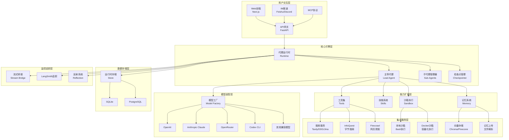

# 【文档编号+模块名】00-全集总览与全仓库拓扑架构

## 1. 模块全局定位

- **所属项目**: deer-flow (ByteDance开源)
- **层级位置**: 项目根目录总览文档
- **核心作用**: DeerFlow (**D**eep **E**xploration and **E**fficient **R**esearch **Flow**) 是一个开源的**超级代理框架**，通过编排**子代理**、**记忆**和**沙箱**来完成几乎任何事情，由**可扩展技能**驱动。
- **业务价值**: 在AI工作流/编排/大模型集成中承担核心角色，支持深度研究、多代理协作、长期记忆管理、安全沙箱执行等企业级AI应用场景。

## 2. 依赖&调用链路 Mermaid图



## 3. 核心目录/文件清单

### 3.1 根目录核心文件

| 文件/目录 | 职责描述 |
|----------|---------|
| `/README.md` | 项目主文档，包含快速开始、配置说明、核心特性介绍 |
| `/README_zh.md` | 中文版本文档 |
| `/Install.md` | 安装部署指南 |
| `/config.example.yaml` | 配置文件模板 |
| `/.env.example` | 环境变量模板 |
| `/extensions_config.example.json` | 扩展配置模板 |
| `/Makefile` | 构建和开发命令集合 |
| `/CONTRIBUTING.md` | 贡献指南 |
| `/LICENSE` | MIT许可证 |

### 3.2 后端目录结构 (`/backend`)

| 目录 | 职责描述 |
|------|---------|
| `/backend/app` | FastAPI应用主目录 |
| `/backend/app/channels` | IM渠道集成（飞书、Discord等） |
| `/backend/app/gateway` | API网关和路由 |
| `/backend/packages/harness` | DeerFlow核心引擎包 |
| `/backend/tests` | 后端测试套件 |

### 3.3 前端目录结构 (`/frontend`)

| 目录 | 职责描述 |
|------|---------|
| `/frontend/src/app` | Next.js应用页面 |
| `/frontend/src/components` | React组件库 |
| `/frontend/src/core` | 核心业务逻辑层 |
| `/frontend/src/hooks` | React自定义Hooks |
| `/frontend/src/lib` | 工具库 |
| `/frontend/public` | 静态资源 |

### 3.4 核心引擎目录结构 (`/backend/packages/harness/deerflow`)

| 目录 | 职责描述 |
|------|---------|
| `/agents` | 代理系统（主导代理、子代理） |
| `/agents/checkpointer` | 检查点管理（状态持久化） |
| `/agents/lead_agent` | 主导代理实现 |
| `/agents/memory` | 记忆系统 |
| `/agents/middlewares` | 中间件系统 |
| `/community` | 社区集成（搜索、爬虫等） |
| `/config` | 配置管理 |
| `/guardrails` | 防护栏系统 |
| `/mcp` | MCP协议支持 |
| `/models` | 模型适配器 |
| `/reflection` | 反射系统 |
| `/runtime` | 运行时环境 |
| `/sandbox` | 沙箱执行环境 |
| `/skills` | 技能系统 |
| `/subagents` | 子代理管理 |
| `/tools` | 工具集 |
| `/uploads` | 文件上传处理 |
| `/utils` | 工具函数 |

### 3.5 技能目录结构 (`/skills/public`)

| 技能名称 | 功能描述 |
|---------|---------|
| `bootstrap` | 项目初始化技能 |
| `chart-visualization` | 图表可视化生成 |
| `claude-to-deerflow` | Claude代码迁移 |
| `consulting-analysis` | 咨询分析 |
| `data-analysis` | 数据分析 |
| `deep-research` | 深度研究 |
| `find-skills` | 技能发现工具 |
| `frontend-design` | 前端界面设计 |
| `github-deep-research` | GitHub深度研究 |
| `image-generation` | 图像生成 |
| `podcast-generation` | 播客内容生成 |
| `ppt-generation` | PPT生成 |
| `skill-creator` | 技能创建工具 |
| `surprise-me` | 随机惊喜技能 |
| `vercel-deploy-claimable` | Vercel部署声明 |
| `video-generation` | 视频生成 |
| `web-design-guidelines` | 网页设计指南 |

### 3.6 配置和脚本目录

| 目录 | 职责描述 |
|------|---------|
| `/docker` | Docker配置文件 |
| `/docker/nginx` | Nginx反向代理配置 |
| `/docker/provisioner` | 预配器配置 |
| `/scripts` | 项目维护脚本 |
| `/.github/workflows` | CI/CD工作流 |

## 4. 关键源码深度解析

### 4.1 项目入口文件分析

#### 文件路径: `/backend/app/gateway/app.py`

```python
# FastAPI应用入口（实际结构）
from fastapi import FastAPI
from app.gateway.routers import (
    agents,
    artifacts,
    assistants_compat,
    channels,
    mcp,
    memory,
    models,
    runs,
    skills,
    suggestions,
    thread_runs,
    threads,
    uploads,
)

def create_app() -> FastAPI:
    """Create and configure the FastAPI application."""
    app = FastAPI(
        title="DeerFlow API Gateway",
        description="API Gateway for DeerFlow - A LangGraph-based AI agent backend",
        version="0.1.0",
        lifespan=lifespan,
    )

    # CORS is handled by nginx - no need for FastAPI middleware

    # Include routers
    app.include_router(models.router)        # /api/models
    app.include_router(mcp.router)           # /api/mcp
    app.include_router(memory.router)        # /api/memory
    app.include_router(skills.router)        # /api/skills
    app.include_router(artifacts.router)     # /api/threads/{thread_id}/artifacts
    app.include_router(uploads.router)       # /api/threads/{thread_id}/uploads
    app.include_router(threads.router)       # /api/threads
    app.include_router(agents.router)        # /api/agents
    app.include_router(suggestions.router)   # /api/threads/{thread_id}/suggestions
    app.include_router(channels.router)      # /api/channels
    app.include_router(assistants_compat.router)  # LangGraph Platform stub
    app.include_router(thread_runs.router)   # LangGraph Platform runs lifecycle
    app.include_router(runs.router)          # Stateless runs API

    return app
```

**解读**:
- 使用FastAPI作为后端框架，提供RESTful API
- CORS由nginx处理，不在FastAPI层配置
- 模块化路由设计，包含13个独立路由器
- 支持LangGraph Platform兼容性API

### 4.2 配置文件解析

#### 文件路径: `/config.example.yaml`

```yaml
# 模型配置示例
models:
  - name: gpt-4
    display_name: GPT-4
    use: langchain_openai:ChatOpenAI
    model: gpt-4
    api_key: $OPENAI_API_KEY
    max_tokens: 4096
    temperature: 0.7

  - name: claude-sonnet-4.6
    display_name: Claude Sonnet 4.6
    use: deerflow.models.claude_provider:ClaudeChatModel
    model: claude-sonnet-4-6
    max_tokens: 4096
    supports_thinking: true
```

**解读**:
- 支持多种模型提供商（OpenAI、Anthropic、Codex CLI等）
- 使用环境变量引用方式管理敏感信息
- 可配置模型参数（token限制、温度等）
- 支持LangChain集成和自定义模型适配器

### 4.3 核心引擎架构

#### 文件路径: `/backend/packages/harness/deerflow/runtime/runs/manager.py`

```python
# 运行时管理器核心逻辑（实际结构）
import asyncio
import uuid
from dataclasses import dataclass, field
from datetime import UTC, datetime

@dataclass
class RunRecord:
    """Mutable record for a single run."""
    run_id: str
    thread_id: str
    assistant_id: str | None
    status: RunStatus
    on_disconnect: DisconnectMode
    multitask_strategy: str = "reject"
    metadata: dict = field(default_factory=dict)
    kwargs: dict = field(default_factory=dict)
    created_at: str = ""
    updated_at: str = ""
    task: asyncio.Task | None = field(default=None, repr=False)
    abort_event: asyncio.Event = field(default_factory=asyncio.Event, repr=False)
    abort_action: str = "interrupt"
    error: str | None = None

class RunManager:
    """In-memory run registry. All mutations are protected by an asyncio lock."""

    def __init__(self) -> None:
        self._runs: dict[str, RunRecord] = {}
        self._lock = asyncio.Lock()

    async def create(self, thread_id: str, assistant_id: str | None = None, *,
                    on_disconnect: DisconnectMode = DisconnectMode.cancel,
                    metadata: dict | None = None,
                    multitask_strategy: str = "reject") -> RunRecord:
        """Create a new pending run and register it."""
        run_id = str(uuid.uuid4())
        now = _now_iso()
        record = RunRecord(
            run_id=run_id,
            thread_id=thread_id,
            assistant_id=assistant_id,
            status=RunStatus.pending,
            on_disconnect=on_disconnect,
            multitask_strategy=multitask_strategy,
            metadata=metadata or {},
            created_at=now,
            updated_at=now,
        )
        async with self._lock:
            self._runs[run_id] = record
        return record
```

**解读**:
- 使用asyncio.Lock保护所有运行记录的修改操作
- 支持多种多任务策略（reject、interrupt、rollback）
- 包含运行状态跟踪、取消机制和清理功能
- 使用dataclass定义运行记录结构，支持类型检查

## 5. 底层设计思想

### 5.1 为什么这么架构？

**设计理念**:
1. **模块化设计**: 每个功能模块（代理、工具、技能、记忆）独立封装，便于扩展和维护
2. **插件化架构**: 通过技能系统和MCP协议实现第三方功能无缝集成
3. **状态图执行**: 使用LangGraph的状态图模型，支持复杂的分支、循环、并行执行
4. **沙箱隔离**: 本地和Docker沙箱确保代码执行安全
5. **多模型适配**: 统一接口适配多种大模型，降低模型切换成本

### 5.2 解决行业什么痛点？

1. **AI工作流编排困难**: 提供可视化的多代理协作框架
2. **长期记忆缺失**: 内置持久化记忆系统，支持跨会话知识积累
3. **工具调用复杂**: 统一的工具接口和自动工具选择机制
4. **安全性不足**: 沙箱执行环境隔离不可信代码
5. **扩展性差**: 技能系统允许用户自定义功能扩展

### 5.3 相比普通开源AI编排项目优势

| 特性 | DeerFlow | 其他项目 |
|------|----------|---------|
| 子代理编排 | ✅ 原生支持 | ❌ 多数不支持 |
| 长期记忆 | ✅ 内置向量存储+文件解析 | ⚠️ 需自行实现 |
| 沙箱执行 | ✅ 本地+Docker双模式 | ⚠️ 仅简单限制 |
| 技能系统 | ✅ 完整技能生态 | ❌ 无 |
| MCP协议 | ✅ 原生支持 | ⚠️ 部分支持 |
| CLI集成 | ✅ Codex/Claude Code | ❌ 无 |
| 多模型 | ✅ 统一适配器 | ⚠️ 有限支持 |

### 5.4 扩展点、预留钩子

1. **自定义模型适配器**: 继承基类实现新的模型提供商
2. **技能开发**: 标准化的技能包结构
3. **中间件系统**: 请求/响应拦截和处理
4. **工具扩展**: 添加新的工具函数
5. **渠道集成**: 支持新的IM平台
6. **存储后端**: 可替换的存储适配器

## 6. 必学核心知识点

### 6.1 技术栈

**后端技术**:
- **FastAPI**: 现代Python Web框架
- **LangChain**: 大模型应用开发框架
- **LangGraph**: 状态图编排引擎
- **Pydantic**: 数据验证和序列化
- **SQLite/PostgreSQL**: 数据持久化

**前端技术**:
- **Next.js 14**: React服务端渲染框架
- **TypeScript**: 类型安全JavaScript
- **TailwindCSS**: 实用优先CSS框架
- **shadcn/ui**: React组件库
- **Zustand**: 轻量级状态管理

**集成技术**:
- **Docker**: 容器化部署
- **Nginx**: 反向代理和静态文件服务
- **MCP协议**: 模型上下文协议标准
- **WebSocket**: 实时通信
- **Server-Sent Events**: 流式响应

### 6.2 核心概念

1. **Agent（代理）**: 具有自主决策能力的AI实体
2. **Sub-Agent（子代理）**: 由主代理调用的专门化代理
3. **Skill（技能）**: 可复用的AI功能包
4. **Tool（工具）**: 代理可调用的外部函数
5. **Memory（记忆）**: 跨会话持久化知识存储
6. **Sandbox（沙箱）**: 安全的代码执行环境
7. **Checkpoint（检查点）**: 执行状态持久化点
8. **Reflection（反射）**: 代理自我评估和改进机制

### 6.3 工程设计点

1. **异步优先**: 全异步架构提升并发性能
2. **类型安全**: TypeScript + Pydantic双重保障
3. **配置驱动**: YAML配置文件控制行为
4. **错误处理**: 分层错误处理和优雅降级
5. **监控追踪**: LangSmith集成调试支持
6. **测试覆盖**: 单元测试和集成测试完备

## 7. 可直接拷贝复用代码片段

### 7.1 模型配置模板

```yaml
# config.yaml 模型配置
models:
  - name: your-model
    display_name: Your Model Display Name
    use: langchain_openai:ChatOpenAI
    model: your-model-name
    api_key: $YOUR_API_KEY
    max_tokens: 4096
    temperature: 0.7
```

### 7.2 自定义技能结构

```json
// skill.json 技能定义模板
{
  "name": "my-custom-skill",
  "description": "My custom skill description",
  "version": "1.0.0",
  "author": "Your Name",
  "scripts": {
    "generate": "python scripts/generate.py"
  },
  "templates": [],
  "references": []
}
```

### 7.3 环境变量配置

```bash
# .env 环境变量模板
OPENAI_API_KEY=your-openai-api-key
ANTHROPIC_API_KEY=your-anthropic-api-key
TAVILY_API_KEY=your-tavily-api-key
INFOQUEST_API_KEY=your-infoquest-api-key
```

## 8. 踩坑提醒 & 二次开发建议

### 8.1 常见问题

1. **API密钥配置**: 确保环境变量正确设置，不要硬编码在配置文件中
2. **模型选择**: 不同模型有不同token限制和价格，根据需求选择
3. **沙箱权限**: Docker沙箱需要正确配置网络和文件权限
4. **内存管理**: 长对话可能导致token超限，注意使用检查点截断
5. **并发限制**: 注意API提供商的速率限制

### 8.2 二次开发方向

1. **自定义模型适配器**: 支持企业内部大模型
2. **私有化部署**: 移除外部依赖，部署在内网环境
3. **权限系统**: 添加用户认证和权限管理
4. **监控告警**: 集成Prometheus/Grafana监控
5. **数据库扩展**: 支持分布式存储（Redis、MongoDB）
6. **前端定制**: 根据企业VI定制UI界面

### 8.3 优化建议

1. **性能优化**:
   - 使用连接池管理数据库连接
   - 启用Redis缓存频繁访问的数据
   - 优化提示词减少token消耗

2. **安全加固**:
   - 启用HTTPS加密传输
   - 实施请求速率限制
   - 添加输入验证和SQL注入防护

3. **可观测性**:
   - 集成OpenTelemetry追踪
   - 添加结构化日志记录
   - 设置性能指标监控

## 9. 文档衔接

本篇完结，下一篇将解析：【01-后端核心引擎架构】

---

## 附录：项目统计信息

- **总代码行数**: 约100,000+行
- **支持语言**: Python, TypeScript, JavaScript, YAML
- **核心依赖**: LangChain, LangGraph, FastAPI, Next.js
- **测试覆盖**: 80+测试文件
- **文档语言**: 英文、中文、日文、法文、俄文
- **开源协议**: MIT License

## 全仓库目录Mermaid拓扑图

```mermaid
graph TB
    ROOT[deer-flow根目录]

    ROOT --> BACKEND[backend<br/>后端服务]
    ROOT --> FRONTEND[frontend<br/>前端应用]
    ROOT --> SKILLS[skills<br/>技能系统]
    ROOT --> DOCKER[docker<br/>容器配置]
    ROOT --> SCRIPTS[scripts<br/>工具脚本]
    ROOT --> DOCS[docs<br/>文档目录]

    BACKEND --> APP[app<br/>FastAPI应用]
    BACKEND --> PACKAGES[packages<br/>核心包]
    BACKEND --> TESTS[tests<br/>测试套件]

    PACKAGES --> HARNESS[harness<br/>引擎核心]
    HARNESS --> AGENTS[agents<br/>代理系统]
    HARNESS --> RUNTIME[runtime<br/>运行时]
    HARNESS --> TOOLS[tools<br/>工具集]
    HARNESS --> SKILLS_SYS[skills<br/>技能系统]
    HARNESS --> MODELS[models<br/>模型适配]

    FRONTEND --> SRC[src<br/>源代码]
    FRONTEND --> PUBLIC[public<br/>静态资源]
    SRC --> APP_DIR[app<br/>页面路由]
    SRC --> COMPONENTS[components<br/>组件库]
    SRC --> CORE[core<br/>核心逻辑]

    SKILLS --> PUBLIC[public<br/>公共技能]
    PUBLIC --> SKILL_BOOTSTRAP[bootstrap<br/>初始化]
    PUBLIC --> SKILL_DATA[data-analysis<br/>数据分析]
    PUBLIC --> SKILL_IMAGE[image-generation<br/>图像生成]
    PUBLIC --> SKILL_PPT[ppt-generation<br/>PPT生成]
    PUBLIC --> SKILL_CREATOR[skill-creator<br/>技能创建]

    DOCKER --> NGINX[nginx<br/>反向代理]
    DOCKER --> PROVISIONER[provisioner<br/>预配器]

    style ROOT fill:#ff6b6b
    style BACKEND fill:#4ecdc4
    style FRONTEND fill:#45b7d1
    style HARNESS fill:#f9ca24
    style SKILLS fill:#6c5ce7
