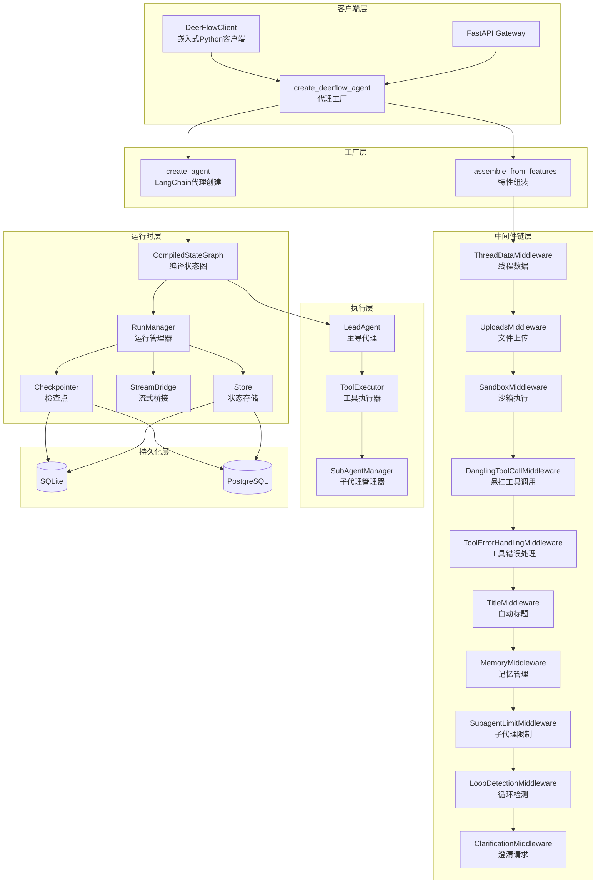
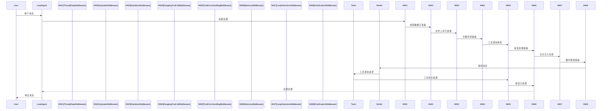

# 【文档编号+模块名】01-后端核心引擎架构

## 1. 模块全局定位

- **所属项目**: deer-flow
- **层级位置**: backend/packages/harness/deerflow
- **核心作用**: DeerFlow后端核心引擎，提供代理工厂、运行时管理、状态持久化、流式桥接等核心能力
- **业务价值**: 作为整个AI代理系统的执行引擎，负责代理生命周期管理、消息处理、工具调用、状态管理等核心逻辑

## 2. 依赖&调用链路 Mermaid图



## 3. 核心目录/文件清单

### 3.1 harness核心目录

| 目录/文件 | 绝对路径 | 职责描述 |
|----------|---------|---------|
| client.py | /backend/packages/harness/deerflow/client.py | 嵌入式Python客户端，提供程序化API |
| agents/ | /backend/packages/harness/deerflow/agents/ | 代理系统核心模块 |
| agents/factory.py | /backend/packages/harness/deerflow/agents/factory.py | 代理工厂，纯参数驱动创建代理 |
| agents/features.py | /backend/packages/harness/deerflow/agents/features.py | 运行时特性定义 |
| agents/thread_state.py | /backend/packages/harness/deerflow/agents/thread_state.py | 线程状态定义 |
| agents/lead_agent/ | /backend/packages/harness/deerflow/agents/lead_agent/ | 主导代理实现 |
| agents/checkpointer/ | /backend/packages/harness/deerflow/agents/checkpointer/ | 检查点管理 |
| agents/memory/ | /backend/packages/harness/deerflow/agents/memory/ | 记忆系统 |
| agents/middlewares/ | /backend/packages/harness/deerflow/agents/middlewares/ | 中间件集合 |
| runtime/ | /backend/packages/harness/deerflow/runtime/ | 运行时环境 |
| runtime/runs/ | /backend/packages/harness/deerflow/runtime/runs/ | 运行管理 |
| runtime/store/ | /backend/packages/harness/deerflow/runtime/store/ | 状态存储 |
| runtime/stream_bridge/ | /backend/packages/harness/deerflow/runtime/stream_bridge/ | 流式桥接 |
| models/ | /backend/packages/harness/deerflow/models/ | 模型适配器 |
| tools/ | /backend/packages/harness/deerflow/tools/ | 工具集 |
| skills/ | /backend/packages/harness/deerflow/skills/ | 技能系统 |
| sandbox/ | /backend/packages/harness/deerflow/sandbox/ | 沙箱执行 |
| subagents/ | /backend/packages/harness/deerflow/subagents/ | 子代理管理 |
| config/ | /backend/packages/harness/deerflow/config/ | 配置管理 |

## 4. 关键源码深度解析

### 4.1 嵌入式客户端

#### 文件路径: `/backend/packages/harness/deerflow/client.py`

```python
"""DeerFlowClient — Embedded Python client for DeerFlow agent system.

Provides direct programmatic access to DeerFlow's agent capabilities
without requiring LangGraph Server or Gateway API processes.

Usage:
    from deerflow.client import DeerFlowClient

    client = DeerFlowClient()
    response = client.chat("Analyze this paper for me", thread_id="my-thread")
    print(response)

    # Streaming
    for event in client.stream("hello"):
        print(event)
"""

@dataclass
class StreamEvent:
    """流式事件数据结构

    Event types align with the LangGraph SSE protocol:
        - "values": Full state snapshot (title, messages, artifacts).
        - "messages-tuple": Per-message update (AI text, tool calls, tool results).
        - "end": Stream finished.

    Attributes:
        type: Event type.
        data: Event payload. Contents vary by type.
    """
    type: str
    data: dict[str, Any] = field(default_factory=dict)


class DeerFlowClient:
    """嵌入式Python客户端

    提供直接程序化访问DeerFlow代理能力，无需LangGraph Server或Gateway API进程。

    Note:
        多轮对话需要checkpointer。没有它，每次stream()/chat()调用都是无状态的
        — thread_id仅用于文件隔离（上传/产物）。

        系统提示词（包括日期、记忆、技能上下文）在内部代理首次创建时生成并缓存，
        直到配置键更改。在长运行进程中调用reset_agent强制刷新。
    """

    def __init__(
        self,
        config_path: str | None = None,
        checkpointer=None,
        *,
        model_name: str | None = None,
        thinking_enabled: bool = True,
        subagent_enabled: bool = False,
        plan_mode: bool = False,
        agent_name: str | None = None,
        middlewares: Sequence[AgentMiddleware] | None = None,
    ):
        """初始化客户端

        加载配置但延迟代理创建到首次使用。

        Args:
            config_path: config.yaml路径。None时使用默认解析。
            checkpointer: LangGraph检查点实例用于状态持久化。
                多轮对话需要。没有检查点时每次调用无状态。
            model_name: 覆盖配置中的默认模型名称。
            thinking_enabled: 启用模型扩展思考。
            subagent_enabled: 启用子代理委派。
            plan_mode: 启用TodoList中间件的计划模式。
            agent_name: 使用的代理名称。
            middlewares: 注入代理的自定义中间件列表。
        """
```

**解读**:
- **嵌入式设计**: 无需独立服务器进程，直接在Python代码中使用
- **延迟初始化**: 代理在首次调用时创建，避免启动开销
- **配置驱动**: 支持外部配置文件和运行时参数覆盖
- **状态管理**: 通过checkpointer实现多轮对话状态持久化
- **流式支持**: StreamEvent结构统一流式响应格式

### 4.2 代理工厂

#### 文件路径: `/backend/packages/harness/deerflow/agents/factory.py`

```python
"""纯参数驱动的DeerFlow代理工厂

create_deerflow_agent接受纯Python参数 — 无YAML文件，无全局单例。
它是SDK级入口点，位于原始langchain.agents.create_agent原语和
配置驱动的make_lead_agent应用工厂之间。
"""

def create_deerflow_agent(
    model: BaseChatModel,
    tools: list[BaseTool] | None = None,
    *,
    system_prompt: str | None = None,
    middleware: list[AgentMiddleware] | None = None,
    features: RuntimeFeatures | None = None,
    extra_middleware: list[AgentMiddleware] | None = None,
    plan_mode: bool = False,
    state_schema: type | None = None,
    checkpointer: BaseCheckpointSaver | None = None,
    name: str = "default",
) -> CompiledStateGraph:
    """从纯Python参数创建DeerFlow代理

    工厂组装本身不读取配置文件。某些注入的运行时组件
    （如task_tool）在调用时可能仍依赖全局配置 —
    完全配置无关运行时是第二阶段目标。

    Parameters
    ----------
    model:
        聊天模型实例。
    tools:
        用户提供的工具。特性注入的工具自动追加。
    system_prompt:
        系统消息。None使用最小默认值。
    middleware:
        **完全接管** — 如果提供，使用此确切列表。
        不能与features或extra_middleware组合。
    features:
        声明式特性标志。不能与middleware组合。
    extra_middleware:
        通过@Next/@Prev定位插入的额外中间件。
        不能与middleware一起使用。
    plan_mode:
        启用TodoMiddleware进行任务跟踪。
    state_schema:
        LangGraph状态类型。默认为ThreadState。
    checkpointer:
        可选持久化后端。
    name:
        代理名称（传递给关心的中间件，如MemoryMiddleware）。
    """
```

**解读**:
- **纯参数驱动**: 摆脱YAML配置依赖，适合SDK集成
- **灵活性**: 支持完全自定义中间件链或声明式特性配置
- **定位系统**: @Next/@Prev注解实现中间件精确定位
- **分层设计**: 工厂层 → 组装层 → 执行层清晰分离

### 4.3 中间件组装逻辑

#### 文件路径: `/backend/packages/harness/deerflow/agents/factory.py`

```python
def _assemble_from_features(
    feat: RuntimeFeatures,
    *,
    name: str = "default",
    plan_mode: bool = False,
    extra_middleware: list[AgentMiddleware] | None = None,
) -> tuple[list[AgentMiddleware], list[BaseTool]]:
    """从feat构建有序中间件链+额外工具

    中间件顺序匹配make_lead_agent（14个中间件）：

      0-2. 沙箱基础设施 (ThreadData → Uploads → Sandbox)
      3.   DanglingToolCallMiddleware (总是)
      4.   GuardrailMiddleware (guardrail特性)
      5.   ToolErrorHandlingMiddleware (总是)
      6.   SummarizationMiddleware (summarization特性)
      7.   TodoMiddleware (plan_mode参数)
      8.   TitleMiddleware (auto_title特性)
      9.   MemoryMiddleware (memory特性)
      10.  ViewImageMiddleware (vision特性)
      11.  SubagentLimitMiddleware (subagent特性)
      12.  LoopDetectionMiddleware (总是)
      13.  ClarificationMiddleware (总是最后)
    """
    chain: list[AgentMiddleware] = []
    extra_tools: list[BaseTool] = []

    # --- [0-2] 沙箱基础设施 ---
    if feat.sandbox is not False:
        if isinstance(feat.sandbox, AgentMiddleware):
            chain.append(feat.sandbox)
        else:
            chain.append(ThreadDataMiddleware(lazy_init=True))
            chain.append(UploadsMiddleware())
            chain.append(SandboxMiddleware(lazy_init=True))

    # --- [3] DanglingToolCall (总是) ---
    chain.append(DanglingToolCallMiddleware())

    # --- [4] Guardrail ---
    if feat.guardrail is not False:
        if isinstance(feat.guardrail, AgentMiddleware):
            chain.append(feat.guardrail)
        else:
            raise ValueError("guardrail=True需要自定义AgentMiddleware实例")

    # ... 其他中间件 ...

    # --- [13] Clarification (总是最后) ---
    chain.append(ClarificationMiddleware())
    extra_tools.append(ask_clarification_tool)

    return chain, extra_tools
```

**解读**:
- **固定顺序**: 中间件按特定顺序排列，确保正确处理流程
- **条件注入**: 根据特性标志动态添加中间件
- **自定义支持**: 允许传入自定义中间件实例替换默认实现
- **工具关联**: 某些中间件会注入额外的工具（如view_image_tool）

### 4.4 运行时入口

#### 文件路径: `/backend/packages/harness/deerflow/runtime/__init__.py`

```python
"""LangGraph兼容运行时 — 运行、流式和生命周期管理

重新导出~deerflow.runtime.runs和~deerflow.runtime.stream_bridge的公共API，
以便消费者可以直接从deerflow.runtime导入。
"""

from .runs import (
    ConflictError,
    DisconnectMode,
    RunManager,
    RunRecord,
    RunStatus,
    UnsupportedStrategyError,
    run_agent
)
from .serialization import (
    serialize,
    serialize_channel_values,
    serialize_lc_object,
    serialize_messages_tuple
)
from .store import (
    get_store,
    make_store,
    reset_store,
    store_context
)
from .stream_bridge import (
    END_SENTINEL,
    HEARTBEAT_SENTINEL,
    MemoryStreamBridge,
    StreamBridge,
    StreamEvent,
    make_stream_bridge
)
```

**解读**:
- **模块化导出**: 按功能分区导出API，便于选择性导入
- **类型安全**: 导出具体异常类型和状态枚举
- **统一接口**: Store、Serialization、StreamBridge三大核心系统

## 5. 底层设计思想

### 5.1 为什么这么架构？

**设计理念**:

1. **工厂模式解耦**: 通过工厂层抽象，分离配置、组装、执行三个阶段
2. **中间件管道**: 将代理处理流程拆分为可组合的中间件单元
3. **状态图执行**: 基于LangGraph的声明式状态图，支持复杂控制流
4. **双模式运行**: 支持嵌入式客户端和网关服务两种部署方式
5. **检查点机制**: 实现执行状态的持久化和恢复

### 5.2 核心设计模式

| 模式 | 应用场景 | 优势 |
|------|---------|------|
| 工厂模式 | 代理创建 | 解耦配置和实例化 |
| 中间件模式 | 请求处理 | 可组合、可扩展的处理链 |
| 策略模式 | 特性开关 | 运行时行为切换 |
| 观察者模式 | 流式事件 | 实时状态推送 |
| 状态模式 | 执行流程 | 清晰的状态转换 |

### 5.3 中间件链设计



## 6. 必学核心知识点

### 6.1 技术点

1. **LangChain Agent框架**: 基于LangChain的代理抽象和工具调用机制
2. **LangGraph状态图**: 声明式状态机，支持分支、循环、并行执行
3. **异步编程模式**: 全异步架构，async/await协程并发
4. **检查点机制**: 执行状态快照和恢复，支持长运行任务
5. **中间件定位系统**: @Next/@Prev注解实现精确位置控制

### 6.2 核心概念

| 概念 | 定义 | 用途 |
|------|------|------|
| CompiledStateGraph | 编译后的状态图 | 代理执行蓝图 |
| ThreadState | 线程状态 | 对话上下文数据结构 |
| AgentMiddleware | 代理中间件 | 请求/响应拦截处理 |
| Checkpointer | 检查点 | 状态持久化 |
| StreamBridge | 流式桥接 | 事件流转换 |
| RunnableConfig | 可运行配置 | 执行参数传递 |

### 6.3 工程设计点

1. **延迟初始化**: 代理和组件在首次使用时创建，减少启动时间
2. **配置分层**: 全局配置 → 代理配置 → 运行时配置，支持覆盖
3. **错误边界**: 中间件级别的错误捕获和处理
4. **资源清理**: 上下文管理器确保资源正确释放
5. **类型注解**: 完整的类型提示支持IDE和静态检查

## 7. 可直接拷贝复用代码片段

### 7.1 创建简单代理

```python
from deerflow.client import DeerFlowClient

# 创建客户端
client = DeerFlowClient()

# 简单对话
response = client.chat("分析这篇论文")
print(response)
```

### 7.2 流式响应处理

```python
from deerflow.client import DeerFlowClient

client = DeerFlowClient()

# 流式处理
for event in client.stream("帮我写一个Python脚本"):
    if event.type == "messages-tuple":
        # 处理消息更新
        for msg in event.data.get("messages", []):
            print(f"消息: {msg.content}")
    elif event.type == "values":
        # 处理完整状态
        print(f"标题: {event.data.get('title')}")
```

### 7.3 自定义中间件

```python
from langchain.agents.middleware import AgentMiddleware
from langchain_core.messages import BaseMessage

class CustomMiddleware(AgentMiddleware):
    """自定义中间件示例"""

    async def on_before_end(
        self,
        messages: list[BaseMessage],
        /,
        **kwargs: Any,
    ) -> list[BaseMessage]:
        """代理返回前调用"""
        # 自定义前置处理逻辑
        print(f"处理 {len(messages)} 条消息")
        return messages

# 使用自定义中间件
from deerflow.agents.factory import create_deerflow_agent

agent = create_deerflow_agent(
    model=model,
    tools=tools,
    extra_middleware=[CustomMiddleware()]
)
```

### 7.4 状态持久化

```python
from langgraph.checkpoint.sqlite import SqliteSaver
from deerflow.client import DeerFlowClient

# 创建检查点
checkpointer = SqliteSaver.from_conn_string("deerflow.db")

# 创建带持久化的客户端
client = DeerFlowClient(checkpointer=checkpointer)

# 多轮对话
response1 = client.chat("你好", thread_id="user-123")
response2 = client.chat("刚才说了什么", thread_id="user-123")
# 第二次调用能记住第一次的对话
```

## 8. 踩坑提醒 & 二次开发建议

### 8.1 常见问题

1. **检查点缺失**: 没有checkpointer时，多轮对话无法保持上下文
2. **中间件顺序**: 错误的中间件顺序可能导致功能异常
3. **工具命名冲突**: 多个工具同名时，后注册的会被忽略
4. **状态序列化**: 复杂对象在状态中可能无法正确序列化
5. **异步上下文**: 在同步环境中调用异步方法会阻塞

### 8.2 调试技巧

1. **启用详细日志**:
```python
import logging
logging.basicConfig(level=logging.DEBUG)
```

2. **检查中间件链**:
```python
from deerflow.agents.factory import create_deerflow_agent

agent = create_deerflow_agent(...)
# 打印中间件链
for mw in agent.middlewares:
    print(type(mw).__name__)
```

3. **状态检查点检查**:
```python
# 查看检查点状态
checkpointer = agent.checkpointer
state = checkpointer.get(config)
print(state)
```

### 8.3 二次开发方向

1. **自定义中间件**: 实现特定业务逻辑的拦截器
2. **自定义工具**: 扩展代理能力边界
3. **自定义检查点**: 支持Redis、MongoDB等后端
4. **自定义序列化**: 优化特定类型的序列化性能
5. **自定义流式桥接**: 支持WebSocket、gRPC等协议

### 8.4 性能优化

1. **连接池**: 复用模型和数据库连接
2. **缓存策略**: 缓存系统提示词和配置解析
3. **批量处理**: 合并多个工具调用请求
4. **流式优先**: 优先使用流式API减少延迟
5. **懒加载**: 延迟加载非关键组件

## 9. 文档衔接

本篇完结，下一篇将解析：【02-中间件系统详解】

---

## 附录：核心API速查表

### DeerFlowClient

| 方法 | 参数 | 返回值 | 描述 |
|------|------|--------|------|
| `chat()` | message, thread_id | str | 同步对话 |
| `stream()` | message, thread_id | Iterator[StreamEvent] | 流式对话 |
| `reset_agent()` | - | None | 重置代理 |
| `list_models()` | - | list[dict] | 列出模型 |
| `list_skills()` | - | list[dict] | 列出技能 |

### create_deerflow_agent

| 参数 | 类型 | 默认值 | 描述 |
|------|------|--------|------|
| model | BaseChatModel | 必填 | 聊天模型 |
| tools | list[BaseTool] | None | 工具列表 |
| system_prompt | str | None | 系统提示词 |
| middleware | list[AgentMiddleware] | None | 完全自定义中间件 |
| features | RuntimeFeatures | None | 特性配置 |
| plan_mode | bool | False | 计划模式 |
| checkpointer | BaseCheckpointSaver | None | 检查点 |

### StreamEvent类型

| 类型 | 描述 | 数据结构 |
|------|------|----------|
| values | 完整状态快照 | {title, messages, artifacts} |
| messages-tuple | 消息更新 | {messages: [BaseMessage]} |
| end | 流结束 | {} |
