# 【01】配置系统深度解析

## 1. 模块全局定位

- **所属项目**：deer-flow
- **层级位置**：`backend/packages/harness/deerflow/config/`
- **核心作用**：提供统一配置管理、环境变量解析、版本检测、热更新支持
- **业务价值**：作为系统的"配置中枢"，管理模型、沙箱、工具、技能、记忆等20+配置模块，支持多环境部署与运行时热更新
- **设计初衷**：设计用于解决"配置复杂性与可维护性"问题——通过Pydantic模型类型安全、分层加载、单例缓存、mtime热更新，实现配置统一管理

## 2. 核心设计理念

配置系统采用 **Pydantic类型安全 + 单例缓存模式 + mtime热更新 + 分层模块加载** 的四层设计理念：

1. **Pydantic类型安全**：所有配置模块继承`BaseModel`，提供运行时类型验证、默认值、序列化支持
2. **单例缓存模式**：通过全局变量缓存配置实例，避免重复解析文件
3. **mtime热更新**：检测文件修改时间变化自动重载配置
4. **分层模块加载**：主配置加载后，依次加载各子模块配置到独立全局变量

## 3. 架构原理图

```mermaid
graph TB
    subgraph "配置消费者 Config Consumers"
        AGENT["Lead Agent<br/>get_app_config"]
        FACTORY["Model Factory<br/>create_chat_model"]
        SKILLS["Skills Loader<br/>load_skills"]
        MCP["MCP Client<br/>build_servers_config"]
        GATEWAY["Gateway API<br/>路由处理器"]
    end

    subgraph "配置核心 Config Core"
        GET["get_app_config()<br/>单例获取入口"]
        MTIME["_get_config_mtime<br/>mtime检测"]
        COMPARE["路径与mtime比较<br/>判断是否重载"]
        LOAD["_load_and_cache_app_config<br/>加载并缓存"]
        FROM["AppConfig.from_file<br/>文件解析"]
    end

    subgraph "配置解析 Config Parsing"
        PATH["resolve_config_path<br/>路径解析优先级"]
        VERSION["_check_config_version<br/>版本检测"]
        ENV["resolve_env_variables<br/>环境变量递归解析"]
        YAML["yaml.safe_load<br/>YAML解析"]
        VALIDATE["model_validate<br/>Pydantic验证"]
    end

    subgraph "模块加载 Module Loading"
        TITLE["title_config<br/>标题配置"]
        SUMM["summarization_config<br/>摘要配置"]
        MEM["memory_config<br/>记忆配置"]
        SUB["subagents_config<br/>子代理配置"]
        TOOL["tool_search_config<br/>工具搜索配置"]
        GUARD["guardrails_config<br/>防护栏配置"]
        EXT["extensions_config<br/>扩展配置"]
        ACP["acp_config<br/>ACP代理配置"]
    end

    subgraph "缓存管理 Cache Management"
        SINGLETON["_app_config<br/>全局单例"]
        PATH_CACHE["_app_config_path<br/>缓存路径"]
        MTIME_CACHE["_app_config_mtime<br/>缓存mtime"]
        CUSTOM["_app_config_is_custom<br/>自定义标志"]
    end

    subgraph "配置文件 Config Files"
        YAML_FILE["config.yaml<br/>主配置文件"]
        EXAMPLE["config.example.yaml<br/>示例配置"]
        EXT_FILE["extensions_config.json<br/>扩展配置"]
        ENV_VARS["环境变量<br/>$OPENAI_API_KEY等"]
    end

    AGENT --> GET
    FACTORY --> GET
    SKILLS --> GET
    MCP --> GET
    GATEWAY --> GET

    GET --> MTIME
    GET --> COMPARE
    COMPARE --> LOAD
    LOAD --> FROM

    FROM --> PATH
    FROM --> VERSION
    FROM --> ENV
    FROM --> YAML
    FROM --> VALIDATE

    FROM --> TITLE
    FROM --> SUMM
    FROM --> MEM
    FROM --> SUB
    FROM --> TOOL
    FROM --> GUARD
    FROM --> EXT
    FROM --> ACP

    LOAD --> SINGLETON
    LOAD --> PATH_CACHE
    LOAD --> MTIME_CACHE
    LOAD --> CUSTOM

    PATH --> YAML_FILE
    VERSION --> EXAMPLE
    ENV --> ENV_VARS
    EXT --> EXT_FILE

    classDef consumer fill:#e1f5fe
    classDef core fill:#f3e5f5
    classDef parsing fill:#e8f5e9
    classDef module fill:#fff3e0
    classDef cache fill:#fce4ec
    classDef files fill:#fff9c4

    class AGENT,FACTORY,SKILLS,MCP,GATEWAY consumer
    class GET,MTIME,COMPARE,LOAD,FROM core
    class PATH,VERSION,ENV,YAML,VALIDATE parsing
    class TITLE,SUMM,MEM,SUB,TOOL,GUARD,EXT,ACP module
    class SINGLETON,PATH_CACHE,MTIME_CACHE,CUSTOM cache
    class YAML_FILE,EXAMPLE,EXT_FILE,ENV_VARS files
```



### 图表设计解读

该链路图体现了**单例缓存 + mtime热更新 + 分层加载**的设计逻辑：

1. **单例缓存模式**：`get_app_config()`返回全局单例，避免重复解析配置文件；通过`_app_config`、`_app_config_path`、`_app_config_mtime`三个全局变量管理缓存状态

2. **mtime热更新检测**：每次调用`get_app_config()`时比较当前mtime与缓存mtime，文件修改后自动重新加载；实现配置文件编辑后立即生效

3. **路径解析优先级**：按"显式参数 → 环境变量 → 当前目录 → 父目录"优先级查找配置文件；适配多环境部署场景

4. **版本检测机制**：比较用户配置版本与示例配置版本，过期时发出警告并提示运行`make config-upgrade`

5. **分层模块加载**：主配置文件加载后，依次加载title、summarization、memory等子模块配置，每个模块独立管理全局单例

## 4. 核心源码解析

### 4.1 配置路径解析：多优先级查找

**文件路径**：`/data/deer-flow-main/backend/packages/harness/deerflow/config/app_config.py`

**行号范围**：第47-74行

```python
@classmethod
def resolve_config_path(cls, config_path: str | None = None) -> Path:
    """Resolve the config file path.

    Priority:
    1. If provided `config_path` argument, use it.
    2. If provided `DEER_FLOW_CONFIG_PATH` environment variable, use it.
    3. Otherwise, first check the `config.yaml` in the current directory, then fallback to `config.yaml` in the parent directory.
    """
    if config_path:
        path = Path(config_path)
        if not Path.exists(path):
            raise FileNotFoundError(f"Config file specified by param `config_path` not found at {path}")
        return path
    elif os.getenv("DEER_FLOW_CONFIG_PATH"):
        path = Path(os.getenv("DEER_FLOW_CONFIG_PATH"))
        if not Path.exists(path):
            raise FileNotFoundError(f"Config file specified by environment variable `DEER_FLOW_CONFIG_PATH` not found at {path}")
        return path
    else:
        # Check if the config.yaml is in the current directory
        path = Path(os.getcwd()) / "config.yaml"
        if not path.exists():
            # Check if the config.yaml is in the parent directory of CWD
            path = Path(os.getcwd()).parent / "config.yaml"
            if not path.exists():
                raise FileNotFoundError("`config.yaml` file not found at the current directory nor its parent directory")
        return path
```

#### 逐行解读

- **第56-59行（显式参数优先）**：函数参数`config_path`优先级最高；设计考量是"测试友好"，单元测试可指定临时配置文件

- **第61-65行（环境变量覆盖）**：`DEER_FLOW_CONFIG_PATH`环境变量次优先；设计考量是"容器化部署"，Docker/K8s通过环境变量注入配置路径

- **第68-73行（目录回退策略）**：当前目录 → 父目录；设计考量是"项目根目录默认"，backend/子目录启动时自动使用项目根目录配置

- **第73行（明确错误信息）**：配置文件不存在时抛出`FileNotFoundError`；设计考量是"快速失败"，启动时明确告知配置缺失而非使用默认值

---

### 4.2 环境变量递归解析：$前缀替换

**文件路径**：`/data/deer-flow-main/backend/packages/harness/deerflow/config/app_config.py`

**行号范围**：第184-207行

```python
@classmethod
def resolve_env_variables(cls, config: Any) -> Any:
    """Recursively resolve environment variables in the config.

    Environment variables are resolved using the `os.getenv` function. Example: $OPENAI_API_KEY

    Args:
        config: The config to resolve environment variables in.

    Returns:
        The config with environment variables resolved.
    """
    if isinstance(config, str):
        if config.startswith("$"):
            env_value = os.getenv(config[1:])
            if env_value is None:
                raise ValueError(f"Environment variable {config[1:]} not found for config value {config}")
            return env_value
        return config
    elif isinstance(config, dict):
        return {k: cls.resolve_env_variables(v) for k, v in config.items()}
    elif isinstance(config, list):
        return [cls.resolve_env_variables(item) for item in config]
    return config
```

#### 逐行解读

- **第196-201行（字符串处理）**：检测`$`前缀，提取环境变量名并替换；设计考量是"显式标记"，`$`前缀明确标识需要替换的值

- **第200行（严格错误）**：环境变量不存在时抛出`ValueError`；设计考量是"配置完整性"，缺失敏感信息（如API密钥）应立即失败而非使用空值

- **第203-204行（字典递归）**：递归处理字典值；设计考量是"深度遍历"，支持嵌套配置结构（如`models[0].api_key`）

- **第205-206行（列表递归）**：递归处理列表元素；设计考量是"数组支持"，处理`models`数组等列表配置

---

### 4.3 配置版本检测：过期警告

**文件路径**：`/data/deer-flow-main/backend/packages/harness/deerflow/config/app_config.py`

**行号范围**：第139-182行

```python
@classmethod
def _check_config_version(cls, config_data: dict, config_path: Path) -> None:
    """Check if the user's config.yaml is outdated compared to config.example.yaml.

    Emits a warning if the user's config_version is lower than the example's.
    Missing config_version is treated as version 0 (pre-versioning).
    """
    try:
        user_version = int(config_data.get("config_version", 0))
    except (TypeError, ValueError):
        user_version = 0

    # Find config.example.yaml by searching config.yaml's directory and its parents
    example_path = None
    search_dir = config_path.parent
    for _ in range(5):  # search up to 5 levels
        candidate = search_dir / "config.example.yaml"
        if candidate.exists():
            example_path = candidate
            break
        parent = search_dir.parent
        if parent == search_dir:
            break
        search_dir = parent
    if example_path is None:
        return

    try:
        with open(example_path, encoding="utf-8") as f:
            example_data = yaml.safe_load(f)
        raw = example_data.get("config_version", 0) if example_data else 0
        try:
            example_version = int(raw)
        except (TypeError, ValueError):
            example_version = 0
    except Exception:
        return

    if user_version < example_version:
        logger.warning(
            "Your config.yaml (version %d) is outdated — the latest version is %d. Run `make config-upgrade` to merge new fields into your config.",
            user_version,
            example_version,
        )
```

#### 逐行解读

- **第147-149行（版本号解析）**：缺失`config_version`时默认为0；设计考量是"向后兼容"，版本检测系统引入前的配置文件视为版本0

- **第152-162行（向上搜索示例文件）**：从配置文件目录向上搜索最多5层；设计考量是"灵活定位"，示例文件可能在项目根目录或子目录

- **第177-182行（过期警告）**：用户版本低于示例版本时记录警告；设计考量是"非阻塞提示"，警告不阻止启动，只提醒用户升级

- **第181行（Make命令提示）**：建议运行`make config-upgrade`；设计考量是"操作指引"，明确告知用户如何升级配置

---

### 4.4 单例缓存与热更新：mtime驱动重载

**文件路径**：`/data/deer-flow-main/backend/packages/harness/deerflow/config/app_config.py`

**行号范围**：第269-294行

```python
def get_app_config() -> AppConfig:
    """Get the DeerFlow config instance.

    Returns a cached singleton instance and automatically reloads it when the
    underlying config file path or modification time changes. Use
    `reload_app_config()` to force a reload, or `reset_app_config()` to clear
    the cache.
    """
    global _app_config, _app_config_path, _app_config_mtime

    if _app_config is not None and _app_config_is_custom:
        return _app_config

    resolved_path = AppConfig.resolve_config_path()
    current_mtime = _get_config_mtime(resolved_path)

    should_reload = _app_config is None or _app_config_path != resolved_path or _app_config_mtime != current_mtime
    if should_reload:
        if _app_config_path == resolved_path and _app_config_mtime is not None and current_mtime is not None and _app_config_mtime != current_mtime:
            logger.info(
                "Config file has been modified (mtime: %s -> %s), reloading AppConfig",
                _app_config_mtime,
                current_mtime,
            )
        _load_and_cache_app_config(str(resolved_path))
    return _app_config
```

#### 逐行解读

- **第279-280行（自定义配置短路）**：`_app_config_is_custom=True`时直接返回；设计考量是"测试隔离"，测试注入的mock配置不应被热更新覆盖

- **第285行（重载条件）**：三条件OR判断（无缓存、路径变化、mtime变化）；设计考量是"完整检测"，覆盖所有需要重载的场景

- **第286-291行（变更日志）**：仅当mtime变化时记录日志；设计考量是"信息精确"，路径变化不记录mtime变更日志

- **第293行（加载并缓存）**：调用`_load_and_cache_app_config`更新全局变量；设计考量是"原子操作"，路径、mtime、配置同时更新

---

### 4.5 分层模块加载：独立全局单例

**文件路径**：`/data/deer-flow-main/backend/packages/harness/deerflow/config/app_config.py`

**行号范围**：第97-134行

```python
# Load title config if present
if "title" in config_data:
    load_title_config_from_dict(config_data["title"])

# Load summarization config if present
if "summarization" in config_data:
    load_summarization_config_from_dict(config_data["summarization"])

# Load memory config if present
if "memory" in config_data:
    load_memory_config_from_dict(config_data["memory"])

# Load subagents config if present
if "subagents" in config_data:
    load_subagents_config_from_dict(config_data["subagents"])

# Load tool_search config if present
if "tool_search" in config_data:
    load_tool_search_config_from_dict(config_data["tool_search"])

# Load guardrails config if present
if "guardrails" in config_data:
    load_guardrails_config_from_dict(config_data["guardrails"])

# Load checkpointer config if present
if "checkpointer" in config_data:
    load_checkpointer_config_from_dict(config_data["checkpointer"])

# Load stream bridge config if present
if "stream_bridge" in config_data:
    load_stream_bridge_config_from_dict(config_data["stream_bridge"])

# Always refresh ACP agent config so removed entries do not linger across reloads.
load_acp_config_from_dict(config_data.get("acp_agents", {}))

# Load extensions config separately (it's in a different file)
extensions_config = ExtensionsConfig.from_file()
config_data["extensions"] = extensions_config.model_dump()
```

#### 逐行解读

- **第98-99行（条件加载）**：检查配置键存在后再加载；设计考量是"可选配置"，title等模块可省略

- **第130行（ACP强制刷新）**：无论配置是否存在都调用加载函数；设计考量是"配置清理"，重载时清除已删除的ACP代理配置

- **第133-134行（独立文件加载）**：`extensions_config`从单独文件加载；设计考量是"关注点分离"，MCP与技能配置独立于主配置文件

---

### 4.6 扩展配置：MCP与技能统一管理

**文件路径**：`/data/deer-flow-main/backend/packages/harness/deerflow/config/extensions_config.py`

**行号范围**：第119-145行

```python
@classmethod
def from_file(cls, config_path: str | None = None) -> "ExtensionsConfig":
    """Load extensions config from JSON file.

    See `resolve_config_path` for more details.

    Args:
        config_path: Path to the extensions config file.

    Returns:
        ExtensionsConfig: The loaded config, or empty config if file not found.
    """
    resolved_path = cls.resolve_config_path(config_path)
    if resolved_path is None:
        # Return empty config if extensions config file is not found
        return cls(mcp_servers={}, skills={})

    try:
        with open(resolved_path, encoding="utf-8") as f:
            config_data = json.load(f)
        cls.resolve_env_variables(config_data)
        return cls.model_validate(config_data)
    except json.JSONDecodeError as e:
        raise ValueError(f"Extensions config file at {resolved_path} is not valid JSON: {e}") from e
    except Exception as e:
        raise RuntimeError(f"Failed to load extensions config from {resolved_path}: {e}") from e
```

#### 逐行解读

- **第131-134行（可选文件）**：文件不存在时返回空配置；设计考量是"优雅降级"，扩展配置为可选项

- **第137-138行（JSON解析）**：使用`json.load`而非`yaml.safe_load`；设计考量是"格式区分"，扩展配置使用JSON格式便于编辑

- **第139行（环境变量解析）**：调用类方法解析环境变量；设计考量是"复用逻辑"，与主配置使用相同的解析机制

- **第140行（Pydantic验证）**：通过`model_validate`验证数据结构；设计考量是"类型安全"，确保配置符合预期结构

---

### 4.7 路径配置系统：虚拟路径与安全解析

**文件路径**：`/data/deer-flow-main/backend/packages/harness/deerflow/config/paths.py`

**行号范围**：第184-218行

```python
def resolve_virtual_path(self, thread_id: str, virtual_path: str) -> Path:
    """Resolve a sandbox virtual path to the actual host filesystem path.

    Args:
        thread_id: The thread ID.
        virtual_path: Virtual path as seen inside the sandbox, e.g.
                      ``/mnt/user-data/outputs/report.pdf``.
                      Leading slashes are stripped before matching.

    Returns:
        The resolved absolute host filesystem path.

    Raises:
        ValueError: If the path does not start with the expected virtual
                    prefix or a path-traversal attempt is detected.
    """
    stripped = virtual_path.lstrip("/")
    prefix = VIRTUAL_PATH_PREFIX.lstrip("/")

    # Require an exact segment-boundary match to avoid prefix confusion
    # (e.g. reject paths like "mnt/user-dataX/...").
    if stripped != prefix and not stripped.startswith(prefix + "/"):
        raise ValueError(f"Path must start with /{prefix}")

    relative = stripped[len(prefix) :].lstrip("/")
    base = self.sandbox_user_data_dir(thread_id).resolve()
    actual = (base / relative).resolve()

    try:
        actual.relative_to(base)
    except ValueError:
        raise ValueError("Access denied: path traversal detected")

    return actual
```

#### 逐行解读

- **第200-205行（前缀验证）**：确保路径以`/mnt/user-data`开头；设计考量是"边界安全"，防止前缀混淆攻击（如`mnt/user-dataX`）

- **第208行（相对路径提取）**：去除虚拟前缀获取相对路径；设计考量是"路径标准化"，统一处理前导斜杠

- **第209-210行（基础路径解析）**：解析线程的基础目录；设计考量是"线程隔离"，每个线程有独立的数据目录

- **第212-215行（路径穿越检测）**：使用`relative_to`验证路径未穿越基础目录；设计考量是"安全防护"，防止`../`攻击访问敏感文件

---

### 4.8 记忆配置：防抖与置信度阈值

**文件路径**：`/data/deer-flow-main/backend/packages/harness/deerflow/config/memory_config.py`

**行号范围**：第1-62行

```python
"""Configuration for memory mechanism."""

from pydantic import BaseModel, Field


class MemoryConfig(BaseModel):
    """Configuration for global memory mechanism."""

    enabled: bool = Field(
        default=True,
        description="Whether to enable memory mechanism",
    )
    storage_path: str = Field(
        default="",
        description=(
            "Path to store memory data. "
            "If empty, defaults to `{base_dir}/memory.json` (see Paths.memory_file). "
            "Absolute paths are used as-is. "
            "Relative paths are resolved against `Paths.base_dir` "
            "(not the backend working directory). "
            "Note: if you previously set this to `.deer-flow/memory.json`, "
            "the file will now be resolved as `{base_dir}/.deer-flow/memory.json`; "
            "migrate existing data or use an absolute path to preserve the old location."
        ),
    )
    storage_class: str = Field(
        default="deerflow.agents.memory.storage.FileMemoryStorage",
        description="The class path for memory storage provider",
    )
    debounce_seconds: int = Field(
        default=30,
        ge=1,
        le=300,
        description="Seconds to wait before processing queued updates (debounce)",
    )
    model_name: str | None = Field(
        default=None,
        description="Model name to use for memory updates (None = use default model)",
    )
    max_facts: int = Field(
        default=100,
        ge=10,
        le=500,
        description="Maximum number of facts to store",
    )
    fact_confidence_threshold: float = Field(
        default=0.7,
        ge=0.0,
        le=1.0,
        description="Minimum confidence threshold for storing facts",
    )
    injection_enabled: bool = Field(
        default=True,
        description="Whether to inject memory into system prompt",
    )
    max_injection_tokens: int = Field(
        default=2000,
        ge=100,
        le=8000,
        description="Maximum tokens to use for memory injection",
    )
```

#### 逐行解读

- **第30-34行（防抖配置）**：`debounce_seconds`设置30秒默认值；设计考量是"性能优化"，避免频繁写入存储

- **第40-44行（事实数量限制）**：`max_facts`限制100-500条；设计考量是"内存控制"，防止记忆数据无限增长

- **第46-50行（置信度阈值）**：`fact_confidence_threshold`默认0.7；设计考量是"质量过滤"，只存储高置信度信息

- **第52-61行（注入控制）**：`injection_enabled`与`max_injection_tokens`；设计考量是"上下文管理"，控制记忆注入对token消耗的影响

---

### 4.9 子代理配置：超时管理

**文件路径**：`/data/deer-flow-main/backend/packages/harness/deerflow/config/subagents_config.py`

**行号范围**：第1-65行

```python
"""Configuration for the subagent system loaded from config.yaml."""

import logging

from pydantic import BaseModel, Field

logger = logging.getLogger(__name__)


class SubagentOverrideConfig(BaseModel):
    """Per-agent configuration overrides."""

    timeout_seconds: int | None = Field(
        default=None,
        ge=1,
        description="Timeout in seconds for this subagent (None = use global default)",
    )


class SubagentsAppConfig(BaseModel):
    """Configuration for the subagent system."""

    timeout_seconds: int = Field(
        default=900,
        ge=1,
        description="Default timeout in seconds for all subagents (default: 900 = 15 minutes)",
    )
    agents: dict[str, SubagentOverrideConfig] = Field(
        default_factory=dict,
        description="Per-agent configuration overrides keyed by agent name",
    )

    def get_timeout_for(self, agent_name: str) -> int:
        """Get the effective timeout for a specific agent.

        Args:
            agent_name: The name of the subagent.

        Returns:
            The timeout in seconds, using per-agent override if set, otherwise global default.
        """
        override = self.agents.get(agent_name)
        if override is not None and override.timeout_seconds is not None:
            return override.timeout_seconds
        return self.timeout_seconds
```

#### 逐行解读

- **第23-27行（全局超时）**：默认900秒（15分钟）；设计考量是"长时间任务支持"，子代理可能执行复杂任务

- **第28-31行（按代理覆盖）**：`agents`字典支持单个代理覆盖；设计考量是"灵活配置"，不同代理可能有不同超时需求

- **第33-45行（超时获取逻辑）**：优先使用代理特定超时，回退到全局默认；设计考量是"配置继承"，避免重复设置

---

### 4.10 OAuth配置：MCP服务器认证

**文件路径**：`/data/deer-flow-main/backend/packages/harness/deerflow/config/extensions_config.py`

**行号范围**：第11-32行

```python
class McpOAuthConfig(BaseModel):
    """OAuth configuration for an MCP server (HTTP/SSE transports)."""

    enabled: bool = Field(default=True, description="Whether OAuth token injection is enabled")
    token_url: str = Field(description="OAuth token endpoint URL")
    grant_type: Literal["client_credentials", "refresh_token"] = Field(
        default="client_credentials",
        description="OAuth grant type",
    )
    client_id: str | None = Field(default=None, description="OAuth client ID")
    client_secret: str | None = Field(default=None, description="OAuth client secret")
    refresh_token: str | None = Field(default=None, description="OAuth refresh token (for refresh_token grant)")
    scope: str | None = Field(default=None, description="OAuth scope")
    audience: str | None = Field(default=None, description="OAuth audience (provider-specific)")
    token_field: str = Field(default="access_token", description="Field name containing access token in token response")
    token_type_field: str = Field(default="token_type", description="Field name containing token type in token response")
    expires_in_field: str = Field(default="expires_in", description="Field name containing expiry (seconds) in token response")
    default_token_type: str = Field(default="Bearer", description="Default token type when missing in token response")
    refresh_skew_seconds: int = Field(default=60, description="Refresh token this many seconds before expiry")
    extra_token_params: dict[str, str] = Field(default_factory=dict, description="Additional form params sent to token endpoint")
    model_config = ConfigDict(extra="allow")
```

#### 逐行解读

- **第16-18行（授权类型）**：支持`client_credentials`和`refresh_token`；设计考量是"OAuth标准"，覆盖服务到服务和刷新令牌场景

- **第25-27行（响应字段配置）**：可配置响应字段名；设计考量是"提供商兼容性"，不同OAuth提供商可能使用不同字段名

- **第29行（刷新偏移）**：默认60秒提前刷新；设计考量是"时钟容错"，避免因时钟偏差导致令牌过期

---

### 4.11 追踪配置：环境变量优先级

**文件路径**：`/data/deer-flow-main/backend/packages/harness/deerflow/config/tracing_config.py`

**行号范围**：第54-86行

```python
def get_tracing_config() -> TracingConfig:
    """Get the current tracing configuration from environment variables.

    ``LANGSMITH_*`` variables take precedence over their legacy ``LANGCHAIN_*``
    counterparts.  For boolean flags (``enabled``), the *first* variable that is
    present and non-empty in the priority list is the sole authority – its value
    is parsed and returned without consulting the remaining candidates.  Accepted
    truthy values are ``1``, ``true``, ``yes``, and ``on`` (case-insensitive);
    any other non-empty value is treated as falsy.

    Priority order:
        enabled  : LANGSMITH_TRACING > LANGCHAIN_TRACING_V2 > LANGCHAIN_TRACING
        api_key  : LANGSMITH_API_KEY  > LANGCHAIN_API_KEY
        project  : LANGSMITH_PROJECT  > LANGCHAIN_PROJECT   (default: "deer-flow")
        endpoint : LANGSMITH_ENDPOINT > LANGCHAIN_ENDPOINT  (default: https://api.smith.langchain.com)

    Returns:
        TracingConfig with current settings.
    """
    global _tracing_config
    if _tracing_config is not None:
        return _tracing_config
    with _config_lock:
        if _tracing_config is not None:  # Double-check after acquiring lock
            return _tracing_config
        _tracing_config = TracingConfig(
            # Keep compatibility with both legacy LANGCHAIN_* and newer LANGSMITH_* variables.
            enabled=_env_flag_preferred("LANGSMITH_TRACING", "LANGCHAIN_TRACING_V2", "LANGCHAIN_TRACING"),
            api_key=_first_env_value("LANGSMITH_API_KEY", "LANGCHAIN_API_KEY"),
            project=_first_env_value("LANGSMITH_PROJECT", "LANGCHAIN_PROJECT") or "deer-flow",
            endpoint=_first_env_value("LANGSMITH_ENDPOINT", "LANGCHAIN_ENDPOINT") or "https://api.smith.langchain.com",
        )
        return _tracing_config
```

#### 逐行解读

- **第76-77行（双重检查锁）**：锁内再次检查`_tracing_config`；设计考量是"线程安全"，避免多线程竞争重复初始化

- **第81行（环境变量兼容）**：同时支持新旧两套环境变量；设计考量是"向后兼容"，平滑迁移到新命名

- **第83-84行（默认值）**：project默认"deer-flow"，endpoint默认LangSmith API；设计考量是"开箱即用"，合理默认值减少配置负担

---

## 5. 设计思想解读（占比≥20%）

### 5.1 模块整体设计理念：类型安全 + 单例缓存 + 热更新

DeerFlow的配置系统采用了**Pydantic类型安全**、**单例缓存模式**与**mtime热更新**相结合的设计理念：

1. **Pydantic类型安全**：所有配置模块继承`BaseModel`，提供运行时类型验证、默认值、序列化支持；配置错误在启动时暴露而非运行时失败

2. **单例缓存模式**：通过全局变量（`_app_config`、`_app_config_path`、`app_config_mtime`）缓存配置实例，避免重复解析文件；支持测试注入与重置

3. **mtime热更新**：每次获取配置时比较文件mtime，变化后自动重新加载；实现配置文件编辑后立即生效，无需重启服务

**为什么选用这种思想？**

- **Pydantic类型安全**解决了"配置错误检测滞后"问题——传统方式配置错误在运行时才暴露，Pydantic在启动时验证，快速失败

- **单例缓存**解决了"重复解析开销"问题——配置文件不频繁变化，缓存避免每次调用都解析YAML

- **mtime热更新**解决了"配置更新需重启"问题——开发过程中修改配置后立即生效，提升开发效率

---

### 5.2 核心痛点解决：配置过期检测

配置schema随版本演进添加新字段，用户配置文件可能缺少新字段导致功能缺失。配置系统通过**版本号比较**解决此问题：

**解决方案**：
1. **版本号字段**：`config.example.yaml`中定义`config_version`整数
2. **向上搜索**：从用户配置目录向上搜索最多5层查找示例文件
3. **版本比较**：用户版本低于示例版本时记录警告
4. **Make命令**：提示运行`make config-upgrade`合并新字段

**为什么这样设计？**

- **版本号整数**而非语义化版本（如1.0.0）；设计考量是"简化比较"，整数直接比较大小，无需复杂解析

- **向上搜索示例文件**适配不同目录结构；项目根目录或子目录都可能存放示例文件

- **非阻塞警告**而非阻止启动；设计考量是"兼容性"，过期配置仍可使用，新功能可能缺失但不影响现有功能

**权衡与取舍**：

- **警告频率**：每次启动都检查版本并记录警告；权衡是性能与可发现性，版本检测开销很小（一次文件读取），每次启动提醒用户升级

---

### 5.3 行业对比优势：环境变量严格解析

大多数配置系统使用`${VAR}`语法，环境变量不存在时替换为空字符串。DeerFlow使用`$VAR`语法并**严格报错**，这是**差异化设计**：

**对比分析**：

| 特性 | 替换为空字符串（常见） | DeerFlow严格报错 |
|------|---------------------|-----------------|
| **缺失环境变量** | 静默替换为空 | 抛出ValueError |
| **错误发现时机** | 运行时API调用失败 | 启动时配置加载失败 |
| **错误信息** | "API key invalid" | "Environment variable $OPENAI_API_KEY not found" |
| **适用场景** | 可选参数 | 必需参数（如API密钥） |

**为什么要做这种差异化设计？**

- **安全敏感信息必须显式配置**：API密钥等敏感信息不应静默使用空值，否则可能导致误用测试环境或无效请求

- **快速失败原则**：配置错误在启动时暴露，而非运行时失败，减少调试时间

- **明确错误信息**：直接告知缺失的环境变量名，用户无需猜测哪个参数缺失

---

### 5.4 扩展性设计：自定义配置注入

配置系统支持`set_app_config(config)`注入自定义配置实例，主要用于测试场景：

**扩展点设计**：

1. **测试隔离**：每个测试用例注入独立mock配置，互不干扰
2. **配置切换**：多环境测试（开发/测试/生产）通过注入不同配置模拟
3. **短路热更新**：`_app_config_is_custom=True`时跳过mtime检测，测试中配置不被重载

**适配未来哪些潜在需求？**

- **配置A/B测试**：运行时注入不同配置实例，比较性能差异
- **动态配置源**：从数据库或配置中心加载配置，包装为`AppConfig`实例注入
- **多租户隔离**：每个租户使用独立配置实例，通过租户ID查找并注入

---

### 5.5 路径安全设计：虚拟路径解析与穿越防护

沙箱系统需要将容器内虚拟路径（`/mnt/user-data/`）映射到主机实际路径。配置系统通过`Paths.resolve_virtual_path`实现安全解析：

**安全机制**：

1. **前缀精确匹配**：确保路径以`/mnt/user-data`开头，拒绝前缀混淆（如`mnt/user-dataX`）
2. **路径穿越检测**：使用`Path.relative_to`验证解析后的路径未穿越基础目录
3. **线程ID验证**：通过正则表达式限制线程ID只能包含字母数字、连字符和下划线

**为什么需要这么多安全层？**

- **前缀混淆攻击**：恶意路径可能尝试通过相似前缀绕过检查（如`/mnt/user-data-backdoor`）
- **路径穿越攻击**：`../`序列可能访问基础目录之外的文件（如`/mnt/user-data/../../../etc/passwd`）
- **目录遍历攻击**：线程ID中的路径分隔符可能访问任意目录（如`../../etc`）

**权衡与取舍**：

- **严格vs可用性**：严格的路径验证降低了误操作风险，但也限制了某些合法路径的使用（如符号链接）
- **性能vs安全**：每次路径解析都需要进行多项安全检查，权衡是安全性优先，路径解析不是性能瓶颈

---

### 5.6 分层配置架构：关注点分离与独立生命周期

配置系统采用分层架构，主配置`AppConfig`加载后依次加载各子模块配置：

**分层设计**：

1. **主配置层**：`AppConfig`包含全局设置（log_level、models、sandbox等）
2. **功能模块层**：title、summarization、memory、subagents等功能独立配置
3. **扩展配置层**：`ExtensionsConfig`管理MCP服务器与技能状态
4. **路径配置层**：`Paths`管理所有路径解析逻辑

**为什么采用分层而非单一配置类？**

- **关注点分离**：每个模块关注自己的配置领域，主配置类不会过于臃肿
- **独立生命周期**：子模块配置可以独立重载（如`reload_extensions_config`），不影响主配置
- **按需加载**：某些模块配置可选（如title、checkpointer），不存在时使用默认值

**权衡与取舍**：

- **复杂度vs清晰度**：分层增加了配置系统复杂度，但提升了代码清晰度和可维护性
- **全局变量vs依赖注入**：当前使用全局变量缓存各模块配置，权衡是简单性；未来可改为依赖注入提升可测试性

---

### 5.7 环境变量解析的递归vs迭代实现

`resolve_env_variables`使用递归实现深度遍历配置结构：

**递归实现**：

```python
def resolve_env_variables(cls, config: Any) -> Any:
    if isinstance(config, str):
        if config.startswith("$"):
            return os.getenv(config[1:]) or raise ValueError
        return config
    elif isinstance(config, dict):
        return {k: cls.resolve_env_variables(v) for k, v in config.items()}
    elif isinstance(config, list):
        return [cls.resolve_env_variables(item) for item in config]
    return config
```

**为什么选择递归而非迭代？**

- **代码简洁性**：递归实现只有几行代码，清晰表达遍历逻辑
- **自然映射**：配置的树形结构自然适合递归遍历
- **实际风险低**：配置文件深度通常不超过10层，递归栈溢出风险极低

**什么情况下需要改用迭代？**

- **超深嵌套配置**：如果配置深度超过100层，Python默认递归限制（1000）可能不够
- **性能敏感场景**：递归有函数调用开销，解析超大配置文件可能成为瓶颈
- **尾递归优化**：Python不支持尾递归优化，深层递归无法优化为循环

---

### 5.8 OAuth配置的灵活性设计

MCP服务器可能使用不同的OAuth提供商，配置系统通过字段名配置实现灵活性：

**灵活配置点**：

1. **授权类型选择**：支持`client_credentials`和`refresh_token`两种授权模式
2. **响应字段映射**：可配置`token_field`、`token_type_field`、`expires_in_field`等字段名
3. **额外参数支持**：`extra_token_params`字典支持提供商特定参数
4. **刷新策略**：`refresh_skew_seconds`控制令牌提前刷新时间

**为什么需要这么多配置点？**

- **OAuth标准差异**：RFC 6749定义了核心标准，但各提供商实现存在差异
- **自定义提供商**：企业内部OAuth服务可能使用非标准字段名
- **时钟容错**：不同服务器的时钟可能不同步，提前刷新可避免令牌过期

**设计权衡**：

- **复杂度vs兼容性**：大量配置选项增加了复杂度，但实现了广泛的OAuth提供商兼容性
- **默认值vs灵活性**：提供合理默认值（如`Bearer` token类型），同时允许覆盖

---

### 5.9 记忆配置的防抖设计

`MemoryConfig.debounce_seconds`设置30秒防抖延迟：

**防抖机制**：

1. **队列缓冲**：记忆更新请求先进入队列，不立即写入存储
2. **延迟处理**：等待30秒后处理队列中的所有更新
3. **批量写入**：一次写入处理多个更新，减少I/O操作

**为什么需要防抖？**

- **写入频率高**：每次对话可能触发多次记忆更新（提取事实、更新实体等）
- **存储成本**：频繁写入文件或数据库会增加系统负载
- **数据一致性**：批量写入保证数据一致性，避免部分写入失败

**权衡与取舍**：

- **延迟vs性能**：30秒延迟意味着最新记忆不会立即持久化，权衡是性能优先
- **丢失风险**：进程崩溃可能丢失队列中未处理的更新，权衡是接受此风险（记忆可重新生成）

---

### 5.10 子代理超时的分层设计

`SubagentsAppConfig`支持全局默认超时和按代理覆盖：

**分层超时**：

1. **全局默认**：所有子代理默认900秒超时
2. **按代理覆盖**：特定代理可配置独立超时
3. **获取逻辑**：`get_timeout_for(agent_name)`优先使用代理特定超时，回退到全局默认

**为什么需要分层超时？**

- **任务差异**：不同子代理执行的任务复杂度不同（如代码生成vs数据查询）
- **资源管理**：长时间运行的任务需要更长超时，但全局超时应保持合理值
- **灵活性**：分层设计允许在不修改代码的情况下调整单个代理的超时

**设计权衡**：

- **简单性vs灵活性**：单一全局超时最简单，但无法适应差异化需求；分层设计增加复杂度但提供灵活性
- **配置复杂度**：按代理覆盖需要为每个代理配置超时，增加配置文件复杂度

---

## 6. 可复用代码片段

### 6.1 Pydantic配置模板

```python
"""Pydantic-based configuration system."""

from pathlib import Path
from typing import Any
import yaml
from pydantic import BaseModel, Field

class AppConfig(BaseModel):
    name: str = Field(..., description="Application name")
    debug: bool = Field(default=False, description="Debug mode")
    log_level: str = Field(default="info", description="Log level")

    @classmethod
    def from_file(cls, path: Path) -> "AppConfig":
        data = yaml.safe_load(path.read_text())
        return cls.model_validate(data)
```

### 6.2 单例缓存模板

```python
"""Singleton cache with hot reload."""

import os
from typing import Optional

_cached_instance: Optional["AppConfig"] = None
_cached_path: Optional[Path] = None
_cached_mtime: Optional[float] = None

def get_config(path: Optional[Path] = None) -> "AppConfig":
    global _cached_instance, _cached_path, _cached_mtime

    if path is None:
        path = Path("config.yaml")

    current_mtime = path.stat().st_mtime
    if _cached_instance is None or _cached_path != path or _cached_mtime != current_mtime:
        _cached_instance = AppConfig.from_file(path)
        _cached_path = path
        _cached_mtime = current_mtime

    return _cached_instance
```

### 6.3 环境变量解析模板

```python
"""Recursive environment variable resolution."""

import os
from typing import Any

def resolve_env(config: Any) -> Any:
    if isinstance(config, str) and config.startswith("$"):
        env_value = os.getenv(config[1:])
        if env_value is None:
            raise ValueError(f"Missing env var: {config[1:]}")
        return env_value
    elif isinstance(config, dict):
        return {k: resolve_env(v) for k, v in config.items()}
    elif isinstance(config, list):
        return [resolve_env(item) for item in config]
    return config
```

### 6.4 路径安全解析模板

```python
"""Secure virtual path resolution."""

import re
from pathlib import Path

_SAFE_THREAD_ID_RE = re.compile(r"^[A-Za-z0-9_\-]+$")
VIRTUAL_PATH_PREFIX = "/mnt/user-data"

def resolve_virtual_path(thread_id: str, virtual_path: str, base_dir: Path) -> Path:
    # Validate thread_id
    if not _SAFE_THREAD_ID_RE.match(thread_id):
        raise ValueError(f"Invalid thread_id: {thread_id}")

    # Validate and strip prefix
    stripped = virtual_path.lstrip("/")
    prefix = VIRTUAL_PATH_PREFIX.lstrip("/")
    if stripped != prefix and not stripped.startswith(prefix + "/"):
        raise ValueError(f"Path must start with /{prefix}")

    # Resolve and check traversal
    relative = stripped[len(prefix):].lstrip("/")
    actual = (base_dir / relative).resolve()
    try:
        actual.relative_to(base_dir.resolve())
    except ValueError:
        raise ValueError("Access denied: path traversal detected")

    return actual
```

### 6.5 OAuth配置模板

```python
"""OAuth configuration for external services."""

from typing import Literal
from pydantic import BaseModel, Field

class OAuthConfig(BaseModel):
    enabled: bool = Field(default=True)
    token_url: str = Field(description="OAuth token endpoint")
    grant_type: Literal["client_credentials", "refresh_token"] = Field(
        default="client_credentials"
    )
    client_id: str | None = Field(default=None)
    client_secret: str | None = Field(default=None)
    refresh_token: str | None = Field(default=None)
    token_field: str = Field(default="access_token")
    expires_in_field: str = Field(default="expires_in")
    refresh_skew_seconds: int = Field(default=60)
```

---

## 7. 踩坑提醒与优化建议

### 7.1 踩坑提醒

1. **Pydantic SecretStr处理**
   - **问题**：`SecretStr.str()`返回`**********`而非实际值
   - **原因**：Pydantic保护敏感信息
   - **解决**：使用`get_secret_value()`方法

2. **环境变量递归深度**
   - **问题**：配置嵌套过深导致递归栈溢出
   - **原因**：`resolve_env_variables`使用递归实现
   - **解决**：复杂配置改用迭代实现或限制嵌套层级

3. **mtime精度问题**
   - **问题**：文件修改时间精度为秒，快速修改可能检测不到
   - **原因**：某些文件系统mtime精度为1秒
   - **解决**：合并使用文件大小或inode变化检测

4. **自定义配置短路**
   - **问题**：测试注入配置后，热更新不生效
   - **原因**：`_app_config_is_custom=True`跳过mtime检测
   - **解决**：测试中显式调用`reload_app_config()`

5. **路径穿越风险**
   - **问题**：虚拟路径解析未验证`../`导致目录穿越
   - **原因**：直接拼接路径未验证
   - **解决**：使用`Path.resolve()`和`relative_to()`验证

### 7.2 二次开发建议

1. **添加配置验证**
   - **实现**：在`AppConfig.model_post_init`中添加自定义验证逻辑
   - **示例**：验证`api_key`格式、检查`max_tokens`范围
   - **集成**：Pydantic的`model_validator`装饰器

2. **实现配置加密**
   - **实现**：检测加密字段（如`encrypted_api_key`），自动解密
   - **方案**：使用Fernet对称加密或环境变量密钥
   - **存储**：加密值写入YAML，运行时解密后使用

3. **添加配置变更回调**
   - **实现**：配置重载后触发注册的回调函数
   - **应用**：通知下游模块配置已更新（如模型工厂清空模型缓存）
   - **接口**：`register_config_change_callback(callback: Callable)`

4. **实现配置分层覆盖**
   - **实现**：支持`config.base.yaml` + `config.prod.yaml`合并
   - **优先级**：环境特定配置覆盖基础配置
   - **应用**：多环境部署（开发/测试/生产）

5. **添加配置健康检查**
   - **实现**：验证配置有效性（如API密钥可访问、路径存在）
   - **端点**：`GET /api/config/health`返回配置状态
   - **应用**：Kubernetes健康检查、运维监控

---

## 8. 相关模块索引

| 模块 | 文档路径 | 关系说明 |
|------|---------|---------|
| 代理系统 | `16-代理系统深度解析.md` | 代理系统使用`get_app_config()`获取配置 |
| 模型工厂 | `21-模型工厂与多模型支持系统.md` | 模型工厂从`AppConfig.models`加载模型配置 |
| 工具系统 | `18-工具系统深度解析.md` | 工具系统使用`ToolConfig`注册工具 |
| MCP集成 | `19-MCP集成系统深度解析.md` | MCP系统使用`ExtensionsConfig.mcp_servers` |
| 技能系统 | `20-技能系统深度解析.md` | 技能系统使用`SkillsConfig`和`ExtensionsConfig.skills` |
| 记忆系统 | `24-记忆系统深度解析.md` | 记忆系统使用`MemoryConfig`配置存储和注入 |
| 沙箱系统 | `17-沙箱系统深度解析.md` | 沙箱系统使用`SandboxConfig`配置容器和挂载 |

---

## 9. 参考资料链接

- [Pydantic官方文档](https://docs.pydantic.dev/)
- [YAML格式规范](https://yaml.org/)
- [OAuth 2.0 RFC 6749](https://datatracker.ietf.org/doc/html/rfc6749)
- [Python pathlib文档](https://docs.python.org/3/library/pathlib.html)
- [DeerFlow配置示例](https://github.com/example/deer-flow/blob/main/config.example.yaml)
