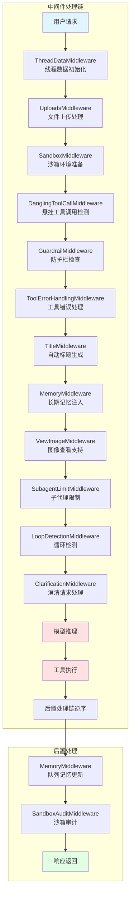
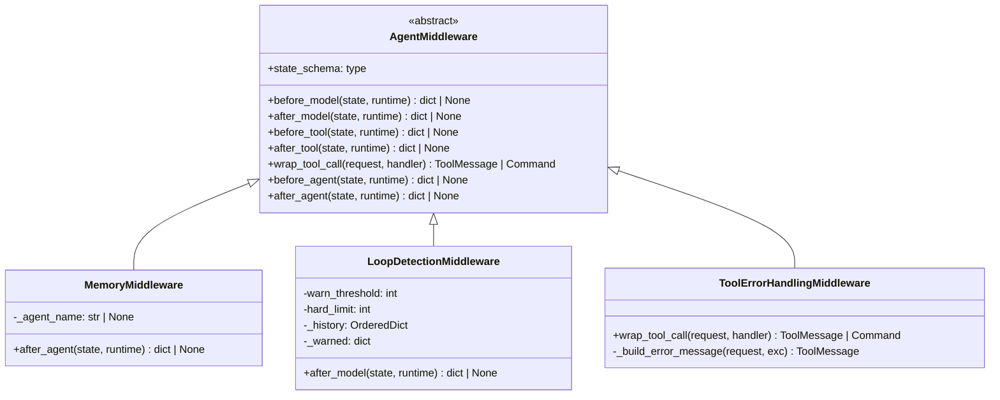
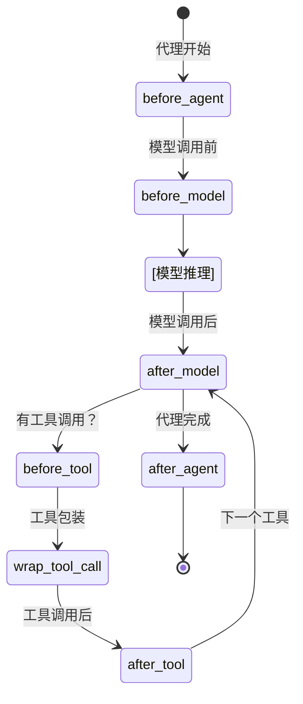

# 【文档编号+模块名】02-中间件系统详解

## 1. 模块全局定位

- **所属项目**: deer-flow
- **层级位置**: backend/packages/harness/deerflow/agents/middlewares
- **核心作用**: 代理中间件系统，提供请求/响应拦截、错误处理、循环检测、记忆管理等横切关注点
- **业务价值**: 通过可组合的中间件链，实现代理行为的模块化和可扩展性，是整个代理系统的"神经系统"

## 2. 依赖&调用链路 Mermaid图



## 3. 核心目录/文件清单

| 中间件文件 | 职责描述 | 执行时机 |
|-----------|---------|---------|
| thread_data_middleware.py | 线程数据初始化和管理 | 前置 |
| uploads_middleware.py | 文件上传处理和路径注入 | 前置 |
| sandbox_middleware.py | 沙箱环境准备 | 前置 |
| dangling_tool_call_middleware.py | 悬挂工具调用检测和修复 | 前置 |
| tool_error_handling_middleware.py | 工具执行错误捕获和转换 | 工具调用 |
| title_middleware.py | 自动生成对话标题 | 后置 |
| memory_middleware.py | 长期记忆管理和更新 | 前置+后置 |
| view_image_middleware.py | 图像查看能力注入 | 前置 |
| subagent_limit_middleware.py | 子代理调用限制 | 前置 |
| loop_detection_middleware.py | 循环检测和强制停止 | 后置 |
| clarification_middleware.py | 澄清请求处理 | 前置+后置 |
| todo_middleware.py | 任务列表管理 | 前置 |
| sandbox_audit_middleware.py | 沙箱操作审计 | 后置 |
| token_usage_middleware.py | Token使用统计 | 后置 |
| deferred_tool_filter_middleware.py | 延迟工具过滤 | 前置 |

## 4. 关键源码深度解析

### 4.1 记忆中间件

#### 文件路径: `/backend/packages/harness/deerflow/agents/middlewares/memory_middleware.py`

```python
"""记忆机制中间件"""

import logging
import re
from typing import Any, override

from langchain.agents import AgentState
from langchain.agents.middleware import AgentMiddleware
from langgraph.config import get_config
from langgraph.runtime import Runtime

from deerflow.agents.memory.queue import get_memory_queue
from deerflow.config.memory_config import get_memory_config

logger = logging.getLogger(__name__)


class MemoryMiddleware(AgentMiddleware[MemoryMiddlewareState]):
    """中间件：在代理执行后将对话排队进行记忆更新

    此中间件：
    1. 每次代理执行后，将对话排队进行记忆更新
    2. 仅包含用户输入和最终助手响应（忽略工具调用）
    3. 队列使用防抖机制批量处理多个更新
    4. 记忆通过LLM摘要异步更新
    """

    state_schema = MemoryMiddlewareState

    def __init__(self, agent_name: str | None = None):
        """初始化MemoryMiddleware

        Args:
            agent_name: 如果提供，记忆按代理存储。None则使用全局记忆。
        """
        super().__init__()
        self._agent_name = agent_name

    @override
    def after_agent(self, state: MemoryMiddlewareState, runtime: Runtime) -> dict | None:
        """代理完成后将对话排队进行记忆更新

        处理流程：
        1. 检查记忆功能是否启用
        2. 获取thread_id用于隔离
        3. 过滤消息（仅保留用户输入和最终响应）
        4. 将过滤后的消息加入记忆队列
        """
        config = get_memory_config()
        if not config.enabled:
            return None

        # 获取thread_id
        thread_id = runtime.context.get("thread_id") if runtime.context else None
        if thread_id is None:
            config_data = get_config()
            thread_id = config_data.get("configurable", {}).get("thread_id")
        if not thread_id:
            logger.debug("上下文中无thread_id，跳过记忆更新")
            return None

        # 获取并过滤消息
        messages = state.get("messages", [])
        if not messages:
            return None

        filtered_messages = _filter_messages_for_memory(messages)

        # 验证有意义的对话
        user_messages = [m for m in filtered_messages if getattr(m, "type", None) == "human"]
        assistant_messages = [m for m in filtered_messages if getattr(m, "type", None) == "ai"]

        if not user_messages or not assistant_messages:
            return None

        # 加入记忆队列
        queue = get_memory_queue()
        queue.add(thread_id=thread_id, messages=filtered_messages, agent_name=self._agent_name)

        return None


def _filter_messages_for_memory(messages: list[Any]) -> list[Any]:
    """过滤消息，仅保留用户输入和最终助手响应

    过滤规则：
    - 移除工具消息（中间工具调用结果）
    - 移除带tool_calls的AI消息（中间步骤）
    - 移除UploadsMiddleware注入的<uploaded_files>块
    - 仅保留：
      - 人类消息（移除上传块后）
      - 无tool_calls的AI消息（最终响应）

    Args:
        messages: 所有对话消息列表

    Returns:
        过滤后的列表，仅包含用户输入和最终助手响应
    """
    _UPLOAD_BLOCK_RE = re.compile(r"<uploaded_files>[\s\S]*?</uploaded_files>\n*", re.IGNORECASE)

    filtered = []
    skip_next_ai = False
    for msg in messages:
        msg_type = getattr(msg, "type", None)

        if msg_type == "human":
            content = getattr(msg, "content", "")
            if isinstance(content, list):
                content = " ".join(p.get("text", "") for p in content if isinstance(p, dict))
            content_str = str(content)
            if "<uploaded_files>" in content_str:
                # 移除临时上传块，保留用户的真实问题
                stripped = _UPLOAD_BLOCK_RE.sub("", content_str).strip()
                if not stripped:
                    # 没有剩余内容 — 整个轮次都是上传记录
                    # 跳过它和配对的助手响应
                    skip_next_ai = True
                    continue
                # 用清理后的内容重建消息
                from copy import copy
                clean_msg = copy(msg)
                clean_msg.content = stripped
                filtered.append(clean_msg)
                skip_next_ai = False
            else:
                filtered.append(msg)
                skip_next_ai = False
        elif msg_type == "ai":
            tool_calls = getattr(msg, "tool_calls", None)
            if not tool_calls:
                if skip_next_ai:
                    skip_next_ai = False
                    continue
                filtered.append(msg)
        # 跳过工具消息和带tool_calls的AI消息

    return filtered
```

**解读**:
- **消息过滤**: 精准过滤只保留有意义的对话内容，避免工具调用结果污染记忆
- **异步队列**: 使用队列机制解耦对话执行和记忆更新，提升性能
- **防抖机制**: 批量处理多个更新，减少LLM调用次数
- **会话隔离**: 基于thread_id和agent_name实现多租户隔离

### 4.2 循环检测中间件

#### 文件路径: `/backend/packages/harness/deerflow/agents/middlewares/loop_detection_middleware.py`

```python
"""检测并中断重复工具调用循环的中间件

P0安全：防止代理无限调用相同工具和相同参数，
直到递归限制终止运行。

检测策略：
  1. 每次模型响应后，哈希工具调用（名称+参数）
  2. 在滑动窗口中跟踪最近的哈希值
  3. 如果相同哈希出现>=warn_threshold次，注入
     "你在重复 — 请结束"系统消息（每个哈希一次）
  4. 如果出现>=hard_limit次，从响应中移除所有tool_calls，
     强制代理产生最终文本答案
"""

import hashlib
import json
import logging
import threading
from collections import OrderedDict, defaultdict
from typing import override

from langchain.agents import AgentState
from langchain.agents.middleware import AgentMiddleware
from langchain_core.messages import HumanMessage
from langgraph.runtime import Runtime

logger = logging.getLogger(__name__)

# 默认值 — 可通过构造函数覆盖
_DEFAULT_WARN_THRESHOLD = 3  # 3次相同调用后注入警告
_DEFAULT_HARD_LIMIT = 5  # 5次相同调用后强制停止
_DEFAULT_WINDOW_SIZE = 20  # 跟踪最近N次工具调用
_DEFAULT_MAX_TRACKED_THREADS = 100  # LRU驱逐限制


def _hash_tool_calls(tool_calls: list[dict]) -> str:
    """工具调用集的确定性哈希（名称+参数）

    这是顺序无关的：相同的多集工具调用应始终产生相同哈希，
    无论它们的输入顺序如何。
    """
    # 首先将每个工具调用规范化为最小（名称，参数）结构
    normalized: list[dict] = []
    for tc in tool_calls:
        normalized.append(
            {
                "name": tc.get("name", ""),
                "args": tc.get("args", {}),
            }
        )

    # 按名称和参数的确定性序列化排序，使相同多集调用的
    # 排列产生相同顺序
    normalized.sort(
        key=lambda tc: (
            tc["name"],
            json.dumps(tc["args"], sort_keys=True, default=str),
        )
    )
    blob = json.dumps(normalized, sort_keys=True, default=str)
    return hashlib.md5(blob.encode()).hexdigest()[:12]


_WARNING_MSG = "[LOOP DETECTED] You are repeating the same tool calls. Stop calling tools and produce your final answer now. If you cannot complete the task, summarize what you accomplished so far."

_HARD_STOP_MSG = "[FORCED STOP] Repeated tool calls exceeded the safety limit. Producing final answer with results collected so far."


class LoopDetectionMiddleware(AgentMiddleware[AgentState]):
    """检测并中断重复工具调用循环

    Args:
        warn_threshold: 注入警告前的相同工具调用集次数。默认：3
        hard_limit: 完全移除tool_calls前的相同工具调用集次数。默认：5
        window_size: 跟踪调用的滑动窗口大小。默认：20
        max_tracked_threads: 驱逐最少使用前跟踪的最大线程数。默认：100
    """

    def __init__(
        self,
        warn_threshold: int = _DEFAULT_WARN_THRESHOLD,
        hard_limit: int = _DEFAULT_HARD_LIMIT,
        window_size: int = _DEFAULT_WINDOW_SIZE,
        max_tracked_threads: int = _DEFAULT_MAX_TRACKED_THREADS,
    ):
        super().__init__()
        self.warn_threshold = warn_threshold
        self.hard_limit = hard_limit
        self.window_size = window_size
        self.max_tracked_threads = max_tracked_threads
        self._lock = threading.Lock()
        # 使用OrderedDict实现LRU驱逐的每线程跟踪
        self._history: OrderedDict[str, list[str]] = OrderedDict()
        self._warned: dict[str, set[str]] = defaultdict(set)

    def _track_and_check(self, state: AgentState, runtime: Runtime) -> tuple[str | None, bool]:
        """跟踪工具调用并检查循环

        Returns:
            (warning_message_or_none, should_hard_stop)
        """
        messages = state.get("messages", [])
        if not messages:
            return None, False

        last_msg = messages[-1]
        if getattr(last_msg, "type", None) != "ai":
            return None, False

        tool_calls = getattr(last_msg, "tool_calls", None)
        if not tool_calls:
            return None, False

        thread_id = self._get_thread_id(runtime)
        call_hash = _hash_tool_calls(tool_calls)

        with self._lock:
            # 触摸/创建条目（移动到末尾用于LRU）
            if thread_id in self._history:
                self._history.move_to_end(thread_id)
            else:
                self._history[thread_id] = []
                self._evict_if_needed()

            history = self._history[thread_id]
            history.append(call_hash)
            if len(history) > self.window_size:
                history[:] = history[-self.window_size :]

            count = history.count(call_hash)
            tool_names = [tc.get("name", "?") for tc in tool_calls]

            if count >= self.hard_limit:
                logger.error(
                    "达到循环硬限制 — 强制停止",
                    extra={
                        "thread_id": thread_id,
                        "call_hash": call_hash,
                        "count": count,
                        "tools": tool_names,
                    },
                )
                return _HARD_STOP_MSG, True

            if count >= self.warn_threshold:
                warned = self._warned[thread_id]
                if call_hash not in warned:
                    warned.add(call_hash)
                    logger.warning(
                        "检测到重复工具调用 — 注入警告",
                        extra={
                            "thread_id": thread_id,
                            "call_hash": call_hash,
                            "count": count,
                            "tools": tool_names,
                        },
                    )
                    return _WARNING_MSG, False
                # 已为此哈希注入警告 — 抑制
                return None, False

        return None, False

    @override
    def after_model(self, state: AgentState, runtime: Runtime) -> dict | None:
        return self._apply(state, runtime)
```

**解读**:
- **哈希检测**: 使用MD5哈希工具调用签名，实现高效重复检测
- **滑动窗口**: 仅跟踪最近N次调用，避免内存无限增长
- **分级响应**: 警告→强制停止，给予代理自我纠正机会
- **LRU驱逐**: 自动清理不活跃线程的跟踪数据
- **线程安全**: 使用锁保护共享状态

### 4.3 工具错误处理中间件

#### 文件路径: `/backend/packages/harness/deerflow/agents/middlewares/tool_error_handling_middleware.py`

```python
"""工具错误处理中间件和共享运行时中间件构建器"""

import logging
from collections.abc import Awaitable, Callable
from typing import override

from langchain.agents import AgentState
from langchain.agents.middleware import AgentMiddleware
from langchain_core.messages import ToolMessage
from langgraph.errors import GraphBubbleUp
from langgraph.prebuilt.tool_node import ToolCallRequest
from langgraph.types import Command

logger = logging.getLogger(__name__)

_MISSING_TOOL_CALL_ID = "missing_tool_call_id"


class ToolErrorHandlingMiddleware(AgentMiddleware[AgentState]):
    """将工具异常转换为错误ToolMessage，使运行能够继续"""

    def _build_error_message(self, request: ToolCallRequest, exc: Exception) -> ToolMessage:
        """构建错误工具消息"""
        tool_name = str(request.tool_call.get("name") or "unknown_tool")
        tool_call_id = str(request.tool_call.get("id") or _MISSING_TOOL_CALL_ID)
        detail = str(exc).strip() or exc.__class__.__name__
        if len(detail) > 500:
            detail = detail[:497] + "..."

        content = f"Error: Tool '{tool_name}' failed with {exc.__class__.__name__}: {detail}. Continue with available context, or choose an alternative tool."
        return ToolMessage(
            content=content,
            tool_call_id=tool_call_id,
            name=tool_name,
            status="error",
        )

    @override
    def wrap_tool_call(
        self,
        request: ToolCallRequest,
        handler: Callable[[ToolCallRequest], ToolMessage | Command],
    ) -> ToolMessage | Command:
        """同步包装工具调用"""
        try:
            return handler(request)
        except GraphBubbleUp:
            # 保留LangGraph控制流信号（中断/暂停/恢复）
            raise
        except Exception as exc:
            logger.exception("工具执行失败（同步）: name=%s id=%s",
                           request.tool_call.get("name"),
                           request.tool_call.get("id"))
            return self._build_error_message(request, exc)

    @override
    async def awrap_tool_call(
        self,
        request: ToolCallRequest,
        handler: Callable[[ToolCallRequest], Awaitable[ToolMessage | Command]],
    ) -> ToolMessage | Command:
        """异步包装工具调用"""
        try:
            return await handler(request)
        except GraphBubbleUp:
            # 保留LangGraph控制流信号（中断/暂停/恢复）
            raise
        except Exception as exc:
            logger.exception("工具执行失败（异步）: name=%s id=%s",
                           request.tool_call.get("name"),
                           request.tool_call.get("id"))
            return self._build_error_message(request, exc)
```

**解读**:
- **优雅降级**: 工具失败时返回错误消息而非崩溃，让代理能够继续
- **信号保留**: 保留GraphBubbleUp等控制流信号，不破坏LangGraph机制
- **错误截断**: 限制错误消息长度，避免token浪费
- **双模式支持**: 同时支持同步和异步工具调用
- **结构化错误**: 返回标准ToolMessage格式，便于下游处理

## 5. 底层设计思想

### 5.1 中间件架构模式



### 5.2 中间件生命周期



### 5.3 设计原则

1. **单一职责**: 每个中间件只处理一个横切关注点
2. **可组合性**: 中间件可以任意组合和重排
3. **幂等性**: 中间件应该是幂等的，多次调用结果一致
4. **无状态优先**: 尽量设计为无状态，有状态需考虑线程安全
5. **错误隔离**: 中间件错误不应影响整个链路

## 6. 必学核心知识点

### 6.1 中间件钩子点

| 钩子方法 | 调用时机 | 用途 |
|---------|---------|------|
| `before_agent` | 代理执行前 | 全局初始化、验证 |
| `after_agent` | 代理执行后 | 清理、统计 |
| `before_model` | 模型调用前 | 提示词注入、上下文增强 |
| `after_model` | 模型调用后 | 响应后处理、循环检测 |
| `before_tool` | 工具调用前 | 参数验证、权限检查 |
| `after_tool` | 工具调用后 | 结果处理、缓存 |
| `wrap_tool_call` | 工具调用包装 | 错误处理、重试逻辑 |

### 6.2 状态修改模式

```python
# 模式1：返回部分状态更新
def after_model(self, state, runtime) -> dict | None:
    return {"messages": [new_message]}

# 模式2：返回None（无状态变更）
def after_agent(self, state, runtime) -> dict | None:
    # 仅副作用，不修改状态
    return None

# 模式3：直接修改state（不推荐）
def before_model(self, state, runtime) -> dict | None:
    state["messages"].append(msg)
    return None
```

### 6.3 异步处理

```python
# 异步中间件示例
class AsyncMiddleware(AgentMiddleware):
    async def aafter_model(self, state, runtime) -> dict | None:
        # 异步操作
        result = await some_async_operation()
        return {"data": result}

# 同步方法会自动在异步上下文中运行
class SyncMiddleware(AgentMiddleware):
    def after_model(self, state, runtime) -> dict | None:
        # 同步操作
        return {"data": "sync result"}
```

## 7. 可直接拷贝复用代码片段

### 7.1 自定义中间件模板

```python
from langchain.agents import AgentState
from langchain.agents.middleware import AgentMiddleware
from langgraph.runtime import Runtime
from typing import override

class CustomMiddleware(AgentMiddleware[AgentState]):
    """自定义中间件模板"""

    def __init__(self, param1: str = "default"):
        super().__init__()
        self.param1 = param1

    @override
    def before_agent(self, state: AgentState, runtime: Runtime) -> dict | None:
        """代理执行前调用"""
        # 初始化逻辑
        return None

    @override
    def after_agent(self, state: AgentState, runtime: Runtime) -> dict | None:
        """代理执行后调用"""
        # 清理逻辑
        return None

    @override
    def before_model(self, state: AgentState, runtime: Runtime) -> dict | None:
        """模型调用前调用"""
        # 上下文增强
        return None

    @override
    def after_model(self, state: AgentState, runtime: Runtime) -> dict | None:
        """模型调用后调用"""
        # 响应后处理
        return None
```

### 7.2 工具调用重试中间件

```python
import asyncio
from typing import Awaitable, Callable

class RetryMiddleware(AgentMiddleware[AgentState]):
    """工具调用重试中间件"""

    def __init__(self, max_retries: int = 3, delay: float = 1.0):
        super().__init__()
        self.max_retries = max_retries
        self.delay = delay

    async def awrap_tool_call(
        self,
        request: ToolCallRequest,
        handler: Callable[[ToolCallRequest], Awaitable[ToolMessage | Command]],
    ) -> ToolMessage | Command:
        """异步包装工具调用，带重试逻辑"""
        last_error = None
        for attempt in range(self.max_retries):
            try:
                return await handler(request)
            except Exception as exc:
                last_error = exc
                if attempt < self.max_retries - 1:
                    await asyncio.sleep(self.delay * (2 ** attempt))
        # 所有重试失败
        return self._build_error_message(request, last_error)
```

### 7.3 性能监控中间件

```python
import time
from collections import defaultdict

class MetricsMiddleware(AgentMiddleware[AgentState]):
    """性能监控中间件"""

    def __init__(self):
        super().__init__()
        self.metrics = defaultdict(list)

    def before_model(self, state, runtime):
        runtime.context["_model_start_time"] = time.time()
        return None

    def after_model(self, state, runtime):
        start_time = runtime.context.get("_model_start_time")
        if start_time:
            duration = time.time() - start_time
            self.metrics["model_duration"].append(duration)
        return None

    def get_metrics(self) -> dict:
        """获取收集的指标"""
        return {
            "model_duration": {
                "count": len(self.metrics["model_duration"]),
                "avg": sum(self.metrics["model_duration"]) / len(self.metrics["model_duration"]) if self.metrics["model_duration"] else 0,
            }
        }
```

## 8. 踩坑提醒 & 二次开发建议

### 8.1 常见问题

1. **状态修改错误**: 直接修改state而不返回更新，导致状态不同步
2. **异步陷阱**: 在同步方法中调用异步函数，导致阻塞
3. **循环依赖**: 中间件之间相互依赖，导致初始化失败
4. **内存泄漏**: 有状态中间件未正确清理，内存持续增长
5. **顺序敏感**: 中间件顺序不当导致功能异常

### 8.2 调试技巧

1. **日志追踪**:
```python
import logging
logger = logging.getLogger(__name__)

class DebugMiddleware(AgentMiddleware):
    def before_model(self, state, runtime):
        logger.debug(f"Before model: {len(state.get('messages', []))} messages")
        return None
```

2. **状态检查**:
```python
class StateInspector(AgentMiddleware):
    def after_model(self, state, runtime):
        print(f"State keys: {state.keys()}")
        print(f"Last message: {state.get('messages', [])[-1]}")
        return None
```

3. **性能分析**:
```python
import cProfile
import pstats

class ProfileMiddleware(AgentMiddleware):
    def wrap_tool_call(self, request, handler):
        pr = cProfile.Profile()
        pr.enable()
        result = handler(request)
        pr.disable()
        stats = pstats.Stats(pr)
        stats.sort_stats('cumulative').print_stats(10)
        return result
```

### 8.3 二次开发方向

1. **自定义防护栏**: 实现企业级内容过滤和合规检查
2. **审计日志**: 记录所有代理操作用于合规审计
3. **缓存层**: 缓存模型响应和工具结果
4. **限流控制**: 实现API调用速率限制
5. **成本追踪**: 统计token使用和API成本

## 9. 文档衔接

本篇完结，下一篇将解析：【03-运行时管理系统】

---

## 附录：中间件速查表

| 中间件 | 钩子点 | 配置参数 | 依赖 |
|--------|--------|---------|------|
| ThreadDataMiddleware | before_agent | lazy_init | 无 |
| UploadsMiddleware | before_agent | 无 | ThreadData |
| SandboxMiddleware | before_agent | lazy_init | ThreadData |
| MemoryMiddleware | after_agent | agent_name | 记忆队列 |
| LoopDetectionMiddleware | after_model | warn_threshold, hard_limit | 无 |
| ToolErrorHandlingMiddleware | wrap_tool_call | 无 | 无 |
| TitleMiddleware | after_agent | 无 | 无 |
| ClarificationMiddleware | before/after | 无 | 无 |
| SubagentLimitMiddleware | before_agent | max_calls | 无 |
| ViewImageMiddleware | before_model | 无 | 无 |
| TodoMiddleware | before_model | system_prompt | 无 |
