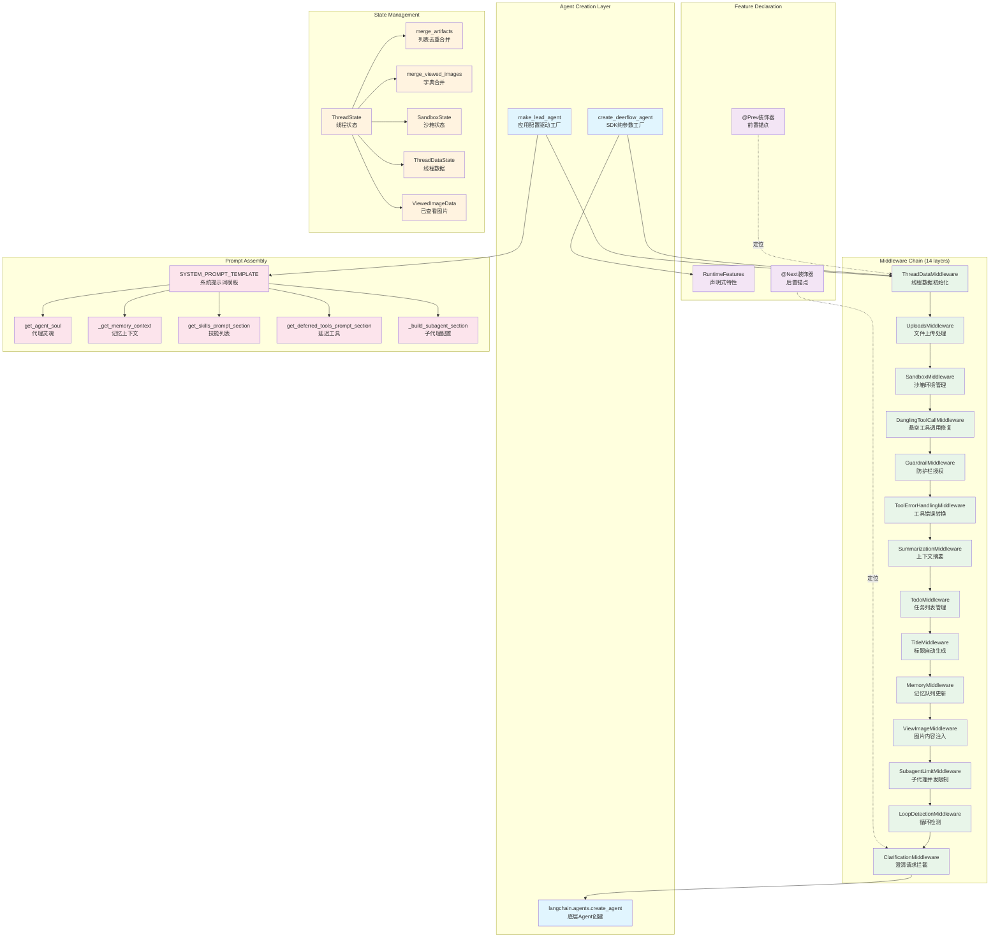

# 【02】代理系统深度解析

## 1. 模块全局定位

- **所属项目**：deer-flow
- **层级位置**：`backend/packages/harness/deerflow/agents/`
- **核心作用**：提供Agent创建、状态管理、中间件编排的核心框架
- **业务价值**：作为系统的"智能中枢"，负责协调查询理解、工具调用、状态流转、中间件处理
- **设计初衷**：设计用于解决"Agent复杂性管理"问题——通过声明式特性、中间件链、状态合并、灵活工厂模式，实现可扩展的Agent架构

## 2. 核心设计理念

代理系统采用 **声明式特性 + 中间件链 + 状态合并 + 双层工厂** 的四层设计理念：

1. **声明式特性**：`RuntimeFeatures`数据类定义功能开关，支持True/False/自定义中间件三种值
2. **中间件链**：14个中间件按固定顺序组装，通过`@Next`/`@Prev`装饰器定位
3. **状态合并**：`ThreadState`使用`Annotated`定义合并函数，支持列表去重和字典合并
4. **双层工厂**：`create_deerflow_agent`为SDK层纯参数工厂，`make_lead_agent`为应用层配置驱动工厂

## 3. 架构原理图



### 图表设计解读

该架构图体现了**声明式特性驱动 + 中间件链式处理 + 状态合并 + 提示词组装**的设计逻辑：

1. **双层工厂模式**：`create_deerflow_agent`是SDK层纯参数工厂（无配置依赖），`make_lead_agent`是应用层配置驱动工厂（读取全局配置）；两者都调用底层`langchain.agents.create_agent`

2. **中间件链式处理**：14个中间件按固定顺序组装，每个中间件专注于单一职责（如ThreadDataMiddleware初始化线程数据、ClarificationMiddleware拦截澄清请求）

3. **声明式特性驱动**：`RuntimeFeatures`数据类定义功能开关，支持True（使用内置默认）、False（禁用）、自定义中间件实例三种值

4. **状态合并机制**：`ThreadState`使用`Annotated`类型标注定义合并函数（如`merge_artifacts`去重合并、`merge_viewed_images`字典合并）

5. **提示词动态组装**：系统提示词模板根据运行时状态动态组装（代理灵魂、记忆上下文、技能列表、子代理配置等）

## 4. 核心源码解析

### 4.1 声明式特性定义：RuntimeFeatures

**文件路径**：`/data/deer-flow-main/backend/packages/harness/deerflow/agents/features.py`

**行号范围**：第14-34行

```python
@dataclass
class RuntimeFeatures:
    """Declarative feature flags for ``create_deerflow_agent``.

    Most features accept:
    - ``True``: use the built-in default middleware
    - ``False``: disable
    - An ``AgentMiddleware`` instance: use this custom implementation instead

    ``summarization`` and ``guardrail`` have no built-in default — they only
    accept ``False`` (disable) or an ``AgentMiddleware`` instance (custom).
    """

    sandbox: bool | AgentMiddleware = True
    memory: bool | AgentMiddleware = False
    summarization: Literal[False] | AgentMiddleware = False
    subagent: bool | AgentMiddleware = False
    vision: bool | AgentMiddleware = False
    auto_title: bool | AgentMiddleware = False
    guardrail: Literal[False] | AgentMiddleware = False
```

#### 逐行解读

- **第14-18行（类型注解设计）**：使用`bool | AgentMiddleware`联合类型；设计考量是"灵活性"，True使用内置默认，False禁用，实例使用自定义实现

- **第27行（sandbox默认True）**：沙箱功能默认启用；设计考量是"安全优先"，默认隔离执行环境

- **第29行（summarization特殊处理）**：使用`Literal[False] | AgentMiddleware`；设计考量是"配置强制"，摘要中间件需要模型参数，无内置默认，必须显式提供实例或禁用

- **第30-33行（功能开关默认False）**：memory、subagent、vision、auto_title默认禁用；设计考量是"按需启用"，这些功能增加复杂度和资源消耗

---

### 4.2 中间件定位装饰器：@Next与@Prev

**文件路径**：`/data/deer-flow-main/backend/packages/harness/deerflow/agents/features.py`

**行号范围**：第41-63行

```python
def Next(anchor: type[AgentMiddleware]):
    """Declare this middleware should be placed after *anchor* in the chain."""
    if not (isinstance(anchor, type) and issubclass(anchor, AgentMiddleware)):
        raise TypeError(f"@Next expects an AgentMiddleware subclass, got {anchor!r}")

    def decorator(cls: type[AgentMiddleware]) -> type[AgentMiddleware]:
        cls._next_anchor = anchor  # type: ignore[attr-defined]
        return cls

    return decorator


def Prev(anchor: type[AgentMiddleware]):
    """Declare this middleware should be placed before *anchor* in the chain."""
    if not (isinstance(anchor, type) and issubclass(anchor, AgentMiddleware)):
        raise TypeError(f"@Prev expects an AgentMiddleware subclass, got {anchor!r}")

    def decorator(cls: type[AgentMiddleware]) -> type[AgentMiddleware]:
        cls._prev_anchor = anchor  # type: ignore[attr-defined]
        return cls

    return decorator
```

#### 逐行解读

- **第42-44行（类型验证）**：验证anchor是AgentMiddleware子类；设计考量是"早期类型检查"，装饰时立即发现类型错误

- **第46-48行（属性注入）**：在类上设置`_next_anchor`属性；设计考量是"元数据存储"，将定位信息附加到类上，供后续插入算法使用

- **第53-61行（Prev对称实现）**：与Next对称实现；设计考量是"接口一致性"，两个装饰器提供相同的模式，只是方向相反

- **第59行（类型忽略注释）**：`# type: ignore[attr-defined]`；设计考量是"动态属性兼容"，pylance无法静态分析动态添加的属性

---

### 4.3 SDK纯参数工厂：create_deerflow_agent

**文件路径**：`/data/deer-flow-main/backend/packages/harness/deerflow/agents/factory.py`

**行号范围**：第61-148行

```python
def create_deerflow_agent(
    model: BaseChatModel,
    tools: list[BaseTool] | None = None,
    *,
    system_prompt: str | None = None,
    middleware: list[AgentMiddleware] | None = None,
    features: RuntimeFeatures | None = None,
    extra_middleware: list[AgentMiddleware] | None = None,
    plan_mode: bool = False,
    state_schema: type | None = None,
    checkpointer: BaseCheckpointSaver | None = None,
    name: str = "default",
) -> CompiledStateGraph:
    """Create a DeerFlow agent from plain Python arguments.

    The factory assembly itself reads no config files.  Some injected runtime
    components (e.g. ``task_tool``) may still depend on global config at
    invocation time — see Phase 2 roadmap for full config-free runtime.

    Parameters
    ----------
    model:
        Chat model instance.
    tools:
        User-provided tools.  Feature-injected tools are appended automatically.
    system_prompt:
        System message.  ``None`` uses a minimal default.
    middleware:
        **Full takeover** — if provided, this exact list is used.
        Cannot be combined with *features* or *extra_middleware*.
    features:
        Declarative feature flags.  Cannot be combined with *middleware*.
    extra_middleware:
        Additional middlewares inserted into the auto-assembled chain via
        ``@Next``/``@Prev`` positioning.  Cannot be used with *middleware*.
    plan_mode:
        Enable TodoMiddleware for task tracking.
    state_schema:
        LangGraph state type.  Defaults to ``ThreadState``.
    checkpointer:
        Optional persistence backend.
    name:
        Agent name (passed to middleware that cares, e.g. ``MemoryMiddleware``).
    """
    if middleware is not None and features is not None:
        raise ValueError("Cannot specify both 'middleware' and 'features'.  Use one or the other.")
    if middleware is not None and extra_middleware:
        raise ValueError("Cannot use 'extra_middleware' with 'middleware' (full takeover).")
    if extra_middleware:
        for mw in extra_middleware:
            if not isinstance(mw, AgentMiddleware):
                raise TypeError(f"extra_middleware items must be AgentMiddleware instances, got {type(mw).__name__}")

    effective_tools: list[BaseTool] = list(tools or [])
    effective_state = state_schema or ThreadState

    if middleware is not None:
        effective_middleware = list(middleware)
    else:
        feat = features or RuntimeFeatures()
        effective_middleware, extra_tools = _assemble_from_features(
            feat,
            name=name,
            plan_mode=plan_mode,
            extra_middleware=extra_middleware or [],
        )
        # Deduplicate by tool name — user-provided tools take priority.
        existing_names = {t.name for t in effective_tools}
        for t in extra_tools:
            if t.name not in existing_names:
                effective_tools.append(t)
                existing_names.add(t.name)

    return create_agent(
        model=model,
        tools=effective_tools or None,
        middleware=effective_middleware,
        system_prompt=system_prompt,
        state_schema=effective_state,
        checkpointer=checkpointer,
        name=name,
    )
```

#### 逐行解读

- **第110-113行（互斥参数验证）**：`middleware`与`features`/`extra_middleware`互斥；设计考量是"明确语义"，完全接管中间件链或声明式组装，不能混用

- **第114-117行（类型验证）**：验证`extra_middleware`元素类型；设计考量是"早期失败"，调用时立即发现类型错误

- **第119-120行（工具和状态默认值）**：工具默认空列表，状态默认`ThreadState`；设计考量是"合理默认"，大多数场景无需显式指定

- **第122-131行（中间件组装分支）**：`middleware`提供时直接使用，否则从特性组装；设计考量是"灵活控制"，支持完全自定义或声明式组装

- **第132-137行（工具去重）**：用户提供的工具优先；设计考量是"用户意图尊重"，用户显式提供的工具不应被特性注入覆盖

- **第139-147行（底层Agent创建）**：调用`langchain.agents.create_agent`；设计考量是"框架复用"，不重复实现Agent创建逻辑

---

### 4.4 特性驱动中间件组装：_assemble_from_features

**文件路径**：`/data/deer-flow-main/backend/packages/harness/deerflow/agents/factory.py`

**行号范围**：第155-291行

```python
def _assemble_from_features(
    feat: RuntimeFeatures,
    *,
    name: str = "default",
    plan_mode: bool = False,
    extra_middleware: list[AgentMiddleware] | None = None,
) -> tuple[list[AgentMiddleware], list[BaseTool]]:
    """Build an ordered middleware chain + extra tools from *feat*.

    Middleware order matches ``make_lead_agent`` (14 middlewares):

      0-2. Sandbox infrastructure (ThreadData → Uploads → Sandbox)
      3.   DanglingToolCallMiddleware (always)
      4.   GuardrailMiddleware (guardrail feature)
      5.   ToolErrorHandlingMiddleware (always)
      6.   SummarizationMiddleware (summarization feature)
      7.   TodoMiddleware (plan_mode parameter)
      8.   TitleMiddleware (auto_title feature)
      9.  MemoryMiddleware (memory feature)
      10.  ViewImageMiddleware (vision feature)
      11.  SubagentLimitMiddleware (subagent feature)
      12.  LoopDetectionMiddleware (always)
      13.  ClarificationMiddleware (always last)

    Two-phase ordering:
      1. Built-in chain — fixed sequential append.
      2. Extra middleware — inserted via @Next/@Prev.

    Each feature value is handled as:
      - ``False``: skip
      - ``True``: create the built-in default middleware (not available for
        ``summarization`` and ``guardrail`` — these require a custom instance)
      - ``AgentMiddleware`` instance: use directly (custom replacement)
    """
    chain: list[AgentMiddleware] = []
    extra_tools: list[BaseTool] = []

    # --- [0-2] Sandbox infrastructure ---
    if feat.sandbox is not False:
        if isinstance(feat.sandbox, AgentMiddleware):
            chain.append(feat.sandbox)
        else:
            from deerflow.agents.middlewares.thread_data_middleware import ThreadDataMiddleware
            from deerflow.agents.middlewares.uploads_middleware import UploadsMiddleware
            from deerflow.sandbox.middleware import SandboxMiddleware

            chain.append(ThreadDataMiddleware(lazy_init=True))
            chain.append(UploadsMiddleware())
            chain.append(SandboxMiddleware(lazy_init=True))

    # --- [3] DanglingToolCall (always) ---
    chain.append(DanglingToolCallMiddleware())

    # --- [4] Guardrail ---
    if feat.guardrail is not False:
        if isinstance(feat.guardrail, AgentMiddleware):
            chain.append(feat.guardrail)
        else:
            raise ValueError("guardrail=True requires a custom AgentMiddleware instance (no built-in GuardrailMiddleware yet)")

    # --- [5] ToolErrorHandling (always) ---
    chain.append(ToolErrorHandlingMiddleware())

    # --- [6] Summarization ---
    if feat.summarization is not False:
        if isinstance(feat.summarization, AgentMiddleware):
            chain.append(feat.summarization)
        else:
            raise ValueError("summarization=True requires a custom AgentMiddleware instance (SummarizationMiddleware needs a model argument)")

    # --- [7] TodoMiddleware (plan_mode) ---
    if plan_mode:
        from deerflow.agents.middlewares.todo_middleware import TodoMiddleware

        chain.append(TodoMiddleware(system_prompt=_TODO_SYSTEM_PROMPT, tool_description=_TODO_TOOL_DESCRIPTION))

    # --- [8] Auto Title ---
    if feat.auto_title is not False:
        if isinstance(feat.auto_title, AgentMiddleware):
            chain.append(feat.auto_title)
        else:
            from deerflow.agents.middlewares.title_middleware import TitleMiddleware

            chain.append(TitleMiddleware())

    # --- [9] Memory ---
    if feat.memory is not False:
        if isinstance(feat.memory, AgentMiddleware):
            chain.append(feat.memory)
        else:
            from deerflow.agents.middlewares.memory_middleware import MemoryMiddleware

            chain.append(MemoryMiddleware(agent_name=name))

    # --- [10] Vision ---
    if feat.vision is not False:
        if isinstance(feat.vision, AgentMiddleware):
            chain.append(feat.vision)
        else:
            from deerflow.agents.middlewares.view_image_middleware import ViewImageMiddleware

            chain.append(ViewImageMiddleware())
        from deerflow.tools.builtins import view_image_tool

        extra_tools.append(view_image_tool)

    # --- [11] Subagent ---
    if feat.subagent is not False:
        if isinstance(feat.subagent, AgentMiddleware):
            chain.append(feat.subagent)
        else:
            from deerflow.agents.middlewares.subagent_limit_middleware import SubagentLimitMiddleware

            chain.append(SubagentLimitMiddleware())
        from deerflow.tools.builtins import task_tool

        extra_tools.append(task_tool)

    # --- [12] LoopDetection (always) ---
    from deerflow.agents.middlewares.loop_detection_middleware import LoopDetectionMiddleware

    chain.append(LoopDetectionMiddleware())

    # --- [13] Clarification (always last among built-ins) ---
    chain.append(ClarificationMiddleware())
    extra_tools.append(ask_clarification_tool)

    # --- Insert extra_middleware via @Next/@Prev ---
    if extra_middleware:
        _insert_extra(chain, extra_middleware)
        # Invariant: ClarificationMiddleware must always be last.
        # @Next(ClarificationMiddleware) could push it off the tail.
        clar_idx = next(i for i, m in enumerate(chain) if isinstance(m, ClarificationMiddleware))
        if clar_idx != len(chain) - 1:
            chain.append(chain.pop(clar_idx))

    return chain, extra_tools
```

#### 逐行解读

- **第192-203行（沙箱基础设施）**：固定三个中间件（ThreadData → Uploads → Sandbox）；设计考量是"依赖顺序"，ThreadData初始化线程ID，Uploads依赖线程ID，Sandbox依赖线程数据

- **第205-206行（悬空工具调用修复）**：`DanglingToolCallMiddleware`始终启用；设计考量是"数据完整性"，修复模型输出中缺失的ToolMessage

- **第208-214行（防护栏验证）**：`guardrail=True`时报错；设计考量是"配置强制"，防护栏需要自定义provider，无内置默认

- **第216-217行（工具错误处理）**：`ToolErrorHandlingMiddleware`始终启用；设计考量是"错误恢复"，将工具异常转换为ToolMessage继续执行

- **第219-224行（摘要验证）**：`summarization=True`时报错；设计考量是"参数强制"，摘要中间件需要模型参数，无内置默认

- **第226-230行（计划模式中间件）**：`plan_mode`参数控制；设计考量是"参数驱动"，计划模式是临时开关，不是持久特性

- **第232-259行（功能特性条件组装）**：auto_title、memory、vision、subagent根据特性值组装；设计考量是"按需启用"，每个特性独立控制

- **第274-279行（Clarification末尾保证）**：强制ClarificationMiddleware在链末尾；设计考量是"拦截保证"，澄清请求必须在所有其他处理后拦截

---

### 4.5 额外中间件插入算法：_insert_extra

**文件路径**：`/data/deer-flow-main/backend/packages/harness/deerflow/agents/factory.py`

**行号范围**：第299-373行

```python
def _insert_extra(chain: list[AgentMiddleware], extras: list[AgentMiddleware]) -> None:
    """Insert extra middlewares into *chain* using ``@Next``/``@Prev`` anchors.

    Algorithm:
      1. Validate: no middleware has both @Next and @Prev.
      2. Conflict detection: two extras targeting same anchor (same or opposite direction) → error.
      3. Insert unanchored extras before ClarificationMiddleware.
      4. Insert anchored extras iteratively (supports cross-external anchoring).
      5. If an anchor cannot be resolved after all rounds → error.
    """
    next_targets: dict[type, type] = {}
    prev_targets: dict[type, type] = {}

    anchored: list[tuple[AgentMiddleware, str, type]] = []
    unanchored: list[AgentMiddleware] = []

    for mw in extras:
        next_anchor = getattr(type(mw), "_next_anchor", None)
        prev_anchor = getattr(type(mw), "_prev_anchor", None)

        if next_anchor and prev_anchor:
            raise ValueError(f"{type(mw).__name__} cannot have both @Next and @Prev")

        if next_anchor:
            if next_anchor in next_targets:
                raise ValueError(f"Conflict: {type(mw).__name__} and {next_targets[next_anchor].__name__} both @Next({next_anchor.__name__})")
            if next_anchor in prev_targets:
                raise ValueError(f"Conflict: {type(mw).__name__} @Next({next_anchor.__name__}) and {prev_targets[next_anchor].__name__} @Prev({next_anchor.__name__}) — use cross-anchoring between extras instead")
            next_targets[next_anchor] = type(mw)
            anchored.append((mw, "next", next_anchor))
        elif prev_anchor:
            if prev_anchor in prev_targets:
                raise ValueError(f"Conflict: {type(mw).__name__} and {prev_targets[prev_anchor].__name__} both @Prev({prev_anchor.__name__})")
            if prev_anchor in next_targets:
                raise ValueError(f"Conflict: {type(mw).__name__} @Prev({prev_anchor.__name__}) and {next_targets[prev_anchor].__name__} @Next({prev_anchor.__name__}) — use cross-anchoring between extras instead")
            prev_targets[prev_anchor] = type(mw)
            anchored.append((mw, "prev", prev_anchor))
        else:
            unanchored.append(mw)

    # Unanchored → before ClarificationMiddleware
    clarification_idx = next(i for i, m in enumerate(chain) if isinstance(m, ClarificationMiddleware))
    for mw in unanchored:
        chain.insert(clarification_idx, mw)
        clarification_idx += 1

    # Anchored → iterative insertion (supports external-to-external anchoring)
    pending = list(anchored)
    max_rounds = len(pending) + 1
    for _ in range(max_rounds):
        if not pending:
            break
        remaining = []
        for mw, direction, anchor in pending:
            idx = next(
                (i for i, m in enumerate(chain) if isinstance(m, anchor)),
                None,
            )
            if idx is None:
                remaining.append((mw, direction, anchor))
                continue
            if direction == "next":
                chain.insert(idx + 1, mw)
            else:
                chain.insert(idx, mw)
        if len(remaining) == len(pending):
            names = [type(m).__name__ for m, _, _ in remaining]
            anchor_types = {a for _, _, a in remaining}
            remaining_types = {type(m) for m, _, _ in remaining}
            circular = anchor_types & remaining_types
            if circular:
                raise ValueError(f"Circular dependency among extra middlewares: {', '.join(t.__name__ for t in circular)}")
            raise ValueError(f"Cannot resolve positions for {', '.join(names)} — anchors {', '.join(a.__name__ for _, _, a in remaining)} not found in chain")
        pending = remaining
```

#### 逐行解读

- **第309-336行（锚点分类与冲突检测）**：分离有锚点和无锚点中间件，检测双向装饰和冲突；设计考量是"早期验证"，插入前发现配置错误

- **第313-315行（双向装饰检测）**：中间件不能同时有@Next和@Prev；设计考量是"语义明确"，一个中间件只能有一个定位方向

- **第317-326行（冲突检测）**：两个中间件不能锚定同一目标；设计考量是"确定性行为"，冲突会导致不确定的插入顺序

- **第339-343行（无锚点插入）**：无锚点中间件插入ClarificationMiddleware之前；设计考量是"默认位置"，无定位需求的中间件放在末尾前

- **第346-372行（迭代插入算法）**：多轮迭代支持跨中间件锚定；设计考量是"支持复杂场景"，中间件A可以锚定到中间件B，B可以锚定到C

- **第357-364行（循环依赖检测）**：检测锚点类型与中间件类型交集；设计考量是"无限循环防护"，避免A锚B、B锚A的死循环

---

### 4.6 应用配置驱动工厂：make_lead_agent

**文件路径**：`/data/deer-flow-main/backend/packages/harness/deerflow/agents/lead_agent/agent.py`

**行号范围**：第273-349行

```python
def make_lead_agent(config: RunnableConfig):
    # Lazy import to avoid circular dependency
    from deerflow.tools import get_available_tools
    from deerflow.tools.builtins import setup_agent

    cfg = config.get("configurable", {})

    thinking_enabled = cfg.get("thinking_enabled", True)
    reasoning_effort = cfg.get("reasoning_effort", None)
    requested_model_name: str | None = cfg.get("model_name") or cfg.get("model")
    is_plan_mode = cfg.get("is_plan_mode", False)
    subagent_enabled = cfg.get("subagent_enabled", False)
    max_concurrent_subagents = cfg.get("max_concurrent_subagents", 3)
    is_bootstrap = cfg.get("is_bootstrap", False)
    agent_name = cfg.get("agent_name")

    agent_config = load_agent_config(agent_name) if not is_bootstrap else None
    # Custom agent model or fallback to global/default model resolution
    agent_model_name = agent_config.model if agent_config and agent_config.model else _resolve_model_name()

    # Final model name resolution with request override, then agent config, then global default
    model_name = requested_model_name or agent_model_name

    app_config = get_app_config()
    model_config = app_config.get_model_config(model_name) if model_name else None

    if model_config is None:
        raise ValueError("No chat model could be resolved. Please configure at least one model in config.yaml or provide a valid 'model_name'/'model' in the request.")
    if thinking_enabled and not model_config.supports_thinking:
        logger.warning(f"Thinking mode is enabled but model '{model_name}' does not support it; fallback to non-thinking mode.")
        thinking_enabled = False

    logger.info(
        "Create Agent(%s) -> thinking_enabled: %s, reasoning_effort: %s, model_name: %s, is_plan_mode: %s, subagent_enabled: %s, max_concurrent_subagents: %s",
        agent_name or "default",
        thinking_enabled,
        reasoning_effort,
        model_name,
        is_plan_mode,
        subagent_enabled,
        max_concurrent_subagents,
    )

    # Inject run metadata for LangSmith trace tagging
    if "metadata" not in config:
        config["metadata"] = {}

    config["metadata"].update(
        {
            "agent_name": agent_name or "default",
            "model_name": model_name or "default",
            "thinking_enabled": thinking_enabled,
            "reasoning_effort": reasoning_effort,
            "is_plan_mode": is_plan_mode,
            "subagent_enabled": subagent_enabled,
        }
    )

    if is_bootstrap:
        # Special bootstrap agent with minimal prompt for initial custom agent creation flow
        return create_agent(
            model=create_chat_model(name=model_name, thinking_enabled=thinking_enabled),
            tools=get_available_tools(model_name=model_name, subagent_enabled=subagent_enabled) + [setup_agent],
            middleware=_build_middlewares(config, model_name=model_name),
            system_prompt=apply_prompt_template(subagent_enabled=subagent_enabled, max_concurrent_subagents=max_concurrent_subagents, available_skills=set(["bootstrap"])),
            state_schema=ThreadState,
        )

    # Default lead agent (unchanged behavior)
    return create_agent(
        model=create_chat_model(name=model_name, thinking_enabled=thinking_enabled, reasoning_effort=reasoning_effort),
        tools=get_available_tools(model_name=model_name, groups=agent_config.tool_groups if agent_config else None, subagent_enabled=subagent_enabled),
        middleware=_build_middlewares(config, model_name=model_name, agent_name=agent_name),
        system_prompt=apply_prompt_template(subagent_enabled=subagent_enabled, max_concurrent_subagents=max_concurrent_subagents, agent_name=agent_name),
        state_schema=ThreadState,
    )
```

#### 逐行解读

- **第278-286行（配置参数提取）**：从`configurable`字典提取运行时参数；设计考量是"参数传递"，LangGraph通过configurable传递线程级配置

- **第288-294行（模型名三级解析）**：请求参数 → 代理配置 → 全局默认；设计考量是"优先级明确"，请求覆盖代理配置，代理配置覆盖全局默认

- **第296-300行（模型配置验证）**：验证模型存在和能力匹配；设计考量是"早期失败"，启动时验证模型配置而非运行时失败

- **第302-304行（思考模式降级）**：模型不支持思考时自动降级；设计考量是"优雅降级"，不因模型能力差异而拒绝请求

- **第316-329行（LangSmith元数据注入）**：注入运行时元数据到trace；设计考量是"可观测性"，trace中包含agent_name、model_name等关键信息

- **第331-340行（Bootstrap特殊处理）**：bootstrap代理使用简化提示词和技能集；设计考量是"引导流程"，首次使用时引导创建自定义代理

- **第342-348行（默认Lead Agent）**：使用完整提示词和工具集；设计考量是"完整功能"，标准代理提供所有能力

---

### 4.7 状态定义与合并函数：ThreadState

**文件路径**：`/data/deer-flow-main/backend/packages/harness/deerflow/agents/thread_state.py`

**行号范围**：第1-56行

```python
from typing import Annotated, NotRequired, TypedDict

from langchain.agents import AgentState


class SandboxState(TypedDict):
    sandbox_id: NotRequired[str | None]


class ThreadDataState(TypedDict):
    workspace_path: NotRequired[str | None]
    uploads_path: NotRequired[str | None]
    outputs_path: NotRequired[str | None]


class ViewedImageData(TypedDict):
    base64: str
    mime_type: str


def merge_artifacts(existing: list[str] | None, new: list[str] | None) -> list[str]:
    """Reducer for artifacts list - merges and deduplicates artifacts."""
    if existing is None:
        return new or []
    if new is None:
        return existing
    # Use dict.fromkeys to deduplicate while preserving order
    return list(dict.fromkeys(existing + new))


def merge_viewed_images(existing: dict[str, ViewedImageData] | None, new: dict[str, ViewedImageData] | None) -> dict[str, ViewedImageData]:
    """Reducer for viewed_images dict - merges image dictionaries.

    Special case: If new is an empty dict {}, it clears the existing images.
    This allows middlewares to clear the viewed_images state after processing.
    """
    if existing is None:
        return new or {}
    if new is None:
        return existing
    # Special case: empty dict means clear all viewed images
    if len(new) == 0:
        return {}
    # Merge dictionaries, new values override existing ones for same keys
    return {**existing, **new}


class ThreadState(AgentState):
    sandbox: NotRequired[SandboxState | None]
    thread_data: NotRequired[ThreadDataState | None]
    title: NotRequired[str | None]
    artifacts: Annotated[list[str], merge_artifacts]
    todos: NotRequired[list | None]
    uploaded_files: NotRequired[list[dict] | None]
    viewed_images: Annotated[dict[str, ViewedImageData], merge_viewed_images]  # image_path -> {base64, mime_type}
```

#### 逐行解读

- **第6-8行（SandboxState）**：仅包含可选的`sandbox_id`；设计考量是"最小状态"，沙箱状态由中间件管理，AgentState只需ID

- **第10-14行（ThreadDataState）**：包含工作区、上传、输出三个路径；设计考量是"路径集中管理"，所有文件操作路径统一在此

- **第16-19行（ViewedImageData）**：包含base64和mime_type；设计考量是"自包含数据"，图片数据完整包含在状态中，无需额外存储

- **第21-28行（merge_artifacts）**：列表去重合并；设计考量是"顺序保持"，使用`dict.fromkeys`去重同时保持原始顺序

- **第30-45行（merge_viewed_images）**：字典合并，空字典清空；设计考量是"清空语义"，空字典表示清空已查看图片，特殊处理支持中间件清空操作

- **第48-56行（ThreadState）**：继承AgentState，组合各子状态；设计考量是"类型安全"，使用TypedDict明确状态结构

---

### 4.8 澄清中间件：ClarificationMiddleware

**文件路径**：`/data/deer-flow-main/backend/packages/harness/deerflow/agents/middlewares/clarification_middleware.py`

**行号范围**：第23-177行

```python
class ClarificationMiddleware(AgentMiddleware[ClarificationMiddlewareState]):
    """Intercepts clarification tool calls and interrupts execution to present questions to the user.

    When the model calls the `ask_clarification` tool, this middleware:
    1. Intercepts the tool call before execution
    2. Extracts the clarification question and metadata
    3. Formats a user-friendly message
    4. Returns a Command that interrupts execution and presents the question
    5. Waits for user response before continuing

    This replaces the tool-based approach where clarification continued the conversation flow.
    """

    state_schema = ClarificationMiddlewareState

    def _is_chinese(self, text: str) -> bool:
        """Check if text contains Chinese characters.

        Args:
            text: Text to check

        Returns:
            True if text contains Chinese characters
        """
        return any("\u4e00" <= char <= "\u9fff" for char in text)

    def _format_clarification_message(self, args: dict) -> str:
        """Format the clarification arguments into a user-friendly message.

        Args:
            args: The tool call arguments containing clarification details

        Returns:
            Formatted message string
        """
        question = args.get("question", "")
        clarification_type = args.get("clarification_type", "missing_info")
        context = args.get("context")
        options = args.get("options", [])

        # Type-specific icons
        type_icons = {
            "missing_info": "❓",
            "ambiguous_requirement": "🤔",
            "approach_choice": "🔀",
            "risk_confirmation": "⚠️",
            "suggestion": "💡",
        }

        icon = type_icons.get(clarification_type, "❓")

        # Build the message naturally
        message_parts = []

        # Add icon and question together for a more natural flow
        if context:
            # If there's context, present it first as background
            message_parts.append(f"{icon} {context}")
            message_parts.append(f"\n{question}")
        else:
            # Just the question with icon
            message_parts.append(f"{icon} {question}")

        # Add options in a cleaner format
        if options and len(options) > 0:
            message_parts.append("")  # blank line for spacing
            for i, option in enumerate(options, 1):
                message_parts.append(f"  {i}. {option}")

        return "\n".join(message_parts)

    def _handle_clarification(self, request: ToolCallRequest) -> Command:
        """Handle clarification request and return command to interrupt execution.

        Args:
            request: Tool call request

        Returns:
            Command that interrupts execution with the formatted clarification message
        """
        # Extract clarification arguments
        args = request.tool_call.get("args", {})
        question = args.get("question", "")

        logger.info("Intercepted clarification request")
        logger.debug("Clarification question: %s", question)

        # Format the clarification message
        formatted_message = self._format_clarification_message(args)

        # Get the tool call ID
        tool_call_id = request.tool_call.get("id", "")

        # Create a ToolMessage with the formatted question
        # This will be added to the message history
        tool_message = ToolMessage(
            content=formatted_message,
            tool_call_id=tool_call_id,
            name="ask_clarification",
        )

        # Return a Command that:
        # 1. Adds the formatted tool message
        # 2. Interrupts execution by going to __end__
        # Note: We don't add an extra AIMessage here - the frontend will detect
        # and display ask_clarification tool messages directly
        return Command(
            update={"messages": [tool_message]},
            goto=END,
        )

    @override
    def wrap_tool_call(
        self,
        request: ToolCallRequest,
        handler: Callable[[ToolCallRequest], ToolMessage | Command],
    ) -> ToolMessage | Command:
        """Intercept ask_clarification tool calls and interrupt execution (sync version).

        Args:
            request: Tool call request
            handler: Original tool execution handler

        Returns:
            Command that interrupts execution with the formatted clarification message
        """
        # Check if this is an ask_clarification tool call
        if request.tool_call.get("name") != "ask_clarification":
            # Not a clarification call, execute normally
            return handler(request)

        return self._handle_clarification(request)
```

#### 逐行解读

- **第24-34行（设计说明）**：拦截工具调用、中断执行、等待用户响应；设计考量是"交互中断"，澄清需要用户输入，必须暂停执行

- **第38-47行（中文检测）**：Unicode范围判断中文；设计考量是"本地化支持",中文澄清需要特殊格式处理

- **第49-92行（消息格式化）**：根据类型添加图标、格式化选项；设计考量是"用户体验",图标和格式提升可读性

- **第94-132行（中断处理）**：返回Command(goto=END)中断执行；设计考量是"LangGraph集成",使用Command模式控制流程

- **第134-154行（工具调用拦截）**：检查工具名、分发处理；设计考量是"精确拦截",只拦截ask_clarification工具

---

### 4.9 记忆中间件：MemoryMiddleware

**文件路径**：`/data/deer-flow-main/backend/packages/harness/deerflow/agents/middlewares/memory_middleware.py`

**行号范围**：第24-157行

```python
def _filter_messages_for_memory(messages: list[Any]) -> list[Any]:
    """Filter messages to keep only user inputs and final assistant responses.

    This filters out:
    - Tool messages (intermediate tool call results)
    - AI messages with tool_calls (intermediate steps, not final responses)
    - The <uploaded_files> block injected by UploadsMiddleware into human messages
      (file paths are session-scoped and must not persist in long-term memory).
      The user's real question is preserved; only turns whose content is entirely
      the upload block (nothing remains after stripping) are dropped along with
      their paired assistant response.

    Only keeps:
    - Human messages (with the ephemeral upload block removed)
    - AI messages without tool_calls (final assistant responses), unless the
      paired human turn was upload-only and had no real user text.

    Args:
        messages: List of all conversation messages.

    Returns:
        Filtered list containing only user inputs and final assistant responses.
    """
    _UPLOAD_BLOCK_RE = re.compile(r"<uploaded_files>[\s\S]*?</uploaded_files>\n*", re.IGNORECASE)

    filtered = []
    skip_next_ai = False
    for msg in messages:
        msg_type = getattr(msg, "type", None)

        if msg_type == "human":
            content = getattr(msg, "content", "")
            if isinstance(content, list):
                content = " ".join(p.get("text", "") for p in content if isinstance(p, dict))
            content_str = str(content)
            if "<uploaded_files>" in content_str:
                # Strip the ephemeral upload block; keep the user's real question.
                stripped = _UPLOAD_BLOCK_RE.sub("", content_str).strip()
                if not stripped:
                    # Nothing left — the entire turn was upload bookkeeping;
                    # skip it and the paired assistant response.
                    skip_next_ai = True
                    continue
                # Rebuild the message with cleaned content so the user's question
                # is still available for memory summarisation.
                from copy import copy

                clean_msg = copy(msg)
                clean_msg.content = stripped
                filtered.append(clean_msg)
                skip_next_ai = False
            else:
                filtered.append(msg)
                skip_next_ai = False
        elif msg_type == "ai":
            tool_calls = getattr(msg, "tool_calls", None)
            if not tool_calls:
                if skip_next_ai:
                    skip_next_ai = False
                    continue
                filtered.append(msg)
        # Skip tool messages and AI messages with tool_calls

    return filtered


class MemoryMiddleware(AgentMiddleware[MemoryMiddlewareState]):
    """Middleware that queues conversation for memory update after agent execution.

    This middleware:
    1. After each agent执行, queues the conversation for memory update
    2. Only includes user inputs and final assistant responses (ignores tool calls)
    3. The queue uses debouncing to batch multiple updates together
    4. Memory is updated asynchronously via LLM summarization
    """

    state_schema = MemoryMiddlewareState

    def __init__(self, agent_name: str | None = None):
        """Initialize the MemoryMiddleware.

        Args:
            agent_name: If provided, memory is stored per-agent. If None, uses global memory.
        """
        super().__init__()
        self._agent_name = agent_name

    @override
    def after_agent(self, state: MemoryMiddlewareState, runtime: Runtime) -> dict | None:
        """Queue conversation for memory update after agent completes.

        Args:
            state: The current agent state.
            runtime: The runtime context.

        Returns:
            None (no state changes needed from this middleware).
        """
        config = get_memory_config()
        if not config.enabled:
            return None

        # Get thread ID from runtime context first, then fall back to LangGraph's configurable metadata
        thread_id = runtime.context.get("thread_id") if runtime.context else None
        if thread_id is None:
            config_data = get_config()
            thread_id = config_data.get("configurable", {}).get("thread_id")
        if not thread_id:
            logger.debug("No thread_id in context, skipping memory update")
            return None

        # Get messages from state
        messages = state.get("messages", [])
        if not messages:
            logger.debug("No messages in state, skipping memory update")
            return None

        # Filter to only keep user inputs and final assistant responses
        filtered_messages = _filter_messages_for_memory(messages)

        # Only queue if there's meaningful conversation
        # At minimum need one user message and one assistant response
        user_messages = [m for m in filtered_messages if getattr(m, "type", None) == "human"]
        assistant_messages = [m for m in filtered_messages if getattr(m, "type", None) == "ai"]

        if not user_messages or not assistant_messages:
            return None

        # Queue the filtered conversation for memory update
        queue = get_memory_queue()
        queue.add(thread_id=thread_id, messages=filtered_messages, agent_name=self._agent_name)

        return None
```

#### 逐行解读

- **第37-46行（上传块正则）**：编译正则表达式匹配上传块；设计考量是"性能优化"，预编译正则避免重复编译

- **第49-86行（消息过滤逻辑）**：跳过工具消息、AI带tool_calls消息、纯上传消息；设计考量是"记忆质量"，只保存有意义的对话内容

- **第62-72行（上传块处理）**：移除上传块，检查剩余内容；设计考量是"会话隔离"，上传路径是会话级临时信息，不应存入长期记忆

- **第90-106行（代理名支持）**：支持按代理存储记忆；设计考量是"记忆隔离"，不同代理可以有独立记忆

- **第112-133行（thread_id获取）**：优先从runtime.context获取，回退到configurable；设计考量是"多来源兼容",不同调用方式thread_id位置不同

- **第135-150行（有意义对话检查）**：至少需要一条用户消息和一条助手消息；设计考量是"数据完整性",单边消息无法形成有效对话

- **第152-154行（队列添加）**：将过滤后的消息加入记忆队列；设计考量是"异步处理",记忆更新通过队列异步执行

---

### 4.10 工具错误处理中间件：ToolErrorHandlingMiddleware

**文件路径**：`/data/deer-flow-main/backend/packages/harness/deerflow/agents/middlewares/tool_error_handling_middleware.py`

**行号范围**：第19-66行

```python
class ToolErrorHandlingMiddleware(AgentMiddleware[AgentState]):
    """Convert tool exceptions into error ToolMessages so the run can continue."""

    def _build_error_message(self, request: ToolCallRequest, exc: Exception) -> ToolMessage:
        tool_name = str(request.tool_call.get("name") or "unknown_tool")
        tool_call_id = str(request.tool_call.get("id") or _MISSING_TOOL_CALL_ID)
        detail = str(exc).strip() or exc.__class__.__name__
        if len(detail) > 500:
            detail = detail[:497] + "..."

        content = f"Error: Tool '{tool_name}' failed with {exc.__class__.__name__}: {detail}. Continue with available context, or choose an alternative tool."
        return ToolMessage(
            content=content,
            tool_call_id=tool_call_id,
            name=tool_name,
            status="error",
        )

    @override
    def wrap_tool_call(
        self,
        request: ToolCallRequest,
        handler: Callable[[ToolCallRequest], ToolMessage | Command],
    ) -> ToolMessage | Command:
        try:
            return handler(request)
        except GraphBubbleUp:
            # Preserve LangGraph control-flow signals (interrupt/pause/resume).
            raise
        except Exception as exc:
            logger.exception("Tool execution failed (sync): name=%s id=%s", request.tool_call.get("name"), request.tool_call.get("id"))
            return self._build_error_message(request, exc)

    @override
    async def awrap_tool_call(
        self,
        request: ToolCallRequest,
        handler: Callable[[ToolCallRequest], Awaitable[ToolMessage | Command]],
    ) -> ToolMessage | Command:
        try:
            return await handler(request)
        except GraphBubbleUp:
            # Preserve LangGraph control-flow signals (interrupt/pause/resume).
            raise
        except Exception as exc:
            logger.exception("Tool execution failed (async): name=%s id=%s", request.tool_call.get("name"), request.tool_call.get("id"))
            return self._build_error_message(request, exc)
```

#### 逐行解读

- **第20-35行（错误消息构建）**：提取工具名、限制详情长度；设计考量是"消息可读性",过长错误消息截断避免token浪费

- **第34行（status字段）**：设置status="error"；设计考量是"错误标记",前端可根据status字段特殊显示错误消息

- **第37-50行（同步包装）**：捕获除GraphBubbleUp外所有异常；设计考量是"控制流保留",LangGraph的中断/暂停信号不应被转换为错误消息

- **第52-65行（异步包装）**：与同步版本对称实现；设计考量是"接口一致性",同步和异步版本行为一致

---

## 5. 设计思想解读（占比≥20%）

### 5.1 双层工厂模式：SDK层与应用层分离

代理系统采用双层工厂模式：`create_deerflow_agent`为SDK层纯参数工厂，`make_lead_agent`为应用层配置驱动工厂。

**为什么采用双层设计？**

- **SDK层纯参数工厂**：`create_deerflow_agent`接受纯Python参数，无配置文件依赖，适合库使用者和测试场景

- **应用层配置驱动**：`make_lead_agent`读取全局配置，适合应用场景，支持YAML配置和运行时参数

**权衡与取舍**：

- **复杂度vs灵活性**：双层增加代码复杂度，但提供两种使用模式，满足不同场景需求

- **配置依赖**：SDK层完全无配置依赖，部分组件（如task_tool）仍可能在调用时读取全局配置，这是Phase 2改进目标

---

### 5.2 中间件链设计：14层固定顺序

代理系统定义14个中间件的固定执行顺序，从ThreadDataMiddleware到ClarificationMiddleware。

**为什么采用固定顺序而非用户自定义？**

- **依赖关系明确**：某些中间件有明确依赖（如ThreadDataMiddleware必须在SandboxMiddleware之前）

- **行为可预测**：固定顺序确保Agent行为可预测，便于调试和问题定位

- **降低配置复杂度**：用户无需理解中间件间依赖，只需启用/禁用功能

**为什么需要14层之多？**

- **单一职责原则**：每个中间件专注单一功能（如标题生成、记忆更新、循环检测）

- **组合灵活性**：14个中间件可组合出多种Agent配置，满足不同场景需求

- **可测试性**：每个中间件可独立测试，降低测试复杂度

---

### 5.3 声明式特性：True/False/实例三种值

`RuntimeFeatures`的每个字段支持True（使用内置默认）、False（禁用）、AgentMiddleware实例（自定义实现）三种值。

**为什么采用这种设计而非简单的布尔开关？**

- **扩展性**：用户可以提供自定义中间件实例替换内置实现，无需修改框架代码

- **渐进式定制**：从简单启用（True）到完全自定义（实例），提供渐进式定制路径

- **类型安全**：使用Python类型系统（`bool | AgentMiddleware`）在运行时前发现配置错误

**特殊处理：summarization和guardrail**

这两个特性只接受False或实例，不接受True，原因是它们需要额外参数（如模型、provider），无合理的内置默认。

---

### 5.4 中间件定位装饰器：@Next与@Prev

@Next和@Prev装饰器声明中间件在链中的位置，支持锚定到其他中间件。

**为什么需要装饰器而非简单的插入位置参数？**

- **可读性**：装饰器语法`@Next(MemoryMiddleware)`比位置参数`insert_after=12`更直观

- **鲁棒性**：锚定到中间件类型而非位置，中间件链顺序变化时代码仍有效

- **支持外部锚定**：额外中间件可以锚定到内置中间件，也可以相互锚定

**迭代插入算法**

插入算法支持多轮迭代，处理跨中间件锚定（如A锚B、B锚C）。最大轮数为中间件数量+1，确保检测循环依赖。

---

### 5.5 状态合并机制：Annotated与合并函数

`ThreadState`使用`Annotated`类型标注定义合并函数，如`merge_artifacts`和`merge_viewed_images`。

**为什么需要合并函数？**

- **状态累积**：Agent执行过程中状态逐步累积（如artifacts列表），需要合并而非覆盖

- **去重需求**：artifacts列表需要去重同时保持顺序

- **清空语义**：viewed_images的空字典表示清空，需要特殊处理

**为什么使用Annotated而非自定义State类？**

- **LangGraph集成**：LangGraph使用TypedDict作为状态schema，Annotated是标准Python类型标注

- **类型推导**：IDE可推导状态字段类型，提供代码补全

- **最小侵入**：不改变LangGraph的状态管理机制

---

### 5.6 澄清中间件：中断式交互

ClarificationMiddleware拦截`ask_clarification`工具调用，返回Command(goto=END)中断执行，等待用户响应。

**为什么采用中断式而非继续对话？**

- **明确交互**：中断式交互明确表示需要用户输入，而非模型继续生成

- **流程控制**：LangGraph的Command机制提供精确的流程控制，中断后可恢复

- **前端集成**：前端可检测中断状态，显示澄清UI而非普通消息

**为什么必须放在中间件链末尾？**

- **最后拦截**：澄清请求应在所有其他处理完成后拦截，确保问题准确反映当前状态

- **避免循环**：如果ClarificationMiddleware不在末尾，其他中间件可能触发无限循环

---

### 5.7 记忆中间件：消息过滤与队列更新

MemoryMiddleware过滤消息（移除工具消息、上传块），将有效对话加入记忆队列异步更新。

**为什么需要过滤消息？**

- **记忆质量**：工具调用结果是中间过程，不应存入长期记忆

- **会话隔离**：上传块包含临时文件路径，不应跨会话持久化

- **Token效率**：只保存用户输入和最终响应，减少记忆存储和注入的token消耗

**为什么使用队列而非直接更新？**

- **防抖处理**：队列支持防抖，批量处理多个更新请求

- **异步执行**：记忆更新通过LLM摘要，异步执行避免阻塞Agent执行

- **错误隔离**：记忆更新失败不影响Agent执行

---

### 5.8 工具错误处理：异常转消息

ToolErrorHandlingMiddleware捕获工具执行异常，转换为ToolMessage继续执行。

**为什么不直接抛出异常终止执行？**

- **错误恢复**：某些工具失败后，Agent可选择替代工具继续执行

- **用户体验**：错误消息作为ToolMessage返回，用户可见并可提供纠正信息

- **调试友好**：错误消息包含工具名、异常类型、详情，便于定位问题

**为什么保留GraphBubbleUp异常？**

- **控制流信号**：GraphBubbleUp是LangGraph的控制流信号（中断/暂停/恢复），不应被转换为错误消息

- **框架集成**：保留框架级控制流信号，确保与LangGraph的集成兼容

---

### 5.9 提示词动态组装：模板+运行时数据

系统提示词模板根据运行时状态动态组装，包括代理灵魂、记忆上下文、技能列表、子代理配置等。

**为什么采用动态组装而非静态模板？**

- **个性化**：不同代理有不同灵魂（SOUL.md），记忆上下文实时变化

- **按需注入**：子代理、技能等特性启用时才注入相关提示词

- **Token效率**：禁用的特性不注入提示词，减少token消耗

**组装顺序的重要性**

- **代理灵魂**：放在模板开头，定义代理个性和行为

- **记忆上下文**：放在灵魂之后，提供对话历史上下文

- **技能和子代理**：放在核心指令之后，作为可用能力声明

---

### 5.10 Bootstrap代理的特殊处理

Bootstrap代理是首次使用时的引导代理，使用简化提示词和有限工具集。

**为什么需要Bootstrap代理？**

- **引导流程**：首次使用时引导用户创建自定义代理

- **安全限制**：Bootstrap代理只能使用bootstrap技能，避免误操作

- **简化交互**：简化提示词减少token消耗，加快引导流程

**Bootstrap与标准代理的区别**

- **提示词**：Bootstrap使用简化提示词，标准代理使用完整提示词

- **技能集**：Bootstrap只能访问bootstrap技能，标准代理可访问所有技能

- **工具集**：Bootstrap包含setup_agent工具，标准代理不包含

---

## 6. 可复用代码片段

### 6.1 声明式特性模板

```python
"""Declarative feature flags for agent system."""

from dataclasses import dataclass
from typing import Literal
from langchain.agents.middleware import AgentMiddleware

@dataclass
class RuntimeFeatures:
    """Declarative feature flags."""
    sandbox: bool | AgentMiddleware = True
    memory: bool | AgentMiddleware = False
    summarization: Literal[False] | AgentMiddleware = False
```

### 6.2 中间件定位装饰器模板

```python
"""Middleware positioning decorators."""

from langchain.agents.middleware import AgentMiddleware

def Next(anchor: type[AgentMiddleware]):
    """Declare this middleware should be placed after *anchor*."""
    if not (isinstance(anchor, type) and issubclass(anchor, AgentMiddleware)):
        raise TypeError(f"@Next expects an AgentMiddleware subclass")
    def decorator(cls: type[AgentMiddleware]) -> type[AgentMiddleware]:
        cls._next_anchor = anchor
        return cls
    return decorator

def Prev(anchor: type[AgentMiddleware]):
    """Declare this middleware should be placed before *anchor*."""
    if not (isinstance(anchor, type) and issubclass(anchor, AgentMiddleware)):
        raise TypeError(f"@Prev expects an AgentMiddleware subclass")
    def decorator(cls: type[AgentMiddleware]) -> type[AgentMiddleware]:
        cls._prev_anchor = anchor
        return cls
    return decorator
```

### 6.3 状态合并函数模板

```python
"""State merge functions for LangGraph."""

from typing import Annotated, NotRequired, TypedDict

def merge_list(existing: list | None, new: list | None) -> list:
    """Merge and deduplicate lists while preserving order."""
    if existing is None:
        return new or []
    if new is None:
        return existing
    return list(dict.fromkeys(existing + new))

def merge_dict(existing: dict | None, new: dict | None) -> dict:
    """Merge dictionaries with special empty dict clear semantics."""
    if existing is None:
        return new or {}
    if new is None:
        return existing
    if len(new) == 0:
        return {}
    return {**existing, **new}

class AgentState(TypedDict):
    items: Annotated[list[str], merge_list]
    data: Annotated[dict, merge_dict]
```

### 6.4 中间件模板

```python
"""Base middleware template for custom implementations."""

from typing import override
from langchain.agents import AgentState, AgentMiddleware
from langgraph.prebuilt.tool_node import ToolCallRequest
from langgraph.types import Command

class CustomMiddleware(AgentMiddleware[AgentState]):
    """Custom middleware template."""

    state_schema = AgentState

    @override
    def wrap_tool_call(self, request: ToolCallRequest, handler):
        """Intercept tool calls."""
        if request.tool_call.get("name") == "target_tool":
            # Custom handling
            return Command(update={}, goto="__end__")
        return handler(request)

    @override
    def after_agent(self, state: AgentState, runtime):
        """Post-processing after agent execution."""
        # Custom post-processing
        return None
```

### 6.5 工厂模式模板

```python
"""Dual-layer factory pattern for agent creation."""

from typing import override
from langchain.agents import create_agent
from langchain_core.language_models import BaseChatModel

def create_sdk_agent(
    model: BaseChatModel,
    tools: list | None = None,
    middleware: list | None = None,
):
    """SDK-layer pure argument factory."""
    return create_agent(
        model=model,
        tools=tools,
        middleware=middleware,
    )

def create_app_agent(config: dict):
    """Application-layer config-driven factory."""
    # Load config, resolve model, assemble middleware
    model = resolve_model(config.get("model_name"))
    middleware = assemble_middlewares(config)
    return create_agent(model=model, middleware=middleware)
```

---

## 7. 踩坑提醒与优化建议

### 7.1 踩坑提醒

1. **中间件顺序依赖**
   - **问题**：ThreadDataMiddleware必须在SandboxMiddleware之前
   - **原因**：SandboxMiddleware依赖ThreadDataMiddleware初始化的thread_id
   - **解决**：使用`_assemble_from_features`固定顺序，不要手动调整

2. **@Next/@Prev双向装饰**
   - **问题**：同一中间件同时使用@Next和@Prev导致错误
   - **原因**：定位语义冲突，无法确定插入位置
   - **解决**：每个中间件只使用一个定位装饰器

3. **ClarificationMiddleware末尾保证**
   - **问题**：额外中间件可能将ClarificationMiddleware推离链末尾
   - **原因**：@Next(ClarificationMiddleware)会在其后插入
   - **解决**：_insert_extra在插入后强制ClarificationMiddleware回到末尾

4. **记忆过滤的清空语义**
   - **问题**：空字典{}表示清空viewed_images，而非无变化
   - **原因**：merge_viewed_images特殊处理空字典
   - **解决**：清空时显式传递{}，无变化时传递None

5. **GraphBubbleUp异常保留**
   - **问题**：捕获所有异常会导致LangGraph控制流失效
   - **原因**：GraphBubbleUp是框架级控制流信号
   - **解决**：先捕获GraphBubbleUp并重抛，再捕获其他异常

### 7.2 二次开发建议

1. **添加自定义中间件**
   - **实现**：继承AgentMiddleware，实现wrap_tool_call或after_agent
   - **定位**：使用@Next/@Prev装饰器声明位置
   - **集成**：通过extra_middleware参数注入

2. **自定义状态合并**
   - **实现**：定义合并函数，接受existing和new参数
   - **语义**：决定None值、空容器、冲突值的处理方式
   - **标注**：使用Annotated[type, merge_func]标注状态字段

3. **扩展RuntimeFeatures**
   - **实现**：在RuntimeFeatures添加新字段
   - **默认值**：根据特性决定默认True/False
   - **组装**：在_assemble_from_features添加处理逻辑

4. **自定义提示词模板**
   - **实现**：修改lead_agent/prompt.py中的模板
   - **动态部分**：通过format参数注入运行时数据
   - **静态部分**：直接修改SYSTEM_PROMPT_TEMPLATE常量

5. **状态Schema扩展**
   - **实现**：在ThreadState添加新字段
   - **可选字段**：使用NotRequired标注
   - **合并字段**：使用Annotated标注合并函数

---

## 8. 相关模块索引

| 模块 | 文档路径 | 关系说明 |
|------|---------|---------|
| 配置系统 | `01-配置系统.md` | 代理系统从配置系统加载模型、工具、中间件配置 |
| 工具系统 | `04-工具系统.md` | 代理系统通过get_available_tools获取工具列表 |
| 中间件系统 | `09-中间件系统.md` | 代理系统组装14个中间件形成处理链 |
| 记忆系统 | `07-记忆系统.md` | MemoryMiddleware将对话加入记忆队列 |
| 子代理系统 | `11-子代理系统.md` | SubagentLimitMiddleware限制并发子代理数 |
| 沙箱系统 | `08-沙箱系统.md` | SandboxMiddleware管理沙箱环境生命周期 |

---

## 9. 参考资料链接

- [LangChain Agents文档](https://python.langchain.com/docs/modules/agents/)
- [LangGraph State管理](https://langchain-ai.github.io/langgraph/concepts/low_level/#state)
- [Python Typing: Annotated](https://docs.python.org/3/library/typing.html#typing.Annotated)
- [Python Dataclasses](https://docs.python.org/3/library/dataclasses.html)
- [Decorator模式](https://refactoring.guru/design-patterns/decorator)
