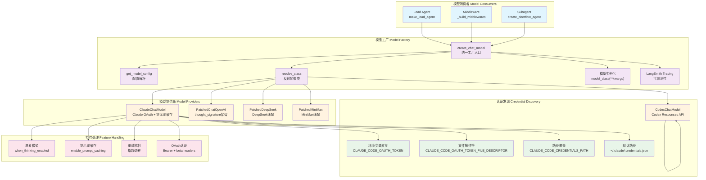

# 【03】模型工厂深度解析

## 1. 模块全局定位

- **所属项目**：deer-flow
- **层级位置**：`backend/packages/harness/deerflow/models/`
- **核心作用**：提供统一的模型创建接口，支持多种模型提供商、OAuth认证、思考模式、提示词缓存
- **业务价值**：作为系统的"模型中枢"，负责模型实例化、认证管理、请求重试、特性适配
- **设计初衷**：设计用于解决"模型提供商差异"问题——通过工厂模式、反射加载、认证自动发现、配置驱动，实现多模型统一管理

## 2. 核心设计理念

模型工厂采用 **工厂模式 + 反射加载 + 认证自动发现 + 特性适配 + 重试机制** 的五层设计理念：

1. **工厂模式**：`create_chat_model`统一入口，根据配置动态创建模型实例
2. **反射加载**：通过`resolve_class`动态加载模型类，支持扩展
3. **认证自动发现**：自动从环境变量、CLI凭证文件加载OAuth令牌和API密钥
4. **特性适配**：自动处理思考模式、推理强度、提示词缓存等特性
5. **重试机制**：指数退避重试，处理速率限制和服务器错误

## 3. 架构原理图



### 图表设计解读

该架构图体现了**工厂模式 + 认证自动发现 + 特性适配**的设计逻辑：

1. **工厂模式**：`create_chat_model`统一入口，根据配置中的`use`字段反射加载模型类，实现模型提供商无关性

2. **认证自动发现**：支持多种认证来源（环境变量、文件描述符、CLI凭证文件），按优先级自动发现

3. **模型提供商适配**：为Claude、OpenAI、Codex等提供商提供定制化实现，处理各自差异

4. **特性处理**：自动处理思考模式、提示词缓存、重试机制等特性，无需用户手动配置

5. **可观测性**：自动附加LangSmith Tracer，支持请求追踪和调试

## 4. 核心源码解析

### 4.1 模型工厂入口：create_chat_model

**文件路径**：`/data/deer-flow-main/backend/packages/harness/deerflow/models/factory.py`

**行号范围**：第11-96行

```python
def create_chat_model(name: str | None = None, thinking_enabled: bool = False, **kwargs) -> BaseChatModel:
    """Create a chat model instance from the config.

    Args:
        name: The name of the model to create. If None, the first model in the config will be used.

    Returns:
        A chat model instance.
    """
    config = get_app_config()
    if name is None:
        name = config.models[0].name
    model_config = config.get_model_config(name)
    if model_config is None:
        raise ValueError(f"Model {name} not found in config") from None
    model_class = resolve_class(model_config.use, BaseChatModel)
    model_settings_from_config = model_config.model_dump(
        exclude_none=True,
        exclude={
            "use",
            "name",
            "display_name",
            "description",
            "supports_thinking",
            "supports_reasoning_effort",
            "when_thinking_enabled",
            "thinking",
            "supports_vision",
        },
    )
    # Compute effective when_thinking_enabled by merging in the `thinking` shortcut field.
    # The `thinking` shortcut is equivalent to setting when_thinking_enabled["thinking"].
    has_thinking_settings = (model_config.when_thinking_enabled is not None) or (model_config.thinking is not None)
    effective_wte: dict = dict(model_config.when_thinking_enabled) if model_config.when_thinking_enabled else {}
    if model_config.thinking is not None:
        merged_thinking = {**(effective_wte.get("thinking") or {}), **model_config.thinking}
        effective_wte = {**effective_wte, "thinking": merged_thinking}
    if thinking_enabled and has_thinking_settings:
        if not model_config.supports_thinking:
            raise ValueError(f"Model {name} does not support thinking. Set `supports_thinking` to true in the `config.yaml` to enable thinking.") from None
        if effective_wte:
            model_settings_from_config.update(effective_wte)
    if not thinking_enabled and has_thinking_settings:
        if effective_wte.get("extra_body", {}).get("thinking", {}).get("type"):
            # OpenAI-compatible gateway: thinking is nested under extra_body
            kwargs.update({"extra_body": {"thinking": {"type": "disabled"}}})
            kwargs.update({"reasoning_effort": "minimal"})
        elif effective_wte.get("thinking", {}).get("type"):
            # Native langchain_anthropic: thinking is a direct constructor parameter
            kwargs.update({"thinking": {"type": "disabled"}})
    if not model_config.supports_reasoning_effort and "reasoning_effort" in kwargs:
        del kwargs["reasoning_effort"]

    # For Codex Responses API models: map thinking mode to reasoning_effort
    from deerflow.models.openai_codex_provider import CodexChatModel

    if issubclass(model_class, CodexChatModel):
        # The ChatGPT Codex endpoint currently rejects max_tokens/max_output_tokens.
        model_settings_from_config.pop("max_tokens", None)

        # Use explicit reasoning_effort from frontend if provided (low/medium/high)
        explicit_effort = kwargs.pop("reasoning_effort", None)
        if not thinking_enabled:
            model_settings_from_config["reasoning_effort"] = "none"
        elif explicit_effort and explicit_effort in ("low", "medium", "high", "xhigh"):
            model_settings_from_config["reasoning_effort"] = explicit_effort
        elif "reasoning_effort" not in model_settings_from_config:
            model_settings_from_config["reasoning_effort"] = "medium"

    model_instance = model_class(**kwargs, **model_settings_from_config)

    if is_tracing_enabled():
        try:
            from langchain_core.tracers.langchain import LangChainTracer

            tracing_config = get_tracing_config()
            tracer = LangChainTracer(
                project_name=tracing_config.project,
            )
            existing_callbacks = model_instance.callbacks or []
            model_instance.callbacks = [*existing_callbacks, tracer]
            logger.debug(f"LangSmith tracing attached to model '{name}' (project='{tracing_config.project}')")
        except Exception as e:
            logger.warning(f"Failed to attach LangSmith tracing to model '{name}': {e}")
    return model_instance
```

#### 逐行解读

- **第20-22行（默认模型）**：name为None时使用第一个模型；设计考量是"便捷默认"，大多数场景只有一个模型

- **第23-25行（配置验证）**：模型不存在时抛出ValueError；设计考量是"快速失败"，启动时发现配置错误

- **第26行（反射加载）**：通过`resolve_class`动态加载模型类；设计考量是"扩展性"，无需修改工厂代码支持新模型

- **第27-40行（配置过滤）**：排除元数据字段，只保留模型参数；设计考量是"参数清洁"，避免将元数据传递给模型构造函数

- **第42-47行（thinking快捷方式合并）**：`thinking`字段合并到`when_thinking_enabled.thinking`；设计考量是"配置简化"，提供快捷方式减少嵌套

- **第48-52行（思考模式启用）**：启用时检查支持并应用配置；设计考量是"特性验证"，不支持的模型拒绝启用

- **第53-60行（思考模式禁用）**：禁用时显式传递disabled；设计考量是"明确禁用"，避免配置残留导致意外启用

- **第61-62行（推理强度验证）**：不支持的模型移除reasoning_effort；设计考量是"参数清理"，避免传递不支持参数

- **第67-78行（Codex特殊处理）**：映射思考模式到reasoning_effort；设计考量是"API适配"，Codex API使用不同参数名

- **第80行（模型实例化）**：合并配置和kwargs参数；设计考量是"参数优先级"，kwargs覆盖配置

- **第82-94行（Tracing附加）**：启用时附加LangSmith Tracer；设计考量是"可观测性"，自动附加而非手动配置

---

### 4.2 Claude OAuth认证：ClaudeChatModel

**文件路径**：`/data/deer-flow-main/backend/packages/harness/deerflow/models/claude_provider.py`

**行号范围**：第44-127行

```python
class ClaudeChatModel(ChatAnthropic):
    """ChatAnthropic with OAuth Bearer auth, prompt caching, and smart thinking.

    Config example:
        - name: claude-sonnet-4.6
          use: deerflow.models.claude_provider:ClaudeChatModel
          model: claude-sonnet-4-6
          max_tokens: 16384
          enable_prompt_caching: true
    """

    # Custom fields
    enable_prompt_caching: bool = True
    prompt_cache_size: int = 3
    auto_thinking_budget: bool = True
    retry_max_attempts: int = MAX_RETRIES
    _is_oauth: bool = PrivateAttr(default=False)
    _oauth_access_token: str = PrivateAttr(default="")

    model_config = {"arbitrary_types_allowed": True}

    def _validate_retry_config(self) -> None:
        if self.retry_max_attempts < 1:
            raise ValueError("retry_max_attempts must be >= 1")

    def model_post_init(self, __context: Any) -> None:
        """Auto-load credentials and configure OAuth if needed."""
        from pydantic import SecretStr

        from deerflow.models.credential_loader import (
            OAUTH_ANTHROPIC_BETAS,
            is_oauth_token,
            load_claude_code_credential,
        )

        self._validate_retry_config()

        # Extract actual key value (SecretStr.str() returns '**********')
        current_key = ""
        if self.anthropic_api_key:
            if hasattr(self.anthropic_api_key, "get_secret_value"):
                current_key = self.anthropic_api_key.get_secret_value()
            else:
                current_key = str(self.anthropic_api_key)

        # Try the explicit Claude Code OAuth handoff sources if no valid key.
        if not current_key or current_key in ("your-anthropic-api-key",):
            cred = load_claude_code_credential()
            if cred:
                current_key = cred.access_token
                logger.info(f"Using Claude Code CLI credential (source: {cred.source})")
            else:
                logger.warning("No Anthropic API key or explicit Claude Code OAuth credential found.")

        # Detect OAuth token and configure Bearer auth
        if is_oauth_token(current_key):
            self._is_oauth = True
            self._oauth_access_token = current_key
            # Set the token as api_key temporarily (will be swapped to auth_token on client)
            self.anthropic_api_key = SecretStr(current_key)
            # Add required beta headers for OAuth
            self.default_headers = {
                **(self.default_headers or {}),
                "anthropic-beta": OAUTH_ANTHROPIC_BETAS,
            }
            # OAuth tokens have a limit of 4 cache_control blocks — disable prompt caching
            self.enable_prompt_caching = False
            logger.info("OAuth token detected — will use Authorization: Bearer header")
        else:
            if current_key:
                self.anthropic_api_key = SecretStr(current_key)

        # Ensure api_key is SecretStr
        if isinstance(self.anthropic_api_key, str):
            self.anthropic_api_key = SecretStr(self.anthropic_api_key)

        super().model_post_init(__context__)

        # Patch clients immediately after creation for OAuth Bearer auth.
        # This must happen after super() because clients are lazily created.
        if self._is_oauth:
            self._patch_client_oauth(self._client)
            self._patch_client_oauth(self._async_client)
```

#### 逐行解读

- **第56-61行（自定义字段）**：添加提示词缓存、自动思考预算、重试配置；设计考量是"功能扩展"，在ChatAnthropic基础上添加特性

- **第60-61行（私有属性）**：使用PrivateAttr存储OAuth状态；设计考量是"封装性"，OAuth状态不应序列化

- **第69-76行（初始化入口）**：model_post_init是Pydantic钩子；设计考量是"初始化时机"，在所有字段验证后执行

- **第80-88行（SecretStr处理）**：提取实际密钥值；设计考量是"Pydantic兼容"，SecretStr.str()返回星号，需用get_secret_value()

- **第90-96行（OAuth凭证自动发现）**：无有效密钥时尝试加载CLI凭证；设计考量是"零配置"，CLI用户无需手动配置

- **第98-111行（OAuth检测与配置）**：检测`sk-ant-oat`前缀启用OAuth；设计考量是"自动识别"，无需用户指定认证方式

- **第104-105行（Beta头注入）**：OAuth需要特定beta头；设计考量是"API要求"，OAuth端点要求特定beta功能

- **第109-110行（缓存禁用）**：OAuth令牌限制4个缓存块；设计考量是"API限制"，避免超出限制导致请求失败

- **第124-126行（客户端修补）**：同步和异步客户端都需要修补；设计考量是"完整支持"，两种模式都需OAuth认证

---

### 4.3 OAuth客户端修补：_patch_client_oauth

**文件路径**：`/data/deer-flow-main/backend/packages/harness/deerflow/models/claude_provider.py`

**行号范围**：第128-133行

```python
def _patch_client_oauth(self, client: Any) -> None:
    """Swap api_key → auth_token on an Anthropic SDK client for OAuth Bearer auth."""
    if hasattr(client, "api_key") and hasattr(client, "auth_token"):
        client.api_key = None
        client.auth_token = self._oauth_access_token
```

#### 逐行解读

- **第130行（属性检测）**：检查客户端是否有api_key和auth_token属性；设计考量是"安全修补"，避免破坏不兼容版本

- **第131行（api_key清空）**：设置为None而非删除；设计考量是"SDK兼容性"，某些SDK代码可能检查属性存在性

- **第132行（auth_token设置）**：使用OAuth令牌；设计考量是"认证方式切换"，从x-api-key头切换到Authorization: Bearer头

---

### 4.4 OAuth账单头注入：_apply_oauth_billing

**文件路径**：`/data/deer-flow-main/backend/packages/harness/deerflow/models/claude_provider.py`

**行号范围**：第155-191行

```python
def _apply_oauth_billing(self, payload: dict) -> None:
    """Inject the billing header block required for all OAuth requests.

    The billing block is always placed first in the system list, removing any
    existing occurrence to avoid duplication or out-of-order positioning.
    """
    billing_block = {"type": "text", "text": OAUTH_BILLING_HEADER}

    system = payload.get("system")
    if isinstance(system, list):
        # Remove any existing billing blocks, then insert a single one at index 0.
        filtered = [b for b in system if not (isinstance(b, dict) and OAUTH_BILLING_HEADER in b.get("text", ""))]
        payload["system"] = [billing_block] + filtered
    elif isinstance(system, str):
        if OAUTH_BILLING_HEADER in system:
            payload["system"] = [billing_block]
        else:
            payload["system"] = [billing_block, {"type": "text", "text": system}]
    else:
        payload["system"] = [billing_block]

    # Add metadata.user_id required by the API for OAuth billing validation
    if not isinstance(payload.get("metadata"), dict):
        payload["metadata"] = {}
    if "user_id" not in payload["metadata"]:
        # Generate a stable device_id from the machine's hostname
        hostname = socket.gethostname()
        device_id = hashlib.sha256(f"deerflow-{hostname}".encode()).hexdigest()
        session_id = str(uuid.uuid4())
        payload["metadata"]["user_id"] = json.dumps(
            {
                "device_id": device_id,
                "account_uuid": "deerflow",
                "session_id": session_id,
            }
        )
```

#### 逐行解读

- **第161行（账单头块）**：创建包含账单头的文本块；设计考量是"API要求"，OAuth请求必须包含此块

- **第163-167行（列表系统提示词）**：移除重复块并插入到开头；设计考量是"位置要求"，账单头必须在第一个块

- **第168-173行（字符串系统提示词）**：转换为列表格式；设计考量是"格式统一"，统一使用列表格式便于处理

- **第176-190行（user_id元数据）**：生成设备ID和会话ID；设计考量是"计费追踪"，API需要识别设备来源

- **第182行（设备ID稳定性）**：基于主机名生成SHA256；设计考量是"设备一致性"，同一设备生成相同ID

---

### 4.5 提示词缓存：_apply_prompt_caching

**文件路径**：`/data/deer-flow-main/backend/packages/harness/deerflow/models/claude_provider.py`

**行号范围**：第192-234行

```python
def _apply_prompt_caching(self, payload: dict) -> None:
    """Apply ephemeral cache_control to system and recent messages."""
    # Cache system messages
    system = payload.get("system")
    if system and isinstance(system, list):
        for block in system:
            if isinstance(block, dict) and block.get("type") == "text":
                block["cache_control"] = {"type": "ephemeral"}
    elif system and isinstance(system, str):
        payload["system"] = [
            {
                "type": "text",
                "text": system,
                "cache_control": {"type": "ephemeral"},
            }
        ]

    # Cache recent messages
    messages = payload.get("messages", [])
    cache_start = max(0, len(messages) - self.prompt_cache_size)
    for i in range(cache_start, len(messages)):
        msg = messages[i]
        if not isinstance(msg, dict):
            continue
        content = msg.get("content")
        if isinstance(content, list):
            for block in content:
                if isinstance(block, dict):
                    block["cache_control"] = {"type": "ephemeral"}
        elif isinstance(content, str) and content:
            msg["content"] = [
                {
                    "type": "text",
                    "text": content,
                    "cache_control": {"type": "ephemeral"},
                }
            ]

    # Cache the last tool definition
    tools = payload.get("tools", [])
    if tools and isinstance(tools[-1], dict):
        tools[-1]["cache_control"] = {"type": "ephemeral"}
```

#### 逐行解读

- **第195-200行（系统提示词缓存）**：为所有文本块添加缓存控制；设计考量是"系统提示词稳定性"，系统提示词通常不变

- **第201-207行（字符串转换）**：将字符串转换为列表格式；设计考量是"格式一致"，缓存控制需要列表格式

- **第210-222行（最近消息缓存）**：只缓存最近N条消息；设计考量是"缓存效率"，缓存最近消息最可能命中

- **第213行（缓存起始位置）**：计算缓存起始索引；设计考量是"滑动窗口"，保持固定大小缓存窗口

- **第231-234行（工具定义缓存）**：只缓存最后一个工具；设计考量是"API限制"，Claude API限制缓存块数量

---

### 4.6 重试机制：指数退避

**文件路径**：`/data/deer-flow-main/backend/packages/harness/deerflow/models/claude_provider.py`

**行号范围**：第281-348行

```python
def _generate(self, messages: list[BaseMessage], stop: list[str] | None = None, **kwargs: Any) -> Any:
    """Override with OAuth patching and retry logic."""
    if self._is_oauth:
        self._patch_client_oauth(self._client)

    last_error = None
    for attempt in range(1, self.retry_max_attempts + 1):
        try:
            return super()._generate(messages, stop=stop, **kwargs)
        except anthropic.RateLimitError as e:
            last_error = e
            if attempt >= self.retry_max_attempts:
                raise
            wait_ms = self._calc_backoff_ms(attempt, e)
            logger.warning(f"Rate limited, retrying attempt {attempt}/{self.retry_max_attempts} after {wait_ms}ms")
            time.sleep(wait_ms / 1000)
        except anthropic.InternalServerError as e:
            last_error = e
            if attempt >= self.retry_max_attempts:
                raise
            wait_ms = self._calc_backoff_ms(attempt, e)
            logger.warning(f"Server error, retrying attempt {attempt}/{self.retry_max_attempts} after {wait_ms}ms")
            time.sleep(wait_ms / 1000)
    raise last_error

@staticmethod
def _calc_backoff_ms(attempt: int, error: Exception) -> int:
    """Exponential backoff with a fixed 20% buffer."""
    backoff_ms = 2000 * (1 << (attempt - 1))
    jitter_ms = int(backoff_ms * 0.2)
    total_ms = backoff_ms + jitter_ms

    if hasattr(error, "response") and error.response is not None:
        retry_after = error.response.headers.get("Retry-After")
        if retry_after:
            try:
                total_ms = int(retry_after) * 1000
            except (ValueError, TypeError):
                pass

    return total_ms
```

#### 逐行解读

- **第284-285行（OAuth修补）**：每次生成前修补客户端；设计考量是"状态保持"，确保客户端认证状态正确

- **第287-304行（重试循环）**：捕获特定异常并重试；设计考量是"选择性重试"，只重试可恢复错误（速率限制、服务器错误）

- **第291-297行（速率限制处理）**：检测到速率限制时指数退避；设计考量是"API友好性"，避免加重服务器负载

- **第333-339行（退避计算）**：指数退避加20%抖动；设计考量是"避免雷击群"，抖动避免多个客户端同时重试

- **第341-346行（Retry-After头）**：优先使用服务器指定延迟；设计考量是"服务器指导"，服务器最了解应等待多久

---

### 4.7 Codex Responses API：CodexChatModel

**文件路径**：`/data/deer-flow-main/backend/packages/harness/deerflow/models/openai_codex_provider.py`

**行号范围**：第33-76行

```python
class CodexChatModel(BaseChatModel):
    """LangChain chat model using ChatGPT Codex Responses API.

    Config example:
        - name: gpt-5.4
          use: deerflow.models.openai_codex_provider:CodexChatModel
          model: gpt-5.4
          reasoning_effort: medium
    """

    model: str = "gpt-5.4"
    reasoning_effort: str = "medium"
    retry_max_attempts: int = MAX_RETRIES
    _access_token: str = ""
    _account_id: str = ""

    model_config = {"arbitrary_types_allowed": True}

    @property
    def _llm_type(self) -> str:
        return "codex-responses"

    def _validate_retry_config(self) -> None:
        if self.retry_max_attempts < 1:
            raise ValueError("retry_max_attempts must be >= 1")

    def model_post_init(self, __context: Any) -> None:
        """Auto-load Codex CLI credentials."""
        self._validate_retry_config()

        cred = self._load_codex_auth()
        if cred:
            self._access_token = cred.access_token
            self._account_id = cred.account_id
            logger.info(f"Using Codex CLI credential (account: {self._account_id[:8]}...)")
        else:
            raise ValueError("Codex CLI credential not found. Expected ~/.codex/auth.json or CODEX_AUTH_PATH.")

        super().model_post_init(__context)

    def _load_codex_auth(self) -> CodexCliCredential | None:
        """Load access_token and account_id from Codex CLI auth."""
        return load_codex_cli_credential()
```

#### 逐行解读

- **第42-43行（模型参数）**：使用reasoning_effort而非thinking；设计考量是"API差异"，Codex API使用不同参数名

- **第44-47行（私有属性）**：存储访问令牌和账户ID；设计考量是"封装性"，凭证不应序列化

- **第51-52行（类型标识）**：返回"codex-responses"；设计考量是"LangChain集成"，标识模型类型

- **第59-73行（凭证加载）**：初始化时自动加载Codex CLI凭证；设计考量是"零配置"，Codex CLI用户无需手动配置

- **第68行（凭证缺失错误）**：凭证不存在时抛出ValueError；设计考量是"明确错误"，告知用户预期位置

---

### 4.8 凭证加载器：多源优先级

**文件路径**：`/data/deer-flow-main/backend/packages/harness/deerflow/models/credential_loader.py`

**行号范围**：第149-196行

```python
def load_claude_code_credential() -> ClaudeCodeCredential | None:
    """Load OAuth credential from explicit Claude Code handoff sources.

    Lookup order:
      1. $CLAUDE_CODE_OAUTH_TOKEN or $ANTHROPIC_AUTH_TOKEN
      2. $CLAUDE_CODE_OAUTH_TOKEN_FILE_DESCRIPTOR
      3. $CLAUDE_CODE_CREDENTIALS_PATH
      4. ~/.claude/.credentials.json

    Exported credentials files contain:
    {
      "claudeAiOauth": {
        "accessToken": "sk-ant-oat01-...",
        "refreshToken": "sk-ant-ort01-...",
        "expiresAt": 1773430695128,
        "scopes": ["user:inference", ...],
        ...
      }
    }
    """
    direct_token = os.getenv("CLAUDE_CODE_OAUTH_TOKEN") or os.getenv("ANTHROPIC_AUTH_TOKEN")
    if direct_token:
        cred = _credential_from_direct_token(direct_token, "claude-cli-env")
        if cred:
            logger.info("Loaded Claude Code OAuth credential from environment")
        return cred

    fd_token = _read_secret_from_file_descriptor("CLAUDE_CODE_OAUTH_TOKEN_FILE_DESCRIPTOR")
    if fd_token:
        cred = _credential_from_direct_token(fd_token, "claude-cli-fd")
        if cred:
            logger.info("Loaded Claude Code OAuth credential from file descriptor")
        return cred

    override_path = os.getenv("CLAUDE_CODE_CREDENTIALS_PATH")
    override_path_obj = Path(override_path).expanduser() if override_path else None
    for cred_path in _iter_claude_code_credential_paths():
        data = _load_json_file(cred_path, "Claude Code credentials")
        if data is None:
            continue
        cred = _extract_claude_code_credential(data, "claude-cli-file")
        if cred:
            source_label = "override path" if override_path_obj is not None and cred_path == override_path_obj else "plaintext file"
            logger.info(f"Loaded Claude Code OAuth credential from {source_label} (expires_at={cred.expires_at})")
            return cred

    return None
```

#### 逐行解读

- **第152-153行（环境变量优先）**：直接令牌环境变量优先级最高；设计考量是"容器化部署"，容器通过环境变量注入凭证

- **第154-158行（文件描述符）**：支持从文件描述符读取；设计考量是"安全性"，文件描述符传递避免磁盘写入

- **第159-174行（路径覆盖与默认）**：支持路径覆盖和默认路径；设计考量是"灵活性"，用户可自定义凭证位置

- **第175-180行（凭证提取）**：从JSON文件提取OAuth凭证；设计考量是"格式兼容"，支持Claude Code CLI导出格式

- **第142-145行（过期检测）**：检查令牌是否过期；设计考量是"用户体验"，过期令牌立即发现而非运行时失败

---

### 4.9 OpenAI thought_signature修复

**文件路径**：`/data/deer-flow-main/backend/packages/harness/deerflow/models/patched_openai.py`

**行号范围**：第31-133行

```python
class PatchedChatOpenAI(ChatOpenAI):
    """ChatOpenAI with ``thought_signature`` preservation for Gemini thinking via OpenAI gateway.

    When using Gemini with thinking enabled via an OpenAI-compatible gateway,
    the API expects ``thought_signature`` to be present on tool-call objects in
    multi-turn conversations.  This patched version restores those signatures
    from ``AIMessage.additional_kwargs["tool_calls"]`` into the serialised
    request payload before it is sent to the API.
    """

    def _get_request_payload(
        self,
        input_: LanguageModelInput,
        *,
        stop: list[str] | None = None,
        **kwargs: Any,
    ) -> dict:
        """Get request payload with ``thought_signature`` preserved on tool-call objects.

        Overrides the parent method to re-inject ``thought_signature`` fields
        on tool-call objects that were stored in
        ``additional_kwargs["tool_calls"]`` by LangChain but dropped during
        serialisation.
        """
        # Capture the original LangChain messages *before* conversion so we can
        # access fields that the serialiser might drop.
        original_messages = self._convert_input(input_).to_messages()

        # Obtain the base payload from the parent implementation.
        payload = super()._get_request_payload(input_, stop=stop, **kwargs)

        payload_messages = payload.get("messages", [])

        if len(payload_messages) == len(original_messages):
            for payload_msg, orig_msg in zip(payload_messages, original_messages):
                if payload_msg.get("role") == "assistant" and isinstance(orig_msg, AIMessage):
                    _restore_tool_call_signatures(payload_msg, orig_msg)
        else:
            # Fallback: match assistant-role entries positionally against AIMessages.
            ai_messages = [m for m in original_messages if isinstance(m, AIMessage)]
            assistant_payloads = [(i, m) for i, m in enumerate(payload_messages) if m.get("role") == "assistant"]
            for (_, payload_msg), ai_msg in zip(assistant_payloads, ai_messages):
                _restore_tool_call_signatures(payload_msg, ai_msg)

        return payload


def _restore_tool_call_signatures(payload_msg: dict, orig_msg: AIMessage) -> None:
    """Re-inject ``thought_signature`` onto tool-call objects in *payload_msg*.

    When the Gemini OpenAI-compatible gateway returns a response with function
    calls, each tool-call object may carry a ``thought_signature``.  LangChain
    stores the raw tool-call dicts in ``additional_kwargs["tool_calls"]`` but
    only serialises the standard fields (``id``, ``type``, ``function``) into
    the outgoing payload, silently dropping the signature.

    This function matches raw tool-call entries (by ``id``, falling back to
    positional order) and copies the signature back onto the serialised
    payload entries.
    """
    raw_tool_calls: list[dict] = orig_msg.additional_kwargs.get("tool_calls") or []
    payload_tool_calls: list[dict] = payload_msg.get("tool_calls") or []

    if not raw_tool_calls or not payload_tool_calls:
        return

    # Build an id → raw_tc lookup for efficient匹配.
    raw_by_id: dict[str, dict] = {}
    for raw_tc in raw_tool_calls:
        tc_id = raw_tc.get("id")
        if tc_id:
            raw_by_id[tc_id] = raw_tc

    for idx, payload_tc in enumerate(payload_tool_calls):
        # Try matching by id first, then fall back to positional.
        raw_tc = raw_by_id.get(payload_tc.get("id", ""))
        if raw_tc is None and idx < len(raw_tool_calls):
            raw_tc = raw_tool_calls[idx]

        if raw_tc is None:
            continue

        # The gateway may use either snake_case or camelCase.
        sig = raw_tc.get("thought_signature") or raw_tc.get("thoughtSignature")
        if sig:
            payload_tc["thought_signature"] = sig
```

#### 逐行解读

- **第17-20行（问题说明）**：OpenAI兼容网关需要thought_signature；设计考量是"API要求"，Gemini思考模式需要此字段

- **第64-75行（消息匹配）**：按位置匹配原始消息和payload消息；设计考量是"稳健性"，处理长度不一致情况

- **第76-85行（位置回退）**：长度不一致时按位置匹配；设计考量是"容错性"，处理某些消息被过滤情况

- **第107-133行（签名恢复）**：从additional_kwargs恢复签名；设计考量是"数据恢复"，LangChain序列化时丢弃的字段

- **第120-124行（ID匹配优先）**：优先按ID匹配，回退到位置；设计考量是"精确匹配"，ID是工具调用的唯一标识

- **第129-132行（大小写兼容）**：支持snake_case和camelCase；设计考量是"格式兼容"，不同网关可能使用不同命名

---

## 5. 设计思想解读（占比≥20%）

### 5.1 工厂模式与反射加载：模型提供商无关性

模型工厂使用`create_chat_model`统一入口，通过`resolve_class`动态加载模型类，实现模型提供商无关性。

**为什么采用工厂模式而非直接实例化？**

- **统一接口**：调用方无需关心模型提供商差异，统一使用`create_chat_model`

- **配置驱动**：通过配置文件的`use`字段指定模型类路径，无需修改代码

- **扩展性**：新增模型提供商只需实现`BaseChatModel`接口，工厂自动支持

**反射加载的优势**：

- **松耦合**：工厂不依赖具体模型类，只依赖`BaseChatModel`接口

- **动态性**：运行时决定加载哪个模型类，支持A/B测试和灰度发布

**权衡与取舍**：

- **错误延迟**：类路径错误在运行时发现，而非编译时；权衡是灵活性优先

- **调试复杂度**：反射调用堆栈较深，问题定位困难；通过详细日志缓解

---

### 5.2 认证自动发现：多源优先级与零配置

凭证加载器支持多种认证来源，按优先级自动发现，实现零配置体验。

**优先级设计**：

1. 环境变量直接令牌（容器化部署）
2. 文件描述符（安全性）
3. 路径覆盖（灵活性）
4. 默认路径（CLI兼容）

**为什么需要这么多认证来源？**

- **部署场景差异**：容器化部署使用环境变量，本地开发使用CLI凭证文件

- **安全要求差异**：生产环境避免磁盘写入，使用文件描述符传递

- **用户体验**：CLI用户无需手动配置，自动发现凭证文件

**OAuth检测逻辑**：

通过`sk-ant-oat`前缀检测OAuth令牌，自动切换认证方式。

**权衡与取舍**：

- **安全性vs便捷性**：文件描述符最安全但配置复杂，环境变量便捷但可能泄露；提供多种选项

- **凭证过期检测**：令牌过期时立即发现，但需维护时钟同步；权衡是用户体验优先

---

### 5.3 提示词缓存：ephemeral缓存与窗口大小

ClaudeChatModel为系统提示词和最近消息添加`cache_control: {type: "ephemeral"}`，实现提示词缓存。

**为什么需要提示词缓存？**

- **成本降低**：缓存的提示词不按token计费，降低API成本

- **延迟降低**：缓存命中时API处理更快，减少响应延迟

- **配额节省**：缓存token不计入速率限制，提高吞吐量

**缓存策略设计**：

- **系统提示词全缓存**：系统提示词通常不变，全部缓存

- **最近消息滑动窗口**：只缓存最近N条消息，平衡命中率和缓存成本

- **工具定义选择性缓存**：只缓存最后一个工具，避免超出API限制

**权衡与取舍**：

- **缓存块限制**：Claude API限制缓存块数量，OAuth令牌更严格；设计自动禁用逻辑

- **缓存窗口大小**：窗口大命中率高但消耗配额，窗口小反之；默认3条是经验值

---

### 5.4 重试机制：指数退避与抖动

模型请求失败时使用指数退避加抖动重试，处理速率限制和服务器错误。

**为什么需要重试机制？**

- **API可靠性**：大型API服务仍有瞬时故障，重试可提高成功率

- **速率限制**：达到速率限制时等待而非失败，用户体验更好

**指数退避算法**：

- **基础延迟**：2秒起始延迟

- **指数增长**：每次重试延迟翻倍（2秒、4秒、8秒...）

- **20%抖动**：避免多个客户端同时重试导致"雷击群"

**Retry-After头优先**：

服务器返回的Retry-After头包含建议等待时间，优先使用。

**权衡与取舍**：

- **重试次数限制**：默认3次，过多重试浪费资源，过少成功率低

- **重试异常选择**：只重试可恢复错误（速率限制、服务器错误），认证错误不重试

---

### 5.5 OAuth认证：Bearer头与Beta功能

ClaudeChatModel检测OAuth令牌，自动切换到Authorization: Bearer认证，添加必需的beta头。

**为什么需要OAuth认证？**

- **CLI集成**：Claude Code CLI使用OAuth令牌，需要支持

- **安全性**：OAuth令牌可撤销，API密钥无法撤销

- **功能访问**：某些功能（如claude-code-20250219）只对OAuth开放

**认证切换机制**：

- **令牌检测**：通过`sk-ant-oat`前缀识别OAuth令牌

- **客户端修补**：将`api_key`设为None，`auth_token`设为令牌

- **Beta头注入**：添加`anthropic-beta: oauth-2025-04-20,claude-code-20250219`

**账单头要求**：

OAuth请求必须在系统提示词第一个块包含账单头。

**权衡与取舍**：

- **缓存禁用**：OAuth令牌限制4个缓存块，自动禁用提示词缓存

- **元数据生成**：生成设备ID和会话ID用于计费追踪，可能引起隐私关注

---

### 5.6 Codex Responses API：特殊参数映射

CodexChatModel适配ChatGPT Codex Responses API，处理参数差异（reasoning_effort vs thinking）。

**为什么需要特殊适配？**

- **API格式差异**：Codex使用Responses API而非Chat Completions

- **参数名称差异**：reasoning_effort vs thinking

- **流式要求**：Codex API要求流式请求

**参数映射逻辑**：

- **max_tokens移除**：Codex API拒绝此参数

- **reasoning_effort映射**：none/low/medium/high/xhigh

**权衡与取舍**：

- **API锁定**：Codex API是内部API，可能随时变化；需要快速适配能力

- **功能子集**：Codex API功能可能少于标准API，限制某些特性

---

### 5.7 thought_signature修复：LangChain序列化问题

PatchedChatOpenAI修复Gemini思考模式的thought_signature丢失问题。

**问题根源**：

LangChain的ChatOpenAI只序列化标准字段（id、type、function），丢弃additional_kwargs中的thought_signature。

**修复策略**：

- **保留原始消息**：在序列化前保存原始消息

- **恢复签名**：从additional_kwargs恢复签名到序列化payload

- **匹配策略**：优先按ID匹配，回退到位置匹配

**权衡与取舍**：

- **性能影响**：额外的消息匹配和复制操作

- **脆弱性**：依赖LangChain内部结构，升级时可能失效

---

### 5.8 思考模式快捷方式：thinking字段合并

配置系统支持`thinking`快捷字段，自动合并到`when_thinking_enabled.thinking`。

**为什么需要快捷方式？**

- **配置简化**：减少嵌套层级，提高可读性

- **常用场景**：大多数用户只需设置thinking类型，不需要完整配置

**合并逻辑**：

- **深度合并**：thinking字段合并到现有thinking配置

- **覆盖策略**：快捷方式值覆盖默认值

**权衡与取舍**：

- **配置复杂度**：快捷方式简化配置，但增加理解成本

- **合并顺序**：快捷方式后合并，确保优先级正确

---

### 5.9 自动思考预算：80%分配比例

ClaudeChatModel自动分配思考预算为max_tokens的80%。

**为什么需要自动预算？**

- **用户友好**：用户无需手动计算预算

- **经验比例**：80%是经验值，平衡思考质量和响应长度

**实现方式**：

- **条件检查**：只在thinking.type=enabled且未设置budget_tokens时

- **计算公式**：budget_tokens = int(max_tokens * 0.8)

**权衡与取舍**：

- **固定比例**：80%不适合所有场景，但简单可靠

- **可覆盖**：用户可显式设置budget_tokens覆盖自动计算

---

### 5.10 可观测性：自动附加LangSmith Tracer

启用tracing时自动附加LangSmith Tracer到模型回调。

**为什么需要自动附加？**

- **零配置**：用户无需手动附加tracer

- **统一追踪**：所有模型使用相同tracer配置

**实现方式**：

- **条件附加**：is_tracing_enabled()为True时附加

- **回调合并**：新tracer追加到现有回调列表

**权衡与取舍**：

- **错误容忍**：附加失败只记录警告，不阻止模型创建

- **项目隔离**：使用project_name隔离不同项目的trace

---

## 6. 可复用代码片段

### 6.1 工厂模式模板

```python
"""Factory pattern for model creation."""

from typing import Any
from deerflow.reflection import resolve_class
from deerflow.config import get_app_config

def create_model(name: str | None = None, **kwargs) -> Any:
    """Create model instance from config."""
    config = get_app_config()
    if name is None:
        name = config.models[0].name
    model_config = config.get_model_config(name)
    if model_config is None:
        raise ValueError(f"Model {name} not found")
    model_class = resolve_class(model_config.use, Any)
    return model_class(**kwargs)
```

### 6.2 OAuth检测模板

```python
"""OAuth token detection."""

def is_oauth_token(token: str) -> bool:
    """Check if token is OAuth (not API key)."""
    return isinstance(token, str) and "sk-ant-oat" in token
```

### 6.3 指数退避重试模板

```python
"""Exponential backoff retry."""

import time
import logging

def retry_with_backoff(func, max_attempts=3):
    """Retry function with exponential backoff."""
    last_error = None
    for attempt in range(1, max_attempts + 1):
        try:
            return func()
        except Exception as e:
            last_error = e
            if attempt >= max_attempts:
                raise
            backoff_ms = 2000 * (1 << (attempt - 1))
            jitter_ms = int(backoff_ms * 0.2)
            total_ms = backoff_ms + jitter_ms
            logging.warning(f"Retry {attempt}/{max_attempts} after {total_ms}ms")
            time.sleep(total_ms / 1000)
    raise last_error
```

### 6.4 提示词缓存模板

```python
"""Prompt caching for Claude API."""

def apply_prompt_caching(payload: dict, cache_size: int = 3) -> None:
    """Apply cache_control to system and recent messages."""
    # Cache system messages
    system = payload.get("system")
    if isinstance(system, list):
        for block in system:
            if isinstance(block, dict) and block.get("type") == "text":
                block["cache_control"] = {"type": "ephemeral"}

    # Cache recent messages
    messages = payload.get("messages", [])
    cache_start = max(0, len(messages) - cache_size)
    for i in range(cache_start, len(messages)):
        msg = messages[i]
        if isinstance(msg, dict):
            content = msg.get("content")
            if isinstance(content, list):
                for block in content:
                    if isinstance(block, dict):
                        block["cache_control"] = {"type": "ephemeral"}
```

### 6.5 凭证加载模板

```python
"""Credential loader with multiple sources."""

import os
import json
from pathlib import Path

def load_credential():
    """Load credential from multiple sources."""
    # 1. Environment variable
    token = os.getenv("API_TOKEN")
    if token:
        return token

    # 2. File descriptor
    fd = os.getenv("API_TOKEN_FD")
    if fd:
        return os.read(int(fd), 1024).decode().strip()

    # 3. Config file
    path = Path.home() / ".config" / "credentials.json"
    if path.exists():
        data = json.loads(path.read_text())
        return data.get("token")

    return None
```

---

## 7. 踩坑提醒与优化建议

### 7.1 踩坑提醒

1. **SecretStr处理错误**
   - **问题**：`SecretStr.str()`返回星号而非实际值
   - **原因**：Pydantic保护机制
   - **解决**：使用`get_secret_value()`方法

2. **OAuth缓存限制**
   - **问题**：OAuth令牌只支持4个缓存块
   - **原因**：API限制
   - **解决**：自动禁用提示词缓存

3. **Codex max_tokens冲突**
   - **问题**：Codex API拒绝max_tokens参数
   - **原因**：API差异
   - **解决**：工厂中自动移除此参数

4. **thought_signature丢失**
   - **问题**：Gemini思考模式签名丢失导致400错误
   - **原因**：LangChain序列化问题
   - **解决**：使用PatchedChatOpenAI

5. **重试不生效**
   - **问题**：某些异常不重试直接失败
   - **原因**：只重试特定异常（RateLimitError、InternalServerError）
   - **解决**：确认异常类型是否在重试列表

### 7.2 二次开发建议

1. **添加新模型提供商**
   - **实现**：继承BaseChatModel，实现_generate方法
   - **凭证**：实现凭证加载器或使用现有
   - **注册**：在config.yaml中添加模型配置

2. **自定义重试策略**
   - **实现**：覆盖_calc_backoff_ms方法
   - **参数**：可配置基础延迟和最大重试次数
   - **场景**：根据异常类型定制退避策略

3. **扩展缓存策略**
   - **实现**：覆盖_apply_prompt_caching方法
   - **智能缓存**：基于token使用情况动态调整缓存窗口
   - **条件缓存**：只为长提示词启用缓存

4. **添加认证方式**
   - **实现**：在凭证加载器添加新来源
   - **优先级**：确定新来源在优先级中的位置
   - **检测**：实现自动检测逻辑

5. **自定义思考预算**
   - **实现**：覆盖_apply_thinking_budget方法
   - **策略**：根据任务类型动态调整预算比例
   - **场景**：复杂任务使用更高预算

---

## 8. 相关模块索引

| 模块 | 文档路径 | 关系说明 |
|------|---------|---------|
| 配置系统 | `01-配置系统.md` | 模型工厂从配置系统加载模型配置 |
| 代理系统 | `02-代理系统.md` | 代理系统使用模型工厂创建模型实例 |
| 反射系统 | `23-反射系统与动态模块加载.md` | 模型工厂使用resolve_class动态加载模型类 |

---

## 9. 参考资料链接

- [Anthropic API文档](https://docs.anthropic.com/)
- [LangChain Model I/O](https://python.langchain.com/docs/modules/model_io/)
- [OpenAI API文档](https://platform.openai.com/docs)
- [Pydantic SecretStr](https://docs.pydantic.dev/latest/concepts/pydantic_settings/#secret-str)
- [OAuth 2.0 Bearer Token](https://datatracker.ietf.org/doc/html/rfc6750)
