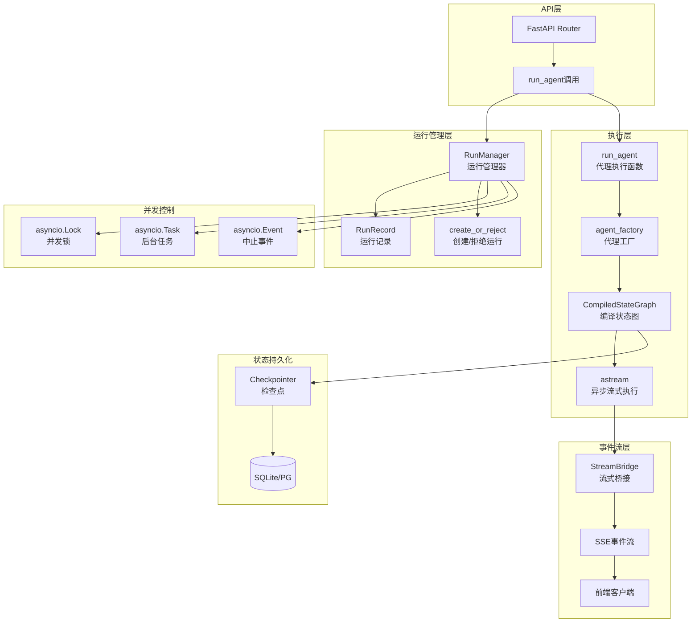
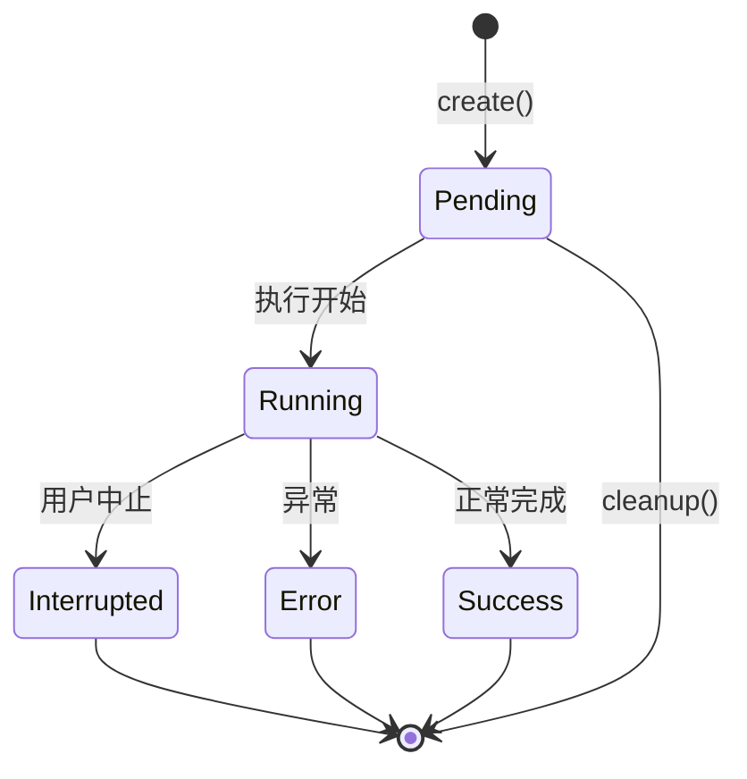

# 【文档编号+模块名】03-运行时管理系统

## 1. 模块全局定位

- **所属项目**: deer-flow
- **层级位置**: backend/packages/harness/deerflow/runtime
- **核心作用**: 运行时管理系统，负责代理执行、运行注册、流式事件发布、状态管理和任务调度
- **业务价值**: 作为代理执行的"指挥官"，管理整个代理生命周期的并发执行、状态跟踪和事件流分发

## 2. 依赖&调用链路 Mermaid图



## 3. 核心目录/文件清单

| 文件 | 绝对路径 | 职责描述 |
|------|---------|---------|
| manager.py | /backend/packages/harness/deerflow/runtime/runs/manager.py | 运行管理器，运行注册和状态管理 |
| worker.py | /backend/packages/harness/deerflow/runtime/runs/worker.py | 后台执行器，代理异步执行 |
| schemas.py | /backend/packages/harness/deerflow/runtime/runs/schemas.py | 运行状态和模式定义 |
| stream_bridge.py | /backend/packages/harness/deerflow/runtime/stream_bridge/ | 流式桥接，事件分发 |
| store.py | /backend/packages/harness/deerflow/runtime/store/ | 状态存储 |
| serialization.py | /backend/packages/harness/deerflow/runtime/serialization.py | 序列化工具 |

## 4. 关键源码深度解析

### 4.1 运行管理器

#### 文件路径: `/backend/packages/harness/deerflow/runtime/runs/manager.py`

```python
"""内存运行注册表"""

import asyncio
import logging
import uuid
from dataclasses import dataclass, field
from datetime import UTC, datetime

from .schemas import DisconnectMode, RunStatus

logger = logging.getLogger(__name__)


@dataclass
class RunRecord:
    """单个运行的可变记录"""
    run_id: str
    thread_id: str
    assistant_id: str | None
    status: RunStatus
    on_disconnect: DisconnectMode
    multitask_strategy: str = "reject"
    metadata: dict = field(default_factory=dict)
    kwargs: dict = field(default_factory=dict)
    created_at: str = ""
    updated_at: str = ""
    task: asyncio.Task | None = field(default=None, repr=False)
    abort_event: asyncio.Event = field(default_factory=asyncio.Event, repr=False)
    abort_action: str = "interrupt"
    error: str | None = None


class RunManager:
    """内存运行注册表。所有变更都受asyncio锁保护。"""

    def __init__(self) -> None:
        self._runs: dict[str, RunRecord] = {}
        self._lock = asyncio.Lock()

    async def create_or_reject(
        self,
        thread_id: str,
        assistant_id: str | None = None,
        *,
        on_disconnect: DisconnectMode = DisconnectMode.cancel,
        metadata: dict | None = None,
        kwargs: dict | None = None,
        multitask_strategy: str = "reject",
    ) -> RunRecord:
        """原子检查进行中的运行并创建新运行

        对于``reject``策略，如果线程已有pending/running运行则抛出``ConflictError``。
        对于``interrupt``/``rollback``，在创建前取消进行中的运行。

        此方法在检查和插入期间持有锁，消除了单独``has_inflight`` + ``create``的TOCTOU竞争。
        """
        run_id = str(uuid.uuid4())
        now = _now_iso()

        async with self._lock:
            # 验证策略
            if multitask_strategy not in ("reject", "interrupt", "rollback"):
                raise UnsupportedStrategyError(f"不支持的多任务策略")

            # 查找进行中的运行
            inflight = [
                r for r in self._runs.values()
                if r.thread_id == thread_id
                and r.status in (RunStatus.pending, RunStatus.running)
            ]

            # 处理冲突
            if multitask_strategy == "reject" and inflight:
                raise ConflictError(f"线程 {thread_id} 已有活动运行")

            if multitask_strategy in ("interrupt", "rollback") and inflight:
                for r in inflight:
                    r.abort_action = multitask_strategy
                    r.abort_event.set()
                    if r.task is not None and not r.task.done():
                        r.task.cancel()
                    r.status = RunStatus.interrupted
                    r.updated_at = now

            # 创建新记录
            record = RunRecord(
                run_id=run_id,
                thread_id=thread_id,
                assistant_id=assistant_id,
                status=RunStatus.pending,
                on_disconnect=on_disconnect,
                multitask_strategy=multitask_strategy,
                metadata=metadata or {},
                kwargs=kwargs or {},
                created_at=now,
                updated_at=now,
            )
            self._runs[run_id] = record

        return record

    async def cancel(self, run_id: str, *, action: str = "interrupt") -> bool:
        """请求取消运行

        Args:
            run_id: 要取消的运行ID
            action: "interrupt"保留检查点，"rollback"回滚到运行前状态

        设置中止事件及操作原因，并取消asyncio任务。
        如果运行处于进行中且取消已启动则返回True。
        """
        async with self._lock:
            record = self._runs.get(run_id)
            if record is None:
                return False
            if record.status not in (RunStatus.pending, RunStatus.running):
                return False
            record.abort_action = action
            record.abort_event.set()
            if record.task is not None and not record.task.done():
                record.task.cancel()
            record.status = RunStatus.interrupted
            record.updated_at = _now_iso()
        return True
```

**解读**:
- **原子操作**: create_or_reject使用单一锁保证检查和创建的原子性
- **多任务策略**: 支持拒绝、中断、回滚三种策略处理并发运行
- **状态机**: 运行状态包括pending、running、success、error、interrupted
- **并发安全**: 所有状态变更都受asyncio.Lock保护
- **资源管理**: 支持延迟清理运行记录

### 4.2 代理执行器

#### 文件路径: `/backend/packages/harness/deerflow/runtime/runs/worker.py`

```python
"""后台代理执行

在``asyncio.Task``内运行代理图，将产生的事件发布到: class:`StreamBridge`。

使用``graph.astream(stream_mode=[...])``，为``values``模式提供正确的完整状态快照，
为``updates``提供正确的``{node: writes}``，为``messages``模式提供``(chunk, metadata)``元组。
"""

async def run_agent(
    bridge: StreamBridge,
    run_manager: RunManager,
    record: RunRecord,
    *,
    checkpointer: Any,
    store: Any | None = None,
    agent_factory: Any,
    graph_input: dict,
    config: dict,
    stream_modes: list[str] | None = None,
    stream_subgraphs: bool = False,
    interrupt_before: list[str] | Literal["*"] | None = None,
    interrupt_after: list[str] | Literal["*"] | None = None,
) -> None:
    """在后台执行代理，将事件发布到*bridge*。"""

    run_id = record.run_id
    thread_id = record.thread_id
    requested_modes: set[str] = set(stream_modes or ["values"])

    try:
        # 1. 标记运行中
        await run_manager.set_status(run_id, RunStatus.running)

        # 2. 记录运行前检查点ID以支持回滚
        pre_run_checkpoint_id = None
        try:
            config_for_check = {"configurable": {"thread_id": thread_id, "checkpoint_ns": ""}}
            ckpt_tuple = await checkpointer.aget_tuple(config_for_check)
            if ckpt_tuple is not None:
                pre_run_checkpoint_id = getattr(ckpt_tuple, "config", {}).get("configable", {}).get("checkpoint_id")
        except Exception:
            logger.debug("无法获取运行 %s 的运行前checkpoint_id", run_id)

        # 3. 发布元数据
        await bridge.publish(
            run_id,
            "metadata",
            {
                "run_id": run_id,
                "thread_id": thread_id,
            },
        )

        # 4. 构建代理
        runtime = Runtime(context={"thread_id": thread_id}, store=store)
        config.setdefault("configurable", {})["__pregel_runtime"] = runtime

        runnable_config = RunnableConfig(**config)
        agent = agent_factory(config=runnable_config)

        # 5. 附加检查点和存储
        if checkpointer is not None:
            agent.checkpointer = checkpointer
        if store is not None:
            agent.store = store

        # 6. 设置中断节点
        if interrupt_before:
            agent.interrupt_before_nodes = interrupt_before
        if interrupt_after:
            agent.interrupt_after_nodes = interrupt_after

        # 7. 构建LangGraph stream_mode列表
        lg_modes: list[str] = []
        for m in requested_modes:
            if m == "messages-tuple":
                lg_modes.append("messages")
            elif m == "events":
                continue
            elif m in _VALID_LG_MODES:
                lg_modes.append(m)
        if not lg_modes:
            lg_modes = ["values"]

        # 8. 使用graph.astream流式执行
        if len(lg_modes) == 1 and not stream_subgraphs:
            single_mode = lg_modes[0]
            async for chunk in agent.astream(graph_input, config=runnable_config, stream_mode=single_mode):
                if record.abort_event.is_set():
                    logger.info("运行 %s 中止请求 — 停止", run_id)
                    break
                sse_event = _lg_mode_to_sse_event(single_mode)
                await bridge.publish(run_id, sse_event, serialize(chunk, mode=single_mode))
        else:
            async for item in agent.astream(
                graph_input,
                config=runnable_config,
                stream_mode=lg_modes,
                subgraphs=stream_subgraphs,
            ):
                if record.abort_event.is_set():
                    break
                mode, chunk = _unpack_stream_item(item, lg_modes, stream_subgraphs)
                if mode is None:
                    continue
                sse_event = _lg_mode_to_sse_event(mode)
                await bridge.publish(run_id, sse_event, serialize(chunk, mode=mode))

        # 9. 最终状态
        if record.abort_event.is_set():
            action = record.abort_action
            if action == "rollback":
                await run_manager.set_status(run_id, RunStatus.error, error="用户回滚")
            else:
                await run_manager.set_status(run_id, RunStatus.interrupted)
        else:
            await run_manager.set_status(run_id, RunStatus.success)

    except asyncio.CancelledError:
        action = record.abort_action
        if action == "rollback":
            await run_manager.set_status(run_id, RunStatus.error, error="用户回滚")
        else:
            await run_manager.set_status(run_id, RunStatus.interrupted)

    except Exception as exc:
        error_msg = f"{exc}"
        logger.exception("运行 %s 失败: %s", run_id, error_msg)
        await run_manager.set_status(run_id, RunStatus.error, error=error_msg)
        await bridge.publish(
            run_id,
            "error",
            {
                "message": error_msg,
                "name": type(exc).__name__,
            },
        )

    finally:
        await bridge.publish_end(run_id)
        asyncio.create_task(bridge.cleanup(run_id, delay=60))
```

**解读**:
- **后台任务**: 在asyncio.Task中执行，不阻塞主线程
- **流式输出**: 使用LangGraph的astream API实时推送事件
- **中止支持**: 通过abort_event实现可控中止
- **检查点回滚**: 记录运行前状态支持回滚（Phase 2功能）
- **多模式流**: 支持values、updates、messages等多种流模式
- **错误处理**: 统一异常捕获和状态转换

### 4.3 流式桥接

#### 文件路径: `/backend/packages/harness/deerflow/runtime/stream_bridge/`

```python
"""流式桥接 - 运行时和客户端之间的事件分发"""

from typing import Any

class StreamEvent:
    """流事件数据结构"""
    type: str  # "values", "messages-tuple", "end", "error"
    data: dict[str, Any]

class StreamBridge:
    """运行时和客户端之间的桥接

    职责：
    1. 接收运行时产生的事件
    2. 序列化事件数据
    3. 通过SSE推送到客户端
    4. 管理订阅生命周期
    """

    async def publish(self, run_id: str, event_type: str, data: Any) -> None:
        """发布事件到指定运行"""

    async def publish_end(self, run_id: str) -> None:
        """发布流结束标记"""

    async def cleanup(self, run_id: str, delay: float = 60) -> None:
        """延迟清理运行资源"""
```

**解读**:
- **解耦设计**: 桥接器解耦运行时和传输协议
- **SSE协议**: 使用Server-Sent Events实现实时推送
- **资源管理**: 延迟清理避免资源泄漏
- **类型安全**: 强类型事件结构

## 5. 底层设计思想

### 5.1 为什么这么架构？

**设计理念**:

1. **后台执行**: 代理在独立Task中执行，不阻塞API响应
2. **事件驱动**: 通过事件流实现实时状态推送
3. **并发控制**: 多任务策略防止资源冲突
4. **状态持久化**: 检查点机制支持断点续传
5. **优雅中止**: 支持中断和回滚两种中止模式

### 5.2 运行状态机



### 5.3 多任务策略对比

| 策略 | 行为 | 使用场景 |
|------|------|---------|
| reject | 拒绝新运行，抛出ConflictError | 严格的单任务模式 |
| interrupt | 中断现有运行，创建新运行 | 优先响应最新请求 |
| rollback | 回滚状态，中断现有运行 | 需要恢复到之前状态 |

## 6. 必学核心知识点

### 6.1 技术点

1. **asyncio并发**: 异步任务、锁、事件、队列的使用
2. **LangGraph流式**: astream API和stream_mode
3. **SSE协议**: Server-Sent Events实时推送
4. **状态机设计**: 运行状态转换和异常处理
5. **资源管理**: 延迟清理和生命周期管理

### 6.2 核心概念

| 概念 | 定义 | 用途 |
|------|------|------|
| RunRecord | 运行记录 | 存储运行状态和元数据 |
| RunManager | 运行管理器 | 管理所有运行的生命周期 |
| StreamBridge | 流式桥接 | 事件分发和推送 |
| Checkpointer | 检查点 | 状态持久化 |
| abort_event | 中止事件 | 运行中止信号 |

### 6.3 工程设计点

1. **线程安全**: 使用asyncio.Lock保护共享状态
2. **原子操作**: 检查和创建在单一锁中完成
3. **错误隔离**: 运行错误不影响其他运行
4. **资源清理**: finally块确保资源释放
5. **可观测性**: 详细日志记录执行过程

## 7. 可直接拷贝复用代码片段

### 7.1 创建自定义运行管理器

```python
import asyncio
from dataclasses import dataclass
from typing import Any

@dataclass
class CustomRunRecord:
    """自定义运行记录"""
    run_id: str
    status: str
    task: asyncio.Task | None = None
    result: Any = None

class CustomRunManager:
    """自定义运行管理器"""

    def __init__(self):
        self._runs: dict[str, CustomRunRecord] = {}
        self._lock = asyncio.Lock()

    async def create_run(self, run_id: str, coro):
        """创建并启动运行"""
        async with self._lock:
            task = asyncio.create_task(coro)
            record = CustomRunRecord(run_id=run_id, status="running", task=task)
            self._runs[run_id] = record
            return record

    async def get_result(self, run_id: str, timeout: float = 30):
        """获取运行结果"""
        record = self._runs.get(run_id)
        if record and record.task:
            return await asyncio.wait_for(record.task, timeout=timeout)
        return None
```

### 7.2 自定义流式桥接

```python
import asyncio
from typing import Any, Callable

class CustomStreamBridge:
    """自定义流式桥接"""

    def __init__(self):
        self._subscribers: dict[str, asyncio.Queue] = {}

    async def subscribe(self, run_id: str) -> asyncio.Queue:
        """订阅运行事件"""
        queue = asyncio.Queue()
        self._subscribers[run_id] = queue
        return queue

    async def publish(self, run_id: str, event: dict):
        """发布事件"""
        queue = self._subscribers.get(run_id)
        if queue:
            await queue.put(event)

    async def stream_events(self, run_id: str):
        """流式获取事件"""
        queue = await self.subscribe(run_id)
        while True:
            event = await queue.get()
            if event.get("type") == "end":
                break
            yield event
```

### 7.3 带超时的执行器

```python
async def run_with_timeout(
    coro,
    timeout: float = 60,
    on_timeout: str = "interrupt"
) -> Any:
    """带超时的执行包装器"""
    try:
        return await asyncio.wait_for(coro, timeout=timeout)
    except asyncio.TimeoutError:
        if on_timeout == "interrupt":
            raise TimeoutError(f"操作超时（{timeout}秒）")
        elif on_timeout == "continue":
            return None
        raise
```

## 8. 踩坑提醒 & 二次开发建议

### 8.1 常见问题

1. **死锁风险**: 不正确的锁顺序可能导致死锁
2. **资源泄漏**: 忘记清理运行记录导致内存泄漏
3. **事件丢失**: 订阅者消费慢于生产者导致队列溢出
4. **中止竞争**: 中止和完成同时发生的竞争条件
5. **检查点回滚**: 回滚功能尚未完全实现

### 8.2 调试技巧

1. **运行状态跟踪**:
```python
async def debug_run_status(run_id: str):
    record = run_manager.get(run_id)
    print(f"Status: {record.status}")
    print(f"Task done: {record.task.done() if record.task else 'N/A'}")
    print(f"Abort event set: {record.abort_event.is_set()}")
```

2. **流事件监控**:
```python
async def monitor_stream(run_id: str):
    async for event in bridge.stream_events(run_id):
        print(f"[{event['type']}] {event.get('data', {})}")
```

3. **并发分析**:
```python
import asyncio

async def analyze_concurrency():
    runs = await run_manager.list_by_thread(thread_id)
    running = [r for r in runs if r.status == "running"]
    print(f"Concurrent runs: {len(running)}")
```

### 8.3 二次开发方向

1. **分布式运行**: 使用Redis实现跨服务器运行管理
2. **持久化队列**: 使用PostgreSQL存储运行记录
3. **优先级队列**: 实现运行优先级调度
4. **资源限制**: 限制并发运行数量
5. **监控指标**: 添加Prometheus指标导出

### 8.4 性能优化

1. **批量清理**: 合并多个清理操作
2. **事件压缩**: 批量发送小事件
3. **连接池**: 复用数据库连接
4. **内存优化**: 限制运行记录数量

## 9. 文档衔接

本篇完结，下一篇将解析：【04-模型适配系统】

---

## 附录：运行时API速查表

### RunManager方法

| 方法 | 参数 | 返回值 | 描述 |
|------|------|--------|------|
| create_or_reject | thread_id, multitask_strategy | RunRecord | 原子创建运行 |
| get | run_id | RunRecord \| None | 获取运行记录 |
| list_by_thread | thread_id | list[RunRecord] | 列出线程的所有运行 |
| set_status | run_id, status | None | 更新运行状态 |
| cancel | run_id, action | bool | 取消运行 |
| has_inflight | thread_id | bool | 检查是否有进行中运行 |
| cleanup | run_id, delay | None | 清理运行记录 |

### 运行状态

| 状态 | 描述 |
|------|------|
| pending | 等待执行 |
| running | 执行中 |
| success | 成功完成 |
| error | 执行失败 |
| interrupted | 被中断 |

### 流模式

| 模式 | 描述 | 数据格式 |
|------|------|---------|
| values | 完整状态快照 | dict |
| updates | 节点写入 | {node: writes} |
| messages | 消息元组 | (chunk, metadata) |
| checkpoints | 检查点数据 | checkpoint |
| tasks | 任务信息 | task |
| debug | 调试信息 | debug |
