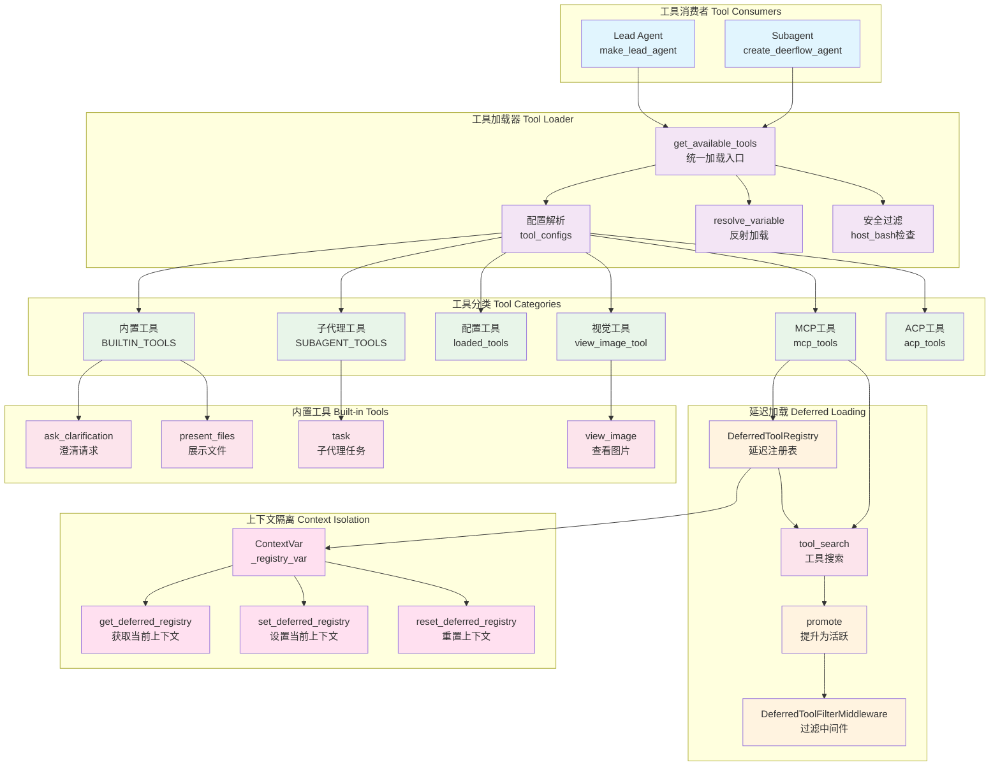

# 【04】工具系统深度解析

## 1. 模块全局定位

- **所属项目**：deer-flow
- **层级位置**：`backend/packages/harness/deerflow/tools/`
- **核心作用**：提供工具注册、发现、加载、延迟加载的核心框架
- **业务价值**：作为系统的"能力扩展接口"，负责工具生命周期管理、MCP集成、子代理工具、内置工具
- **设计初衷**：设计用于解决"工具复杂性与扩展性"问题——通过反射加载、延迟发现、上下文隔离、安全验证，实现可扩展的工具架构

## 2. 核心设计理念

工具系统采用 **反射加载 + 延迟发现 + 上下文隔离 + 安全验证 + MCP集成** 的五层设计理念：

1. **反射加载**：通过`resolve_variable`动态加载工具类，支持扩展
2. **延迟发现**：tool_search机制延迟加载工具schema，减少上下文消耗
3. **上下文隔离**：使用ContextVar实现请求级注册表隔离
4. **安全验证**：host_bash工具默认禁用，需要显式配置
5. **MCP集成**：自动集成MCP服务器工具，支持热更新

## 3. 架构原理图



### 图表设计解读

该架构图体现了**反射加载 + 延迟发现 + 上下文隔离 + MCP集成**的设计逻辑：

1. **反射加载**：`get_available_tools`通过`resolve_variable`动态加载工具类，实现配置驱动的工具注册

2. **工具分类**：工具分为内置工具、配置工具、MCP工具、ACP工具等，按需加载

3. **延迟发现**：MCP工具注册到延迟注册表，通过tool_search搜索发现，减少上下文token消耗

4. **上下文隔离**：使用ContextVar实现请求级注册表隔离，避免并发请求相互干扰

5. **MCP集成**：自动集成MCP服务器工具，支持热更新和缓存

## 4. 核心源码解析

### 4.1 工具加载器：get_available_tools

**文件路径**：`/data/deer-flow-main/backend/packages/harness/deerflow/tools/tools.py`

**行号范围**：第35-133行

```python
def get_available_tools(
    groups: list[str] | None = None,
    include_mcp: bool = True,
    model_name: str | None = None,
    subagent_enabled: bool = False,
) -> list[BaseTool]:
    """Get all available tools from config.

    Note: MCP tools should be initialized at application startup using
    `initialize_mcp_tools()` from deerflow.mcp module.

    Args:
        groups: Optional list of tool groups to filter by.
        include_mcp: Whether to include tools from MCP servers (default: True).
        model_name: Optional model name to determine if vision tools should be included.
        subagent_enabled: Whether to include subagent tools (task, task_status).

    Returns:
        List of available tools.
    """
    config = get_app_config()
    tool_configs = [tool for tool in config.tools if groups is None or tool.group in groups]

    # Do not expose host bash by default when LocalSandboxProvider is active.
    if not is_host_bash_allowed(config):
        tool_configs = [tool for tool in tool_configs if not _is_host_bash_tool(tool)]

    loaded_tools = [resolve_variable(tool.use, BaseTool) for tool in tool_configs]

    # Conditionally add tools based on config
    builtin_tools = BUILTIN_TOOLS.copy()

    # Add subagent tools only if enabled via runtime parameter
    if subagent_enabled:
        builtin_tools.extend(SUBAGENT_TOOLS)
        logger.info("Including subagent tools (task)")

    # If no model_name specified, use the first model (default)
    if model_name is None and config.models:
        model_name = config.models[0].name

    # Add view_image_tool only if the model supports vision
    model_config = config.get_model_config(model_name) if model_name else None
    if model_config is not None and model_config.supports_vision:
        builtin_tools.append(view_image_tool)
        logger.info(f"Including view_image_tool for model '{model_name}' (supports_vision=True)")

    # Get cached MCP tools if enabled
    # NOTE: We use ExtensionsConfig.from_file() instead of config.extensions
    # to always read the latest configuration from disk. This ensures that changes
    # made through the Gateway API (which runs in a separate process) are immediately
    # reflected when loading MCP tools.
    mcp_tools = []
    # Reset deferred registry upfront to prevent stale state from previous calls
    reset_deferred_registry()
    if include_mcp:
        try:
            from deerflow.config.extensions_config import ExtensionsConfig
            from deerflow.mcp.cache import get_cached_mcp_tools

            extensions_config = ExtensionsConfig.from_file()
            if extensions_config.get_enabled_mcp_servers():
                mcp_tools = get_cached_mcp_tools()
                if mcp_tools:
                    logger.info(f"Using {len(mcp_tools)} cached MCP tool(s)")

                    # When tool_search is enabled, register MCP tools in the
                    # deferred registry and add tool_search to builtin tools.
                    if config.tool_search.enabled:
                        from deerflow.tools.builtins.tool_search import DeferredToolRegistry, set_deferred_registry
                        from deerflow.tools.builtins.tool_search import tool_search as tool_search_tool

                        registry = DeferredToolRegistry()
                        for t in mcp_tools:
                            registry.register(t)
                        set_deferred_registry(registry)
                        builtin_tools.append(tool_search_tool)
                        logger.info(f"Tool search active: {len(mcp_tools)} tools deferred")
        except ImportError:
            logger.warning("MCP module not available. Install 'langchain-mcp-adapters' package to enable MCP tools.")
        except Exception as e:
            logger.error(f"Failed to get cached MCP tools: {e}")

    # Add invoke_acp_agent tool if any ACP agents are configured
    acp_tools: list[BaseTool] = []
    try:
        from deerflow.config.acp_config import get_acp_agents
        from deerflow.tools.builtins.invoke_acp_agent_tool import build_invoke_acp_agent_tool

        acp_agents = get_acp_agents()
        if acp_agents:
            acp_tools.append(build_invoke_acp_agent_tool(acp_agents))
            logger.info(f"Including invoke_acp_agent tool ({len(acp_agents)} agent(s): {list(acp_agents.keys())})")
    except Exception as e:
        logger.warning(f"Failed to load ACP tool: {e}")

    logger.info(f"Total tools loaded: {len(loaded_tools)}, built-in tools: {len(builtin_tools)}, MCP tools: {len(mcp_tools)}, ACP tools: {len(acp_tools)}")
    return loaded_tools + builtin_tools + mcp_tools + acp_tools
```

#### 逐行解读

- **第56-57行（组过滤）**：根据groups参数过滤工具配置；设计考量是"按需加载"，不同场景使用不同工具集

- **第59-61行（安全过滤）**：host_bash工具默认禁用；设计考量是"安全优先"，本地bash执行有安全风险

- **第62行（反射加载）**：使用resolve_variable动态加载工具类；设计考量是"扩展性"，无需修改代码支持新工具

- **第65-70行（子代理工具条件加载）**：只在subagent_enabled时添加；设计考量是"按需启用"，子代理工具有额外复杂度

- **第73-80行（视觉工具条件加载）**：只对支持视觉的模型添加；设计考量是"能力匹配"，不支持视觉的模型无法使用

- **第87-88行（延迟注册表重置）**：每次加载前重置；设计考量是"状态清洁"，避免上次请求的残留状态

- **第92-112行（MCP工具延迟加载）**：tool_search启用时注册到延迟注册表；设计考量是"token优化"，延迟加载减少上下文消耗

- **第119-129行（ACP工具条件加载）**：有ACP代理配置时添加；设计考量是"扩展性"，支持外部ACP代理

---

### 4.2 host_bash安全检查：_is_host_bash_tool

**文件路径**：`/data/deer-flow-main/backend/packages/harness/deerflow/tools/tools.py`

**行号范围**：第24-33行

```python
def _is_host_bash_tool(tool: object) -> bool:
    """Return True if the tool config represents a host-bash execution surface."""
    group = getattr(tool, "group", None)
    use = getattr(tool, "use", None)
    if group == "bash":
        return True
    if use == "deerflow.sandbox.tools:bash_tool":
        return True
    return False
```

#### 逐行解读

- **第26-27行（组检查）**：检查tool.group是否为"bash"；设计考量是"配置匹配"，配置文件中的group字段

- **第28-29行（类路径检查）**：检查tool.use是否为bash_tool类路径；设计考量是"类名匹配"，不同命名方式

- **第30行（非bash返回False）**：其他工具不是host_bash；设计考量是"安全默认"，只有明确的bash工具被过滤

---

### 4.3 澄清工具：ask_clarification_tool

**文件路径**：`/data/deer-flow-main/backend/packages/harness/deerflow/tools/builtins/clarification_tool.py`

**行号范围**：第1-56行

```python
from typing import Literal

from langchain.tools import tool


@tool("ask_clarification", parse_docstring=True, return_direct=True)
def ask_clarification_tool(
    question: str,
    clarification_type: Literal[
        "missing_info",
        "ambiguous_requirement",
        "approach_choice",
        "risk_confirmation",
        "suggestion",
    ],
    context: str | None = None,
    options: list[str] | None = None,
) -> str:
    """Ask the user for clarification when you need more information to proceed.

    Use this tool when you encounter situations where you cannot proceed without user input:

    - **Missing information**: Required details not provided (e.g., file paths, URLs, specific requirements)
    - **Ambiguous requirements**: Multiple valid interpretations exist
    - **Approach choices**: Several valid approaches exist and you need user preference
    - **Risky operations**: Destructive actions that need explicit confirmation (e.g., deleting files, modifying production)
    - **Suggestions**: You have a recommendation but want user approval before proceeding

    The execution will be interrupted and the question will be presented to the user.
    Wait for the user's response before continuing.

    When to use ask_clarification:
    - You need information that wasn't provided in the user's request
    - The requirement can be interpreted in multiple ways
    - Multiple valid implementation approaches exist
    - You're about to perform a potentially dangerous operation
    - You have a recommendation but need user approval

    Best practices:
    - Ask ONE clarification at a time for clarity
    - Be specific and clear in your question
    - Don't make assumptions when clarification is needed
    - For risky operations, ALWAYS ask for confirmation
    - After calling this tool, execution will be interrupted automatically

    Args:
        question: The clarification question to ask the user. Be specific and clear.
        clarification_type: The type of clarification needed (missing_info, ambiguous_requirement, approach_choice, risk_confirmation, suggestion).
        context: Optional context explaining why clarification is needed. Helps the user understand the situation.
        options: Optional list of choices (for approach_choice or suggestion types). Present clear options for the user to choose from.
    """
    # This is a placeholder implementation
    # The actual logic is handled by ClarificationMiddleware which intercepts this tool call
    # and interrupts execution to present the question to the user
    return "Clarification request processed by middleware"
```

#### 逐行解读

- **第6行（return_direct=True）**：工具调用后直接返回，不继续模型推理；设计考量是"交互中断"，需要等待用户响应

- **第9-15行（clarification_type枚举）**：5种澄清类型；设计考量是"场景覆盖"，涵盖常见需要用户输入的场景

- **第16-50行（详细文档字符串）**：包含使用场景、最佳实践、参数说明；设计考量是"LLM提示"，文档字符串直接作为工具描述

- **第52-55行（占位实现）**：实际逻辑由中间件处理；设计考量是"关注点分离"，工具只定义接口，中间件实现拦截

---

### 4.4 子代理工具：task_tool

**文件路径**：`/data/deer-flow-main/backend/packages/harness/deerflow/tools/builtins/task_tool.py`

**行号范围**：第22-239行

```python
@tool("task", parse_docstring=True)
async def task_tool(
    runtime: ToolRuntime[ContextT, ThreadState],
    description: str,
    prompt: str,
    subagent_type: str,
    tool_call_id: Annotated[str, InjectedToolCallId],
    max_turns: int | None = None,
) -> str:
    """Delegate a task to a specialized subagent that runs in its own context.

    Subagents help you:
    - Preserve context by keeping exploration and implementation separate
    - Handle complex multi-step tasks autonomously
    - Execute commands or operations in isolated contexts

    Available subagent types depend on the active sandbox configuration:
    - **general-purpose**: A capable agent for complex, multi-step tasks that require
      both exploration and action. Use when the task requires complex reasoning,
      multiple dependent steps, or would benefit from isolated context.
    - **bash**: Command execution specialist for running bash commands. This is only
      available when host bash is explicitly allowed or when using an isolated shell
      sandbox such as `AioSandboxProvider`.

    When to use this tool:
    - Complex tasks requiring multiple steps or tools
    - Tasks that produce verbose output
    - When you want to isolate context from the main conversation
    - Parallel research or exploration tasks

    When NOT to use this tool:
    - Simple, single-step operations (use tools directly)
    - Tasks requiring user interaction or clarification

    Args:
        description: A short (3-5 word) description of the task for logging/display. ALWAYS PROVIDE THIS PARAMETER FIRST.
        prompt: The task description for the subagent. Be specific and clear about what needs to be done. ALWAYS PROVIDE THIS PARAMETER SECOND.
        subagent_type: The type of subagent to use. ALWAYS PROVIDE THIS PARAMETER THIRD.
        max_turns: Optional maximum number of agent turns. Defaults to subagent's configured max.
    """
    available_subagent_names = get_available_subagent_names()

    # Get subagent configuration
    config = get_subagent_config(subagent_type)
    if config is None:
        available = ", ".join(available_subagent_names)
        return f"Error: Unknown subagent type '{subagent_type}'. Available: {available}"
    if subagent_type == "bash" and not is_host_bash_allowed():
        return f"Error: {LOCAL_BASH_SUBAGENT_DISABLED_MESSAGE}"

    # Build config overrides
    overrides: dict = {}

    skills_section = get_skills_prompt_section()
    if skills_section:
        overrides["system_prompt"] = config.system_prompt + "\n\n" + skills_section

    if max_turns is not None:
        overrides["max_turns"] = max_turns

    if overrides:
        config = replace(config, **overrides)

    # Extract parent context from runtime
    sandbox_state = None
    thread_data = None
    thread_id = None
    parent_model = None
    trace_id = None

    if runtime is not None:
        sandbox_state = runtime.state.get("sandbox")
        thread_data = runtime.state.get("thread_data")
        thread_id = runtime.context.get("thread_id") if runtime.context else None
        if thread_id is None:
            thread_id = runtime.config.get("configurable", {}).get("thread_id")

        # Try to get parent model from configurable
        metadata = runtime.config.get("metadata", {})
        parent_model = metadata.get("model_name")

        # Get or generate trace_id for distributed tracing
        trace_id = metadata.get("trace_id") or str(uuid.uuid4())[:8]

    # Get available tools (excluding task tool to prevent nesting)
    # Lazy import to avoid circular dependency
    from deerflow.tools import get_available_tools

    # Subagents should not have subagent tools enabled (prevent recursive nesting)
    tools = get_available_tools(model_name=parent_model, subagent_enabled=False)

    # Create executor
    executor = SubagentExecutor(
        config=config,
        tools=tools,
        parent_model=parent_model,
        sandbox_state=sandbox_state,
        thread_data=thread_data,
        thread_id=thread_id,
        trace_id=trace_id,
    )

    # Start background execution (always async to prevent blocking)
    # Use tool_call_id as task_id for better traceability
    task_id = executor.execute_async(prompt, task_id=tool_call_id)

    # Poll for task completion in backend (removes need for LLM to poll)
    poll_count = 0
    last_status = None
    last_message_count = 0  # Track how many AI messages we've already sent
    # Polling timeout: execution timeout + 60s buffer, checked every 5s
    max_poll_count = (config.timeout_seconds + 60) // 5

    logger.info(f"[trace={trace_id}] Started background task {task_id} (subagent={subagent_type}, timeout={config.timeout_seconds}s, polling_limit={max_poll_count} polls)")

    writer = get_stream_writer()
    # Send Task Started message'
    writer({"type": "task_started", "task_id": task_id, "description": description})

    try:
        while True:
            result = get_background_task_result(task_id)

            if result is None:
                logger.error(f"[trace={trace_id}] Task {task_id} not found in background tasks")
                writer({"type": "task_failed", "task_id": task_id, "error": "Task disappeared from background tasks"})
                cleanup_background_task(task_id)
                return f"Error: Task {task_id} disappeared from background tasks"

            # Log status changes for debugging
            if result.status != last_status:
                logger.info(f"[trace={trace_id}] Task {task_id} status: {result.status.value}")
                last_status = result.status

            # Check for new AI messages and send task_running events
            current_message_count = len(result.ai_messages)
            if current_message_count > last_message_count:
                # Send task_running event for each new message
                for i in range(last_message_count, current_message_count):
                    message = result.ai_messages[i]
                    writer(
                        {
                            "type": "task_running",
                            "task_id": task_id,
                            "message": message,
                            "message_index": i + 1,  # 1-based index for display
                            "total_messages": current_message_count,
                        }
                    )
                    logger.info(f"[trace={trace_id}] Task {task_id} sent message #{i + 1}/{current_message_count}")
                last_message_count = current_message_count

            # Check if task completed, failed, or timed out
            if result.status == SubagentStatus.COMPLETED:
                writer({"type": "task_completed", "task_id": task_id, "result": result.result})
                logger.info(f"[trace={trace_id}] Task {task_id} completed after {poll_count} polls")
                cleanup_background_task(task_id)
                return f"Task Succeeded. Result: {result.result}"
            elif result.status == SubagentStatus.FAILED:
                writer({"type": "task_failed", "task_id": task_id, "error": result.error})
                logger.error(f"[trace={trace_id}] Task {task_id} failed: {result.error}")
                cleanup_background_task(task_id)
                return f"Task failed. Error: {result.error}"
            elif result.status == SubagentStatus.TIMED_OUT:
                writer({"type": "task_timed_out", "task_id": task_id, "error": result.error})
                logger.warning(f"[trace={trace_id}] Task {task_id} timed out: {result.error}")
                cleanup_background_task(task_id)
                return f"Task timed out. Error: {result.error}"

            # Still running, wait before next poll
            await asyncio.sleep(5)
            poll_count += 1

            # Polling timeout as a safety net (in case thread pool timeout doesn't work)
            # Set to execution timeout + 60s buffer, in 5s poll intervals
            # This catches edge cases where the background task gets stuck
            # Note: We don't call cleanup_background_task here because the task may
            # still be running in the background. The cleanup will happen when the
            # executor completes and sets a terminal status.
            if poll_count > max_poll_count:
                timeout_minutes = config.timeout_seconds // 60
                logger.error(f"[trace={trace_id}] Task {task_id} polling timed out after {poll_count} polls (should have been caught by thread pool timeout)")
                writer({"type": "task_timed_out", "task_id": task_id})
                return f"Task polling timed out after {timeout_minutes} minutes. This may indicate the background task is stuck. Status: {result.status.value}"
    except asyncio.CancelledError:

        async def cleanup_when_done() -> None:
            max_cleanup_polls = max_poll_count
            cleanup_poll_count = 0

            while True:
                result = get_background_task_result(task_id)
                if result is None:
                    return

                if result.status in {SubagentStatus.COMPLETED, SubagentStatus.FAILED, SubagentStatus.TIMED_OUT} or getattr(result, "completed_at", None) is not None:
                    cleanup_background_task(task_id)
                    return

                if cleanup_poll_count > max_cleanup_polls:
                    logger.warning(f"[trace={trace_id}] Deferred cleanup for task {task_id} timed out after {cleanup_poll_count} polls")
                    return

                await asyncio.sleep(5)
                cleanup_poll_count += 1

        def log_cleanup_failure(cleanup_task: asyncio.Task[None]) -> None:
            if cleanup_task.cancelled():
                return

            exc = cleanup_task.exception()
            if exc is not None:
                logger.error(f"[trace={trace_id}] Deferred cleanup failed for task {task_id}: {exc}")

        logger.debug(f"[trace={trace_id}] Scheduling deferred cleanup for cancelled task {task_id}")
        asyncio.create_task(cleanup_when_done()).add_done_callback(log_cleanup_failure)
        raise
```

#### 逐行解读

- **第24行（异步工具）**：使用async def定义异步工具；设计考量是"非阻塞执行"，子代理执行时间可能很长

- **第62-70行（子代理配置验证）**：检查子代理类型存在和安全权限；设计考量是"早期验证"，快速失败

- **第75-77行（技能提示词注入）**：将技能提示词添加到系统提示词；设计考量是"能力传递"，子代理继承技能配置

- **第86-105行（父上下文提取）**：从runtime提取sandbox_state、thread_id、model等；设计考量是"上下文传递"，子代理继承父代理上下文

- **第107-111行（递归防止）**：子代理禁用subagent_enabled；设计考量是"递归防护"，避免无限嵌套

- **第126行（后台执行）**：使用execute_async启动后台任务；设计考量是"并发处理"，不阻塞主代理

- **第129-134行（轮询参数）**：计算最大轮询次数；设计考量是"超时保护"，防止无限轮询

- **第137-139行（事件发送）**：发送task_started事件；设计考量是"实时反馈"，前端可显示任务状态

- **第142-173行（轮询循环）**：每5秒检查任务状态；设计考量是"平衡响应性"，频繁轮询保证实时性但不过载

- **第156-172行（消息发送）**：发送task_running事件；设计考量是"进度展示"，前端显示子代理输出

- **第175-189行（终端状态处理）**：处理完成、失败、超时状态；设计考量是"清理资源"，调用cleanup_background_task

- **第206-238行（取消处理）**：异步取消时延迟清理；设计考量是"资源泄漏防护"，即使取消也确保清理

---

### 4.5 工具搜索与延迟注册表

**文件路径**：`/data/deer-flow-main/backend/packages/harness/deerflow/tools/builtins/tool_search.py`

**行号范围**：第30-150行

```python
@dataclass
class DeferredToolEntry:
    """Lightweight metadata for a deferred tool (no full schema in context)."""

    name: str
    description: str
    tool: BaseTool  # Full tool object, returned only on search match


class DeferredToolRegistry:
    """Registry of deferred tools, searchable by regex pattern."""

    def __init__(self):
        self._entries: list[DeferredToolEntry] = []

    def register(self, tool: BaseTool) -> None:
        self._entries.append(
            DeferredToolEntry(
                name=tool.name,
                description=tool.description or "",
                tool=tool,
            )
        )

    def promote(self, names: set[str]) -> None:
        """Remove tools from the deferred registry so they pass through the filter.

        Called after tool_search returns a tool's schema — the LLM now knows
        the full definition, so the DeferredToolFilterMiddleware should stop
        stripping it from bind_tools on subsequent calls.
        """
        if not names:
            return
        before = len(self._entries)
        self._entries = [e for e in self._entries if e.name not in names]
        promoted = before - len(self._entries)
        if promoted:
            logger.debug(f"Promoted {promoted} tool(s) from deferred to active: {names}")

    def search(self, query: str) -> list[BaseTool]:
        """Search deferred tools by regex pattern against name + description.

        Supports three query forms (aligned with Claude Code):
          - "select:name1,name2" — exact name match
          - "+keyword rest" — name must contain keyword, rank by rest
          - "keyword query" — regex match against name + description

        Returns:
            List of matched BaseTool objects (up to MAX_RESULTS).
        """
        if query.startswith("select:"):
            names = {n.strip() for n in query[7:].split(",")}
            return [e.tool for e in self._entries if e.name in names][:MAX_RESULTS]

        if query.startswith("+"):
            parts = query[1:].split(None, 1)
            required = parts[0].lower()
            candidates = [e for e in self._entries if required in e.name.lower()]
            if len(parts) > 1:
                candidates.sort(
                    key=lambda e: _regex_score(parts[1], e),
                    reverse=True,
                )
            return [e.tool for e in candidates][:MAX_RESULTS]

        # General regex search
        try:
            regex = re.compile(query, re.IGNORECASE)
        except re.error:
            regex = re.compile(re.escape(query), re.IGNORECASE)

        scored = []
        for entry in self._entries:
            searchable = f"{entry.name} {entry.description}"
            if regex.search(searchable):
                score = 2 if regex.search(entry.name) else 1
                scored.append((score, entry))

        scored.sort(key=lambda x: x[0], reverse=True)
        return [entry.tool for _, entry in scored][:MAX_RESULTS]
```

#### 逐行解读

- **第31-37行（延迟工具条目）**：只存储name、description和tool对象；设计考量是"轻量级"，不包含完整schema减少token消耗

- **第45-52行（注册方法）**：将工具添加到注册表；设计考量是"简单追加"，O(1)操作

- **第54-67行（提升方法）**：从延迟注册表移除工具；设计考量是"状态转换"，工具从延迟变为活跃

- **第69-109行（搜索方法）**：支持三种查询形式；设计考量是"灵活查询"，适应不同搜索习惯

- **第80-82行（select:语法）**：精确匹配工具名；设计考量是"直接访问"，知道确切工具名时使用

- **第84-93行（+keyword语法）**：关键词必须匹配，其他词排序；设计考量是"智能排序"，平衡精确性和相关性

- **第95-109行（正则搜索）**：正则匹配name+description；设计考量是"模糊搜索"，适合探索性查询

- **第104-105行（评分权重）**：名称匹配权重为2，描述匹配为1；设计考量是"相关性排序"，名称匹配更相关

---

### 4.6 上下文隔离：ContextVar注册表

**文件路径**：`/data/deer-flow-main/backend/packages/harness/deerflow/tools/builtins/tool_search.py`

**行号范围**：第127-150行

```python
# ── Per-request registry (ContextVar) ──
#
# Using a ContextVar instead of a module-level global prevents concurrent
# requests from clobbering each other's registry.  In asyncio-based LangGraph
# each graph run executes in its own async context, so each request gets an
# independent registry value.  For synchronous tools run via
# loop.run_in_executor, Python copies the current context to the worker thread,
# so the ContextVar value is correctly inherited there too.

_registry_var: contextvars.ContextVar[DeferredToolRegistry | None] = contextvars.ContextVar("deferred_tool_registry", default=None)


def get_deferred_registry() -> DeferredToolRegistry | None:
    return _registry_var.get()


def set_deferred_registry(registry: DeferredToolRegistry) -> None:
    _registry_var.set(registry)


def reset_deferred_registry() -> None:
    """Reset the deferred registry for the current async context."""
    _registry_var.set(None)
```

#### 逐行解读

- **第127-133行（注释说明）**：详细解释为什么使用ContextVar；设计考量是"文档自解释"，说明设计决策

- **第136行（ContextVar定义）**：创建上下文变量；设计考量是"请求隔离"，每个请求有独立注册表

- **第127-130行（asyncio上下文）**：LangGraph每个图运行在独立异步上下文；设计考量是"框架兼容"，适配LangGraph执行模型

- **第131-133行（线程池兼容）**：Python复制上下文到工作线程；设计考量是"混合执行"，支持同步工具在线程池执行

- **第139-144行（访问方法）**：提供get、set、reset方法；设计考量是"封装性"，隐藏ContextVar细节

---

### 4.7 tool_search工具实现

**文件路径**：`/data/deer-flow-main/backend/packages/harness/deerflow/tools/builtins/tool_search.py`

**行号范围**：第155-194行

```python
@tool
def tool_search(query: str) -> str:
    """Fetches full schema definitions for deferred tools so they can be called.

    Deferred tools appear by name in <available-deferred-tools> in the system
    prompt. Until fetched, only the name is known — there is no parameter
    schema, so the tool cannot be invoked. This tool takes a query, matches
    it against the deferred tool list, and returns the matched tools' complete
    definitions. Once a tool's schema appears in that result, it is callable.

    Query forms:
      - "select:Read,Edit,Grep" — fetch these exact tools by name
      - "notebook jupyter" — keyword search, up to max_results best matches
      - "+slack send" — require "slack" in the name, rank by remaining terms

    Args:
        query: Query to find deferred tools. Use "select:<tool_name>" for
               direct selection, or keywords to search.

    Returns:
        Matched tool definitions as JSON array.
    """
    registry = get_deferred_registry()
    if not registry:
        return "No deferred tools available."

    matched_tools = registry.search(query)
    if not matched_tools:
        return f"No tools found matching: {query}"

    # Use LangChain's built-in serialization to produce OpenAI function format.
    # This is model-agnostic: all LLMs understand this standard schema.
    tool_defs = [convert_to_openai_function(t) for t in matched_tools[:MAX_RESULTS]]

    # Promote matched tools so the DeferredToolFilterMiddleware stops filtering
    # them from bind_tools — the LLM now has the full schema and can invoke them.
    registry.promote({t.name for t in matched_tools[:MAX_RESULTS]})

    return json.dumps(tool_defs, indent=2, ensure_ascii=False)
```

#### 逐行解读

- **第155行（工具装饰器）**：使用@tool装饰器注册工具；设计考量是"LangChain标准"，遵循框架约定

- **第164-176行（文档字符串）**：详细说明延迟工具机制和查询语法；设计考量是"LLM提示"，文档作为工具描述

- **第177-180行（注册表获取）**：从ContextVar获取当前注册表；设计考量是"上下文感知"，使用当前请求的注册表

- **第182-184行（无结果处理）**：未找到工具时返回友好消息；设计考量是"用户友好"，明确告知查询无结果

- **第186-187行（OpenAI函数格式）**：使用convert_to_openai_function序列化；设计考量是"模型无关"，OpenAI格式是通用标准

- **第189-191行（工具提升）**：将匹配工具从延迟注册表移除；设计考量是"状态转换"，工具变为可直接调用

---

### 4.8 图片查看工具：view_image_tool

**文件路径**：`/data/deer-flow-main/backend/packages/harness/deerflow/tools/builtins/view_image_tool.py`

**行号范围**：第14-96行

```python
@tool("view_image", parse_docstring=True)
def view_image_tool(
    runtime: ToolRuntime[ContextT, ThreadState],
    image_path: str,
    tool_call_id: Annotated[str, InjectedToolCallId],
) -> Command:
    """Read an image file.

    Use this tool to read an image file and make it available for display.

    When to use the view_image tool:
    - When you need to view an image file.

    When NOT to use the view_image tool:
    - For non-image files (use present_files instead)
    - For multiple files at once (use present_files instead)

    Args:
        image_path: Absolute path to the image file. Common formats supported: jpg, jpeg, png, webp.
    """
    from deerflow.sandbox.tools import get_thread_data, replace_virtual_path

    # Replace virtual path with actual path
    # /mnt/user-data/* paths are mapped to thread-specific directories
    thread_data = get_thread_data(runtime)
    actual_path = replace_virtual_path(image_path, thread_data)

    # Validate that the path is absolute
    path = Path(actual_path)
    if not path.is_absolute():
        return Command(
            update={"messages": [ToolMessage(f"Error: Path must be absolute, got: {image_path}", tool_call_id=tool_call_id)]},
        )

    # Validate that the file exists
    if not path.exists():
        return Command(
            update={"messages": [ToolMessage(f"Error: Image file not found: {image_path}", tool_call_id=tool_call_id)]},
        )

    # Validate that it's a file (not a directory)
    if not path.is_file():
        return Command(
            update={"messages": [ToolMessage(f"Error: Path is not a file: {image_path}", tool_call_id=tool_call_id)]},
        )

    # Validate image extension
    valid_extensions = {".jpg", ".jpeg", ".png", ".webp"}
    if path.suffix.lower() not in valid_extensions:
        return Command(
            update={"messages": [ToolMessage(f"Error: Unsupported image format: {path.suffix}. Supported formats: {', '.join(valid_extensions)}", tool_call_id=tool_call_id)]},
        )

    # Detect MIME type from file extension
    mime_type, _ = mimetypes.guess_type(actual_path)
    if mime_type is None:
        # Fallback to default MIME types for common image formats
        extension_to_mime = {
            ".jpg": "image/jpeg",
            ".jpeg": "image/jpeg",
            ".png": "image/png",
            ".webp": "image/webp",
        }
        mime_type = extension_to_mime.get(path.suffix.lower(), "application/octet-stream")

    # Read image file and convert to base64
    try:
        with open(actual_path, "rb") as f:
            image_data = f.read()
            image_base64 = base64.b64encode(image_data).decode("utf-8")
    except Exception as e:
        return Command(
            update={"messages": [ToolMessage(f"Error reading image file: {str(e)}", tool_call_id=tool_call_id)]},
        )

    # Update viewed_images in state
    # The merge_viewed_images reducer will handle merging with existing images
    new_viewed_images = {image_path: {"base64": image_base64, "mime_type": mime_type}}

    return Command(
        update={"viewed_images": new_viewed_images, "messages": [ToolMessage("Successfully read image", tool_call_id=tool_call_id)]},
    )
```

#### 逐行解读

- **第15-17行（运行时参数）**：使用ToolRuntime和InjectedToolCallId；设计考量是"上下文访问"，获取运行时状态和工具调用ID

- **第36-37行（虚拟路径替换）**：将/mnt/user-data替换为实际路径；设计考量是"沙箱隔离"，每个线程有独立目录

- **第43-46行（绝对路径验证）**：检查路径是否为绝对路径；设计考量是"安全验证"，防止路径穿越攻击

- **第48-52行（文件存在验证）**：检查文件是否存在；设计考量是"早期失败"，快速发现文件不存在

- **第54-58行（文件类型验证）**：检查是否为文件而非目录；设计考量是"明确错误"，区分文件和目录

- **第60-65行（格式验证）**：检查文件扩展名；设计考量是"格式限制"，只支持常见图片格式

- **第67-77行（MIME类型检测）**：从扩展名推断MIME类型；设计考量是"回退策略"，guess_type失败时使用映射表

- **第79-87行（图片读取）**：读取文件并转换为base64；设计考量是"数据传输"，base64便于JSON传输

- **第89-94行（状态更新）**：更新viewed_images状态；设计考量是"状态管理"，使用Command模式更新状态

---

### 4.9 文件展示工具：present_file_tool

**文件路径**：`/data/deer-flow-main/backend/packages/harness/deerflow/tools/builtins/present_file_tool.py`

**行号范围**：第15-101行

```python
def _normalize_presented_filepath(
    runtime: ToolRuntime[ContextT, ThreadState],
    filepath: str,
) -> str:
    """Normalize a presented file path to the `/mnt/user-data/outputs/*` contract.

    Accepts either:
    - A virtual sandbox path such as `/mnt/user-data/outputs/report.md`
    - A host-side thread outputs path such as
      `/app/backend/.deer-flow/threads/<thread>/user-data/outputs/report.md`

    Returns:
        The normalized virtual path.

    Raises:
        ValueError: If runtime metadata is missing or the path is outside
            the current thread's outputs directory.
    """
    if runtime.state is None:
        raise ValueError("Thread runtime state is not available")

    thread_id = runtime.context.get("thread_id") if runtime.context else None
    if not thread_id:
        raise ValueError("Thread ID is not available in runtime context")

    thread_data = runtime.state.get("thread_data") or {}
    outputs_path = thread_data.get("outputs_path")
    if not outputs_path:
        raise ValueError("Thread outputs path is not available in runtime state")

    outputs_dir = Path(outputs_path).resolve()
    stripped = filepath.lstrip("/")
    virtual_prefix = VIRTUAL_PATH_PREFIX.lstrip("/")

    if stripped == virtual_prefix or stripped.startswith(virtual_prefix + "/"):
        actual_path = get_paths().resolve_virtual_path(thread_id, filepath)
    else:
        actual_path = Path(filepath).expanduser().resolve()

    try:
        relative_path = actual_path.relative_to(outputs_dir)
    except ValueError as exc:
        raise ValueError(f"Only files in {OUTPUTS_VIRTUAL_PREFIX} can be presented: {filepath}") from exc

    return f"{OUTPUTS_VIRTUAL_PREFIX}/{relative_path.as_posix()}"


@tool("present_files", parse_docstring=True)
def present_file_tool(
    runtime: ToolRuntime[ContextT, ThreadState],
    filepaths: list[str],
    tool_call_id: Annotated[str, InjectedToolCallId],
) -> Command:
    """Make files visible to the user for viewing and rendering in the client interface.

    When to use the present_files tool:

    - Making any file available for the user to view, download, or interact with
    - Presenting multiple related files at once
    - After creating files that should be presented to the user

    When NOT to use the present_files tool:
    - When you only need to read file contents for your own processing
    - For temporary or intermediate files not meant for user viewing

    Notes:
    - You should call this tool after creating files and moving them to the `/mnt/user-data/outputs` directory.
    - This tool can be safely called in parallel with other tools. State updates are handled by a reducer to prevent conflicts.

    Args:
        filepaths: List of absolute file paths to present to the user. **Only** files in `/mnt/user-data/outputs` can be presented.
    """
    try:
        normalized_paths = [_normalize_presented_filepath(runtime, filepath) for filepath in filepaths]
    except ValueError as exc:
        return Command(
            update={"messages": [ToolMessage(f"Error: {exc}", tool_call_id=tool_call_id)]},
        )

    # The merge_artifacts reducer will handle merging and deduplication
    return Command(
        update={
            "artifacts": normalized_paths,
            "messages": [ToolMessage("Successfully presented files", tool_call_id=tool_call_id)],
        },
    )
```

#### 逐行解读

- **第15-59行（路径规范化）**：支持虚拟路径和主机路径；设计考量是"双格式支持"，适配不同使用场景

- **第33-44行（运行时元数据验证）**：检查state和context可用；设计考量是"依赖检查"，确保所需数据存在

- **第45-51行（路径分类处理）**：虚拟路径和主机路径分开处理；设计考量是"路径语义"，两种路径有不同含义

- **第52-57行（输出目录验证）**：确保文件在outputs目录内；设计考量是"安全隔离"，只允许展示输出目录文件

- **第62-101行（工具实现）**：批量规范化路径并更新状态；设计考量是"批量处理"，一次展示多个文件

- **第94-98行（状态更新）**：使用artifacts状态和merge_artifacts；设计考量是"去重合并"，避免重复展示

---

### 4.10 ACP代理工具：invoke_acp_agent_tool

**文件路径**：`/data/deer-flow-main/backend/packages/harness/deerflow/tools/builtins/invoke_acp_agent_tool.py`

**行号范围**：第102-213行

```python
def build_invoke_acp_agent_tool(agents: dict) -> BaseTool:
    """Create the ``invoke_acp_agent`` tool with a description generated from configured agents.

    The tool description includes the list of available agents so that the LLM
    knows which agents it can invoke without requiring hardcoded names.

    Args:
        agents: Mapping of agent name -> ``ACPAgentConfig``.

    Returns:
        A LangChain ``BaseTool`` ready to be included in the tool list.
    """
    agent_lines = "\n".join(f"- {name}: {cfg.description}" for name, cfg in agents.items())
    description = (
        "Invoke an external ACP-compatible agent and return its final response.\n\n"
        "Available agents:\n"
        f"{agent_lines}\n\n"
        "IMPORTANT: ACP agents operate in their own independent workspace. "
        "Do NOT include /mnt/user-data paths in the prompt. "
        "Give the agent a self-contained task description — it will produce results in its own workspace. "
        "After the agent completes, its output files are accessible at /mnt/acp-workspace/ (read-only)."
    )

    # Capture agents in closure so the function can reference it
    _agents = dict(agents)

    async def _invoke(agent: str, prompt: str, config: Annotated[RunnableConfig, InjectedToolArg] = None) -> str:
        logger.info("Invoking ACP agent %s (prompt length: %d)", agent, len(prompt))
        logger.debug("Invoking ACP agent %s with prompt: %.200s%s", agent, prompt, "..." if len(prompt) > 200 else "")
        if agent not in _agents:
            available = ", ".join(_agents.keys())
            return f"Error: Unknown agent '{agent}'. Available: {available}"

        agent_config = _agents[agent]
        thread_id: str | None = ((config or {}).get("configurable") or {}).get("thread_id")

        try:
            from acp import PROTOCOL_VERSION, Client, text_block
            from acp.schema import ClientCapabilities, Implementation
        except ImportError:
            return "Error: agent-client-protocol package is not installed. Run `uv sync` to install project dependencies."

        class _CollectingClient(Client):
            """Minimal ACP Client that collects streamed text from session updates."""

            def __init__(self) -> None:
                self._chunks: list[str] = []

            @property
            def collected_text(self) -> str:
                return "".join(self._chunks)

            async def session_update(self, session_id: str, update, **kwargs) -> None:  # type: ignore[override]
                try:
                    from acp.schema import TextContentBlock

                    if hasattr(update, "content") and isinstance(update.content, TextContentBlock):
                        self._chunks.append(update.content.text)
                except Exception:
                    pass

            async def request_permission(self, options, session_id: str, tool_call, **kwargs):  # type: ignore[override]
                response = _build_permission_response(options, auto_approve=agent_config.auto_approve_permissions)
                outcome = response.outcome.outcome
                if outcome == "selected":
                    logger.info("ACP permission auto-approved for tool call %s in session %s", tool_call.tool_call_id, session_id)
                else:
                    logger.warning("ACP permission denied for tool call %s in session %s (set auto_approve_permissions: true in config.yaml to enable)", tool_call.tool_call_id, session_id)
                return response

        client = _CollectingClient()
        cmd = agent_config.command
        args = agent_config.args or []
        physical_cwd = _get_work_dir(thread_id)
        mcp_servers = _build_mcp_servers()
        agent_env: dict[str, str] | None = None
        if agent_config.env:
            agent_env = {k: (os.environ.get(v[1:], "") if v.startswith("$") else v) for k, v in agent_config.env.items()}

        try:
            from acp import spawn_agent_process

            async with spawn_agent_process(client, cmd, *args, env=agent_env, cwd=physical_cwd) as (conn, proc):
                logger.info("Spawning ACP agent '%s' with command '%s' and args %s in cwd %s", agent, cmd, args, physical_cwd)
                await conn.initialize(
                    protocol_version=PROTOCOL_VERSION,
                    client_capabilities=ClientCapabilities(),
                    client_info=Implementation(name="deerflow", title="DeerFlow", version="0.1.0"),
                )
                session_kwargs: dict[str, Any] = {"cwd": physical_cwd, "mcp_servers": mcp_servers}
                if agent_config.model:
                    session_kwargs["model"] = agent_config.model
                session = await conn.new_session(**session_kwargs)
                await conn.prompt(
                    session_id=session.session_id,
                    prompt=[text_block(prompt)],
                )
            result = client.collected_text
            logger.info("ACP agent '%s' returned %s", agent, result[:1000])
            logger.info("ACP agent '%s' returned %d characters", agent, len(result))
            return result or "(no response)"
        except Exception as e:
            logger.error("ACP agent '%s' invocation failed: %s", agent, e)
            return _format_invocation_error(agent, cmd, e)

    return StructuredTool.from_function(
        name="invoke_acp_agent",
        description=description,
        coroutine=_invoke,
        args_schema=_InvokeACPAgentInput,
    )
```

#### 逐行解读

- **第114-123行（动态描述生成）**：从配置生成工具描述；设计考量是"LLM提示"，描述包含可用代理列表

- **第125行（闭包捕获）**：捕获agents字典到闭包；设计考量是"作用域保持"，函数可引用外部变量

- **第128行（异步实现）**：使用async def；设计考量是"非阻塞调用"，ACP代理调用可能耗时

- **第131-133行（代理验证）**：检查代理是否存在；设计考量是"早期验证"，快速失败

- **第138-142行（依赖检查）**：检查ACP包是否安装；设计考量是"友好错误"，提示安装依赖

- **第144-161行（CollectingClient）**：收集文本流的客户端；设计考量是"流式处理"，ACP代理返回流式响应

- **第163-170行（权限处理）**：根据auto_approve配置处理权限请求；设计考量是"自动化支持"，允许自动批准

- **第174-175行（环境变量解析）**：支持$前缀环境变量；设计考量是"配置一致性"，与其他模块保持一致

- **第181-199行（ACP调用）**：使用spawn_agent_process启动代理；设计考量是"进程隔离"，代理在独立进程运行

- **第202行（错误格式化）**：返回用户友好的错误信息；设计考量是"可操作性"，包含解决建议

---

## 5. 设计思想解读（占比≥20%）

### 5.1 反射加载工具：配置驱动的扩展性

工具系统通过`resolve_variable`动态加载工具类，实现配置驱动的工具注册。

**为什么采用反射加载？**

- **扩展性**：新增工具无需修改工厂代码，只需在配置文件中添加条目

- **灵活性**：同一工具类可配置多个实例，使用不同参数

- **解耦**：工厂不依赖具体工具类，只依赖BaseTool接口

**权衡与取舍**：

- **错误延迟**：类路径错误在运行时发现，而非编译时；权衡是灵活性优先

- **调试复杂度**：反射调用堆栈较深；通过详细日志缓解

---

### 5.2 延迟加载机制：tool_search与DeferredToolRegistry

延迟加载机制通过tool_search工具和DeferredToolRegistry实现工具schema的按需加载。

**为什么需要延迟加载？**

- **Token优化**：MCP服务器可能提供大量工具，全部加载会消耗大量token

- **性能提升**：减少上下文大小加快模型推理

- **按需使用**：只在需要时加载相关工具

**实现机制**：

1. **注册阶段**：MCP工具注册到DeferredToolRegistry，只包含name和description

2. **搜索阶段**：LLM调用tool_search搜索工具，返回完整schema

3. **提升阶段**：匹配工具从注册表移除，后续调用直接可用

**权衡与取舍**：

- **复杂度增加**：需要额外的搜索和提升逻辑

- **两步调用**：LLM需要先搜索再调用，增加交互次数

---

### 5.3 上下文隔离：ContextVar注册表

使用ContextVar实现请求级注册表隔离，避免并发请求相互干扰。

**为什么使用ContextVar而非全局变量？**

- **请求隔离**：每个请求有独立注册表，工具搜索结果不会互相影响

- **异步兼容**：LangGraph的异步上下文自动继承ContextVar值

- **线程安全**：Python复制上下文到工作线程，同步工具也能正确工作

**替代方案对比**：

| 方案 | 隔离性 | 异步兼容 | 复杂度 |
|------|--------|----------|--------|
| 全局变量 | 无 | N/A | 低 |
| 线程本地存储 | 线程级 | 差 | 中 |
| ContextVar | 请求级 | 好 | 低 |

**权衡与取舍**：

- **重置时机**：需要在每次请求前重置注册表，依赖调用方正确调用

- **内存开销**：每个请求有独立注册表实例，内存开销较小

---

### 5.4 host_bash安全检查：默认禁用危险工具

host_bash工具默认禁用，需要显式配置允许本地bash执行。

**为什么默认禁用？**

- **安全风险**：本地bash执行可访问整个主机文件系统

- **权限管理**：只有完全信任的环境才应启用

- **最小权限**：默认使用最安全配置，用户主动承担风险

**检查机制**：

1. **配置检查**：检查sandbox配置的allow_host_bash字段

2. **工具识别**：通过group和use字段识别bash工具

3. **过滤移除**：从工具列表移除host_bash工具

**权衡与取舍**：

- **可用性vs安全**：默认禁用降低可用性，但提高安全性

- **配置复杂度**：用户需要显式配置允许；权衡是安全优先

---

### 5.5 子代理工具：上下文继承与递归防护

task_tool实现子代理调用，继承父代理上下文同时防止递归嵌套。

**上下文继承**：

- **sandbox_state**：沙箱状态继承，子代理在同一沙箱执行

- **thread_data**：线程数据继承，子代理访问相同目录

- **parent_model**：模型信息继承，子代理使用相同模型配置

**递归防护**：

- **subagent_enabled=False**：子代理工具列表禁用子代理工具

- **工具名称检查**：避免task_tool调用task_tool

**权衡与取舍**：

- **上下文传递**：继承父代理上下文可能传递敏感信息

- **隔离性**：子代理与主代理共享部分状态，隔离性不如完全独立

---

### 5.6 视觉工具条件加载：模型能力匹配

view_image_tool只在模型支持视觉时加载，避免不支持视觉的模型加载无用工具。

**为什么条件加载？**

- **Token优化**：不支持视觉的模型加载视觉工具浪费token

- **错误预防**：模型尝试调用不支持的工具会导致错误

- **能力适配**：不同模型有不同能力，工具应匹配模型能力

**实现方式**：

- **配置检查**：检查model_config.supports_vision字段

- **条件添加**：支持视觉时才添加到工具列表

- **日志记录**：记录视觉工具添加决策

**权衡与取舍**：

- **配置依赖**：依赖配置文件准确标记能力

- **运行时检查**：每次加载工具时检查，有轻微性能开销

---

### 5.7 MCP工具集成：缓存与热更新

MCP工具通过缓存机制集成，支持热更新和延迟加载。

**集成机制**：

1. **应用启动**：initialize_mcp_tools初始化MCP服务器并缓存工具

2. **工具加载**：get_available_tools从缓存获取MCP工具

3. **热更新**：ExtensionsConfig.from_file()读取最新配置

4. **延迟加载**：tool_search启用时MCP工具注册到延迟注册表

**缓存策略**：

- **进程级缓存**：MCP工具缓存在mcp.cache模块

- **配置热更新**：每次加载工具时重新读取配置文件

**权衡与取舍**：

- **一致性**：缓存可能过时，依赖刷新机制

- **性能**：缓存避免每次重新连接MCP服务器

---

### 5.8 工具搜索语法：三种查询形式

tool_search支持三种查询语法：select:、+keyword、regex。

**查询形式**：

1. **select:name1,name2**：精确名称匹配，适合知道确切工具名

2. **+keyword rest**：关键词必须匹配，其余词排序，适合平衡精确性和相关性

3. **regex query**：正则表达式匹配，适合探索性搜索

**设计考量**：

- **Claude Code兼容**：语法与Claude Code保持一致

- **灵活查询**：支持不同查询习惯和场景

- **结果限制**：最多返回5个结果，避免过多结果

**权衡与取舍**：

- **语法复杂度**：三种语法增加学习成本

- **性能**：正则搜索比精确匹配慢，但工具数量通常不大

---

### 5.9 状态更新模式：Command与Reducer

工具使用Command模式更新状态，配合Reducer实现状态合并。

**Command模式**：

- **更新结构**：`Command(update={...})`指定状态更新

- **工具消息**：同时包含ToolMessage用于消息历史

- **原子更新**：状态更新和消息添加原子执行

**Reducer模式**：

- **merge_artifacts**：列表去重合并

- **merge_viewed_images**：字典合并，空字典清空

**权衡与取舍**：

- **类型安全**：Command模式依赖类型标注

- **复杂度**：需要为每个状态类型定义合并函数

---

### 5.10 ACP代理工具：外部进程集成

invoke_acp_agent_tool实现与外部ACP代理的集成。

**集成方式**：

- **进程生成**：使用spawn_agent_process启动代理进程

- **通信协议**：使用ACP协议通信

- **权限处理**：根据配置自动批准或拒绝权限请求

**工作目录隔离**：

- **线程级隔离**：每个线程有独立acp-workspace目录

- **回退策略**：thread_id无效时回退到全局目录

**权衡与取舍**：

- **依赖管理**：需要安装agent-client-protocol包

- **错误处理**：代理进程失败时的友好错误信息

---

## 6. 可复用代码片段

### 6.1 工具加载器模板

```python
"""Tool loader with reflection and filtering."""

from typing import list
from langchain.tools import BaseTool
from deerflow.config import get_app_config
from deerflow.reflection import resolve_variable

def get_available_tools(
    groups: list[str] | None = None,
    **filters
) -> list[BaseTool]:
    """Get available tools from config."""
    config = get_app_config()
    tool_configs = [t for t in config.tools if groups is None or t.group in groups]

    # Apply security filters
    tool_configs = [t for t in tool_configs if not is_dangerous(t)]

    # Load tools via reflection
    return [resolve_variable(t.use, BaseTool) for t in tool_configs]
```

### 6.2 延迟注册表模板

```python
"""Deferred tool registry with search."""

import re
from dataclasses import dataclass
from langchain.tools import BaseTool

@dataclass
class DeferredToolEntry:
    name: str
    description: str
    tool: BaseTool

class DeferredToolRegistry:
    def __init__(self):
        self._entries: list[DeferredToolEntry] = []

    def register(self, tool: BaseTool) -> None:
        self._entries.append(DeferredToolEntry(
            name=tool.name,
            description=tool.description or "",
            tool=tool,
        ))

    def search(self, query: str) -> list[BaseTool]:
        if query.startswith("select:"):
            names = {n.strip() for n in query[7:].split(",")}
            return [e.tool for e in self._entries if e.name in names]

        regex = re.compile(query, re.IGNORECASE)
        return [e.tool for e in self._entries
                if regex.search(f"{e.name} {e.description}")]
```

### 6.3 上下文隔离模板

```python
"""Context-isolated registry using ContextVar."""

import contextvars

T = contextvars.ContextVar("registry", default=None)

def get_registry():
    return T.get()

def set_registry(value):
    T.set(value)

def reset_registry():
    T.set(None)
```

### 6.4 安全过滤模板

```python
"""Security filtering for dangerous tools."""

def is_dangerous(tool) -> bool:
    """Check if tool is dangerous."""
    group = getattr(tool, "group", None)
    use = getattr(tool, "use", None)
    return group == "bash" or "dangerous" in use

def filter_tools(tools, allow_dangerous=False):
    """Filter out dangerous tools."""
    if allow_dangerous:
        return tools
    return [t for t in tools if not is_dangerous(t)]
```

### 6.5 工具搜索模板

```python
"""Tool search with multiple query forms."""

import re
from typing import List

def search_tools(tools: List[BaseTool], query: str) -> List[BaseTool]:
    """Search tools by name and description."""
    if query.startswith("select:"):
        names = {n.strip() for n in query[7:].split(",")}
        return [t for t in tools if t.name in names]

    if query.startswith("+"):
        parts = query[1:].split(None, 1)
        required = parts[0].lower()
        candidates = [t for t in tools if required in t.name.lower()]
        if len(parts) > 1:
            regex = re.compile(parts[1], re.IGNORECASE)
            candidates.sort(key=lambda t: len(regex.findall(f"{t.name} {t.description}", t)), reverse=True)
        return candidates[:5]

    regex = re.compile(query, re.IGNORECASE)
    scored = [(len(regex.findall(f"{t.name} {t.description}", t)), t) for t in tools]
    scored.sort(key=lambda x: x[0], reverse=True)
    return [t for _, t in scored[:5]]
```

---

## 7. 踩坑提醒与优化建议

### 7.1 踩坑提醒

1. **SecretStr处理错误**
   - **问题**：SecretStr.str()返回星号
   - **解决**：使用get_secret_value()方法

2. **延迟注册表污染**
   - **问题**：上次请求的工具影响当前请求
   - **解决**：每次调用get_available_tools前重置注册表

3. **子代理递归**
   - **问题**：子代理调用子代理导致无限嵌套
   - **解决**：子代理工具列表禁用subagent_enabled

4. **host_bash安全风险**
   - **问题**：本地bash执行可访问整个主机
   - **解决**：默认禁用，需要显式配置allow_host_bash

5. **MCP工具缓存过时**
   - **问题**：MCP服务器变化后缓存未更新
   - **解决**：使用ExtensionsConfig.from_file()读取最新配置

### 7.2 二次开发建议

1. **添加自定义工具**
   - **实现**：继承BaseTool，实现_run或_arun方法
   - **注册**：在config.yaml添加工具配置
   - **文档**：编写详细docstring供LLM理解

2. **扩展搜索语法**
   - **实现**：在DeferredToolRegistry.search添加新语法处理
   - **语法**：定义新的查询前缀和匹配逻辑
   - **文档**：更新工具描述说明新语法

3. **自定义安全过滤**
   - **实现**：扩展_is_host_bash_tool检查其他危险工具
   - **配置**：添加新的安全级别字段
   - **日志**：记录过滤决策便于审计

4. **优化延迟加载**
   - **实现**：基于使用频率的工具预加载
   - **策略**：常用工具自动提升为活跃
   - **指标**：记录工具使用频率统计

5. **扩展ACP集成**
   - **实现**：支持更多ACP代理配置选项
   - **权限**：细化权限控制策略
   - **工作目录**：支持自定义工作目录结构

---

## 8. 相关模块索引

| 模块 | 文档路径 | 关系说明 |
|------|---------|---------|
| 配置系统 | `01-配置系统.md` | 工具系统从配置加载工具配置 |
| 代理系统 | `02-代理系统.md` | 代理系统使用工具获取可用工具 |
| MCP集成 | `06-MCP集成深度解析.md` | MCP集成系统提供MCP工具 |
| 子代理系统 | `11-子代理系统.md` | task_tool调用子代理系统 |
| 沙箱系统 | `08-沙箱系统.md` | 工具在沙箱环境中执行 |

---

## 9. 参考资料链接

- [LangChain Tools](https://python.langchain.com/docs/modules/tools/)
- [MCP Protocol](https://modelcontextprotocol.io/)
- [ACP Protocol](https://github.com/anthropics/agent-client-protocol)
- [Python ContextVar](https://docs.python.org/3/library/contextvars.html)
- [BaseTool Documentation](https://python.langchain.com/reference/tools/langchain.tools.tools.BaseTool.html)
