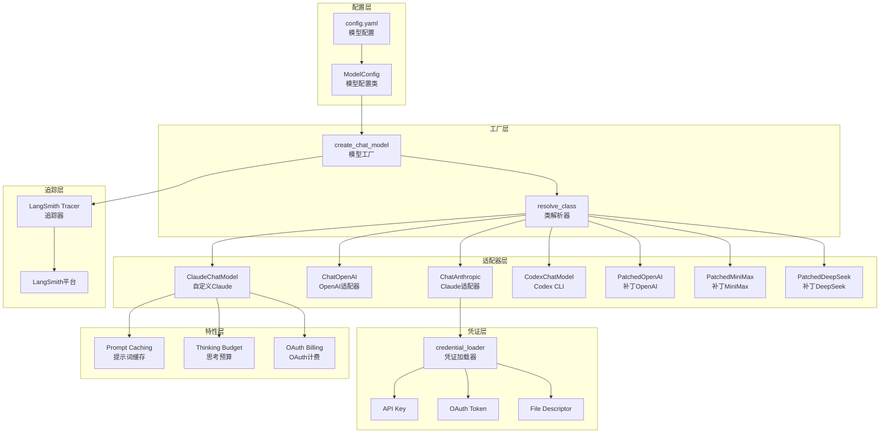
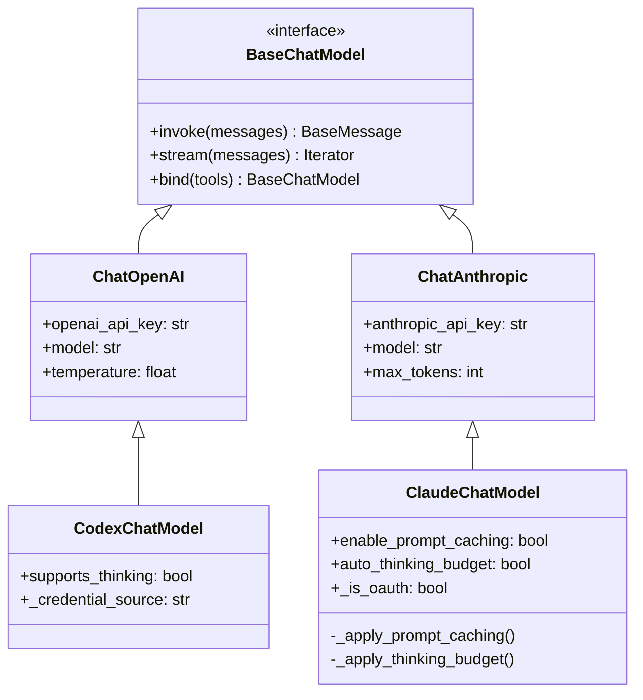

# 【文档编号+模块名】04-模型适配系统

## 1. 模块全局定位

- **所属项目**: deer-flow
- **层级位置**: backend/packages/harness/deerflow/models
- **核心作用**: 模型适配系统，提供统一接口适配多种大语言模型（OpenAI、Anthropic、Codex等）
- **业务价值**: 屏蔽不同模型API差异，提供统一的调用接口，支持模型热切换和特性适配

## 2. 依赖&调用链路 Mermaid图



## 3. 核心目录/文件清单

| 文件 | 绝对路径 | 职责描述 |
|------|---------|---------|
| factory.py | /backend/packages/harness/deerflow/models/factory.py | 模型工厂，统一创建入口 |
| claude_provider.py | /backend/packages/harness/deerflow/models/claude_provider.py | Claude适配器，OAuth支持 |
| openai_codex_provider.py | /backend/packages/harness/deerflow/models/openai_codex_provider.py | Codex CLI适配器 |
| patched_openai.py | /backend/packages/harness/deerflow/models/patched_openai.py | OpenAI补丁适配器 |
| patched_minimax.py | /backend/packages/harness/deerflow/models/patched_minimax.py | MiniMax补丁适配器 |
| patched_deepseek.py | /backend/packages/harness/deerflow/models/patched_deepseek.py | DeepSeek补丁适配器 |
| credential_loader.py | /backend/packages/harness/deerflow/models/credential_loader.py | 凭证加载器 |

## 4. 关键源码深度解析

### 4.1 模型工厂

#### 文件路径: `/backend/packages/harness/deerflow/models/factory.py`

```python
"""模型创建工厂"""

import logging

from langchain.chat_models import BaseChatModel

from deerflow.config import get_app_config, get_tracing_config, is_tracing_enabled
from deerflow.reflection import resolve_class

logger = logging.getLogger(__name__)


def create_chat_model(name: str | None = None, thinking_enabled: bool = False, **kwargs) -> BaseChatModel:
    """从配置创建聊天模型实例

    Args:
        name: 要创建的模型名称。None时使用配置中的第一个模型
        thinking_enabled: 是否启用思考模式
        **kwargs: 额外的模型参数

    Returns:
        聊天模型实例
    """
    config = get_app_config()
    if name is None:
        name = config.models[0].name

    # 获取模型配置
    model_config = config.get_model_config(name)
    if model_config is None:
        raise ValueError(f"模型 {name} 在配置中未找到")

    # 解析模型类
    model_class = resolve_class(model_config.use, BaseChatModel)

    # 提取配置参数
    model_settings_from_config = model_config.model_dump(
        exclude_none=True,
        exclude={
            "use",
            "name",
            "display_name",
            "description",
            "supports_thinking",
            "supports_reasoning_effort",
            "when_thinking_enabled",
            "thinking",
            "supports_vision",
        },
    )

    # 处理思考模式配置
    effective_wte: dict = dict(model_config.when_thinking_enabled) if model_config.when_thinking_enabled else {}
    if model_config.thinking is not None:
        merged_thinking = {**(effective_wte.get("thinking") or {}), **model_config.thinking}
        effective_wte = {**effective_wte, "thinking": merged_thinking}

    if thinking_enabled and effective_wte:
        if not model_config.supports_thinking:
            raise ValueError(f"模型 {name} 不支持思考模式")
        model_settings_from_config.update(effective_wte)

    # Codex Responses API特殊处理
    from deerflow.models.openai_codex_provider import CodexChatModel
    if issubclass(model_class, CodexChatModel):
        model_settings_from_config.pop("max_tokens", None)
        explicit_effort = kwargs.pop("reasoning_effort", None)
        if not thinking_enabled:
            model_settings_from_config["reasoning_effort"] = "none"
        elif explicit_effort:
            model_settings_from_config["reasoning_effort"] = explicit_effort
        else:
            model_settings_from_config["reasoning_effort"] = "medium"

    # 创建模型实例
    model_instance = model_class(**kwargs, **model_settings_from_config)

    # 附加LangSmith追踪
    if is_tracing_enabled():
        try:
            from langchain_core.tracers.langchain import LangChainTracer
            tracing_config = get_tracing_config()
            tracer = LangChainTracer(project_name=tracing_config.project)
            existing_callbacks = model_instance.callbacks or []
            model_instance.callbacks = [*existing_callbacks, tracer]
            logger.debug(f"LangSmith追踪已附加到模型 '{name}'")
        except Exception as e:
            logger.warning(f"无法附加LangSmith追踪到模型 '{name}': {e}")

    return model_instance
```

**解读**:
- **统一入口**: 所有模型通过create_chat_model创建，接口统一
- **配置驱动**: 从YAML配置读取模型定义，支持热更新
- **动态解析**: 使用resolve_class动态加载模型类
- **特性适配**: 自动处理思考模式、推理强度等特性
- **追踪集成**: 自动附加LangSmith追踪器

### 4.2 Claude适配器

#### 文件路径: `/backend/packages/harness/deerflow/models/claude_provider.py`

```python
"""自定义Claude提供商，支持OAuth Bearer认证、提示词缓存和智能思考

支持两种认证模式：
  1. 标准API密钥（x-api-key头）— 默认ChatAnthropic行为
  2. Claude Code OAuth令牌（Authorization: Bearer头）
     - 通过sk-ant-oat前缀检测
     - 需要anthropic-beta: oauth-2025-04-20,claude-code-20250219
     - 所有OAuth请求需要在系统提示词中使用计费头
"""

import anthropic
from langchain_anthropic import ChatAnthropic
from pydantic import PrivateAttr

MAX_RETRIES = 3
THINKING_BUDGET_RATIO = 0.8

# OAuth令牌所需的计费头。必须是第一个系统提示词块。
_DEFAULT_BILLING_HEADER = "x-anthropic-billing-header: cc_version=2.1.85.351; cc_entrypoint=cli; cch=6c6d5;"
OAUTH_BILLING_HEADER = os.environ.get("ANTHROPIC_BILLING_HEADER", _DEFAULT_BILLING_HEADER)


class ClaudeChatModel(ChatAnthropic):
    """支持OAuth Bearer认证、提示词缓存和智能思考的ChatAnthropic

    配置示例：
        - name: claude-sonnet-4.6
          use: deerflow.models.claude_provider:ClaudeChatModel
          model: claude-sonnet-4-6
          max_tokens: 16384
          enable_prompt_caching: true
    """

    # 自定义字段
    enable_prompt_caching: bool = True
    prompt_cache_size: int = 3
    auto_thinking_budget: bool = True
    retry_max_attempts: int = MAX_RETRIES
    _is_oauth: bool = PrivateAttr(default=False)
    _oauth_access_token: str = PrivateAttr(default="")

    def model_post_init(self, __context: Any) -> None:
        """自动加载凭证并在需要时配置OAuth"""
        from deerflow.models.credential_loader import (
            is_oauth_token,
            load_claude_code_credential,
        )

        # 提取实际密钥值
        current_key = ""
        if self.anthropic_api_key:
            if hasattr(self.anthropic_api_key, "get_secret_value"):
                current_key = self.anthropic_api_key.get_secret_value()
            else:
                current_key = str(self.anthropic_api_key)

        # 尝试显式Claude Code OAuth移交源
        if not current_key or current_key in ("your-anthropic-api-key",):
            cred = load_claude_code_credential()
            if cred:
                current_key = cred.access_token
                logger.info(f"使用Claude Code CLI凭证（来源: {cred.source}）")

        # 检测OAuth令牌并配置Bearer认证
        if is_oauth_token(current_key):
            self._is_oauth = True
            self._oauth_access_token = current_key
            self.anthropic_api_key = SecretStr(current_key)
            self.default_headers = {
                **(self.default_headers or {}),
                "anthropic-beta": OAUTH_ANTHROPIC_BETAS,
            }
            # OAuth令牌限制4个cache_control块 — 禁用提示词缓存
            self.enable_prompt_caching = False
            logger.info("检测到OAuth令牌 — 将使用Authorization: Bearer头")

        super().model_post_init(__context__)

        # 为OAuth Bearer认证立即修补客户端
        if self._is_oauth:
            self._patch_client_oauth(self._client)
            self._patch_client_oauth(self._async_client)

    def _patch_client_oauth(self, client: Any) -> None:
        """在Anthropic SDK客户端上交换api_key → auth_token以实现OAuth Bearer认证"""
        if hasattr(client, "api_key") and hasattr(client, "auth_token"):
            client.api_key = None
            client.auth_token = self._oauth_access_token

    def _get_request_payload(self, input_: Any, *, stop: list[str] | None = None, **kwargs: Any) -> dict:
        """重写以注入提示词缓存、思考预算和OAuth计费"""
        payload = super()._get_request_payload(input_, stop=stop, **kwargs)

        if self._is_oauth:
            self._apply_oauth_billing(payload)

        if self.enable_prompt_caching:
            self._apply_prompt_caching(payload)

        if self.auto_thinking_budget:
            self._apply_thinking_budget(payload)

        return payload

    def _apply_oauth_billing(self, payload: dict) -> None:
        """注入OAuth所需的计费头"""
        messages = payload.get("messages", [])
        if not messages:
            return

        # 计费头必须是第一个系统块
        first_system_idx = next((i for i, m in enumerate(messages) if m.get("role") == "system"), None)
        if first_system_idx is None:
            # 在开头插入系统消息
            messages.insert(0, {"role": "system", "content": OAUTH_BILLING_HEADER})
        else:
            # 预先添加到现有系统消息
            existing = messages[first_system_idx]
            content = existing.get("content", "")
            if isinstance(content, str):
                existing["content"] = f"{OAUTH_BILLING_HEADER}\n\n{content}"

    def _apply_prompt_caching(self, payload: dict) -> None:
        """对最近的消息应用缓存控制"""
        messages = payload.get("messages", [])
        cache_count = 0

        # 从最后向前缓存，限制cache_count
        for msg in reversed(messages):
            if cache_count >= self.prompt_cache_size:
                break
            if msg.get("role") in ("user", "system"):
                if isinstance(msg.get("content"), list):
                    for block in msg["content"]:
                        if block.get("type") == "text" and "cache_control" not in block:
                            block["cache_control"] = {"type": "ephemeral"}
                            cache_count += 1
                            break
                elif isinstance(msg.get("content"), str):
                    msg["content"] = [
                        {"type": "text", "text": msg["content"], "cache_control": {"type": "ephemeral"}}
                    ]
                    cache_count += 1

    def _apply_thinking_budget(self, payload: dict) -> None:
        """自动计算思考预算"""
        max_tokens = payload.get("max_tokens", 0)
        if max_tokens > 0:
            thinking_budget = int(max_tokens * THINKING_BUDGET_RATIO)
            payload.setdefault("extra_body", {})["thinking"] = {
                "type": "enabled",
                "budget_tokens": thinking_budget
            }
```

**解读**:
- **双认证模式**: 同时支持API密钥和OAuth令牌
- **自动检测**: 根据令牌前缀自动选择认证方式
- **提示词缓存**: 自动为最近消息添加缓存控制
- **智能预算**: 根据max_tokens自动计算思考预算
- **OAuth计费**: 自动注入OAuth所需的计费头

### 4.3 Codex CLI适配器

#### 文件路径: `/backend/packages/harness/deerflow/models/openai_codex_provider.py`

```python
"""Codex CLI提供商适配器

支持通过Codex CLI调用OpenAI模型，使用~/.codex/auth.json中的凭证。
"""

from langchain_openai import ChatOpenAI
from pydantic import PrivateAttr

class CodexChatModel(ChatOpenAI):
    """使用Codex CLI凭证的ChatOpenAI

    配置示例：
        - name: gpt-5.4
          use: deerflow.models.openai_codex_provider:CodexChatModel
          model: gpt-5.4
          supports_thinking: true
          supports_reasoning_effort: true
    """

    # Codex特有字段
    supports_thinking: bool = False
    supports_reasoning_effort: bool = False
    _credential_source: str = PrivateAttr(default="")

    def model_post_init(self, __context: Any) -> None:
        """从Codex CLI加载凭证"""
        import json
        from pathlib import Path

        cred_path = Path.home() / ".codex" / "auth.json"
        if cred_path.exists():
            with open(cred_path) as f:
                auth_data = json.load(f)
                api_key = auth_data.get("api_key")
                if api_key:
                    self.openai_api_key = api_key
                    self._credential_source = f"~/.codex/auth.json"

        super().model_post_init(__context__)
```

**解读**:
- **CLI集成**: 直接使用Codex CLI的凭证文件
- **特性支持**: 支持思考模式和推理强度
- **无缝切换**: 与标准OpenAI适配器接口兼容

## 5. 底层设计思想

### 5.1 适配器模式



### 5.2 凭证加载优先级

```
1. 配置文件中的api_key值
2. 环境变量（OPENAI_API_KEY, ANTHROPIC_API_KEY等）
3. 显式OAuth令牌文件
4. CLI凭证文件（~/.codex/auth.json, ~/.claude/.credentials.json）
```

### 5.3 设计原则

1. **接口统一**: 所有模型实现BaseChatModel接口
2. **配置驱动**: 通过YAML配置模型定义
3. **自动适配**: 根据模型类型自动启用特性
4. **扩展友好**: 新增模型只需实现BaseChatModel
5. **降级兼容**: 不支持的特性自动禁用

## 6. 必学核心知识点

### 6.1 技术点

1. **适配器模式**: 统一不同模型API接口
2. **工厂模式**: 集中创建模型实例
3. **反射机制**: 动态加载模型类
4. **凭证管理**: 多源凭证加载和优先级
5. **特性检测**: 自动发现模型能力

### 6.2 支持的模型特性

| 特性 | 描述 | 支持模型 |
|------|------|---------|
| thinking | 扩展思考模式 | Claude 3.7+, GPT-5 |
| reasoning_effort | 推理强度 | Codex Responses API |
| prompt_caching | 提示词缓存 | Claude API |
| oauth | OAuth认证 | Claude Code |
| vision | 视觉能力 | GPT-4V, Claude 3.5 Sonnet |

### 6.3 工程设计点

1. **延迟初始化**: 模型在首次使用时创建
2. **缓存复用**: 同名模型实例共享
3. **错误处理**: 清晰的异常提示
4. **日志追踪**: 详细的调试日志
5. **类型安全**: 完整的类型注解

## 7. 可直接拷贝复用代码片段

### 7.1 自定义模型适配器

```python
from langchain.chat_models.base import BaseChatModel
from langchain_core.messages import BaseMessage

class CustomModelAdapter(BaseChatModel):
    """自定义模型适配器模板"""

    def __init__(self, api_key: str, model: str = "custom-model"):
        super().__init__()
        self.api_key = api_key
        self.model = model

    def _generate(
        self,
        messages: list[BaseMessage],
        stop: list[str] | None = None,
        run_manager: Any | None = None,
        **kwargs: Any,
    ) -> ChatResult:
        """实现模型调用逻辑"""
        # 1. 转换消息格式
        # 2. 调用模型API
        # 3. 转换响应格式
        return ChatResult(generations=[ChatMessage(message="响应内容")])

    @property
    def _llm_type(self) -> str:
        return "custom-model"
```

### 7.2 模型配置示例

```yaml
models:
  # OpenAI标准模型
  - name: gpt-4
    display_name: GPT-4
    use: langchain_openai:ChatOpenAI
    model: gpt-4
    api_key: $OPENAI_API_KEY
    max_tokens: 4096
    temperature: 0.7

  # Claude OAuth模型
  - name: claude-sonnet-4.6
    display_name: Claude Sonnet 4.6
    use: deerflow.models.claude_provider:ClaudeChatModel
    model: claude-sonnet-4-6
    api_key: $ANTHROPIC_API_KEY
    enable_prompt_caching: true
    auto_thinking_budget: true

  # Codex CLI模型
  - name: gpt-5.4
    display_name: GPT-5.4 (Codex)
    use: deerflow.models.openai_codex_provider:CodexChatModel
    model: gpt-5.4
    supports_thinking: true
    supports_reasoning_effort: true
```

### 7.3 凭证加载工具

```python
import os
import json
from pathlib import Path
from typing import NamedTuple

class Credential(NamedTuple):
    access_token: str
    source: str

def load_credential_from_file(path: Path) -> Credential | None:
    """从文件加载凭证"""
    if not path.exists():
        return None
    try:
        with open(path) as f:
            data = json.load(f)
            token = data.get("api_key") or data.get("access_token")
            if token:
                return Credential(access_token=token, source=str(path))
    except Exception:
        pass
    return None

def load_credential_from_env(var: str) -> Credential | None:
    """从环境变量加载凭证"""
    token = os.getenv(var)
    if token:
        return Credential(access_token=token, source=f"${var}")
    return None
```

## 8. 踩坑提醒 & 二次开发建议

### 8.1 常见问题

1. **API密钥格式**: 不同提供商的密钥格式不同
2. **OAuth令牌过期**: OAuth令牌有时效性，需定期刷新
3. **提示词缓存限制**: Claude OAuth限制缓存块数量
4. **思考模式兼容性**: 不是所有模型都支持思考模式
5. **模型版本漂移**: 模型更新可能导致API变化

### 8.2 调试技巧

1. **凭证验证**:
```python
from deerflow.models.credential_loader import load_claude_code_credential
cred = load_claude_code_credential()
if cred:
    print(f"凭证来源: {cred.source}")
    print(f"令牌前缀: {cred.access_token[:10]}...")
```

2. **模型测试**:
```python
from deerflow.models import create_chat_model
model = create_chat_model(name="gpt-4")
result = model.invoke("Hello")
print(result.content)
```

3. **特性检测**:
```python
config = get_app_config()
model_config = config.get_model_config("gpt-4")
print(f"支持思考: {model_config.supports_thinking}")
print(f"支持视觉: {model_config.supports_vision}")
```

### 8.3 二次开发方向

1. **企业模型适配**: 支持私有化大模型
2. **自定义认证**: 实现特殊的认证方式
3. **请求路由**: 智能路由到最优模型
4. **成本优化**: 根据任务复杂度选择模型
5. **A/B测试**: 支持模型对比测试

## 9. 文档衔接

本篇完结，下一篇将解析：【05-工具系统详解】

---

## 附录：模型配置速查表

### 模型配置字段

| 字段 | 类型 | 描述 | 必填 |
|------|------|------|------|
| name | str | 模型内部标识符 | 是 |
| display_name | str | 显示名称 | 是 |
| use | str | 模型类路径 | 是 |
| model | str | API模型名 | 是 |
| api_key | str | API密钥（支持环境变量） | 是 |
| max_tokens | int | 最大输出token | 否 |
| temperature | float | 采样温度 | 否 |
| supports_thinking | bool | 支持思考模式 | 否 |
| supports_reasoning_effort | bool | 支持推理强度 | 否 |
| supports_vision | bool | 支持视觉 | 否 |

### 环境变量

| 变量名 | 用途 | 提供商 |
|--------|------|--------|
| OPENAI_API_KEY | OpenAI API密钥 | OpenAI |
| ANTHROPIC_API_KEY | Anthropic API密钥 | Anthropic |
| CLAUDE_CODE_OAUTH_TOKEN | Claude Code OAuth令牌 | Anthropic |
| ANTHROPIC_AUTH_TOKEN | Anthropic认证令牌 | Anthropic |
| ANTHROPIC_BILLING_HEADER | OAuth计费头 | Anthropic |
