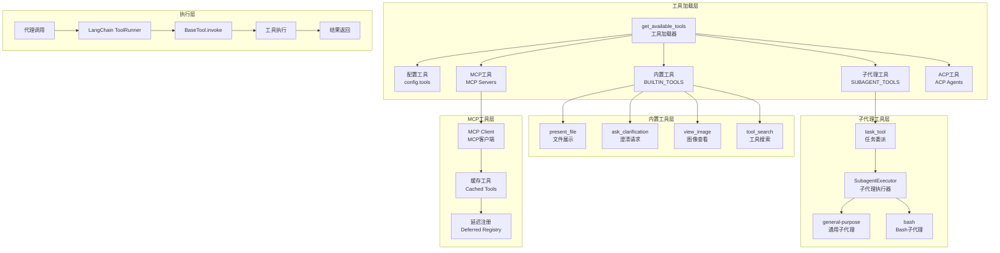
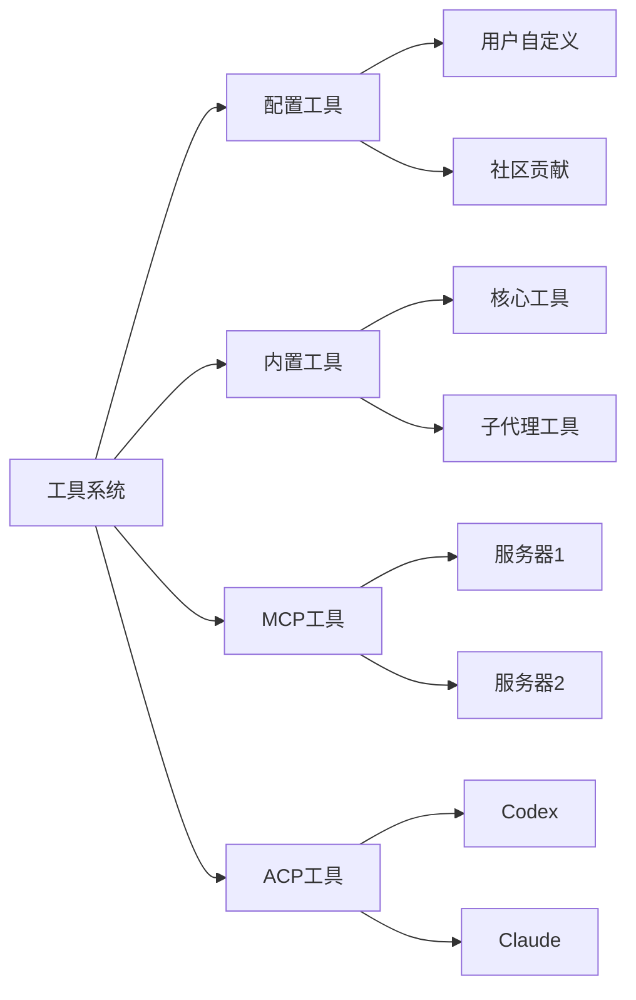
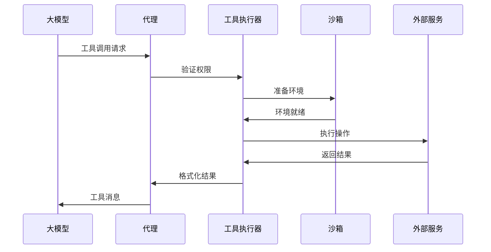

# 【文档编号+模块名】05-工具系统详解

## 1. 模块全局定位

- **所属项目**: deer-flow
- **层级位置**: backend/packages/harness/deerflow/tools
- **核心作用**: 工具系统，提供可扩展的工具调用能力，支持内置工具、MCP工具、ACP工具等
- **业务价值**: 扩展AI代理的能力边界，使其能够执行代码、调用API、操作文件等实际操作

## 2. 依赖&调用链路 Mermaid图



## 3. 核心目录/文件清单

| 文件 | 绝对路径 | 职责描述 |
|------|---------|---------|
| tools.py | /backend/packages/harness/deerflow/tools/tools.py | 工具加载器，统一工具获取入口 |
| builtins/ | /backend/packages/harness/deerflow/tools/builtins/ | 内置工具目录 |
| builtins/task_tool.py | /backend/packages/harness/deerflow/tools/builtins/task_tool.py | 任务委派工具 |
| builtins/present_file_tool.py | /backend/packages/harness/deerflow/tools/builtins/present_file_tool.py | 文件展示工具 |
| builtins/clarification_tool.py | /backend/packages/harness/deerflow/tools/builtins/clarification_tool.py | 澄清请求工具 |
| builtins/view_image_tool.py | /backend/packages/harness/deerflow/tools/builtins/view_image_tool.py | 图像查看工具 |
| builtins/tool_search.py | /backend/packages/harness/deerflow/tools/builtins/tool_search.py | 工具搜索工具 |
| builtins/invoke_acp_agent_tool.py | /backend/packages/harness/deerflow/tools/builtins/invoke_acp_agent_tool.py | ACP代理调用工具 |

## 4. 关键源码深度解析

### 4.1 工具加载器

#### 文件路径: `/backend/packages/harness/deerflow/tools/tools.py`

```python
"""工具系统 - 统一工具加载和管理"""

import logging

from langchain.tools import BaseTool

from deerflow.config import get_app_config
from deerflow.reflection import resolve_variable
from deerflow.sandbox.security import is_host_bash_allowed
from deerflow.tools.builtins import (
    ask_clarification_tool,
    present_file_tool,
    task_tool,
    view_image_tool,
)
from deerflow.tools.builtins.tool_search import reset_deferred_registry

logger = logging.getLogger(__name__)

# 内置工具列表（始终可用）
BUILTIN_TOOLS = [
    present_file_tool,
    ask_clarification_tool,
]

# 子代理工具（需要subagent_enabled）
SUBAGENT_TOOLS = [
    task_tool,
]

def get_available_tools(
    groups: list[str] | None = None,
    include_mcp: bool = True,
    model_name: str | None = None,
    subagent_enabled: bool = False,
) -> list[BaseTool]:
    """从配置获取所有可用工具

    Args:
        groups: 可选的工具组过滤器
        include_mcp: 是否包含MCP服务器工具（默认True）
        model_name: 用于确定是否包含视觉工具的模型名称
        subagent_enabled: 是否包含子代理工具（task, task_status）

    Returns:
        可用工具列表
    """
    config = get_app_config()

    # 获取配置的工具
    tool_configs = [
        tool for tool in config.tools
        if groups is None or tool.group in groups
    ]

    # 安全检查：LocalSandboxProvider激活时不暴露主机bash
    if not is_host_bash_allowed(config):
        tool_configs = [
            tool for tool in tool_configs
            if not _is_host_bash_tool(tool)
        ]

    # 加载配置的工具
    loaded_tools = [
        resolve_variable(tool.use, BaseTool)
        for tool in tool_configs
    ]

    # 基础内置工具
    builtin_tools = BUILTIN_TOOLS.copy()

    # 仅在启用时添加子代理工具
    if subagent_enabled:
        builtin_tools.extend(SUBAGENT_TOOLS)
        logger.info("包含子代理工具（task）")

    # 如果模型支持视觉，添加view_image_tool
    if model_name is None and config.models:
        model_name = config.models[0].name

    model_config = config.get_model_config(model_name) if model_name else None
    if model_config is not None and model_config.supports_vision:
        builtin_tools.append(view_image_tool)
        logger.info(f"为模型 '{model_name}' 包含view_image_tool（supports_vision=True）")

    # 获取缓存的MCP工具
    mcp_tools = []
    reset_deferred_registry()
    if include_mcp:
        try:
            from deerflow.config.extensions_config import ExtensionsConfig
            from deerflow.mcp.cache import get_cached_mcp_tools

            extensions_config = ExtensionsConfig.from_file()
            if extensions_config.get_enabled_mcp_servers():
                mcp_tools = get_cached_mcp_tools()
                if mcp_tools:
                    logger.info(f"使用 {len(mcp_tools)} 个缓存的MCP工具")

                    # 启用tool_search时，注册MCP工具并添加tool_search
                    if config.tool_search.enabled:
                        from deerflow.tools.builtins.tool_search import (
                            DeferredToolRegistry,
                            set_deferred_registry,
                        )
                        from deerflow.tools.builtins.tool_search import tool_search as tool_search_tool

                        registry = DeferredToolRegistry()
                        for t in mcp_tools:
                            registry.register(t)
                        set_deferred_registry(registry)
                        builtin_tools.append(tool_search_tool)
                        logger.info(f"工具搜索激活：{len(mcp_tools)} 个工具已延迟")
        except ImportError:
            logger.warning("MCP模块不可用。安装 'langchain-mcp-adapters' 包以启用MCP工具。")
        except Exception as e:
            logger.error(f"获取缓存的MCP工具失败：{e}")

    # 添加invoke_acp_agent工具（如果配置了ACP代理）
    acp_tools: list[BaseTool] = []
    try:
        from deerflow.config.acp_config import get_acp_agents
        from deerflow.tools.builtins.invoke_acp_agent_tool import build_invoke_acp_agent_tool

        acp_agents = get_acp_agents()
        if acp_agents:
            acp_tools.append(build_invoke_acp_agent_tool(acp_agents))
            logger.info(f"包含invoke_acp_agent工具（{len(acp_agents)} 个代理：{list(acp_agents.keys())}）")
    except Exception as e:
        logger.warning(f"加载ACP工具失败：{e}")

    logger.info(
        f"总工具加载：{len(loaded_tools)} 个配置工具，"
        f"{len(builtin_tools)} 个内置工具，"
        f"{len(mcp_tools)} 个MCP工具，"
        f"{len(acp_tools)} 个ACP工具"
    )
    return loaded_tools + builtin_tools + mcp_tools + acp_tools
```

**解读**:
- **分层加载**: 配置工具、内置工具、MCP工具、ACP工具四层架构
- **安全控制**: 自动过滤不安全的工具（如主机bash）
- **条件启用**: 根据模型能力和配置动态启用工具
- **延迟注册**: tool_search机制延迟加载大量MCP工具
- **日志追踪**: 详细记录工具加载情况

### 4.2 任务委派工具

#### 文件路径: `/backend/packages/harness/deerflow/tools/builtins/task_tool.py`

```python
"""任务工具 - 将工作委派给子代理"""

import asyncio
import logging
from dataclasses import replace
from typing import Annotated

from langchain.tools import InjectedToolCallId, ToolRuntime, tool
from langgraph.typing import ContextT

from deerflow.agents.thread_state import ThreadState
from deerflow.subagents import SubagentExecutor, get_subagent_config

logger = logging.getLogger(__name__)

@tool("task", parse_docstring=True)
async def task_tool(
    runtime: ToolRuntime[ContextT, ThreadState],
    description: str,
    prompt: str,
    subagent_type: str,
    tool_call_id: Annotated[str, InjectedToolCallId],
    max_turns: int | None = None,
) -> str:
    """将任务委派给在独立上下文中运行的专用子代理

    子代理帮助您：
    - 通过分离探索和实施来保留上下文
    - 自主处理复杂的多步骤任务
    - 在隔离的上下文中执行命令或操作

    可用的子代理类型取决于活动的沙箱配置：
    - **general-purpose**： capable agent for complex, multi-step tasks
    - **bash**：命令执行专家（需要显式允许主机bash或使用隔离shell沙箱）

    使用此工具的场景：
    - 需要多个步骤或工具的复杂任务
    - 产生冗长输出的任务
    - 想要从主对话中隔离上下文
    - 并行研究或探索任务

    不使用此工具的场景：
    - 简单的单步操作（直接使用工具）
    - 需要用户交互或澄清的任务

    Args:
        description: 任务的简短描述（3-5词）用于日志/显示
        prompt: 子代理的任务描述，具体明确
        subagent_type: 要使用的子代理类型
        max_turns: 可选的最大代理轮次数
    """
    available_subagent_names = get_available_subagent_names()

    # 获取子代理配置
    config = get_subagent_config(subagent_type)
    if config is None:
        available = ", ".join(available_subagent_names)
        return f"错误：未知的子代理类型 '{subagent_type}'。可用：{available}"

    # 构建配置覆盖
    overrides: dict = {}

    # 注入技能提示词
    skills_section = get_skills_prompt_section()
    if skills_section:
        overrides["system_prompt"] = config.system_prompt + "\n\n" + skills_section

    # 设置最大轮次
    if max_turns is not None:
        overrides["max_turns"] = max_turns

    if overrides:
        config = replace(config, **overrides)

    # 从运行时提取父上下文
    thread_id = runtime.context.get("thread_id") if runtime.context else None
    if thread_id is None:
        thread_id = runtime.config.get("configurable", {}).get("thread_id")

    # 创建子代理执行器
    executor = SubagentExecutor(
        config=config,
        thread_id=thread_id,
        parent_runtime=runtime,
        tool_call_id=tool_call_id,
    )

    # 异步执行子代理
    try:
        result = await executor.run(prompt)
        return result
    except Exception as e:
        logger.exception(f"子代理执行失败：{subagent_type}")
        return f"错误：子代理执行失败 - {str(e)}"
```

**解读**:
- **上下文隔离**: 子代理在独立上下文中运行，不污染主对话
- **专用类型**: 支持通用和Bash两种子代理类型
- **配置覆盖**: 运行时可覆盖子代理配置
- **异步执行**: 不阻塞主代理的执行流程
- **错误处理**: 统一异常捕获和错误消息返回

### 4.3 工具搜索机制

#### 文件路径: `/backend/packages/harness/deerflow/tools/builtins/tool_search.py`

```python
"""工具搜索 - 延迟加载大量工具"""

from typing import Any

from langchain.tools import BaseTool, tool

class DeferredToolRegistry:
    """延迟工具注册表

    用于管理大量工具（如MCP工具），避免在系统提示词中暴露所有工具。
    工具按需加载，仅在代理明确请求时才添加到上下文中。
    """

    def __init__(self):
        self._registry: dict[str, BaseTool] = {}
        self._categories: dict[str, list[str]] = {}

    def register(self, tool: BaseTool) -> None:
        """注册工具"""
        self._registry[tool.name] = tool
        # 按类别组织
        category = getattr(tool, "category", "uncategorized")
        if category not in self._categories:
            self._categories[category] = []
        self._categories[category].append(tool.name)

    def get(self, name: str) -> BaseTool | None:
        """按名称获取工具"""
        return self._registry.get(name)

    def search(self, query: str) -> list[BaseTool]:
        """搜索匹配的工具"""
        results = []
        query_lower = query.lower()
        for name, tool in self._registry.items():
            # 搜索名称和描述
            if query_lower in name.lower() or query_lower in tool.description.lower():
                results.append(tool)
        return results

    def list_categories(self) -> list[str]:
        """列出所有类别"""
        return list(self._categories.keys())

    def list_by_category(self, category: str) -> list[BaseTool]:
        """按类别列出工具"""
        names = self._categories.get(category, [])
        return [self._registry[name] for name in names]


@tool("tool_search", parse_docstring=True)
def tool_search(query: str) -> str:
    """搜索可用的延迟加载工具

    当您需要特定功能但不知道确切工具名称时使用此工具。
    它将返回匹配查询的工具列表及其描述。

    Args:
        query: 描述所需功能的关键词或短语

    Returns:
        匹配工具的列表，包含名称和描述
    """
    registry = get_deferred_registry()
    if registry is None:
        return "错误：延迟工具注册表未初始化"

    results = registry.search(query)
    if not results:
        return f"未找到匹配 '{query}' 的工具"

    output = [f"找到 {len(results)} 个匹配工具：\n"]
    for tool in results:
        output.append(f"- {tool.name}: {tool.description}")

    return "\n".join(output)
```

**解读**:
- **延迟加载**: 工具不在启动时全部加载，按需获取
- **分类管理**: 支持按类别组织工具
- **模糊搜索**: 支持关键词搜索工具
- **节省Token**: 避免在系统提示词中暴露大量工具

## 5. 底层设计思想

### 5.1 工具分类架构



### 5.2 工具调用流程



### 5.3 设计原则

1. **可扩展性**: 支持多种工具来源和类型
2. **安全性**: 沙箱隔离和权限控制
3. **性能优化**: 延迟加载和缓存机制
4. **类型安全**: 强类型工具接口
5. **错误恢复**: 优雅的错误处理

## 6. 必学核心知识点

### 6.1 工具定义

```python
from langchain.tools import tool

@tool("tool_name", parse_docstring=True)
async def my_tool(param1: str, param2: int) -> str:
    """工具描述（用于生成系统提示词）

    Args:
        param1: 参数1描述
        param2: 参数2描述

    Returns:
        返回值描述
    """
    # 工具逻辑
    return "结果"
```

### 6.2 工具类型

| 类型 | 描述 | 示例 |
|------|------|------|
| 同步工具 | 阻塞执行 | 文件读取 |
| 异步工具 | 非阻塞执行 | HTTP请求 |
| 子代理工具 | 委派给子代理 | task_tool |
| 结构化工具 | 带输入模式 | 数据验证 |
| 原始工具 | 直接函数调用 | 自定义函数 |

### 6.3 工具安全

1. **沙箱隔离**: 危险操作在沙箱中执行
2. **权限检查**: 运行时验证操作权限
3. **输入验证**: 验证工具参数
4. **输出过滤**: 过滤敏感信息
5. **审计日志**: 记录工具调用

## 7. 可直接拷贝复用代码片段

### 7.1 自定义工具模板

```python
from langchain.tools import tool
from typing import Any

@tool("custom_tool", parse_docstring=True)
async def custom_tool(
    input_data: str,
    option: str = "default"
) -> str:
    """自定义工具模板

    Args:
        input_data: 输入数据描述
        option: 可选参数，默认为"default"

    Returns:
        处理结果
    """
    try:
        # 工具逻辑
        result = f"处理结果：{input_data}"
        return result
    except Exception as e:
        return f"错误：{str(e)}"
```

### 7.2 工具组合

```python
from langchain.tools import StructuredTool
from pydantic import BaseModel, Field

class ToolInput(BaseModel):
    """工具输入模式"""
    query: str = Field(description="搜索查询")
    limit: int = Field(default=10, description="结果限制")

async def combined_tool_logic(query: str, limit: int) -> str:
    """组合工具逻辑"""
    # 调用多个工具
    return f"为 '{query}' 找到 {limit} 个结果"

combined_tool = StructuredTool.from_function(
    func=combined_tool_logic,
    name="combined_tool",
    description="组合多个工具的功能",
    args_schema=ToolInput
)
```

### 7.3 工具注册器

```python
from typing import Dict, List
from langchain.tools import BaseTool

class ToolRegistry:
    """工具注册器"""

    def __init__(self):
        self._tools: Dict[str, BaseTool] = {}

    def register(self, tool: BaseTool) -> None:
        """注册工具"""
        self._tools[tool.name] = tool

    def unregister(self, name: str) -> None:
        """注销工具"""
        self._tools.pop(name, None)

    def get(self, name: str) -> BaseTool | None:
        """获取工具"""
        return self._tools.get(name)

    def list_all(self) -> List[BaseTool]:
        """列出所有工具"""
        return list(self._tools.values())

    def filter_by_tag(self, tag: str) -> List[BaseTool]:
        """按标签过滤"""
        return [
            tool for tool in self._tools.values()
            if tag in getattr(tool, "tags", [])
        ]
```

## 8. 踩坑提醒 & 二次开发建议

### 8.1 常见问题

1. **工具描述不清**: 导致模型错误使用工具
2. **参数验证不足**: 接受无效输入导致错误
3. **异步陷阱**: 同步工具阻塞事件循环
4. **资源泄漏**: 未正确清理工具资源
5. **权限过度**: 工具权限过于宽松

### 8.2 调试技巧

1. **工具调用日志**:
```python
import logging
logging.getLogger("langchain.tools").setLevel(logging.DEBUG)
```

2. **工具测试**:
```python
from langchain.tools import tool
from langchain_core.messages import HumanMessage

@tool("test_tool")
def test_tool(input: str) -> str:
    return f"处理：{input}"

# 测试工具
result = test_tool.invoke("测试输入")
print(result)
```

3. **工具链调试**:
```python
from langchain.agents import initialize_agent

agent = initialize_agent(
    tools=[tool1, tool2, tool3],
    llm=model,
    verbose=True  # 启用详细日志
)
```

### 8.3 二次开发方向

1. **企业工具集**: 开发企业内部工具库
2. **工具市场**: 创建工具分享平台
3. **工具编排**: 支持工具链和组合
4. **智能路由**: 自动选择最优工具
5. **工具版本管理**: 支持工具版本控制

## 9. 文档衔接

本篇完结，下一篇将解析：【06-技能系统详解】

---

## 附录：内置工具速查表

| 工具名 | 描述 | 参数 |
|--------|------|------|
| present_file | 展示文件内容 | file_path, start_line, end_line |
| ask_clarification | 请求澄清 | question |
| view_image | 查看图像 | image_path |
| task | 委派任务给子代理 | description, prompt, subagent_type, max_turns |
| tool_search | 搜索延迟工具 | query |
| invoke_acp_agent | 调用ACP代理 | agent_name, prompt |
| setup_agent | 设置代理配置 | agent_config |
