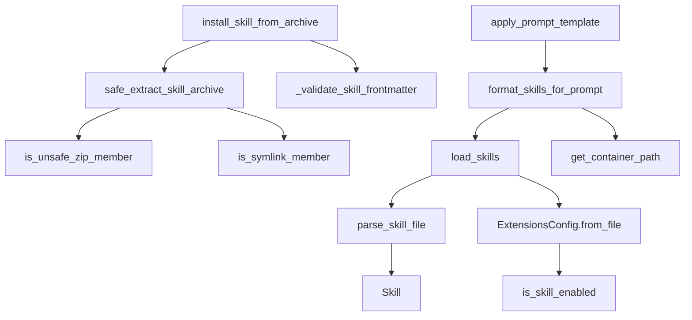
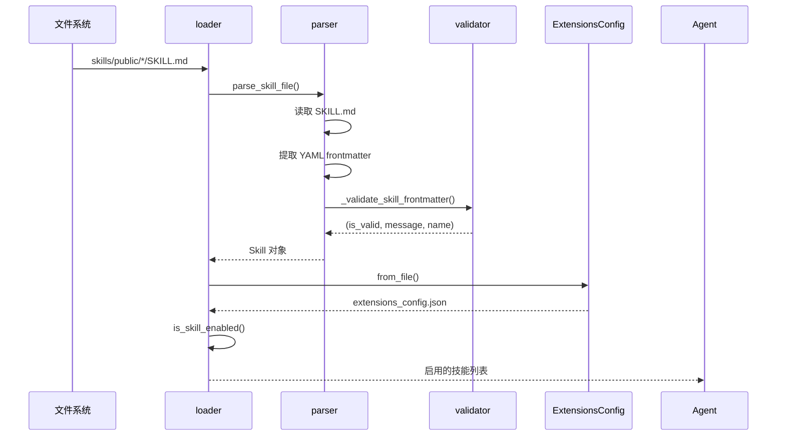

# 【05-技能系统】技能系统深度解析

> **源码路径**: `backend/packages/harness/deerflow/skills/`
> **核心文件**: 6个 Python 文件
> **技能目录**: `deer-flow/skills/{public,custom}/`

---

## 一、设计思想

### 1.1 技能系统概述

DeerFlow 的技能系统提供了一种可扩展的方式，为 AI Agent 注入领域知识和能力。核心功能包括：

- **技能发现**: 自动扫描 `skills/{public,custom}/` 目录
- **元数据解析**: 从 `SKILL.md` 提取名称、描述、许可等信息
- **状态管理**: 通过 `extensions_config.json` 控制启用/禁用
- **安全安装**: .skill 归档文件的安全解压和验证
- **系统提示注入**: 将启用的技能信息注入 Agent 系统提示词

### 1.2 架构设计原则

```
┌─────────────────────────────────────────────────────────────────┐
│                    技能系统工作流程                              │
│                                                                 │
│  ┌─────────────────────────────────────────────────────────┐   │
│  │              技能发现 (load_skills)                     │   │
│  │   1. 扫描 skills/public/ 和 skills/custom/              │   │
│  │   2. 查找每个目录下的 SKILL.md                           │   │
│  │   3. 解析 YAML frontmatter                              │   │
│  │   4. 从 extensions_config.json 读取启用状态              │   │
│  └────────────────────┬────────────────────────────────────┘   │
│                       ▼                                          │
│  ┌─────────────────────────────────────────────────────────┐   │
│  │              技能解析 (parse_skill_file)                │   │
│  │   1. 读取 SKILL.md 内容                                 │   │
│  │   2. 提取 --- ... --- YAML 块                          │   │
│  │   3. 解析 name, description, license 等字段             │   │
│  │   4. 创建 Skill 对象                                    │   │
│  └────────────────────┬────────────────────────────────────┘   │
│                       ▼                                          │
│  ┌─────────────────────────────────────────────────────────┐   │
│  │              技能验证 (_validate_skill_frontmatter)     │   │
│  │   1. 检查必需字段 (name, description)                  │   │
│  │   2. 验证命名规则 (hyphen-case)                        │   │
│  │   3. 检查长度限制                                       │   │
│  │   4. 验证允许的属性列表                                 │   │
│  └────────────────────┬────────────────────────────────────┘   │
│                       ▼                                          │
│  ┌─────────────────────────────────────────────────────────┐   │
│  │              技能注入 (apply_prompt_template)           │   │
│  │   1. 筛选启用的技能                                     │   │
│  │   2. 获取容器路径 (/mnt/skills/{category}/{skill})      │   │
│  │   3. 格式化为系统提示词                                 │   │
│  └─────────────────────────────────────────────────────────┘   │
└─────────────────────────────────────────────────────────────────┘

┌─────────────────────────────────────────────────────────────────┐
│                     技能安装流程                                 │
│                                                                 │
│  ┌─────────────────────────────────────────────────────────┐   │
│  │              安装请求 (.skill 文件)                     │   │
│  └────────────────────┬────────────────────────────────────┘   │
│                       ▼                                          │
│  ┌─────────────────────────────────────────────────────────┐   │
│  │              安全检查 (safe_extract_skill_archive)      │   │
│  │   1. 检查绝对路径                                       │   │
│  │   2. 检测路径遍历 (..)                                  │   │
│  │   3. 跳过符号链接                                       │   │
│  │   4. 强制大小限制 (512MB)                               │   │
│  └────────────────────┬────────────────────────────────────┘   │
│                       ▼                                          │
│  ┌─────────────────────────────────────────────────────────┐   │
│  │              技能验证 (_validate_skill_frontmatter)     │   │
│  └────────────────────┬────────────────────────────────────┘   │
│                       ▼                                          │
│  ┌─────────────────────────────────────────────────────────┐   │
│  │              复制到 skills/custom/{skill_name}/         │   │
│  └─────────────────────────────────────────────────────────┘   │
└─────────────────────────────────────────────────────────────────┘
```

### 1.3 核心设计决策

**为什么使用 SKILL.md 文件？**

1. **人类可读**: Markdown 格式便于开发者阅读和编辑
2. **元数据丰富**: YAML frontmatter 支持结构化元数据
3. **文档一体**: 技能说明和代码可以在同一目录

**为什么需要 extensions_config.json？**

1. **持久化状态**: 启用/禁用状态需要在重启后保持
2. **跨进程同步**: Gateway API 和 LangGraph Server 共享配置
3. **原子更新**: 文件写入确保状态一致性

**为什么分类为 public 和 custom？**

1. **版本控制**: public 技能提交到仓库，custom 被 gitignore
2. **更新策略**: public 技能可被更新覆盖，custom 保留用户修改
3. **权限分离**: public 只读，custom 可写入

**为什么需要安全解压？**

1. **路径遍历防护**: 防止恶意归档文件写入任意位置
2. **Zip Bomb 防护**: 限制解压后总大小
3. **符号链接处理**: 跳过符号链接防止逃逸

---

## 二、模块架构

### 2.1 文件结构

```
deerflow/skills/
├── __init__.py          # 模块导出
├── loader.py            # 技能加载与扫描
├── parser.py            # SKILL.md 解析
├── types.py             # Skill 数据类
├── validation.py        # 前置元数据验证
└── installer.py         # .skill 归档安装
```

### 2.2 模块依赖图



### 2.3 数据流图



---

## 三、核心组件解析

### 3.1 技能加载器 (loader.py)

#### `load_skills()` - 技能加载主函数

**源码位置**: `packages/harness/deerflow/skills/loader.py:25-101`

```python
def load_skills(skills_path: Path | None = None, use_config: bool = True, enabled_only: bool = False) -> list[Skill]:
    """Load all skills from the skills directory."""
    if skills_path is None:
        if use_config:
            try:
                from deerflow.config import get_app_config
                config = get_app_config()
                skills_path = config.skills.get_skills_path()
            except Exception:
                skills_path = get_skills_root_path()
        else:
            skills_path = get_skills_root_path()

    if not skills_path.exists():
        return []

    skills = []

    # Scan public and custom directories
    for category in ["public", "custom"]:
        category_path = skills_path / category
        if not category_path.exists() or not category_path.is_dir():
            continue

        for current_root, dir_names, file_names in os.walk(category_path, followlinks=True):
            # Keep traversal deterministic and skip hidden directories
            dir_names[:] = sorted(name for name in dir_names if not name.startswith("."))
            if "SKILL.md" not in file_names:
                continue

            skill_file = Path(current_root) / "SKILL.md"
            relative_path = skill_file.parent.relative_to(category_path)

            skill = parse_skill_file(skill_file, category=category, relative_path=relative_path)
            if skill:
                skills.append(skill)

    # Load skills state configuration
    try:
        from deerflow.config.extensions_config import ExtensionsConfig
        extensions_config = ExtensionsConfig.from_file()
        for skill in skills:
            skill.enabled = extensions_config.is_skill_enabled(skill.name, skill.category)
    except Exception as e:
        logger.warning("Failed to load extensions config: %s", e)

    if enabled_only:
        skills = [skill for skill in skills if skill.enabled]

    skills.sort(key=lambda s: s.name)
    return skills
```

**关键注释解读**:
> We use ExtensionsConfig.from_file() instead of get_extensions_config()
> to always read the latest configuration from disk.

这确保了 Gateway API 修改配置后，LangGraph Server 能立即感知变更。

### 3.2 技能解析器 (parser.py)

#### `parse_skill_file()` - SKILL.md 解析

**源码位置**: `packages/harness/deerflow/skills/parser.py:10-68`

```python
def parse_skill_file(skill_file: Path, category: str, relative_path: Path | None = None) -> Skill | None:
    """Parse a SKILL.md file and extract metadata."""
    if not skill_file.exists() or skill_file.name != "SKILL.md":
        return None

    try:
        content = skill_file.read_text(encoding="utf-8")

        # Extract YAML front matter
        # Pattern: ---\nkey: value\n---
        front_matter_match = re.match(r"^---\s*\n(.*?)\n---\s*\n", content, re.DOTALL)

        if not front_matter_match:
            return None

        front_matter = front_matter_match.group(1)

        # Parse YAML front matter (simple key-value parsing)
        metadata = {}
        for line in front_matter.split("\n"):
            line = line.strip()
            if not line:
                continue
            if ":" in line:
                key, value = line.split(":", 1)
                metadata[key.strip()] = value.strip()

        # Extract required fields
        name = metadata.get("name")
        description = metadata.get("description")

        if not name or not description:
            return None

        license_text = metadata.get("license")

        return Skill(
            name=name,
            description=description,
            license=license_text,
            skill_dir=skill_file.parent,
            skill_file=skill_file,
            relative_path=relative_path or Path(skill_file.parent.name),
            category=category,
            enabled=True,
        )
    except Exception as e:
        logger.error("Error parsing skill file %s: %s", skill_file, e)
        return None
```

**设计要点**:
1. **正则匹配**: 使用 `re.DOTALL` 匹配多行 YAML
2. **简单解析**: 仅处理 `key: value` 格式，复杂结构由 validation.py 处理
3. **容错处理**: 解析失败返回 None 而非抛出异常

### 3.3 技能验证器 (validation.py)

#### `_validate_skill_frontmatter()` - 前置元数据验证

**源码位置**: `packages/harness/deerflow/skills/validation.py:15-85`

```python
def _validate_skill_frontmatter(skill_dir: Path) -> tuple[bool, str, str | None]:
    """Validate a skill directory's SKILL.md frontmatter."""
    skill_md = skill_dir / "SKILL.md"
    if not skill_md.exists():
        return False, "SKILL.md not found", None

    content = skill_md.read_text(encoding="utf-8")
    if not content.startswith("---"):
        return False, "No YAML frontmatter found", None

    # Extract frontmatter
    match = re.match(r"^---\n(.*?)\n---", content, re.DOTALL)
    if not match:
        return False, "Invalid frontmatter format", None

    frontmatter_text = match.group(1)

    # Parse YAML frontmatter
    try:
        frontmatter = yaml.safe_load(frontmatter_text)
        if not isinstance(frontmatter, dict):
            return False, "Frontmatter must be a YAML dictionary", None
    except yaml.YAMLError as e:
        return False, f"Invalid YAML in frontmatter: {e}", None

    # Check for unexpected properties
    unexpected_keys = set(frontmatter.keys()) - ALLOWED_FRONTMATTER_PROPERTIES
    if unexpected_keys:
        return False, f"Unexpected key(s) in SKILL.md frontmatter: {', '.join(sorted(unexpected_keys))}", None

    # Check required fields
    if "name" not in frontmatter:
        return False, "Missing 'name' in frontmatter", None
    if "description" not in frontmatter:
        return False, "Missing 'description' in frontmatter", None

    # Validate name
    name = frontmatter.get("name", "")
    if not isinstance(name, str):
        return False, f"Name must be a string, got {type(name).__name__}", None
    name = name.strip()
    if not name:
        return False, "Name cannot be empty", None

    # Check naming convention (hyphen-case)
    if not re.match(r"^[a-z0-9-]+$", name):
        return False, f"Name '{name}' should be hyphen-case (lowercase letters, digits, and hyphens only)", None
    if name.startswith("-") or name.endswith("-") or "--" in name:
        return False, f"Name '{name}' cannot start/end with hyphen or contain consecutive hyphens", None
    if len(name) > 64:
        return False, f"Name is too long ({len(name)} characters). Maximum is 64 characters.", None

    # Validate description
    description = frontmatter.get("description", "")
    if not isinstance(description, str):
        return False, f"Description must be a string, got {type(description).__name__}", None
    description = description.strip()
    if description:
        if "<" in description or ">" in description:
            return False, "Description cannot contain angle brackets (< or >)", None
        if len(description) > 1024:
            return False, f"Description is too long ({len(description)} characters). Maximum is 1024 characters.", None

    return True, "Skill is valid!", name
```

**验证规则**:
1. **命名规范**: hyphen-case (小写字母、数字、连字符)
2. **长度限制**: name ≤ 64 字符，description ≤ 1024 字符
3. **属性白名单**: 仅允许预定义的属性
4. **HTML 防护**: description 不允许 `< >` 字符

### 3.4 技能安装器 (installer.py)

#### `safe_extract_skill_archive()` - 安全解压

**源码位置**: `packages/harness/deerflow/skills/installer.py:73-114`

```python
def safe_extract_skill_archive(
    zip_ref: zipfile.ZipFile,
    dest_path: Path,
    max_total_size: int = 512 * 1024 * 1024,
) -> None:
    """Safely extract a skill archive with security protections.

    Protections:
    - Reject absolute paths and directory traversal (..).
    - Skip symlink entries instead of materialising them.
    - Enforce a hard limit on total uncompressed size (zip bomb defence).
    """
    dest_root = dest_path.resolve()
    total_written = 0

    for info in zip_ref.infolist():
        if is_unsafe_zip_member(info):
            raise ValueError(f"Archive contains unsafe member path: {info.filename!r}")

        if is_symlink_member(info):
            logger.warning("Skipping symlink entry in skill archive: %s", info.filename)
            continue

        normalized_name = posixpath.normpath(info.filename.replace("\\", "/"))
        member_path = dest_root.joinpath(*PurePosixPath(normalized_name).parts)
        if not member_path.resolve().is_relative_to(dest_root):
            raise ValueError(f"Zip entry escapes destination: {info.filename!r}")
        member_path.parent.mkdir(parents=True, exist_ok=True)

        if info.is_dir():
            member_path.mkdir(parents=True, exist_ok=True)
            continue

        with zip_ref.open(info) as src, member_path.open("wb") as dst:
            while chunk := src.read(65536):
                total_written += len(chunk)
                if total_written > max_total_size:
                    raise ValueError("Skill archive is too large or appears highly compressed.")
                dst.write(chunk)
```

**安全机制**:
1. **路径遍历检测**: 拒绝绝对路径和包含 `..` 的路径
2. **符号链接跳过**: 防止通过符号链接逃逸
3. **大小限制**: 默认 512MB，防止 Zip Bomb
4. **边界验证**: 解压后验证路径是否在目标目录内

#### `is_unsafe_zip_member()` - 不安全成员检测

**源码位置**: `packages/harness/deerflow/skills/installer.py:25-40`

```python
def is_unsafe_zip_member(info: zipfile.ZipInfo) -> bool:
    """Return True if the zip member path is absolute or attempts directory traversal."""
    name = info.filename
    if not name:
        return False
    normalized = name.replace("\\", "/")
    if normalized.startswith("/"):
        return True
    path = PurePosixPath(normalized)
    if path.is_absolute():
        return True
    if PureWindowsPath(name).is_absolute():
        return True
    if ".." in path.parts:
        return True
    return False
```

### 3.5 技能数据类型 (types.py)

#### `Skill` 数据类

**源码位置**: `packages/harness/deerflow/skills/types.py:5-54`

```python
@dataclass
class Skill:
    """Represents a skill with its metadata and file path"""

    name: str
    description: str
    license: str | None
    skill_dir: Path
    skill_file: Path
    relative_path: Path  # Relative path from category root to skill directory
    category: str  # 'public' or 'custom'
    enabled: bool = False

    @property
    def skill_path(self) -> str:
        """Returns the relative path from the category root to this skill's directory"""
        path = self.relative_path.as_posix()
        return "" if path == "." else path

    def get_container_path(self, container_base_path: str = "/mnt/skills") -> str:
        """Get the full path to this skill in the container."""
        category_base = f"{container_base_path}/{self.category}"
        skill_path = self.skill_path
        if skill_path:
            return f"{category_base}/{skill_path}"
        return category_base

    def get_container_file_path(self, container_base_path: str = "/mnt/skills") -> str:
        """Get the full path to this skill's main file (SKILL.md) in the container."""
        return f"{self.get_container_path(container_base_path)}/SKILL.md"
```

---

## 四、SKILL.md 格式

### 4.1 标准格式

```markdown
---
name: web-search
description: Web search capabilities using various search APIs
license: MIT
version: 1.0.0
author: DeerFlow Team
allowed-tools:
  - tavily_search
  - jina_ai_fetch
compatibility:
  deerflow: ">=1.0.0"
metadata:
  tags: [search, web]
  category: internet
---

# Web Search Skill

This skill provides web search capabilities...
```

### 4.2 允许的属性

| 属性 | 类型 | 必需 | 说明 |
|------|------|------|------|
| `name` | string | ✅ | 技能名称 (hyphen-case, ≤64 字符) |
| `description` | string | ✅ | 技能描述 (≤1024 字符) |
| `license` | string | ❌ | 许可证类型 |
| `version` | string | ❌ | 版本号 |
| `author` | string | ❌ | 作者 |
| `allowed-tools` | list | ❌ | 允许使用的工具列表 |
| `compatibility` | dict | ❌ | 兼容性信息 |
| `metadata` | dict | ❌ | 自定义元数据 |

### 4.3 命名规范

**Hyphen-case 规则**:
- 只包含小写字母、数字和连字符
- 不能以连字符开头或结尾
- 不能包含连续连字符
- 最大长度 64 字符

**有效示例**: `web-search`, `data-analysis`, `api-client`
**无效示例**: `WebSearch`, `web_search`, `-web`, `web--search`

---

## 五、可复用代码模板

### 5.1 YAML Frontmatter 解析模板

```python
"""YAML frontmatter parser template."""

import re
import yaml
from pathlib import Path

def parse_frontmatter(file_path: Path) -> dict | None:
    """Parse YAML frontmatter from a markdown file."""
    content = file_path.read_text(encoding="utf-8")

    # Match ---\n...\n--- pattern
    match = re.match(r"^---\n(.*?)\n---", content, re.DOTALL)
    if not match:
        return None

    try:
        return yaml.safe_load(match.group(1))
    except yaml.YAMLError:
        return None
```

### 5.2 安全 Zip 解压模板

```python
"""Safe ZIP extraction template."""

import posixpath
import zipfile
from pathlib import Path, PurePosixPath

def safe_extract(zip_ref: zipfile.ZipFile, dest: Path, max_size: int = 512 * 1024 * 1024) -> None:
    """Safely extract ZIP with path traversal protection."""
    dest_root = dest.resolve()
    total_size = 0

    for info in zip_ref.infolist():
        # Check for absolute paths
        if info.filename.startswith("/"):
            raise ValueError(f"Absolute path detected: {info.filename}")

        # Check for directory traversal
        if ".." in info.filename.replace("\\", "/"):
            raise ValueError(f"Path traversal detected: {info.filename}")

        # Normalize and resolve
        normalized = posixpath.normpath(info.filename.replace("\\", "/"))
        member_path = dest_root.joinpath(*PurePosixPath(normalized).parts)

        # Verify destination is within root
        if not member_path.resolve().is_relative_to(dest_root):
            raise ValueError(f"Path escapes destination: {info.filename}")

        # Extract with size limit
        if not info.is_dir():
            with zip_ref.open(info) as src, member_path.open("wb") as dst:
                while chunk := src.read(65536):
                    total_size += len(chunk)
                    if total_size > max_size:
                        raise ValueError("Archive too large")
                    dst.write(chunk)
```

### 5.3 技能目录扫描模板

```python
"""Skill directory scanner template."""

import os
from pathlib import Path
from typing import Iterator

def scan_skill_directories(root: Path, marker_file: str = "SKILL.md") -> Iterator[Path]:
    """Scan directories for marker files."""
    for category in ["public", "custom"]:
        category_path = root / category
        if not category_path.is_dir():
            continue

        for current_root, dir_names, file_names in os.walk(category_path, followlinks=True):
            # Skip hidden directories
            dir_names[:] = sorted(name for name in dir_names if not name.startswith("."))

            if marker_file in file_names:
                yield Path(current_root) / marker_file
```

### 5.4 属性白名单验证模板

```python
"""Property whitelist validation template."""

from typing import Set

class WhitelistValidator:
    """Validate object properties against a whitelist."""

    def __init__(self, allowed: Set[str]):
        self.allowed = allowed

    def validate(self, data: dict) -> tuple[bool, str | None]:
        """Check if data contains only allowed properties."""
        unexpected = set(data.keys()) - self.allowed
        if unexpected:
            return False, f"Unexpected properties: {', '.join(sorted(unexpected))}"
        return True, None
```

---

## 六、踩坑提醒

### 6.1 YAML Frontmatter 解析

**问题**: 简单的 `split(":")` 无法处理值中包含冒号的情况

**解决方案**: 使用 `yaml.safe_load()` 解析复杂结构

```python
# 简单解析 (仅适用于简单 key: value)
for line in front_matter.split("\n"):
    if ":" in line:
        key, value = line.split(":", 1)  # 最多分割一次

# 复杂解析 (处理列表、嵌套等)
import yaml
frontmatter = yaml.safe_load(frontmatter_text)
```

### 6.2 路径遍历检测

**问题**: Windows 路径使用反斜杠，可能绕过 `..` 检测

**解决方案**: 统一规范化为正斜杠后再检测

```python
normalized = path.replace("\\", "/")
if ".." in normalized.split("/"):
    raise ValueError("Path traversal detected")
```

### 6.3 Zip Slip 攻击

**问题**: 恶意 ZIP 文件包含 `../../etc/passwd` 等路径

**解决方案**: 解压后验证路径是否在目标目录内

```python
member_path = dest_root.joinpath(*PurePosixPath(normalized).parts)
if not member_path.resolve().is_relative_to(dest_root):
    raise ValueError("Path escapes destination")
```

### 6.4 符号链接处理

**问题**: ZIP 文件中的符号链接可能指向任意位置

**解决方案**: 检测并跳过符号链接

```python
def is_symlink_member(info: zipfile.ZipInfo) -> bool:
    """Detect symlinks from external attributes."""
    mode = info.external_attr >> 16
    return stat.S_ISLNK(mode)
```

### 6.5 配置热更新

**问题**: Gateway API 修改配置后，LangGraph Server 不感知

**解决方案**: 使用 `from_file()` 而非单例 `get_extensions_config()`

```python
# 总是读取最新配置
extensions_config = ExtensionsConfig.from_file()

# 而非 (可能返回缓存)
# extensions_config = get_extensions_config()
```

---

## 七、源码覆盖清单

### 已覆盖文件 (6/6)

| 文件 | 覆盖内容 |
|------|----------|
| `__init__.py` | 模块导出 |
| `loader.py` | 技能加载、目录扫描 |
| `parser.py` | SKILL.md 解析 |
| `types.py` | Skill 数据类、容器路径 |
| `validation.py` | 前置元数据验证 |
| `installer.py` | 安全解压、安装逻辑 |

---

## 八、术语表

| 术语 | 说明 |
|------|------|
| YAML Frontmatter | Markdown 文件顶部的 YAML 元数据块 |
| Hyphen-case | 小写字母+连字符的命名风格 |
| Zip Slip | ZIP 文件路径遍历攻击 |
| Zip Bomb | 高压缩比的恶意 ZIP 文件 |
| 技能容器路径 | 沙箱内技能的挂载路径 (/mnt/skills) |

---

## 九、相关文档

- `docs/ARCHITECTURE.md` - 整体架构
- `docs/CONFIGURATION.md` - 配置说明
- `skills/public/` - 公共技能示例

---

**文档版本**: v1.0
**生成时间**: 2026-04-01
**作者**: doc-writer @ deer-flow-docs
