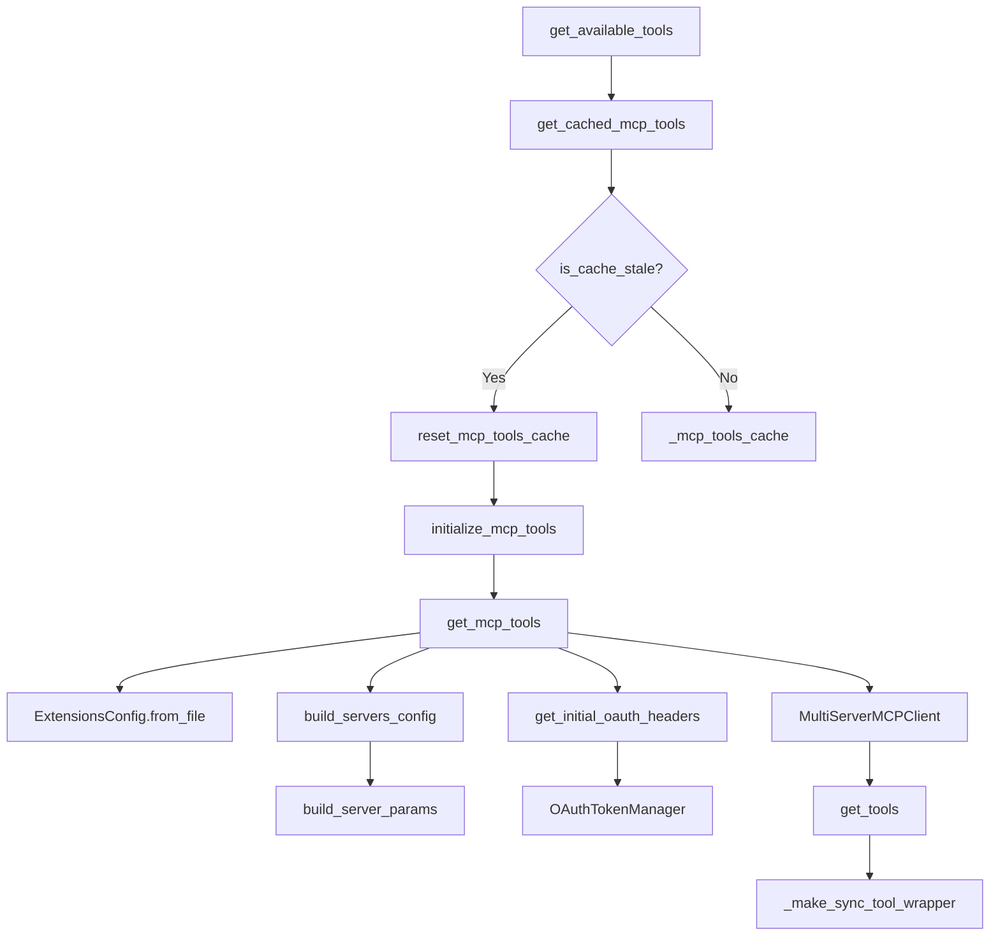
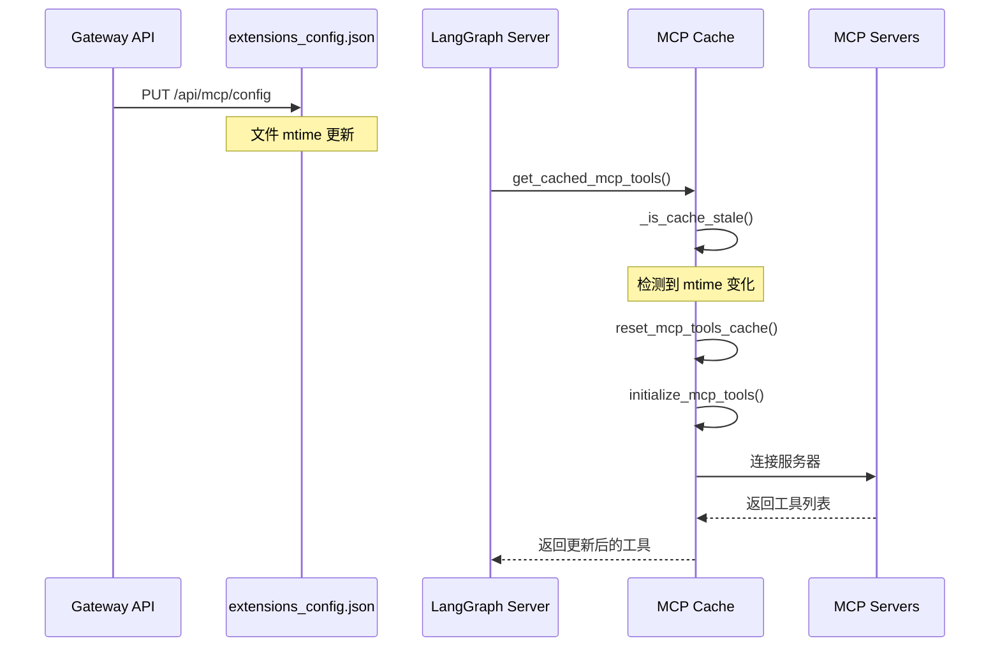

# 【06-MCP集成】MCP 集成系统深度解析

> **源码路径**: `backend/packages/harness/deerflow/mcp/`
> **核心文件**: 5个 Python 文件
> **依赖包**: `langchain-mcp-adapters>=0.1.0`

---

## 一、设计思想

### 1.1 MCP 协议概述

MCP (Model Context Protocol) 是 Anthropic 推出的开放协议，用于在 AI 应用和外部数据/工具之间建立标准化连接。DeerFlow 通过 `langchain-mcp-adapters` 库集成 MCP 支持，实现了：

- **多服务器管理**: 同时连接多个 MCP 服务器
- **传输协议支持**: stdio、SSE、HTTP 三种传输方式
- **OAuth 认证**: HTTP/SSE 传输的自动令牌刷新
- **工具自动发现**: 自动将 MCP 工具转换为 LangChain 工具
- **配置热更新**: 通过 mtime 检测实现配置变更自动生效

### 1.2 架构设计原则

```
┌─────────────────────────────────────────────────────────────────┐
│                        DeerFlow Agent                           │
│                   (LeadAgent + Tools)                           │
└───────────────────────────────┬─────────────────────────────────┘
                                │
                                ▼
┌─────────────────────────────────────────────────────────────────┐
│                    get_available_tools()                        │
│              (packages/harness/deerflow/tools/tools.py)         │
└───────────────────────────────┬─────────────────────────────────┘
                                │
                    ┌───────────┴───────────┐
                    ▼                       ▼
            ┌───────────────┐       ┌────────────────┐
            │  MCP Tools    │       │  Other Tools   │
            │   (cached)    │       │ (built-in/etc) │
            └───────┬───────┘       └────────────────┘
                    │
                    ▼
┌─────────────────────────────────────────────────────────────────┐
│                    get_cached_mcp_tools()                       │
│                   (mcp/cache.py)                                │
│  ┌─────────────────────────────────────────────────────────┐   │
│  │  Cache Invalidation via mtime                           │   │
│  │  ┌─────────────────────────────────────────────────┐    │   │
│  │  │ _is_cache_stale()                                │    │   │
│  │  │   - Tracks config file modification time        │    │   │
│  │  │   - Auto-reload on Gateway API changes          │    │   │
│  │  └─────────────────────────────────────────────────┘    │   │
│  └─────────────────────────────────────────────────────────┘   │
└───────────────────────────────┬─────────────────────────────────┘
                                │
                    ┌───────────┴───────────┐
                    ▼                       ▼
            ┌───────────────┐       ┌────────────────┐
            │  Lazy Init    │       │  OAuth Token   │
            │               │       │   Management   │
            │ initialize_   │       │ (auto-refresh) │
            │ mcp_tools()   │       │                │
            └───────┬───────┘       └────────┬───────┘
                    │                        │
                    └───────────┬────────────┘
                                ▼
┌─────────────────────────────────────────────────────────────────┐
│                  MultiServerMCPClient                           │
│                (langchain-mcp-adapters)                         │
│                                                                 │
│  ┌───────────────┐  ┌───────────────┐  ┌───────────────┐      │
│  │  stdio server │  │  SSE server   │  │  HTTP server  │      │
│  │  (command)    │  │  (url+oauth)  │  │  (url+oauth)  │      │
│  └───────────────┘  └───────────────┘  └───────────────┘      │
└─────────────────────────────────────────────────────────────────┘
```

### 1.3 核心设计决策

**为什么使用 langchain-mcp-adapters？**

1. **标准化工具接口**: MCP 工具自动转换为 LangChain `BaseTool`，与 DeerFlow 现有工具系统无缝集成
2. **多服务器抽象**: `MultiServerMCPClient` 统一管理多个 MCP 服务器的生命周期
3. **拦截器机制**: 支持工具调用拦截器，用于注入 OAuth 认证头

**为什么需要工具缓存？**

1. **启动性能**: MCP 工具发现需要连接所有服务器并握手，耗时较长
2. **资源节约**: 避免每次工具调用都重新连接服务器
3. **配置同步**: Gateway API 修改配置后，LangGraph 需要感知变更

**为什么需要同步包装器？**

DeerFlow 客户端使用同步流式接口 (`client.runs.stream()`)，但 MCP 工具是异步的。`_make_sync_tool_wrapper()` 通过线程池解决嵌套事件循环问题。

**为什么使用 mtime 检测？**

1. **进程间通信**: Gateway API 和 LangGraph Server 运行在不同进程
2. **无侵入性**: 不需要引入额外的消息队列或文件系统监听
3. **可靠性**: 文件修改时间是原子操作，不会丢失变更

---

## 二、模块架构

### 2.1 文件结构

```
deerflow/mcp/
├── __init__.py          # 模块导出
├── client.py            # 服务器参数构建
├── tools.py             # 工具加载与同步包装
├── oauth.py             # OAuth 令牌管理
└── cache.py             # 工具缓存与热更新
```

### 2.2 模块依赖图



### 2.3 数据流图



---

## 三、核心组件解析

### 3.1 配置系统 (client.py)

#### `build_server_params()` - 服务器参数构建

**源码位置**: `packages/harness/deerflow/mcp/client.py:11-42`

```python
def build_server_params(server_name: str, config: McpServerConfig) -> dict[str, Any]:
    """Build server parameters for MultiServerMCPClient.

    Args:
        server_name: Name of the MCP server.
        config: Configuration for the MCP server.

    Returns:
        Dictionary of server parameters for langchain-mcp-adapters.
    """
    transport_type = config.type or "stdio"
    params: dict[str, Any] = {"transport": transport_type}

    if transport_type == "stdio":
        if not config.command:
            raise ValueError(f"MCP server '{server_name}' with stdio transport requires 'command' field")
        params["command"] = config.command
        params["args"] = config.args
        # Add environment variables if present
        if config.env:
            params["env"] = config.env
    elif transport_type in ("sse", "http"):
        if not config.url:
            raise ValueError(f"MCP server '{server_name}' with {transport_type} transport requires 'url' field")
        params["url"] = config.url
        # Add headers if present
        if config.headers:
            params["headers"] = config.headers
    else:
        raise ValueError(f"MCP server '{server_name}' has unsupported transport type: {transport_type}")

    return params
```

**设计要点**:
1. **传输类型验证**: stdio 需要 `command`，SSE/HTTP 需要 `url`
2. **环境变量传递**: stdio 类型支持传递环境变量给子进程
3. **HTTP 头支持**: SSE/HTTP 类型支持自定义请求头

#### `build_servers_config()` - 批量构建配置

**源码位置**: `packages/harness/deerflow/mcp/client.py:45-68`

```python
def build_servers_config(extensions_config: ExtensionsConfig) -> dict[str, dict[str, Any]]:
    """Build servers configuration for MultiServerMCPClient.

    Args:
        extensions_config: Extensions configuration containing all MCP servers.

    Returns:
        Dictionary mapping server names to their parameters.
    """
    enabled_servers = extensions_config.get_enabled_mcp_servers()

    if not enabled_servers:
        logger.info("No enabled MCP servers found")
        return {}

    servers_config = {}
    for server_name, server_config in enabled_servers.items():
        try:
            servers_config[server_name] = build_server_params(server_name, server_config)
            logger.info(f"Configured MCP server: {server_name}")
        except Exception as e:
            logger.error(f"Failed to configure MCP server '{server_name}': {e}")

    return servers_config
```

**容错设计**: 单个服务器配置失败不影响其他服务器

### 3.2 OAuth 认证系统 (oauth.py)

#### `OAuthTokenManager` - 令牌管理器

**源码位置**: `packages/harness/deerflow/mcp/oauth.py:25-119`

```python
class OAuthTokenManager:
    """Acquire/cache/refresh OAuth tokens for MCP servers."""

    def __init__(self, oauth_by_server: dict[str, McpOAuthConfig]):
        self._oauth_by_server = oauth_by_server
        self._tokens: dict[str, _OAuthToken] = {}
        self._locks: dict[str, asyncio.Lock] = {name: asyncio.Lock() for name in oauth_by_server}
```

**关键特性**:
1. **令牌缓存**: 内存中缓存已获取的令牌
2. **双重检查锁定**: `asyncio.Lock` 防止并发刷新
3. **提前刷新**: 在令牌过期前 `refresh_skew_seconds` 秒刷新

#### 令牌获取流程

**源码位置**: `packages/harness/deerflow/mcp/oauth.py:47-65`

```python
async def get_authorization_header(self, server_name: str) -> str | None:
    oauth = self._oauth_by_server.get(server_name)
    if not oauth:
        return None

    token = self._tokens.get(server_name)
    if token and not self._is_expiring(token, oauth):
        return f"{token.token_type} {token.access_token}"

    lock = self._locks[server_name]
    async with lock:
        # Double-check after acquiring lock
        token = self._tokens.get(server_name)
        if token and not self._is_expiring(token, oauth):
            return f"{token.token_type} {token.access_token}"

        fresh = await self._fetch_token(oauth)
        self._tokens[server_name] = fresh
        logger.info(f"Refreshed OAuth access token for MCP server: {server_name}")
        return f"{fresh.token_type} {fresh.access_token}"
```

**设计解读**:
1. **快速路径**: 令牌未过期时直接返回
2. **双重检查**: 获取锁后再次检查，避免重复刷新
3. **日志记录**: 刷新操作记录日志便于调试

#### 工具拦截器

**源码位置**: `packages/harness/deerflow/mcp/oauth.py:122-137`

```python
def build_oauth_tool_interceptor(extensions_config: ExtensionsConfig) -> Any | None:
    """Build a tool interceptor that injects OAuth Authorization headers."""
    token_manager = OAuthTokenManager.from_extensions_config(extensions_config)
    if not token_manager.has_oauth_servers():
        return None

    async def oauth_interceptor(request: Any, handler: Any) -> Any:
        header = await token_manager.get_authorization_header(request.server_name)
        if not header:
            return await handler(request)

        updated_headers = dict(request.headers or {})
        updated_headers["Authorization"] = header
        return await handler(request.override(headers=updated_headers))

    return oauth_interceptor
```

**工作原理**: 拦截器在每个工具调用前注入 `Authorization` 头

### 3.3 工具加载系统 (tools.py)

#### 同步工具包装器

**源码位置**: `packages/harness/deerflow/mcp/tools.py:25-53`

```python
def _make_sync_tool_wrapper(coro: Callable[..., Any], tool_name: str) -> Callable[..., Any]:
    """Build a synchronous wrapper for an asynchronous tool coroutine.

    Args:
        coro: The tool's asynchronous coroutine.
        tool_name: Name of the tool (for logging).

    Returns:
        A synchronous function that correctly handles nested event loops.
    """

    def sync_wrapper(*args: Any, **kwargs: Any) -> Any:
        try:
            loop = asyncio.get_running_loop()
        except RuntimeError:
            loop = None

        try:
            if loop is not None and loop.is_running():
                # Use global executor to avoid nested loop issues and improve performance
                future = _SYNC_TOOL_EXECUTOR.submit(asyncio.run, coro(*args, **kwargs))
                return future.result()
            else:
                return asyncio.run(coro(*args, **kwargs))
        except Exception as e:
            logger.error(f"Error invoking MCP tool '{tool_name}' via sync wrapper: {e}", exc_info=True)
            raise

    return sync_wrapper
```

**为什么需要线程池？**

- `asyncio.run()` 在已运行的事件循环中会抛出 `RuntimeError`
- 线程池创建新线程，在新线程中运行 `asyncio.run()`
- 全局执行器 (`_SYNC_TOOL_EXECUTOR`) 避免为每个调用创建新线程

#### 工具加载主流程

**源码位置**: `packages/harness/deerflow/mcp/tools.py:56-113`

```python
async def get_mcp_tools() -> list[BaseTool]:
    """Get all tools from enabled MCP servers.

    Returns:
        List of LangChain tools from all enabled MCP servers.
    """
    try:
        from langchain_mcp_adapters.client import MultiServerMCPClient
    except ImportError:
        logger.warning("langchain-mcp-adapters not installed. Install it to enable MCP tools: pip install langchain-mcp-adapters")
        return []

    # NOTE: We use ExtensionsConfig.from_file() instead of get_extensions_config()
    # to always read the latest configuration from disk. This ensures that changes
    # made through the Gateway API (which runs in a separate process) are immediately
    # reflected when initializing MCP tools.
    extensions_config = ExtensionsConfig.from_file()
    servers_config = build_servers_config(extensions_config)

    if not servers_config:
        logger.info("No enabled MCP servers configured")
        return []

    try:
        # Create the multi-server MCP client
        logger.info(f"Initializing MCP client with {len(servers_config)} server(s)")

        # Inject initial OAuth headers for server connections (tool discovery/session init)
        initial_oauth_headers = await get_initial_oauth_headers(extensions_config)
        for server_name, auth_header in initial_oauth_headers.items():
            if server_name not in servers_config:
                continue
            if servers_config[server_name].get("transport") in ("sse", "http"):
                existing_headers = dict(servers_config[server_name].get("headers", {}))
                existing_headers["Authorization"] = auth_header
                servers_config[server_name]["headers"] = existing_headers

        tool_interceptors = []
        oauth_interceptor = build_oauth_tool_interceptor(extensions_config)
        if oauth_interceptor is not None:
            tool_interceptors.append(oauth_interceptor)

        client = MultiServerMCPClient(servers_config, tool_interceptors=tool_interceptors, tool_name_prefix=True)

        # Get all tools from all servers
        tools = await client.get_tools()
        logger.info(f"Successfully loaded {len(tools)} tool(s) from MCP servers")

        # Patch tools to support sync invocation, as deerflow client streams synchronously
        for tool in tools:
            if getattr(tool, "func", None) is None and getattr(tool, "coroutine", None) is not None:
                tool.func = _make_sync_tool_wrapper(tool.coroutine, tool.name)

        return tools

    except Exception as e:
        logger.error(f"Failed to load MCP tools: {e}", exc_info=True)
        return []
```

**关键注释解读**:
> We use ExtensionsConfig.from_file() instead of get_extensions_config()
> to always read the latest configuration from disk.

这确保了 Gateway API 进程修改配置后，LangGraph Server 进程能立即感知变更。

### 3.4 缓存与热更新 (cache.py)

#### 缓存失效检测

**源码位置**: `packages/harness/deerflow/mcp/cache.py:31-53`

```python
def _is_cache_stale() -> bool:
    """Check if the cache is stale due to config file changes.

    Returns:
        True if the cache should be invalidated, False otherwise.
    """
    global _config_mtime

    if not _cache_initialized:
        return False  # Not initialized yet, not stale

    current_mtime = _get_config_mtime()

    # If we couldn't get mtime before or now, assume not stale
    if _config_mtime is None or current_mtime is None:
        return False

    # If the config file has been modified since we cached, it's stale
    if current_mtime > _config_mtime:
        logger.info(f"MCP config file has been modified (mtime: {_config_mtime} -> {current_mtime}), cache is stale")
        return True

    return False
```

#### 懒加载初始化

**源码位置**: `packages/harness/deerflow/mcp/cache.py:82-126`

```python
def get_cached_mcp_tools() -> list[BaseTool]:
    """Get cached MCP tools with lazy initialization.

    If tools are not initialized, automatically initializes them.
    This ensures MCP tools work in both FastAPI and LangGraph Studio contexts.

    Also checks if the config file has been modified since last initialization,
    and re-initializes if needed. This ensures that changes made through the
    Gateway API (which runs in a separate process) are reflected in the
    LangGraph Server.

    Returns:
        List of cached MCP tools.
    """
    global _cache_initialized

    # Check if cache is stale due to config file changes
    if _is_cache_stale():
        logger.info("MCP cache is stale, resetting for re-initialization...")
        reset_mcp_tools_cache()

    if not _cache_initialized:
        logger.info("MCP tools not initialized, performing lazy initialization...")
        try:
            # Try to initialize in the current event loop
            loop = asyncio.get_event_loop()
            if loop.is_running():
                # If loop is already running (e.g., in LangGraph Studio),
                # we need to create a new loop in a thread
                import concurrent.futures

                with concurrent.futures.ThreadPoolExecutor() as executor:
                    future = executor.submit(asyncio.run, initialize_mcp_tools())
                    future.result()
            else:
                # If no loop is running, we can use the current loop loop
                loop.run_until_complete(initialize_mcp_tools())
        except RuntimeError:
            # No event loop exists, create one
            asyncio.run(initialize_mcp_tools())
        except Exception as e:
            logger.error(f"Failed to lazy-initialize MCP tools: {e}")
            return []

    return _mcp_tools_cache or []
```

**兼容性处理**:
1. **FastAPI 上下文**: 已有运行的事件循环
2. **LangGraph Studio**: 可能有运行中的循环
3. **无循环上下文**: 创建新循环

---

## 四、配置格式

### 4.1 extensions_config.json

```json
{
  "mcpServers": {
    "filesystem": {
      "enabled": true,
      "type": "stdio",
      "command": "npx",
      "args": ["-y", "@modelcontextprotocol/server-filesystem", "/mnt/data"],
      "description": "Local filesystem access"
    },
    "weather-api": {
      "enabled": true,
      "type": "sse",
      "url": "https://api.example.com/mcp/sse",
      "headers": {
        "X-API-Key": "$API_KEY"
      },
      "oauth": {
        "enabled": true,
        "token_url": "https://auth.example.com/oauth/token",
        "grant_type": "client_credentials",
        "client_id": "$OAUTH_CLIENT_ID",
        "client_secret": "$OAUTH_CLIENT_SECRET",
        "scope": "mcp:read"
      },
      "description": "Weather data via SSE"
    }
  },
  "skills": {
    "web-search": {
      "enabled": true
    }
  }
}
```

### 4.2 OAuth 配置详解

| 字段 | 类型 | 默认值 | 说明 |
|------|------|--------|------|
| `enabled` | bool | `true` | 是否启用 OAuth |
| `token_url` | string | 必填 | OAuth 令牌端点 URL |
| `grant_type` | string | `"client_credentials"` | 授权类型：`client_credentials` 或 `refresh_token` |
| `client_id` | string | 可选 | OAuth 客户端 ID |
| `client_secret` | string | 可选 | OAuth 客户端密钥 |
| `refresh_token` | string | 可选 | 刷新令牌 |
| `scope` | string | 可选 | OAuth 作用域 |
| `audience` | string | 可选 | 目标受众 |
| `token_field` | string | `"access_token"` | 响应中令牌字段名 |
| `token_type_field` | string | `"token_type"` | 响应中令牌类型字段名 |
| `expires_in_field` | string | `"expires_in"` | 响应中过期时间字段名 |
| `default_token_type` | string | `"Bearer"` | 默认令牌类型 |
| `refresh_skew_seconds` | int | `60` | 提前刷新时间（秒） |

---

## 五、可复用代码模板

### 5.1 MCP 服务器配置模板

```python
"""MCP server configuration template."""

from deerflow.config.extensions_config import McpServerConfig, McpOAuthConfig

def create_stdio_server(command: str, args: list[str], env: dict[str, str] | None = None) -> McpServerConfig:
    """Create a stdio-based MCP server configuration."""
    return McpServerConfig(
        enabled=True,
        type="stdio",
        command=command,
        args=args,
        env=env or {},
    )

def create_sse_server_with_oauth(
    url: str,
    token_url: str,
    client_id: str,
    client_secret: str,
    scope: str | None = None,
) -> McpServerConfig:
    """Create an SSE-based MCP server with OAuth authentication."""
    return McpServerConfig(
        enabled=True,
        type="sse",
        url=url,
        oauth=McpOAuthConfig(
            enabled=True,
            token_url=token_url,
            grant_type="client_credentials",
            client_id=client_id,
            client_secret=client_secret,
            scope=scope,
        ),
    )
```

### 5.2 同步工具包装器模板

```python
"""Sync wrapper template for async tools."""

import asyncio
import concurrent.futures
from typing import Any, Callable
from functools import wraps

# Global executor for sync wrapper
_SYNC_EXECUTOR = concurrent.futures.ThreadPoolExecutor(
    max_workers=10,
    thread_name_prefix="sync-tool",
)

def sync_wrapper(coro: Callable[..., Any], tool_name: str) -> Callable[..., Any]:
    """Wrap an async coroutine to be callable synchronously."""

    @wraps(coro)
    def wrapper(*args: Any, **kwargs: Any) -> Any:
        try:
            loop = asyncio.get_running_loop()
        except RuntimeError:
            loop = None

        if loop is not None and loop.is_running():
            future = _SYNC_EXECUTOR.submit(asyncio.run, coro(*args, **kwargs))
            return future.result()
        else:
            return asyncio.run(coro(*args, **kwargs))

    return wrapper
```

### 5.3 mtime 缓存失效模板

```python
"""mtime-based cache invalidation template."""

import os
from pathlib import Path
from typing import Any

class MtimeCache:
    """Cache that invalidates on file modification."""

    def __init__(self, config_path: Path):
        self.config_path = config_path
        self._cache: dict[str, Any] = {}
        self._mtime: float | None = None

    def get(self, key: str, loader: Callable[[], Any]) -> Any:
        """Get cached value, reload if stale."""
        if self._is_stale():
            self._reload(loader)
        return self._cache.get(key)

    def _is_stale(self) -> bool:
        """Check if cache is stale due to file modification."""
        if not self.config_path.exists():
            return False

        current_mtime = os.path.getmtime(self.config_path)
        if self._mtime is None:
            return False

        return current_mtime > self._mtime

    def _reload(self, loader: Callable[[], Any]) -> None:
        """Reload cache from source."""
        self._cache = loader()
        self._mtime = os.path.getmtime(self.config_path) if self.config_path.exists() else None
```

### 5.4 OAuth 双重检查锁定模板

```python
"""Double-checked locking pattern for token refresh."""

import asyncio
from dataclasses import dataclass
from datetime import UTC, datetime, timedelta

@dataclass
class Token:
    access_token: str
    expires_at: datetime

class TokenManager:
    """Token manager with double-checked locking."""

    def __init__(self):
        self._tokens: dict[str, Token] = {}
        self._locks: dict[str, asyncio.Lock] = {}

    async def get_token(self, key: str) -> str | None:
        """Get token, refresh if expiring soon."""
        token = self._tokens.get(key)
        if token and not self._is_expiring(token):
            return token.access_token

        lock = self._locks.setdefault(key, asyncio.Lock())
        async with lock:
            # Double-check after acquiring lock
            token = self._tokens.get(key)
            if token and not self._is_expiring(token):
                return token.access_token

            # Fetch new token
            new_token = await self._fetch_token(key)
            self._tokens[key] = new_token
            return new_token.access_token

    def _is_expiring(self, token: Token, skew: int = 60) -> bool:
        """Check if token is expiring within skew seconds."""
        return token.expires_at <= datetime.now(UTC) + timedelta(seconds=skew)
```

---

## 六、踩坑提醒

### 6.1 事件循环嵌套问题

**问题**: 在已运行的事件循环中调用 `asyncio.run()` 会抛出 `RuntimeError`

**原因**: MCP 工具是异步的，但 DeerFlow 客户端使用同步流式接口

**解决方案**: 使用线程池执行器在新线程中运行 `asyncio.run()`

```python
# 错误做法
def sync_wrapper(*args, **kwargs):
    return asyncio.run(coro(*args, **kwargs))  # RuntimeError if loop is running

# 正确做法
_SYNC_EXECUTOR = concurrent.futures.ThreadPoolExecutor(max_workers=10)

def sync_wrapper(*args, **kwargs):
    loop = asyncio.get_running_loop()  # May raise RuntimeError
    if loop is not None and loop.is_running():
        future = _SYNC_EXECUTOR.submit(asyncio.run, coro(*args, **kwargs))
        return future.result()
    else:
        return asyncio.run(coro(*args, **kwargs))
```

### 6.2 配置更新感知延迟

**问题**: Gateway API 更新配置后，LangGraph Server 不会立即感知

**原因**: 不同进程间无法共享内存状态

**解决方案**: 使用 mtime 检测实现跨进程通信

```python
# Gateway API 进程
# 保存配置时，文件 mtime 自动更新

# LangGraph Server 进程
def get_cached_tools():
    if _is_cache_stale():  # 检测 mtime 变化
        reset_cache()
        initialize_tools()
    return _cache
```

### 6.3 OAuth 令牌并发刷新

**问题**: 多个请求同时发现令牌过期，导致重复刷新

**解决方案**: 双重检查锁定模式

```python
async def get_token():
    token = self._tokens.get(key)
    if token and not self._is_expiring(token):
        return token  # Fast path

    async with self._locks[key]:  # Acquire lock
        # Double-check after acquiring lock
        token = self._tokens.get(key)
        if token and not self._is_expiring(token):
            return token  # Another thread refreshed it

        return await self._fetch_token()  # Only one thread enters
```

### 6.4 stdio 服务器环境变量

**问题**: stdio 类型的 MCP 服务器需要环境变量，但不会自动继承

**解决方案**: 在 `build_server_params()` 中显式传递 `env` 参数

```python
if config.env:
    params["env"] = config.env  # 必须显式传递
```

### 6.5 工具名称前缀冲突

**问题**: 多个 MCP 服务器可能提供同名工具

**解决方案**: 使用 `tool_name_prefix=True` 自动添加服务器名前缀

```python
client = MultiServerMCPClient(
    servers_config,
    tool_interceptors=tool_interceptors,
    tool_name_prefix=True,  # 启用前缀: "server_name__tool_name"
)
```

---

## 七、源码覆盖清单

### 已覆盖文件 (5/5)

| 文件 | 覆盖内容 |
|------|----------|
| `__init__.py` | 模块导出 |
| `client.py` | 服务器参数构建、批量配置 |
| `tools.py` | 工具加载、同步包装、OAuth 头注入 |
| `oauth.py` | 令牌管理、刷新、拦截器 |
| `cache.py` | 缓存、热更新、懒加载 |

---

## 八、术语表

| 术语 | 全称 | 说明 |
|------|------|------|
| MCP | Model Context Protocol | Anthropic 推出的 AI 上下文协议 |
| SSE | Server-Sent Events | 单向 HTTP 流式传输 |
| OAuth | Open Authorization | 开放授权标准 |
| mtime | Modification Time | 文件修改时间 |
| Double-checked locking | 双重检查锁定 | 并发编程优化模式 |

---

## 九、相关文档

- [MCP 官方文档](https://modelcontextprotocol.io/)
- [langchain-mcp-adapters](https://github.com/langchain-ai/langchain-mcp-adapters)
- `docs/ARCHITECTURE.md` - DeerFlow 整体架构
- `docs/API.md` - Gateway API MCP 配置端点

---

**文档版本**: v1.0
**生成时间**: 2026-04-01
**作者**: doc-writer @ deer-flow-docs
