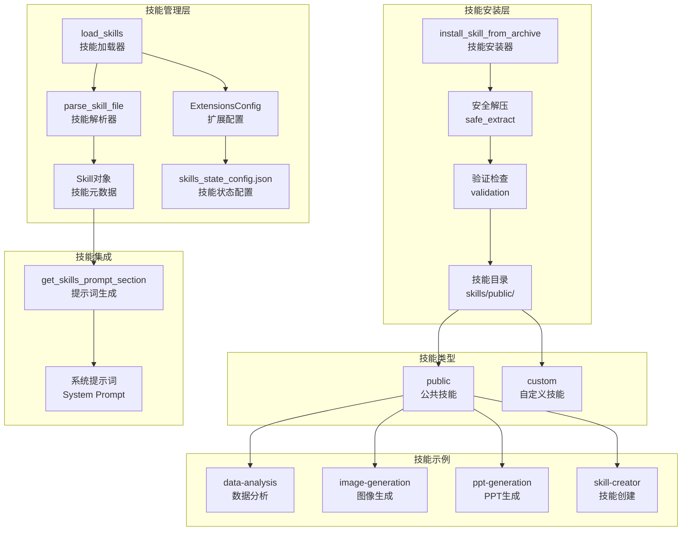

# 【文档编号+模块名】06-技能系统详解

## 1. 模块全局定位

- **所属项目**: deer-flow
- **层级位置**: backend/packages/harness/deerflow/skills
- **核心作用**: 技能系统，提供可插拔的AI功能包管理，支持技能的加载、解析、安装、验证
- **业务价值**: 通过技能包扩展代理能力，实现功能的模块化和社区共享

## 2. 依赖&调用链路 Mermaid图



## 3. 核心目录/文件清单

| 文件 | 绝对路径 | 职责描述 |
|------|---------|---------|
| loader.py | /backend/packages/harness/deerflow/skills/loader.py | 技能加载器，扫描和加载技能 |
| installer.py | /backend/packages/harness/deerflow/skills/installer.py | 技能安装器，处理技能包安装 |
| parser.py | /backend/packages/harness/deerflow/skills/parser.py | 技能解析器，解析SKILL.md文件 |
| validation.py | /backend/packages/harness/deerflow/skills/validation.py | 技能验证器，验证技能完整性 |
| types.py | /backend/packages/harness/deerflow/skills/types.py | 技能类型定义 |

## 4. 关键源码深度解析

### 4.1 技能加载器

#### 文件路径: `/backend/packages/harness/deerflow/skills/loader.py`

```python
"""技能加载器 - 扫描和加载技能目录"""

import logging
import os
from pathlib import Path

from .parser import parse_skill_file
from .types import Skill

logger = logging.getLogger(__name__)

def get_skills_root_path() -> Path:
    """获取技能目录的根路径

    Returns:
        技能目录路径（deer-flow/skills）
    """
    # loader.py位于packages/harness/deerflow/skills/loader.py — 向上5级到达backend/
    backend_dir = Path(__file__).resolve().parent.parent.parent.parent.parent
    # skills目录是backend目录的兄弟目录
    skills_dir = backend_dir.parent / "skills"
    return skills_dir


def load_skills(
    skills_path: Path | None = None,
    use_config: bool = True,
    enabled_only: bool = False
) -> list[Skill]:
    """从技能目录加载所有技能

    扫描public和custom技能目录，解析SKILL.md文件提取元数据。
    启用状态由skills_state_config.json文件确定。

    Args:
        skills_path: 可选的自定义技能目录路径
                     如果未提供且use_config为True，使用配置中的路径
                     否则默认为deer-flow/skills
        use_config: 是否从配置加载技能路径（默认True）
        enabled_only: 如果为True，仅返回启用的技能（默认False）

    Returns:
        技能对象列表，按名称排序
    """
    # 确定技能路径
    if skills_path is None:
        if use_config:
            try:
                from deerflow.config import get_app_config
                config = get_app_config()
                skills_path = config.skills.get_skills_path()
            except Exception:
                # 配置失败时回退到默认值
                skills_path = get_skills_root_path()
        else:
            skills_path = get_skills_root_path()

    if not skills_path.exists():
        return []

    skills = []

    # 扫描public和custom目录
    for category in ["public", "custom"]:
        category_path = skills_path / category
        if not category_path.exists() or not category_path.is_dir():
            continue

        for current_root, dir_names, file_names in os.walk(category_path, followlinks=True):
            # 保持遍历确定性并跳过隐藏目录
            dir_names[:] = sorted(name for name in dir_names if not name.startswith("."))
            if "SKILL.md" not in file_names:
                continue

            skill_file = Path(current_root) / "SKILL.md"
            relative_path = skill_file.parent.relative_to(category_path)

            skill = parse_skill_file(skill_file, category=category, relative_path=relative_path)
            if skill:
                skills.append(skill)

    # 加载技能状态配置并更新启用状态
    # 注意：使用ExtensionsConfig.from_file()而不是get_extensions_config()
    # 以始终从磁盘读取最新配置。这确保通过Gateway API所做的更改
    # 在LangGraph Server加载技能时立即反映。
    try:
        from deerflow.config.extensions_config import ExtensionsConfig
        extensions_config = ExtensionsConfig.from_file()
        for skill in skills:
            skill.enabled = extensions_config.is_skill_enabled(skill.name, skill.category)
    except Exception as e:
        # 配置加载失败时默认全部启用
        logger.warning("Failed to load extensions config: %s", e)

    # 如果请求，按启用状态过滤
    if enabled_only:
        skills = [skill for skill in skills if skill.enabled]

    # 按名称排序以保持一致顺序
    skills.sort(key=lambda s: s.name)

    return skills
```

**解读**:
- **目录扫描**: 递归扫描public和custom技能目录
- **SKILL.md解析**: 每个技能通过SKILL.md定义元数据
- **状态管理**: 通过extensions_config管理技能启用状态
- **配置热更新**: 始终从磁盘读取最新配置
- **确定性排序**: 按名称排序保证一致性

### 4.2 技能安装器

#### 文件路径: `/backend/packages/harness/deerflow/skills/installer.py`

```python
"""共享技能归档安装逻辑

纯业务逻辑 — 无FastAPI/HTTP依赖。
Gateway和Client都委托给这些函数。
"""

import logging
import posixpath
import shutil
import stat
import tempfile
import zipfile
from pathlib import Path, PurePosixPath, PureWindowsPath

from deerflow.skills.loader import get_skills_root_path
from deerflow.skills.validation import _validate_skill_frontmatter

logger = logging.getLogger(__name__)


class SkillAlreadyExistsError(ValueError):
    """当同名技能已安装时抛出"""


def is_unsafe_zip_member(info: zipfile.ZipInfo) -> bool:
    """如果zip成员路径是绝对路径或尝试目录遍历则返回True"""
    name = info.filename
    if not name:
        return False
    normalized = name.replace("\\", "/")
    if normalized.startswith("/"):
        return True
    path = PurePosixPath(normalized)
    if path.is_absolute():
        return True
    if PureWindowsPath(name).is_absolute():
        return True
    if ".." in path.parts:
        return True
    return False


def is_symlink_member(info: zipfile.ZipInfo) -> bool:
    """基于ZipInfo中存储的外部属性检测符号链接"""
    mode = info.external_attr >> 16
    return stat.S_ISLNK(mode)


def safe_extract_skill_archive(
    zip_ref: zipfile.ZipFile,
    dest_path: Path,
    max_total_size: int = 512 * 1024 * 1024,
) -> None:
    """安全解压技能归档，带安全保护

    保护措施：
    - 拒绝对对路径和目录遍历（..）
    - 跳过符号链接条目而不是实现它们
    - 强制执行未压缩总大小的硬限制（zip炸弹防御）

    Raises:
        ValueError: 如果成员不安全或超过大小限制
    """
    dest_root = dest_path.resolve()
    total_written = 0

    for info in zip_ref.infolist():
        if is_unsafe_zip_member(info):
            raise ValueError(f"归档包含不安全的成员路径：{info.filename!r}")

        if is_symlink_member(info):
            logger.warning("跳过技能归档中的符号链接条目：%s", info.filename)
            continue

        normalized_name = posixpath.normpath(info.filename.replace("\\", "/"))
        member_path = dest_root.joinpath(*PurePosixPath(normalized_name).parts)

        # 防止目录遍历
        if not str(member_path).startswith(str(dest_root)):
            raise ValueError(f"拒绝目录遍历尝试：{info.filename}")

        # 检查大小限制
        total_written += info.file_size
        if total_written > max_total_size:
            raise ValueError(f"归档超过大小限制：{total_written} > {max_total_size}")

        # 提取文件
        zip_ref.extract(info, dest_path)


async def install_skill_from_archive(
    archive_path: Path,
    skills_root: Path | None = None,
    category: str = "custom",
    overwrite: bool = False,
) -> str:
    """从归档文件安装技能

    Args:
        archive_path: 技能归档文件路径（.zip）
        skills_root: 技能根目录，默认为deer-flow/skills
        category: 技能类别（public或custom）
        overwrite: 是否覆盖现有技能

    Returns:
        安装的技能名称

    Raises:
        SkillAlreadyExistsError: 技能已存在且overwrite=False
        ValueError: 归档无效或验证失败
    """
    if skills_root is None:
        skills_root = get_skills_root_path()

    # 检查技能是否已存在
    with zipfile.ZipFile(archive_path) as zip_ref:
        # 查找SKILL.md
        skill_info = None
        for info in zip_ref.infolist():
            if info.filename.endswith("SKILL.md"):
                # 读取技能元数据
                with zip_ref.open(info) as f:
                    content = f.read().decode("utf-8")
                    # 解析frontmatter获取技能名称
                    # ...
                break

        if skill_info and not overwrite:
            skill_dir = skills_root / category / skill_info.name
            if skill_dir.exists():
                raise SkillAlreadyExistsError(f"技能 '{skill_info.name}' 已存在")

    # 解压到临时目录
    with tempfile.TemporaryDirectory() as temp_dir:
        temp_path = Path(temp_dir)

        with zipfile.ZipFile(archive_path) as zip_ref:
            safe_extract_skill_archive(zip_ref, temp_path)

        # 验证技能
        skill_dir = resolve_skill_dir_from_archive(temp_path)
        _validate_skill_frontmatter(skill_dir / "SKILL.md")

        # 移动到目标位置
        target_dir = skills_root / category
        target_dir.mkdir(parents=True, exist_ok=True)

        final_path = target_dir / skill_dir.name
        if overwrite:
            shutil.rmtree(final_path, ignore_errors=True)

        shutil.move(str(skill_dir), str(final_path))

    return final_path.name
```

**解读**:
- **安全解压**: 防止路径遍历和zip炸弹攻击
- **符号链接处理**: 跳过符号链接避免安全风险
- **大小限制**: 防止解压过大文件
- **验证检查**: 安装前验证技能完整性
- **覆盖控制**: 支持安全覆盖现有技能

### 4.3 技能解析器

#### 文件路径: `/backend/packages/harness/deerflow/skills/parser.py`

```python
"""技能解析器 - 解析SKILL.md文件"""

import re
from pathlib import Path
from typing import Any

from .types import Skill

# Frontmatter正则表达式
FRONTMATTER_PATTERN = re.compile(r"^---\n(.*?)\n---\n(.*)$", re.DOTALL)


def parse_skill_file(
    skill_file: Path,
    category: str = "public",
    relative_path: Path | None = None
) -> Skill | None:
    """解析SKILL.md文件

    Args:
        skill_file: SKILL.md文件路径
        category: 技能类别（public或custom）
        relative_path: 相对于技能根目录的路径

    Returns:
        技能对象，解析失败时返回None
    """
    try:
        content = skill_file.read_text(encoding="utf-8")
    except Exception:
        return None

    # 解析frontmatter
    match = FRONTMATTER_PATTERN.match(content)
    if not match:
        return None

    frontmatter_text, body = match.groups()

    # 解析frontmatter
    frontmatter = _parse_yaml_frontmatter(frontmatter_text)
    if not frontmatter:
        return None

    # 提取必需字段
    name = frontmatter.get("name")
    if not name:
        return None

    description = frontmatter.get("description", "")
    version = frontmatter.get("version", "1.0.0")
    author = frontmatter.get("author", "")
    tags = frontmatter.get("tags", [])

    # 创建技能对象
    return Skill(
        name=name,
        description=description,
        version=version,
        author=author,
        category=category,
        path=skill_file.parent,
        relative_path=relative_path or Path(name),
        tags=tags,
        enabled=True,
    )


def _parse_yaml_frontmatter(text: str) -> dict[str, Any] | None:
    """解析YAML frontmatter"""
    try:
        import yaml
        return yaml.safe_load(text)
    except Exception:
        return None
```

**解读**:
- **Frontmatter解析**: 支持YAML格式的元数据
- **必需字段验证**: 检查必需的技能名称
- **默认值处理**: 为可选字段提供默认值
- **错误容忍**: 解析失败时返回None而非抛出异常

## 5. 底层设计思想

### 5.1 技能包结构

```
skill-name/
├── SKILL.md              # 技能定义文件（必需）
├── skill.json            # 技能配置文件（可选）
├── scripts/              # 技能脚本
│   └── generate.py
├── templates/            # 提示词模板
│   └── template.txt
├── references/           # 参考文档
│   └── guide.md
└── assets/              # 资源文件
    └── icon.png
```

### 5.2 SKILL.md格式

```markdown
---
name: data-analysis
description: 数据分析技能，支持CSV、JSON等格式数据处理
version: 1.0.0
author: DeerFlow Team
tags: [data, analysis, csv]
---

# 数据分析技能

此技能提供强大的数据分析能力...

## 功能特性

- CSV文件解析
- 数据统计分析
- 可视化图表生成

## 使用方法

在对话中描述您的数据分析需求...
```

### 5.3 设计原则

1. **约定优于配置**: 通过SKILL.md约定定义技能
2. **安全第一**: 安装过程多重安全检查
3. **可扩展性**: 支持公共和自定义技能
4. **状态管理**: 集中管理技能启用状态
5. **社区友好**: 易于分享和分发

## 6. 必学核心知识点

### 6.1 技能类型

| 类型 | 路径 | 描述 |
|------|------|------|
| public | skills/public/ | 官方维护的公共技能 |
| custom | skills/custom/ | 用户自定义技能 |

### 6.2 技能元数据

| 字段 | 类型 | 描述 | 必需 |
|------|------|------|------|
| name | str | 技能名称 | 是 |
| description | str | 技能描述 | 是 |
| version | str | 版本号 | 否 |
| author | str | 作者 | 否 |
| tags | list[str] | 标签 | 否 |

### 6.3 安全考虑

1. **路径验证**: 防止目录遍历攻击
2. **大小限制**: 防止zip炸弹
3. **符号链接**: 跳过符号链接避免安全风险
4. **权限检查**: 安装前验证权限
5. **内容验证**: 验证SKILL.md格式

## 7. 可直接拷贝复用代码片段

### 7.1 创建技能模板

```markdown
---
name: my-custom-skill
description: 我的自定义技能
version: 1.0.0
author: Your Name
tags: [custom, example]
---

# 技能名称

简短描述技能的功能...

## 功能特性

- 特性1
- 特性2

## 使用方法

描述如何使用此技能...
```

### 7.2 技能加载代码

```python
from deerflow.skills import load_skills

# 加载所有技能
skills = load_skills()

# 仅加载启用的技能
enabled_skills = load_skills(enabled_only=True)

# 从自定义路径加载
skills = load_skills(skills_path=Path("/path/to/skills"))
```

### 7.3 技能安装代码

```python
from deerflow.skills.installer import install_skill_from_archive
from pathlib import Path

# 安装技能包
try:
    skill_name = await install_skill_from_archive(
        archive_path=Path("my-skill.zip"),
        category="custom",
        overwrite=False
    )
    print(f"技能 '{skill_name}' 安装成功")
except Exception as e:
    print(f"安装失败：{e}")
```

## 8. 踩坑提醒 & 二次开发建议

### 8.1 常见问题

1. **SKILL.md格式错误**: YAML格式不正确导致解析失败
2. **路径问题**: 相对路径和绝对路径混用导致错误
3. **权限不足**: 安装目录无写权限
4. **编码问题**: 文件编码不是UTF-8
5. **配置缓存**: 技能状态未及时更新

### 8.2 调试技巧

1. **技能列表查看**:
```python
from deerflow.skills import load_skills

skills = load_skills()
for skill in skills:
    print(f"{skill.name}: {skill.description} (enabled: {skill.enabled})")
```

2. **技能验证**:
```python
from deerflow.skills.validation import validate_skill

errors = validate_skill(Path("/path/to/skill"))
if errors:
    print("验证失败：", errors)
```

3. **配置检查**:
```python
from deerflow.config.extensions_config import ExtensionsConfig

config = ExtensionsConfig.from_file()
print("启用的技能：", config.enabled_skills)
```

### 8.3 二次开发方向

1. **技能市场**: 创建技能分享和下载平台
2. **技能版本管理**: 支持技能版本控制和升级
3. **技能依赖管理**: 处理技能间的依赖关系
4. **技能测试**: 自动化技能测试框架
5. **技能文档生成**: 自动生成技能使用文档

## 9. 文档衔接

本篇完结，下一篇将解析：【07-沙箱执行系统】

---

## 附录：内置技能列表

| 技能名 | 描述 | 类别 |
|--------|------|------|
| bootstrap | 项目初始化技能 | public |
| chart-visualization | 图表可视化生成 | public |
| data-analysis | 数据分析 | public |
| deep-research | 深度研究 | public |
| image-generation | 图像生成 | public |
| podcast-generation | 播客内容生成 | public |
| ppt-generation | PPT生成 | public |
| skill-creator | 技能创建工具 | public |
| video-generation | 视频生成 | public |
| web-design-guidelines | 网页设计指南 | public |
