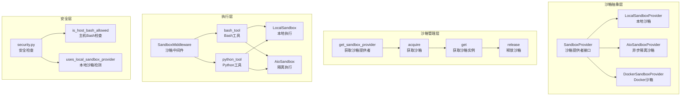
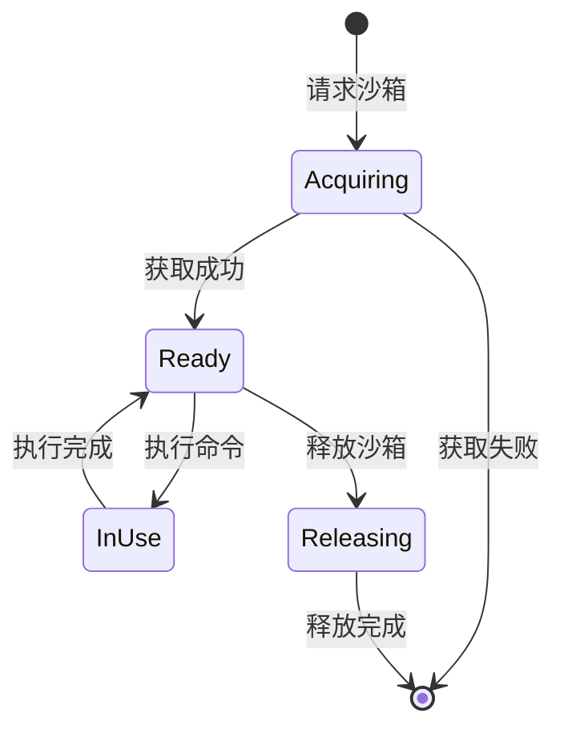

# 【文档编号+模块名】07-沙箱执行系统

## 1. 模块全局定位

- **所属项目**: deer-flow
- **层级位置**: backend/packages/harness/deerflow/sandbox
- **核心作用**: 沙箱执行系统，提供安全的代码执行环境，支持本地和Docker隔离
- **业务价值**: 隔离不可信代码执行，保护主机系统安全，支持Bash命令和Python代码执行

## 2. 依赖&调用链路 Mermaid图



## 3. 核心目录/文件清单

| 文件 | 绝对路径 | 职责描述 |
|------|---------|---------|
| sandbox_provider.py | /backend/packages/harness/deerflow/sandbox/sandbox_provider.py | 沙箱提供者抽象 |
| sandbox.py | /backend/packages/harness/deerflow/sandbox/sandbox.py | 沙箱环境定义 |
| middleware.py | /backend/packages/harness/deerflow/sandbox/middleware.py | 沙箱中间件 |
| security.py | /backend/packages/harness/deerflow/sandbox/security.py | 安全检查工具 |
| tools.py | /backend/packages/harness/deerflow/sandbox/tools.py | 沙箱工具定义 |
| exceptions.py | /backend/packages/harness/deerflow/sandbox/exceptions.py | 沙箱异常定义 |
| local/ | /backend/packages/harness/deerflow/sandbox/local/ | 本地沙箱实现 |

## 4. 关键源码深度解析

### 4.1 沙箱提供者抽象

#### 文件路径: `/backend/packages/harness/deerflow/sandbox/sandbox_provider.py`

```python
"""沙箱提供者抽象"""

from abc import ABC, abstractmethod

from deerflow.config import get_app_config
from deerflow.reflection import resolve_class
from deerflow.sandbox.sandbox import Sandbox


class SandboxProvider(ABC):
    """沙箱提供者抽象基类"""

    @abstractmethod
    def acquire(self, thread_id: str | None = None) -> str:
        """获取沙箱环境并返回其ID

        Returns:
            获取的沙箱环境的ID
        """
        pass

    @abstractmethod
    def get(self, sandbox_id: str) -> Sandbox | None:
        """按ID获取沙箱环境

        Args:
            sandbox_id: 要获取的沙箱环境ID
        """
        pass

    @abstractmethod
    def release(self, sandbox_id: str) -> None:
        """释放沙箱环境

        Args:
            sandbox_id: 要销毁的沙箱环境ID
        """
        pass


_default_sandbox_provider: SandboxProvider | None = None


def get_sandbox_provider(**kwargs) -> SandboxProvider:
    """获取沙箱提供者单例

    返回缓存的单例实例。使用`reset_sandbox_provider()`清除缓存，
    或`shutdown_sandbox_provider()`正确关闭并清除。

    Returns:
        沙箱提供者实例
    """
    global _default_sandbox_provider
    if _default_sandbox_provider is None:
        config = get_app_config()
        cls = resolve_class(config.sandbox.use, SandboxProvider)
        _default_sandbox_provider = cls(**kwargs)
    return _default_sandbox_provider


def shutdown_sandbox_provider() -> None:
    """关闭并重置沙箱提供者

    这将正确关闭提供者（释放所有沙箱）然后清除单例。
    在应用程序关闭时或需要完全重置沙箱系统时调用。
    """
    global _default_sandbox_provider
    if _default_sandbox_provider is not None:
        if hasattr(_default_sandbox_provider, "shutdown"):
            _default_sandbox_provider.shutdown()
        _default_sandbox_provider = None
```

**解读**:
- **抽象接口**: 定义沙箱提供者的标准接口
- **单例模式**: 全局共享一个沙箱提供者实例
- **动态加载**: 通过配置动态加载沙箱实现
- **资源管理**: acquire/release管理沙箱生命周期
- **优雅关闭**: shutdown确保资源正确释放

### 4.2 安全检查工具

#### 文件路径: `/backend/packages/harness/deerflow/sandbox/security.py`

```python
"""沙箱能力门控的安全助手"""

from deerflow.config import get_app_config

_LOCAL_SANDBOX_PROVIDER_MARKERS = (
    "deerflow.sandbox.local:LocalSandboxProvider",
    "deerflow.sandbox.local.local_sandbox_provider:LocalSandboxProvider",
)

LOCAL_HOST_BASH_DISABLED_MESSAGE = (
    "LocalSandboxProvider禁用主机bash执行，因为它不是安全的沙箱边界。"
    "切换到AioSandboxProvider以获得隔离的bash访问权限，"
    "或仅在完全受信任的本地环境中设置sandbox.allow_host_bash: true。"
)

LOCAL_BASH_SUBAGENT_DISABLED_MESSAGE = (
    "LocalSandboxProvider禁用Bash子代理，因为主机bash执行不是安全的沙箱边界。"
    "切换到AioSandboxProvider以获得隔离的bash访问权限，"
    "或仅在完全受信任的本地环境中设置sandbox.allow_host_bash: true。"
)


def uses_local_sandbox_provider(config=None) -> bool:
    """当活动沙箱提供者是主机本地提供者时返回True"""
    if config is None:
        config = get_app_config()

    sandbox_cfg = getattr(config, "sandbox", None)
    sandbox_use = getattr(sandbox_cfg, "use", "")
    if sandbox_use in _LOCAL_SANDBOX_PROVIDER_MARKERS:
        return True
    return sandbox_use.endswith(":LocalSandboxProvider") and "deerflow.sandbox.local" in sandbox_use


def is_host_bash_allowed(config=None) -> bool:
    """返回是否显式允许主机bash执行"""
    if config is None:
        config = get_app_config()

    sandbox_cfg = getattr(config, "sandbox", None)
    if sandbox_cfg is None:
        return True
    if not uses_local_sandbox_provider(config):
        return True
    return bool(getattr(sandbox_cfg, "allow_host_bash", False))
```

**解读**:
- **本地检测**: 识别是否使用本地沙箱
- **安全门控**: 本地沙箱默认禁用危险操作
- **配置驱动**: 通过配置控制安全策略
- **清晰提示**: 提供明确的安全警告消息

### 4.3 沙箱中间件

#### 文件路径: `/backend/packages/harness/deerflow/sandbox/middleware.py`

```python
"""沙箱中间件 - 管理沙箱环境生命周期"""

import logging
from typing import Any, override

from langchain.agents import AgentState
from langchain.agents.middleware import AgentMiddleware
from langgraph.runtime import Runtime

from deerflow.sandbox.sandbox_provider import get_sandbox_provider

logger = logging.getLogger(__name__)


class SandboxMiddleware(AgentMiddleware[AgentState]):
    """管理代理执行的沙箱环境

    此中间件：
    1. 在代理执行前获取沙箱环境
    2. 将沙箱ID注入状态
    3. 在代理执行后释放沙箱环境
    """

    def __init__(self, lazy_init: bool = False):
        """初始化沙箱中间件

        Args:
            lazy_init: 如果为True，延迟沙箱获取到首次使用
        """
        super().__init__()
        self.lazy_init = lazy_init

    @override
    def before_agent(self, state: AgentState, runtime: Runtime) -> dict | None:
        """代理执行前获取沙箱"""
        if self.lazy_init:
            # 延迟初始化：沙箱将在首次使用时获取
            return {"sandbox": {"lazy": True}}

        # 立即获取沙箱
        thread_id = runtime.context.get("thread_id") if runtime.context else None
        provider = get_sandbox_provider()
        sandbox_id = provider.acquire(thread_id=thread_id)

        logger.info(f"获取沙箱：{sandbox_id}（线程：{thread_id}）")
        return {"sandbox": {"id": sandbox_id}}

    @override
    def after_agent(self, state: AgentState, runtime: Runtime) -> dict | None:
        """代理执行后释放沙箱"""
        sandbox_data = state.get("sandbox", {})
        sandbox_id = sandbox_data.get("id")

        if not sandbox_id:
            # 延迟初始化或未使用沙箱
            return None

        provider = get_sandbox_provider()
        provider.release(sandbox_id)

        logger.info(f"释放沙箱：{sandbox_id}")
        return None
```

**解读**:
- **生命周期管理**: 自动管理沙箱的获取和释放
- **延迟初始化**: 支持按需创建沙箱
- **线程隔离**: 每个线程使用独立沙箱
- **状态注入**: 将沙箱ID注入代理状态
- **自动清理**: 确保沙箱资源正确释放

## 5. 底层设计思想

### 5.1 沙箱类型对比

| 特性 | LocalSandbox | AioSandbox | DockerSandbox |
|------|-------------|------------|---------------|
| 隔离级别 | 进程级 | 进程级 | 容器级 |
| 性能 | 高 | 中 | 低 |
| 安全性 | 低 | 中 | 高 |
| 资源开销 | 低 | 中 | 高 |
| 使用场景 | 受信任环境 | 一般环境 | 不受信任环境 |

### 5.2 沙箱生命周期



### 5.3 安全原则

1. **最小权限**: 沙箱内仅授予必要权限
2. **隔离性**: 沙箱与主机隔离
3. **可审计**: 记录所有沙箱操作
4. **资源限制**: 限制沙箱资源使用
5. **超时控制**: 防止无限执行

## 6. 必学核心知识点

### 6.1 技术点

1. **进程隔离**: 使用独立进程执行代码
2. **资源限制**: 限制CPU、内存、磁盘使用
3. **超时控制**: 防止代码无限运行
4. **权限控制**: 限制文件系统访问
5. **网络隔离**: 控制网络访问

### 6.2 沙箱配置

```yaml
sandbox:
  use: deerflow.sandbox.local:LocalSandboxProvider
  allow_host_bash: false  # 本地沙箱禁用主机bash
  timeout: 30  # 命令执行超时（秒）
  max_memory: "512M"  # 最大内存
  max_cpu: 1  # 最大CPU核心数
```

### 6.3 工程设计点

1. **提供者模式**: 支持多种沙箱实现
2. **单例管理**: 全局共享沙箱提供者
3. **延迟初始化**: 按需创建沙箱
4. **自动清理**: 确保资源释放
5. **安全默认**: 默认配置最安全

## 7. 可直接拷贝复用代码片段

### 7.1 自定义沙箱提供者

```python
from deerflow.sandbox.sandbox_provider import SandboxProvider
from deerflow.sandbox.sandbox import Sandbox

class CustomSandboxProvider(SandboxProvider):
    """自定义沙箱提供者"""

    def __init__(self, timeout: int = 30):
        self.timeout = timeout
        self._sandboxes: dict[str, Sandbox] = {}

    def acquire(self, thread_id: str | None = None) -> str:
        """获取新沙箱"""
        sandbox_id = f"sandbox_{thread_id or 'default'}"
        # 创建沙箱逻辑
        self._sandboxes[sandbox_id] = Sandbox(id=sandbox_id)
        return sandbox_id

    def get(self, sandbox_id: str) -> Sandbox | None:
        """获取沙箱实例"""
        return self._sandboxes.get(sandbox_id)

    def release(self, sandbox_id: str) -> None:
        """释放沙箱"""
        if sandbox_id in self._sandboxes:
            # 清理逻辑
            del self._sandboxes[sandbox_id]
```

### 7.2 安全执行命令

```python
import asyncio
from deerflow.sandbox.sandbox_provider import get_sandbox_provider

async def safe_execute(command: str, thread_id: str) -> str:
    """安全执行命令"""
    provider = get_sandbox_provider()
    sandbox_id = provider.acquire(thread_id=thread_id)
    try:
        sandbox = provider.get(sandbox_id)
        result = await sandbox.execute(command, timeout=30)
        return result
    finally:
        provider.release(sandbox_id)
```

### 7.3 沙箱中间件集成

```python
from deerflow.sandbox.middleware import SandboxMiddleware

# 创建代理时添加沙箱中间件
from deerflow.agents.factory import create_deerflow_agent

agent = create_deerflow_agent(
    model=model,
    tools=tools,
    extra_middleware=[SandboxMiddleware(lazy_init=True)]
)
```

## 8. 踩坑提醒 & 二次开发建议

### 8.1 常见问题

1. **权限不足**: 沙箱无执行权限
2. **资源耗尽**: 沙箱内存/CPU超限
3. **超时问题**: 命令执行超时
4. **路径问题**: 沙箱内外路径不同
5. **网络访问**: 沙箱网络配置错误

### 8.2 调试技巧

1. **沙箱状态检查**:
```python
from deerflow.sandbox.sandbox_provider import get_sandbox_provider

provider = get_sandbox_provider()
sandbox = provider.get("sandbox_id")
print(f"沙箱状态：{sandbox.status}")
```

2. **执行日志查看**:
```python
sandbox = provider.get("sandbox_id")
print("执行日志：")
for log in sandbox.logs:
    print(f"  {log.timestamp}: {log.message}")
```

3. **资源监控**:
```python
sandbox = provider.get("sandbox_id")
print(f"内存使用：{sandbox.memory_usage}")
print(f"CPU使用：{sandbox.cpu_usage}")
```

### 8.3 二次开发方向

1. **Kubernetes沙箱**: 使用Pod作为沙箱
2. **WSL2沙箱**: Windows子系统沙箱
3. **Firecracker沙箱**: 微VM隔离
4. **资源池**: 沙箱资源池管理
5. **配额系统**: 用户沙箱配额管理

## 9. 文档衔接

本篇完结，下一篇将解析：【08-记忆系统详解】

---

## 附录：沙箱配置速查表

### 沙箱提供者类型

| 类型 | 类路径 | 隔离级别 | 安全性 |
|------|--------|---------|--------|
| 本地沙箱 | deerflow.sandbox.local:LocalSandboxProvider | 进程 | 低 |
| 异步沙箱 | deerflow.sandbox.aio:AioSandboxProvider | 进程 | 中 |
| Docker沙箱 | deerflow.sandbox.docker:DockerSandboxProvider | 容器 | 高 |

### 安全配置选项

| 选项 | 类型 | 默认值 | 描述 |
|------|------|--------|------|
| allow_host_bash | bool | false | 是否允许主机bash |
| timeout | int | 30 | 命令超时（秒） |
| max_memory | str | "512M" | 最大内存 |
| max_cpu | int | 1 | 最大CPU核心 |
| network_access | bool | false | 是否允许网络 |
