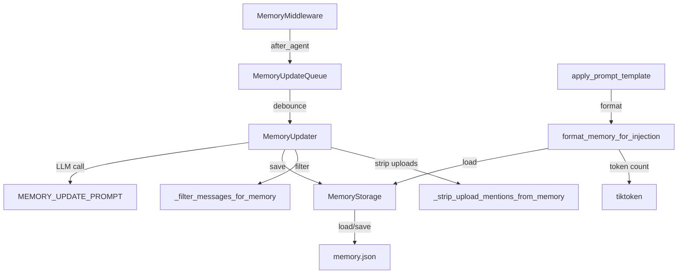
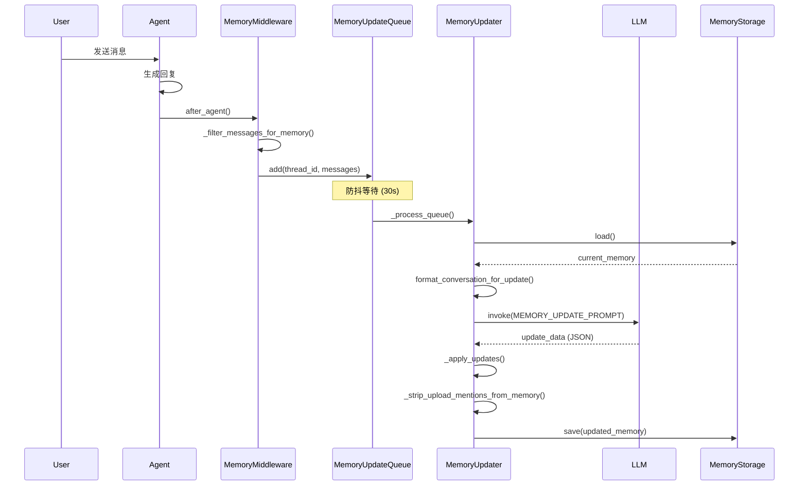

# 【07-记忆系统】记忆系统深度解析

> **源码路径**: `backend/packages/harness/deerflow/agents/memory/`
> **核心文件**: 4个 Python 文件
> **数据文件**: `memory.json` (默认存储位置)

---

## 一、设计思想

### 1.1 记忆系统概述

DeerFlow 的记忆系统是一个基于 LLM 的全局记忆机制，旨在实现跨会话的个性化交互。核心功能包括：

- **长期存储**: 用户上下文、对话历史、离散事实的持久化
- **智能提取**: 使用 LLM 从对话中提取有价值的信息
- **防抖更新**: 批量处理对话更新，避免频繁 LLM 调用
- **智能注入**: 根据置信度和 Token 预算选择性注入记忆
- **多 Agent 支持**: 支持全局记忆和按 Agent 隔离的记忆

### 1.2 架构设计原则

```
┌─────────────────────────────────────────────────────────────────┐
│                     Lead Agent 执行流程                          │
│                                                                 │
│  ┌─────────────────────────────────────────────────────────┐   │
│  │              MemoryMiddleware (after_agent)             │   │
│  │   1. 过滤消息 (用户输入 + 最终 AI 回复)                  │   │
│  │   2. 去除 <uploaded_files> 块                            │   │
│  │   3. 加入更新队列                                        │   │
│  └────────────────────┬────────────────────────────────────┘   │
│                       ▼                                          │
│  ┌─────────────────────────────────────────────────────────┐   │
│  │              MemoryUpdateQueue                          │   │
│  │   1. 防抖定时器 (默认 30 秒)                             │   │
│  │   2. 按线程去重 (同一线程多次触发只保留最新)             │   │
│  │   3. 批量处理                                            │   │
│  └────────────────────┬────────────────────────────────────┘   │
│                       ▼                                          │
│  ┌─────────────────────────────────────────────────────────┐   │
│  │              MemoryUpdater                              │   │
│  │   1. 调用 LLM 提取记忆更新                               │   │
│  │   2. 应用更新 (用户上下文、历史、事实)                   │   │
│  │   3. 去除文件上传提及                                    │   │
│  │   4. 持久化到存储                                        │   │
│  └────────────────────┬────────────────────────────────────┘   │
│                       ▼                                          │
│  ┌─────────────────────────────────────────────────────────┐   │
│  │              MemoryStorage                              │   │
│  │   1. 文件存储 (memory.json 或 agent_memory.json)        │   │
│  │   2. mtime 缓存失效                                      │   │
│  │   3. 原子写入 (临时文件 + rename)                        │   │
│  └─────────────────────────────────────────────────────────┘   │
└─────────────────────────────────────────────────────────────────┘

┌─────────────────────────────────────────────────────────────────┐
│                     下次对话注入流程                             │
│                                                                 │
│  ┌─────────────────────────────────────────────────────────┐   │
│  │              apply_prompt_template()                    │   │
│  │   1. format_memory_for_injection()                      │   │
│  │   2. 按 Token 预算截取 (默认 2000 tokens)                │   │
│  │   3. 事实按置信度排序                                    │   │
│  │   4. 注入到 <memory> 标签                                │   │
│  └─────────────────────────────────────────────────────────┘   │
└─────────────────────────────────────────────────────────────────┘
```

### 1.3 核心设计决策

**为什么使用 LLM 提取记忆？**

1. **结构化输出**: LLM 能将非结构化对话转换为结构化记忆
2. **语义理解**: 理解用户偏好、意图和上下文
3. **增量更新**: 智能合并新旧信息，避免冲突

**为什么需要防抖队列？**

1. **减少 LLM 调用**: 对话中的多次触发合并为一次更新
2. **成本优化**: 避免频繁的 API 调用
3. **线程隔离**: 同一线程的多次更新只保留最新版本

**为什么过滤上传文件提及？**

1. **会话隔离**: 上传文件仅在当前会话可用
2. **避免幻觉**: 防止 Agent 在新会话中搜索不存在的文件
3. **记忆准确性**: 移除会话特定的临时信息

**为什么按置信度排序事实？**

1. **Token 预算**: 在有限 Token 内优先注入高置信度事实
2. **信息质量**: 确保最重要信息被优先使用
3. **动态调整**: 新增低置信度事实不会挤掉高置信度事实

---

## 二、模块架构

### 2.1 文件结构

```
deerflow/agents/memory/
├── __init__.py          # 模块导出
├── storage.py           # 存储抽象层
├── queue.py             # 防抖更新队列
├── updater.py           # LLM 记忆更新器
└── prompt.py            # 提示词模板与格式化
```

### 2.2 模块依赖图



### 2.3 数据流图



---

## 三、核心组件解析

### 3.1 存储层 (storage.py)

#### `MemoryStorage` 抽象基类

**源码位置**: `packages/harness/deerflow/agents/memory/storage.py:37-54`

```python
class MemoryStorage(abc.ABC):
    """Abstract base class for memory storage providers."""

    @abc.abstractmethod
    def load(self, agent_name: str | None = None) -> dict[str, Any]:
        """Load memory data for the given agent."""
        pass

    @abc.abstractmethod
    def reload(self, agent_name: str | None = None) -> dict[str, Any]:
        """Force reload memory data for the given agent."""
        pass

    @abc.abstractmethod
    def save(self, memory_data: dict[str, Any], agent_name: str | None = None) -> bool:
        """Save memory data for the given agent."""
        pass
```

**设计解读**: 抽象层允许用户实现自定义存储后端（如数据库）

#### `FileMemoryStorage` - 文件存储实现

**源码位置**: `packages/harness/deerflow/agents/memory/storage.py:56-159`

**关键特性**:
1. **mtime 缓存**: 按文件修改时间失效缓存
2. **原子写入**: 临时文件 + rename 确保数据一致性
3. **按 Agent 隔离**: 支持全局和按 Agent 的记忆存储

**缓存实现**:

```python
def load(self, agent_name: str | None = None) -> dict[str, Any]:
    """Load memory data (cached with file modification time check)."""
    file_path = self._get_memory_file_path(agent_name)

    try:
        current_mtime = file_path.stat().st_mtime if file_path.exists() else None
    except OSError:
        current_mtime = None

    cached = self._memory_cache.get(agent_name)

    if cached is None or cached[1] != current_mtime:
        memory_data = self._load_memory_from_file(agent_name)
        self._memory_cache[agent_name] = (memory_data, current_mtime)
        return memory_data

    return cached[0]
```

**原子写入**:

```python
def save(self, memory_data: dict[str, Any], agent_name: str | None = None) -> bool:
    file_path = self._get_memory_file_path(agent_name)

    try:
        file_path.parent.mkdir(parents=True, exist_ok=True)
        memory_data["lastUpdated"] = datetime.utcnow().isoformat() + "Z"

        temp_path = file_path.with_suffix(".tmp")
        with open(temp_path, "w", encoding="utf-8") as f:
            json.dump(memory_data, f, indent=2, ensure_ascii=False)

        temp_path.replace(file_path)  # 原子操作
        # ...
        return True
```

### 3.2 防抖队列 (queue.py)

#### `MemoryUpdateQueue` - 记忆更新队列

**源码位置**: `packages/harness/deerflow/agents/memory/queue.py:25-169`

**核心机制**:
1. **线程去重**: 同一线程的多次更新只保留最新
2. **防抖定时器**: 可配置的等待时间（默认 30 秒）
3. **批量处理**: 一次处理所有待更新的对话

**添加队列**:

```python
def add(self, thread_id: str, messages: list[Any], agent_name: str | None = None) -> None:
    """Add a conversation to the update queue."""
    config = get_memory_config()
    if not config.enabled:
        return

    context = ConversationContext(
        thread_id=thread_id,
        messages=messages,
        agent_name=agent_name,
    )

    with self._lock:
        # Check if this thread already has a pending update
        # If so, replace it with the newer one
        self._queue = [c for c in self._queue if c.thread_id != thread_id]
        self._queue.append(context)

        # Reset or start the debounce timer
        self._reset_timer()
```

**防抖定时器**:

```python
def _reset_timer(self) -> None:
    """Reset the debounce timer."""
    config = get_memory_config()

    # Cancel existing timer if any
    if self._timer is not None:
        self._timer.cancel()

    # Start new timer
    self._timer = threading.Timer(
        config.debounce_seconds,
        self._process_queue,
    )
    self._timer.daemon = True
    self._timer.start()
```

### 3.3 记忆更新器 (updater.py)

#### `MemoryUpdater` - LLM 记忆更新

**源码位置**: `packages/harness/deerflow/agents/memory/updater.py:252-413`

**更新流程**:

```python
def update_memory(self, messages: list[Any], thread_id: str | None = None, agent_name: str | None = None) -> bool:
    """Update memory based on conversation messages."""
    config = get_memory_config()
    if not config.enabled:
        return False

    if not messages:
        return False

    try:
        # Get current memory
        current_memory = get_memory_data(agent_name)

        # Format conversation for prompt
        conversation_text = format_conversation_for_update(messages)

        if not conversation_text.strip():
            return False

        # Build prompt
        prompt = MEMORY_UPDATE_PROMPT.format(
            current_memory=json.dumps(current_memory, indent=2),
            conversation=conversation_text,
        )

        # Call LLM
        model = self._get_model()
        response = model.invoke(prompt)
        response_text = _extract_text(response.content).strip()

        # Parse response
        if response_text.startswith("```"):
            lines = response_text.split("\n")
            response_text = "\n".join(lines[1:-1] if lines[-1] == "```" else lines[1:])

        update_data = json.loads(response_text)

        # Apply updates
        updated_memory = self._apply_updates(current_memory, update_data, thread_id)

        # Strip file-upload mentions from all summaries before saving
        updated_memory = _strip_upload_mentions_from_memory(updated_memory)

        # Save
        return get_memory_storage().save(updated_memory, agent_name)
    # ...
```

**事实去重**:

```python
def _apply_updates(self, current_memory, update_data, thread_id=None):
    # Add new facts
    existing_fact_keys = {
        fact_key for fact_key in (_fact_content_key(fact.get("content"))
                                  for fact in current_memory.get("facts", []))
        if fact_key is not None
    }
    new_facts = update_data.get("newFacts", [])
    for fact in new_facts:
        confidence = fact.get("confidence", 0.5)
        if confidence >= config.fact_confidence_threshold:
            raw_content = fact.get("content", "")
            normalized_content = raw_content.strip()
            fact_key = _fact_content_key(normalized_content)
            if fact_key is not None and fact_key in existing_fact_keys:
                continue  # Skip duplicate

            # Add new fact...
```

**文件上传提及过滤**:

```python
_UPLOAD_SENTENCE_RE = re.compile(
    r"[^.!?]*\b(?:"
    r"upload(?:ed|ing)?(?:\s+\w+){0,3}\s+(?:file|files?|document|documents?|attachment|attachments?)"
    r"|file\s+upload"
    r"|/mnt/user-data/uploads/"
    r"|<uploaded_files>"
    r")[^.!?]*[.!?]?\s*",
    re.IGNORECASE,
)

def _strip_upload_mentions_from_memory(memory_data):
    """Remove sentences about file uploads from all memory summaries and facts."""
    # Scrub summaries in user/history sections
    for section in ("user", "history"):
        section_data = memory_data.get(section, {})
        for _key, val in section_data.items():
            if isinstance(val, dict) and "summary" in val:
                cleaned = _UPLOAD_SENTENCE_RE.sub("", val["summary"]).strip()
                cleaned = re.sub(r"  +", " ", cleaned)
                val["summary"] = cleaned

    # Also remove any facts that describe upload events
    facts = memory_data.get("facts", [])
    if facts:
        memory_data["facts"] = [f for f in facts if not _UPLOAD_SENTENCE_RE.search(f.get("content", ""))]

    return memory_data
```

### 3.4 提示词与格式化 (prompt.py)

#### `MEMORY_UPDATE_PROMPT` - 记忆更新提示词

**源码位置**: `packages/harness/deerflow/agents/memory/prompt.py:15-117`

**关键指令**:
1. **结构化输出**: JSON 格式的更新指令
2. **长度指南**: 不同部分的长度限制
3. **置信度规则**: 明确的置信度分级标准
4. **上传过滤**: 明确指示不要记录文件上传事件

#### `format_memory_for_injection()` - 记忆注入

**源码位置**: `packages/harness/deerflow/agents/memory/prompt.py:186-294`

**Token 预算管理**:

```python
def format_memory_for_injection(memory_data: dict[str, Any], max_tokens: int = 2000) -> str:
    """Format memory data for injection into system prompt."""
    # ... format sections ...

    # Format facts (sorted by confidence)
    facts_data = memory_data.get("facts", [])
    if isinstance(facts_data, list) and facts_data:
        ranked_facts = sorted(
            (f for f in facts_data if isinstance(f, dict) and isinstance(f.get("content"), str)),
            key=lambda fact: _coerce_confidence(fact.get("confidence")),
            reverse=True,
        )

        # Compute token count incrementally
        base_text = "\n\n".join(sections)
        base_tokens = _count_tokens(base_text)
        running_tokens = base_tokens + separator_tokens

        fact_lines = []
        for fact in ranked_facts:
            line = f"- [{category} | {confidence:.2f}] {content}"
            line_tokens = _count_tokens(line)

            if running_tokens + line_tokens <= max_tokens:
                fact_lines.append(line)
                running_tokens += line_tokens
            else:
                break  # Token budget exhausted
```

### 3.5 中间件集成 (memory_middleware.py)

#### `MemoryMiddleware` - 记忆中间件

**源码位置**: `packages/harness/deerflow/agents/middlewares/memory_middleware.py:90-157`

**消息过滤**:

```python
def _filter_messages_for_memory(messages: list[Any]) -> list[Any]:
    """Filter messages to keep only user inputs and final assistant responses."""
    _UPLOAD_BLOCK_RE = re.compile(r"<uploaded_files>[\s\S]*?</uploaded_files>\n*", re.IGNORECASE)

    filtered = []
    skip_next_ai = False
    for msg in messages:
        msg_type = getattr(msg, "type", None)

        if msg_type == "human":
            content = getattr(msg, "content", "")
            if isinstance(content, list):
                content = " ".join(p.get("text", "") for p in content if isinstance(p, dict))
            content_str = str(content)
            if "<uploaded_files>" in content_str:
                stripped = _UPLOAD_BLOCK_RE.sub("", content_str).strip()
                if not stripped:
                    skip_next_ai = True
                    continue
                clean_msg = copy(msg)
                clean_msg.content = stripped
                filtered.append(clean_msg)
                skip_next_ai = False
            else:
                filtered.append(msg)
                skip_next_ai = False
        elif msg_type == "ai":
            tool_calls = getattr(msg, "tool_calls", None)
            if not tool_calls:
                if skip_next_ai:
                    skip_next_ai = False
                    continue
                filtered.append(msg)
        # Skip tool messages and AI messages with tool_calls

    return filtered
```

---

## 四、数据结构

### 4.1 记忆数据结构

```json
{
  "version": "1.0",
  "lastUpdated": "2026-04-01T00:00:00Z",
  "user": {
    "workContext": {
      "summary": "Core contributor to DeerFlow project...",
      "updatedAt": "2026-04-01T00:00:00Z"
    },
    "personalContext": {
      "summary": "Bilingual in English and Chinese...",
      "updatedAt": "2026-04-01T00:00:00Z"
    },
    "topOfMind": {
      "summary": "Working on memory system documentation, exploring MCP integration, learning about LangGraph...",
      "updatedAt": "2026-04-01T00:00:00Z"
    }
  },
  "history": {
    "recentMonths": {
      "summary": "Contributed to DeerFlow backend, wrote documentation for config system...",
      "updatedAt": "2026-04-01T00:00:00Z"
    },
    "earlierContext": {
      "summary": "Previously worked on AI agent frameworks...",
      "updatedAt": "2026-04-01T00:00:00Z"
    },
    "longTermBackground": {
      "summary": "Software engineer with focus on AI/ML...",
      "updatedAt": "2026-04-01T00:00:00Z"
    }
  },
  "facts": [
    {
      "id": "fact_abc123",
      "content": "Prefers Python for AI development",
      "category": "preference",
      "confidence": 0.9,
      "createdAt": "2026-04-01T00:00:00Z",
      "source": "thread_123"
    }
  ]
}
```

### 4.2 事实分类

| 类别 | 说明 | 示例 |
|------|------|------|
| `preference` | 用户偏好 | "Prefers dark mode", "Likes concise responses" |
| `knowledge` | 专业知识 | "Expert in LangGraph", "Knows Rust" |
| `context` | 背景信息 | "Works at Anthropic", "Based in SF" |
| `behavior` | 行为模式 | "Asks follow-up questions", "Tests code examples" |
| `goal` | 目标意向 | "Learning MCP integration", "Building AI agents" |

---

## 五、可复用代码模板

### 5.1 防抖队列模板

```python
"""Debounce queue template for batching updates."""

import threading
import time
from typing import Any, Callable

class DebounceQueue:
    """Queue that processes items after a debounce period."""

    def __init__(self, processor: Callable[[list[Any]], None], debounce_seconds: int = 30):
        self._queue: dict[str, Any] = {}
        self._lock = threading.Lock()
        self._timer: threading.Timer | None = None
        self._processor = processor
        self._debounce_seconds = debounce_seconds

    def add(self, key: str, item: Any) -> None:
        """Add or replace an item in the queue."""
        with self._lock:
            self._queue[key] = item
            self._reset_timer()

    def _reset_timer(self) -> None:
        """Reset the debounce timer."""
        if self._timer is not None:
            self._timer.cancel()

        self._timer = threading.Timer(
            self._debounce_seconds,
            self._process,
        )
        self._timer.daemon = True
        self._timer.start()

    def _process(self) -> None:
        """Process all queued items."""
        with self._lock:
            if not self._queue:
                return
            items = list(self._queue.values())
            self._queue.clear()
            self._timer = None

        self._processor(items)
```

### 5.2 mtime 缓存模板

```python
"""mtime-based cache template."""

import threading
from pathlib import Path
from typing import Any, TypeVar

T = TypeVar("T")

class MtimeCache:
    """Cache that invalidates on file modification."""

    def __init__(self, loader: Callable[[Path], T]):
        self._loader = loader
        self._cache: dict[Path, tuple[T, float | None]] = {}
        self._lock = threading.Lock()

    def get(self, path: Path) -> T:
        """Get cached value, reload if stale."""
        with self._lock:
            try:
                current_mtime = path.stat().st_mtime if path.exists() else None
            except OSError:
                current_mtime = None

            cached = self._cache.get(path)
            if cached is None or cached[1] != current_mtime:
                value = self._loader(path)
                self._cache[path] = (value, current_mtime)
                return value

            return cached[0]

    def invalidate(self, path: Path) -> None:
        """Invalidate cache for a specific path."""
        with self._lock:
            self._cache.pop(path, None)
```

### 5.3 原子文件写入模板

```python
"""Atomic file write template."""

from pathlib import Path
import json
from typing import Any

def atomic_write(path: Path, data: Any) -> bool:
    """Write data to file atomically."""
    try:
        path.parent.mkdir(parents=True, exist_ok=True)

        temp_path = path.with_suffix(".tmp")
        with open(temp_path, "w", encoding="utf-8") as f:
            json.dump(data, f, indent=2, ensure_ascii=False)

        temp_path.replace(path)  # Atomic on POSIX
        return True
    except OSError:
        return False
```

### 5.4 Token 预算截取模板

```python
"""Token budget truncation template."""

import re

def truncate_by_token_budget(
    items: list[str],
    max_tokens: int,
    count_fn: Callable[[str], int],
) -> list[str]:
    """Select items to fit within token budget."""
    running_tokens = 0
    selected = []

    for item in items:
        item_tokens = count_fn(item)
        if running_tokens + item_tokens <= max_tokens:
            selected.append(item)
            running_tokens += item_tokens
        else:
            break

    return selected
```

---

## 六、踩坑提醒

### 6.1 事实去重的空白字符处理

**问题**: 相同内容但空白不同的重复事实被存储

**解决方案**: 标准化前后再比较

```python
def _fact_content_key(content: Any) -> str | None:
    if not isinstance(content, str):
        return None
    stripped = content.strip()
    if not stripped:
        return None
    return stripped

# 使用 normalized key 进行去重
existing_fact_keys = {
    _fact_content_key(fact.get("content"))
    for fact in current_memory.get("facts", [])
}
```

### 6.2 LLM 响应的 Markdown 代码块

**问题**: LLM 可能返回包含 ```json 的响应

**解决方案**: 检测并移除

```python
if response_text.startswith("```"):
    lines = response_text.split("\n")
    response_text = "\n".join(lines[1:-1] if lines[-1] == "```" else lines[1:])
```

### 6.3 结构化内容的文本提取

**问题**: 现代 LLM 返回列表格式内容，`str()` 会产生 Python repr

**解决方案**: 提取实际文本

```python
def _extract_text(content: Any) -> str:
    """Extract plain text from LLM response content."""
    if isinstance(content, str):
        return content
    if isinstance(content, list):
        pieces = []
        pending_str_parts = []

        for block in content:
            if isinstance(block, str):
                pending_str_parts.append(block)
            elif isinstance(block, dict):
                if pending_str_parts:
                    pieces.append("".join(pending_str_parts))
                    pending_str_parts.clear()
                text_val = block.get("text")
                if isinstance(text_val, str):
                    pieces.append(text_val)

        if pending_str_parts:
            pieces.append("".join(pending_str_parts))
        return "\n".join(pieces)
    return str(content)
```

### 6.4 文件上传的会话隔离

**问题**: 上传文件路径被写入长期记忆，导致后续会话幻觉

**解决方案**: 多层过滤

1. **消息过滤**: 去除 `<uploaded_files>` 块
2. **更新过滤**: 从记忆更新中去除上传相关句子
3. **提示词指令**: 明确告诉 LLM 不要记录

### 6.5 置信度的非值处理

**问题**: NaN 或无限大导致排序异常

**解决方案**: 验证并替换

```python
def _coerce_confidence(value: Any, default: float = 0.0) -> float:
    """Coerce confidence to bounded float in [0, 1]."""
    try:
        confidence = float(value)
    except (TypeError, ValueError):
        return max(0.0, min(1.0, default))
    if not math.isfinite(confidence):
        return max(0.0, min(1.0, default))
    return max(0.0, min(1.0, confidence))
```

---

## 七、源码覆盖清单

### 已覆盖文件 (5/5)

| 文件 | 覆盖内容 |
|------|----------|
| `__init__.py` | 模块导出 |
| `storage.py` | 存储抽象、文件存储、mtime 缓存 |
| `queue.py` | 防抖队列、线程去重 |
| `updater.py` | LLM 更新、事实去重、上传过滤 |
| `prompt.py` | 提示词模板、记忆注入格式化 |
| `memory_middleware.py` | 消息过滤、队列触发 |

---

## 八、术语表

| 术语 | 说明 |
|------|------|
| 防抖 (Debounce) | 延迟执行，期间新事件会重置定时器 |
| mtime | 文件修改时间 |
| Token 预算 | 上下文窗口中可用于记忆的 Token 数量 |
| 置信度 | 事实的可信程度 (0-1) |
| 会话隔离 | 上传文件仅在当前会话可用的特性 |

---

## 九、相关文档

- `docs/ARCHITECTURE.md` - 整体架构
- `backend/tests/test_memory_updater.py` - 记忆更新测试
- `backend/packages/harness/deerflow/config/memory_config.py` - 配置说明

---

**文档版本**: v1.0
**生成时间**: 2026-04-01
**作者**: doc-writer @ deer-flow-docs
