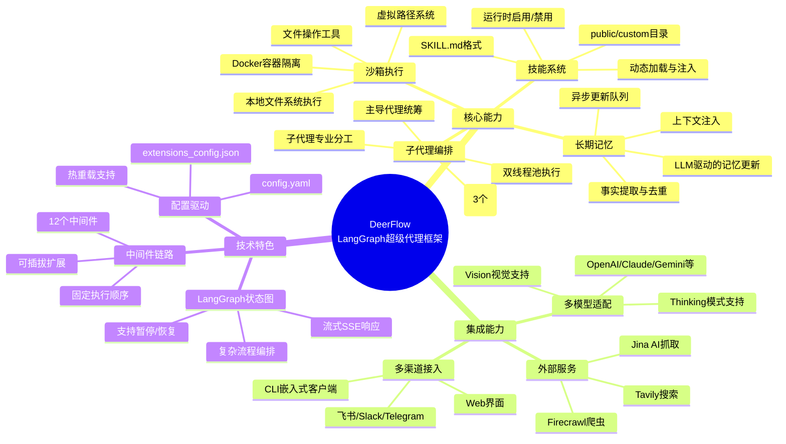
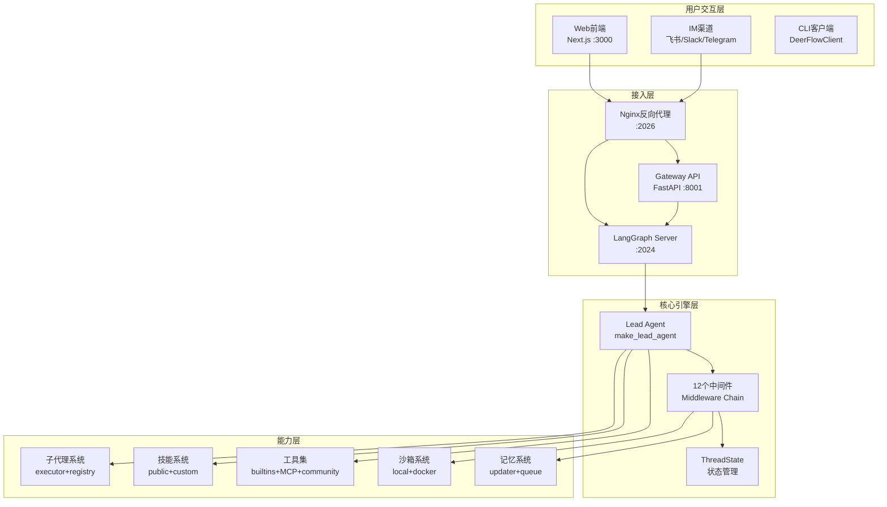
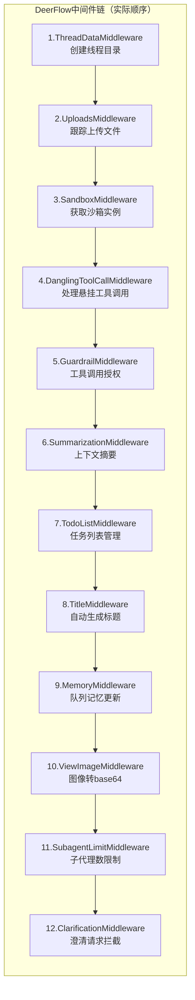

# 【文档08】DeerFlow是什么 —— 五分钟看懂AI Agent框架

## 1. 五分钟速览

**这篇文档解决什么问题？**

如果你想了解：
- 什么是AI Agent框架？
- DeerFlow在整个AI生态中的位置？
- 它解决了什么行业痛点？

那么这篇文档给你一个**5分钟能看懂**的全局认知。

**阅读后你将获得：**
- 清晰的概念框架（不再被各种AI术语搞晕）
- DeerFlow的核心能力地图
- 面试时能用上的精炼回答

---

## 2. 从一个问题开始：为什么需要DeerFlow？

### 2.1 传统AI交互的局限

```
用户 → ChatGPT → 单次回答

问题：
❌ 没有记忆：下次对话要从头开始
❌ 不能行动：只能回答，不能帮你做事
❌ 无法协作：遇到复杂任务束手无策
```

**设计洞察**：真正有用的AI应该像一个**助手**，而不只是一个**问答机器**。

### 2.2 DeerFlow的定位

```
用户 → DeerFlow → 协调多个能力 → 完成复杂任务
                    ├── 子代理（分工协作）
                    ├── 工具（搜索、编程、爬虫...）
                    ├── 记忆（记住你的偏好）
                    └── 沙箱（安全执行代码）
```

**一句话定义**：

> DeerFlow是一个基于LangGraph的**超级代理编排框架**，通过协调子代理、工具、记忆和沙箱，让AI能够**自主完成复杂任务**。

---

## 3. 核心概念速查表

| 概念 | 大白话解释 | 为什么需要 |
|------|-----------|-----------|
| **Agent（代理）** | 有自主决策能力的AI实体 | 让AI能主动规划、调用工具、完成任务 |
| **Lead Agent（主导代理）** | 总指挥官，负责理解需求和整体规划 | 复杂任务需要有人统筹全局 |
| **Sub-Agent（子代理）** | 专业分工的小助手（搜索专家、编程专家...） | 单个Agent难以精通所有领域，分工更高效 |
| **Tool（工具）** | Agent能调用的外部函数（搜索、计算、文件操作） | AI需要"手"才能与真实世界交互 |
| **Skill（技能）** | 打包好的完整能力（深度研究=搜索+整理+报告） | 复用常见任务流程，避免重复造轮子 |
| **Memory（记忆）** | AI的长期记忆，跨会话保存信息 | 让AI记住你的偏好和上下文 |
| **Sandbox（沙箱）** | 隔离的执行环境，安全运行代码 | AI生成的代码可能有风险，需要隔离 |
| **Checkpoint（检查点）** | 执行状态的存档点 | 长时间任务可以暂停后恢复 |
| **Middleware（中间件）** | 请求处理的管道组件 | 职责分离，灵活组合 |

---

## 4. DeerFlow的核心能力全景图



---

## 5. 系统架构全景

### 5.1 四层架构



### 5.2 端口与服务

| 服务 | 端口 | 协议 | 说明 |
|------|------|------|------|
| LangGraph Server | 2024 | HTTP/SSE | Agent运行时和状态图执行 |
| Gateway API | 8001 | REST | 模型、技能、记忆、上传等API |
| 前端 | 3000 | HTTP | Next.js Web界面 |
| Nginx | 2026 | HTTP | 统一反向代理入口点 |

---

## 6. 中间件链：DeerFlow的核心设计

### 6.1 实际的中间件顺序（来自源码）

基于 `backend/packages/harness/deerflow/agents/lead_agent/agent.py` 的实际实现：



### 6.2 关键设计考量

**为什么是这个顺序？**

```
1. ThreadDataMiddleware必须在最前面
   → 后续中间件需要thread_id
   → 创建线程专属目录

2. UploadsMiddleware在ThreadData之后
   → 需要访问thread_id目录

3. SandboxMiddleware在Uploads之后
   → 可能有上传的文件需要沙箱处理

4. ClarificationMiddleware必须在最后
   → 需要拦截所有可能的澄清请求
   → 一旦拦截就中断执行流程

5. MemoryMiddleware在TitleMiddleware之后
   → 标题生成后才开始记录对话
```

---

## 7. DeerFlow vs 其他框架：差异化优势

| 能力 | DeerFlow | AutoGPT | LangChain | CrewAI |
|------|----------|---------|-----------|--------|
| 子代理编排 | ✅ 双线程池+3并发限制 | ⚠️ 简单支持 | ❌ 需自己实现 | ✅ 支持 |
| 长期记忆 | ✅ LLM驱动+事实去重 | ⚠️ 有限 | ❌ 需自行接入 | ⚠️ 基础 |
| 沙箱执行 | ✅ 本地+Docker双模式 | ⚠️ 仅基础限制 | ❌ 无 | ❌ 无 |
| 技能生态 | ✅ SKILL.md格式 | ❌ 无 | ❌ 无 | ⚠️ 有限 |
| MCP协议 | ✅ MultiServerMCPClient | ❌ 无 | ⚠️ 部分支持 | ❌ 无 |
| CLI集成 | ✅ DeerFlowClient | ❌ 无 | ❌ 无 | ❌ 无 |
| 中间件系统 | ✅ 12个固定顺序 | ❌ 无 | ⚠️ 有限 | ❌ 无 |
| Thinking模式 | ✅ 模型级支持 | ❌ 无 | ⚠️ 部分支持 | ⚠️ 有限 |

**核心差异化**：DeerFlow不只是Agent框架，更是一个**可扩展的AI操作系统**。

---

## 8. 实际代码中的设计亮点

### 8.1 技能加载机制（基于实际代码）

```python
# 来自：backend/packages/harness/deerflow/skills/loader.py

def load_skills(skills_path: Path | None = None,
                enabled_only: bool = False) -> list[Skill]:
    """
    技能加载流程：
    1. 扫描 public/ 和 custom/ 目录
    2. 查找 SKILL.md 文件
    3. 解析 YAML frontmatter
    4. 从 extensions_config.json 读取启用状态
    5. 按名称排序返回
    """
    # 扫描 public 和 custom 目录
    for category in ["public", "custom"]:
        category_path = skills_path / category
        for skill_file in category_path.rglob("SKILL.md"):
            skill = parse_skill_file(skill_file)
            # 从配置更新启用状态
            skill.enabled = extensions_config.is_skill_enabled(skill.name)
```

**设计亮点**：
- public技能（社区贡献）+ custom技能（用户自定义）分离
- SKILL.md格式统一（YAML frontmatter + Markdown）
- 启用状态集中管理（extensions_config.json）

### 8.2 模型工厂机制（基于实际代码）

```python
# 来自：backend/packages/harness/deerflow/models/factory.py

def create_chat_model(name: str | None = None,
                      thinking_enabled: bool = False,
                      **kwargs) -> BaseChatModel:
    """
    模型创建流程：
    1. 从配置加载模型定义
    2. 使用反射解析 model_class
    3. 合并 thinking 参数
    4. 附加 LangSmith 追踪
    """
    model_config = config.get_model_config(name)
    model_class = resolve_class(model_config.use, BaseChatModel)
    # 合并 thinking 配置
    if thinking_enabled and model_config.supports_thinking:
        model_settings.update(model_config.when_thinking_enabled)
    return model_class(**model_settings)
```

**设计亮点**：
- 配置驱动（use字段指向类路径）
- 反射动态加载（resolve_class）
- Thinking模式统一支持

---

## 9. 面试要点

### Q1: 什么是AI Agent框架？

**参考回答**：
```
AI Agent框架是用于编排大模型、工具和记忆的系统，
让AI能够自主规划、调用工具、完成复杂任务。

核心区别：
传统AI：问答式，用户问一句AI答一句
AI Agent：任务式，AI可以主动规划、调用工具、多次迭代

举例：
问ChatGPT "帮我查一下天气"，它只能说"我无法联网"
问DeerFlow Agent同样问题，它会调用天气API，然后告诉你结果

DeerFlow基于LangGraph，使用状态图编排执行流程。
```

### Q2: DeerFlow的核心优势是什么？

**参考回答**：
```
DeerFlow的核心优势有四个：

1. 子代理编排：
   → 双线程池设计（调度池+执行池）
   → 最大并发数限制（3个）
   → 15分钟超时保护

2. 完整记忆系统：
   → LLM驱动的记忆更新
   → 事实提取与去重
   → 异步更新队列（30秒防抖）

3. 双模式沙箱：
   → LocalSandboxProvider（本地文件系统）
   → AioSandboxProvider（Docker容器）
   → 虚拟路径系统

4. 完整的技能生态：
   → SKILL.md格式（YAML + Markdown）
   → public/custom分离
   → 运行时启用/禁用

相比其他框架，DeerFlow不只是Agent工具，
更是一个完整的AI操作系统。
```

### Q3: DeerFlow的中间件链是如何设计的？

**参考回答**：
```
DeerFlow有12个中间件，按固定顺序执行：

1. ThreadDataMiddleware - 创建线程目录
2. UploadsMiddleware - 跟踪上传文件
3. SandboxMiddleware - 获取沙箱
4. DanglingToolCallMiddleware - 处理悬挂调用
5. GuardrailMiddleware - 工具授权
6. SummarizationMiddleware - 上下文摘要
7. TodoListMiddleware - 任务管理
8. TitleMiddleware - 生成标题
9. MemoryMiddleware - 队列记忆更新
10. ViewImageMiddleware - 图像处理
11. SubagentLimitMiddleware - 子代理限制
12. ClarificationMiddleware - 澄清拦截

设计考量：
→ ThreadData必须在最前（后续需要thread_id）
→ Clarification必须在最后（拦截中断）
→ Memory在Title之后（标题生成后才开始记录）

这是"管道模式"的实际应用，职责清晰、顺序严格。
```

### Q4: DeerFlow如何支持多种模型？

**参考回答**：
```
DeerFlow通过模型工厂和适配器模式支持多模型：

配置示例（config.yaml）：
models:
  - name: claude-sonnet
    use: langchain_anthropic:ChatAnthropic
    supports_thinking: true
    supports_vision: true

  - name: gpt-4
    use: langchain_openai:ChatOpenAI
    supports_thinking: false

工厂流程：
1. 从配置加载模型定义
2. 使用反射解析 model_class
3. 动态实例化模型
4. 附加 LangSmith 追踪

优势：
→ 配置驱动，不需要改代码
→ 统一接口，切换模型只需改配置
→ 支持 Thinking/Vision 等高级特性
```

### Q5: DeerFlow的技术栈是什么？

**参考回答**：
```
后端核心：
- Python 3.12+
- LangChain + LangGraph（AI编排）
- FastAPI（Gateway API）
- Pydantic（数据验证）

前端：
- Next.js 16（React框架）
- React 19
- TypeScript 5.8
- Tailwind CSS 4
- pnpm 10.26.2

集成：
- Docker（容器化）
- Nginx（反向代理）
- MCP协议（模型上下文协议）

架构：
- LangGraph Server（:2024）
- Gateway API（:8001）
- Frontend（:3000）
- Nginx（:2026）统一入口
```

---

## 10. 延伸思考

### 10.1 DeerFlow的局限性

```
🔴 学习曲线：LangGraph状态图需要理解成本
🔴 资源消耗：多Agent协作比单次调用消耗更多token
🔴 确定性：Agent的自主性意味着结果不一定完全可控
🔴 调试难度：多Agent协作的调试比传统程序复杂
🔴 配置复杂：config.yaml + extensions_config.json 双配置
```

### 10.2 行业趋势

```
第一阶段：大模型（ChatGPT）
         ↓
第二阶段：Agent框架（AutoGPT、DeerFlow）
         ↓
第三阶段：AI操作系统（多Agent协作+完整生态）
         ↓
未来：AGI（通用人工智能）

DeerFlow正处于第二到第三阶段的过渡位置
```

---

## 11. 思考问题

### 11.1 理解检验

1. DeerFlow的核心组件有哪些？它们如何协作？
2. 12个中间件的执行顺序是什么？为什么这样排序？
3. 技能系统是如何加载和注入的？

### 11.2 设计思考

4. 为什么子代理系统使用双线程池设计？
5. 记忆系统为什么使用异步更新队列？
6. GuardrailMiddleware是如何工作的？

### 11.3 场景应用

7. 如果要添加一个新的中间件，应该插入到哪个位置？
8. 如果要支持一个新的模型提供商，需要做什么？
9. 如果要创建一个自定义技能，需要哪些文件？

---

## 12. 本篇小结

**核心要点**：

1. **DeerFlow是什么**：基于LangGraph的超级代理编排框架
2. **核心能力**：子代理编排、长期记忆、沙箱执行、技能系统
3. **为什么需要**：传统AI只能问答，DeerFlow能行动和协作
4. **差异化优势**：12个中间件、双模式沙箱、LLM驱动记忆、技能生态

**你现在已经有了全局认知**，下一篇我们将深入**系统架构**，看看各层之间如何协作。

---

## 13. 文档衔接

**本篇完结**，下一篇将解析：【09-系统架构全景图：各层如何协作】

**衔接说明**：
- 08篇解决了"DeerFlow是什么"的问题
- 09篇将解决"DeerFlow内部是怎么组织的"问题
- 按"概念→结构"的顺序，符合认知从抽象到具体的递进
- 理解架构后，才能深入后面各个核心概念（代理、记忆、工具等）
