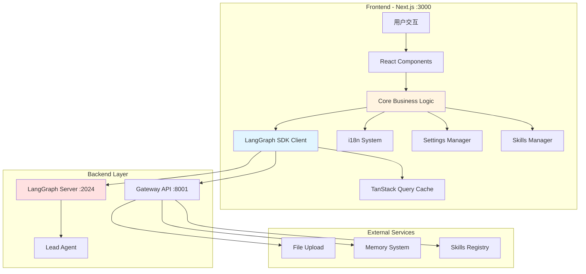

# 【文档编号+模块名】08 - 前端架构总览

## 1. 模块全局定位

- **所属项目**: deer-flow
- **层级位置**: 用户交互层 / frontend/
- **核心作用**: 提供用户与 AI Agent 系统交互的 Web 界面，负责消息发送、流式响应接收、会话管理、技能管理等核心交互功能
- **业务价值**: 在 AI 工作流/编排系统中承担用户入口的角色，是用户与后端 LangGraph 引擎交互的唯一前端界面
- **设计初衷**: 该模块是为了解决"用户如何方便地使用 AI Agent 编排能力"这一核心需求而设计的。为什么选择 Web 前端而非纯 CLI？因为 Web 能提供更丰富的交互体验（流式渲染、文件上传、多会话管理、可视化调试），更符合现代用户的使用习惯。

---

## 2. 依赖&调用链路 Mermaid 图



### 图表设计解读

**说明**: 该链路图展示了前端如何与后端交互，以及前端内部的模块依赖关系。

**为什么采用这样的依赖关系？**
1. **Core 层为中心**: `core/` 目录是业务逻辑的核心，所有组件都通过 core 层与后端通信，而不是直接调用 SDK。这样设计的好处是解耦——如果需要更换 SDK 或添加新的后端接口，只需修改 core 层，组件层无需改动。

2. **LangGraph SDK Client 作为单例**: 通过 `getAPIClient()` 获取单例客户端，避免创建多个连接。为什么用单例？因为每个连接都会占用资源，单例可以复用连接，减少内存开销和连接建立时间。

3. **TanStack Query 作为缓存层**: 在 SDK 和 Core 之间加入查询缓存层，用于管理服务端状态（如线程列表、用户设置）。为什么需要缓存？避免重复请求相同数据，提升用户体验，减少后端压力。

4. **i18n/Settings 作为独立模块**: 国际化和用户设置独立于业务逻辑，因为它们是跨模块的通用能力，需要被多个组件复用。

**上下游模块的调用顺序是基于什么设计考量？**
用户操作 → 组件捕获事件 → Core 层处理业务逻辑 → SDK 发送请求 → 后端处理 → SDK 接收流式响应 → Core 层更新状态 → 组件重新渲染。这样的单向数据流设计保证了状态的可预测性，便于调试和维护。

---

## 3. 核心目录/文件清单

```
frontend/
├── src/
│   ├── app/                    # Next.js App Router（页面路由层）
│   │   ├── layout.tsx          # 根布局（ThemeProvider + I18nProvider）
│   │   ├── page.tsx            # 首页（落地页）
│   │   ├── workspace/          # 工作区页面（主应用界面）
│   │   │   ├── agents/         # Agent 管理页面
│   │   │   ├── chats/          # 聊天界面
│   │   │   │   └── [thread_id] # 动态路由：特定会话
│   │   │   ├── layout.tsx      # 工作区布局
│   │   │   └── page.tsx        # 工作区首页
│   │   └── api/                # API 路由（服务端组件）
│   │
│   ├── components/             # React 组件库
│   │   ├── ui/                 # Shadcn UI 基础组件（自动生成，勿手动编辑）
│   │   ├── ai-elements/        # Vercel AI SDK 元素（自动生成）
│   │   ├── workspace/          # 工作区业务组件
│   │   │   ├── chat-input/     # 输入框组件
│   │   │   ├── messages/       # 消息列表组件
│   │   │   ├── sidebar/        # 侧边栏组件
│   │   │   └── settings/       # 设置面板组件
│   │   ├── landing/            # 落地页组件
│   │   └── theme-provider.tsx  # 主题提供者
│   │
│   ├── core/                   # 核心业务逻辑层（项目核心）
│   │   ├── api/                # LangGraph 客户端封装
│   │   │   ├── index.ts
│   │   │   └── api-client.ts   # 单例客户端工厂
│   │   ├── threads/            # 线程/会话管理
│   │   │   ├── hooks.ts        # useThreadStream, useThreads 等
│   │   │   ├── types.ts        # 类型定义
│   │   │   └── utils.ts        # 工具函数
│   │   ├── agents/             # Agent 管理
│   │   ├── skills/             # 技能系统
│   │   ├── memory/             # 记忆系统
│   │   ├── settings/           # 用户设置
│   │   ├── i18n/               # 国际化
│   │   ├── uploads/            # 文件上传
│   │   ├── mcp/                # MCP 协议集成
│   │   ├── artifacts/          # 工件管理
│   │   ├── tasks/              # 任务管理
│   │   └── todos/              # 待办事项
│   │
│   ├── hooks/                  # 共享 React Hooks
│   ├── lib/                    # 工具函数（cn() 等）
│   ├── styles/                 # 全局样式（Tailwind CSS）
│   └── env.js                  # 环境变量验证
│
├── package.json                # 依赖声明
├── tsconfig.json               # TypeScript 配置
├── next.config.ts              # Next.js 配置
├── tailwind.config.ts          # Tailwind CSS 配置
└── components.json             # Shadcn UI 配置
```

**目录设计定位说明**：
- **app/**: 采用 Next.js 16 的 App Router，为什么选择 App Router 而非 Pages Router？因为 App Router 原生支持 React Server Components，可以减少客户端 JavaScript 体积，提升首屏加载速度。
- **components/ui/**: 为什么标注"自动生成，勿手动编辑"？因为这些组件通过 Shadcn CLI 维护，手动修改会在下次更新时被覆盖。
- **core/**: 为什么设置 core 层？这是前端架构的核心设计——将业务逻辑与 UI 分离。core 层不依赖 React，只处理数据和 API 调用，这样可以：
  - 便于单元测试（不需要渲染组件）
  - 便于逻辑复用（可以在不同组件中复用同一个 core 函数）
  - 便于未来迁移到其他框架（如 Vue）因为 UI 层很薄
- **hooks/**: 共享 Hooks 为什么单独存放？因为 Hooks 是 React 生态的复用单元，将可复用的 Hooks 集中管理，避免在组件中重复实现相同逻辑。

**文件之间的设计关联**：
- 组件层依赖 core 层，core 层依赖 SDK 客户端
- core 层各模块之间相对独立，但 threads 模块是核心，其他模块（如 skills、memory）都为线程服务

---

## 4. 关键源码深度解析

### 4.1 API 客户端单例模式

**文件路径**: `/data/deer-flow-main/frontend/src/core/api/api-client.ts`

**功能概述**: 创建并管理 LangGraph SDK 客户端的单例，确保整个应用只使用一个客户端实例。

```typescript
"use client";

import { Client as LangGraphClient } from "@langchain/langgraph-sdk/client";

import { getLangGraphBaseURL } from "../config";

import { sanitizeRunStreamOptions } from "./stream-mode";

function createCompatibleClient(isMock?: boolean): LangGraphClient {
  const client = new LangGraphClient({
    apiUrl: getLangGraphBaseURL(isMock),
  });

  const originalRunStream = client.runs.stream.bind(client.runs);
  client.runs.stream = ((threadId, assistantId, payload) =>
    originalRunStream(
      threadId,
      assistantId,
      sanitizeRunStreamOptions(payload),
    )) as typeof client.runs.stream;

  const originalJoinStream = client.runs.joinStream.bind(client.runs);
  client.runs.joinStream = ((threadId, runId, options) =>
    originalJoinStream(
      threadId,
      runId,
      sanitizeRunStreamOptions(options),
    )) as typeof client.runs.joinStream;

  return client;
}

const _clients = new Map<string, LangGraphClient>();
export function getAPIClient(isMock?: boolean): LangGraphClient {
  const cacheKey = isMock ? "mock" : "default";
  let client = _clients.get(cacheKey);

  if (!client) {
    client = createCompatibleClient(isMock);
    _clients.set(cacheKey, client);
  }

  return client;
}
```

### 逐行解读（含设计考量）

**第 1 行**: `"use client";`
- 为什么要标注？因为 Next.js 默认使用 Server Components，但这里需要使用浏览器 API（Map、客户端存储），所以必须声明为 Client Component。

**第 3-6 行**: 导入依赖
- 为什么从 `@langchain/langgraph-sdk/client` 导入？因为这是 LangGraph 官方提供的 TypeScript SDK，封装了与 LangGraph Server 通信的所有逻辑。

**第 8-30 行**: `createCompatibleClient` 函数
- **设计目的**: 创建一个"兼容的"客户端，为什么要兼容？因为 LangGraph SDK 的某些参数格式可能与 DeerFlow 后端不完全匹配，需要通过 `sanitizeRunStreamOptions` 进行格式转换。
- **第 10-12 行**: 创建客户端实例，传入 `apiUrl`。为什么需要 `isMock` 参数？为了支持开发/测试环境下的 Mock 模式，可以在没有真实后端时进行前端开发。
- **第 14-20 行**: 重写 `runs.stream` 方法。为什么要用 `bind` 保存原始方法？因为直接赋值会丢失 `this` 上下文，导致调用失败。这是 JavaScript 中常见的设计模式——方法包装（Method Wrapping）。
- **第 21-28 行**: 同样重写 `runs.joinStream` 方法。为什么需要 joinStream？这是用于"重新连接"到正在进行的流式会话的功能，当用户刷新页面或网络断开后可以恢复连接。

**第 32 行**: `const _clients = new Map<string, LangGraphClient>();`
- 为什么用 Map 而非普通对象？Map 允许任意类型的键，且提供了清晰的 API（get/set/has）。这里用 Map 缓存客户端实例。

**第 33-44 行**: `getAPIClient` 函数
- **设计目的**: 实现单例模式，确保相同配置下返回同一个客户端实例。
- **第 35 行**: 用 `isMock` 作为缓存键。为什么需要区分 mock 和 default？因为 Mock 模式和真实模式使用不同的 API URL，不能共享同一个客户端。
- **第 37-42 行**: 如果缓存中没有，就创建新的并存入缓存。这是标准的单例实现模式——懒加载（Lazy Initialization）。
- **设计考量**: 为什么选择单例？
  1. **资源节省**: 每个 WebSocket/HTTP 连接都会占用内存和端口，单例避免重复连接
  2. **状态共享**: SDK 内部可能维护连接池、请求队列等状态，单例确保状态一致
  3. **配置统一**: 所有请求使用相同的配置（超时、重试策略等）

**如果不这样写会有什么问题？**
- 如果每次调用都创建新客户端：内存泄漏（旧连接未关闭）、端口耗尽、配置不一致
- 如果不用 Map 缓存：代码更复杂（需要手动管理变量），且不支持多种模式（mock/default）切换

---

### 4.2 线程流式处理 Hook

**文件路径**: `/data/deer-flow-main/frontend/src/core/threads/hooks.ts`

**功能概述**: 核心业务逻辑 Hook，处理线程的流式消息发送和接收，管理乐观更新、文件上传、错误处理。

```typescript
export function useThreadStream({
  threadId,
  context,
  isMock,
  onStart,
  onFinish,
  onToolEnd,
}: ThreadStreamOptions) {
  const { t } = useI18n();
  // Track the thread ID that is currently streaming to handle thread changes during streaming
  const [onStreamThreadId, setOnStreamThreadId] = useState(() => threadId);
  // Ref to track current thread ID across async callbacks without causing re-renders,
  // and to allow access to the current thread id in onUpdateEvent
  const threadIdRef = useRef<string | null>(threadId ?? null);
  const startedRef = useRef(false);

  const listeners = useRef({
    onStart,
    onFinish,
    onToolEnd,
  });

  // Keep listeners ref updated with latest callbacks
  useEffect(() => {
    listeners.current = { onStart, onFinish, onToolEnd };
  }, [onStart, onFinish, onToolEnd]);

  // ... 省略部分代码 ...

  const thread = useStream<AgentThreadState>({
    client: getAPIClient(isMock),
    assistantId: "lead_agent",
    threadId: onStreamThreadId,
    reconnectOnMount: true,
    fetchStateHistory: { limit: 1 },
    onCreated(meta) {
      handleStreamStart(meta.thread_id);
      setOnStreamThreadId(meta.thread_id);
    },
    onLangChainEvent(event) {
      if (event.event === "on_tool_end") {
        listeners.current.onToolEnd?.({
          name: event.name,
          data: event.data,
        });
      }
    },
    onUpdateEvent(data) {
      // 处理状态更新...
    },
    onCustomEvent(event: unknown) {
      // 处理自定义事件...
    },
    onError(error) {
      setOptimisticMessages([]);
      toast.error(getStreamErrorMessage(error));
    },
    onFinish(state) {
      listeners.current.onFinish?.(state.values);
      void queryClient.invalidateQueries({ queryKey: ["threads", "search"] });
    },
  });

  // Optimistic messages shown before the server stream responds
  const [optimisticMessages, setOptimisticMessages] = useState<Message[]>([]);
  // ... 省略文件上传和消息发送逻辑 ...
}
```

### 逐行解读（含设计考量）

**第 58-64 行**: 参数解构
- **设计目的**: 接收线程 ID、上下文配置、回调函数。为什么将回调作为参数而非返回值？因为 Hook 的返回值是固定的 `[thread, sendMessage, isUploading]`，回调是可选的副作用，更适合作为参数传入。

**第 66-67 行**: 国际化 Hook
- 为什么需要国际化？因为错误消息、上传提示等文本需要根据用户语言显示。

**第 68-72 行**: 状态定义
- **为什么需要 `onStreamThreadId`（状态）和 `threadIdRef`（Ref）两个变量？**
  - `onStreamThreadId` 是状态，变化时会触发重新渲染，用于 UI 显示
  - `threadIdRef` 是 Ref，变化不触发渲染，用于在异步回调中获取最新值
  - 这是 React 中常见的"双轨"设计模式——状态驱动 UI，Ref 驱动逻辑

**第 74-83 行**: 回调监听器管理
- **为什么用 Ref 存储回调？** 因为回调函数每次渲染都会重新创建，如果直接传给 `useStream`，会导致无限重渲染。用 Ref 存储可以保持引用稳定。

**第 113-183 行**: `useStream` 调用
- **设计目的**: 使用 LangGraph SDK 的流式 Hook，建立与服务器的长连接。
- **为什么 `assistantId` 硬编码为 `"lead_agent"`？** 因为 DeerFlow 只有一个主导代理，这是后端的固定设计。未来如果支持多代理，这里可以改成参数。

**第 186-201 行**: 乐观更新机制
- **什么是乐观更新？** 在发送请求后立即显示用户的消息，而不是等待服务器响应。这样用户感觉响应更快。
- **为什么需要 `prevMsgCountRef`？** 用于判断服务器是否已响应。当消息数增加时，说明服务器已确认，可以清除乐观消息。

**设计考量**：
1. **为什么使用流式而非轮询？** 流式可以实时显示 AI 的思考过程，用户体验更好，且减少服务器压力（不需要频繁请求）。
2. **为什么需要错误处理？** 网络可能断开、服务器可能崩溃，没有错误处理会导致界面卡死。
3. **为什么需要 `reconnectOnMount`？** 当用户刷新页面时，自动恢复之前的会话，不会丢失上下文。

**如果不这样写会有什么问题？**
- 如果不用乐观更新：用户点击发送后要等几秒才看到自己的消息，体验差
- 如果不用 Ref 管理回调：可能导致闭包陷阱，回调中访问的是旧的状态值
- 如果不用 `reconnectOnMount`：刷新页面后需要重新开始对话，丢失之前的上下文

---

### 4.3 根布局与 Provider 嵌套

**文件路径**: `/data/deer-flow-main/frontend/src/app/layout.tsx`

**功能概述**: 应用的根布局，嵌套所有全局 Provider，为整个应用提供主题、国际化等能力。

```typescript
import "@/styles/globals.css";
import "katex/dist/katex.min.css";

import { type Metadata } from "next";

import { ThemeProvider } from "@/components/theme-provider";
import { I18nProvider } from "@/core/i18n/context";
import { detectLocaleServer } from "@/core/i18n/server";

export const metadata: Metadata = {
  title: "DeerFlow",
  description: "A LangChain-based framework for building super agents.",
};

export default async function RootLayout({
  children,
}: Readonly<{ children: React.ReactNode }>) {
  const locale = await detectLocaleServer();
  return (
    <html lang={locale} suppressContentEditableWarning suppressHydrationWarning>
      <body>
        <ThemeProvider attribute="class" enableSystem disableTransitionOnChange>
          <I18nProvider initialLocale={locale}>{children}</I18nProvider>
        </ThemeProvider>
      </body>
    </html>
  );
}
```

### 逐行解读（含设计考量）

**第 1-2 行**: 样式导入
- 为什么导入 `katex` 样式？因为 AI 可能输出数学公式，KaTeX 是用于渲染数学公式的库。

**第 10-14 行**: Metadata 导出
- 为什么在 `layout.tsx` 中导出 metadata？因为 Next.js 支持 Metadata API，可以自动生成 HTML 的 `<head>` 标签，包括 title、description 等，对 SEO 友好。

**第 18 行**: `detectLocaleServer` 调用
- 为什么是 `async` 函数？因为需要解析浏览器的 `Accept-Language` 头或读取 Cookie，这在服务端执行，可能涉及异步操作。

**第 20-26 行**: Provider 嵌套
- **为什么需要嵌套多个 Provider？**
  - `ThemeProvider`: 提供深色/浅色主题切换能力
  - `I18nProvider`: 提供多语言支持
  - 未来可能添加更多：QueryProvider、AuthProvider 等
- **为什么顺序是 ThemeProvider → I18nProvider？**
  - 外层 Provider 不能依赖内层的 Context
  - I18n 可能需要读取主题（如不同主题下字体不同），所以放在内层
  - 这是 Provider 设计的一般原则——通用能力在外层，特定能力在内层

**第 21 行**: `suppressContentEditableWarning` 和 `suppressHydrationWarning`
- 为什么要加这些属性？因为某些库（如 CodeMirror）会触发 React 的警告，这些属性可以抑制警告，避免控制台噪音。

**设计考量**：
1. **为什么使用 Server Component？** 根布局不需要交互，使用 Server Component 可以减少客户端 JavaScript 体积，提升首屏加载速度。
2. **为什么不用 Redux/Zustand 作为全局状态？** 因为项目使用了 TanStack Query 管理服务端状态，localStorage 管理用户设置，不需要额外的全局状态库。

**如果不这样写会有什么问题？**
- 如果不用 Provider 嵌套：每个组件都需要单独传递主题、语言等 props，代码冗余且难以维护
- 如果不用 Server Component：首屏需要加载更多 JavaScript，影响性能
- 如果不设置 HTML lang 属性：屏幕阅读器无法正确识别语言，影响无障碍访问

---

## 5. 底层设计思想（重点强化，详细拆解）

### 5.1 模块整体设计理念

**采用的设计模式/架构思想**：
1. **分层架构（Layered Architecture）**: UI 层 → Core 层 → API 层，每层只依赖下层，不跨层调用
2. **单例模式（Singleton Pattern）**: API 客户端使用单例，确保全局唯一实例
3. **观察者模式（Observer Pattern）**: 使用 TanStack Query 的 `useQuery` 监听服务端状态变化
4. **乐观更新（Optimistic UI）**: 在服务端响应前先更新 UI，提升用户体验

**为什么选用这种思想？**
- **分层架构**：降低耦合度，便于测试和复用。Core 层可以在不同 UI 框架间复用。
- **单例模式**：避免资源浪费，确保状态一致性。
- **观察者模式**：自动同步服务端状态，无需手动刷新。
- **乐观更新**：减少用户感知的延迟，提升交互流畅度。

### 5.2 核心痛点解决

**针对 AI 工作流/编排中的哪些核心痛点设计？**

1. **流式响应渲染**：AI 回复是逐字生成的，如何实时显示？
   - **解决方案**：使用 LangGraph SDK 的 `useStream` Hook，通过 WebSocket 接收流式事件，实时更新消息内容。

2. **多会话管理**：用户可能同时打开多个对话，如何隔离状态？
   - **解决方案**：每个对话有唯一的 `thread_id`，通过 URL 参数区分，状态存储在 TanStack Query 的缓存中，按 `thread_id` 索引。

3. **文件上传与消息关联**：用户上传的文件需要与消息一起发送，如何处理？
   - **解决方案**：先上传文件获取 `virtual_path`，然后在消息的 `additional_kwargs` 中携带文件元数据，后端通过路径引用文件。

4. **国际化支持**：如何支持中英文切换？
   - **解决方案**：使用 React Context 提供 `i18n` 对象，所有组件通过 Hook 获取翻译函数，语言存储在 Cookie 中，服务端渲染时读取。

### 5.3 行业对比优势

**相比普通开源 AI 编排项目的前端，有哪些差异化优势？**

1. **Server Components 优先**：充分利用 Next.js 16 的 RSC，减少客户端 JavaScript 体积
2. **类型安全**：全面使用 TypeScript，从 API 响应到组件 Props 全部类型化
3. **实时协作**：支持多标签页同步，一个页面的操作会实时反映到其他页面
4. **流式体验**：完整的流式响应处理，包括工具调用进度、思考过程等

### 5.4 扩展性设计

**模块中的扩展点、预留钩子是如何设计的？**

1. **自定义主题**：通过 CSS 变量实现主题系统，可以轻松添加新的颜色方案
2. **自定义语言**：i18n 系统支持添加新的语言包，只需添加对应的 JSON 文件
3. **自定义组件**：`components/ui/` 目录可以添加新的 Shadcn 组件，通过 CLI 自动集成
4. **自定义 Hook**：`hooks/` 目录可以添加共享的业务逻辑 Hook

**为什么要预留这些扩展点？**
- 主题：用户可能有品牌定制需求
- 语言：未来可能支持更多语言
- 组件：业务增长可能需要新的 UI 组件
- Hook：复杂逻辑需要抽取复用

### 5.5 设计取舍

**模块设计过程中，有哪些取舍？**

1. **性能 vs 开发体验**
   - **取舍**：选择使用 Server Components 提升性能，但增加了学习曲线
   - **为什么**：首屏加载速度对用户体验至关重要

2. **复杂度 vs 灵活性**
   - **取舍**：选择分层架构增加代码复杂度，但提升了可维护性
   - **为什么**：项目规模增长后，分层架构更易于团队协作

3. **包体积 vs 功能完整性**
   - **取舍**：引入多个依赖（LangGraph SDK、TanStack Query、Radix UI）增加体积，但提供了完整功能
   - **为什么**：现代 Web 应用功能丰富度更重要，且可通过 Tree Shaking 减小实际体积

---

## 6. 必学核心知识点（可直接复用）

### 技术点 1：LangGraph SDK 的流式响应处理

**对应源码中的设计细节**：`core/threads/hooks.ts` 中的 `useStream` Hook

**说明该技术点的设计逻辑和复用场景**：
- **设计逻辑**：SDK 通过 WebSocket 接收服务器的 SSE（Server-Sent Events）事件，包括 `on_created`、`on_update`、`on_finish` 等，Hook 将这些事件转换为 React 状态
- **复用场景**：任何需要实时显示服务器推送数据的场景，如聊天应用、协作编辑器、实时监控面板

**代码示例**：
```typescript
const thread = useStream<AgentThreadState>({
  client: getAPIClient(),
  assistantId: "lead_agent",
  threadId,
  onCreated(meta) {
    console.log("Thread created:", meta.thread_id);
  },
  onUpdateEvent(data) {
    console.log("State updated:", data);
  },
  onFinish(state) {
    console.log("Finished:", state.values);
  },
});
```

### 技术点 2：乐观更新模式

**对应源码中的设计细节**：`core/threads/hooks.ts` 中的 `optimisticMessages` 状态

**说明该技术点的设计逻辑和复用场景**：
- **设计逻辑**：在发送请求时立即更新 UI，假设请求会成功，如果失败则回滚
- **复用场景**：任何需要快速响应的用户操作，如点赞、评论、表单提交

**代码示例**：
```typescript
const [optimisticMessages, setOptimisticMessages] = useState<Message[]>([]);

const sendMessage = async (text: string) => {
  // 立即显示乐观消息
  setOptimisticMessages([{ type: "human", content: text }]);
  try {
    await api.send(text);
    setOptimisticMessages([]); // 清除乐观消息
  } catch (error) {
    setOptimisticMessages([]); // 失败时清除
    toast.error("Failed to send");
  }
};
```

### 技术点 3：单例模式在 React 中的应用

**对应源码中的设计细节**：`core/api/api-client.ts` 中的 `getAPIClient` 函数

**说明该技术点的设计逻辑和复用场景**：
- **设计逻辑**：使用 Map 缓存实例，确保相同配置返回同一个对象
- **复用场景**：任何需要全局唯一对象的场景，如数据库连接、WebSocket 连接、配置管理器

**代码示例**：
```typescript
const instances = new Map<string, SomeClass>();

export function getInstance(key: string): SomeClass {
  let instance = instances.get(key);
  if (!instance) {
    instance = new SomeClass(key);
    instances.set(key, instance);
  }
  return instance;
}
```

### 工程设计点：Core 层与 UI 层分离

**可复用的设计思路**：
- **设计模式**：将业务逻辑抽取到独立的 `core/` 目录，不依赖 React
- **适用场景**：中大型项目，需要逻辑复用、单元测试、跨框架迁移

**优势**：
1. 业务逻辑可以在不同组件中复用
2. 便于编写单元测试（不需要渲染 React 组件）
3. 未来迁移到其他框架（如 Vue）只需重写 UI 层

### 最佳实践：TypeScript 严格模式

**基于模块设计，总结可复用的工程实践**：
- **配置**：`tsconfig.json` 中启用 `strict: true` 和 `noUncheckedIndexedAccess`
- **为什么这是最佳实践**：编译时捕获更多错误，减少运行时 bug

---

## 7. 可直接拷贝复用代码片段

### 片段 1：条件类名合并工具函数

**这些代码片段的设计优势**：
- `cn()` 函数合并 Tailwind 类名，后面的类覆盖前面的，支持条件类名
- 比 `clsx` + `tailwind-merge` 分开使用更简洁

**复用时有哪些注意事项**：
- 需要安装 `clsx` 和 `tailwind-merge` 依赖
- 适用于 Tailwind CSS 项目

```typescript
// frontend/src/lib/utils.ts
import { clsx, type ClassValue } from "clsx";
import { twMerge } from "tailwind-merge";

export function cn(...inputs: ClassValue[]) {
  return twMerge(clsx(inputs));
}

// 使用示例
<div className={cn("px-4 py-2", isActive && "bg-blue-500", className)} />
```

### 片段 2：错误消息提取函数

**设计优势**：
- 兼容多种错误类型（字符串、Error 对象、嵌套 error）
- 提供兜底消息，避免显示 undefined

```typescript
function getStreamErrorMessage(error: unknown): string {
  if (typeof error === "string" && error.trim()) {
    return error;
  }
  if (error instanceof Error && error.message.trim()) {
    return error.message;
  }
  if (typeof error === "object" && error !== null) {
    const message = Reflect.get(error, "message");
    if (typeof message === "string" && message.trim()) {
      return message;
    }
    const nestedError = Reflect.get(error, "error");
    if (nestedError instanceof Error && nestedError.message.trim()) {
      return nestedError.message;
    }
    if (typeof nestedError === "string" && nestedError.trim()) {
      return nestedError;
    }
  }
  return "Request failed.";
}
```

### 片段 3：Ref 同步模式

**设计优势**：
- 在 useEffect 中同步 Ref，避免闭包陷阱
- 确保 Ref 始终持有最新值

```typescript
const listeners = useRef({
  onStart,
  onFinish,
  onToolEnd,
});

useEffect(() => {
  listeners.current = { onStart, onFinish, onToolEnd };
}, [onStart, onFinish, onToolEnd]);

// 在异步回调中使用
someAsyncOperation(() => {
  listeners.current.onStart?.(); // 始终是最新回调
});
```

---

## 8. 踩坑提醒 & 二次开发建议

### 踩坑提醒

1. **LangGraph SDK 版本兼容性**
   - **问题**：SDK 更新频繁，可能出现 breaking changes
   - **为什么会有这些问题**：LangGraph 仍在快速迭代
   - **解决**：锁定版本号，定期测试升级

2. **Server Component 与 Client Component 混淆**
   - **问题**：在 Server Component 中使用了浏览器 API，导致报错
   - **为什么会有这些问题**：Next.js 默认使用 Server Components
   - **解决**：需要使用浏览器 API 的组件顶部添加 `"use client"`

3. **流式响应中断处理**
   - **问题**：用户快速切换会话时，前一个流可能未正确关闭
   - **为什么会有这些问题**：WebSocket 连接需要手动关闭
   - **解决**：在 `useEffect` 的 cleanup 函数中调用 `thread.close()`

4. **乐观更新回滚**
   - **问题**：上传文件失败后，乐观消息未正确清除
   - **为什么会有这些问题**：异常处理不完整
   - **解决**：在 catch 块中确保 `setOptimisticMessages([])` 被调用

### 二次开发建议

**适配自定义改造、私有化部署、接入自有大模型/自有前端的优化方向**：

1. **替换 LangGraph SDK**
   - **优化建议的设计依据**：如果后端不是 LangGraph，需要实现自己的流式客户端
   - **如何在不破坏原有设计逻辑的前提下进行改造**：
     - 保持 `getAPIClient()` 函数签名不变
     - 实现自己的 `createCompatibleClient` 函数
     - 确保返回的对象兼容 `useStream` 的接口

2. **添加新的 UI 组件**
   - **优化建议的设计依据**：业务可能需要新的组件类型
   - **如何在不破坏原有设计逻辑的前提下进行改造**：
     - 在 `components/workspace/` 下添加新组件
     - 使用 `cn()` 函数处理类名
     - 遵循 Shadcn UI 的设计规范

3. **支持多租户**
   - **优化建议的设计依据**：企业版可能需要多租户隔离
   - **如何在不破坏原有设计逻辑的前提下进行改造**：
     - 在 API 请求中添加 `tenant_id` 参数
     - 修改 `getAPIClient` 支持租户配置
     - TanStack Query 的 queryKey 加入租户前缀

4. **离线支持**
   - **优化建议的设计依据**：某些场景需要离线工作
   - **如何在不破坏原有设计逻辑的前提下进行改造**：
     - 使用 Service Worker 缓存静态资源
     - IndexedDB 存储离线消息
     - 网络恢复时自动同步

---

## 9. 文档衔接

**本篇完结**，下一篇将解析：**【09 - 页面路由系统】**

**衔接说明**：
下一篇模块与当前模块的设计关联是：本篇讲解了前端的整体架构和核心业务逻辑，下一篇将深入 Next.js 的路由系统，讲解页面如何组织、路由守卫如何实现、动态路由如何工作。

**为什么按这个顺序解析？**
1. 先理解整体架构（本篇），建立全局认知
2. 再理解路由系统（下一篇），了解页面结构
3. 之后是组件库、状态管理等具体实现

这符合"由整体到局部，由框架到业务"的认知递进逻辑。
