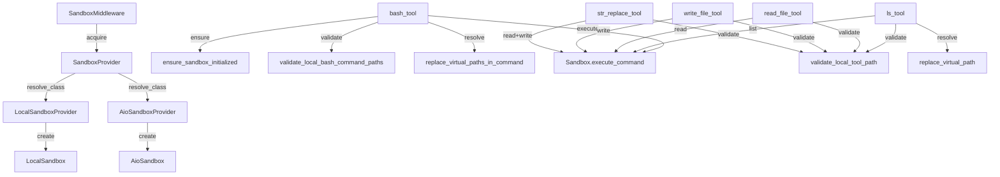
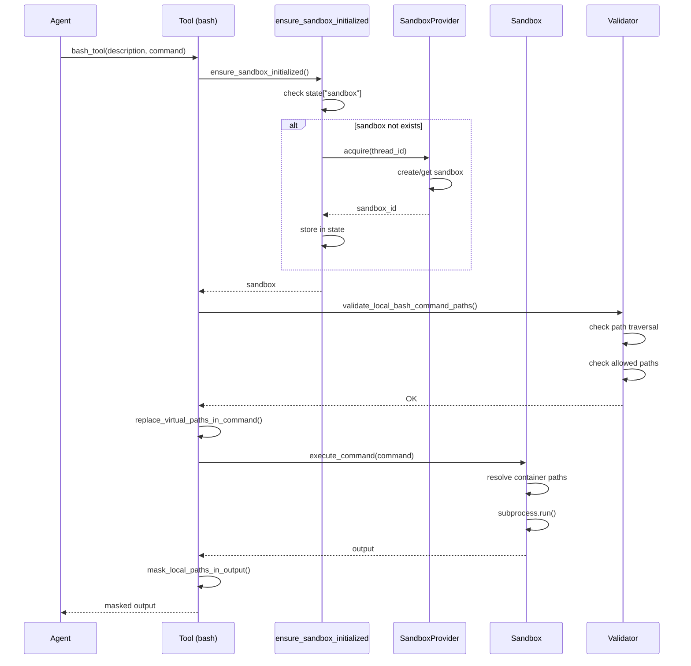

# 【08-沙箱系统】沙箱系统深度解析

> **源码路径**: `backend/packages/harness/deerflow/sandbox/`
> **核心文件**: 10个 Python 文件
> **实现**: 抽象接口 + 本地/Docker 提供者

---

## 一、设计思想

### 1.1 沙箱系统概述

DeerFlow 的沙箱系统为 AI Agent 提供了安全的代码执行环境，支持：

- **多种实现**: 本地文件系统 (`LocalSandbox`) 和 Docker 容器 (`AioSandboxProvider`)
- **虚拟路径系统**: Agent 看到统一的 `/mnt/` 路径，实际映射到不同物理位置
- **权限控制**: 细粒度的路径访问验证，防止路径遍历
- **懒加载初始化**: 首次工具调用时才创建沙箱，优化性能
- **生命周期管理**: 按线程隔离的沙箱环境，跨对话复用

### 1.2 架构设计原则

```
┌─────────────────────────────────────────────────────────────────┐
│                    Lead Agent 执行流程                          │
│                                                                 │
│  ┌─────────────────────────────────────────────────────────┐   │
│  │              SandboxMiddleware                          │   │
│  │   - lazy_init=True: 首次工具调用时初始化                │   │
│  │   - lazy_init=False: before_agent 时初始化              │   │
│  └────────────────────┬────────────────────────────────────┘   │
│                       ▼                                          │
│  ┌─────────────────────────────────────────────────────────┐   │
│  │              ensure_sandbox_initialized()               │   │
│  │   1. 检查 state["sandbox"]                              │   │
│  │   2. 若不存在，调用 provider.acquire(thread_id)          │   │
│  │   3. 存储到 state["sandbox"]["sandbox_id"]              │   │
│  └────────────────────┬────────────────────────────────────┘   │
│                       ▼                                          │
│  ┌─────────────────────────────────────────────────────────┐   │
│  │              SandboxProvider                            │   │
│  │   ┌─────────────────┐      ┌─────────────────┐          │   │
│  │   │ LocalSandbox    │      │ AioSandbox      │          │   │
│  │   │ (单例模式)      │      │ (Docker容器)    │          │   │
│  │   │ sandbox_id=     │      │ 按线程创建      │          │   │
│  │   │ "local"         │      │                 │          │   │
│  │   └─────────────────┘      └─────────────────┘          │   │
│  └────────────────────┬────────────────────────────────────┘   │
│                       ▼                                          │
│  ┌─────────────────────────────────────────────────────────┐   │
│  │              Sandbox 工具调用                            │   │
│  │   1. bash, ls, read_file, write_file, str_replace       │   │
│  │   2. 虚拟路径解析 (/mnt/user-data/*)                     │   │
│  │   3. 权限验证 (路径遍历检查)                             │   │
│  │   4. 输出掩码 (隐藏物理路径)                             │   │
│  └─────────────────────────────────────────────────────────┘   │
└─────────────────────────────────────────────────────────────────┘

┌─────────────────────────────────────────────────────────────────┐
│                     虚拟路径映射                                 │
│                                                                 │
│   Agent 视图              物理存储 (LocalSandbox)                │
│  ┌─────────────┐        ┌─────────────────────────────┐         │
│  │ /mnt/user-  │        │ {base_dir}/.deer-flow/       │         │
│  │   data/     │   ──►  │   threads/{thread_id}/       │         │
│  │   workspace │        │     user-data/               │         │
│  │   uploads   │        │       ├── workspace/         │         │
│  │   outputs   │        │       ├── uploads/           │         │
│  └─────────────┘        │       └── outputs/           │         │
│                         └─────────────────────────────┘         │
│                                                                 │
│  ┌─────────────┐        ┌─────────────────────────────┐         │
│  │ /mnt/skills │   ──►  │ deer-flow/skills/            │         │
│  └─────────────┘        └─────────────────────────────┘         │
│                                                                 │
│  ┌──────────────────┐    ┌─────────────────────────────┐         │
│  │ /mnt/acp-        │    │ {base_dir}/threads/          │         │
│  │   workspace/     │ ──►│   {thread_id}/acp-workspace/ │         │
│  └──────────────────┘    └─────────────────────────────┘         │
└─────────────────────────────────────────────────────────────────┘
```

### 1.3 核心设计决策

**为什么需要虚拟路径系统？**

1. **跨环境一致性**: Agent 无论在本地还是 Docker 容器中，看到的路径都一样
2. **安全性**: 隐藏主机文件系统实际结构，防止信息泄露
3. **可移植性**: 代码可以在不同环境间迁移而无需修改路径

**为什么使用懒加载初始化？**

1. **性能优化**: 不需要沙箱的对话不会创建沙箱
2. **资源节约**: 避免不必要的文件系统操作
3. **按需分配**: 只在首次工具调用时才创建线程目录

**为什么 LocalSandbox 不释放沙箱？**

1. **单例模式**: 整个应用共享同一个本地沙箱
2. **跨对话复用**: 避免每次对话都重新初始化
3. **无状态性**: 本地沙箱不需要清理操作

**为什么需要路径输出掩码？**

1. **用户体验**: 输出始终显示虚拟路径，不会暴露主机结构
2. **安全性**: 防止通过错误信息推断主机文件系统布局
3. **一致性**: 与 Agent 视图保持一致

---

## 二、模块架构

### 2.1 文件结构

```
deerflow/sandbox/
├── __init__.py              # 模块导出
├── sandbox.py               # 抽象沙箱接口
├── sandbox_provider.py      # 抽象提供者接口 + 单例获取
├── tools.py                 # 沙箱工具实现 (bash, ls, read_file, write_file, str_replace)
├── middleware.py            # 沙箱生命周期中间件
├── security.py              # 安全检查 (allow_host_bash)
├── exceptions.py            # 结构化异常定义
└── local/                   # 本地实现
    ├── __init__.py
    ├── local_sandbox.py     # 本地沙箱实现
    ├── local_sandbox_provider.py  # 本地提供者
    └── list_dir.py          # 目录列表工具
```

### 2.2 模块依赖图



### 2.3 工具调用流程



---

## 三、核心组件解析

### 3.1 抽象接口 (sandbox.py)

#### `Sandbox` 抽象基类

**源码位置**: `packages/harness/deerflow/sandbox/sandbox.py:4-72`

```python
class Sandbox(ABC):
    """Abstract base class for sandbox environments"""

    _id: str

    def __init__(self, id: str):
        self._id = id

    @property
    def id(self) -> str:
        return self._id

    @abstractmethod
    def execute_command(self, command: str) -> str:
        """Execute bash command in sandbox."""
        pass

    @abstractmethod
    def read_file(self, path: str) -> str:
        """Read the content of a file."""
        pass

    @abstractmethod
    def list_dir(self, path: str, max_depth=2) -> list[str]:
        """List the contents of a directory."""
        pass

    @abstractmethod
    def write_file(self, path: str, content: str, append: bool = False) -> None:
        """Write content to a file."""
        pass

    @abstractmethod
    def update_file(self, path: str, content: bytes) -> None:
        """Update a file with binary content."""
        pass
```

**设计解读**: 定义了沙箱必须提供的核心能力，支持不同的底层实现

### 3.2 提供者接口 (sandbox_provider.py)

#### `SandboxProvider` 抽象基类

**源码位置**: `packages/harness/deerflow/sandbox/sandbox_provider.py:8-36`

```python
class SandboxProvider(ABC):
    """Abstract base class for sandbox providers"""

    @abstractmethod
    def acquire(self, thread_id: str | None = None) -> str:
        """Acquire a sandbox environment and return its ID."""
        pass

    @abstractmethod
    def get(self, sandbox_id: str) -> Sandbox | None:
        """Get a sandbox environment by ID."""
        pass

    @abstractmethod
    def release(self, sandbox_id: str) -> None:
        """Release a sandbox environment."""
        pass
```

#### 单例获取函数

**源码位置**: `packages/harness/deerflow/sandbox/sandbox_provider.py:42-56`

```python
def get_sandbox_provider(**kwargs) -> SandboxProvider:
    """Get the sandbox provider singleton."""
    global _default_sandbox_provider
    if _default_sandbox_provider is None:
        config = get_app_config()
        cls = resolve_class(config.sandbox.use, SandboxProvider)
        _default_sandbox_provider = cls(**kwargs)
    return _default_sandbox_provider
```

**设计解读**: 通过反射加载配置的提供者类，支持运行时切换实现

### 3.3 本地沙箱实现 (local/local_sandbox.py)

#### 路径映射机制

**源码位置**: `packages/harness/deerflow/sandbox/local/local_sandbox.py:54-99`

```python
def _resolve_path(self, path: str) -> str:
    """Resolve container path to actual local path using mappings."""
    path_str = str(path)

    # Try each mapping (longest prefix first for more specific matches)
    for container_path, local_path in sorted(self.path_mappings.items(), key=lambda x: len(x[0]), reverse=True):
        if path_str == container_path or path_str.startswith(container_path + "/"):
            relative = path_str[len(container_path):].lstrip("/")
            resolved = str(Path(local_path) / relative) if relative else local_path
            return resolved

    return path_str
```

**设计要点**:
1. **最长前缀优先**: 避免短前缀误匹配
2. **边界检查**: 使用 `/` 确保是路径边界而非字符串中间

#### 命令路径解析

**源码位置**: `packages/harness/deerflow/sandbox/local/local_sandbox.py:137-167`

```python
def _resolve_paths_in_command(self, command: str) -> str:
    """Resolve container paths to local paths in a command string."""
    sorted_mappings = sorted(self.path_mappings.items(), key=lambda x: len(x[0]), reverse=True)

    if not sorted_mappings:
        return command

    # Match container path followed by optional path components
    patterns = [re.escape(container_path) + r"(?=/|$|[\s\"';&|<>()])(?:/[^\s\"']*)?" for container_path, _ in sorted_mappings]
    pattern = re.compile("|".join(f"({p})" for p in patterns))

    def replace_match(match: Match) -> str:
        matched_path = match.group(0)
        return self._resolve_path(matched_path)

    return pattern.sub(replace_match, command)
```

**安全考虑**: 前瞻断言 `(?=/|$|[\s\"';&|<()])` 确保路径边界匹配

#### 输出掩码

**源码位置**: `packages/harness/deerflow/sandbox/local/local_sandbox.py:101-135`

```python
def _reverse_resolve_paths_in_output(self, output: str) -> str:
    """Reverse resolve local paths back to container paths in output string."""
    sorted_mappings = sorted(self.path_mappings.items(), key=lambda x: len(x[1]), reverse=True)

    if not sorted_mappings:
        return output

    result = output
    for container_path, local_path in sorted_mappings:
        local_path_resolved = str(Path(local_path).resolve())
        escaped_local = re.escape(local_path_resolved)
        pattern = re.compile(escaped_local + r"(?:/[^\s\"';&|<>()]*)?")

        def replace_match(match: Match) -> str:
            matched_path = match.group(0)
            return self._reverse_resolve_path(matched_path)

        result = pattern.sub(replace_match, result)

    return result
```

### 3.4 沙箱工具 (tools.py)

#### 虚拟路径替换

**源码位置**: `packages/harness/deerflow/sandbox/tools.py:272-302`

```python
def replace_virtual_path(path: str, thread_data: ThreadDataState | None) -> str:
    """Replace virtual /mnt/user-data paths with actual thread data paths."""
    if thread_data is None:
        return path

    mappings = _thread_virtual_to_actual_mappings(thread_data)
    if not mappings:
        return path

    # Longest-prefix-first replacement with segment-boundary checks
    for virtual_base, actual_base in sorted(mappings.items(), key=lambda item: len(item[0]), reverse=True):
        if path == virtual_base:
            return actual_base
        if path.startswith(f"{virtual_base}/"):
            rest = path[len(virtual_base):].lstrip("/")
            return _join_path_preserving_style(actual_base, rest)

    return path
```

#### 路径验证

**源码位置**: `packages/harness/deerflow/sandbox/tools.py:416-459`

```python
def validate_local_tool_path(path: str, thread_data: ThreadDataState | None, *, read_only: bool = False) -> None:
    """Validate that a virtual path is allowed for local-sandbox access."""
    if thread_data is None:
        raise SandboxRuntimeError("Thread data not available for local sandbox")

    _reject_path_traversal(path)

    # Skills paths — read-only access only
    if _is_skills_path(path):
        if not read_only:
            raise PermissionError(f"Write access to skills path is not allowed: {path}")
        return

    # ACP workspace paths — read-only access only
    if _is_acp_workspace_path(path):
        if not read_only:
            raise PermissionError(f"Write access to ACP workspace is not allowed: {path}")
        return

    # User-data paths
    if path.startswith(f"{VIRTUAL_PATH_PREFIX}/"):
        return

    raise PermissionError(f"Only paths under {VIRTUAL_PATH_PREFIX}/, {_get_skills_container_path()}/, or {_ACP_WORKSPACE_VIRTUAL_PATH}/ are allowed")
```

#### Bash 工具

**源码位置**: `packages/harness/deerflow/sandbox/tools.py:760-792`

```python
@tool("bash", parse_docstring=True)
def bash_tool(runtime: ToolRuntime[ContextT, ThreadState], description: str, command: str) -> str:
    """Execute a bash command in a Linux environment."""
    try:
        sandbox = ensure_sandbox_initialized(runtime)
        if is_local_sandbox(runtime):
            if not is_host_bash_allowed():
                return f"Error: {LOCAL_HOST_BASH_DISABLED_MESSAGE}"
            ensure_thread_directories_exist(runtime)
            thread_data = get_thread_data(runtime)
            validate_local_bash_command_paths(command, thread_data)
            command = replace_virtual_paths_in_command(command, thread_data)
            command = _apply_cwd_prefix(command, thread_data)
            output = sandbox.execute_command(command)
            return mask_local_paths_in_output(output, thread_data)
        ensure_thread_directories_exist(runtime)
        return sandbox.execute_command(command)
    except SandboxError as e:
        return f"Error: {e}"
    except PermissionError as e:
        return f"Error: {e}"
    except Exception as e:
        return f"Error: Unexpected error executing command: {_sanitize_error(e, runtime)}"
```

### 3.5 懒加载初始化 (tools.py)

#### `ensure_sandbox_initialized()`

**源码位置**: `packages/harness/deerflow/sandbox/tools.py:666-720`

```python
def ensure_sandbox_initialized(runtime: ToolRuntime[ContextT, ThreadState] | None = None) -> Sandbox:
    """Ensure sandbox is initialized, acquiring lazily if needed.

    On first call, acquires a sandbox from the provider and stores it in runtime state.
    Subsequent calls return the existing sandbox.
    """
    if runtime is None:
        raise SandboxRuntimeError("Tool runtime not available")

    if runtime.state is None:
        raise SandboxRuntimeError("Tool runtime state not available")

    # Check if sandbox already exists in state
    sandbox_state = runtime.state.get("sandbox")
    if sandbox_state is not None:
        sandbox_id = sandbox_state.get("sandbox_id")
        if sandbox_id is not None:
            sandbox = get_sandbox_provider().get(sandbox_id)
            if sandbox is not None:
                runtime.context["sandbox_id"] = sandbox_id
                return sandbox

    # Lazy acquisition: get thread_id and acquire sandbox
    thread_id = runtime.context.get("thread_id") if runtime.context else None
    if thread_id is None:
        thread_id = runtime.config.get("configurable", {}).get("thread_id") if runtime.config else None
    if thread_id is None:
        raise SandboxRuntimeError("Thread ID not available in runtime context")

    provider = get_sandbox_provider()
    sandbox_id = provider.acquire(thread_id)

    # Update runtime state - this persists across tool calls
    runtime.state["sandbox"] = {"sandbox_id": sandbox_id}

    sandbox = provider.get(sandbox_id)
    if sandbox is None:
        raise SandboxNotFoundError("Sandbox not found after acquisition", sandbox_id=sandbox_id)

    runtime.context["sandbox_id"] = sandbox_id
    return sandbox
```

**设计要点**:
1. **状态持久化**: `runtime.state["sandbox"]` 跨工具调用共享
2. **线程隔离**: 通过 `thread_id` 区分不同对话
3. **上下文传播**: `runtime.context["sandbox_id"]` 用于后续释放

### 3.6 安全控制 (security.py)

#### 主机 Bash 访问控制

**源码位置**: `packages/harness/deerflow/sandbox/security.py:35-45`

```python
def is_host_bash_allowed(config=None) -> bool:
    """Return whether host bash execution is explicitly allowed."""
    if config is None:
        config = get_app_config()

    sandbox_cfg = getattr(config, "sandbox", None)
    if sandbox_cfg is None:
        return True
    if not uses_local_sandbox_provider(config):
        return True
    return bool(getattr(sandbox_cfg, "allow_host_bash", False))
```

**安全设计**:
1. **默认禁用**: `LocalSandboxProvider` 默认禁止主机 Bash
2. **明确配置**: 需要设置 `sandbox.allow_host_bash: true` 才允许
3. **清晰提示**: 禁用时显示详细说明和建议

---

## 四、配置与部署

### 4.1 配置选项

```yaml
# config.yaml
sandbox:
  use: "deerflow.sandbox.local:LocalSandboxProvider"  # 或 Docker 提供者
  allow_host_bash: false  # 仅对 LocalSandboxProvider 有效

skills:
  path: "skills"
  container_path: "/mnt/skills"  # 虚拟路径
```

### 4.2 虚拟路径映射

| 虚拟路径 | 物理路径 | 权限 |
|----------|----------|------|
| `/mnt/user-data/workspace` | `.deer-flow/threads/{thread_id}/user-data/workspace` | 读写 |
| `/mnt/user-data/uploads` | `.deer-flow/threads/{thread_id}/user-data/uploads` | 读写 |
| `/mnt/user-data/outputs` | `.deer-flow/threads/{thread_id}/user-data/outputs` | 读写 |
| `/mnt/skills` | `deer-flow/skills/` | 只读 |
| `/mnt/acp-workspace` | `.deer-flow/threads/{thread_id}/acp-workspace/` | 只读 |

---

## 五、可复用代码模板

### 5.1 虚拟路径映射模板

```python
"""Virtual path mapping template."""

import re
from pathlib import Path
from typing import Dict

class VirtualPathMapper:
    """Bidirectional path mapping between virtual and physical paths."""

    def __init__(self, mappings: Dict[str, str]):
        """Initialize with virtual->physical mappings."""
        self.mappings = mappings

    def resolve(self, virtual_path: str) -> str:
        """Resolve virtual path to physical path."""
        for virtual_base, physical_base in sorted(
            self.mappings.items(),
            key=lambda x: len(x[0]),
            reverse=True
        ):
            if virtual_path == virtual_base:
                return physical_base
            if virtual_path.startswith(f"{virtual_base}/"):
                rest = virtual_path[len(virtual_base):].lstrip("/")
                return str(Path(physical_base) / rest)
        return virtual_path

    def mask(self, output: str) -> str:
        """Mask physical paths back to virtual paths."""
        result = output
        for virtual_base, physical_base in sorted(
            self.mappings.items(),
            key=lambda x: len(x[1]),
            reverse=True
        ):
            pattern = re.compile(re.escape(physical_base) + r"(?:/[^\s\"';&|<>()]*)?")
            result = pattern.sub(lambda m: self._reverse(m, virtual_base, physical_base), result)
        return result

    def _reverse(self, match: re.Match, virtual_base: str, physical_base: str) -> str:
        matched = match.group(0)
        if matched == physical_base:
            return virtual_base
        relative = matched[len(physical_base):].lstrip("/\\")
        return f"{virtual_base}/{relative}" if relative else virtual_base
```

### 5.2 路径遍历检查模板

```python
"""Path traversal validation template."""

def reject_path_traversal(path: str) -> None:
    """Reject paths containing '..' segments."""
    normalized = path.replace("\\", "/")
    for segment in normalized.split("/"):
        if segment == "..":
            raise PermissionError("Access denied: path traversal detected")

def validate_path_in_bounds(path: Path, allowed_root: Path) -> None:
    """Ensure resolved path stays within allowed root."""
    resolved = path.resolve()
    try:
        resolved.relative_to(allowed_root.resolve())
    except ValueError:
        raise PermissionError("Access denied: path traversal detected")
```

### 5.3 懒加载初始化模板

```python
"""Lazy initialization template for runtime resources."""

from typing import Any, Dict, Optional

class LazyResource:
    """Resource that initializes on first access."""

    def __init__(self, factory, key: str = "resource"):
        self._factory = factory
        self._key = key
        self._instance: Optional[Any] = None

    def get(self, runtime_state: Dict[str, Any]) -> Any:
        """Get or initialize resource."""
        # Check state first
        if self._key in runtime_state:
            return runtime_state[self._key]

        # Initialize if needed
        if self._instance is None:
            self._instance = self._factory()
            runtime_state[self._key] = self._instance

        return self._instance
```

### 5.4 命令路径替换模板

```python
"""Command path replacement template."""

import re
from typing import Dict, Tuple

def replace_paths_in_command(command: str, mappings: Dict[str, str]) -> str:
    """Replace mapped paths in a command string."""
    if not mappings:
        return command

    # Sort by length (longest first) for correct prefix matching
    sorted_mappings = sorted(mappings.items(), key=lambda x: len(x[0]), reverse=True)

    # Build pattern with boundary checks
    patterns = [
        re.escape(old) + r"(?=/|$|[\s\"';&|<>()])(?:/[^\s\"';&|<>()]*)?"
        for old, _ in sorted_mappings
    ]
    pattern = re.compile("|".join(f"({p})" for p in patterns))

    def replace(match: re.Match) -> str:
        matched = match.group(0)
        for old, new in sorted_mappings:
            if matched.startswith(old):
                relative = matched[len(old):].lstrip("/")
                return f"{new}/{relative}" if relative else new
        return matched

    return pattern.sub(replace, command)
```

---

## 六、踩坑提醒

### 6.1 路径边界匹配

**问题**: `/mnt/skills` 误匹配 `/mnt/skills-extra`

**解决方案**: 前瞻断言确保路径边界

```python
# 错误: 可能匹配 /mnt/skills-extra
pattern = re.compile(re.escape("/mnt/skills") + r"/.*")

# 正确: 使用边界检查
pattern = re.compile(re.escape("/mnt/skills") + r"(?=/|$)")
```

### 6.2 Windows 路径分隔符

**问题**: Windows 使用 `\`，正则表达式转义问题

**解决方案**: 统一规范化为 `/` 或使用原始字符串

```python
# 规范化路径
normalized = path.replace("\\", "/")

# 或使用 re.escape 转义
escaped = re.escape(path).replace(r"\\", r"[/\\]")
```

### 6.3 输出掩码遗漏

**问题**: 错误信息中包含物理路径

**解决方案**: 统一使用掩码函数

```python
try:
    result = sandbox.execute_command(command)
except Exception as e:
    return f"Error: {_sanitize_error(e, runtime)}"
```

### 6.4 路径解析竞争条件

**问题**: 并发调用时路径解析可能不一致

**解决方案**: 使用锁或确保映射初始化完成

```python
class LocalSandboxProvider:
    def __init__(self):
        # 在初始化时完成路径映射
        self._path_mappings = self._setup_path_mappings()
```

### 6.5 懒加载状态传播

**问题**: `runtime.state` 修改不传播到后续调用

**解决方案**: 同时更新 `runtime.context`

```python
runtime.state["sandbox"] = {"sandbox_id": sandbox_id}
runtime.context["sandbox_id"] = sandbox_id  # 确保 context 可用
```

---

## 七、源码覆盖清单

### 已覆盖文件 (10/10)

| 文件 | 覆盖内容 |
|------|----------|
| `__init__.py` | 模块导出 |
| `sandbox.py` | 抽象沙箱接口 |
| `sandbox_provider.py` | 提供者接口、单例获取 |
| `tools.py` | 工具实现、路径验证、懒加载 |
| `middleware.py` | 生命周期管理 |
| `security.py` | 主机 Bash 访问控制 |
| `exceptions.py` | 结构化异常 |
| `local/local_sandbox.py` | 本地沙箱实现 |
| `local/local_sandbox_provider.py` | 本地提供者 |
| `local/list_dir.py` | 目录列表工具 |

---

## 八、术语表

| 术语 | 说明 |
|------|------|
| 虚拟路径 | Agent 看到的统一路径 (/mnt/*) |
| 物理路径 | 实际文件系统路径 |
| 路径映射 | 虚拟路径到物理路径的转换 |
| 懒加载 | 延迟到首次使用时初始化 |
| 路径遍历 | 通过 `..` 逃逸允许目录的攻击 |
| 掩码 | 隐藏敏感信息的输出处理 |

---

## 九、相关文档

- `docs/ARCHITECTURE.md` - 整体架构
- `docs/PATH_EXAMPLES.md` - 路径类型详解
- `docs/GUARDRAILS.md` - 安全护栏配置

---

**文档版本**: v1.0
**生成时间**: 2026-04-01
**作者**: doc-writer @ deer-flow-docs
