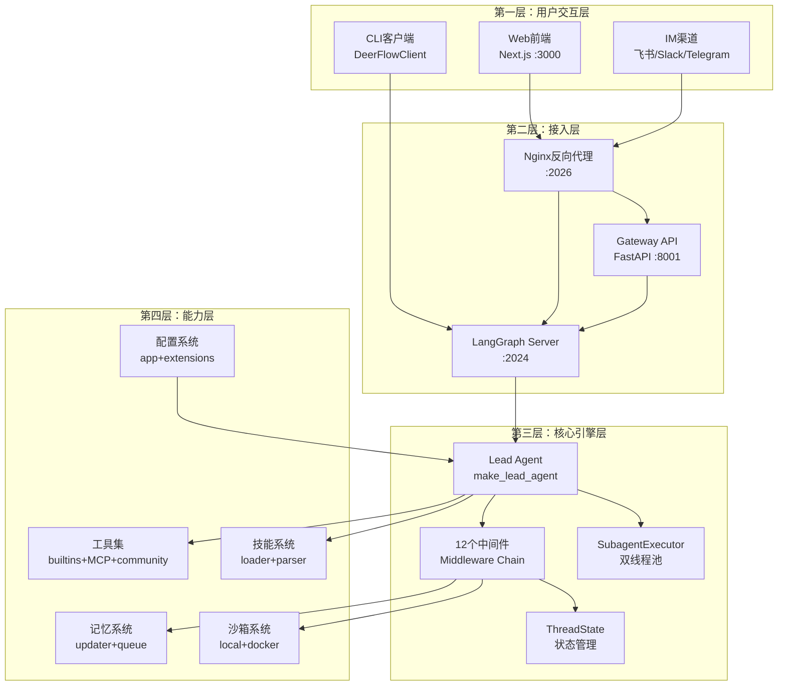
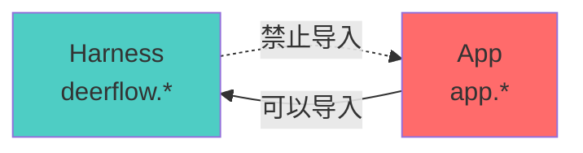
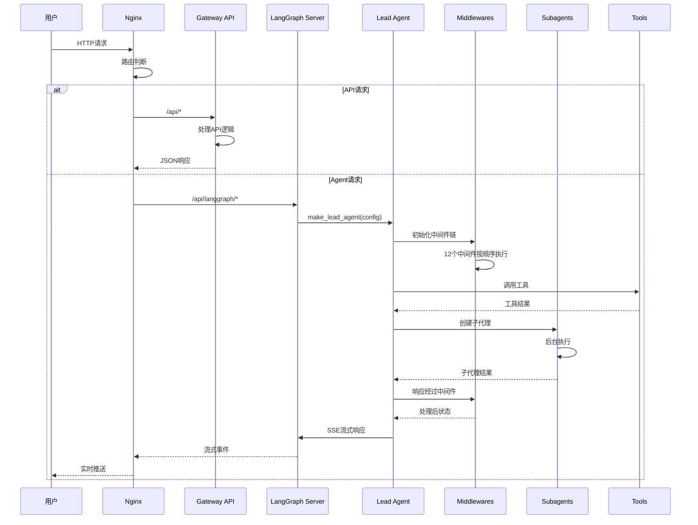
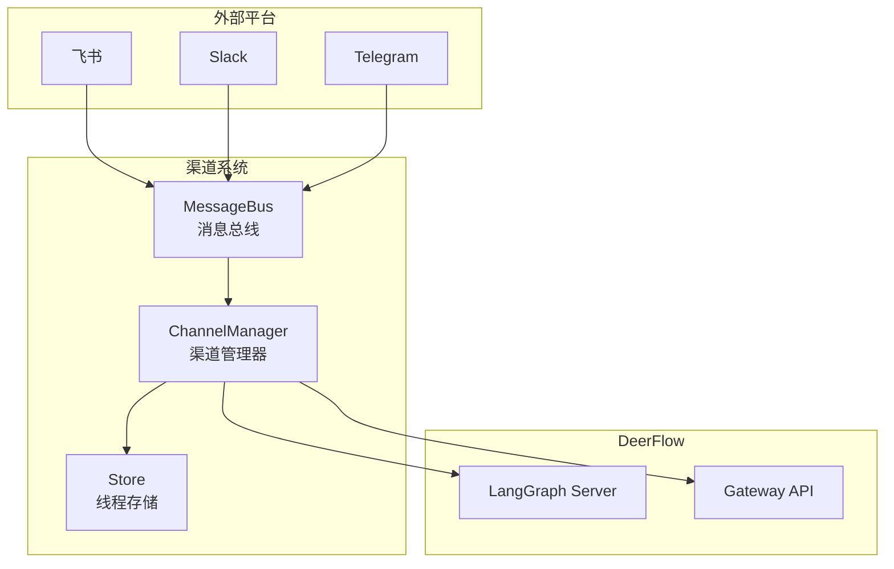

# 【文档09】系统架构全景图 —— 各层如何协作

## 1. 五分钟速览

**这篇文档解决什么问题？**

如果你想了解：
- DeerFlow内部是怎么组织的？
- 各层之间如何协作？
- 一个请求从进入到响应经过了什么？

那么这篇文档给你**系统架构的完整认知**。

**阅读后你将获得**：
- DeerFlow的四层架构图
- 请求处理的完整链路
- Harness/App分离的设计思想
- 面试时关于架构问题的精炼回答

---

## 2. DeerFlow的四层架构

### 2.1 整体架构图



### 2.2 各层职责说明

| 层级 | 组件 | 核心职责 | 为什么需要这一层 |
|------|------|----------|-----------------|
| **用户交互层** | Web前端 | 提供Web界面 | 用户习惯不同，需要Web访问 |
| | IM渠道 | 飞书/Slack/Telegram集成 | 用户日常使用的通讯工具 |
| | CLI客户端 | 嵌入式Python客户端 | 程序化访问，不需要HTTP |
| **接入层** | Nginx | 统一反向代理 | 单一入口，路由分发 |
| | Gateway API | REST API | 模型、技能、记忆等管理API |
| | LangGraph Server | Agent运行时 | 状态图执行，流式响应 |
| **核心引擎层** | Lead Agent | 任务理解和规划 | AI决策的核心 |
| | 中间件链 | 请求处理管道 | 职责分离，灵活组合 |
| | ThreadState | 状态管理 | 维护对话状态 |
| | SubagentExecutor | 子代理执行 | 后台任务执行 |
| **能力层** | 工具集 | 外部函数调用 | AI与真实世界交互 |
| | 技能系统 | 可复用能力 | 复用常见任务流程 |
| | 记忆系统 | 长期记忆 | 跨会话知识积累 |
| | 沙箱系统 | 代码执行 | 安全执行AI生成的代码 |
| | 配置系统 | 配置管理 | 驱动系统行为 |

---

## 3. Harness/App分离设计

### 3.1 依赖方向



### 3.2 分层说明

| 层 | 目录 | 导入前缀 | 说明 |
|---|------|----------|------|
| **Harness** | `backend/packages/harness/deerflow/` | `deerflow.*` | 可发布的Agent框架包 |
| **App** | `backend/app/` | `app.*` | 未发布的应用代码 |

**依赖规则**：
- ✅ App可以导入Harness（`from deerflow.config import get_app_config`）
- ❌ Harness禁止导入App（CI通过`test_harness_boundary.py`强制执行）

**设计考量**：
```
为什么这样分离？

1. Harness是可复用的框架
   → 可以独立发布
   → 其他项目可以用
   → 不依赖应用代码

2. App是特定的应用
   → 包含Gateway API
   → 包含IM渠道集成
   → DeerFlow特有的

3. 依赖单向
   → 框架不依赖应用
   → 框架更稳定
   → 应用可以灵活变化
```

---

## 4. 请求处理的完整链路

### 4.1 端到端流程图



### 4.2 Nginx路由规则

```
Nginx (:2026) 路由规则：

/api/langgraph/*     → LangGraph Server (:2024)
  → Agent执行、流式响应

/api/*              → Gateway API (:8001)
  → 模型管理、技能管理、记忆管理、上传等

/*                  → Frontend (:3000)
  → Web界面
```

### 4.3 数据流向分析

```
请求数据流：
用户输入 → Nginx → LangGraph → Lead Agent → 中间件链 → 工具/子代理 → 结果返回

响应数据流：
工具结果 → 子代理结果 → Lead Agent整合 → 中间件处理 → LangGraph SSE → Nginx → 用户展示

状态数据流：
执行过程 → ThreadState → 检查点保存 → 存储（PostgreSQL/SQLite）
```

---

## 5. Gateway API详解

### 5.1 API路由结构

```
Gateway API (:8001) 路由：

/api/models        → 模型管理
  GET  /           → 列出所有模型
  GET  /{name}     → 获取模型详情

/api/mcp           → MCP服务器管理
  GET  /config     → 获取MCP配置
  PUT  /config     → 更新MCP配置

/api/skills        → 技能管理
  GET  /           → 列出所有技能
  GET  /{name}     → 获取技能详情
  PUT  /{name}     → 更新技能启用状态
  POST /install    → 安装技能包

/api/memory        → 记忆管理
  GET  /           → 获取记忆数据
  POST /reload     → 强制重新加载
  GET  /config     → 获取记忆配置
  GET  /status     → 获取记忆状态

/api/uploads       → 文件上传
  POST /           → 上传文件

/api/artifacts     → 工件管理
  GET  /{path}     → 获取工件内容

/api/threads       → 线程管理
  DELETE /{id}     → 删除线程数据
```

### 5.2 配置系统

**双配置文件**：

```yaml
# config.yaml - 主配置
models: [...]          # 模型配置
tools: [...]           # 工具配置
sandbox: {...}         # 沙箱配置
skills: {...}          # 技能配置
memory: {...}          # 记忆配置
```

```json
// extensions_config.json - 扩展配置
{
  "mcpServers": {},    // MCP服务器配置
  "skills": {}          // 技能启用状态
}
```

**配置优先级**：
1. 显式指定的config_path
2. 环境变量
3. 当前目录的配置文件
4. 父目录的配置文件（推荐）

---

## 6. LangGraph Server详解

### 6.1 langgraph.json配置

```json
{
  "node_id": "deerflow",
  "entry_point": "make_lead_agent",
  "transport": "sse",
  "endpoints": {
    "": {
      "url": "http://localhost:2024"
    }
  }
}
```

### 6.2 状态图执行

```
LangGraph状态图执行流程：

1. 客户端连接
   → POST /threads 或 GET /threads/{thread_id}

2. 创建运行时
   → make_lead_agent(config)
   → 构建中间件链
   → 创建状态图

3. 执行状态图
   → 输入 → Lead Agent → 中间件 → 工具/子代理
   → 更新状态

4. 流式响应
   → SSE推送事件
   → events: ["values", "messages-tuple", "end"]
```

---

## 7. IM渠道系统

### 7.1 渠道架构



### 7.2 消息流程

```
外部平台 → Channel实现 → MessageBus.publish_inbound()
                                    ↓
                    ChannelManager._dispatch_loop()
                                    ↓
                查找/创建thread → LangGraph Server
                                    ↓
                    流式执行 → MessageBus.publish_outbound()
                                    ↓
                            Channel实现 → 平台回复
```

---

## 8. 设计思想

### 8.1 为什么四层架构？

```
设计考量：

1. 关注点分离
   → 每层只关注自己的职责
   → 用户交互不关心核心引擎
   → 核心引擎不关心接入方式

2. 独立部署
   → 前端可以独立部署
   → Gateway可以独立扩展
   → LangGraph可以独立维护

3. 技术栈灵活
   → 前端可以用React/Vue
   → 后端可以用FastAPI/Flask
   → 引擎可以用LangGraph/其他

4. 团队协作
   → 前端团队专注前端
   → 后端团队专注API
   → 引擎团队专注核心
```

### 8.2 为什么Harness/App分离？

```
设计考量：

1. 可复用性
   → Harness可以独立使用
   → 其他项目可以复用
   → 不依赖特定应用

2. 稳定性
   → 框架不依赖应用
   → 应用变化不影响框架
   → 框架更稳定

3. 测试边界
   → test_harness_boundary.py强制执行
   → CI自动检测违规导入
   → 保证架构清晰

4. 发布策略
   → Harness可以发布到PyPI
   → App是DeerFlow特有的
   → 便于版本管理
```

### 8.3 为什么12个中间件？

```
设计考量：

1. 职责单一
   → 每个中间件只做一件事
   → ThreadData只管理线程数据
   → Memory只管理记忆

2. 固定顺序
   → 有严格的依赖关系
   → ThreadData必须在最前
   → Clarification必须在最后

3. 可插拔
   → 中间件可以灵活添加/删除
   → 但顺序必须遵守
   → 通过配置控制启用

4. 横切关注点
   → 认证、日志、监控等
   → 不污染业务逻辑
   → 集中管理
```

---

## 9. 面试要点

### Q1: DeerFlow的系统架构是怎样的？

**参考回答**：
```
DeerFlow采用四层架构：

1. 用户交互层：Web前端、IM渠道、CLI客户端
2. 接入层：Nginx反向代理、Gateway API、LangGraph Server
3. 核心引擎层：Lead Agent、12个中间件、ThreadState、SubagentExecutor
4. 能力层：工具集、技能系统、记忆系统、沙箱系统、配置系统

端口分配：
→ Nginx :2026（统一入口）
→ Gateway :8001（API）
→ LangGraph :2024（Agent运行时）
→ Frontend :3000（Web）

为什么分层？
→ 职责分离，变更隔离
→ 独立部署，灵活扩展
→ 团队协作，提高效率
```

### Q2: Harness和App是什么关系？

**参考回答**：
```
Harness和App是DeerFlow后端的两个分层：

Harness (packages/harness/deerflow/):
→ 可发布的Agent框架包
→ 导入前缀：deerflow.*
→ 包含：Agent系统、工具、沙箱、模型、技能等

App (backend/app/):
→ 未发布的应用代码
→ 导入前缀：app.*
→ 包含：Gateway API、IM渠道集成

依赖规则：
→ App可以导入Harness
→ Harness禁止导入App（CI强制执行）

为什么这样设计？
→ Harness可复用，可以独立发布
→ App是DeerFlow特有的应用层
→ 框架不依赖应用，更稳定
```

### Q3: 一个请求从进入到响应的完整流程是什么？

**参考回答**：
```
完整流程：

1. 用户请求 → Nginx (:2026)
2. Nginx路由判断：
   → /api/langgraph/* → LangGraph Server
   → /api/* → Gateway API
   → /* → Frontend

3. LangGraph处理：
   → make_lead_agent创建Agent
   → 初始化12个中间件
   → 执行状态图
   → SSE流式响应

4. 中间件处理：
   → ThreadData → Uploads → Sandbox → ...
   → 工具调用、子代理执行
   → ... → Memory → Clarification

5. 响应返回：
   → SSE事件推送
   → Nginx转发
   → 用户收到实时响应

关键：中间件链是请求处理的核心管道。
```

### Q4: Gateway API的作用是什么？

**参考回答**：
```
Gateway API是DeerFlow的管理API层：

核心功能：
1. 模型管理：列出、查询模型
2. MCP管理：配置MCP服务器
3. 技能管理：列出、启用/禁用技能
4. 记忆管理：查看、重载记忆
5. 文件上传：上传文件到线程
6. 工件管理：获取Agent生成的文件
7. 线程管理：删除线程数据

为什么需要Gateway？
→ LangGraph专注于Agent执行
→ Gateway提供管理和配置功能
→ 职责分离，各司其职
```

### Q5: 中间件的执行顺序为什么重要？

**参考回答**：
```
中间件顺序必须严格遵守：

1. ThreadDataMiddleware必须在最前
   → 后续中间件需要thread_id
   → 创建线程专属目录

2. UploadsMiddleware在ThreadData之后
   → 需要访问thread_id目录
   → 跟踪上传的文件

3. SandboxMiddleware在Uploads之后
   → 可能有上传文件需要处理

4. ClarificationMiddleware必须在最后
   → 需要拦截所有可能的澄清请求
   → 一旦拦截就中断执行

5. MemoryMiddleware在TitleMiddleware之后
   → 标题生成后才开始记录对话

顺序错了会导致：
→ 拿不到需要的数据
→ 检查不到就执行了
→ 功能异常
```

---

## 10. 延伸思考

### 10.1 Nginx的作用

```
为什么需要Nginx？

1. 统一入口
   → 单一端口暴露服务
   → 简化客户端配置

2. 路由分发
   → 根据路径路由到不同服务
   → 隐藏内部服务结构

3. 负载均衡
   → 可以配置多实例
   → 提高可用性

4. 静态文件服务
   → 前端静态资源
   → 提高性能
```

### 10.2 CLI客户端的优势

```
DeerFlowClient的优势：

1. 嵌入式使用
   → 不需要启动HTTP服务
   → 直接在Python代码中使用

2. 性能更好
   → 没有HTTP开销
   → 直接函数调用

3. 测试友好
   → 单元测试更方便
   → 不需要Mock HTTP

4. 返回类型一致
   → 与Gateway API返回格式一致
   → 代码可以无缝切换
```

### 10.3 配置热重载

```
配置热重载机制：

config.yaml:
→ get_app_config()缓存配置
→ 检测文件mtime变化
→ 自动重新加载

extensions_config.json:
→ ExtensionsConfig.from_file()每次读取最新
→ Gateway API修改后立即生效
→ LangGraph检测变化

好处：
→ 不需要重启服务
→ 配置更改实时生效
→ 提高开发效率
```

---

## 11. 思考问题

### 11.1 理解检验

1. DeerFlow分为哪四层？每层的职责是什么？
2. Harness和App的区别是什么？依赖关系如何？
3. 12个中间件的执行顺序是什么？为什么这样排序？

### 11.2 设计思考

4. 为什么要用Nginx作为统一入口？
5. 配置系统为什么分成两个文件？
6. IM渠道系统如何与LangGraph通信？

### 11.3 场景应用

7. 如果要在生产环境部署，应该如何配置Nginx？
8. 如果要添加一个新的API端点，应该在哪里添加？
9. 如果要支持新的IM平台，需要实现哪些接口？

---

## 12. 本篇小结

**核心要点**：

1. **四层架构**：用户交互层、接入层、核心引擎层、能力层
2. **Harness/App分离**：可复用框架 vs 特定应用
3. **端口分配**：Nginx:2026、Gateway:8001、LangGraph:2024、Frontend:3000
4. **请求流程**：Nginx路由 → LangGraph执行 → SSE流式响应
5. **设计价值**：职责分离、独立部署、灵活扩展

**你现在已经理解了系统架构**，下一篇我们将深入**代理系统**，看看Agent和Sub-Agent如何协作。

---

## 13. 文档衔接

**本篇完结**，下一篇将解析：【10-代理系统：Agent到底是什么】

**衔接说明**：
- 09篇解决了"系统怎么组织"的问题
- 10篇将解决"核心组件Agent是什么"的问题
- Agent是系统的核心，理解Agent才能理解整个系统
- 理解代理系统后，才能理解记忆、工具、沙箱等概念
