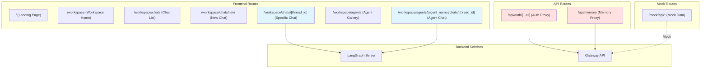

# 【文档编号+模块名】09 - 页面路由系统

## 1. 模块全局定位

- **所属项目**: deer-flow
- **层级位置**: 用户交互层 / frontend/src/app/
- **核心作用**: 定义应用的页面结构、路由规则和导航逻辑，负责将 URL 映射到对应的页面组件
- **业务价值**: 在 AI 工作流系统中承担"页面组织者"的角色，通过路由实现多会话管理、Agent 切换、设置访问等功能
- **设计初衷**: 该模块是为了解决"如何组织复杂的页面结构"这一需求而设计的。为什么选择 Next.js App Router？因为 App Router 基于文件系统的路由约定优于手动配置路由，且原生支持 React Server Components，可以提升性能。

---

## 2. 依赖&调用链路 Mermaid 图



### 图表设计解读

**说明**: 该图展示了 DeerFlow 前端的路由结构，包括页面路由、API 路由和 Mock 路由三类。

**为什么采用这样的路由分类？**
1. **页面路由（用户可见）**: `/workspace/chats/[thread_id]` 等路由直接对应浏览器地址栏，用户可以书签、分享。为什么用动态路由 `[thread_id]`？因为每个会话有唯一 ID，动态路由可以复用同一个页面组件，避免创建数百个几乎相同的页面文件。

2. **API 路由（服务端代理）**: `/api/memory` 等路由用于代理后端请求。为什么需要前端 API 路由？因为：
   - 隐藏后端真实地址，提高安全性
   - 统一处理 CORS、认证等逻辑
   - 可以在服务端做数据预处理

3. **Mock 路由（开发测试）**: `/mock/api/*` 用于前端独立开发。为什么需要 Mock？因为前端开发者可能没有完整的后端环境，Mock 路由可以返回假数据，保证前端开发不阻塞。

**上下游模块的调用顺序是基于什么设计考量？**
用户访问 URL → Next.js 匹配路由 → 加载对应的 page.tsx → 执行 layout.tsx（如果有）→ 渲染组件。这样的设计保证了：
- Layout 在 Page 之前渲染，可以提供共享的 UI（侧边栏、导航栏）
- 嵌套路由（如 `/workspace/chats/[thread_id]`）可以继承父路由的 Layout

---

## 3. 核心目录/文件清单

```
frontend/src/app/
├── layout.tsx                    # 根布局（ThemeProvider + I18nProvider）
├── page.tsx                      # 首页（落地页）
│
├── workspace/                    # 工作区路由组
│   ├── layout.tsx                # 工作区布局（Sidebar + QueryClientProvider）
│   ├── page.tsx                  # 工作区首页（重定向逻辑）
│   │
│   ├── chats/                    # 聊天相关路由
│   │   ├── page.tsx              # 聊天列表页
│   │   └── [thread_id]/          # 动态路由：特定会话
│   │       ├── layout.tsx        # 聊天布局（Provider 嵌套）
│   │       └── page.tsx          # 聊天页面（核心界面）
│   │
│   └── agents/                   # Agent 相关路由
│       ├── page.tsx              # Agent 画廊
│       ├── new/                  # 新建 Agent
│       │   └── page.tsx
│       └── [agent_name]/         # 动态路由：特定 Agent
│           └── chats/
│               └── [thread_id]/  # Agent 聊天页面
│                   ├── layout.tsx
│                   └── page.tsx
│
├── api/                          # API 路由（服务端代理）
│   ├── auth/
│   │   └── [...all]/             # 全匹配路由：认证代理
│   │       └── route.ts
│   └── memory/
│       └── route.ts              # 记忆系统代理
│
└── mock/                         # Mock 路由（开发测试）
    └── api/
        ├── skills/route.ts
        ├── threads/
        │   ├── [thread_id]/
        │   │   ├── artifacts/
        │   │   │   └── [[...artifact_path]]/  # 可选捕获路由
        │   │   └── history/route.ts
        └── search/route.ts
```

**每个文件的设计定位是什么？**

- **layout.tsx（根布局）**: 提供全局 Provider，为什么在根布局？因为 Provider 需要包裹所有页面，确保整个应用都能访问主题、国际化等能力。

- **workspace/layout.tsx（工作区布局）**: 提供侧边栏和 QueryClientProvider，为什么不在根布局？因为落地页（首页）不需要侧边栏和查询缓存，分层布局可以避免首页加载不必要的组件。

- **page.tsx（首页）**: 纯展示页面，为什么用 Server Component？因为首页不需要交互，使用 Server Component 可以减少客户端 JavaScript 体积，提升首屏加载速度。

- **workspace/page.tsx（工作区首页）**: 为什么是重定向逻辑？因为用户访问 `/workspace` 时，应该自动跳转到有意义的页面（如新建会话或第一个会话），而不是显示空白页。

- **[thread_id]/page.tsx（聊天页面）**: 核心页面，为什么用 Client Component？因为需要处理用户交互（发送消息、停止生成等），必须使用 `"use client"`。

- **api/**: 为什么需要 API 路由？因为某些操作（如认证、记忆管理）需要在服务端执行，不能暴露在客户端。

**文件之间的设计关联是什么？**
- 嵌套路由的 Layout 会包裹子路由的 Page
- 父路由的 Provider 会被子路由访问
- API 路由和页面路由相互独立，API 路由不会影响页面渲染

---

## 4. 关键源码深度解析

### 4.1 工作区布局 - 侧边栏与查询缓存

**文件路径**: `/data/deer-flow-main/frontend/src/app/workspace/layout.tsx`

**功能概述**: 工作区的共享布局，提供侧边栏、命令面板、Toast 通知，以及 TanStack Query 的客户端 Provider。

```typescript
"use client";

import { QueryClient, QueryClientProvider } from "@tanstack/react-query";
import { useCallback, useEffect, useLayoutEffect, useState } from "react";
import { Toaster } from "sonner";

import { SidebarInset, SidebarProvider } from "@/components/ui/sidebar";
import { CommandPalette } from "@/components/workspace/command-palette";
import { WorkspaceSidebar } from "@/components/workspace/workspace-sidebar";
import { getLocalSettings, useLocalSettings } from "@/core/settings";

const queryClient = new QueryClient();

export default function WorkspaceLayout({
  children,
}: Readonly<{ children: React.ReactNode }>) {
  const [settings, setSettings] = useLocalSettings();
  const [open, setOpen] = useState(false); // SSR default: open (matches server render)
  useLayoutEffect(() => {
    // Runs synchronously before first paint on client — no visual flash
    setOpen(!getLocalSettings().layout.sidebar_collapsed);
  }, []);
  useEffect(() => {
    setOpen(!settings.layout.sidebar_collapsed);
  }, [settings.layout.sidebar_collapsed]);
  const handleOpenChange = useCallback(
    (open: boolean) => {
      setOpen(open);
      setSettings("layout", { sidebar_collapsed: !open });
    },
    [setSettings],
  );
  return (
    <QueryClientProvider client={queryClient}>
      <SidebarProvider
        className="h-screen"
        open={open}
        onOpenChange={handleOpenChange}
      >
        <WorkspaceSidebar />
        <SidebarInset className="min-w-0">{children}</SidebarInset>
      </SidebarProvider>
      <CommandPalette />
      <Toaster position="top-center" />
    </QueryClientProvider>
  );
}
```

### 逐行解读（含设计考量）

**第 1 行**: `"use client";`
- 为什么要标注？因为使用了 React Hooks（useState、useEffect）和交互组件（Sidebar），必须是 Client Component。

**第 12 行**: `const queryClient = new QueryClient();`
- **为什么在组件外部创建？** 因为 QueryClient 不应该随着组件重新渲染而重新创建，否则会导致缓存失效。这是 React Query 的最佳实践——在组件树顶层创建单例客户端。

**第 17 行**: `const [open, setOpen] = useState(false);`
- **为什么默认值是 false？** 注释说"SSR default: open"，这看起来矛盾。实际上，初始值会被 `useLayoutEffect` 立即覆盖，设置为 false 是为了防止服务端渲染时的闪烁（服务端不知道用户的侧边栏偏好）。

**第 19-22 行**: `useLayoutEffect` 同步设置
- **为什么用 useLayoutEffect 而非 useEffect？** 因为 `useLayoutEffect` 在浏览器绘制前执行，可以避免视觉闪烁。如果用 `useEffect`，用户会先看到侧边栏展开，然后突然收起，体验不佳。
- **设计考量**: 这是性能优化的典型案例——同步更新 DOM，避免重绘。

**第 23-25 行**: `useEffect` 监听设置变化
- **为什么需要两个 effect？** `useLayoutEffect` 只在组件挂载时执行一次，用于初始化；`useEffect` 监听后续的设置变化。两者配合确保初始化和更新都能正确处理。

**第 26-32 行**: `handleOpenChange` 回调
- **设计目的**: 用户手动展开/收起侧边栏时，同步更新状态和设置。
- **为什么用 useCallback？** 因为这个函数会被传递给子组件（SidebarProvider），用 useCallback 避免子组件不必要的重渲染。

**第 34-45 行**: Provider 嵌套
- **为什么 QueryClientProvider 在最外层？** 因为所有工作区页面都需要访问查询缓存，放在外层确保子组件都能使用 `useQuery` 和 `useMutation`。
- **为什么 SidebarProvider 包裹 children？** 因为 SidebarProvider 使用 React Context 提供侧边栏状态，子组件（如 WorkspaceSidebar）需要访问这个状态。
- **为什么 CommandPalette 和 Toaster 在 Provider 外部？** 因为它们是全局组件，不依赖特定的 Context。

**设计考量**：
1. **为什么需要侧边栏？** 侧边栏提供导航、会话列表、设置入口，是 Web 应用的标准交互模式。
2. **为什么需要 QueryClientProvider？** 服务端状态管理是现代前端的核心需求，TanStack Query 提供了缓存、重试、轮询等功能。
3. **为什么需要 Toaster？** 用户操作需要反馈（成功/失败提示），Toast 是轻量级的通知方式。

**如果不这样写会有什么问题？**
- 如果不用 `useLayoutEffect`：侧边栏会闪烁
- 如果 QueryClient 在组件内部创建：每次渲染都会重新创建，缓存失效
- 如果不用 SidebarProvider：侧边栏状态需要在多个组件间手动传递，代码冗余

---

### 4.2 动态路由 - 聊天页面

**文件路径**: `/data/deer-flow-main/frontend/src/app/workspace/chats/[thread_id]/page.tsx`

**功能概述**: 核心聊天页面，处理消息发送、流式响应、文件上传、工件显示等功能。

```typescript
"use client";

import { useCallback } from "react";

import { type PromptInputMessage } from "@/components/ai-elements/prompt-input";
import { ArtifactTrigger } from "@/components/workspace/artifacts";
import {
  ChatBox,
  useSpecificChatMode,
  useThreadChat,
} from "@/components/workspace/chats";
import { ExportTrigger } from "@/components/workspace/export-trigger";
import { InputBox } from "@/components/workspace/input-box";
import { MessageList } from "@/components/workspace/messages";
import { ThreadContext } from "@/components/workspace/messages/context";
import { ThreadTitle } from "@/components/workspace/thread-title";
import { TodoList } from "@/components/workspace/todo-list";
import { TokenUsageIndicator } from "@/components/workspace/token-usage-indicator";
import { Welcome } from "@/components/workspace/welcome";
import { useI18n } from "@/core/i18n/hooks";
import { useNotification } from "@/core/notification/hooks";
import { useLocalSettings } from "@/core/settings";
import { useThreadStream } from "@/core/threads/hooks";
import { textOfMessage } from "@/core/threads/utils";
import { env } from "@/env";
import { cn } from "@/lib/utils";

export default function ChatPage() {
  const { t } = useI18n();
  const [settings, setSettings] = useLocalSettings();

  const { threadId, isNewThread, setIsNewThread, isMock } = useThreadChat();
  useSpecificChatMode();

  const { showNotification } = useNotification();

  const [thread, sendMessage, isUploading] = useThreadStream({
    threadId: isNewThread ? undefined : threadId,
    context: settings.context,
    isMock,
    onStart: () => {
      setIsNewThread(false);
      // ! Important: Never use next.js router for navigation in this case, otherwise it will cause the thread to re-mount and lose all states. Use native history API instead.
      history.replaceState(null, "", `/workspace/chats/${threadId}`);
    },
    onFinish: (state) => {
      if (document.hidden || !document.hasFocus()) {
        let body = "Conversation finished";
        const lastMessage = state.messages.at(-1);
        if (lastMessage) {
          const textContent = textOfMessage(lastMessage);
          if (textContent) {
            body =
              textContent.length > 200
                ? textContent.substring(0, 200) + "..."
                : textContent;
          }
        }
        showNotification(state.title, { body });
      }
    },
  });

  const handleSubmit = useCallback(
    (message: PromptInputMessage) => {
      void sendMessage(threadId, message);
    },
    [sendMessage, threadId],
  );
  const handleStop = useCallback(async () => {
    await thread.stop();
  }, [thread]);

  return (
    <ThreadContext.Provider value={{ thread, isMock }}>
      <ChatBox threadId={threadId}>
        {/* ... 省略 JSX ... */}
      </ChatBox>
    </ThreadContext.Provider>
  );
}
```

### 逐行解读（含设计考量）

**第 32 行**: `const { threadId, isNewThread, setIsNewThread, isMock } = useThreadChat();`
- **设计目的**: 从 URL 参数中提取 `thread_id`，判断是否为新会话。
- **为什么用 Hook 而非 useParams？** 因为 `useThreadChat` 封装了额外的逻辑（如 Mock 模式判断、新会话标识），比直接使用 `useParams` 更高阶。

**第 37-62 行**: `useThreadStream` 调用
- **第 38 行**: `threadId: isNewThread ? undefined : threadId`
  - **为什么新会话传 undefined？** 因为 LangGraph SDK 会在 threadId 为 undefined 时自动创建新会话。
- **第 41-45 行**: `onStart` 回调中的 URL 更新
  - **注释说明**：用 `history.replaceState` 而非 Next.js Router
  - **为什么？** 因为用 Router 会导致组件重新挂载，丢失所有状态（消息、输入框内容等）。`history.replaceState` 只改变 URL，不触发重渲染。
  - **设计考量**: 这是性能优化的典型案例——避免不必要的组件重渲染。

**第 46-61 行**: `onFinish` 回调中的通知逻辑
- **第 47 行**: `if (document.hidden || !document.hasFocus())`
  - **为什么检查页面是否隐藏？** 因为用户正在看页面时不需要通知，只有页面在后台时才需要通知。这避免了不必要的打扰。
- **第 53-57 行**: 消息内容截断
  - **为什么截断到 200 字符？** 因为通知消息有长度限制，太长的消息会被系统截断，手动截断可以控制显示效果。

**第 64-69 行**: `handleSubmit` 回调
- **第 66 行**: `void sendMessage(threadId, message);`
  - **为什么用 void？** 因为 `sendMessage` 返回 Promise，但我们不需要等待结果（错误在 Hook 内部处理），用 void 明确表示"忽略这个 Promise"。

**第 70-72 行**: `handleStop` 回调
- **设计目的**: 停止正在进行的流式生成。
- **为什么需要这个功能？** 因为用户可能发现 AI 回复方向不对，想要停止重新生成。

**第 75 行**: `ThreadContext.Provider`
- **为什么用 Context？** 因为消息列表、输入框等多个组件都需要访问 `thread` 对象，用 Context 避免 props 逐层传递。

**设计考量**：
1. **为什么需要 `isNewThread` 状态？** 因为新会话和旧会话的 UI 不同（新会话显示欢迎语，输入框居中），需要状态区分。
2. **为什么需要 `isMock` 模式？** 因为前端开发时可能没有后端环境，Mock 模式可以返回假数据，保证开发不阻塞。
3. **为什么需要通知？** 因为 AI 生成可能需要较长时间，用户可能在等待时切换到其他标签页，完成后需要通知用户。

**如果不这样写会有什么问题？**
- 如果用 Next.js Router 更新 URL：组件重新挂载，状态丢失
- 如果不检查页面可见性：用户正在使用时也会收到通知，体验差
- 如果不用 Context：需要在每个组件中传递 thread 对象，代码冗余

---

### 4.3 API 路由 - 代理模式

**文件路径**: `/data/deer-flow-main/frontend/src/app/api/memory/route.ts`

**功能概述**: 代理后端的记忆系统 API，隐藏真实后端地址，统一处理请求转发。

```typescript
import type { NextRequest } from "next/server";

const BACKEND_BASE_URL =
  process.env.NEXT_PUBLIC_BACKEND_BASE_URL ?? "http://127.0.0.1:8010";

function buildBackendUrl(pathname: string) {
  return new URL(pathname, BACKEND_BASE_URL);
}

async function proxyRequest(request: NextRequest, pathname: string) {
  const headers = new Headers(request.headers);
  headers.delete("host");
  headers.delete("connection");
  headers.delete("content-length");

  const hasBody = !["GET", "HEAD"].includes(request.method);
  const response = await fetch(buildBackendUrl(pathname), {
    method: request.method,
    headers,
    body: hasBody ? await request.arrayBuffer() : undefined,
  });

  return new Response(await response.arrayBuffer(), {
    status: response.status,
    headers: response.headers,
  });
}

export async function GET(request: NextRequest) {
  return proxyRequest(request, "/api/memory");
}

export async function DELETE(request: NextRequest) {
  return proxyRequest(request, "/api/memory");
}
```

### 逐行解读（含设计考量）

**第 3-4 行**: 后端 URL 配置
- **为什么用环境变量？** 因为不同环境（开发、测试、生产）的后端地址不同，环境变量可以灵活配置。
- **为什么有默认值？** 因为环境变量可能未设置，默认值确保开发环境可以直接运行。

**第 6-8 行**: `buildBackendUrl` 函数
- **设计目的**: 构建完整的后端 URL。
- **为什么用 URL 构造函数？** 因为自动处理 URL 拼接、编码等细节，比字符串拼接更安全。

**第 10-27 行**: `proxyRequest` 函数
- **第 12-14 行**: 删除特定 Header
  - **为什么删除这些 Header？** 因为 `host`、`connection`、`content-length` 是由代理服务器设置的，不能直接转发，否则会导致后端解析错误。
- **第 16 行**: `hasBody` 判断
  - **为什么只有 GET/HEAD 没有 body？** 根据 HTTP 规范，GET 和 HEAD 请求不应该有请求体，其他方法（POST、PUT 等）可能有。
- **第 20-21 行**: `arrayBuffer()` 处理
  - **为什么用 ArrayBuffer 而非 json()?** 因为请求体可能是任意格式（文件、二进制数据），ArrayBuffer 可以处理所有类型。
- **第 23-26 行**: 响应构造
  - **为什么用 ArrayBuffer？** 因为响应体也可能是任意格式，ArrayBuffer 可以原样转发。

**第 29-35 行**: HTTP 方法导出
- **为什么导出函数名必须是 HTTP 方法大写？** 这是 Next.js App Router 的约定，导出 `GET`、`POST` 等函数会自动处理对应的 HTTP 请求。

**设计考量**：
1. **为什么需要代理？**
   - **安全**: 隐藏后端真实地址，防止直接攻击
   - **CORS**: 统一处理跨域问题
   - **认证**: 可以在代理层添加统一的认证逻辑
2. **为什么只实现 GET 和 DELETE？** 因为当前只有这两种方法被使用，未来需要时可以添加 POST、PUT 等。

**如果不这样写会有什么问题？**
- 如果不删除特定 Header：后端可能拒绝请求
- 如果用 json() 而非 ArrayBuffer：文件上传会失败
- 如果不用代理：前端直接请求后端，暴露后端地址，存在安全风险

---

### 4.4 工作区首页 - 重定向逻辑

**文件路径**: `/data/deer-flow-main/frontend/src/app/workspace/page.tsx`

**功能概述**: 工作区入口页面，根据环境重定向到合适的页面。

```typescript
import fs from "fs";
import path from "path";

import { redirect } from "next/navigation";

import { env } from "@/env";

export default function WorkspacePage() {
  if (env.NEXT_PUBLIC_STATIC_WEBSITE_ONLY === "true") {
    const firstThread = fs
      .readdirSync(path.resolve(process.cwd(), "public/demo/threads"), {
        withFileTypes: true,
      })
      .find((thread) => thread.isDirectory() && !thread.name.startsWith("."));
    if (firstThread) {
      return redirect(`/workspace/chats/${firstThread.name}`);
    }
  }
  return redirect("/workspace/chats/new");
}
```

### 逐行解读（含设计考量）

**第 1-2 行**: Node.js 模块导入
- **为什么在页面中导入 fs？** 因为这是 Server Component，可以在服务端执行 Node.js 代码，读取文件系统。

**第 5 行**: `env` 导入
- **为什么用 env 对象？** 因为环境变量经过了 Zod 验证，确保类型正确和默认值处理。

**第 8-18 行**: 静态网站模式的重定向
- **第 9 行**: 检查 `NEXT_PUBLIC_STATIC_WEBSITE_ONLY` 环境变量
  - **为什么需要这个模式？** 因为 DeerFlow 可能部署为纯静态网站（如 GitHub Pages），没有后端，这种情况下需要展示 Demo 数据。
- **第 10-14 行**: 读取 demo 目录
  - **为什么用 fs.readdirSync？** 因为需要读取文件系统，获取第一个 Demo 会话。
  - **为什么过滤以 `.` 开头的目录？** 因为以 `.` 开头的目录通常是隐藏文件（如 `.git`），不应该作为 Demo。

**第 19 行**: 默认重定向
- **为什么重定向到 `/workspace/chats/new`？** 因为这是"新建会话"页面，用户访问工作区时，最可能的需求是开始新对话。

**设计考量**：
1. **为什么需要重定向？** 因为 `/workspace` 本身不是一个有意义的页面，只是路由分组，需要重定向到具体页面。
2. **为什么在服务端重定向？** 因为服务端重定向（HTTP 301/302）比客户端重定向（`<Navigate>`）更快，不会闪烁。

**如果不这样写会有什么问题？**
- 如果不重定向：用户看到空白页面，困惑
- 如果用客户端重定向：页面先显示内容再跳转，体验差
- 如果不检查静态模式：静态部署时无法访问 Demo

---

## 5. 底层设计思想（重点强化，详细拆解）

### 5.1 模块整体设计理念

**采用的设计模式/架构思想**：
1. **文件系统路由（File-System Routing）**: Next.js App Router 的核心，目录结构直接映射到 URL
2. **嵌套布局（Nested Layouts）**: 父路由的 Layout 包裹子路由，实现 UI 复用
3. **服务端组件优先（Server Components First）**: 默认使用 RSC，按需切换到 Client Component
4. **API 路由代理（API Route Proxy）**: 前端 API 路由作为后端的代理层

**为什么选用这种思想？**
- **文件系统路由**: 减少配置，直观易懂，新成员快速上手
- **嵌套布局**: 避免 props 逐层传递，代码更简洁
- **服务端组件优先**: 减少客户端 JavaScript 体积，提升性能
- **API 路由代理**: 隐藏后端细节，统一处理跨域、认证等

### 5.2 核心痛点解决

**针对 AI 工作流/编排中的哪些核心痛点设计？**

1. **多会话管理**
   - **问题**: 用户可能有多个对话，如何组织和切换？
   - **解决方案**: 使用动态路由 `/workspace/chats/[thread_id]`，每个会话有唯一 URL，可以书签、分享

2. **SEO 友好**
   - **问题**: 单页应用（SPA）对搜索引擎不友好
   - **解决方案**: Next.js App Router 默认服务端渲染，每个页面都是完整的 HTML

3. **首屏性能**
   - **问题**: 前端应用首屏加载慢，影响用户体验
   - **解决方案**: Server Components 减少客户端 JavaScript，代码分割（Code Splitting）按需加载

4. **开发体验**
   - **问题**: 前端开发依赖后端，开发效率低
   - **解决方案**: Mock 路由提供假数据，前端可以独立开发

### 5.3 行业对比优势

**相比普通开源 AI 编排项目的前端，有哪些差异化优势？**

1. **Server Components 广泛应用**: 充分利用 Next.js 16 的 RSC，性能优于传统 SPA
2. **动态路由与嵌套布局**: 路由组织更灵活，UI 复用更高效
3. **API 路由代理**: 统一处理跨域和认证，安全性更高
4. **Mock 模式**: 支持无后端开发，开发体验更好

### 5.4 扩展性设计

**模块中的扩展点、预留钩子是如何设计的？**

1. **添加新页面**: 在 `app/` 下创建新目录和 `page.tsx`，路由自动生成
2. **添加新 API 路由**: 在 `app/api/` 下创建新目录和 `route.ts`，API 自动注册
3. **嵌套 Layout**: 在任意目录添加 `layout.tsx`，自动包裹子路由
4. **动态路由参数**: 使用 `[param]` 语法，可访问任意深度的参数

**为什么要预留这些扩展点？**
- 新页面：业务增长可能需要新功能模块
- 新 API：可能需要代理更多的后端接口
- 嵌套 Layout：复杂页面可能需要多层布局
- 动态参数：可能需要更复杂的 URL 结构

### 5.5 设计取舍

**模块设计过程中，有哪些取舍？**

1. **文件系统路由 vs 配置路由**
   - **取舍**: 选择文件系统路由
   - **为什么**: 虽然配置路由更灵活，但文件系统路由更直观，减少学习成本

2. **Server Component vs Client Component**
   - **取舍**: 默认 Server Component，按需切换
   - **为什么**: 虽然全 Client Component 开发更简单，但 Server Component 性能更好

3. **API 路由代理 vs 直接请求**
   - **取舍**: 选择 API 路由代理
   - **为什么**: 虽然直接请求更简单，但代理层提供了更好的安全性和可控性

---

## 6. 必学核心知识点（可直接复用）

### 技术点 1：Next.js App Router 的文件系统路由

**对应源码中的设计细节**：整个 `app/` 目录结构

**说明该技术点的设计逻辑和复用场景**：
- **设计逻辑**: 目录结构直接映射到 URL，`app/workspace/chats/[thread_id]/page.tsx` 对应 `/workspace/chats/123`
- **复用场景**: 任何使用 Next.js 的项目，特别是需要快速搭建路由的应用

**规则总结**：
| 文件路径 | URL | 说明 |
|---------|-----|------|
| `app/page.tsx` | `/` | 首页 |
| `app/foo/page.tsx` | `/foo` | 普通页面 |
| `app/foo/bar/page.tsx` | `/foo/bar` | 嵌套页面 |
| `app/[slug]/page.tsx` | `/123` | 动态路由 |
| `app/[...slug]/page.tsx` | `/foo/bar/baz` | 捕获所有路由 |

### 技术点 2：嵌套布局的 UI 复用

**对应源码中的设计细节**：`app/layout.tsx` 和 `app/workspace/layout.tsx`

**说明该技术点的设计逻辑和复用场景**：
- **设计逻辑**: 父路由的 `layout.tsx` 会包裹子路由的 `page.tsx`，实现 UI 复用
- **复用场景**: 需要在多个页面间共享导航栏、侧边栏等 UI 的场景

**代码示例**：
```typescript
// app/layout.tsx
export default function RootLayout({ children }) {
  return (
    <html>
      <body>
        <ThemeProvider>{children}</ThemeProvider>
      </body>
    </html>
  );
}

// app/workspace/layout.tsx
export default function WorkspaceLayout({ children }) {
  return (
    <SidebarProvider>
      <WorkspaceSidebar />
      <main>{children}</main>
    </SidebarProvider>
  );
}

// app/workspace/chats/[thread_id]/page.tsx
export default function ChatPage() {
  return <ChatBox />; // 被 RootLayout 和 WorkspaceLayout 包裹
}
```

### 技术点 3：动态路由参数提取

**对应源码中的设计细节**：`useThreadChat` Hook 中的参数提取

**说明该技术点的设计逻辑和复用场景**：
- **设计逻辑**: 从 URL 中提取动态参数，用于获取特定资源
- **复用场景**: 任何需要根据 URL 参数加载数据的场景

**代码示例**：
```typescript
// 方法 1: 使用 useParams（Next.js 提供）
import { useParams } from "next/navigation";

export default function ChatPage() {
  const { thread_id } = useParams<{ thread_id: string }>();
  // thread_id 就是 URL 中的值
}

// 方法 2: 封装自定义 Hook（DeerFlow 的做法）
function useThreadChat() {
  const params = useParams();
  const threadId = params.thread_id as string;
  const isNewThread = threadId === "new";
  return { threadId, isNewThread };
}
```

### 技术点 4：API 路由的代理模式

**对应源码中的设计细节**：`app/api/memory/route.ts`

**说明该技术点的设计逻辑和复用场景**：
- **设计逻辑**: 前端 API 路由作为后端的代理，隐藏真实后端地址
- **复用场景**: 任何需要统一处理跨域、认证、请求转发的场景

**代码示例**：
```typescript
import { NextRequest } from "next/server";

const BACKEND_URL = "http://backend:8001";

export async function GET(request: NextRequest) {
  // 转发请求到后端
  const response = await fetch(`${BACKEND_URL}/api/data`, {
    headers: {
      // 转发必要的 headers
      Authorization: request.headers.get("Authorization") ?? "",
    },
  });

  // 返回后端响应
  return new Response(response.body, {
    status: response.status,
    headers: response.headers,
  });
}
```

### 工程设计点：useLayoutEffect vs useEffect

**可复用的设计思路**：
- **useLayoutEffect**: 在浏览器绘制前执行，适合需要同步更新 DOM 的场景
- **useEffect**: 在浏览器绘制后执行，适合不需要同步更新的场景
- **适用场景**: 避免视觉闪烁、测量 DOM 尺寸、聚焦输入框等

**为什么这是最佳实践**：
- 正确使用可以避免 UI 闪烁
- 性能优于 `requestAnimationFrame` 或 `setTimeout`

---

## 7. 可直接拷贝复用代码片段

### 片段 1：服务端重定向

**这些代码片段的设计优势**：
- 服务端重定向比客户端重定向更快
- 不会显示中间页面，用户体验更好

**复用时有哪些注意事项**：
- 只能在 Server Component 中使用
- 必须在返回前调用，不能在异步操作后调用

```typescript
import { redirect } from "next/navigation";

export default function Page() {
  // 条件重定向
  if (someCondition) {
    redirect("/new-path");
  }

  return <div>Page content</div>;
}
```

### 片段 2：API 路由代理

**设计优势**：
- 统一处理跨域和认证
- 隐藏后端真实地址

```typescript
import { NextRequest } from "next/server";

const BACKEND_URL = process.env.BACKEND_URL ?? "http://localhost:8001";

async function proxyRequest(request: NextRequest, pathname: string) {
  const url = new URL(pathname, BACKEND_URL);

  // 转发请求
  const response = await fetch(url.toString(), {
    method: request.method,
    headers: Object.fromEntries(request.headers),
    body: request.body,
  });

  // 转发响应
  return new Response(response.body, {
    status: response.status,
    headers: response.headers,
  });
}

export async function GET(request: NextRequest) {
  return proxyRequest(request, "/api/endpoint");
}
```

### 片段 3：避免视觉闪烁的状态初始化

**设计优势**：
- 使用 useLayoutEffect 同步更新状态
- 避免页面先显示一种状态，然后突然切换

```typescript
import { useLayoutEffect, useState } from "react";

export function Component() {
  const [state, setState] = useState("initial");

  useLayoutEffect(() => {
    // 同步执行，避免闪烁
    setState(getValueFromStorage());
  }, []);

  return <div>{state}</div>;
}
```

### 片段 4：动态路由的类型安全

**设计优势**：
- 使用 TypeScript 泛型确保类型安全
- 避免运行时类型错误

```typescript
import { useParams } from "next/navigation";

// 定义路由参数类型
interface RouteParams {
  thread_id: string;
  agent_name: string;
}

export function useTypedParams() {
  const params = useParams<RouteParams>();
  return params;
}

// 使用
export default function Page() {
  const { thread_id, agent_name } = useTypedParams();
  // thread_id 和 agent_name 都是 string 类型
}
```

---

## 8. 踩坑提醒 & 二次开发建议

### 踩坑提醒

1. **Client Component 标记缺失**
   - **问题**: 在 Server Component 中使用了 `useState` 等 Hook，导致报错
   - **为什么会有这些问题**: Next.js 默认使用 Server Component
   - **解决**: 在文件顶部添加 `"use client";`

2. **useLayoutEffect 服务端渲染警告**
   - **问题**: `useLayoutEffect` 在服务端渲染时报警告
   - **为什么会有这些问题**: `useLayoutEffect` 只在客户端执行
   - **解决**: 用 `useEffect` 或条件渲染 `if (typeof window !== "undefined")`

3. **动态路由的类型错误**
   - **问题**: `useParams()` 返回的类型可能是 `undefined`
   - **为什么会有这些问题**: 动态参数在服务端可能不存在
   - **解决**: 使用类型断言或可选链 `params?.thread_id`

4. **API 路由的 Body 消费**
   - **问题**: 多次消费 `request.body` 导致错误
   - **为什么会有这些问题**: Request Body 是流，只能消费一次
   - **解决**: 只调用一次 `request.json()` 或 `request.arrayBuffer()`

### 二次开发建议

**适配自定义改造、私有化部署、接入自有大模型/自有前端的优化方向**：

1. **添加认证保护**
   - **优化建议的设计依据**: 企业版可能需要用户登录才能访问
   - **如何在不破坏原有设计逻辑的前提下进行改造**:
     - 在 `app/workspace/layout.tsx` 中检查认证状态
     - 未登录时重定向到 `/login`
     - 使用 Middleware 统一处理认证

2. **添加路由守卫**
   - **优化建议的设计依据**: 某些页面可能需要特定权限
   - **如何在不破坏原有设计逻辑的前提下进行改造**:
     - 创建 `useAuthGuard` Hook
     - 在页面组件中调用该 Hook
     - 权限不足时重定向或显示错误

3. **自定义 404 页面**
   - **优化建议的设计依据**: 默认的 404 页面不够友好
   - **如何在不破坏原有设计逻辑的前提下进行改造**:
     - 在 `app/not-found.tsx` 中创建自定义 404 页面
     - 保持与整体设计风格一致

4. **添加路由过渡动画**
   - **优化建议的设计依据**: 提升用户体验
   - **如何在不破坏原有设计逻辑的前提下进行改造**:
     - 使用 `framer-motion` 或 `motion` 库
     - 在 `layout.tsx` 中包裹 `motion.div`
     - 添加 `AnimatePresence` 处理页面切换

---

## 9. 文档衔接

**本篇完结**，下一篇将解析：**【10 - 组件库深度解析】**

**衔接说明**：
下一篇模块与当前模块的设计关联是：本篇讲解了页面如何通过路由组织，下一篇将深入组件系统，讲解 UI 组件和业务组件的设计与复用。

**为什么按这个顺序解析？**
1. 先理解路由结构（本篇），知道页面如何组织
2. 再理解组件系统（下一篇），了解页面由哪些组件构成
3. 之后是核心业务逻辑、状态管理等具体实现

这符合"由框架到页面，由页面到组件"的层级递进逻辑。
