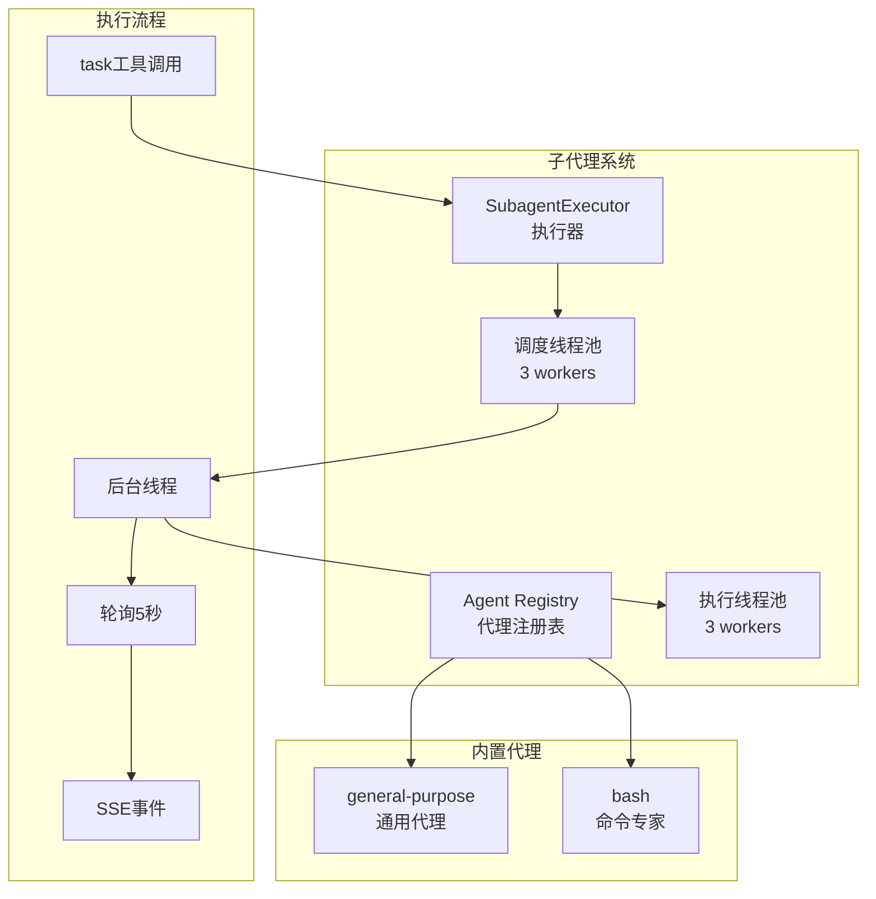

# 【文档10】代理系统 —— Agent到底是什么

## 1. 五分钟速览

**这篇文档解决什么问题？**

如果你想了解：
- Agent（代理）到底是什么？
- Lead Agent和Sub-Agent为什么要分开？
- 代理之间如何协作完成任务？
- DeerFlow的代理系统如何设计？

那么这篇文档给你**Agent系统的完整认知**。

**阅读后你将获得**：
- Agent的核心概念和特征
- DeerFlow的代理架构设计（基于实际代码）
- 子代理协作的工作原理
- 面试时关于Agent问题的精炼回答

---

## 2. Agent vs 传统程序：本质区别

### 2.1 对比表格

| 维度 | 传统程序 | AI Agent |
|------|----------|----------|
| **执行方式** | 按指令逐步执行 | 自主规划、决策 |
| **输入处理** | 固定参数 | 自然语言理解 |
| **输出结果** | 确定性输出 | 可能调用工具、多次迭代 |
| **能力边界** | 编写时确定 | 可以动态扩展 |
| **错误处理** | 预定义异常处理 | 自主尝试恢复 |
| **学习能力** | 无 | 可以从记忆中学习 |

### 2.2 代码对比（概念示意）

**传统程序**：
```python
def process_user_query(query):
    # 固定的处理流程
    if "天气" in query:
        return get_weather(query)
    elif "新闻" in query:
        return get_news(query)
    else:
        return "无法理解"
```

**AI Agent**（DeerFlow实际代码）：
```python
# 来自：backend/packages/harness/deerflow/agents/lead_agent/agent.py

def make_lead_agent(config: RunnableConfig):
    """创建Lead Agent"""
    # 动态选择模型
    model = create_chat_model(name=model_name, thinking_enabled=thinking_enabled)

    # 动态加载工具
    tools = get_available_tools(
        model_name=model_name,
        subagent_enabled=subagent_enabled
    )

    # 构建中间件链
    middlewares = _build_middlewares(config, model_name=model_name)

    # 创建Agent
    return create_agent(
        model=model,
        tools=tools,
        middleware=middlewares,
        system_prompt=apply_prompt_template(
            subagent_enabled=subagent_enabled,
            max_concurrent_subagents=max_concurrent_subagents
        ),
        state_schema=ThreadState
    )
```

**核心差异**：
- 传统程序：**程序员定义逻辑**
- AI Agent：**AI自己决定逻辑**（通过模型选择工具）

---

## 3. DeerFlow的代理架构（基于实际代码）

### 3.1 Lead Agent设计

**源码位置**：`backend/packages/harness/deerflow/agents/lead_agent/agent.py`

```python
# Lead Agent创建流程
def make_lead_agent(config: RunnableConfig):
    """
    配置解析：
    - thinking_enabled: 启用Thinking模式
    - reasoning_effort: 推理强度
    - model_name: 选择特定模型
    - is_plan_mode: 启用TodoList中间件
    - subagent_enabled: 启用子代理
    - max_concurrent_subagents: 最大并发数
    """
    cfg = config.get("configurable", {})

    # 解析配置
    thinking_enabled = cfg.get("thinking_enabled", True)
    model_name = cfg.get("model_name") or _resolve_model_name()
    subagent_enabled = cfg.get("subagent_enabled", False)
    max_concurrent_subagents = cfg.get("max_concurrent_subagents", 3)

    # 创建模型
    model = create_chat_model(
        name=model_name,
        thinking_enabled=thinking_enabled,
        reasoning_effort=cfg.get("reasoning_effort")
    )

    # 加载工具（包括子代理工具）
    tools = get_available_tools(
        model_name=model_name,
        subagent_enabled=subagent_enabled
    )

    # 构建中间件链
    middlewares = _build_middlewares(
        config,
        model_name=model_name,
        agent_name=cfg.get("agent_name")
    )

    # 应用系统提示词
    system_prompt = apply_prompt_template(
        subagent_enabled=subagent_enabled,
        max_concurrent_subagents=max_concurrent_subagents,
        agent_name=cfg.get("agent_name")
    )

    # 创建Agent
    return create_agent(
        model=model,
        tools=tools,
        middleware=middlewares,
        system_prompt=system_prompt,
        state_schema=ThreadState
    )
```

### 3.2 子代理系统架构

**源码位置**：`backend/packages/harness/deerflow/subagents/`



**关键配置**（来自源码）：
```python
# 最大并发数限制
MAX_CONCURRENT_SUBAGENTS = 3

# 超时时间
SUBAGENT_TIMEOUT = 900  # 15分钟

# 双线程池
_scheduler_pool = ThreadPoolExecutor(max_workers=3)  # 调度
_execution_pool = ThreadPoolExecutor(max_workers=3)   # 执行
```

### 3.3 Lead Agent vs Sub-Agent

| 维度 | Lead Agent | Sub-Agent |
|------|-----------|-----------|
| **源码位置** | `agents/lead_agent/agent.py` | `subagents/builtins/` |
| **角色** | 总指挥官 | 专业执行者 |
| **职责** | 理解需求、制定计划、协调分工 | 执行具体任务、返回结果 |
| **能力范围** | 综合能力，调用多个子代理 | 专项能力，专注某个领域 |
| **数量** | 1个（每个对话） | 可多个，动态创建 |
| **生命周期** | 对话开始到结束 | 任务创建到完成（15分钟超时） |
| **执行方式** | 同步等待 | 后台线程执行 |
| **通信** | 工具调用 | SSE事件推送 |

---

## 4. 子代理协作的完整流程

### 4.1 实际执行流程

```mermaid
sequenceDiagram
    participant U as 用户
    participant LA as Lead Agent
    participant ST as SubagentLimitMiddleware
    participant SE as SubagentExecutor
    participant SA as Sub-Agent
    participant T as Tools

    U->>LA: "帮我分析这个数据并生成报告"

    LA->>LA: 规划任务：
              1. 搜索数据
              2. 分析数据
              3. 生成报告

    LA->>LA: 决定用子代理

    LA->>ST: task工具调用
    Note over ST: 检查并发数

    ST->>ST: 当前并发 < 3?
    alt 可以创建
        ST->>SE: 创建子代理
        SE->>SE: 提交到执行线程池
        SE->>SA: 启动后台线程

        par 并行执行
            SA->>T: 调用搜索工具
            T-->>SA: 搜索结果
        and
            SA->>T: 调用分析工具
            T-->>SA: 分析结果
        end

        SA->>SA: 整合结果
        SA-->>SE: 任务完成
        SE-->>LA: SSE: task_completed事件
    else 超过限制
        ST->>ST: 截断多余的调用
        ST-->>LA: 只保留前3个
    end

    LA->>LA: 整合子代理结果
    LA-->>U: "分析完成，报告如下..."
```

### 4.2 子代理工具定义

**源码位置**：`backend/packages/harness/deerflow/tools/builtins/`（实际代码简化）

```python
# task工具的实际定义
task_tool = {
    "name": "task",
    "description": "Delegate a task to a specialized sub-agent.",
    "parameters": {
        "description": "What the sub-agent should do",
        "subagent_type": "Type of sub-agent (general-purpose/bash)",
        "max_turns": "Maximum number of turns"
    }
}
```

**SubagentLimitMiddleware的作用**（源码）：
```python
# 来自：agents/middlewares/subagent_limit_middleware.py

class SubagentLimitMiddleware:
    def __init__(self, max_concurrent=3):
        self.max_concurrent = max_concurrent

    async def after_model(self, config):
        """在模型响应后执行"""
        state = config["state"]

        # 检查task调用数量
        task_calls = [
            msg for msg in state["messages"]
            if hasattr(msg, "tool_calls")
            for tc in msg.tool_calls
            if tc["name"] == "task"
        ]

        # 超过限制就截断
        if len(task_calls) > self.max_concurrent:
            state["messages"] = state["messages"][:self.max_concurrent]
            logger.warning(
                f"Truncated {len(task_calls) - self.max_concurrent} "
                f"task calls to enforce max_concurrent_subagents"
            )
```

---

## 5. 内置子代理类型

### 5.1 general-purpose代理

**源码位置**：`backend/packages/harness/deerflow/subagents/builtins/general.py`

```
特点：
→ 可以使用所有工具（除了task工具）
→ 适合通用的复杂任务
→ 能搜索、编程、分析等

使用场景：
→ "帮我研究这个主题"
→ "分析这个文档"
→ "编写这段代码"
```

### 5.2 bash代理

**源码位置**：`backend/packages/harness/deerflow/subagents/builtins/bash.py`

```
特点：
→ 专门处理命令执行
→ 只能使用bash相关工具
→ 更专注于命令行任务

使用场景：
→ "执行这个脚本"
→ "检查服务器状态"
→ "批量处理文件"
```

---

## 6. 设计思想（基于实际代码）

### 6.1 为什么Lead Agent只有一个？

**设计考量**（源码分析）：

```python
# langgraph.json只定义一个entry point
{
  "node_id": "deerflow",
  "entry_point": "make_lead_agent"  # 单一入口
}
```

```
设计理由：

1. 统一决策
   → 单个指挥官避免冲突
   → 决策路径清晰

2. 简化协调
   → 不需要协调多个Lead Agent
   → 减少通信开销

3. 状态管理
   → ThreadState是单源的
   → 避免状态冲突

4. 可预测性
   → 行为更容易理解
   → 调试更容易
```

### 6.2 为什么子代理使用双线程池？

**源码分析**：
```python
# 来自：subagents/executor.py

class SubagentExecutor:
    def __init__(self):
        # 调度线程池：处理并发控制
        self._scheduler_pool = ThreadPoolExecutor(max_workers=3)
        # 执行线程池：实际执行子代理
        self._execution_pool = ThreadPoolExecutor(max_workers=3)
```

```
设计理由：

1. 调度池
   → 控制最大并发数（3个）
   → 防止资源耗尽
   → 统一管理子代理生命周期

2. 执行池
   → 子代理的实际执行
   → 与调度解耦
   → 防止阻塞调度

3. 为什么都是3个？
   → 平衡并发和资源
   → 太少：效率低
   → 太多：资源消耗大
```

### 6.3 为什么子代理短期存在？

**源码分析**：
```python
# 来自：subagents/executor.py

async def _run_subagent_background(self, task_input):
    """后台运行子代理"""
    thread = threading.Thread(
        target=self._execute_subagent,
        args=(task_input,),
        daemon=True  # 守护线程
    )
    thread.start()

    # 轮询检查状态
    for _ in range(900):  # 15分钟超时
        await asyncio.sleep(5)
        if thread.is_alive():
            continue
        break
```

```
设计理由：

1. 任务导向
   → 子代理为特定任务创建
   → 任务完成就销毁
   → 不占用长期资源

2. 隔离性
   → 每个子代理独立环境
   → 互不影响
   → 便于并行

3. 容错性
   → 子代理崩溃不影响主代理
   → 超时自动终止
   → 资源自动清理

4. 无状态管理
   → 不需要跨任务状态
   → 减少复杂度
   → 铅代理负责全局状态
```

---

## 7. 面试要点

### Q1: Agent和传统程序有什么区别？

**参考回答**：
```
核心区别：

1. 执行方式
   → 传统程序：按预设指令执行
   → Agent：自主规划和决策

2. 能力边界
   → 传统程序：编写时确定
   → Agent：可以动态扩展（通过工具）

3. 处理方式
   → 传统程序：固定流程
   → Agent：可以多次迭代、调整策略

DeerFlow中的Agent：
→ 通过make_lead_agent()创建
→ 动态选择模型和工具
→ 通过中间件链处理请求
→ 支持子代理协作
```

### Q2: Lead Agent和Sub-Agent的区别是什么？

**参考回答**：
```
核心区别：

Lead Agent：
→ 源码位置：agents/lead_agent/agent.py
→ 创建方式：make_lead_agent(config)
→ 生命周期：对话开始到结束
→ 能力：综合能力，调用多个子代理
→ 执行：同步等待

Sub-Agent：
→ 源码位置：subagents/builtins/
→ 创建方式：SubagentExecutor后台线程
→ 生命周期：任务创建到完成（15分钟超时）
→ 能力：专项能力（general-purpose/bash）
→ 执行：后台异步执行

类比：
Lead Agent = 项目经理
Sub-Agent = 专业工程师

为什么分开？
→ 单个Agent难以精通所有领域
→ 分工提高效率和质量
→ 可以并行执行
```

### Q3: DeerFlow的子代理系统是如何设计的？

**参考回答**：
```
子代理系统的关键设计：

1. 双线程池
   → 调度池（3 workers）：控制并发
   → 执行池（3 workers）：实际执行
   → 解耦调度和执行

2. 最大并发限制
   → MAX_CONCURRENT_SUBAGENTS = 3
   → SubagentLimitMiddleware强制执行
   → 超过就截断

3. 后台执行
   → threading.Thread启动
   → 守护线程（daemon=True）
   → 轮询检查状态（5秒间隔）

4. 超时保护
   → 15分钟超时（900秒）
   → 超时自动终止
   → 发送task_timed_out事件

5. SSE事件推送
   → task_started
   → task_running
   → task_completed/task_failed/task_timed_out

这个设计保证了：
→ 并发可控
→ 资源隔离
→ 容错能力强
```

### Q4: 中间件在代理系统中扮演什么角色？

**参考回答**：
```
中间件在代理系统中的角色：

1. 职责分离
   → 每个中间件处理一个特定方面
   → ThreadData处理线程数据
   → Memory处理记忆更新
   → Clarification处理澄清请求

2. 固定顺序
   → 12个中间件按严格顺序执行
   → ThreadData必须在最前
   → Clarification必须在最后

3. 可插拔
   → 可以灵活添加/删除中间件
   → 通过配置控制启用
   → 自定义中间件可以注入

4. 状态管理
   → 中间件可以修改state
   → 后续中间件看到修改后的state
   → 实现复杂的处理逻辑

在make_lead_agent中：
→ _build_middlewares()构建中间件链
→ 传递给create_agent()
→ Agent执行时自动调用
```

### Q5: 如何创建一个新的子代理类型？

**参考回答**：
```
创建新子代理的步骤：

1. 在subagents/builtins/创建新文件
   → 继承基类（如果有）
   → 实现agent创建逻辑

2. 在Agent Registry注册
   → 添加到注册表
   → 指定可用工具

3. 更新task工具的描述
   → 添加新类型选项
   → 说明使用场景

4. 测试验证
   → 单元测试
   → 集成测试
   → 确保超时机制工作

源码参考：
→ subagents/builtins/general.py
→ subagents/builtins/bash.py
```

---

## 8. 延伸思考

### 8.1 子代理的调试

```
问题：子代理在后台执行，如何调试？

解决方案：
1. 日志记录
   → 详细记录子代理行为
   → 记录工具调用和结果

2. SSE事件
   → task_started事件
   → task_running事件
   → 包含执行信息

3. 状态检查
   → 可以查询子代理状态
   → 查看执行历史

4. 本地测试
   → 不使用后台线程
   → 同步执行便于调试
```

### 8.2 子代理的扩展

```
如何扩展子代理系统？

1. 新增子代理类型
   → 在builtins/创建新代理
   → 专注特定领域

2. 自定义工具
   → 为子代理创建专用工具
   → 提高特定领域能力

3. 修改执行器
   → SubagentExecutor可扩展
   → 支持不同的执行策略

4. 调整并发限制
   → 通过配置修改max_concurrent
   → 根据资源情况调整
```

### 8.3 子代理的安全

```
子代理的安全考虑：

1. 沙箱隔离
   → 子代理在沙箱中执行
   → 防止恶意操作

2. 超时保护
   → 15分钟超时
   → 防止无限执行

3. 资源限制
   → 最大并发数限制
   → 防止资源耗尽

4. 工具限制
   → bash代理只能用bash工具
   → general-purpose不能用task工具
```

---

## 9. 思考问题

### 9.1 理解检验

1. Agent和传统程序的核心区别是什么？
2. Lead Agent和Sub-Agent各自的职责是什么？
3. DeerFlow的子代理系统使用什么执行模型？

### 9.2 设计思考

4. 为什么子代理使用双线程池而不是单个线程池？
5. SubagentLimitMiddleware是如何工作的？
6. 为什么子代理使用守护线程？

### 9.3 场景应用

7. 如果要创建一个"数据分析"专用子代理，应该怎么做？
8. 如果要调整子代理的并发限制，应该改哪个配置？
9. 如果要调试子代理的执行过程，应该怎么做？

---

## 10. 本篇小结

**核心要点**：

1. **Agent本质**：有自主决策能力的AI实体，通过模型选择工具实现
2. **Lead Agent**：通过make_lead_agent()创建，动态选择模型、工具、中间件
3. **Sub-Agent**：通过SubagentExecutor后台执行，双线程池设计
4. **协作模式**：Lead Agent通过task工具调用子代理，SSE事件推送结果
5. **设计价值**：专业分工、并行执行、错误隔离、容错能力强

**你现在已经理解了代理系统**，下一篇我们将深入**记忆系统**，看看AI如何"记住"对话。

---

## 11. 文档衔接

**本篇完结**，下一篇将解析：【11-记忆系统：AI如何"记住"对话】

**衔接说明**：
- 10篇解决了"Agent是什么"的问题
- 11篇将解决"AI如何记忆"的问题
- 记忆是Agent智能的重要来源
- 记忆系统也是后续工具调用、技能执行的基础
