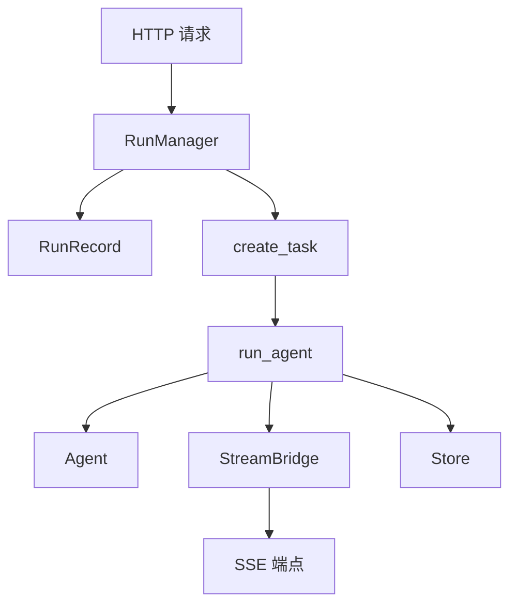

# 【10-运行时管理】运行时管理深度解析

> **源码路径**: `backend/packages/harness/deerflow/runtime/`
> **核心文件**: 10个 Python 文件
> **功能**: Agent 执行、状态管理、SSE 流式传输

---

## 一、设计思想

### 1.1 运行时管理系统概述

DeerFlow 的运行时管理系统负责 Agent 的后台执行和流式响应传输，核心功能包括：

- **后台执行**: 在 asyncio.Task 中运行 Agent
- **状态管理**: 跟踪运行状态 (pending, running, success, error, interrupted)
- **流式传输**: 通过 SSE 向客户端推送实时事件
- **多任务策略**: 支持 reject/interrupt/rollback 三种策略
- **序列化**: 统一 LangChain 对象的 JSON 序列化

### 1.2 架构设计原则

```
┌─────────────────────────────────────────────────────────────────┐
│                    Agent 执行流程                              │
│                                                                 │
│  ┌─────────────────────────────────────────────────────────┐   │
│  │              HTTP 请求 (POST /runs)                    │   │
│  └────────────────────┬────────────────────────────────────┘   │
│                       ▼                                          │
│  ┌─────────────────────────────────────────────────────────┐   │
│  │              RunManager.create_or_reject()             │   │
│  │   1. 检查是否有进行中的运行                            │   │
│  │   2. 根据 multitask_strategy 处理冲突                   │   │
│  │   3. 创建 RunRecord                                     │   │
│  └────────────────────┬────────────────────────────────────┘   │
│                       ▼                                          │
│  ┌─────────────────────────────────────────────────────────┐   │
│  │              asyncio.create_task(run_agent)            │   │
│  │   1. 在后台 Task 中执行 Agent                          │   │
│  │   2. 使用 agent.astream() 流式输出                      │   │
│  │   3. 发布事件到 StreamBridge                           │   │
│  └────────────────────┬────────────────────────────────────┘   │
│                       ▼                                          │
│  ┌─────────────────────────────────────────────────────────┐   │
│  │              run_agent() 执行流程                        │   │
│  │   1. 创建 Agent (agent_factory)                        │   │
│  │   2. 附加 checkpointer 和 store                         │   │
│  │   3. 设置中断节点                                       │   │
│  │   4. astream() 循环                                     │   │
│  │   5. 序列化并发布事件                                   │   │
│  │   6. 更新最终状态                                       │   │
│  └────────────────────┬────────────────────────────────────┘   │
│                       ▼                                          │
│  ┌─────────────────────────────────────────────────────────┐   │
│  │              StreamBridge                               │   │
│  │   ┌─────────────────────────────────────────┐           │   │
│  │   │   Memory (默认)                          │           │   │
│  │   │   - asyncio.Queue                         │           │   │
│  │   │   - 支持 publish/subscribe/cleanup        │           │   │
│  │   └─────────────────────────────────────────┘           │   │
│  │   ┌─────────────────────────────────────────┐           │   │
│  │   │   Redis (Phase 2)                         │           │   │
│  │   │   - 分布式队列                             │           │   │
│  │   │   - 多进程共享                              │           │   │
│  │   └─────────────────────────────────────────┘           │   │
│  └────────────────────┬────────────────────────────────────┘   │
│                       ▼                                          │
│  ┌─────────────────────────────────────────────────────────┐   │
│  │              SSE 端点订阅                                │   │
│  │   1. subscribe(run_id, last_event_id)                  │   │
│  │   2. 异步迭代 StreamEvent                              │   │
│  │   3. 转换为 SSE 格式                                   │   │
│  │   4. 发送到客户端                                     │   │
│  └─────────────────────────────────────────────────────────┘   │
└─────────────────────────────────────────────────────────────────┘

┌─────────────────────────────────────────────────────────────────┐
│                     Stream Mode 映射                            │
│                                                                 │
│  客户端请求      LangGraph 内部      SSE 事件名              │
│  ──────────────────────────────────────────────────────────  │
│  "messages"     "messages"           "messages"                │
│  "values"       "values"             "values"                  │
│  "updates"      "updates"            "updates"                 │
│  "checkpoints"  "checkpoints"         "checkpoints"            │
│  "events"       (不支持)             (跳过)                  │
└─────────────────────────────────────────────────────────────────┘
```

### 1.3 核心设计决策

**为什么需要 StreamBridge？**

1. **解耦**: 分离 Agent 执行和 SSE 端点
2. **多消费者**: 支持多个订阅者同时消费
3. **背压处理**: 队列满时的处理策略
4. **可扩展**: 支持 Redis 分布式队列

**为什么需要 RunManager？**

1. **状态追踪**: 跟踪每个运行的状态
2. **冲突处理**: 多任务策略的实现
3. **原子操作**: create_or_reject 确保原子性

**为什么使用 astream() 而非 invoke()？**

1. **实时反馈**: 客户端可以看到 Agent 执行进度
2. **多模式支持**: 同时支持 values/updates/messages 模式
3. **中断能力**: 可以中途取消执行

**为什么需要序列化层？**

1. **JSON 兼容**: LangChain 对象需要转换为 JSON
2. **内部键过滤**: 移除 `__pregel_*` 等内部键
3. **模式处理**: 不同模式有不同的序列化逻辑

---

## 二、模块架构

### 2.1 文件结构

```
deerflow/runtime/
├── __init__.py              # 模块导出
├── serialization.py         # LangChain 对象序列化
├── runs/
│   ├── __init__.py         # 运行模块导出
│   ├── worker.py           # Agent 后台执行
│   ├── manager.py          # RunManager 状态管理
│   └── schemas.py          # RunStatus, DisconnectMode
├── store/
│   ├── __init__.py         # Store 模块导出
│   ├── provider.py         # 同步 Store 工厂
│   └── _sqlite_utils.py    # SQLite 工具
└── stream_bridge/
    ├── __init__.py         # StreamBridge 导出
    ├── base.py             # 抽象接口
    ├── async_provider.py   # 异步工厂
    └── memory.py           # 内存实现
```

### 2.2 模块依赖图



---

## 三、核心组件解析

### 3.1 RunManager (runs/manager.py)

**源码位置**: `packages/harness/deerflow/runtime/runs/manager.py:40-213`

#### RunRecord 数据类

```python
@dataclass
class RunRecord:
    """Mutable record for a single run."""
    run_id: str
    thread_id: str
    assistant_id: str | None
    status: RunStatus
    on_disconnect: DisconnectMode
    multitask_strategy: str = "reject"
    metadata: dict = field(default_factory=dict)
    kwargs: dict = field(default_factory=dict)
    created_at: str = ""
    updated_at: str = ""
    task: asyncio.Task | None = field(default=None, repr=False)
    abort_event: asyncio.Event = field(default_factory=asyncio.Event, repr=False)
    abort_action: str = "interrupt"
    error: str | None = None
```

**设计要点**:
1. **可变性**: 字段可变，便于状态更新
2. **任务引用**: 保留 asyncio.Task 引用用于取消
3. **中断事件**: abort_event 用于通知执行中断

#### create_or_reject - 原子创建

**源码位置**: `packages/harness/deerflow/runtime/runs/manager.py:128-191`

```python
async def create_or_reject(
    self,
    thread_id: str,
    assistant_id: str | None = None,
    *,
    on_disconnect: DisconnectMode = DisconnectMode.cancel,
    metadata: dict | None = None,
    kwargs: dict | None = None,
    multitask_strategy: str = "reject",
) -> RunRecord:
    """Atomically check for inflight runs and create a new one.

    For ``reject`` strategy, raises ``ConflictError`` if thread
    already has a pending/running run.  For ``interrupt``/``rollback``,
    cancels inflight runs before creating.
    """
    run_id = str(uuid.uuid4())
    now = _now_iso()

    async with self._lock:
        # 验证策略
        _supported_strategies = ("reject", "interrupt", "rollback")
        if multitask_strategy not in _supported_strategies:
            raise UnsupportedStrategyError(f"Multitask strategy '{multitask_strategy}' is not yet supported.")

        # 查找进行中的运行
        inflight = [r for r in self._runs.values() if r.thread_id == thread_id and r.status in (RunStatus.pending, RunStatus.running)]

        if multitask_strategy == "reject" and inflight:
            raise ConflictError(f"Thread {thread_id} already has an active run")

        if multitask_strategy in ("interrupt", "rollback") and inflight:
            for r in inflight:
                r.abort_action = multitask_strategy
                r.abort_event.set()
                if r.task is not None and not r.task.done():
                    r.task.cancel()
                r.status = RunStatus.interrupted
                r.updated_at = now

        # 创建新运行记录
        record = RunRecord(
            run_id=run_id,
            thread_id=thread_id,
            assistant_id=assistant_id,
            status=RunStatus.pending,
            on_disconnect=on_disconnect,
            multitask_strategy=multitask_strategy,
            metadata=metadata or {},
            kwargs=kwargs or {},
            created_at=now,
            updated_at=now,
        )
        self._runs[run_id] = record

    return record
```

**设计解读**:
1. **原子性**: 在单个锁内完成检查和创建
2. **TOCTOU 防护**: 避免检查和使用之间的竞态条件
3. **策略实现**: reject 抛异常，interrupt/rollback 取消旧运行

### 3.2 run_agent Worker (runs/worker.py)

**源码位置**: `packages/harness/deerflow/runtime/runs/worker.py:34-211`

#### 执行流程

```python
async def run_agent(
    bridge: StreamBridge,
    run_manager: RunManager,
    record: RunRecord,
    *,
    checkpointer: Any,
    store: Any | None = None,
    agent_factory: Any,
    graph_input: dict,
    config: dict,
    stream_modes: list[str] | None = None,
    stream_subgraphs: bool = False,
    interrupt_before: list[str] | Literal["*"] | None = None,
    interrupt_after: list[str] | Literal["*"] | None = None,
) -> None:
    """Execute an agent in the background, publishing events to *bridge*."""
    run_id = record.run_id
    thread_id = record.thread_id
    requested_modes: set[str] = set(stream_modes or ["values"])

    # 1. 标记为运行中
    await run_manager.set_status(run_id, RunStatus.running)

    # 2. 发布元数据
    await bridge.publish(
        run_id,
        "metadata",
        {"run_id": run_id, "thread_id": thread_id},
    )

    # 3. 构建 Agent
    runtime = Runtime(context={"thread_id": thread_id}, store=store)
    config.setdefault("configurable", {})["__pregel_runtime"] = runtime
    runnable_config = RunnableConfig(**config)
    agent = agent_factory(config=runnable_config)

    # 4. 附加 checkpointer 和 store
    if checkpointer is not None:
        agent.checkpointer = checkpointer
    if store is not None:
        agent.store = store

    # 5. 设置中断节点
    if interrupt_before:
        agent.interrupt_before_nodes = interrupt_before
    if interrupt_after:
        agent.interrupt_after_nodes = interrupt_after

    # 6. 构建 LangGraph stream_mode 列表
    lg_modes: list[str] = []
    for m in requested_modes:
        if m == "messages-tuple":
            lg_modes.append("messages")
        elif m == "events":
            continue  # 不支持
        elif m in _VALID_LG_MODES:
            lg_modes.append(m)
    if not lg_modes:
        lg_modes = ["values"]

    # 7. 流式执行
    if len(lg_modes) == 1 and not stream_subgraphs:
        single_mode = lg_modes[0]
        async for chunk in agent.astream(graph_input, config=runnable_config, stream_mode=single_mode):
            if record.abort_event.is_set():
                break
            sse_event = _lg_mode_to_sse_event(single_mode)
            await bridge.publish(run_id, sse_event, serialize(chunk, mode=single_mode))
    else:
        async for item in agent.astream(graph_input, config=runnable_config, stream_mode=lg_modes, subgraphs=stream_subgraphs):
            if record.abort_event.is_set():
                break
            mode, chunk = _unpack_stream_item(item, lg_modes, stream_subgraphs)
            if mode is None:
                continue
            sse_event = _lg_mode_to_sse_event(mode)
            await bridge.publish(run_id, sse_event, serialize(chunk, mode=mode))

    # 8. 最终状态
    if record.abort_event.is_set():
        # 处理中断...
        pass
    else:
        await run_manager.set_status(run_id, RunStatus.success)
```

**关键特性**:
1. **运行时上下文**: 注入 thread_id 到 runtime.context
2. **多模式支持**: 同时支持多个 stream_mode
3. **中断处理**: 检查 abort_event 并退出
4. **事件发布**: 序列化后发布到 StreamBridge

### 3.3 StreamBridge (stream_bridge/)

#### 抽象接口

**源码位置**: `packages/harness/deerflow/runtime/stream_bridge/base.py:37-73`

```python
class StreamBridge(abc.ABC):
    """Abstract base for stream bridges."""

    @abc.abstractmethod
    async def publish(self, run_id: str, event: str, data: Any) -> None:
        """Enqueue a single event for *run_id* (producer side)."""

    @abc.abstractmethod
    async def publish_end(self, run_id: str) -> None:
        """Signal that no more events will be produced for *run_id*."""

    @abc.abstractmethod
    def subscribe(
        self,
        run_id: str,
        *,
        last_event_id: str | None = None,
        heartbeat_interval: float = 15.0,
    ) -> AsyncIterator[StreamEvent]:
        """Async iterator that yields events for *run_id* (consumer side).

        Yields HEARTBEAT_SENTINEL when no event arrives within
        *heartbeat_interval* seconds.  Yields END_SENTINEL once
        the producer calls publish_end().
        """

    @abc.abstractmethod
    async def cleanup(self, run_id: str, *, delay: float = 0) -> None:
        """Release resources associated with *run_id*.

        If *delay* > 0 the implementation should wait before releasing,
        giving late subscribers a chance to drain remaining events.
        """

    async def close(self) -> None:
        """Release backend resources.  Default is a no-op."""
```

**设计解读**:
1. **生产者-消费者模式**: publish 用于生产，subscribe 用于消费
2. **心跳机制**: 订阅者可以在没有事件时收到心跳
3. **延迟清理**: 支持延迟清理资源

### 3.4 序列化 (serialization.py)

**源码位置**: `packages/harness/deerflow/runtime/serialization.py:16-78`

```python
def serialize_lc_object(obj: Any) -> Any:
    """Recursively serialize a LangChain object to a JSON-serialisable dict."""
    if obj is None:
        return None
    if isinstance(obj, (str, int, float, bool)):
        return obj
    if isinstance(obj, dict):
        return {k: serialize_lc_object(v) for k, v in obj.items()}
    if isinstance(obj, (list, tuple)):
        return [serialize_lc_object(item) for item in obj]
    # Pydantic v2
    if hasattr(obj, "model_dump"):
        try:
            return obj.model_dump()
        except Exception:
            pass
    # Pydantic v1 / older objects
    if hasattr(obj, "dict"):
        try:
            return obj.dict()
        except Exception:
            pass
    # Last resort
    try:
        return str(obj)
    except Exception:
        return repr(obj)


def serialize_channel_values(channel_values: dict[str, Any]) -> dict[str, Any]:
    """Serialize channel values, stripping internal LangGraph keys."""
    result: dict[str, Any] = {}
    for key, value in channel_values.items():
        if key.startswith("__pregel_") or key == "__interrupt__":
            continue
        result[key] = serialize_lc_object(value)
    return result


def serialize(obj: Any, *, mode: str = "") -> Any:
    """Serialize LangChain objects with mode-specific handling.

    * ``messages`` — obj is ``(message_chunk, metadata_dict)``
    * ``values`` — obj is the full state dict; ``__pregel_*`` keys stripped
    * everything else — recursive ``model_dump()`` / ``dict()`` fallback
    """
    if mode == "messages":
        return serialize_messages_tuple(obj)
    if mode == "values":
        return serialize_channel_values(obj) if isinstance(obj, dict) else serialize_lc_object(obj)
    return serialize_lc_object(obj)
```

**设计要点**:
1. **递归处理**: 支持嵌套对象
2. **Pydantic 兼容**: 同时支持 v1 (dict) 和 v2 (model_dump)
3. **内部键过滤**: 移除 `__pregel_*` 等内部键
4. **模式处理**: 不同模式有不同的序列化逻辑

---

## 四、数据结构

### 4.1 RunStatus 枚举

```python
class RunStatus(str, Enum):
    pending = "pending"        # 等待执行
    running = "running"        # 执行中
    success = "success"        # 成功完成
    error = "error"            # 执行出错
    interrupted = "interrupted"  # 被中断
```

### 4.2 DisconnectMode 枚举

```python
class DisconnectMode(str, Enum):
    cancel = "cancel"          # 取消执行
    continue_ = "continue"      # 继续执行
    rollback = "rollback"      # 回滚到执行前状态
```

### 4.3 StreamEvent 数据类

```python
@dataclass(frozen=True)
class StreamEvent:
    """Single stream event."""
    id: str                    # 单调递增的事件 ID (SSE id 字段)
    event: str                # SSE 事件名 ("metadata", "values", "updates", "error", "end")
    data: Any                 # JSON 可序列化的载荷
```

---

## 五、可复用代码模板

### 5.1 异步任务管理模板

```python
"""Async task management template."""

import asyncio
from dataclasses import dataclass, field
from datetime import UTC, datetime
from enum import Enum

class TaskStatus(str, Enum):
    PENDING = "pending"
    RUNNING = "running"
    SUCCESS = "success"
    FAILED = "failed"

@dataclass
class TaskRecord:
    task_id: str
    status: TaskStatus
    created_at: str
    updated_at: str
    task: asyncio.Task | None = None
    abort_event: asyncio.Event = field(default_factory=asyncio.Event)

class TaskManager:
    def __init__(self):
        self._tasks = {}
        self._lock = asyncio.Lock()

    async def create(self, task_id: str) -> TaskRecord:
        now = datetime.now(UTC).isoformat()
        record = TaskRecord(
            task_id=task_id,
            status=TaskStatus.PENDING,
            created_at=now,
            updated_at=now,
        )
        async with self._lock:
            self._tasks[task_id] = record
        return record

    async def set_status(self, task_id: str, status: TaskStatus) -> None:
        async with self._lock:
            record = self._tasks.get(task_id)
            if record:
                record.status = status
                record.updated_at = datetime.now(UTC).isoformat()

    async def cancel(self, task_id: str) -> bool:
        async with self._lock:
            record = self._tasks.get(task_id)
            if record and record.task:
                record.abort_event.set()
                record.task.cancel()
                record.status = TaskStatus.FAILED
                return True
        return False
```

### 5.2 StreamBridge 模板

```python
"""Stream bridge template."""

import asyncio
from collections.abc import AsyncIterator
from dataclasses import dataclass

@dataclass
class StreamEvent:
    id: str
    event: str
    data: any

class StreamBridge:
    def __init__(self, queue_maxsize: int = 256):
        self._queues = {}
        self._lock = asyncio.Lock()
        self._queue_maxsize = queue_maxsize
        self._event_id = 0

    async def publish(self, run_id: str, event: str, data: any) -> None:
        async with self._lock:
            if run_id not in self._queues:
                return
            queue = self._queues[run_id]
            self._event_id += 1
            stream_event = StreamEvent(id=str(self._event_id), event=event, data=data)
            await queue.put(stream_event)

    async def publish_end(self, run_id: str) -> None:
        async with self._lock:
            if run_id in self._queues:
                await self._queues[run_id].put(StreamEvent(id="", event="end", data=None))

    async def subscribe(self, run_id: str, last_event_id: str | None = None, heartbeat_interval: float = 15.0) -> AsyncIterator[StreamEvent]:
        async with self._lock:
            if run_id not in self._queues:
                self._queues[run_id] = asyncio.Queue(maxsize=self._queue_maxsize)
            queue = self._queues[run_id]

        while True:
            try:
                event = await asyncio.wait_for(queue.get(), timeout=heartbeat_interval)
                if event.event == "end":
                    break
                yield event
            except asyncio.TimeoutError:
                yield StreamEvent(id="", event="heartbeat", data=None)

    async def cleanup(self, run_id: str, delay: float = 0) -> None:
        if delay > 0:
            await asyncio.sleep(delay)
        async with self._lock:
            self._queues.pop(run_id, None)
```

### 5.3 LangChain 序列化模板

```python
"""LangChain serialization template."""

from typing import Any

def serialize_lc_object(obj: Any) -> Any:
    """Recursively serialize a LangChain object."""
    if obj is None or isinstance(obj, (str, int, float, bool)):
        return obj
    if isinstance(obj, dict):
        return {k: serialize_lc_object(v) for k, v in obj.items()}
    if isinstance(obj, (list, tuple)):
        return [serialize_lc_object(item) for item in obj]
    # Pydantic v2
    if hasattr(obj, "model_dump"):
        try:
            return obj.model_dump()
        except Exception:
            pass
    # Pydantic v1
    if hasattr(obj, "dict"):
        try:
            return obj.dict()
        except Exception:
            pass
    # Fallback
    try:
        return str(obj)
    except Exception:
        return repr(obj)
```

---

## 六、踩坑提醒

### 6.1 asyncio.Task 取消限制

**问题**: `task.cancel()` 只是抛出 CancelledError，不强制停止

**解决方案**: 在执行循环中检查 abort_event

```python
async for chunk in agent.astream(...):
    if record.abort_event.is_set():
        logger.info("Run abort requested")
        break
    # 处理 chunk...
```

### 6.2 LangGraph 内部键污染

**问题**: `__pregel_*` 和 `__interrupt__` 键会污染响应

**解决方案**: 序列化时过滤这些键

```python
def serialize_channel_values(channel_values: dict) -> dict:
    result = {}
    for key, value in channel_values.items():
        if key.startswith("__pregel_") or key == "__interrupt__":
            continue
        result[key] = serialize_lc_object(value)
    return result
```

### 6.3 events 模式不支持

**问题**: LangGraph Python 不支持 `events` stream_mode

**解决方案**: 记录日志并跳过

```python
if "events" in requested_modes:
    logger.info("'events' stream_mode not supported in gateway. Skipping.")
```

### 6.4 多模式流的元组解析

**问题**: 多模式流返回 (mode, chunk) 元组

**解决方案**: 根据流配置解析元组

```python
async for item in agent.astream(..., stream_mode=lg_modes):
    mode, chunk = _unpack_stream_item(item, lg_modes, stream_subgraphs)
    if mode is None:
        continue
    # 处理 chunk...
```

### 6.5 Store 连接管理

**问题**: SQLite 连接需要正确关闭

**解决方案**: 使用上下文管理器

```python
@contextlib.contextmanager
def _sync_store_cm(config):
    if config.type == "sqlite":
        with SqliteStore.from_conn_string(conn_str) as store:
            store.setup()
            yield store
        return
    # ...
```

---

## 七、源码覆盖清单

### 已覆盖文件 (10/10)

| 文件 | 覆盖内容 |
|------|----------|
| `__init__.py` | 模块导出 |
| `serialization.py` | LangChain 对象序列化 |
| `runs/worker.py` | Agent 后台执行 |
| `runs/manager.py` | RunManager 状态管理 |
| `runs/schemas.py` | RunStatus, DisconnectMode |
| `store/provider.py` | 同步 Store 工厂 |
| `store/async_provider.py` | 异步 Store 工厂 |
| `stream_bridge/base.py` | StreamBridge 抽象接口 |
| `stream_bridge/async_provider.py` | 异步工厂 |
| `stream_bridge/memory.py` | 内存实现 |

---

## 八、术语表

| 术语 | 说明 |
|------|------|
| StreamBridge | 解耦 Agent 执行和 SSE 端点的抽象 |
| RunManager | 运行状态管理器 |
| RunRecord | 单个运行的记录 |
| SSE | Server-Sent Events，服务器推送事件 |
| stream_mode | LangGraph 流式输出模式 |
| checkpointer | 检查点存储，用于状态持久化 |
| store | LangGraph Store，跨线程状态存储 |

---

## 九、相关文档

- `docs/ARCHITECTURE.md` - 整体架构
- LangGraph 文档 - astream, stream_mode

---

**文档版本**: v1.0
**生成时间**: 2026-04-01
**作者**: doc-writer @ deer-flow-docs
