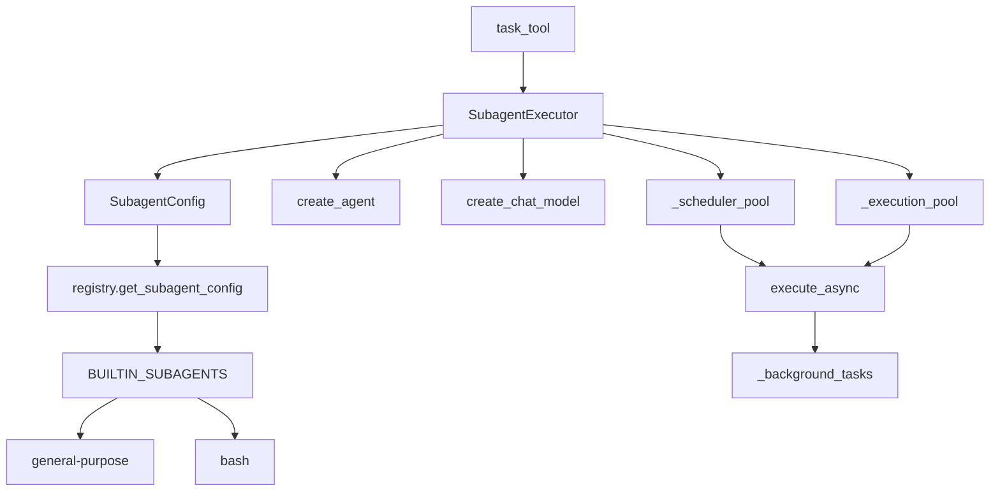

# 【11-子代理系统】子代理系统深度解析

> **源码路径**: `backend/packages/harness/deerflow/subagents/`
> **核心文件**: 6个 Python 文件
> **内置代理**: general-purpose, bash

---

## 一、设计思想

### 1.1 子代理系统概述

DeerFlow 的子代理系统允许主 Agent 将任务委托给专门的子代理执行，实现：

- **任务隔离**: 子代理有独立的对话上下文，避免污染主对话
- **并发执行**: 多个子代理可以同时运行，提高效率
- **专业分工**: 不同子代理针对不同任务类型优化
- **超时控制**: 防止子代理无限期运行
- **状态追踪**: 实时追踪子代理执行状态

### 1.2 架构设计原则

```
┌─────────────────────────────────────────────────────────────────┐
│                    子代理执行流程                                │
│                                                                 │
│  ┌─────────────────────────────────────────────────────────┐   │
│  │              主 Agent 调用 task 工具                    │   │
│  │   task(description, prompt, subagent_type, max_turns)   │   │
│  └────────────────────┬────────────────────────────────────┘   │
│                       ▼                                          │
│  ┌─────────────────────────────────────────────────────────┐   │
│  │              task_tool 处理                              │   │
│  │   1. 获取子代理配置                                     │   │
│  │   2. 创建 SubagentExecutor                              │   │
│  │   3. 调用 execute_async() 启动后台执行                 │   │
│  └────────────────────┬────────────────────────────────────┘   │
│                       ▼                                          │
│  ┌─────────────────────────────────────────────────────────┐   │
│  │              双线程池执行                                │   │
│  │   ┌─────────────────────────────────────────┐           │   │
│  │   │ _scheduler_pool (3 workers)             │           │   │
│  │   │   - 提交任务到调度队列                  │           │   │
│  │   └──────────────┬──────────────────────────┘           │   │
│  │                  ▼                                       │   │
│  │   ┌─────────────────────────────────────────┐           │   │
│  │   │ _execution_pool (3 workers)             │           │   │
│  │   │   - 执行子代理逻辑                      │           │   │
│  │   │   - 支持 asyncio.run()                  │           │   │
│  │   │   - 超时控制 (15分钟)                   │           │   │
│  │   └──────────────┬──────────────────────────┘           │   │
│  └────────────────────┼────────────────────────────────────┘   │
│                       ▼                                          │
│  ┌─────────────────────────────────────────────────────────┐   │
│  │              SubagentExecutor                            │   │
│  │   1. 过滤工具 (allowlist/denylist)                     │   │
│  │   2. 创建 Agent (create_agent)                         │   │
│  │   3. 构建初始状态 (继承 sandbox/thread_data)           │   │
│  │   4. astream() 执行并收集 AI 消息                      │   │
│  │   5. 提取最终结果                                      │   │
│  └────────────────────┬────────────────────────────────────┘   │
│                       ▼                                          │
│  ┌─────────────────────────────────────────────────────────┐   │
│  │              状态更新与轮询                              │   │
│  │   1. 更新 _background_tasks[task_id]                  │   │
│  │   2. 主 Agent 轮询任务状态                             │   │
│  │   3. 发送 SSE 事件 (task_started, task_running)       │   │
│  │   4. 完成后返回结果 (task_completed/task_failed)       │   │
│  └─────────────────────────────────────────────────────────┘   │
└─────────────────────────────────────────────────────────────────┘

┌─────────────────────────────────────────────────────────────────┐
│                     内置子代理类型                               │
│                                                                 │
│  ┌─────────────────────────────────────────────────────────┐   │
│  │              general-purpose                             │   │
│  │   - 复杂多步骤任务                                     │   │
│  │   - 需要探索和修改                                      │   │
│  │   - 工具: 继承所有工具 (除 task, ask_clarification)     │   │
│  │   - max_turns: 50                                      │   │
│  └─────────────────────────────────────────────────────────┘   │
│                                                                 │
│  ┌─────────────────────────────────────────────────────────┐   │
│  │              bash                                        │   │
│  │   - Bash 命令执行专家                                  │   │
│  │   - Git/npm/docker 等终端操作                          │   │
│  │   - 工具: bash, ls, read_file, write_file, str_replace  │   │
│  │   - max_turns: 30                                      │   │
│  └─────────────────────────────────────────────────────────┘   │
└─────────────────────────────────────────────────────────────────┘
```

### 1.3 核心设计决策

**为什么需要双线程池？**

1. **调度池**: 负责任务提交和状态更新
2. **执行池**: 负责实际的子代理执行 (包括 asyncio.run())
3. **隔离**: 防止执行阻塞调度

**为什么使用 asyncio.run()？**

1. **异步工具**: MCP 工具等需要异步执行
2. **流式输出**: astream() 可以实时收集 AI 消息
3. **事件循环**: 线程池中没有事件循环，需要创建新的

**为什么限制工具列表？**

1. **防止嵌套**: 子代理不能再次调用 task 工具
2. **聚焦任务**: 根据子代理类型限制可用工具
3. **安全控制**: 防止子代理执行危险操作

**为什么需要 SSE 事件？**

1. **实时反馈**: 用户可以看到子代理执行进度
2. **状态通知**: task_started, task_running, task_completed
3. **结果传递**: 最终结果通过事件返回

---

## 二、模块架构

### 2.1 文件结构

```
deerflow/subagents/
├── __init__.py          # 模块导出
├── config.py            # SubagentConfig 数据类
├── executor.py          # SubagentExecutor 执行引擎
├── registry.py          # 子代理注册表
└── builtins/
    ├── __init__.py      # 内置子代理导出
    ├── general_purpose.py  # 通用子代理配置
    └── bash_agent.py    # Bash 子代理配置
```

### 2.2 模块依赖图



---

## 三、核心组件解析

### 3.1 SubagentConfig (config.py)

**源码位置**: `packages/harness/deerflow/subagents/config.py:7-29`

```python
@dataclass
class SubagentConfig:
    """Configuration for a subagent."""

    name: str
    description: str
    system_prompt: str
    tools: list[str] | None = None  # 允许的工具列表
    disallowed_tools: list[str] | None = field(default_factory=lambda: ["task"])
    model: str = "inherit"  # 继承父代理模型
    max_turns: int = 50
    timeout_seconds: int = 900  # 15分钟默认超时
```

**配置要点**:
1. **工具控制**: `tools` 是白名单，`disallowed_tools` 是黑名单
2. **模型继承**: `model="inherit"` 使用父代理的模型
3. **超时保护**: 默认 15 分钟，可通过 config.yaml 覆盖

### 3.2 SubagentExecutor (executor.py)

**源码位置**: `packages/harness/deerflow/subagents/executor.py:123-454`

#### 初始化与工具过滤

```python
class SubagentExecutor:
    """Executor for running subagents."""

    def __init__(
        self,
        config: SubagentConfig,
        tools: list[BaseTool],
        parent_model: str | None = None,
        sandbox_state: SandboxState | None = None,
        thread_data: ThreadDataState | None = None,
        thread_id: str | None = None,
        trace_id: str | None = None,
    ):
        self.config = config
        self.parent_model = parent_model
        self.sandbox_state = sandbox_state
        self.thread_data = thread_data
        self.thread_id = thread_id
        self.trace_id = trace_id or str(uuid.uuid4())[:8]

        # 过滤工具
        self.tools = _filter_tools(
            tools,
            config.tools,
            config.disallowed_tools,
        )
```

#### 异步执行

**源码位置**: `packages/harness/deerflow/subagents/executor.py:203-349`

```python
async def _aexecute(self, task: str, result_holder: SubagentResult | None = None) -> SubagentResult:
    """Execute a task asynchronously."""
    if result_holder is not None:
        result = result_holder
    else:
        task_id = str(uuid.uuid4())[:8]
        result = SubagentResult(
            task_id=task_id,
            trace_id=self.trace_id,
            status=SubagentStatus.RUNNING,
            started_at=datetime.now(),
        )

    try:
        agent = self._create_agent()
        state = self._build_initial_state(task)

        run_config: RunnableConfig = {
            "recursion_limit": self.config.max_turns,
        }
        context = {}
        if self.thread_id:
            run_config["configurable"] = {"thread_id": self.thread_id}
            context["thread_id"] = self.thread_id

        # 使用 stream 获取实时更新
        final_state = None
        async for chunk in agent.astream(state, config=run_config, context=context, stream_mode="values"):
            final_state = chunk

            # 提取 AI 消息
            messages = chunk.get("messages", [])
            if messages:
                last_message = messages[-1]
                if isinstance(last_message, AIMessage):
                    message_dict = last_message.model_dump()
                    # 去重检查
                    message_id = message_dict.get("id")
                    is_duplicate = False
                    if message_id:
                        is_duplicate = any(msg.get("id") == message_id for msg in result.ai_messages)
                    else:
                        is_duplicate = message_dict in result.ai_messages

                    if not is_duplicate:
                        result.ai_messages.append(message_dict)

        # 提取最终结果
        if final_state is not None:
            messages = final_state.get("messages", [])
            last_ai_message = None
            for msg in reversed(messages):
                if isinstance(msg, AIMessage):
                    last_ai_message = msg
                    break

            if last_ai_message is not None:
                content = last_ai_message.content
                # 处理 str 和 list 内容类型
                if isinstance(content, str):
                    result.result = content
                elif isinstance(content, list):
                    # 提取文本块
                    text_parts = []
                    pending_str_parts = []
                    for block in content:
                        if isinstance(block, str):
                            pending_str_parts.append(block)
                        elif isinstance(block, dict):
                            if pending_str_parts:
                                text_parts.append("".join(pending_str_parts))
                                pending_str_parts.clear()
                            text_val = block.get("text")
                            if isinstance(text_val, str):
                                text_parts.append(text_val)
                    if pending_str_parts:
                        text_parts.append("".join(pending_str_parts))
                    result.result = "\n".join(text_parts) if text_parts else "No text content"
                else:
                    result.result = str(content)

        result.status = SubagentStatus.COMPLETED
        result.completed_at = datetime.now()

    except Exception as e:
        result.status = SubagentStatus.FAILED
        result.error = str(e)
        result.completed_at = datetime.now()

    return result
```

#### 同步包装器

**源码位置**: `packages/harness/deerflow/subagents/executor.py:351-389`

```python
def execute(self, task: str, result_holder: SubagentResult | None = None) -> SubagentResult:
    """Execute a task synchronously (wrapper around async execution)."""
    try:
        return asyncio.run(self._aexecute(task, result_holder))
    except Exception as e:
        if result_holder is not None:
            result = result_holder
        else:
            result = SubagentResult(
                task_id=str(uuid.uuid4())[:8],
                trace_id=self.trace_id,
                status=SubagentStatus.FAILED,
            )
        result.status = SubagentStatus.FAILED
        result.error = str(e)
        result.completed_at = datetime.now()
        return result
```

**设计要点**:
1. **事件循环创建**: `asyncio.run()` 在新线程中创建事件循环
2. **异常处理**: 捕获所有异常并转换为 FAILED 状态
3. **结果复用**: 支持传入 result_holder 进行实时更新

#### 后台异步执行

**源码位置**: `packages/harness/deerflow/subagents/executor.py:391-453`

```python
def execute_async(self, task: str, task_id: str | None = None) -> str:
    """Start a task execution in the background."""
    if task_id is None:
        task_id = str(uuid.uuid4())[:8]

    # 创建初始待处理结果
    result = SubagentResult(
        task_id=task_id,
        trace_id=self.trace_id,
        status=SubagentStatus.PENDING,
    )

    with _background_tasks_lock:
        _background_tasks[task_id] = result

    # 提交到调度池
    def run_task():
        with _background_tasks_lock:
            _background_tasks[task_id].status = SubagentStatus.RUNNING
            _background_tasks[task_id].started_at = datetime.now()
            result_holder = _background_tasks[task_id]

        try:
            # 提交执行到执行池
            execution_future = _execution_pool.submit(self.execute, task, result_holder)
            try:
                # 等待执行完成（带超时）
                exec_result = execution_future.result(timeout=self.config.timeout_seconds)
                with _background_tasks_lock:
                    _background_tasks[task_id].status = exec_result.status
                    _background_tasks[task_id].result = exec_result.result
                    _background_tasks[task_id].error = exec_result.error
                    _background_tasks[task_id].completed_at = datetime.now()
                    _background_tasks[task_id].ai_messages = exec_result.ai_messages
            except FuturesTimeoutError:
                with _background_tasks_lock:
                    _background_tasks[task_id].status = SubagentStatus.TIMED_OUT
                    _background_tasks[task_id].error = f"Execution timed out after {self.config.timeout_seconds} seconds"
                    _background_tasks[task_id].completed_at = datetime.now()
                execution_future.cancel()
        except Exception as e:
            with _background_tasks_lock:
                _background_tasks[task_id].status = SubagentStatus.FAILED
                _background_tasks[task_id].error = str(e)
                _background_tasks[task_id].completed_at = datetime.now()

    _scheduler_pool.submit(run_task)
    return task_id
```

**双线程池设计**:
1. **调度池**: 提交 `run_task()` 函数
2. **执行池**: 执行 `self.execute()` (包含 asyncio.run())
3. **超时控制**: 通过 `future.result(timeout=...)` 实现

### 3.3 内置子代理 (builtins/)

#### general-purpose

**源码位置**: `packages/harness/deerflow/subagents/builtins/general_purpose.py:5-47`

```python
GENERAL_PURPOSE_CONFIG = SubagentConfig(
    name="general-purpose",
    description="""A capable agent for complex, multi-step tasks that require both exploration and action.

Use this subagent when:
- The task requires both exploration and modification
- Complex reasoning is needed to interpret results
- Multiple dependent steps must be executed
- The task would benefit from isolated context management

Do NOT use for simple, single-step operations.""",
    system_prompt="""You are a general-purpose subagent working on a delegated task.
<guidelines>
- Focus on completing the delegated task efficiently
- Use available tools as needed to accomplish the goal
- Think step by step but act decisively
- If you encounter issues, explain them clearly in your response
- Return a concise summary of what you accomplished
- Do NOT ask for clarification - work with the information provided
</guidelines>
<output_format>
When you complete the task, provide:
1. A brief summary of what was accomplished
2. Key findings or results
3. Any relevant file paths, data, or artifacts created
4. Issues encountered (if any)
5. Citations: Use `[citation:Title](URL)` format for external sources
</output_format>
""",
    tools=None,  # 继承所有工具
    disallowed_tools=["task", "ask_clarification", "present_files"],
    model="inherit",
    max_turns=50,
)
```

#### bash

**源码位置**: `packages/harness/deerflow/subagents/builtins/bash_agent.py:5-46`

```python
BASH_AGENT_CONFIG = SubagentConfig(
    name="bash",
    description="""Command execution specialist for running bash commands in a separate context.

Use this subagent when:
- You need to run a series of related bash commands
- Terminal operations like git, npm, docker, etc.
- Command output is verbose and would clutter main context
- Build, test, or deployment operations

Do NOT use for simple single commands - use bash tool directly instead.""",
    system_prompt="""You are a bash command execution specialist.
<guidelines>
- Execute commands one at a time when they depend on each other
- Use parallel execution when commands are independent
- Report both stdout and stderr when relevant
- Handle errors gracefully and explain what went wrong
- Use absolute paths for file operations
- Be cautious with destructive operations (rm, overwrite, etc.)
</guidelines>
""",
    tools=["bash", "ls", "read_file", "write_file", "str_replace"],  # 仅沙箱工具
    disallowed_tools=["task", "ask_clarification", "present_files"],
    model="inherit",
    max_turns=30,
)
```

---

## 四、配置与部署

### 4.1 子代理配置

**config.yaml**:

```yaml
subagents:
  enabled: true  # 总开关
  timeout_overrides:
    general-purpose: 600  # 覆盖默认超时
    bash: 300
```

### 4.2 工具过滤规则

| 子代理 | 允许工具 | 禁止工具 |
|--------|----------|----------|
| general-purpose | 所有 (继承) | task, ask_clarification, present_files |
| bash | bash, ls, read_file, write_file, str_replace | task, ask_clarification, present_files |

### 4.3 超时配置

| 子代理 | 默认超时 | 最小值 | 最大值 |
|--------|----------|--------|--------|
| general-purpose | 900s (15min) | 60s | 1800s (30min) |
| bash | 900s (15min) | 60s | 1800s (30min) |

---

## 五、可复用代码模板

### 5.1 子代理配置模板

```python
"""Subagent configuration template."""

from dataclasses import dataclass, field

@dataclass
class SubagentConfig:
    """Configuration for a subagent."""
    name: str
    description: str
    system_prompt: str
    tools: list[str] | None = None
    disallowed_tools: list[str] | None = field(default_factory=lambda: ["task"])
    model: str = "inherit"
    max_turns: int = 50
    timeout_seconds: int = 900
```

### 5.2 工具过滤模板

```python
"""Tool filtering template."""

def filter_tools(
    all_tools: list,
    allowed: list[str] | None,
    disallowed: list[str] | None,
) -> list:
    """Filter tools based on allowlist and denylist."""
    filtered = all_tools

    if allowed is not None:
        allowed_set = set(allowed)
        filtered = [t for t in filtered if t.name in allowed_set]

    if disallowed is not None:
        disallowed_set = set(disallowed)
        filtered = [t for t in filtered if t.name not in disallowed_set]

    return filtered
```

### 5.3 后台任务管理模板

```python
"""Background task management template."""

import threading
from concurrent.futures import ThreadPoolExecutor

class BackgroundTaskManager:
    """Manage background tasks with thread safety."""

    def __init__(self, max_workers: int = 3):
        self._tasks = {}
        self._lock = threading.Lock()
        self._executor = ThreadPoolExecutor(max_workers=max_workers)

    def submit(self, task_id: str, func, *args, **kwargs):
        """Submit a task for background execution."""
        def run_task():
            try:
                result = func(*args, **kwargs)
                with self._lock:
                    self._tasks[task_id]["status"] = "completed"
                    self._tasks[task_id]["result"] = result
            except Exception as e:
                with self._lock:
                    self._tasks[task_id]["status"] = "failed"
                    self._tasks[task_id]["error"] = str(e)

        with self._lock:
            self._tasks[task_id] = {"status": "pending"}

        future = self._executor.submit(run_task)
        return future

    def get_status(self, task_id: str):
        """Get task status."""
        with self._lock:
            return self._tasks.get(task_id)
```

### 5.4 asyncio 同步执行模板

```python
"""Async to sync execution template."""

import asyncio
from concurrent.futures import ThreadPoolExecutor

_sync_executor = ThreadPoolExecutor(max_workers=3)

def run_async_in_thread(coro):
    """Run async coroutine in a thread pool."""
    future = _sync_executor.submit(asyncio.run, coro)
    return future.result(timeout=900)  # 15分钟超时
```

---

## 六、踩坑提醒

### 6.1 异步工具在线程池中执行

**问题**: 在线程池中调用异步工具会报错 "no running event loop"

**解决方案**: 使用 `asyncio.run()` 在新线程中创建事件循环

```python
def execute(self, task: str) -> SubagentResult:
    try:
        return asyncio.run(self._aexecute(task))
    except Exception as e:
        # 处理异常
        pass
```

### 6.2 子代理嵌套调用

**问题**: 子代理再次调用 task 工具导致无限嵌套

**解决方案**: 在 `disallowed_tools` 中排除 `task`

```python
disallowed_tools=["task", "ask_clarification", "present_files"]
```

### 6.3 消息内容类型处理

**问题**: AI 消息的 content 可能是 str 或 list

**解决方案**: 统一处理两种类型

```python
if isinstance(content, str):
    result = content
elif isinstance(content, list):
    text_parts = []
    pending_str_parts = []
    for block in content:
        if isinstance(block, str):
            pending_str_parts.append(block)
        elif isinstance(block, dict):
            if pending_str_parts:
                text_parts.append("".join(pending_str_parts))
                pending_str_parts.clear()
            text_val = block.get("text")
            if isinstance(text_val, str):
                text_parts.append(text_val)
    if pending_str_parts:
        text_parts.append("".join(pending_str_parts))
    result = "\n".join(text_parts)
```

### 6.4 后台任务清理

**问题**: 完成的任务未清理导致内存泄漏

**解决方案**: 仅清理终端状态的任务

```python
def cleanup_background_task(task_id: str) -> None:
    with _background_tasks_lock:
        result = _background_tasks.get(task_id)
        if result is None:
            return

        is_terminal = result.status in {
            SubagentStatus.COMPLETED,
            SubagentStatus.FAILED,
            SubagentStatus.TIMED_OUT,
        }
        if is_terminal or result.completed_at is not None:
            del _background_tasks[task_id]
```

### 6.5 超时后的任务取消

**问题**: `future.cancel()` 可能无法停止实际执行

**解决方案**: 文档说明这是尽力而为

```python
except FuturesTimeoutError:
    # 记录超时状态
    with _background_tasks_lock:
        _background_tasks[task_id].status = SubagentStatus.TIMED_OUT
    # 取消 future (尽力而为 - 可能不会停止实际执行)
    execution_future.cancel()
```

---

## 七、源码覆盖清单

### 已覆盖文件 (6/6)

| 文件 | 覆盖内容 |
|------|----------|
| `__init__.py` | 模块导出 |
| `config.py` | SubagentConfig 数据类 |
| `executor.py` | 执行引擎、双线程池、后台任务 |
| `registry.py` | 子代理注册表、配置覆盖 |
| `builtins/__init__.py` | 内置子代理导出 |
| `builtins/general_purpose.py` | 通用子代理配置 |
| `builtins/bash_agent.py` | Bash 子代理配置 |

---

## 八、术语表

| 术语 | 说明 |
|------|------|
| 子代理 | 独立执行的 Agent，有独立上下文 |
| 双线程池 | 调度池 + 执行池的架构 |
| trace_id | 分布式追踪 ID，关联父子代理日志 |
| SSE | Server-Sent Events，实时推送子代理状态 |
| recursion_limit | Agent 最大执行轮数 |

---

## 九、相关文档

- `docs/ARCHITECTURE.md` - 整体架构
- `docs/02-代理系统.md` - 代理系统详解
- LangChain Agent 文档

---

**文档版本**: v1.0
**生成时间**: 2026-04-01
**作者**: doc-writer @ deer-flow-docs
