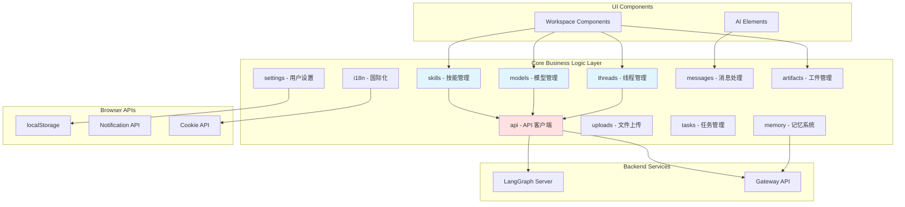

# 【文档编号+模块名】11 - 核心业务逻辑层

## 1. 模块全局定位

- **所属项目**: deer-flow
- **层级位置**: 用户交互层 / frontend/src/core/
- **核心作用**: 封装前端的核心业务逻辑，提供与后端交互的 API、状态管理、数据处理等能力
- **业务价值**: 在 AI 工作流系统中承担"业务逻辑中枢"的角色，连接 UI 组件和后端服务
- **设计初衷**: 该模块是为了解决"如何组织和管理前端业务逻辑"这一需求而设计的。为什么需要独立的 Core 层？因为：
  - **分离关注点**: UI 组件只负责展示，业务逻辑在 Core 层处理
  - **便于测试**: Core 层的函数不依赖 React，可以单独测试
  - **便于复用**: 业务逻辑可以在不同组件中复用
  - **便于迁移**: 未来如果更换 UI 框架，Core 层可以直接复用

---

## 2. 依赖&调用链路 Mermaid 图



### 图表设计解读

**说明**: 该图展示了 Core 层的模块划分及其与 UI、后端的交互关系。

**为什么采用这样的模块划分？**
1. **按业务领域划分**: 每个模块对应一个业务领域（线程、模型、技能等），职责单一
2. **模块间低耦合**: 模块之间通过明确的接口通信，避免直接依赖
3. **统一 API 客户端**: 所有模块通过 `api/` 模块与后端通信，避免分散的 HTTP 请求

**上下游模块的调用顺序是基于什么设计考量？**
UI 组件 → Core Hooks → API 客户端 → 后端服务。这样的单向数据流保证了：
- 状态变化可预测
- 便于调试和追踪
- 避免循环依赖

---

## 3. 核心目录/文件清单

```
frontend/src/core/
├── threads/                      # 线程/会话管理（核心模块）
│   ├── hooks.ts                  # useThreadStream, useThreads 等
│   ├── types.ts                  # AgentThreadState, AgentThreadContext
│   ├── utils.ts                  # 线程相关工具函数
│   ├── export.ts                 # 导出功能
│   └── index.ts
│
├── models/                       # 模型管理
│   ├── hooks.ts                  # useModels
│   ├── api.ts                    # 模型 API
│   └── types.ts                  # 模型类型定义
│
├── skills/                       # 技能管理
│   ├── hooks.ts                  # useSkills, useEnableSkill
│   ├── api.ts                    # 技能 API
│   ├── loader.ts                 # 技能加载器
│   └── types.ts                  # 技能类型定义
│
├── messages/                     # 消息处理
│   ├── utils.ts                  # 消息分组、内容提取
│   └── types.ts                  # 消息类型定义
│
├── settings/                     # 用户设置
│   ├── local.ts                  # localStorage 设置
│   ├── hooks.ts                  # useLocalSettings
│   └── index.ts
│
├── i18n/                         # 国际化
│   ├── hooks.ts                  # useI18n
│   ├── context.tsx               # I18n Context
│   ├── locales/                  # 语言文件
│   │   ├── en-US.ts
│   │   ├── zh-CN.ts
│   │   └── types.ts
│   ├── server.ts                 # 服务端语言检测
│   └── cookies.ts                # Cookie 操作
│
├── artifacts/                    # 工件管理
│   ├── hooks.ts                  # useArtifactContent
│   ├── loader.ts                 # 工件加载器
│   └── index.ts
│
├── uploads/                      # 文件上传
│   ├── hooks.ts                  # useUploadFiles
│   ├── api.ts                    # 上传 API
│   └── types.ts                  # 上传类型定义
│
├── tasks/                        # 任务管理（子代理任务）
│   ├── context.tsx               # TaskContext
│   └── types.ts                  # Subtask 类型
│
├── memory/                       # 记忆系统
│   ├── hooks.ts                  # useMemory
│   ├── api.ts                    # 记忆 API
│   └── types.ts
│
├── mcp/                          # MCP 协议集成
│   ├── hooks.ts                  # useMCP
│   ├── api.ts                    # MCP API
│   └── types.ts
│
├── notification/                 # 通知系统
│   └── hooks.ts                  # useNotification
│
├── api/                          # API 客户端（统一入口）
│   ├── index.ts
│   └── api-client.ts             # LangGraph 客户端单例
│
├── config/                       # 配置管理
│   └── index.ts                  # 环境变量获取
│
├── rehype/                       # Markdown 处理
│   └── index.ts
│
├── streamdown/                   # 流式 Markdown 渲染
│   └── index.ts
│
├── todos/                        # 待办事项
│   └── types.ts
│
├── tools/                        # 工具相关
│   └── types.ts
│
└── utils/                        # 工具函数
    └── datetime.ts               # 日期时间处理
```

**每个模块的设计定位是什么？**

- **threads/**: 为什么是核心？因为线程是 AI 对话的基本单位，所有交互都围绕线程展开。

- **models/**: 为什么独立？因为模型是 AI 的基础能力，需要独立管理（列表、选择、能力检测）。

- **skills/**: 为什么独立？因为技能是 DeerFlow 的特色功能，需要加载、启用、禁用等管理逻辑。

- **messages/**: 为什么独立？因为消息处理逻辑复杂（分组、解析、提取），独立出来便于维护。

- **settings/**: 为什么独立？因为用户设置需要在多个组件间共享，用 localStorage 持久化。

- **i18n/**: 为什么独立？因为国际化是横切关注点，需要贯穿整个应用。

**模块之间的设计关联是什么？**
- `threads/` 依赖 `api/` 与后端通信
- `messages/` 被 `threads/` 使用，处理消息数据
- `settings/` 被 `threads/` 使用，提供用户配置
- `i18n/` 被所有模块使用，提供翻译

---

## 4. 关键源码深度解析

### 4.1 类型定义 - 线程状态与上下文

**文件路径**: `/data/deer-flow-main/frontend/src/core/threads/types.ts`

**功能概述**: 定义 DeerFlow 前端的核心类型，包括线程状态和线程上下文。

```typescript
import type { Message, Thread } from "@langchain/langgraph-sdk";

import type { Todo } from "../todos";

export interface AgentThreadState extends Record<string, unknown> {
  title: string;
  messages: Message[];
  artifacts: string[];
  todos?: Todo[];
}

export interface AgentThread extends Thread<AgentThreadState> {}

export interface AgentThreadContext extends Record<string, unknown> {
  thread_id: string;
  model_name: string | undefined;
  thinking_enabled: boolean;
  is_plan_mode: boolean;
  subagent_enabled: boolean;
  reasoning_effort?: "minimal" | "low" | "medium" | "high";
  agent_name?: string;
}
```

### 逐行解读（含设计考量）

**第 1 行**: `import type { Message, Thread } from "@langchain/langgraph-sdk";`
- **为什么从 SDK 导入类型？** 因为 DeerFlow 使用 LangGraph SDK 的类型系统，确保与后端兼容。

**第 5-10 行**: `AgentThreadState` 接口
- **设计目的**: 定义线程的状态结构，包含标题、消息、工件、待办事项等。
- **为什么继承 `Record<string, unknown>`？** 因为线程状态可能包含其他未知字段，这样可以保持类型安全的同时支持扩展。
- **第 7 行**: `messages: Message[]`
  - **为什么是数组？** 因为一个线程包含多条消息，按时间顺序排列。
- **第 8 行**: `artifacts: string[]`
  - **为什么是字符串数组？** 因为工件用文件路径表示，路径是字符串类型。
- **第 9 行**: `todos?: Todo[]`
  - **为什么是可选的？** 因为不是所有线程都有待办事项，只在 AI 创建任务时出现。

**第 12 行**: `AgentThread` 接口
- **设计目的**: 继承 SDK 的 `Thread` 类型，使用自定义的 `AgentThreadState` 作为状态类型。
- **为什么需要泛型？** 因为 `Thread` 是泛型类型，需要指定状态类型。

**第 14-23 行**: `AgentThreadContext` 接口
- **设计目的**: 定义创建线程时传递的上下文参数。
- **第 15 行**: `thread_id: string`
  - **为什么需要 thread_id？** 因为后端用它标识和关联线程。
- **第 16 行**: `model_name: string | undefined`
  - **为什么是可选的？** 因为可以使用默认模型，用户可以不指定。
- **第 17-19 行**: 布尔标志
  - **为什么用三个独立标志？** 因为它们控制不同的行为：
    - `thinking_enabled`: 是否显示思考过程
    - `is_plan_mode`: 是否进入计划模式
    - `subagent_enabled`: 是否启用子代理
- **第 20 行**: `reasoning_effort?: "minimal" | "low" | "medium" | "high"`
  - **为什么用字面量类型？** 因为只支持这四种值，类型系统可以在编译时捕获错误。

**设计考量**：
1. **为什么用接口而非类型别名？** 因为接口可以继承和扩展，更适合定义对象的形状。
2. **为什么用严格的类型？** 因为 TypeScript 的类型检查可以在编译时发现错误，避免运行时问题。

**如果不这样写会有什么问题？**
- 如果不使用 SDK 类型：可能与后端不兼容，导致运行时错误
- 如果不用可选属性：所有地方都需要提供值，增加代码复杂度
- 如果不用字面量类型：可能出现无效的推理强度值

---

### 4.2 本地设置管理 - 持久化存储

**文件路径**: `/data/deer-flow-main/frontend/src/core/settings/local.ts`

**功能概述**: 管理用户的本地设置（localStorage），包括通知、上下文、布局等配置。

```typescript
import type { AgentThreadContext } from "../threads";

export const DEFAULT_LOCAL_SETTINGS: LocalSettings = {
  notification: {
    enabled: true,
  },
  context: {
    model_name: undefined,
    mode: undefined,
    reasoning_effort: undefined,
  },
  layout: {
    sidebar_collapsed: false,
  },
};

const LOCAL_SETTINGS_KEY = "deerflow.local-settings";

export interface LocalSettings {
  notification: {
    enabled: boolean;
  };
  context: Omit<
    AgentThreadContext,
    "thread_id" | "is_plan_mode" | "thinking_enabled" | "subagent_enabled"
  > & {
    mode: "flash" | "thinking" | "pro" | "ultra" | undefined;
    reasoning_effort?: "minimal" | "low" | "medium" | "high";
  };
  layout: {
    sidebar_collapsed: boolean;
  };
}

export function getLocalSettings(): LocalSettings {
  if (typeof window === "undefined") {
    return DEFAULT_LOCAL_SETTINGS;
  }
  const json = localStorage.getItem(LOCAL_SETTINGS_KEY);
  try {
    if (json) {
      const settings = JSON.parse(json);
      const mergedSettings = {
        ...DEFAULT_LOCAL_SETTINGS,
        context: {
          ...DEFAULT_LOCAL_SETTINGS.context,
          ...settings.context,
        },
        layout: {
          ...DEFAULT_LOCAL_SETTINGS.layout,
          ...settings.layout,
        },
        notification: {
          ...DEFAULT_LOCAL_SETTINGS.notification,
          ...settings.notification,
        },
      };
      return mergedSettings;
    }
  } catch {}
  return DEFAULT_LOCAL_SETTINGS;
}

export function saveLocalSettings(settings: LocalSettings) {
  localStorage.setItem(LOCAL_SETTINGS_KEY, JSON.stringify(settings));
}
```

### 逐行解读（含设计考量）

**第 3-14 行**: 默认设置常量
- **设计目的**: 定义默认值，确保用户首次使用时有合理的配置。
- **第 4 行**: `notification.enabled: true`
  - **为什么默认启用？** 因为通知是重要功能，大多数用户希望看到 AI 完成的提醒。
- **第 7-11 行**: `context` 配置
  - **为什么模型名和模式是 undefined？** 因为用户可能没有指定偏好，应该由系统决定。

**第 16 行**: `LOCAL_SETTINGS_KEY` 常量
- **为什么用常量？** 因为存储键可能在多处使用，常量确保一致性，避免拼写错误。

**第 18-33 行**: `LocalSettings` 接口
- **第 20-26 行**: `context` 类型定义
  - **为什么用 `Omit`？** 因为 `AgentThreadContext` 包含 `thread_id` 等不需要持久化的字段，需要排除。
  - **第 23-24 行**: 添加 `mode` 字段
    - **为什么这里定义而非从 `AgentThreadContext` 导入？** 因为前端的模式概念（flash/thinking/pro/ultra）与后端不完全一致，需要独立定义。

**第 35-62 行**: `getLocalSettings` 函数
- **第 36-38 行**: 服务端渲染检查
  - **为什么检查 `typeof window`？** 因为 localStorage 只在浏览器中可用，服务端渲染时会报错。
  - **设计考量**: 这是通用前端代码处理浏览器 API 的标准模式。
- **第 40 行**: `localStorage.getItem(LOCAL_SETTINGS_KEY)`
  - **为什么用 try-catch？** 因为 JSON.parse 可能失败（如数据被手动修改），需要捕获异常。
- **第 42-58 行**: 深度合并
  - **为什么需要深度合并？** 因为用户可能只设置了部分字段，其他字段应该使用默认值。
  - **第 44-57 行**: 为什么分别合并每个子对象？
    - 因为用户可能添加了新的字段（未来的版本），深度合并可以保留这些字段。

**第 64-66 行**: `saveLocalSettings` 函数
- **设计目的**: 将设置保存到 localStorage。
- **为什么用 `JSON.stringify`？** 因为 localStorage 只能存储字符串，需要序列化对象。

**设计考量**：
1. **为什么用 localStorage？** 因为用户设置需要持久化，localStorage 简单易用且无需额外库。
2. **为什么需要默认值？** 因为首次使用时没有存储的设置，默认值确保功能正常。
3. **为什么用深度合并？** 因为版本升级时可能添加新字段，深度合并确保向后兼容。

**如果不这样写会有什么问题？**
- 如果不检查 `window`：服务端渲染时会报错
- 如果不用 try-catch：数据损坏时整个应用崩溃
- 如果不用深度合并：版本升级后用户设置被重置

---

### 4.3 消息分组与处理 - 复杂数据转换

**文件路径**: `/data/deer-flow-main/frontend/src/core/messages/utils.ts`

**功能概述**: 处理 LangGraph 消息，将原始消息分组，提取内容、思考过程、工件等信息。

```typescript
import type { AIMessage, Message } from "@langchain/langgraph-sdk";

interface GenericMessageGroup<T = string> {
  type: T;
  id: string | undefined;
  messages: Message[];
}

interface HumanMessageGroup extends GenericMessageGroup<"human"> {}

interface AssistantProcessingGroup extends GenericMessageGroup<"assistant:processing"> {}

interface AssistantMessageGroup extends GenericMessageGroup<"assistant"> {}

interface AssistantPresentFilesGroup extends GenericMessageGroup<"assistant:present-files"> {}

interface AssistantClarificationGroup extends GenericMessageGroup<"assistant:clarification"> {}

interface AssistantSubagentGroup extends GenericMessageGroup<"assistant:subagent"> {}

type MessageGroup =
  | HumanMessageGroup
  | AssistantProcessingGroup
  | AssistantMessageGroup
  | AssistantPresentFilesGroup
  | AssistantClarificationGroup
  | AssistantSubagentGroup;

export function groupMessages<T>(
  messages: Message[],
  mapper: (group: MessageGroup) => T,
): T[] {
  if (messages.length === 0) {
    return [];
  }

  const groups: MessageGroup[] = [];

  // Returns the last group if it can still accept tool messages
  // (i.e. it's an in-flight processing group, not a terminal human/assistant group).
  function lastOpenGroup() {
    const last = groups[groups.length - 1];
    if (
      last &&
      last.type !== "human" &&
      last.type !== "assistant" &&
      last.type !== "assistant:clarification"
    ) {
      return last;
    }
    return null;
  }

  for (const message of messages) {
    if (message.name === "todo_reminder") {
      continue;
    }

    if (message.type === "human") {
      groups.push({ id: message.id, type: "human", messages: [message] });
      continue;
    }

    if (message.type === "tool") {
      if (isClarificationToolMessage(message)) {
        // Add to the preceding processing group to preserve tool-call association,
        // then also open a standalone clarification group for prominent display.
        lastOpenGroup()?.messages.push(message);
        groups.push({
          id: message.id,
          type: "assistant:clarification",
          messages: [message],
        });
      } else {
        const open = lastOpenGroup();
        if (open) {
          open.messages.push(message);
        } else {
          console.error(
            "Unexpected tool message outside a processing group",
            message,
          );
        }
      }
      continue;
    }

    if (message.type === "ai") {
      if (hasPresentFiles(message)) {
        groups.push({
          id: message.id,
          type: "assistant:present-files",
          messages: [message],
        });
      } else if (hasSubagent(message)) {
        groups.push({
          id: message.id,
          type: "assistant:subagent",
          messages: [message],
        });
      } else if (hasReasoning(message) || hasToolCalls(message)) {
        const lastGroup = groups[groups.length - 1];
        // Accumulate consecutive intermediate AI messages into one processing group.
        if (lastGroup?.type !== "assistant:processing") {
          groups.push({
            id: message.id,
            type: "assistant:processing",
            messages: [message],
          });
        } else {
          lastGroup.messages.push(message);
        }
      }

      // Not an else-if: a message with reasoning + content (but no tool calls) goes
      // into the processing group above AND gets its own assistant bubble here.
      if (hasContent(message) && !hasToolCalls(message)) {
        groups.push({ id: message.id, type: "assistant", messages: [message] });
      }
    }
  }

  return groups
    .map(mapper)
    .filter((result) => result !== undefined && result !== null) as T[];
}
```

### 逐行解读（含设计考量）

**第 3-27 行**: 消息组类型定义
- **设计目的**: 使用字面量类型定义不同消息组的类型。
- **为什么用接口继承？** 因为所有消息组有相同的结构（type、id、messages），用继承减少重复代码。

**第 41-52 行**: `lastOpenGroup` 函数
- **设计目的**: 获取最后一个"开放"的消息组，即可以继续接收工具消息的组。
- **第 44-50 行**: 为什么排除 human、assistant、clarification？
  - 因为这些是"终端"组，不能再接收工具消息。只有 processing 组可以继续接收。

**第 54-61 行**: 处理 human 消息
- **第 56 行**: 为什么跳过 `todo_reminder`？
  - 因为 todo_reminder 是系统消息，不应该显示给用户。
- **第 60-61 行**: 创建新的人类消息组
  - 为什么每个 human 消息都是独立的组？
  - 因为人类消息通常是用户输入，每条独立显示。

**第 64-86 行**: 处理 tool 消息
- **第 65-74 行**: 澄清消息的特殊处理
  - **第 67 行**: 为什么添加到前一个组？
  - 因为澄清消息是对之前工具调用的响应，应该关联在一起。
  - **第 68-73 行**: 为什么同时创建独立的澄清组？
  - 因为澄清消息需要突出显示，独立组可以实现不同的渲染样式。
- **第 75-84 行**: 普通工具消息
  - **第 76 行**: 获取开放组
  - **第 79-83 行**: 如果没有开放组，记录错误
    - **设计考量**: 工具消息应该属于某个处理组，孤立的消息说明状态异常。

**第 88-120 行**: 处理 AI 消息
- **第 89-94 行**: 文件展示消息
  - **判断条件**: `hasPresentFiles(message)` 检查是否有 `present_files` 工具调用
  - **为什么独立分组？** 因为文件展示需要特殊的 UI（文件列表、预览）

- **第 95-100 行**: 子代理消息
  - **判断条件**: `hasSubagent(message)` 检查是否有 `task` 工具调用
  - **为什么独立分组？** 因为子代理消息需要显示任务卡片和进度

- **第 101-112 行**: 思考/工具调用消息
  - **第 104 行**: 检查上一个组是否是 processing 组
  - **第 105-109 行**: 如果不是，创建新的 processing 组
  - **第 110-111 行**: 如果是，追加到现有组
  - **为什么需要累积？** 因为流式响应会生成多个中间 AI 消息，应该合并显示

- **第 115-119 行**: 有内容的 AI 消息
  - **第 117 行**: 为什么不是 else-if？
  - 因为一条消息可能同时有思考过程和内容，需要同时进入两个组。

**第 123-126 行**: 映射和过滤
- **第 124 行**: `map(mapper)` 将消息组转换为 React 元素
- **第 125 行**: `filter(...)` 移除空值（mapper 可能返回 null）

**设计考量**：
1. **为什么需要消息分组？** 因为原始消息顺序无法反映 UI 的层级关系，分组可以实现更合理的展示。
2. **为什么用字面量类型？** 因为类型系统可以确保所有消息类型都被处理，避免遗漏。
3. **为什么有特殊处理逻辑？** 因为不同类型的消息有不同的渲染需求，需要区分处理。

**如果不这样写会有什么问题？**
- 如果不分组：消息显示顺序混乱，UI 难以理解
- 如果不处理特殊情况：澄清、文件展示等特殊消息显示错误
- 如果不累积 processing 消息：流式响应会产生大量重复的 UI

---

### 4.4 国际化 Hook - 语言切换

**文件路径**: `/data/deer-flow-main/frontend/src/core/i18n/hooks.ts`

**功能概述**: 提供国际化功能的 Hook，包括翻译获取、语言切换、自动检测等。

```typescript
"use client";

import { useEffect } from "react";

import { useI18nContext } from "./context";
import { getLocaleFromCookie, setLocaleInCookie } from "./cookies";
import { enUS } from "./locales/en-US";
import { zhCN } from "./locales/zh-CN";

import {
  DEFAULT_LOCALE,
  detectLocale,
  normalizeLocale,
  type Locale,
  type Translations,
} from "./index";

const translations: Record<Locale, Translations> = {
  "en-US": enUS,
  "zh-CN": zhCN,
};

export function useI18n() {
  const { locale, setLocale } = useI18nContext();

  const t = translations[locale] ?? translations[DEFAULT_LOCALE];

  const changeLocale = (newLocale: Locale) => {
    setLocale(newLocale);
    setLocaleInCookie(newLocale);
  };

  // Initialize locale on mount
  useEffect(() => {
    const saved = getLocaleFromCookie();
    if (saved) {
      const normalizedSaved = normalizeLocale(saved);
      setLocale(normalizedSaved);
      if (saved !== normalizedSaved) {
        setLocaleInCookie(normalizedSaved);
      }
      return;
    }

    const detected = detectLocale();
    setLocale(detected);
    setLocaleInCookie(detected);
  }, [setLocale]);

  return {
    locale,
    t,
    changeLocale,
  };
}
```

### 逐行解读（含设计考量）

**第 1 行**: `"use client";`
- **为什么必须标注？** 因为使用了 React Hooks（useContext、useEffect），必须是 Client Component。

**第 18-21 行**: `translations` 对象
- **设计目的**: 将语言代码映射到翻译内容。
- **为什么用 Record 类型？** 因为可以确保所有 Locale 都有对应的翻译，类型安全。

**第 26 行**: `const { locale, setLocale } = useI18nContext();`
- **为什么从 Context 获取？** 因为语言状态需要在整个应用中共享，Context 提供了统一的状态管理。

**第 28 行**: `const t = translations[locale] ?? translations[DEFAULT_LOCALE];`
- **为什么需要兜底？** 因为某些语言可能缺少翻译（如新增的语言），兜底确保不会显示 undefined。
- **设计考量**: 这是防御性编程的典型案例——处理边界情况。

**第 30-32 行**: `changeLocale` 函数
- **设计目的**: 切换语言并保存到 Cookie。
- **第 31 行**: `setLocale(newLocale)` 更新 React 状态
- **第 32 行**: `setLocaleInCookie(newLocale)` 保存到 Cookie
  - **为什么需要两者？** 因为 React 状态用于当前会话，Cookie 用于持久化和服务端渲染。

**第 35-48 行**: 语言初始化逻辑
- **第 37 行**: 优先检查 Cookie
  - **为什么优先 Cookie？** 因为用户之前选择了语言，应该尊重用户的选择。
- **第 38 行**: `normalizeLocale(saved)` 标准化语言代码
  - **为什么需要标准化？** 因为语言代码可能有多种格式（zh-CN、zh_CN、zh-CN），需要统一。
- **第 40-42 行**: 如果标准化后不同，更新 Cookie
  - **设计目的**: 确保下次读取的是标准化的语言代码。
- **第 45-47 行**: 如果没有保存的语言，自动检测
  - **检测逻辑**: 根据浏览器的 `Accept-Language` 头或系统语言推断。

**第 50-54 行**: 返回值
- **locale**: 当前语言代码
- **t**: 翻译对象
- **changeLocale**: 切换语言函数

**设计考量**：
1. **为什么用 Cookie？** 因为 Cookie 可以在服务端渲染时读取，确保首次渲染就使用正确的语言。
2. **为什么需要自动检测？** 因为首次访问时没有用户偏好，应该根据浏览器语言自动选择。
3. **为什么需要标准化？** 因为不同来源的语言代码格式可能不一致，统一后便于处理。

**如果不这样写会有什么问题？**
- 如果不用 Context：需要在每个组件中传递语言状态，代码冗余
- 如果不用 Cookie：服务端渲染时无法获取用户语言偏好
- 如果不标准化：可能匹配不到正确的翻译

---

### 4.5 工件内容加载 - 缓存策略

**文件路径**: `/data/deer-flow-main/frontend/src/core/artifacts/hooks.ts`

**功能概述**: 加载工件内容，支持缓存和条件加载。

```typescript
import { useQuery } from "@tanstack/react-query";
import { useMemo } from "react";

import { useThread } from "@/components/workspace/messages/context";

import { loadArtifactContent, loadArtifactContentFromToolCall } from "./loader";

export function useArtifactContent({
  filepath,
  threadId,
  enabled,
}: {
  filepath: string;
  threadId: string;
  enabled?: boolean;
}) {
  const isWriteFile = useMemo(() => {
    return filepath.startsWith("write-file:");
  }, [filepath]);
  const { thread, isMock } = useThread();
  const content = useMemo(() => {
    if (isWriteFile) {
      return loadArtifactContentFromToolCall({ url: filepath, thread });
    }
    return null;
  }, [filepath, isWriteFile, thread]);

  const { data, isLoading, error } = useQuery({
    queryKey: ["artifact", filepath, threadId, isMock],
    queryFn: () => {
      return loadArtifactContent({ filepath, threadId, isMock });
    },
    enabled,
    // Cache artifact content for 5 minutes to avoid repeated fetches
    staleTime: 5 * 60 * 1000,
  });
  return { content: isWriteFile ? content : data, isLoading, error };
}
```

### 逐行解读（含设计考量）

**第 17-20 行**: 判断是否为 write-file 工件
- **判断条件**: `filepath.startsWith("write-file:")`
- **为什么需要区分？** 因为 write-file 工件的内容存储在工具调用结果中，而非独立文件。

**第 21-26 行**: 加载 write-file 工件内容
- **为什么用 useMemo？** 因为工件内容提取是计算密集型操作，缓存结果避免重复计算。
- **第 23 行**: `loadArtifactContentFromToolCall`
  - **设计目的**: 从工具调用结果中提取文件内容。

**第 28-37 行**: 使用 TanStack Query 加载工件
- **第 29 行**: `queryKey` 包含所有相关参数
  - **为什么包含这些？** 因为任何参数变化都应该重新获取数据，确保缓存键的唯一性。
- **第 31-33 行**: `queryFn` 调用加载函数
- **第 34 行**: `enabled` 参数
  - **作用**: 允许条件查询，只在需要时加载数据。
- **第 36 行**: `staleTime: 5 * 60 * 1000`
  - **为什么设置为 5 分钟？** 因为工件内容不会频繁变化，缓存 5 分钟可以减少请求，提升性能。
  - **设计考量**: 这是性能优化的典型案例——合理设置缓存时间平衡数据新鲜度和性能。

**第 39 行**: 条件返回
- **为什么需要条件？** 因为 write-file 工件从工具调用加载，其他工件从 API 加载，需要区分。

**设计考量**：
1. **为什么用 TanStack Query？** 因为它提供了缓存、重试、轮询等功能，比手动管理状态更可靠。
2. **为什么需要不同的加载方式？** 因为工件来源不同（工具调用、文件系统），需要适配不同的加载逻辑。
3. **为什么设置缓存时间？** 因为工件加载可能很耗时（如 ZIP 文件），缓存可以避免重复加载。

**如果不这样写会有什么问题？**
- 如果不用 useMemo：每次渲染都重新提取内容，影响性能
- 如果不设置缓存时间：每次切换标签页都重新加载，体验差
- 如果不区分加载方式：某些工件无法正确加载

---

## 5. 底层设计思想（重点强化，详细拆解）

### 5.1 模块整体设计理念

**采用的设计模式/架构思想**：
1. **模块化设计（Modular Design）**: 按业务领域划分模块，每个模块独立封装
2. **Hook 模式（React Hooks）**: 使用自定义 Hook 封装业务逻辑，提供统一的数据访问接口
3. **类型驱动开发（Type-Driven Development）**: 使用 TypeScript 类型定义 API，编译时保证正确性
4. **缓存优先（Cache-First）**: 使用 TanStack Query 管理服务端状态，优先使用缓存数据

**为什么选用这种思想？**
- **模块化**: 降低耦合度，每个模块可以独立开发和测试
- **Hook 模式**: React 推荐的状态管理方式，提供清晰的 API
- **类型驱动**: TypeScript 的类型检查可以在编译时发现错误，减少运行时问题
- **缓存优先**: 减少网络请求，提升用户体验，降低服务器压力

### 5.2 核心痛点解决

**针对 AI 工作流/编排中的哪些核心痛点设计？**

1. **消息处理复杂性**
   - **问题**: LangGraph 返回的消息格式复杂，包含多种类型（人类、AI、工具）
   - **解决方案**: 使用消息分组算法，将原始消息转换为 UI 友好的分组结构

2. **状态持久化**
   - **问题**: 用户设置需要在多个会话间保持
   - **解决方案**: 使用 localStorage 持久化，并提供默认值确保首次使用正常

3. **多语言支持**
   - **问题**: 用户可能使用不同语言，需要动态切换
   - **解决方案**: 使用 React Context + Cookie 实现国际化，支持自动检测和手动切换

4. **性能优化**
   - **问题**: 工件加载、消息渲染可能很耗时
   - **解决方案**: 使用 TanStack Query 缓存数据，使用 useMemo 优化计算

### 5.3 行业对比优势

**相比普通开源 AI 编排项目的前端，有哪些差异化优势？**

1. **完整的类型系统**: 全面使用 TypeScript，从 API 响应到 UI 组件都有类型定义
2. **模块化的业务逻辑**: Core 层独立于 UI，便于测试和复用
3. **智能的缓存策略**: 根据数据特点设置不同的缓存时间，平衡性能和数据新鲜度
4. **健壮的错误处理**: 所有关键操作都有 try-catch 和兜底逻辑

### 5.4 扩展性设计

**模块中的扩展点、预留钩子是如何设计的？**

1. **自定义 Hook**: 所有模块都导出自定义 Hook，便于在组件中使用
2. **类型导出**: 所有类型定义都导出，便于外部模块扩展
3. **API 抽象**: 后端交互通过统一的 API 层，便于替换实现

**为什么要预留这些扩展点？**
- 自定义 Hook: 提供统一的数据访问接口
- 类型导出: 支持类型扩展和自定义
- API 抽象: 便于 Mock 测试和后端替换

### 5.5 设计取舍

**模块设计过程中，有哪些取舍？**

1. **类型安全 vs 开发效率**
   - **取舍**: 选择完整的类型定义
   - **为什么**: 虽然增加了代码量，但编译时检查可以避免大量运行时错误

2. **模块化 vs 代码量**
   - **取舍**: 选择按功能模块化
   - **为什么**: 虽然增加了文件数量，但每个模块更小更易维护

3. **缓存 vs 数据新鲜度**
   - **取舍**: 选择适中的缓存时间（5 分钟）
   - **为什么**: 平衡性能和数据新鲜度，大部分场景下缓存足够新鲜

---

## 6. 必学核心知识点（可直接复用）

### 技术点 1：React Hooks 封装业务逻辑

**对应源码中的设计细节**: 所有 core/xxx/hooks.ts 文件

**说明该技术点的设计逻辑和复用场景**：
- **设计逻辑**: 使用自定义 Hook 封装业务逻辑，通过返回值提供数据和操作
- **复用场景**: 任何需要在组件间共享的业务逻辑

**代码模板**：
```typescript
import { useQuery, useMutation } from "@tanstack/react-query";
import { useQueryClient } from "@tanstack/react-query";

// 数据获取 Hook
export function useData() {
  const { data, isLoading, error } = useQuery({
    queryKey: ["data"],
    queryFn: fetchData,
  });
  return { data, isLoading, error };
}

// 数据修改 Hook
export function useUpdateData() {
  const queryClient = useQueryClient();
  return useMutation({
    mutationFn: async (params) => {
      return await updateData(params);
    },
    onSuccess: () => {
      // 重新获取数据
      queryClient.invalidateQueries({ queryKey: ["data"] });
    },
  });
}
```

### 技术点 2：localStorage 持久化模式

**对应源码中的设计细节**: settings/local.ts

**说明该技术点的设计逻辑和复用场景**：
- **设计逻辑**: 使用 localStorage 持久化用户设置，提供默认值和深度合并
- **复用场景**: 任何需要持久化用户配置的场景

**代码模板**：
```typescript
const DEFAULT_SETTINGS = {
  theme: "light",
  language: "en",
};

const STORAGE_KEY = "app.settings";

export function getSettings() {
  if (typeof window === "undefined") {
    return DEFAULT_SETTINGS;
  }
  const json = localStorage.getItem(STORAGE_KEY);
  try {
    if (json) {
      const stored = JSON.parse(json);
      return { ...DEFAULT_SETTINGS, ...stored };
    }
  } catch {}
  return DEFAULT_SETTINGS;
}

export function saveSettings(settings) {
  localStorage.setItem(STORAGE_KEY, JSON.stringify(settings));
}
```

### 技术点 3：TanStack Query 缓存策略

**对应源码中的设计细节**: artifacts/hooks.ts

**说明该技术点的设计逻辑和复用场景**：
- **设计逻辑**: 使用 staleTime 控制数据新鲜度，减少不必要的请求
- **复用场景**: 任何需要管理服务端状态的场景

**代码示例**：
```typescript
const { data } = useQuery({
  queryKey: ["resource", id],
  queryFn: () => fetchResource(id),
  staleTime: 5 * 60 * 1000, // 5 分钟内认为数据新鲜
  gcTime: 10 * 60 * 1000, // 10 分钟后垃圾回收
  refetchOnWindowFocus: false, // 窗口聚焦时不重新获取
});
```

### 技术点 4：类型安全的消息处理

**对应源码中的设计细节**: messages/utils.ts

**说明该技术点的设计逻辑和复用场景**：
- **设计逻辑**: 使用字面量类型定义消息类型，配合类型守卫确保类型安全
- **复用场景**: 任何需要处理复杂消息结构的场景

**代码示例**：
```typescript
type MessageType = "text" | "image" | "video";

interface BaseMessage {
  type: MessageType;
  id: string;
}

interface TextMessage extends BaseMessage {
  type: "text";
  content: string;
}

interface ImageMessage extends BaseMessage {
  type: "image";
  url: string;
  alt?: string;
}

type Message = TextMessage | ImageMessage;

// 类型守卫
function isTextMessage(message: Message): message is TextMessage {
  return message.type === "text";
}

// 使用
function processMessage(message: Message) {
  if (isTextMessage(message)) {
    // TypeScript 知道这里是 TextMessage
    console.log(message.content);
  }
}
```

### 工程设计点：服务端渲染兼容模式

**可复用的设计思路**：
- **设计模式**: 检查 `typeof window` 区分服务端和客户端环境
- **适用场景**: 任何需要支持服务端渲染的代码

**为什么这是最佳实践**：
- 确保代码在两个环境都能正常运行
- 避免服务端渲染时访问浏览器 API 导致错误

---

## 7. 可直接拷贝复用代码片段

### 片段 1：本地设置管理模板

**这些代码片段的设计优势**：
- 支持默认值
- 支持深度合并
- 支持服务端渲染

```typescript
interface Settings {
  theme: "light" | "dark";
  language: string;
}

const DEFAULT_SETTINGS: Settings = {
  theme: "light",
  language: "en",
};

const STORAGE_KEY = "app.settings";

export function getSettings(): Settings {
  if (typeof window === "undefined") {
    return DEFAULT_SETTINGS;
  }
  const json = localStorage.getItem(STORAGE_KEY);
  try {
    if (json) {
      return { ...DEFAULT_SETTINGS, ...JSON.parse(json) };
    }
  } catch {}
  return DEFAULT_SETTINGS;
}

export function saveSettings(settings: Settings): void {
  localStorage.setItem(STORAGE_KEY, JSON.stringify(settings));
}
```

### 片段 2：条件查询 Hook

**设计优势**：
- 支持条件查询
- 支持手动触发
- 支持缓存配置

```typescript
import { useQuery } from "@tanstack/react-query";

export function useResource({
  id,
  enabled = true,
  staleTime = 5 * 60 * 1000,
}: {
  id: string;
  enabled?: boolean;
  staleTime?: number;
}) {
  return useQuery({
    queryKey: ["resource", id],
    queryFn: () => fetchResource(id),
    enabled: enabled && !!id,
    staleTime,
  });
}
```

### 片段 3：类型守卫模板

**设计优势**：
- 编译时类型安全
- 运行时类型检查
- 清晰的代码意图

```typescript
interface Cat {
  type: "cat";
  meow: () => void;
}

interface Dog {
  type: "dog";
  bark: () => void;
}

type Animal = Cat | Dog;

function isCat(animal: Animal): animal is Cat {
  return animal.type === "cat";
}

function makeSound(animal: Animal) {
  if (isCat(animal)) {
    animal.meow(); // TypeScript 知道这是 Cat
  } else {
    animal.bark(); // TypeScript 知道这是 Dog
  }
}
```

### 片段 4：国际化 Hook 模板

**设计优势**：
- 支持 Cookie 持久化
- 支持自动检测
- 支持动态切换

```typescript
import { useEffect } from "react";

const translations = {
  en: { hello: "Hello" },
  zh: { hello: "你好" },
};

export function useI18n() {
  const [locale, setLocale] = useState("en");

  useEffect(() => {
    const saved = getCookie("locale");
    if (saved) {
      setLocale(saved);
    } else {
      const detected = detectLocale();
      setLocale(detected);
    }
  }, []);

  const t = translations[locale] || translations.en;

  const changeLocale = (newLocale: string) => {
    setLocale(newLocale);
    setCookie("locale", newLocale);
  };

  return { locale, t, changeLocale };
}
```

---

## 8. 踩坑提醒 & 二次开发建议

### 踩坑提醒

1. **localStorage 在服务端渲染时报错**
   - **问题**: 直接使用 localStorage 导致服务端渲染崩溃
   - **为什么会有这些问题**: localStorage 只在浏览器环境可用
   - **解决**: 使用 `typeof window === "undefined"` 检查

2. **TanStack Query 的无限重渲染**
   - **问题**: queryKey 依赖不稳定对象导致无限请求
   - **为什么会有这些问题**: 对象引用变化会被认为是新的查询
   - **解决**: 确保queryKey 中的值是稳定的（字符串、数字、布尔值）

3. **类型守卫的类型收窄失效**
   - **问题**: 类型守卫无法正确收窄类型
   - **为什么会有这些问题**: 类型守卫的实现不正确
   - **解决**: 使用 `parameterName is Type` 语法

4. **useMemo 的依赖项错误**
   - **问题**: useMemo 没有正确缓存结果
   - **为什么会有这些问题**: 依赖项不完整或包含不稳定值
   - **解决**: 确保依赖项包含所有使用的变量

### 二次开发建议

**适配自定义改造、私有化部署、接入自有大模型/自有前端的优化方向**：

1. **扩展本地设置**
   - **优化建议的设计依据**: 企业可能有更多配置需求
   - **如何在不破坏原有设计逻辑的前提下进行改造**:
     - 在 LocalSettings 接口中添加新字段
     - 更新 DEFAULT_LOCAL_SETTINGS
     - 确保深度合并逻辑正确处理新字段

2. **添加新的消息类型**
   - **优化建议的设计依据**: 后端可能返回新的消息类型
   - **如何在不破坏原有设计逻辑的前提下进行改造**:
     - 在 MessageGroup 类型中添加新的分支
     - 在 groupMessages 函数中添加处理逻辑
     - 在 UI 组件中添加对应的渲染逻辑

3. **自定义缓存策略**
   - **优化建议的设计依据**: 不同数据可能有不同的更新频率
   - **如何在不破坏原有设计逻辑的前提下进行改造**:
     - 根据数据类型设置不同的 staleTime
     - 为实时性要求高的数据禁用缓存
     - 为变化频率低的数据增加缓存时间

4. **支持更多的语言**
   - **优化建议的设计依据**: 需要支持更多国家/地区
   - **如何在不破坏原有设计逻辑的前提下进行改造**:
     - 在 locales/ 目录添加新的语言文件
     - 在 translations 对象中注册新语言
     - 更新 Locale 类型定义

---

## 9. 文档衔接

**本篇完结**，下一篇将解析：**【12 - 状态管理方案】**

**衔接说明**：
下一篇模块与当前模块的设计关联是：本篇讲解了 Core 层的业务逻辑组织，下一篇将深入状态管理方案，讲解如何使用 TanStack Query 和 Zustand 管理服务端状态和客户端状态。

**为什么按这个顺序解析？**
1. 先理解 Core 层（本篇），知道业务逻辑如何组织
2. 再理解状态管理（下一篇），了解状态如何流动和更新
3. 之后是 API 客户端等具体实现

这符合"由逻辑到状态，由业务到基础"的层级递进逻辑。
