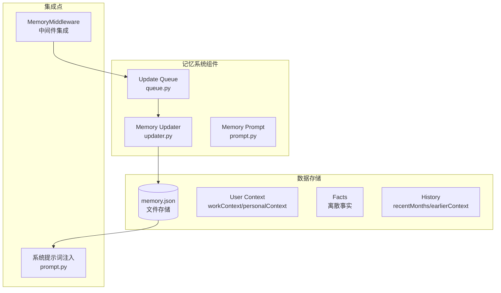
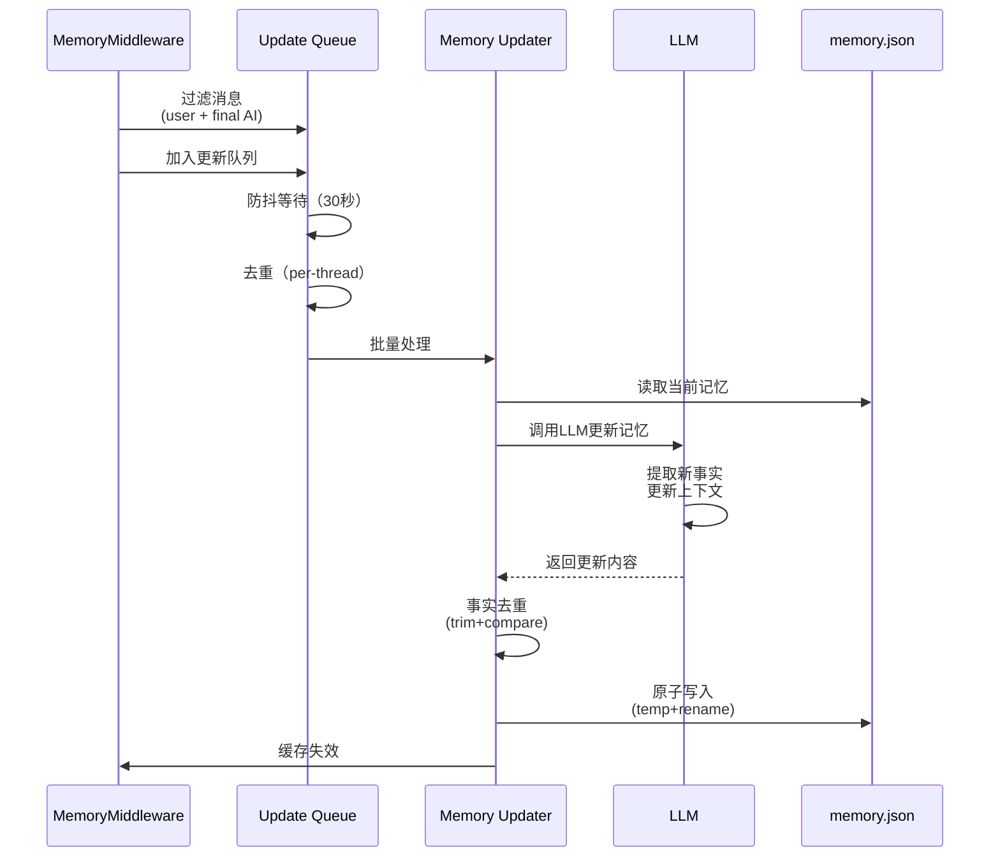

# 【文档11】记忆系统 —— AI如何"记住"对话

## 1. 五分钟速览

**这篇文档解决什么问题？**

如果你想了解：
- AI的记忆和数据库有什么区别？
- DeerFlow的记忆系统如何实现？
- 记忆如何保存、检索、使用？
- LLM如何驱动记忆更新？

那么这篇文档给你**记忆系统的完整认知**。

**阅读后你将获得**：
- 短期记忆 vs 长期记忆的区别
- DeerFlow记忆系统的实际实现（基于源码）
- 记忆更新的完整流程
- 面试时关于记忆问题的精炼回答

---

## 2. 为什么需要记忆系统？

### 2.1 传统AI对话的问题

```
用户：我喜欢苹果
AI：好的

用户：那推荐我一些水果
AI：香蕉、橙子、葡萄...

问题：AI忘了用户刚才说喜欢苹果！
```

**根本原因**：传统AI每次对话都是独立的，没有记忆。

### 2.2 DeerFlow的解决方案

```
用户：我喜欢苹果
AI：好的 → [保存到记忆：用户喜欢苹果]

用户：那推荐我一些水果
AI：[检索记忆] → 用户喜欢苹果
AI：既然你喜欢苹果，我推荐你尝试...
```

**记忆系统的价值**：
- ✅ 跨会话保持上下文
- ✅ 积累知识，越用越聪明
- ✅ 个性化体验
- ✅ 避免重复问答

---

## 3. DeerFlow记忆系统架构（基于实际代码）

### 3.1 系统组件



### 3.2 源码位置

```
backend/packages/harness/deerflow/agents/memory/
├── updater.py      # 记忆更新器（LLM驱动）
├── queue.py        # 更新队列（防抖）
└── prompt.py       # 提示词模板

backend/packages/harness/deerflow/agents/lead_agent/
└── prompt.py       # 系统提示词（包含记忆注入）
```

---

## 4. 记忆数据结构（基于实际代码）

### 4.1 memory.json格式

**源码位置**：`backend/packages/harness/deerflow/agents/memory/updater.py`

```json
{
  "userContext": {
    "workContext": "用户的工作背景",
    "personalContext": "用户的个人背景",
    "topOfMind": "1-3句话的当前关注点"
  },
  "history": {
    "recentMonths": "最近几个月的重要事项",
    "earlierContext": "更早的背景信息",
    "longTermBackground": "长期背景"
  },
  "facts": [
    {
      "id": "fact_001",
      "content": "用户喜欢吃苹果",
      "category": "preference",
      "confidence": 0.9,
      "createdAt": "2026-04-01T10:00:00Z",
      "source": "conversation"
    }
  ]
}
```

### 4.2 事实分类

**源码分析**：
```python
# 事实分类（category字段）
CATEGORIES = [
    "preference",   # 偏好（喜欢吃什么、喜欢的颜色）
    "knowledge",     # 知识（专业技能、工作领域）
    "context",       # 上下文（当前项目、家庭成员）
    "behavior",      # 行为（工作习惯、沟通风格）
    "goal"           # 目标（短期目标、长期计划）
]
```

---

## 5. 记忆更新流程（基于实际代码）

### 5.1 更新器工作流程

**源码位置**：`backend/packages/harness/deerflow/agents/memory/updater.py`



### 5.2 核心代码解析

**MemoryMiddleware**（源码）：
```python
# 来自：agents/middlewares/memory_middleware.py

class MemoryMiddleware:
    async def after_model(self, config):
        """模型响应后执行"""
        state = config["state"]

        # 过滤消息：只处理用户输入和最终AI响应
        messages = state["messages"]
        filtered = [
            msg for msg in messages
            if msg.type in ("human", "ai")  # 人类和AI消息
            and not getattr(msg, "tool_calls", None)  # 不是工具调用
        ]

        if filtered:
            # 加入更新队列
            from deerflow.agents.memory.queue import memory_update_queue
            await memory_update_queue.enqueue(
                thread_id=state["thread_id"],
                messages=filtered
            )
```

**MemoryUpdater**（源码简化）：
```python
# 来自：agents/memory/updater.py

class MemoryUpdater:
    def update_memory(self, messages):
        """LLM驱动的记忆更新"""
        # 1. 读取当前记忆
        current_memory = self._load_memory()

        # 2. 构建提示词
        prompt = self._build_update_prompt(
            current_memory=current_memory,
            messages=messages
        )

        # 3. 调用LLM
        response = self.llm.invoke(prompt)

        # 4. 解析更新内容
        updates = self._parse_updates(response.content)

        # 5. 应用更新（事实去重）
        if "facts" in updates:
            updates["facts"] = self._deduplicate_facts(
                current_memory["facts"] + updates["facts"]
            )

        # 6. 原子写入
        self._atomic_write(updates)
```

### 5.3 记忆队列机制

**源码位置**：`backend/packages/harness/deerflow/agents/memory/queue.py`

```python
# 核心逻辑（简化）
class MemoryUpdateQueue:
    def __init__(self, debounce_seconds=30):
        self.queue = {}  # thread_id -> messages
        self.debounces = {}  # thread_id -> task
        self.debounce_seconds = debounce_seconds

    async def enqueue(self, thread_id, messages):
        """加入更新队列"""
        # 1. 添加到队列
        if thread_id not in self.queue:
            self.queue[thread_id] = []

        self.queue[thread_id].extend(messages)

        # 2. 防抖处理
        if thread_id in self.debounces:
            self.debounces[thread_id].cancel()  # 取消之前的任务

        # 3. 创建新的防抖任务
        self.debounces[thread_id] = asyncio.create_task(
            self._debounced_process(thread_id)
        )

    async def _debounced_process(self, thread_id):
        """防抖处理"""
        await asyncio.sleep(self.debounce_seconds)

        # 4. 处理队列中的消息
        messages = self.queue.get(thread_id, [])
        if messages:
            await self._process_messages(thread_id, messages)

        # 5. 清理
        self.queue.pop(thread_id, None)
        self.debounces.pop(thread_id, None)
```

**设计考量**：
```
为什么需要防抖？

1. 避免频繁更新
   → 用户可能连续发多条消息
   → 等待30秒后一次性处理
   → 减少LLM调用次数

2. 批量处理
   → 多条消息合并处理
   → 提取更多上下文
   → 记忆质量更高

3. 性能优化
   → 减少I/O操作
   → 减少LLM API调用
   → 降低成本

4. Per-thread去重
   → 同一线程只保留最新队列
   → 避免重复处理
```

---

## 6. 记忆检索与注入

### 6.1 记忆注入机制

**源码位置**：`backend/packages/harness/deerflow/agents/lead_agent/prompt.py`

```python
# 系统提示词中的记忆注入
def apply_prompt_template(
    subagent_enabled=False,
    max_concurrent_subagents=3,
    agent_name=None,
    available_skills=None
):
    """应用系统提示词模板"""

    # 获取记忆数据
    from deerflow.agents.memory import get_memory_for_injection

    memory_data = get_memory_for_injection()

    # 构建记忆部分
    memory_section = ""
    if memory_data:
        memory_section = "<memory>\n"
        # 注入用户上下文
        if memory_data.get("userContext"):
            memory_section += f"User Context:\n"
            memory_section += f"- Work: {memory_data['userContext'].get('workContext', '')}\n"
            memory_section += f"- Personal: {memory_data['userContext'].get('personalContext', '')}\n"
            memory_section += f"- Top of Mind: {memory_data['userContext'].get('topOfMind', '')}\n"

        # 注入事实（最多15个）
        facts = memory_data.get("facts", [])[:15]
        if facts:
            memory_section += "\nRelevant Facts:\n"
            for fact in facts:
                memory_section += f"- {fact['content']}\n"

        memory_section += "</memory>\n"

    # 构建完整提示词
    system_prompt = f"""
{memory_section}

## 你的角色
你是DeerFlow AI助手，可以调用工具、委托子代理完成任务...

## 子代理协作
{subagent_section}

## 技能
{skills_section}
"""

    return system_prompt.strip()
```

### 6.2 记忆检索逻辑

**源码分析**：
```python
# 来自：agents/memory/updater.py（概念）

def get_memory_for_injection():
    """获取用于注入的记忆数据"""

    # 1. 读取memory.json
    memory = _load_memory_file()

    # 2. 按置信度排序事实
    facts = memory.get("facts", [])
    sorted_facts = sorted(
        facts,
        key=lambda f: f.get("confidence", 0),
        reverse=True
    )

    # 3. 只保留高置信度事实
    high_confidence_facts = [
        f for f in sorted_facts
        if f.get("confidence", 0) >= 0.7
    ]

    # 4. 返回用于注入的数据
    return {
        "userContext": memory.get("userContext", {}),
        "facts": high_confidence_facts[:15]  # 最多15个
    }
```

---

## 7. 记忆配置系统

### 7.1 配置选项（config.yaml）

```yaml
# 来自：config.example.yaml

memory:
  # 主开关
  enabled: true

  # 注入开关
  injection_enabled: true

  # 存储路径
  storage_path: ".deer-flow/memory.json"

  # 防抖时间（秒）
  debounce_seconds: 30

  # 记忆更新使用的模型
  model_name: null  # null = 使用默认模型

  # 最大事实数量
  max_facts: 100

  # 事实置信度阈值
  fact_confidence_threshold: 0.7

  # 最大注入token数
  max_injection_tokens: 2000
```

### 7.2 配置加载机制

**源码分析**：
```python
# 来自：deerflow/config/memory_config.py

class MemoryConfig(BaseModel):
    enabled: bool = True
    injection_enabled: bool = True
    storage_path: str = ".deer-flow/memory.json"
    debounce_seconds: int = 30
    model_name: str | None = None
    max_facts: int = 100
    fact_confidence_threshold: float = 0.7
    max_injection_tokens: int = 2000

# 热重载机制
def get_memory_config() -> MemoryConfig:
    """获取记忆配置，支持热重载"""
    config = get_app_config()
    return config.memory
```

---

## 8. 设计思想（基于实际代码）

### 8.1 为什么用LLM驱动记忆更新？

**设计考量**：
```
传统方法（规则提取）：
→ 固定模式匹配
→ 容易遗漏信息
→ 无法理解上下文

LLM方法（智能提取）：
→ 理解语义
→ 提取隐含信息
→ 自动分类事实

DeerFlow的实现：
→ 使用专门的LLM调用
→ 提供结构化的提示词
→ 解析LLM的JSON输出

优势：
→ 记忆质量更高
→ 更少人工干预
→ 自动适应不同场景
```

### 8.2 为什么需要事实去重？

**源码分析**：
```python
# 来自：agents/memory/updater.py

def _deduplicate_facts(self, facts):
    """事实去重"""
    seen = set()
    unique = []

    for fact in facts:
        # 标准化：trim空白
        content = fact["content"].strip()

        # 检查是否已存在
        if content not in seen:
            seen.add(content)
            unique.append(fact)

    return unique
```

```
为什么需要去重？

1. 避免重复
   → 同一事实可能被多次提取
   → 去重保持记忆精简

2. 标准化
   → trim去除首尾空白
   → " 苹果 " 和 "苹果" 视为相同

3. 性能
   → 减少存储
   → 加快检索
   → 降低注入成本
```

### 8.3 为什么用原子写入？

**源码分析**：
```python
# 来自：agents/memory/updater.py

def _atomic_write(self, updates):
    """原子写入记忆"""
    import tempfile
    import shutil

    # 1. 写入临时文件
    temp_file = tempfile.NamedTemporaryFile(
        mode="w",
        delete=False,
        suffix=".json"
    )

    json.dump(updates, temp_file)
    temp_file.close()

    # 2. 原子性替换
    shutil.move(temp_file.name, self.storage_path)

    # 3. 清理
    os.unlink(temp_file.name)
```

```
为什么原子写入？

1. 数据一致性
   → 避免写入过程中断
   → 避免写入到一半的数据

2. 并发安全
   → 使用文件系统的原子操作
   → 避免并发写入冲突

3. 容错性
   → 写入失败不影响原数据
   → 可以重试
```

---

## 9. 面试要点

### Q1: DeerFlow的记忆系统如何工作？

**参考回答**：
```
DeerFlow的记忆系统包含三个核心组件：

1. MemoryMiddleware
   → 拦截用户和AI消息
   → 过滤掉工具调用消息
   → 加入更新队列

2. Update Queue（防抖队列）
   → 30秒防抖
   → Per-thread去重
   → 批量处理消息

3. MemoryUpdater（LLM驱动）
   → 读取当前记忆
   → 调用LLM提取新事实
   → 事实去重
   → 原子写入memory.json

4. 记忆注入
   → 系统提示词注入
   → 用户上下文 + Top15事实
   → 每次对话自动注入

关键特点：
→ LLM驱动，智能提取
→ 异步更新，不阻塞对话
→ 防抖机制，提高效率
→ 事实去重，保持精简
```

### Q2: 记忆数据存储在哪里？

**参考回答**：
```
存储位置：
→ 默认：backend/.deer-flow/memory.json
→ 可配置：config.yaml中的memory.storage_path

数据结构：
{
  "userContext": {
    "workContext": "工作背景",
    "personalContext": "个人背景",
    "topOfMind": "当前关注点"
  },
  "history": {
    "recentMonths": "最近月份",
    "earlierContext": "更早背景",
    "longTermBackground": "长期背景"
  },
  "facts": [
    {
      "id": "唯一ID",
      "content": "事实内容",
      "category": "preference/knowledge/context/behavior/goal",
      "confidence": 0.0-1.0,
      "createdAt": "时间戳",
      "source": "来源"
    }
  ]
}

为什么用JSON文件？
→ 简单易读
→ 便于调试
→ 易于备份
→ 对于单个用户场景足够
```

### Q3: 记忆更新是实时的吗？

**参考回答**：
```
记忆更新不是实时的：

1. 防抖机制
   → 默认30秒防抖
   → 用户停止输入30秒后才开始处理

2. 异步执行
   → 在后台线程中处理
   → 不阻塞用户对话

3. 批量处理
   → 多条消息合并处理
   → 减少LLM调用次数

为什么这样设计？
→ 避免频繁更新
→ 降低LLM调用成本
→ 提高系统性能
→ 记忆质量更好（更多上下文）

用户体验：
→ 当前对话不会立即反映到记忆
→ 下一场对话会看到更新后的记忆
```

### Q4: 如何控制记忆的容量？

**参考回答**：
```
容量控制机制：

1. 事实数量限制
   → config.yaml: max_facts: 100
   → 超过就不再添加

2. 置信度过滤
   → config.yaml: fact_confidence_threshold: 0.7
   → 只保留高置信度事实

3. 注入数量限制
   → 只注入Top15事实
   → 控制上下文大小

4. Token限制
   → max_injection_tokens: 2000
   → 控制记忆注入的token数

这些机制确保：
→ 记忆不会无限增长
→ 只保留高质量事实
→ 注入的记忆不会占用太多上下文
```

### Q5: 记忆系统如何保证数据一致性？

**参考回答**：
```
一致性保证机制：

1. 原子写入
   → 使用临时文件 + shutil.move
   → 文件系统级别的原子操作
   → 避免写入中断

2. 事实去重
   → trim标准化
   → content级别的去重
   → 避免重复事实

3. 队列去重
   → per-thread去重
   → 同一线程只保留最新队列
   → 避免重复处理

4. 缓存失效
   → 更新后清除缓存
   → 下次读取获取最新数据
   → 确保注入的是最新记忆

5. 文件锁（可选）
   → 可以使用文件锁
   → 防止并发写入冲突
```

---

## 10. 延伸思考

### 10.1 记忆的隐私保护

```
隐私考虑：

1. 存储位置
   → 本地JSON文件
   → 用户可以完全控制

2. 敏感信息
   → LLM可能提取敏感信息
   → 需要手动审查memory.json

3. 共享风险
   → 当前设计不支持多用户隔离
   → 生产环境需要考虑隔离

4. 删除机制
   → 可以手动编辑memory.json
   → 可以删除特定事实
   → 清空后重新学习
```

### 10.2 记忆的迁移

```
如何迁移记忆？

场景：
→ 从JSON迁移到数据库
→ 从单用户迁移到多用户

实现：
1. 实现新的存储后端
2. 保持MemoryUpdater接口
3. 修改_load和_save方法
4. 数据迁移脚本

DeerFlow的设计：
→ 更新器抽象化
→ 存储逻辑集中
→ 便于扩展
```

### 10.3 记忆的分析价值

```
记忆数据的分析价值：

1. 用户行为分析
   → 了解用户偏好
   → 发现使用模式

2. 系统改进
   → 发现记忆质量问题
   → 优化提示词

3. 个性化推荐
   → 基于历史行为推荐
   → 提高用户体验

4. 数据挖掘
   → 发现隐藏模式
   → 指导产品改进
```

---

## 11. 思考问题

### 11.1 理解检验

1. DeerFlow的记忆系统由哪些组件组成？
2. 记忆更新是实时的吗？为什么？
3. 记忆数据存储在哪里？格式是什么？

### 11.2 设计思考

4. 为什么用LLM驱动记忆更新？
5. 为什么需要事实去重？如何实现？
6. 为什么用原子写入？有什么好处？

### 11.3 场景应用

7. 如果要迁移到数据库存储，需要改哪些部分？
8. 如果要支持多用户记忆隔离，应该怎么设计？
9. 如果要手动删除某个事实，应该怎么做？

---

## 12. 本篇小结

**核心要点**：

1. **记忆组件**：MemoryMiddleware（拦截）、Update Queue（防抖）、MemoryUpdater（LLM驱动）
2. **数据结构**：UserContext + Facts（分类、置信度、时间戳）
3. **更新流程**：拦截→队列→LLM提取→去重→原子写入
4. **注入机制**：系统提示词注入用户上下文+Top15事实
5. **设计特点**：异步更新、防抖机制、事实去重、原子写入

**你现在已经理解了记忆系统**，下一篇我们将深入**中间件系统**，看看请求处理的"流水线"。

---

## 13. 文档衔接

**本篇完结**，下一篇将解析：【12-中间件系统：请求处理的"流水线"】

**衔接说明**：
- 11篇解决了"AI如何记忆"的问题
- 12篇将解决"请求如何处理"的问题
- 中间件是请求进入Agent前的必经之路
- MemoryMiddleware也是中间件的一种
- 理解中间件才能完整理解请求处理全链路
