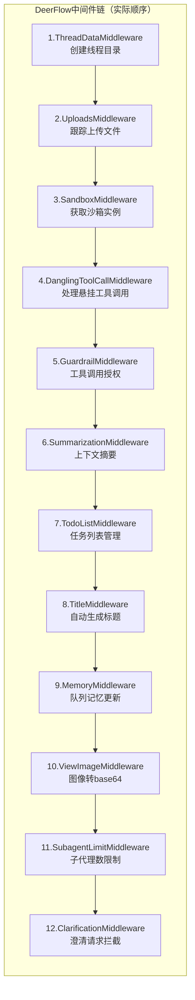
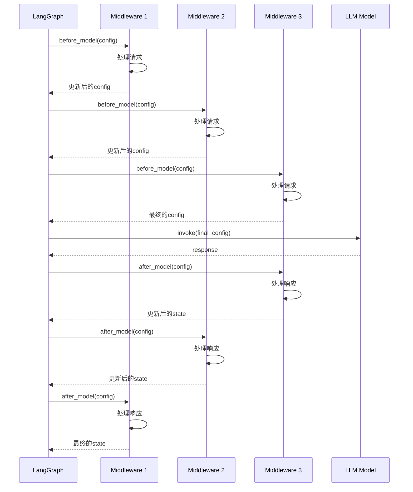

# 【文档12】中间件系统 —— 请求处理的"流水线"

## 1. 五分钟速览

**这篇文档解决什么问题？**

如果你想了解：
- 中间件是什么？
- DeerFlow有哪12个中间件？
- 中间件如何执行？
- 如何添加自定义中间件？

那么这篇文档给你**中间件系统的完整认知**。

**阅读后你将获得**：
- 中间件模式的核心思想
- DeerFlow 12个中间件的完整解析（基于实际代码）
- 中间件的执行顺序和设计考量
- 面试时关于中间件问题的精炼回答

---

## 2. 中间件是什么？

### 2.1 从一个类比开始

**工厂流水线**：
```
原材料 → [清洗] → [切割] → [打磨] → [喷漆] → [包装] → 成品

每个环节：
→ 只做一件事（职责单一）
→ 按顺序执行（不能乱）
→ 可以替换或增加（灵活）
```

**中间件系统**：
```
请求 → [中间件1] → [中间件2] → [中间件3] → ... → Agent处理
       ↓              ↓              ↓
    预处理1        预处理2        预处理3
```

### 2.2 中间件 vs 普通函数

| 维度 | 中间件 | 普通函数 |
|------|--------|----------|
| **职责** | 处理请求/响应的某个特定方面 | 完成某个具体功能 |
| **执行方式** | 链式调用，按顺序执行 | 独立调用 |
| **控制权** | 可以决定是否继续传递 | 执行完就返回 |
| **灵活性** | 可插拔、可排序 | 固定在代码中 |

---

## 3. DeerFlow的12个中间件（基于实际代码）

### 3.1 实际中间件顺序

**源码位置**：`backend/packages/harness/deerflow/agents/lead_agent/agent.py`

```python
# 来自：_build_middlewares()函数
def _build_middlewares(config, model_name, agent_name, custom_middlewares):
    middlewares = build_lead_runtime_middlewares(lazy_init=True)

    # 按顺序添加中间件
    middlewares.extend([
        summarization_middleware,  # 可选
        todo_list_middleware,        # 可选
        TokenUsageMiddleware(),
        TitleMiddleware(),
        MemoryMiddleware(agent_name=agent_name),
        ViewImageMiddleware(),       # 条件：模型支持vision
        DeferredToolFilterMiddleware(),  # 可选
        SubagentLimitMiddleware(),    # 可选
        LoopDetectionMiddleware(),
        ClarificationMiddleware()
    ])

    return middlewares
```

### 3.2 完整中间件链



---

## 4. 关键中间件详解

### 4.1 ThreadDataMiddleware

**源码位置**：`agents/middlewares/thread_data_middleware.py`

```python
# 核心逻辑（简化）
class ThreadDataMiddleware:
    async def before_model(self, config):
        """模型调用前执行"""
        state = config["state"]
        thread_id = state["thread_id"]

        # 创建线程目录
        thread_dir = Path(f".deer-flow/threads/{thread_id}")
        thread_dir.mkdir(parents=True, exist_ok=True)

        # 创建子目录
        (thread_dir / "user-data" / "workspace").mkdir(exist_ok=True)
        (thread_dir / "user-data" / "uploads").mkdir(exist_ok=True)
        (thread_dir / "user-data" / "outputs").mkdir(exist_ok=True)

        # 存储到state
        state["thread_data"] = {
            "thread_id": thread_id,
            "thread_dir": str(thread_dir)
        }
```

**为什么必须在最前？**
```
→ 后续中间件需要thread_id
→ 后续中间件需要thread_dir
→ 文件上传、沙箱等都需要这些信息
```

### 4.2 MemoryMiddleware

**源码位置**：`agents/middlewares/memory_middleware.py`

```python
# 核心逻辑
class MemoryMiddleware:
    async def after_model(self, config):
        """模型响应后执行"""
        state = config["state"]

        # 过滤消息
        messages = [
            msg for msg in state["messages"]
            if msg.type in ("human", "ai")
            and not getattr(msg, "tool_calls", None)
        ]

        if messages:
            # 加入更新队列
            from deerflow.agents.memory.queue import memory_update_queue
            await memory_update_queue.enqueue(
                thread_id=state["thread_id"],
                messages=messages
            )
```

**为什么在Title之后？**
```
→ 标题生成后才开始记录对话
→ 避免记录标题生成的过程
→ 保持对话的连续性
```

### 4.3 SubagentLimitMiddleware

**源码位置**：`agents/middlewares/subagent_limit_middleware.py`

```python
# 核心逻辑
class SubagentLimitMiddleware:
    def __init__(self, max_concurrent=3):
        self.max_concurrent = max_concurrent

    async def after_model(self, config):
        """模型响应后执行"""
        state = config["state"]

        # 统计task调用
        task_calls = self._count_task_calls(state["messages"])

        # 超过限制就截断
        if len(task_calls) > self.max_concurrent:
            # 保留前N个
            state["messages"] = self._truncate_messages(
                state["messages"],
                self.max_concurrent
            )
```

**为什么在after_model？**
```
→ 需要检查模型响应中有多少task调用
→ 在模型响应后才能知道
→ 截断多余的调用
```

### 4.4 ClarificationMiddleware

**源码位置**：`agents/middlewares/clarification_middleware.py`

```python
# 核心逻辑
class ClarificationMiddleware:
    async def before_model(self, config):
        """模型调用前执行"""
        state = config["state"]

        # 检查是否有待处理的澄清
        if self._has_pending_clarification(state):
            # 中断执行，返回给用户
            raise Command(
                goto=END,
                update={
                    "messages": [
                        AIMessage(
                            content="请澄清：...",
                            role="assistant"
                        )
                    ]
                }
            )
```

**为什么必须在最后？**
```
→ 需要拦截所有可能的澄清请求
→ 包括其他中间件添加的
→ 一旦拦截就中断执行
```

---

## 5. 中间件接口定义

### 5.1 AgentMiddleware接口

**源码分析**：
```python
# 来自：langchain.agents.middleware

class AgentMiddleware:
    async def before_model(self, config):
        """模型调用前执行"""
        pass

    async def after_model(self, config):
        """模型响应后执行"""
        pass
```

### 5.2 中间件的执行流程



---

## 6. 中间件的设计原则

### 6.1 为什么这个顺序？

**源码注释**：
```python
# 来自：agent.py的注释

# ThreadDataMiddleware must be before SandboxMiddleware
# to ensure thread_id is available

# UploadsMiddleware should be after ThreadDataMiddleware
# to access thread_id

# DanglingToolCallMiddleware patches missing ToolMessages
# before model sees the history

# MemoryMiddleware should be after TitleMiddleware
# to avoid recording title generation process

# ClarificationMiddleware should always be last
# to intercept clarification requests after model calls
```

### 6.2 可选中间件

```python
# 条件性添加的中间件

# 1. SummarizationMiddleware（可选）
if summarization_enabled:
    middlewares.append(SummarizationMiddleware())

# 2. TodoListMiddleware（可选）
if is_plan_mode:
    middlewares.append(TodoListMiddleware())

# 3. ViewImageMiddleware（条件）
if model_config.supports_vision:
    middlewares.append(ViewImageMiddleware())

# 4. SubagentLimitMiddleware（条件）
if subagent_enabled:
    middlewares.append(SubagentLimitMiddleware())
```

---

## 7. 自定义中间件

### 7.1 如何添加自定义中间件？

**源码分析**：
```python
# 自定义中间件模板

from langchain.agents.middleware import AgentMiddleware

class MyCustomMiddleware(AgentMiddleware):
    async def before_model(self, config):
        """模型调用前执行"""
        state = config["state"]

        # 你的逻辑
        print(f"Processing request: {state['thread_id']}")

        return config

    async def after_model(self, config):
        """模型响应后执行"""
        state = config["state"]

        # 你的逻辑
        print(f"Response received")

        return config
```

### 7.2 注入自定义中间件

**源码分析**：
```python
# 来自：agent.py

# 自定义中间件注入点
if custom_middlewares:
    middlewares.extend(custom_middlewares)

# 在ClarificationMiddleware之前插入
# 这样自定义中间件可以处理澄清请求
```

### 7.3 实际示例：日志中间件

```python
class LoggingMiddleware(AgentMiddleware):
    def __init__(self):
        self.logger = logging.getLogger(__name__)

    async def before_model(self, config):
        state = config["state"]
        self.logger.info(
            f"Before model: thread={state['thread_id']}, "
            f"messages={len(state['messages'])}"
        )
        return config

    async def after_model(self, config):
        state = config["state"]
        self.logger.info(
            f"After model: thread={state['thread_id']}, "
            f"artifacts={len(state.get('artifacts', []))}"
        )
        return config
```

---

## 8. 面试要点

### Q1: 中间件是什么？和普通函数有什么区别？

**参考回答**：
```
中间件是处理请求和响应的组件，按链式顺序执行。

核心区别：
1. 执行方式：链式调用 vs 独立调用
2. 职责：处理请求/响应的某个方面 vs 完成功能
3. 控制权：可以决定是否继续传递 vs 执行完返回
4. 灵活性：可插拔、可排序 vs 固定在代码

DeerFlow有12个中间件，按严格顺序执行：
→ ThreadData → Uploads → Sandbox → ... → Clarification
→ 每个中间件只做一件事
→ 职责分离，灵活组合
```

### Q2: DeerFlow有哪些中间件？各自的作用是什么？

**参考回答**：
```
DeerFlow有12个中间件（按顺序）：

1. ThreadDataMiddleware - 创建线程目录
2. UploadsMiddleware - 跟踪上传文件
3. SandboxMiddleware - 获取沙箱实例
4. DanglingToolCallMiddleware - 处理悬挂工具调用
5. GuardrailMiddleware - 工具调用授权
6. SummarizationMiddleware - 上下文摘要（可选）
7. TodoListMiddleware - 任务列表管理（可选）
8. TitleMiddleware - 自动生成标题
9. MemoryMiddleware - 队列记忆更新
10. ViewImageMiddleware - 图像转base64（条件）
11. SubagentLimitMiddleware - 子代理数限制（条件）
12. ClarificationMiddleware - 澄清请求拦截

关键设计：
→ 固定顺序（有依赖关系）
→ 部分可选（条件启用）
→ 可扩展（自定义中间件）
```

### Q3: 中间件的执行顺序为什么重要？

**参考回答**：
```
执行顺序重要因为中间件之间有依赖关系：

1. ThreadData必须在最前
   → 后续中间件需要thread_id
   → 后续中间件需要thread_dir

2. Uploads在ThreadData之后
   → 需要访问thread_id目录
   → 需要ThreadData创建的目录

3. Clarification必须在最后
   → 需要拦截所有可能的澄清请求
   → 一旦拦截就中断执行

4. Memory在Title之后
   → 标题生成后才开始记录对话
   → 避免记录标题生成过程

如果顺序错了：
→ 拿不到需要的数据
→ 检查不到就执行了
→ 功能异常
```

### Q4: 如何添加自定义中间件？

**参考回答**：
```
添加自定义中间件的步骤：

1. 实现AgentMiddleware接口
   from langchain.agents.middleware import AgentMiddleware

   class MyMiddleware(AgentMiddleware):
       async def before_model(self, config): pass
       async def after_model(self, config): pass

2. 在make_lead_agent中注入
   middlewares.append(MyMiddleware())

3. 确保插入位置正确
   → 在ClarificationMiddleware之前
   → 遵守依赖关系

4. 测试验证
   → 单元测试
   → 集成测试
   → 确保不影响其他中间件

扩展性是DeerFlow的核心优势之一。
```

### Q5: 中间件模式和AOP有什么关系？

**参考回答**：
```
中间件是AOP思想的一种实现。

AOP核心：将横切关注点从业务逻辑中分离

中间件体现：
→ 每个中间件是一个"切面"
→ 处理特定的横切关注点
→ 业务逻辑（Agent）不关心这些

横切关注点：
→ 认证（如果有）
→ 日志（可以添加）
→ 监控（可以添加）
→ 记忆更新
→ 标题生成
→ 错误处理

好处：
→ 业务逻辑更纯粹
→ 横切关注点集中管理
→ 易于维护和扩展
```

---

## 9. 思考问题

### 9.1 理解检验

1. 中间件和普通函数有什么区别？
2. DeerFlow有哪些中间件？执行顺序是什么？
3. 为什么ThreadData必须在最前？Clarification必须在最后？

### 9.2 设计思考

4. 如果要添加一个"日志记录"中间件，应该插入到哪个位置？
5. 如果要添加一个"请求限流"中间件，应该怎么实现？
6. 中间件之间如何共享数据？

### 9.3 场景应用

7. 如果要实现"A/B测试"不同模型，中间件应该怎么设计？
8. 如果要实现"请求追踪"（trace ID），中间件应该怎么设计？
9. 如果要修改某个中间件的行为，应该怎么改？

---

## 10. 本篇小结

**核心要点**：

1. **中间件本质**：请求处理的"流水线"，每个环节处理一个特定方面
2. **12个中间件**：ThreadData → Uploads → ... → Clarification
3. **执行顺序**：按依赖关系排序，严格遵守
4. **设计原则**：职责分离、可插拔、固定顺序、可扩展
5. **扩展方式**：实现AgentMiddleware接口，注入到中间件链

**你现在已经理解了中间件系统**，下一篇我们将深入**工具与技能**，看看Agent的"手"和"技能包"。

---

## 11. 文档衔接

**本篇完结**，下一篇将解析：【13-工具与技能：Agent的"手"和"技能包"】

**衔接说明**：
- 12篇解决了"请求如何处理"的问题
- 13篇将解决"Agent如何行动"的问题
- 工具是Agent调用外部世界的"手"
- 技能是Agent复用能力的"技能包"
- 理解工具和技能，才能理解Agent如何完成实际任务
