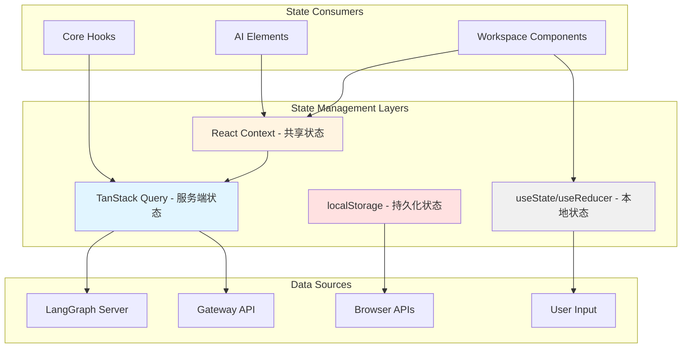

# 【文档编号+模块名】12 - 状态管理方案

## 1. 模块全局定位

- **所属项目**: deer-flow
- **层级位置**: 用户交互层 / frontend/src/（横跨多个目录）
- **核心作用**: 管理应用的所有状态，包括服务端状态、客户端状态、本地存储状态和共享上下文状态
- **业务价值**: 在 AI 工作流系统中承担"状态管理中心"的角色，确保数据在不同组件间正确流动和同步
- **设计初衷**: 该模块是为了解决"如何组织和管理前端复杂状态"这一需求而设计的。为什么需要专门的状态管理方案？因为：
  - **状态来源多样**: 服务端 API、浏览器 API、用户输入、WebSocket 流
  - **状态生命周期不同**: 有些需要持久化，有些只在会话期间存在
  - **状态更新频率不同**: 毫秒级（流式响应）、秒级（用户输入）、分钟级（配置变更）
  - **状态依赖关系复杂**: 一个状态的变化可能触发多个其他状态的更新

---

## 2. 依赖&调用链路 Mermaid 图



### 图表设计解读

**说明**: 该图展示了 DeerFlow 前端的状态管理架构，包含四层状态管理方案。

**为什么采用这样的分层架构？**
1. **TanStack Query（服务端状态）**: 专门管理从 API 获取的数据
   - 为什么用 TanStack Query？因为它提供了缓存、重试、轮询等功能，比手动管理更可靠

2. **React Context（共享状态）**: 管理跨组件的共享状态
   - 为什么用 Context？因为线程状态、任务状态需要在多个组件间共享，Context 提供了统一的访问接口

3. **useState/useReducer（本地状态）**: 管理组件内部的临时状态
   - 为什么用本地状态？因为这些状态只属于单个组件（如输入框值、对话框开关），不需要共享

4. **localStorage（持久化状态）**: 管理需要跨会话保持的用户设置
   - 为什么用 localStorage？因为用户设置需要在多次访问间保持，localStorage 简单可靠

**状态流向的设计考量**：
服务端数据 → TanStack Query 缓存 → 组件消费。这样的单向数据流保证了：
- 数据来源唯一
- 状态变化可预测
- 便于调试和追踪

---

## 3. 核心状态管理策略

### 3.1 状态分类

| 状态类型 | 管理方案 | 示例数据 | 更新频率 |
|---------|---------|---------|---------|
| 服务端状态 | TanStack Query | 线程列表、模型列表、技能列表 | 按需 |
| 流式状态 | LangGraph SDK Hook | 当前线程消息、流式事件 | 毫秒级 |
| 共享状态 | React Context | Thread 对象、Subtask 映射 | 实时 |
| 本地状态 | useState/useReducer | 输入框值、对话框开关 | 用户交互 |
| 持久化状态 | localStorage | 用户设置、语言偏好 | 用户操作 |

### 3.2 状态管理工具链

```
┌─────────────────────────────────────────────────────────┐
│  TanStack Query (服务端状态)                            │
│  ├── useQuery: 数据获取                                  │
│  ├── useMutation: 数据修改                               │
│  ├── useQueryClient: 缓存管理                            │
│  └── QueryClientProvider: 全局 Provider                  │
└─────────────────────────────────────────────────────────┘
┌─────────────────────────────────────────────────────────┐
│  React Context (共享状态)                                │
│  ├── ThreadContext: 线程状态                             │
│  ├── SubtaskContext: 子任务状态                          │
│  ├── I18nContext: 国际化状态                             │
│  └── 自定义 Context Hooks                                │
└─────────────────────────────────────────────────────────┘
┌─────────────────────────────────────────────────────────┐
│  Local Storage (持久化状态)                              │
│  ├── 用户设置 (layout, context, notification)            │
│  ├── 语言偏好 (locale)                                   │
│  └── 深度合并 + 默认值策略                               │
└─────────────────────────────────────────────────────────┘
```

---

## 4. 关键源码深度解析

### 4.1 TanStack Query - 服务端状态管理

**功能概述**: 使用 TanStack Query 管理从后端 API 获取的数据，提供缓存、重试、失效等功能。

**核心 Hooks 封装模式**：

```typescript
// 数据获取 Hook
export function useModels({ enabled = true }: { enabled?: boolean } = {}) {
  const { data, isLoading, error } = useQuery({
    queryKey: ["models"],
    queryFn: () => loadModels(),
    enabled,
    refetchOnWindowFocus: false,
  });
  return { models: data ?? [], isLoading, error };
}

// 数据修改 Hook
export function useEnableSkill() {
  const queryClient = useQueryClient();
  return useMutation({
    mutationFn: async ({ skillName, enabled }) => {
      await enableSkill(skillName, enabled);
    },
    onSuccess: () => {
      void queryClient.invalidateQueries({ queryKey: ["skills"] });
    },
  });
}
```

### 逐行解读（含设计考量）

**第 1-12 行**: `useModels` Hook
- **第 5 行**: `queryKey: ["models"]`
  - **为什么用数组？** 因为数组形式的 queryKey 支持层级查询和部分失效，便于管理相关查询。
- **第 6 行**: `queryFn: () => loadModels()`
  - **为什么用箭头函数？** 因为需要延迟执行，只在查询时调用。
- **第 7 行**: `enabled` 参数
  - **作用**: 支持条件查询，只在需要时加载数据。
  - **使用场景**: 用户权限检查、懒加载等。
- **第 8 行**: `refetchOnWindowFocus: false`
  - **为什么禁用？** 因为模型列表不会频繁变化，窗口聚焦时重新获取是不必要的请求。
  - **设计考量**: 这是性能优化的典型案例——减少不必要的网络请求。

**第 14-31 行**: `useEnableSkill` Hook
- **第 15 行**: `const queryClient = useQueryClient()`
  - **作用**: 获取 QueryClient 实例，用于操作缓存。
- **第 16 行**: `useMutation`
  - **为什么用 mutation 而非 query？** 因为这是修改操作（启用/禁用技能），需要触发副作用。
- **第 22-23 行**: `onSuccess` 回调
  - **第 23 行**: `queryClient.invalidateQueries({ queryKey: ["skills"] })`
    - **作用**: 失效技能列表缓存，触发重新获取。
    - **为什么需要？** 因为修改后需要显示最新状态，失效缓存比手动更新更可靠。

**设计考量**：
1. **为什么 TanStack Query？** 因为它提供了完整的服务端状态管理解决方案，比手动管理更可靠。
2. **为什么封装 Hook？** 因为统一封装可以简化使用，避免重复的配置代码。
3. **为什么用 invalidateQueries？** 因为手动更新缓存容易出错，失效查询让 TanStack Query 重新获取数据更安全。

### 4.2 React Context - 共享状态管理

**文件路径**: `/data/deer-flow-main/frontend/src/core/tasks/context.tsx`

**功能概述**: 使用 React Context 管理子任务状态，支持跨组件访问和更新。

```typescript
import { createContext, useCallback, useContext, useState } from "react";

import type { Subtask } from "./types";

export interface SubtaskContextValue {
  tasks: Record<string, Subtask>;
  setTasks: (tasks: Record<string, Subtask>) => void;
}

export const SubtaskContext = createContext<SubtaskContextValue>({
  tasks: {},
  setTasks: () => {
    /* noop */
  },
});

export function SubtasksProvider({ children }: { children: React.ReactNode }) {
  const [tasks, setTasks] = useState<Record<string, Subtask>>({});
  return (
    <SubtaskContext.Provider value={{ tasks, setTasks }}>
      {children}
    </SubtaskContext.Provider>
  );
}

export function useSubtaskContext() {
  const context = useContext(SubtaskContext);
  if (context === undefined) {
    throw new Error(
      "useSubtaskContext must be used within a SubtaskContext.Provider",
    );
  }
  return context;
}

export function useSubtask(id: string) {
  const { tasks } = useSubtaskContext();
  return tasks[id];
}

export function useUpdateSubtask() {
  const { tasks, setTasks } = useSubtaskContext();
  const updateSubtask = useCallback(
    (task: Partial<Subtask> & { id: string }) => {
      tasks[task.id] = { ...tasks[task.id], ...task } as Subtask;
      if (task.latestMessage) {
        setTasks({ ...tasks });
      }
    },
    [tasks, setTasks],
  );
  return updateSubtask;
}
```

### 逐行解读（含设计考量）

**第 5-8 行**: `SubtaskContextValue` 接口
- **设计目的**: 定义 Context 的值类型。
- **第 6 行**: `tasks: Record<string, Subtask>`
  - **为什么用 Record？** 因为需要用任务 ID 快速查找任务，对象比数组更高效。

**第 10-15 行**: `SubtaskContext` 创建
- **第 12-14 行**: 默认值提供空操作函数
  - **为什么需要默认值？** 因为 Context 在没有 Provider 时需要默认值，空操作函数避免调用时报错。

**第 17-24 行**: `SubtasksProvider` 组件
- **第 19 行**: `useState<Record<string, Subtask>>({})`
  - **为什么用空对象作为初始值？** 因为初始时没有任务，动态添加。
- **第 21-23 行**: Provider 包裹子组件
  - **作用**: 让所有后代组件可以访问任务状态。

**第 26-34 行**: `useSubtaskContext` Hook
- **第 27 行**: `useContext(SubtaskContext)`
  - **作用**: 获取 Context 值。
- **第 28-32 行**: 错误检查
  - **为什么抛出错误？** 因为在 Provider 外使用是常见的错误，明确的错误信息帮助开发者快速定位问题。
  - **设计考量**: 这是防御性编程的典型案例——提前发现常见错误。

**第 36-39 行**: `useSubtask` Hook
- **设计目的**: 根据任务 ID 获取任务。
- **第 38 行**: `return tasks[id]`
  - **为什么直接返回？** 因为任务可能不存在，返回 undefined 是合理的（表示任务未找到）。

**第 41-53 行**: `useUpdateSubtask` Hook
- **第 45 行**: `useCallback` 缓存函数
  - **作用**: 避免每次渲染创建新函数，减少子组件重渲染。
- **第 47-48 行**: 合并更新
  - **为什么用展开运算？** 因为只更新部分字段，保留其他字段不变。
- **第 49-51 行**: 条件触发状态更新
  - **第 49 行**: `if (task.latestMessage)`
    - **为什么有这个条件？** 因为最新消息变化才需要触发 UI 更新，其他字段变化不需要。
    - **设计考量**: 这是性能优化的典型案例——避免不必要的重渲染。

**设计考量**：
1. **为什么用 Context？** 因为子任务状态需要在多个组件间共享，Context 提供了统一的状态管理。
2. **为什么用 Record 而非数组？** 因为用 ID 查找更高效，时间复杂度 O(1) vs O(n)。
3. **为什么封装多个 Hook？** 因为不同场景需要不同的访问模式（获取单个、获取全部、更新），封装后使用更方便。

### 4.3 Thread Context - 流式状态管理

**文件路径**: `/data/deer-flow-main/frontend/src/components/workspace/messages/context.ts`

**功能概述**: 管理当前线程的流式状态，让所有子组件可以访问线程对象。

```typescript
import type { BaseStream } from "@langchain/langgraph-sdk/react";
import { createContext, useContext } from "react";

import type { AgentThreadState } from "@/core/threads";

export interface ThreadContextType {
  thread: BaseStream<AgentThreadState>;
  isMock?: boolean;
}

export const ThreadContext = createContext<ThreadContextType | undefined>(
  undefined,
);

export function useThread() {
  const context = useContext(ThreadContext);
  if (context === undefined) {
    throw new Error("useThread must be used within a ThreadContext");
  }
  return context;
}
```

### 逐行解读（含设计考量）

**第 1 行**: `import type { BaseStream }`
- **什么是 BaseStream？** LangGraph SDK 提供的流式对象，包含线程状态和流式控制方法。

**第 7-11 行**: `ThreadContextType` 接口
- **第 8 行**: `thread: BaseStream<AgentThreadState>`
  - **作用**: 当前的线程对象，包含消息、状态、方法等。
- **第 9 行**: `isMock?: boolean`
  - **作用**: 标识是否为 Mock 模式（无后端）。
  - **为什么可选？** 因为不是所有场景都需要 Mock 模式。

**第 13-16 行**: `ThreadContext` 创建
- **第 13 行**: `createContext<ThreadContextType | undefined>(undefined)`
  - **为什么用 `| undefined`？** 因为默认值是 undefined，表示未在 Provider 中使用。

**第 18-25 行**: `useThread` Hook
- **第 19 行**: `useContext(ThreadContext)`
  - **作用**: 获取 Context 值。
- **第 20-24 行**: 错误检查
  - **设计目的**: 确保在正确的上下文中使用，提供清晰的错误信息。

**设计考量**：
1. **为什么需要 Thread Context？** 因为线程状态需要在多个组件间共享（消息列表、输入框、工件面板等），Context 提供了统一的访问方式。
2. **为什么不用全局状态？** 因为可能同时存在多个线程（多标签页），每个线程有独立的状态。

### 4.4 本地状态管理 - 设置同步

**文件路径**: `/data/deer-flow-main/frontend/src/core/settings/hooks.ts`

**功能概述**: 管理用户本地设置，同步 useState 和 localStorage。

```typescript
import { useCallback, useLayoutEffect, useState } from "react";

import {
  DEFAULT_LOCAL_SETTINGS,
  getLocalSettings,
  saveLocalSettings,
  type LocalSettings,
} from "./local";

export function useLocalSettings(): [
  LocalSettings,
  (
    key: keyof LocalSettings,
    value: Partial<LocalSettings[keyof LocalSettings]>,
  ) => void,
] {
  const [mounted, setMounted] = useState(false);
  const [state, setState] = useState<LocalSettings>(DEFAULT_LOCAL_SETTINGS);
  useLayoutEffect(() => {
    if (!mounted) {
      setState(getLocalSettings());
    }
    setMounted(true);
  }, [mounted]);
  const setter = useCallback(
    (
      key: keyof LocalSettings,
      value: Partial<LocalSettings[keyof LocalSettings]>,
    ) => {
      if (!mounted) return;
      setState((prev) => {
        const newState = {
          ...prev,
          [key]: {
            ...prev[key],
            ...value,
          },
        };
        saveLocalSettings(newState);
        return newState;
      });
    },
    [mounted],
  );
  return [state, setter];
}
```

### 逐行解读（含设计考量）

**第 10-16 行**: Hook 返回类型定义
- **设计目的**: 定义返回值为元组 [状态, 设置函数]，类似 useState 的 API。
- **为什么用元组？** 因为这样可以解构使用，更符合 React 习惯。

**第 17-18 行**: `mounted` 状态
- **作用**: 跟踪组件是否已挂载到 DOM。
- **为什么需要？** 因为在挂载前不应该保存到 localStorage（服务端渲染时）。

**第 19 行**: `state` 状态
- **初始值**: `DEFAULT_LOCAL_SETTINGS`
  - **为什么用默认值？** 因为首次渲染时还没有从 localStorage 读取，使用默认值避免显示空白。

**第 20-24 行**: `useLayoutEffect` 同步加载
- **第 21 行**: `if (!mounted)`
  - **作用**: 只在首次挂载时执行。
- **第 22 行**: `setState(getLocalSettings())`
  - **作用**: 从 localStorage 加载保存的设置。
- **第 23 行**: `setMounted(true)`
  - **作用**: 标记已挂载，后续可以保存到 localStorage。
- **为什么用 useLayoutEffect？** 因为需要同步更新状态，避免闪烁。

**第 25-44 行**: `setter` 回调函数
- **第 26 行**: `useCallback` 缓存
  - **作用**: 避免每次渲染创建新函数。
- **第 30 行**: `if (!mounted) return`
  - **作用**: 未挂载时不执行，避免在服务端渲染时访问 localStorage。
- **第 31-41 行**: 更新状态并保存
  - **第 34-38 行**: 深度合并
    - **为什么需要深度合并？** 因为只更新指定的字段，其他字段保持不变。
  - **第 39 行**: `saveLocalSettings(newState)`
    - **作用**: 同步到 localStorage。

**设计考量**：
1. **为什么需要 mounted 标志？** 因为需要区分首次加载和后续更新，避免在服务端渲染时访问 localStorage。
2. **为什么用 useLayoutEffect？** 因为需要同步更新状态，避免用户看到默认值然后突然变化（闪烁）。
3. **为什么用深度合并？** 因为设置是嵌套对象，浅合并会丢失未更新的字段。

---

## 5. 底层设计思想（重点强化，详细拆解）

### 5.1 模块整体设计理念

**采用的设计模式/架构思想**：
1. **状态分类管理（State Classification）**: 根据状态来源和生命周期选择不同的管理方案
2. **单一数据源（Single Source of Truth）**: 每种状态有唯一的存储位置
3. **不可变更新（Immutable Updates）**: 使用展开运算符创建新对象，而非直接修改
4. **乐观更新（Optimistic Updates）**: 先更新 UI，再同步到服务器

**为什么选用这种思想？**
- **状态分类**: 不同类型的状态有不同的需求，分类管理可以选择最适合的工具
- **单一数据源**: 避免状态不一致，便于调试和维护
- **不可变更新**: React 的依赖比较基于对象引用，不可变更新确保组件正确重渲染
- **乐观更新**: 提升用户体验，减少等待时间

### 5.2 核心痛点解决

**针对 AI 工作流/编排中的哪些核心痛点设计？**

1. **流式状态同步**
   - **问题**: AI 回复是逐字生成的，如何实时更新状态？
   - **解决方案**: 使用 LangGraph SDK 的 `useStream` Hook，自动处理流式事件并更新状态

2. **跨组件状态共享**
   - **问题**: 线程状态需要在多个组件间共享（消息列表、输入框、工件面板）
   - **解决方案**: 使用 React Context 提供统一的状态访问接口

3. **缓存失效管理**
   - **问题**: 数据更新后如何让所有相关组件显示最新数据？
   - **解决方案**: 使用 TanStack Query 的 `invalidateQueries` 失效相关缓存，触发重新获取

4. **状态持久化**
   - **问题**: 用户设置如何在多次访问间保持？
   - **解决方案**: 使用 localStorage 持久化，并在组件挂载时同步到状态

### 5.3 行业对比优势

**相比普通开源 AI 编排项目的前端，有哪些差异化优势？**

1. **完善的服务端状态管理**: 使用 TanStack Query 而非手动管理，减少 bug 和代码量
2. **类型安全的状态定义**: 所有状态都有完整的 TypeScript 类型，编译时捕获错误
3. **智能的缓存策略**: 根据数据特点设置不同的缓存时间，平衡性能和数据新鲜度
4. **乐观更新支持**: 用户操作立即反馈，提升体验

### 5.4 扩展性设计

**模块中的扩展点、预留钩子是如何设计的？**

1. **自定义 Query Hook**: 所有服务端状态都封装为自定义 Hook，便于统一配置
2. **Context Provider 嵌套**: 支持多层 Context 嵌套，适应复杂的共享需求
3. **状态合并策略**: 设置更新使用深度合并，支持部分更新

**为什么要预留这些扩展点？**
- 自定义 Hook: 统一配置缓存、重试、错误处理
- Context 嵌套: 支持多层级的共享状态
- 状态合并: 灵活更新部分字段，不影响其他字段

### 5.5 设计取舍

**模块设计过程中，有哪些取舍？**

1. **TanStack Query vs 手动管理**
   - **取舍**: 选择 TanStack Query
   - **为什么**: 虽然增加了依赖，但提供了缓存、重试等功能，比手动管理更可靠

2. **Context vs Redux/Zustand**
   - **取舍**: 选择 Context
   - **为什么**: 虽然性能不如 Redux，但共享状态较少，Context 足够且更简单

3. **localStorage vs IndexedDB**
   - **取舍**: 选择 localStorage
   - **为什么**: 虽然存储容量有限，但用户设置数据量小，localStorage 更简单

---

## 6. 必学核心知识点（可直接复用）

### 技术点 1：TanStack Query 缓存配置

**对应源码中的设计细节**: 所有 core/*/hooks.ts 中的 useQuery 配置

**说明该技术点的设计逻辑和复用场景**：
- **设计逻辑**: 通过 staleTime、gcTime、refetchOnWindowFocus 等参数控制缓存行为
- **复用场景**: 任何需要管理服务端状态的项目

**配置模板**：
```typescript
const { data } = useQuery({
  queryKey: ["resource", id],
  queryFn: () => fetchResource(id),
  // 缓存配置
  staleTime: 5 * 60 * 1000,      // 5 分钟内认为数据新鲜
  gcTime: 10 * 60 * 1000,        // 10 分钟后垃圾回收
  refetchOnWindowFocus: false,   // 窗口聚焦时不重新获取
  refetchOnMount: false,         // 挂载时不重新获取（如果有缓存）
  retry: 3,                      // 失败重试 3 次
  retryDelay: (attemptIndex) => Math.min(1000 * 2 ** attemptIndex, 30000),
});
```

### 技术点 2：Context 状态管理模式

**对应源码中的设计细节**: tasks/context.tsx, messages/context.ts

**说明该技术点的设计逻辑和复用场景**：
- **设计逻辑**: 创建 Context → 定义 Provider → 提供 use Hook → 添加错误检查
- **复用场景**: 任何需要在组件间共享状态的场景

**实现模板**：
```typescript
import { createContext, useContext } from "react";

// 1. 定义 Context 值类型
interface ContextValue {
  state: StateType;
  setState: (state: StateType) => void;
}

// 2. 创建 Context（默认值为 undefined）
const MyContext = createContext<ContextValue | undefined>(undefined);

// 3. 创建 Provider
export function MyProvider({ children }: { children: React.ReactNode }) {
  const [state, setState] = useState(initialState);
  return (
    <MyContext.Provider value={{ state, setState }}>
      {children}
    </MyContext.Provider>
  );
}

// 4. 创建 use Hook（带错误检查）
export function useMyContext() {
  const context = useContext(MyContext);
  if (context === undefined) {
    throw new Error("useMyContext must be used within MyProvider");
  }
  return context;
}
```

### 技术点 3：localStorage 同步模式

**对应源码中的设计细节**: settings/hooks.ts

**说明该技术点的设计逻辑和复用场景**：
- **设计逻辑**: 用 useLayoutEffect 同步加载，用 useCallback 包装保存函数
- **复用场景**: 任何需要持久化用户设置的场景

**实现模板**：
```typescript
export function usePersistentState<T>(key: string, defaultValue: T) {
  const [mounted, setMounted] = useState(false);
  const [state, setState] = useState<T>(defaultValue);

  // 挂载时加载
  useLayoutEffect(() => {
    if (!mounted) {
      const saved = localStorage.getItem(key);
      if (saved) {
        try {
          setState(JSON.parse(saved));
        } catch {}
      }
      setMounted(true);
    }
  }, [key, mounted]);

  // 状态变化时保存
  const setSavedState = useCallback((value: T) => {
    if (!mounted) return;
    setState(value);
    localStorage.setItem(key, JSON.stringify(value));
  }, [key, mounted]);

  return [state, setSavedState] as const;
}
```

### 技术点 4：Mutation 失效缓存模式

**对应源码中的设计细节**: skills/hooks.ts 中的 useEnableSkill

**说明该技术点的设计逻辑和复用场景**：
- **设计逻辑**: mutation 成功后失效相关查询，触发重新获取
- **复用场景**: 任何需要修改数据后刷新列表的场景

**实现模板**：
```typescript
export function useUpdateItem() {
  const queryClient = useQueryClient();
  return useMutation({
    mutationFn: async (item) => {
      return await updateItem(item);
    },
    onSuccess: (data, variables) => {
      // 方法 1: 失效相关查询
      queryClient.invalidateQueries({ queryKey: ["items"] });

      // 方法 2: 直接更新缓存（如果知道返回值）
      queryClient.setQueryData(["items", variables.id], data);
    },
  });
}
```

---

## 7. 可直接拷贝复用代码片段

### 片段 1：Query Hook 封装模板

**这些代码片段的设计优势**：
- 统一的配置
- 类型安全
- 易于扩展

```typescript
import { useQuery } from "@tanstack/react-query";
import { loadResource } from "./api";

export function useResource(id: string, enabled = true) {
  return useQuery({
    queryKey: ["resource", id],
    queryFn: () => loadResource(id),
    enabled: enabled && !!id,
    staleTime: 5 * 60 * 1000,
    refetchOnWindowFocus: false,
  });
}
```

### 片段 2：Mutation Hook 封装模板

**设计优势**：
- 自动失效相关查询
- 支持乐观更新
- 错误处理

```typescript
import { useMutation, useQueryClient } from "@tanstack/react-query";
import { createResource, updateResource } from "./api";

export function useCreateResource() {
  const queryClient = useQueryClient();
  return useMutation({
    mutationFn: createResource,
    onSuccess: (newItem) => {
      // 添加到列表缓存
      queryClient.setQueryData(["resources"], (old = []) => [...old, newItem]);
    },
  });
}

export function useUpdateResource() {
  const queryClient = useQueryClient();
  return useMutation({
    mutationFn: updateResource,
    onMutate: async (updated) => {
      // 取消正在进行的查询
      await queryClient.cancelQueries({ queryKey: ["resource", updated.id] });

      // 保存当前值用于回滚
      const previous = queryClient.getQueryData(["resource", updated.id]);

      // 乐观更新
      queryClient.setQueryData(["resource", updated.id], updated);

      return { previous };
    },
    onError: (err, updated, context) => {
      // 回滚到之前的状态
      queryClient.setQueryData(["resource", updated.id], context.previous);
    },
    onSettled: () => {
      // 无论成功失败都重新获取
      queryClient.invalidateQueries({ queryKey: ["resource", updated.id] });
    },
  });
}
```

### 片段 3：Context Provider 嵌套模板

**设计优势**：
- 支持多层嵌套
- 类型安全
- 清晰的错误信息

```typescript
import { createContext, useContext } from "react";

interface ParentContextValue {
  value: string;
}
interface ChildContextValue {
  value: number;
}

const ParentContext = createContext<ParentContextValue | undefined>(undefined);
const ChildContext = createContext<ChildContextValue | undefined>(undefined);

export function AppProviders({ children }: { children: React.ReactNode }) {
  return (
    <ParentProvider value="parent">
      <ChildProvider value={123}>
        {children}
      </ChildProvider>
    </ParentProvider>
  );
}

function ParentProvider({ children, value }) {
  return (
    <ParentContext.Provider value={{ value }}>
      {children}
    </ParentContext.Provider>
  );
}

function ChildProvider({ children, value }) {
  return (
    <ChildContext.Provider value={{ value }}>
      {children}
    </ChildContext.Provider>
  );
}

export function useParentContext() {
  const context = useContext(ParentContext);
  if (!context) throw new Error("useParentContext must be used within ParentProvider");
  return context;
}

export function useChildContext() {
  const context = useContext(ChildContext);
  if (!context) throw new Error("useChildContext must be used within ChildProvider");
  return context;
}
```

---

## 8. 踩坑提醒 & 二次开发建议

### 踩坑提醒

1. **TanStack Query 的无限循环**
   - **问题**: 组件无限重渲染，无限发送请求
   - **为什么会有这些问题**: queryKey 或 queryFn 依赖了不稳定的对象或函数
   - **解决**: 确保 queryKey 只包含稳定的值，queryFn 用函数包装

2. **Context 的性能问题**
   - **问题**: Context 值变化导致所有消费者重渲染
   - **为什么会有这些问题**: Context 值是对象，每次渲染都创建新对象
   - **解决**: 使用 useMemo 缓存 Context 值，或拆分多个 Context

3. **localStorage 的同步问题**
   - **问题**: 多个标签页的设置不同步
   - **为什么会有这些问题**: localStorage 只在同源页面间共享，不会自动触发更新
   - **解决**: 监听 `storage` 事件，在其他页面更新时同步

4. **乐观更新的回滚失败**
   - **问题**: 请求失败后状态没有正确回滚
   - **为什么会有这些问题**: onError 中使用的 context 值不正确
   - **解决**: 确保 onMutate 返回的 context 在 onError 中正确使用

### 二次开发建议

**适配自定义改造、私有化部署、接入自有大模型/自有前端的优化方向**：

1. **替换为 Zustand**
   - **优化建议的设计依据**: Context 性能不足时，可以考虑 Zustand
   - **如何在不破坏原有设计逻辑的前提下进行改造**:
     - 创建 Zustand store 替代 Context
     - 保持相同的 Hook API（useThread、useSubtask 等）
     - 逐步迁移，避免大改

2. **添加全局状态管理**
   - **优化建议的设计依据**: 需要全局的用户状态、认证状态
   - **如何在不破坏原有设计逻辑的前提下进行改造**:
     - 添加 AuthContext、UserContext 等
     - 在根布局中嵌套 Provider
     - 提供对应的 use Hook

3. **优化缓存策略**
   - **优化建议的设计依据**: 某些数据需要实时更新，某些可以长期缓存
   - **如何在不破坏原有设计逻辑的前提下进行改造**:
     - 根据数据类型设置不同的 staleTime
     - 对实时性要求高的数据启用轮询（refetchInterval）
     - 对变化频率低的数据增加缓存时间

4. **支持 IndexedDB**
   - **优化建议的设计依据**: localStorage 容量不够
   - **如何在不破坏原有设计逻辑的前提下进行改造**:
     - 创建 IndexedDB 包装库
     - 保持相同的 API（get/set）
     - 逐步替换 localStorage 调用

---

## 9. 文档衔接

**本篇完结**，下一篇将解析：**【13 - API 客户端设计】**

**衔接说明**：
下一篇模块与当前模块的设计关联是：本篇讲解了状态如何管理，下一篇将深入 API 客户端，讲解前端如何与后端通信，以及如何封装 LangGraph SDK。

**为什么按这个顺序解析？**
1. 先理解状态管理（本篇），知道状态如何组织和流动
2. 再理解 API 客户端（下一篇），了解状态如何从后端获取
3. 之后是其他具体实现

这符合"由状态到源头，由使用到获取"的递进逻辑。
