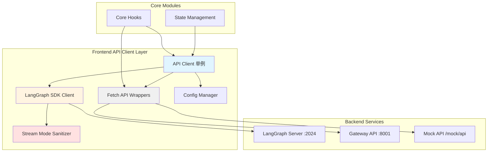

# 【文档编号+模块名】13 - API 客户端设计

## 1. 模块全局定位

- **所属项目**: deer-flow
- **层级位置**: 用户交互层 / frontend/src/core/api/
- **核心作用**: 封装前端与后端的所有通信逻辑，提供统一的 API 调用接口
- **业务价值**: 在 AI 工作流系统中承担"通信中枢"的角色，确保前后端数据交互的正确性和可靠性
- **设计初衷**: 该模块是为了解决"如何组织和管理前端 API 调用"这一需求而设计的。为什么需要专门的 API 客户端层？因为：
  - **统一接口**: 所有 API 调用通过统一的入口，便于管理和维护
  - **错误处理**: 集中处理 HTTP 错误、超时、重试等逻辑
  - **类型安全**: 定义完整的请求和响应类型，编译时检查数据格式
  - **配置管理**: 统一管理 API 地址、超时时间等配置

---

## 2. 依赖&调用链路 Mermaid 图



### 图表设计解读

**说明**: 该图展示了 DeerFlow 前端 API 客户端的架构和通信路径。

**为什么采用这样的架构设计？**
1. **单例模式**: API 客户端使用单例模式，确保整个应用共享同一个实例，避免重复连接
2. **双路径通信**: LangGraph SDK 用于流式通信，Fetch API 用于普通 REST API
3. **Mock 模式支持**: 通过配置切换到 Mock API，支持前端独立开发
4. **流模式清理**: 清理不支持的流模式，避免后端返回错误

**通信路径的设计考量**：
- **流式响应**: Core Hooks → LangGraph SDK Client → LangGraph Server
- **REST API**: Core Hooks → Fetch API Wrappers → Gateway API
- **Mock 开发**: Core Hooks → Mock API → 假数据

---

## 3. 核心目录/文件清单

```
frontend/src/core/api/
├── index.ts                      # 统一导出
├── api-client.ts                 # LangGraph 客户端单例
├── stream-mode.ts                # 流模式清理工具
└── stream-mode.test.ts          # 流模式测试

# 其他模块中的 API 封装
models/
├── api.ts                        # 模型列表 API

skills/
├── api.ts                        # 技能管理 API

uploads/
├── api.ts                        # 文件上传 API

memory/
├── api.ts                        # 记忆系统 API

config/
├── index.ts                      # 配置管理（URL 获取）
```

**每个文件的设计定位是什么？**

- **api-client.ts**: 为什么是核心？因为它是 LangGraph SDK 的唯一入口，管理着与服务器的连接。
- **stream-mode.ts**: 为什么需要？因为 LangGraph SDK 支持多种流模式，但前端只支持部分，需要过滤。
- **config/index.ts**: 为什么独立？因为 API 地址配置需要在多处使用，统一管理避免重复。
- **各模块的 api.ts**: 为什么分散在各个模块？因为每个模块的 API 相关性强，放在一起便于维护。

---

## 4. 关键源码深度解析

### 4.1 LangGraph 客户端单例 - 连接管理

**文件路径**: `/data/deer-flow-main/frontend/src/core/api/api-client.ts`

**功能概述**: 创建和管理 LangGraph SDK 客户端的单例，支持普通模式和 Mock 模式。

```typescript
"use client";

import { Client as LangGraphClient } from "@langchain/langgraph-sdk/client";

import { getLangGraphBaseURL } from "../config";

import { sanitizeRunStreamOptions } from "./stream-mode";

function createCompatibleClient(isMock?: boolean): LangGraphClient {
  const client = new LangGraphClient({
    apiUrl: getLangGraphBaseURL(isMock),
  });

  const originalRunStream = client.runs.stream.bind(client.runs);
  client.runs.stream = ((threadId, assistantId, payload) =>
    originalRunStream(
      threadId,
      assistantId,
      sanitizeRunStreamOptions(payload),
    )) as typeof client.runs.stream;

  const originalJoinStream = client.runs.joinStream.bind(client.runs);
  client.runs.joinStream = ((threadId, runId, options) =>
    originalJoinStream(
      threadId,
      runId,
      sanitizeRunStreamOptions(options),
    )) as typeof client.runs.joinStream;

  return client;
}

const _clients = new Map<string, LangGraphClient>();
export function getAPIClient(isMock?: boolean): LangGraphClient {
  const cacheKey = isMock ? "mock" : "default";
  let client = _clients.get(cacheKey);

  if (!client) {
    client = createCompatibleClient(isMock);
    _clients.set(cacheKey, client);
  }

  return client;
}
```

### 逐行解读（含设计考量）

**第 1 行**: `"use client";`
- **为什么必须标注？** 因为使用了浏览器 API（Map），且需要在客户端执行。

**第 4-6 行**: 导入依赖
- **第 4 行**: LangGraph 客户端类
- **第 5 行**: URL 配置函数
- **第 6 行**: 流模式清理函数

**第 8-30 行**: `createCompatibleClient` 函数
- **设计目的**: 创建一个"兼容的"客户端，包装原始方法以添加额外逻辑。
- **第 10-12 行**: 创建客户端实例
  - **第 11 行**: `apiUrl: getLangGraphBaseURL(isMock)`
    - **为什么传入 isMock？** 因为 Mock 模式和真实模式使用不同的 URL。

- **第 14-20 行**: 包装 `runs.stream` 方法
  - **第 14 行**: `const originalRunStream = client.runs.stream.bind(client.runs)`
    - **作用**: 保存原始方法的引用。
    - **为什么用 bind？** 因为直接赋值会丢失 `this` 上下文，导致调用失败。
  - **第 15-19 行**: 重新赋值
    - **第 17 行**: 调用原始方法
    - **第 18 行**: 传入清理后的选项
      - **作用**: 过滤不支持的流模式，避免后端返回错误。

- **第 21-28 行**: 包装 `runs.joinStream` 方法
  - **为什么也要包装？** 因为 joinStream 是用于重新连接到正在进行的流式会话，也需要清理流模式。

**第 32 行**: `const _clients = new Map<string, LangGraphClient>();`
- **为什么用 Map？** 因为需要缓存多个客户端（mock 和 default），Map 提供了清晰的 API。

**第 33-44 行**: `getAPIClient` 函数
- **第 35 行**: `const cacheKey = isMock ? "mock" : "default";`
  - **作用**: 生成缓存键。
  - **为什么区分两种模式？** 因为 Mock 和真实客户端的 URL 不同，不能共享。
- **第 36-38 行**: 检查缓存
  - **第 37 行**: `let client = _clients.get(cacheKey);`
    - **作用**: 从缓存获取客户端。
- **第 39-42 行**: 创建并缓存
  - **第 40 行**: 创建新客户端
  - **第 41 行**: 存入缓存
  - **设计考量**: 这是单例模式的经典实现——懒加载 + 缓存。

**设计考量**：
1. **为什么用单例？** 因为每个客户端会建立 WebSocket 连接，多实例会浪费资源。
2. **为什么包装方法？** 因为需要在调用前清理流模式，避免向后端发送不支持的选项。
3. **为什么用 Map 缓存？** 因为需要支持多种模式（mock/default），Map 比 if-else 更清晰。

### 4.2 流模式清理 - 兼容性处理

**文件路径**: `/data/deer-flow-main/frontend/src/core/api/stream-mode.ts`

**功能概述**: 清理 LangGraph 流模式选项，只保留前端支持的模式。

```typescript
const SUPPORTED_RUN_STREAM_MODES = new Set([
  "values",
  "messages",
  "messages-tuple",
  "updates",
  "events",
  "debug",
  "tasks",
  "checkpoints",
  "custom",
] as const);

const warnedUnsupportedStreamModes = new Set<string>();

export function warnUnsupportedStreamModes(
  modes: string[],
  warn: (message: string) => void = console.warn,
) {
  const unseenModes = modes.filter((mode) => {
    if (warnedUnsupportedStreamModes.has(mode)) {
      return false;
    }
    warnedUnsupportedStreamModes.add(mode);
    return true;
  });

  if (unseenModes.length === 0) {
    return;
  }

  warn(
    `[deer-flow] Dropped unsupported LangGraph stream mode(s): ${unseenModes.join(", ")}`,
  );
}

export function sanitizeRunStreamOptions<T>(options: T): T {
  if (
    typeof options !== "object" ||
    options === null ||
    !("streamMode" in options)
  ) {
    return options;
  }

  const streamMode = options.streamMode;
  if (streamMode == null) {
    return options;
  }

  const requestedModes = Array.isArray(streamMode) ? streamMode : [streamMode];
  const sanitizedModes = requestedModes.filter((mode) =>
    SUPPORTED_RUN_STREAM_MODES.has(mode),
  );

  if (sanitizedModes.length === requestedModes.length) {
    return options;
  }

  const droppedModes = requestedModes.filter(
    (mode) => !SUPPORTED_RUN_STREAM_MODES.has(mode),
  );
  warnUnsupportedStreamModes(droppedModes);

  return {
    ...options,
    streamMode: Array.isArray(streamMode) ? sanitizedModes : sanitizedModes[0],
  };
}
```

### 逐行解读（含设计考量）

**第 1-10 行**: 支持的流模式定义
- **设计目的**: 定义前端支持的所有 LangGraph 流模式。
- **为什么用 Set？** 因为需要频繁检查模式是否支持，Set 的查找时间是 O(1)。
- **为什么用 `as const`？** 因为需要确保字面量类型，TypeScript 可以推断出具体的字符串字面量类型。

**支持的流模式说明**：
- `values`: 状态值更新
- `messages`: 消息更新
- `messages-tuple`: 消息元组更新
- `updates`: 任意更新
- `events`: LangChain 事件
- `debug`: 调试信息
- `tasks`: 任务更新
- `checkpoints`: 检查点事件
- `custom`: 自定义事件

**第 12 行**: 警告记录 Set
- **作用**: 记录已警告过的模式，避免重复警告。
- **为什么需要？** 因为同一个不支持的模式只应该警告一次，避免控制台噪音。

**第 14-34 行**: `warnUnsupportedStreamModes` 函数
- **设计目的**: 警告用户有不支持的流模式。
- **第 19-26 行**: 过滤未警告的模式
  - **第 20 行**: `if (warnedUnsupportedStreamModes.has(mode))`
    - **作用**: 检查是否已警告过。
  - **第 23 行**: `warnedUnsupportedStreamModes.add(mode)`
    - **作用**: 标记为已警告。
- **第 31-33 行**: 输出警告
  - **为什么用自定义格式？** 因为统一的格式便于识别和过滤。

**第 36-68 行**: `sanitizeRunStreamOptions` 函数
- **设计目的**: 清理选项中的不支持的流模式。
- **第 38-43 行**: 守卫子句
  - **作用**: 如果选项不是对象或没有 streamMode，直接返回。
  - **设计考量**: 这是类型守卫和防御性编程的结合。
- **第 45-47 行**: 检查 streamMode 是否为空
  - **作用**: 如果没有指定流模式，不需要处理。
- **第 49 行**: `const requestedModes = Array.isArray(streamMode) ? streamMode : [streamMode];`
  - **作用**: 统一转换为数组形式。
  - **为什么需要转换？** 因为 streamMode 可能是字符串或数组，统一处理简化逻辑。
- **第 50-52 行**: 过滤支持的模式
  - **作用**: 只保留前端支持的模式。
- **第 54-56 行**: 检查是否有模式被过滤
  - **作用**: 如果没有被过滤，直接返回原选项。
- **第 58-62 行**: 处理被过滤的模式
  - **第 59 行**: 找出不支持的模式
  - **第 62 行**: 输出警告
- **第 64-67 行**: 返回清理后的选项
  - **第 66 行**: 保持原始类型（数组或字符串）

**设计考量**：
1. **为什么需要清理流模式？** 因为 LangGraph SDK 和后端可能支持更多模式，前端不需要或不支持某些模式。
2. **为什么只警告一次？** 因为重复警告会污染控制台，干扰开发者。
3. **为什么用 Set 存储支持的模式？** 因为 Set 的查找和插入都是 O(1)，性能优于数组。

### 4.3 配置管理 - URL 获取

**文件路径**: `/data/deer-flow-main/frontend/src/core/config/index.ts`

**功能概述**: 管理后端 API 地址配置，支持环境变量、相对路径、Mock 模式。

```typescript
import { env } from "@/env";

function getBaseOrigin() {
  if (typeof window !== "undefined") {
    return window.location.origin;
  }
  // Fallback for SSR
  return "http://localhost:2026";
}

export function getBackendBaseURL() {
  if (env.NEXT_PUBLIC_BACKEND_BASE_URL) {
    return new URL(env.NEXT_PUBLIC_BACKEND_BASE_URL, getBaseOrigin())
      .toString()
      .replace(/\/+$/, "");
  } else {
    return "";
  }
}

export function getLangGraphBaseURL(isMock?: boolean) {
  if (env.NEXT_PUBLIC_LANGGRAPH_BASE_URL) {
    return new URL(
      env.NEXT_PUBLIC_LANGGRAPH_BASE_URL,
      getBaseOrigin(),
    ).toString();
  } else if (isMock) {
    if (typeof window !== "undefined") {
      return `${window.location.origin}/mock/api`;
    }
    return "http://localhost:3000/mock/api";
  } else {
    // LangGraph SDK requires a full URL, construct it from current origin
    if (typeof window !== "undefined") {
      return `${window.location.origin}/api/langgraph`;
    }
    // Fallback for SSR
    return "http://localhost:2026/api/langgraph";
  }
}
```

### 逐行解读（含设计考量）

**第 3-9 行**: `getBaseOrigin` 函数
- **设计目的**: 获取当前页面的源（origin）。
- **第 4-6 行**: 浏览器环境
  - **第 5 行**: `return window.location.origin;`
    - **作用**: 返回当前页面的协议 + 域名 + 端口。
- **第 7-9 行**: 服务端渲染环境
  - **第 8 行**: `return "http://localhost:2026";`
    - **作用**: 提供默认值，避免服务端渲染时报错。
    - **为什么是 2026？** 因为这是 Nginx 入口的默认端口。

**第 11-19 行**: `getBackendBaseURL` 函数
- **设计目的**: 获取 Gateway API 的地址。
- **第 12-16 行**: 有环境变量时
  - **第 13 行**: `new URL(env.NEXT_PUBLIC_BACKEND_BASE_URL, getBaseOrigin())`
    - **作用**: 解析环境变量为完整 URL。
    - **为什么用 new URL？** 因为环境变量可能是相对路径（如 `/api`），需要拼接 origin。
  - **第 15 行**: `.replace(/\/+$/, "")`
    - **作用**: 移除末尾的斜杠。
    - **为什么需要？** 因为多余的斜杠可能导致 URL 拼接错误。
- **第 17-19 行**: 无环境变量时
  - **第 18 行**: `return "";`
    - **作用**: 返回空字符串，表示使用相对路径。
    - **设计考量**: 空字符串会让 fetch 使用当前 origin，适合同源部署。

**第 21-40 行**: `getLangGraphBaseURL` 函数
- **设计目的**: 获取 LangGraph Server 的地址。
- **第 22-26 行**: 有环境变量时
  - **作用**: 使用环境变量配置的地址。
- **第 27-31 行**: Mock 模式时
  - **第 29 行**: 浏览器环境返回 `/mock/api`
  - **第 30 行**: 服务端环境返回 `http://localhost:3000/mock/api`
    - **作用**: 提供默认值，避免服务端渲染时出错。
- **第 32-39 行**: 默认情况
  - **第 34 行**: 浏览器环境返回 `/api/langgraph`
    - **作用**: 使用相对路径，通过 Nginx 代理到 LangGraph Server。
  - **第 38 行**: 服务端环境返回完整 URL
    - **作用**: 提供完整的 URL，因为服务端没有 origin 概念。

**设计考量**：
1. **为什么需要多层级配置？** 因为不同环境（开发、测试、生产）有不同的配置需求。
2. **为什么支持相对路径？** 因为同源部署时更简单，不需要配置完整 URL。
3. **为什么需要 SSR 兼容？** 因为 Next.js 支持服务端渲染，代码可能在服务端执行。

### 4.4 REST API 封装 - 类型安全调用

**文件路径**: `/data/deer-flow-main/frontend/src/core/skills/api.ts`

**功能概述**: 封装技能相关的 API 调用，提供类型安全的请求和响应。

```typescript
import { getBackendBaseURL } from "@/core/config";

import type { Skill } from "./type";

export async function loadSkills() {
  const skills = await fetch(`${getBackendBaseURL()}/api/skills`);
  const json = await skills.json();
  return json.skills as Skill[];
}

export async function enableSkill(skillName: string, enabled: boolean) {
  const response = await fetch(
    `${getBackendBaseURL()}/api/skills/${skillName}`,
    {
      method: "PUT",
      headers: {
        "Content-Type": "application/json",
      },
      body: JSON.stringify({
        enabled,
      }),
    },
  );
  return response.json();
}

export interface InstallSkillRequest {
  thread_id: string;
  path: string;
}

export interface InstallSkillResponse {
  success: boolean;
  skill_name: string;
  message: string;
}

export async function installSkill(
  request: InstallSkillRequest,
): Promise<InstallSkillResponse> {
  const response = await fetch(`${getBackendBaseURL()}/api/skills/install`, {
    method: "POST",
    headers: {
      "Content-Type": "application/json",
    },
    body: JSON.stringify(request),
  });

  if (!response.ok) {
    // Handle HTTP error responses (4xx, 5xx)
    const errorData = await response.json().catch(() => ({}));
    const errorMessage =
      errorData.detail ?? `HTTP ${response.status}: ${response.statusText}`;
    return {
      success: false,
      skill_name: "",
      message: errorMessage,
    };
  }

  return response.json();
}
```

### 逐行解读（含设计考量）

**第 5-9 行**: `loadSkills` 函数
- **第 6 行**: `const skills = await fetch(...)`
  - **作用**: 发送 HTTP GET 请求。
- **第 7-8 行**: 解析响应
  - **第 8 行**: `return json.skills as Skill[]`
    - **作用**: 提取技能数组并断言类型。
    - **为什么用 as？** 因为 fetch 的类型定义不够精确，需要手动断言。

**第 11-25 行**: `enableSkill` 函数
- **第 13 行**: 构建 URL
  - **为什么用模板字符串？** 因为需要将技能名称拼接到 URL 中。
- **第 15-18 行**: 请求配置
  - **第 16 行**: `method: "PUT"`
    - **作用**: 使用 PUT 方法更新资源。
  - **第 17-19 行**: 设置 Content-Type
    - **作用**: 告诉服务器请求体是 JSON 格式。

**第 27-36 行**: 类型定义
- **设计目的**: 定义请求和响应的类型，确保类型安全。
- **第 28-30 行**: `InstallSkillRequest`
  - **为什么定义接口？** 因为需要在多个地方使用，集中定义便于复用。
- **第 32-36 行**: `InstallSkillResponse`
  - **为什么定义 success 字段？** 因为操作可能失败，需要明确的结果标识。

**第 38-62 行**: `installSkill` 函数
- **第 42 行**: `if (!response.ok)`
  - **作用**: 检查 HTTP 状态码是否表示成功。
  - **设计考量**: 这是错误处理的标准模式。
- **第 43-45 行**: 解析错误响应
  - **第 44 行**: `await response.json().catch(() => ({}))`
    - **作用**: 尝试解析错误体，失败则返回空对象。
    - **为什么用 catch？** 因为错误响应可能不是 JSON 格式。
- **第 46-48 行**: 构造错误消息
  - **第 47 行**: `errorData.detail ?? ...`
    - **作用**: 优先使用后端的错误描述，兜底使用 HTTP 状态。
- **第 49-58 行**: 返回失败响应
  - **设计目的**: 即使 HTTP 请求失败，也返回正常格式的响应，统一处理流程。
- **第 61 行**: `return response.json()`
  - **作用**: 返回成功的响应。

**设计考量**：
1. **为什么用 fetch 而非 axios？** 因为 fetch 是浏览器原生 API，无需额外依赖。
2. **为什么手动处理错误？** 因为 fetch 的错误处理需要手动检查 status。
3. **为什么返回统一格式？** 因为调用方不需要区分 HTTP 错误和业务错误，处理更简单。

---

## 5. 底层设计思想（重点强化，详细拆解）

### 5.1 模块整体设计理念

**采用的设计模式/架构思想**：
1. **单例模式（Singleton Pattern）**: API 客户端使用单例，确保全局唯一实例
2. **适配器模式（Adapter Pattern）**: 包装 LangGraph SDK，适配前端需求
3. **工厂模式（Factory Pattern）**: 根据配置创建不同的客户端实例
4. **策略模式（Strategy Pattern）**: 根据环境选择不同的 URL 获取策略

**为什么选用这种思想？**
- **单例模式**: 避免重复连接，节省资源
- **适配器模式**: 统一接口，屏蔽第三方库的差异
- **工厂模式**: 支持多种配置模式（真实/Mock）
- **策略模式**: 适应不同的部署环境

### 5.2 核心痛点解决

**针对 AI 工作流/编排中的哪些核心痛点设计？**

1. **多环境配置**
   - **问题**: 开发、测试、生产环境有不同的 API 地址
   - **解决方案**: 使用环境变量 + 相对路径，自动适配不同环境

2. **前端独立开发**
   - **问题**: 前端开发时后端可能不可用
   - **解决方案**: 支持 Mock 模式，返回假数据

3. **流模式兼容性**
   - **问题**: LangGraph SDK 支持的流模式可能超出前端需求
   - **解决方案**: 清理不支持的流模式，避免错误

4. **类型安全**
   - **问题**: JavaScript 缺乏类型检查，容易出错
   - **解决方案**: 使用 TypeScript 定义所有 API 类型

### 5.3 行业对比优势

**相比普通开源 AI 编排项目的前端，有哪些差异化优势？**

1. **完整的类型系统**: 所有 API 都有完整的类型定义，编译时检查错误
2. **灵活的配置策略**: 支持环境变量、相对路径、Mock 模式等多种配置方式
3. **健壮的错误处理**: 所有 API 调用都有错误处理，避免崩溃
4. **清晰的架构分层**: API 客户端、配置管理、业务逻辑清晰分离

### 5.4 扩展性设计

**模块中的扩展点、预留钩子是如何设计的？**

1. **自定义 API 客户端**: 可以扩展 createCompatibleClient 添加更多包装逻辑
2. **新的流模式**: 可以在 SUPPORTED_RUN_STREAM_MODES 中添加新模式
3. **新的 API 端点**: 可以在各模块的 api.ts 中添加新函数
4. **自定义 URL 获取**: 可以扩展 getBackendBaseURL 支持更多配置方式

**为什么要预留这些扩展点？**
- 自定义客户端: 添加拦截器、日志、监控等
- 新流模式: 支持新的 LangGraph 特性
- 新 API 端点: 扩展功能
- 自定义 URL: 适应特殊部署需求

### 5.5 设计取舍

**模块设计过程中，有哪些取舍？**

1. **fetch vs axios**
   - **取舍**: 选择 fetch
   - **为什么**: 虽然axios 的功能更丰富，但 fetch 是浏览器原生 API，无需额外依赖

2. **单例 vs 多实例**
   - **取舍**: 选择单例
   - **为什么**: 虽然多实例可以隔离状态，但单例节省资源，对于 DeerFlow 的场景足够

3. **类型断言 vs 类型守卫**
   - **取舍**: 选择类型断言
   - **为什么**: 虽然类型守卫更安全，但 fetch 的类型不够精确，类型断言是唯一选择

---

## 6. 必学核心知识点（可直接复用）

### 技术点 1：单例模式的 React 实现

**对应源码中的设计细节**: api-client.ts 中的 getAPIClient

**说明该技术点的设计逻辑和复用场景**：
- **设计逻辑**: 使用 Map 缓存实例，根据缓存键返回对应的单例
- **复用场景**: 任何需要全局唯一对象的场景（WebSocket 连接、数据库连接等）

**实现模板**：
```typescript
const instances = new Map<string, SomeClass>();

export function getInstance(key: string, factory: () => SomeClass): SomeClass {
  let instance = instances.get(key);
  if (!instance) {
    instance = factory();
    instances.set(key, instance);
  }
  return instance;
}
```

### 技术点 2：fetch API 的完整错误处理

**对应源码中的设计细节**: skills/api.ts 中的 installSkill

**说明该技术点的设计逻辑和复用场景**：
- **设计逻辑**: 检查 response.ok，解析错误体，返回统一格式
- **复用场景**: 任何需要健壮错误处理的 HTTP 请求

**实现模板**：
```typescript
async function fetchWithErrorHandler(url: string, options?: RequestInit) {
  const response = await fetch(url, options);

  if (!response.ok) {
    const errorData = await response.json().catch(() => ({}));
    const errorMessage = errorData.detail ?? response.statusText;
    throw new Error(errorMessage);
  }

  return response.json();
}
```

### 技术点 3：环境变量 + 相对路径的 URL 构造

**对应源码中的设计细节**: config/index.ts

**说明该技术点的设计逻辑和复用场景**：
- **设计逻辑**: 优先使用环境变量，否则使用相对路径
- **复用场景**: 任何需要支持多环境配置的项目

**实现模板**：
```typescript
import { env } from "@/env";

function getBaseOrigin() {
  if (typeof window !== "undefined") {
    return window.location.origin;
  }
  return "http://localhost:3000";
}

export function getAPIUrl() {
  if (env.NEXT_PUBLIC_API_URL) {
    return new URL(env.NEXT_PUBLIC_API_URL, getBaseOrigin()).toString();
  }
  return "/api";
}
```

### 技术点 4：方法包装模式

**对应源码中的设计细节**: api-client.ts 中的方法包装

**说明该技术点的设计逻辑和复用场景**：
- **设计逻辑**: 保存原始方法引用，创建新函数添加额外逻辑
- **复用场景**: 任何需要在不修改原始对象的情况下添加逻辑的场景

**实现模板**：
```typescript
function wrapMethod<T extends (...args: any[]) => any>(
  obj: any,
  methodName: string,
  wrapper: (original: T, ...args: Parameters<T>) => ReturnType<T>,
): void {
  const original = obj[methodName].bind(obj);
  obj[methodName] = ((...args) => wrapper(original, ...args)) as T;
}
```

---

## 7. 可直接拷贝复用代码片段

### 片段 1：类型安全的 API 封装模板

**这些代码片段的设计优势**：
- 完整的类型定义
- 统一的错误处理
- 清晰的参数和返回值

```typescript
// 类型定义
export interface RequestType {
  id: string;
  name: string;
}

export interface ResponseType {
  success: boolean;
  data?: DataType;
  error?: string;
}

// API 函数
export async function createResource(
  request: RequestType,
): Promise<ResponseType> {
  const response = await fetch("/api/resources", {
    method: "POST",
    headers: { "Content-Type": "application/json" },
    body: JSON.stringify(request),
  });

  if (!response.ok) {
    return {
      success: false,
      error: `HTTP ${response.status}: ${response.statusText}`,
    };
  }

  const data = await response.json();
  return { success: true, data };
}
```

### 片段 2：带重试的 API 调用

**设计优势**：
- 自动重试失败的请求
- 可配置重试次数和延迟
- 指数退避算法

```typescript
export async function fetchWithRetry(
  url: string,
  options?: RequestInit,
  maxRetries = 3,
): Promise<Response> {
  let lastError: Error;

  for (let i = 0; i <= maxRetries; i++) {
    try {
      const response = await fetch(url, options);
      if (response.ok || i === maxRetries) {
        return response;
      }
    } catch (error) {
      lastError = error as Error;
      if (i < maxRetries) {
        // 指数退避：1s, 2s, 4s...
        const delay = Math.min(1000 * 2 ** i, 30000);
        await new Promise((resolve) => setTimeout(resolve, delay));
      }
    }
  }

  throw lastError;
}
```

### 片段 3：API 客户端包装器

**设计优势**：
- 统一添加 headers
- 统一处理错误
- 支持请求/响应拦截

```typescript
class APIClient {
  private baseURL: string;

  constructor(baseURL: string) {
    this.baseURL = baseURL;
  }

  private async request<T>(
    endpoint: string,
    options?: RequestInit,
  ): Promise<T> {
    const url = `${this.baseURL}${endpoint}`;
    const config: RequestInit = {
      ...options,
      headers: {
        "Content-Type": "application/json",
        ...options?.headers,
      },
    };

    const response = await fetch(url, config);

    if (!response.ok) {
      throw new Error(`HTTP ${response.status}: ${response.statusText}`);
    }

    return response.json();
  }

  get<T>(endpoint: string): Promise<T> {
    return this.request<T>(endpoint, { method: "GET" });
  }

  post<T>(endpoint: string, data: unknown): Promise<T> {
    return this.request<T>(endpoint, {
      method: "POST",
      body: JSON.stringify(data),
    });
  }

  put<T>(endpoint: string, data: unknown): Promise<T> {
    return this.request<T>(endpoint, {
      method: "PUT",
      body: JSON.stringify(data),
    });
  }

  delete<T>(endpoint: string): Promise<T> {
    return this.request<T>(endpoint, { method: "DELETE" });
  }
}
```

---

## 8. 踩坑提醒 & 二次开发建议

### 踩坑提醒

1. **fetch 不会自动处理 HTTP 错误**
   - **问题**: 404、500 等错误不会抛出异常，需要手动检查
   - **为什么会有这些问题**: fetch 的设计选择，与 axios 不同
   - **解决**: 始终检查 `response.ok` 或 `response.status`

2. **相对路径在不同环境下不同**
   - **问题**: 开发环境工作正常，生产环境 API 调用失败
   - **为什么会有这些问题**: 相对路径依赖当前页面的 origin
   - **解决**: 使用环境变量配置完整 URL

3. **JSON.parse 可能抛出异常**
   - **问题**: 响应不是有效的 JSON，解析失败
   - **为什么会有这些问题**: 服务器可能返回非 JSON 错误响应
   - **解决**: 使用 try-catch 或 .catch(() => ({})) 处理

4. **WebSocket 连接未关闭**
   - **问题**: 页面关闭后 WebSocket 连接仍然存在
   - **为什么会有这些问题**: 浏览器的垃圾回收不总是及时
   - **解决**: 在组件卸载时调用 client.close()

### 二次开发建议

**适配自定义改造、私有化部署、接入自有大模型/自有前端的优化方向**：

1. **替换为 axios**
   - **优化建议的设计依据**: axios 提供更丰富的功能（拦截器、取消请求等）
   - **如何在不破坏原有设计逻辑的前提下进行改造**:
     - 创建 axios 实例替代 fetch 调用
     - 保持相同的函数签名
     - 逐步迁移，避免大改

2. **添加请求拦截器**
   - **优化建议的设计依据**: 需要统一添加认证 token、日志等
   - **如何在不破坏原有设计逻辑的前提下进行改造**:
     - 在 api-client.ts 中添加请求/响应拦截逻辑
     - 使用包装模式添加拦截器
     - 或使用 axios 的拦截器功能

3. **支持更多的认证方式**
   - **优化建议的设计依据**: 企业可能使用 OAuth、JWT 等认证
   - **如何在不破坏原有设计逻辑的前提下进行改造**:
     - 在 getBackendBaseURL 中添加认证参数
     - 在请求 headers 中添加 token
     - 创建认证 Provider 统一管理

4. **添加请求缓存**
   - **优化建议的设计依据**: 某些 API 调用很耗时，需要缓存
   - **如何在不破坏原有设计逻辑的前提下进行改造**:
     - 使用 TanStack Query 封装所有 fetch 调用
     - 设置合理的 staleTime
     - 手动管理缓存（如果不用 Query）

---

## 9. 文档衔接

**前端模块解析完结！**

本篇完成了前端所有 6 个模块的解析：
- 08: 前端架构总览
- 09: 页面路由系统
- 10: 组件库深度解析
- 11: 核心业务逻辑层
- 12: 状态管理方案
- 13: API 客户端设计

**下一篇将解析**（后端模块）：**【14 - API 网关架构】**

**衔接说明**：
前端模块已全部完成，下一篇将进入后端模块，解析 API 网关如何接收前端请求、如何路由到后端服务、如何处理认证和授权等。

**为什么按这个顺序解析？**
1. 前端→后端，符合请求流向
2. 先理解客户端，再理解服务端
3. 前端文档完成后，进入后端架构解析
