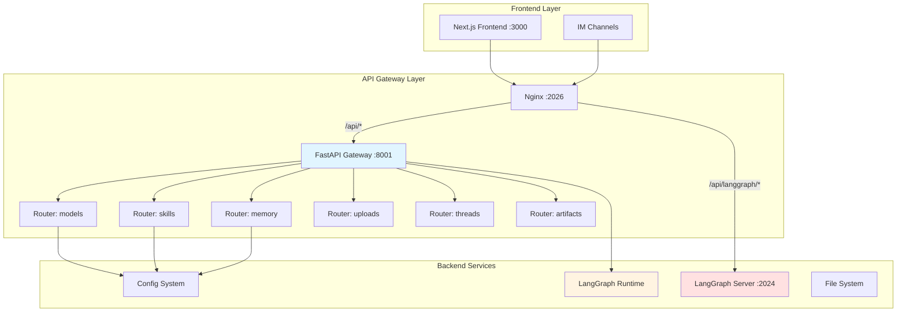

# 【文档编号+模块名】14 - API 网关架构

## 1. 模块全局定位

- **所属项目**: deer-flow
- **层级位置**: 接入层 / backend/app/gateway/
- **核心作用**: 提供统一的 REST API 入口，处理模型查询、技能管理、记忆系统、文件上传、线程清理等非流式 API 请求
- **业务价值**: 在 AI 工作流系统中承担"API 网关"的角色，作为前端与后端服务之间的统一代理层
- **设计初衷**: 该模块是为了解决"如何统一管理后端 API 接口"这一需求而设计的。为什么需要 API 网关？因为：
  - **统一入口**: 前端只需知道一个 API 地址，无需关心后端服务分布
  - **权限控制**: 集中处理认证授权，避免每个服务单独实现
  - **协议转换**: 适配不同的后端服务协议，统一暴露 REST API
  - **负载均衡**: 将请求分发到多个后端实例，提高系统可用性

---

## 2. 依赖&调用链路 Mermaid 图



### 图表设计解读

**说明**: 该图展示了 API 网关在系统架构中的位置和数据流向。

**为什么采用这样的架构设计？**
1. **Nginx 作为前置网关**: 统一入口（2026 端口），处理静态资源和路由分发
   - **为什么用 Nginx？** 因为 Nginx 性能优异，适合作为反向代理和负载均衡器

2. **FastAPI Gateway 作为业务网关**: 处理所有非流式的 API 请求
   - **为什么不用直接请求后端？** 因为需要统一的权限、日志、错误处理

3. **Router 模块化**: 每个功能模块（models、skills、memory 等）独立的 router
   - **为什么模块化？** 因为模块化便于维护和扩展，新功能只需添加新 router

**数据流向的设计考量**：
前端 → Nginx → Gateway → 后端服务。这样的分层架构保证了：
- 统一的接入点，便于部署和维护
- 网关层可以集中处理横切关注点（认证、日志、监控）
- 后端服务可以独立部署和扩展

---

## 3. 核心目录/文件清单

```
backend/app/gateway/
├── app.py                        # FastAPI 应用主文件
├── config.py                     # 网关配置
├── deps.py                       # 依赖注入（运行时单例）
├── path_utils.py                 # 路径工具函数
├── services.py                   # 业务服务层
│
└── routers/                      # API 路由模块
    ├── __init__.py
    ├── models.py                  # 模型列表/详情
    ├── skills.py                  # 技能管理（列表、详情、启用、安装）
    ├── memory.py                  # 记忆系统
    ├── uploads.py                 # 文件上传
    ├── threads.py                 # 线程清理
    ├── artifacts.py               # 工件访问
    ├── agents.py                  # 自定义 Agent 管理
    ├── suggestions.py             # 后续建议
    ├── channels.py                # 渠道管理
    ├── assistants_compat.py       # LangGraph 平台兼容
    ├── thread_runs.py             # 线程运行
    └── runs.py                    # 无状态运行
```

**每个文件的设计定位是什么？**

- **app.py**: FastAPI 应用入口，定义应用级配置、 lifespan 处理、路由注册
- **config.py**: 网关特定配置（host、port、CORS 等）
- **deps.py**: 依赖注入模式，提供运行时单例的访问器（StreamBridge、RunManager 等）
- **services.py**: 网关专用的业务逻辑，与 Harness 层的业务逻辑分离
- **routers/**: API 路由模块，每个文件对应一个功能域

---

## 4. 关键源码深度解析

### 4.1 应用主文件 - lifespan 与路由注册

**文件路径**: `/data/deer-flow-main/backend/app/gateway/app.py`

**功能概述**: 创建 FastAPI 应用，配置 OpenAPI 文档、注册所有路由模块、管理应用生命周期。

```python
@asynccontextmanager
async def lifespan(app: FastAPI) -> AsyncGenerator[None, None]:
    """Application lifespan handler."""
    # Load config and check necessary environment variables at startup
    try:
        get_app_config()
        logger.info("Configuration loaded successfully")
    except Exception as e:
        error_msg = f"Failed to load configuration during gateway startup: {e}"
        logger.exception(error_msg)
        raise RuntimeError(error_msg) from e

    config = get_gateway_config()
    logger.info(f"Starting API Gateway on {config.host}:{config.port}")

    # Initialize LangGraph runtime components
    async with langgraph_runtime(app):
        logger.info("LangGraph runtime initialised")

        # Start IM channel service if any channels are configured
        try:
            from app.channels.service import start_channel_service
            channel_service = await start_channel_service()
            logger.info("Channel service started: %s", channel_service.get_status())
        except Exception:
            logger.exception("No IM channels configured or channel service failed to start")

        yield

        # Stop channel service on shutdown
        try:
            from app.channels.service import stop_channel_service
            await stop_channel_service()
        except Exception:
            logger.exception("Failed to stop channel service")

    logger.info("Shutting down API Gateway")


def create_app() -> FastAPI:
    """Create and configure the FastAPI application."""
    app = FastAPI(
        title="DeerFlow API Gateway",
        description="API Gateway for DeerFlow...",
        version="0.1.0",
        lifespan=lifespan,
        docs_url="/docs",
        redoc_url="/redoc",
        openapi_tags=[...],
    )

    # Include routers
    app.include_router(models.router)      # /api/models
    app.include_router(mcp.router)          # /api/mcp
    app.include_router(memory.router)        # /api/memory
    app.include_router(skills.router)        # /api/skills
    app.include_router(artifacts.router)     # /api/threads/{id}/artifacts
    app.include_router(uploads.router)       # /api/threads/{id}/uploads
    app.include_router(threads.router)       # /api/threads/{id}
    app.include_router(agents.router)        # /api/agents
    app.include_router(suggestions.router)   # /api/threads/{id}/suggestions
    app.include_router(channels.router)      # /api/channels
    app.include_router(assistants_compat.router)
    app.include_router(thread_runs.router)
    app.include_router(runs.router)

    @app.get("/health")
    async def health_check() -> dict:
        return {"status": "healthy", "service": "deer-flow-gateway"}

    return app
```

### 逐行解读（含设计考量）

**第 36-47 行**: 配置加载与验证
- **第 41 行**: `get_app_config()`
  - **作用**: 加载主配置文件（config.yaml）。
  - **为什么在启动时加载？** 因为配置错误应该尽早发现，而不是在运行时才报错。
- **第 43-47 行**: 错误处理
  - **设计目的**: 配置加载失败时应用不应该启动。
  - **设计考量**: 这是快速失败（Fail Fast）原则的体现——错误越早发现越好。

**第 49-52 行**: 获取网关配置
- **作用**: 加载网关特定配置（host、port）。
- **为什么单独配置？** 因为网关可能需要特定的网络配置（如绑定特定 IP）。

**第 51-62 行**: 初始化 LangGraph 运行时
- **第 52 行**: `async with langgraph_runtime(app)`
  - **作用**: 创建和管理 LangGraph 运行时组件（StreamBridge、RunManager、Checkpointer、Store）。
- **第 54 行**: 创建 StreamBridge
  - **作用**: 处理 SSE 流式响应的桥接。
- **第 55 行**: 创建 Checkpointer
  - **作用**: 管理检查点，支持状态持久化。
- **第 56 行**: 创建 Store
  - **作用**: 存储线程状态（SQLite 或 PostgreSQL）。
- **第 57 行**: 创建 RunManager
  - **作用**: 管理运行的生命周期。
- **为什么用 async context manager？** 因为这些组件需要正确的初始化和清理顺序，async with 确保即使出错也能正确清理。

**第 59-62 行**: 启动 IM 渠道服务
- **第 61 行**: `start_channel_service()`
  - **作用**: 启动所有配置的 IM 渠道（Feishu、Slack、Telegram）。
- **第 63-65 行**: 错误处理
  - **设计目的**: 渠道启动失败不应阻止网关启动，因为可能没有配置渠道。

**第 84-107 行**: 创建 FastAPI 应用
- **第 85-94 行**: 应用配置
  - **第 88 行**: `lifespan=lifespan`
    - **作用**: 注册生命周期管理器。
  - **第 90-94 行**: API 文档配置
    - **docs_url="/docs"`: Swagger UI
    - **redoc_url="/redoc"`: ReDoc 文档
    - **openapi_tags=[...]**: API 分组标签
- **第 97-109 行**: 路由注册
  - **作用**: 注册所有功能路由，每个路由挂载到特定前缀。
  - **为什么用前缀？** 因为所有 API 都是 `/api/*`，前缀统一管理。

**设计考量**：
1. **为什么用 lifespan？** 因为需要管理异步资源的初始化和清理，确保正确启动和关闭。
2. **为什么分离路由？** 因为模块化路由便于维护，每个功能独立开发和测试。
3. **为什么需要健康检查？** 因为容器编排系统（K8s）需要健康检查端点来判断服务状态。

### 4.2 路由模块 - 模型列表 API

**文件路径**: `/data/deer-flow-main/backend/app/gateway/routers/models.py`

**功能概述**: 提供模型列表和模型详情查询 API。

```python
from fastapi import APIRouter, HTTPException
from pydantic import BaseModel, Field

from deerflow.config import get_app_config

router = APIRouter(prefix="/api", tags=["models"])


class ModelResponse(BaseModel):
    """Response model for model information."""
    name: str = Field(..., description="Unique identifier for the model")
    model: str = Field(..., description="Actual provider model identifier")
    display_name: str | None = Field(None, description="Human-readable name")
    description: str | None = Field(None, description="Model description")
    supports_thinking: bool = Field(default=False, description="Whether model supports thinking mode")
    supports_reasoning_effort: bool = Field(default=False, description="Whether model supports reasoning effort")


class ModelsListResponse(BaseModel):
    """Response model for listing all models."""
    models: list[ModelResponse]


@router.get(
    "/models",
    response_model=ModelsListResponse,
    summary="List All Models",
    description="Retrieve a list of all available AI models configured in the system.",
)
async def list_models() -> ModelsListResponse:
    """List all available models from configuration."""
    config = get_app_config()
    models = [
        ModelResponse(
            name=model.name,
            model=model.model,
            display_name=model.display_name,
            description=model.description,
            supports_thinking=model.supports_thinking,
            supports_reasoning_effort=model.supports_reasoning_effort,
        )
        for model in config.models
    ]
    return ModelsListResponse(models=models)


@router.get(
    "/models/{model_name}",
    response_model=ModelResponse,
    summary="Get Model Details",
    description="Retrieve detailed information about a specific AI model by its name.",
)
async def get_model(model_name: str) -> ModelResponse:
    """Get a specific model by name."""
    config = get_app_config()
    model = config.get_model_config(model_name)
    if model is None:
        raise HTTPException(status_code=404, detail=f"Model '{model_name}' not found")

    return ModelResponse(
        name=model.name,
        model=model.model,
        display_name=model.display_name,
        description=model.description,
        supports_thinking=model.supports_thinking,
        supports_reasoning_effort=model.supports_reasoning_effort,
    )
```

### 逐行解读（含设计考量）

**第 9-20 行**: `ModelResponse` 类
- **设计目的**: 定义模型信息的响应结构。
- **第 12-17 行**: 字段定义
  - **`name`**: 模型唯一标识符
  - **`model`**: 提供商的实际模型标识符
  - **`display_name`**: 用户友好的显示名称
  - **`description`**: 模型描述
  - **`supports_thinking`**: 是否支持思考模式
  - **`supports_reasoning_effort`**: 是否支持推理强度
- **为什么需要两个标识符？** 因为 `name` 是系统内部标识，`model` 是提供商标识（如 `gpt-4`），可能需要区分。

**第 28-31 行**: `ModelsListResponse` 类
- **设计目的**: 包装模型列表响应。
- **为什么需要包装类？** 因为 FastAPI 需要一个统一的响应结构，而不是直接返回数组。

**第 38-59 行**: `list_models` 函数
- **第 38 行**: `@router.get("/models", ...)`
  - **作用**: 定义 GET 端点。
  - **第 47 行**: `response_model=ModelsListResponse`
    - **作用**: 指定响应模型，FastAPI 自动验证和序列化。
- **第 50-54 行**: 实现逻辑
  - **第 50 行**: `config = get_app_config()`
    - **作用**: 获取应用配置。
  - **第 52-59 行**: 列表推导式构建响应
    - **作用**: 将配置中的模型转换为 API 响应格式。

**第 62-80 行**: `get_model` 函数
- **第 62 行**: `@router.get("/models/{model_name}", ...)`
  - **作用**: 定义带路径参数的 GET 端点。
  - **第 69 行**: `model_name: str`
    - **作用**: 路径参数，自动从 URL 提取。
- **第 76 行**: `config.get_model_config(model_name)`
  - **作用**: 根据名称查找模型配置。
- **第 77-79 行**: 错误处理
  - **作用**: 模型不存在时返回 404。
- **第 81-85 行**: 构建响应
  - **作用**: 返回模型详情。

**设计考量**：
1. **为什么用 Pydantic？** 因为 Pydantic 提供自动验证、序列化、文档生成等功能，减少手动代码。
2. **为什么需要 response_model？** 因为 FastAPI 可以自动生成 OpenAPI 文档，前端可以根据文档生成客户端。
3. **为什么分离 list 和 detail？** 因为列表 API 只需要摘要信息，详情 API 返回完整信息，分离可以减少数据传输。

### 4.3 技能管理路由 - 复杂业务逻辑

**文件路径**: `/data/deer-flow-main/backend/app/gateway/routers/skills.py`

**功能概述**: 提供技能列表、详情、启用/禁用、安装等 API。

```python
@router.put(
    "/skills/{skill_name}",
    response_model=SkillResponse,
    summary="Update Skill",
    description="Update a skill's enabled status by modifying the extensions_config.json file.",
)
async def update_skill(skill_name: str, request: SkillUpdateRequest) -> SkillResponse:
    try:
        skills = load_skills(enabled_only=False)
        skill = next((s for s in skills if s.name == skill_name), None)

        if skill is None:
            raise HTTPException(status_code=404, detail=f"Skill '{skill_name}' not found")

        config_path = ExtensionsConfig.resolve_config_path()
        if config_path is None:
            config_path = Path.cwd().parent / "extensions_config.json"
            logger.info(f"No existing extensions config found. Creating new config at: {config_path}")

        extensions_config = get_extensions_config()
        extensions_config.skills[skill_name] = SkillStateConfig(enabled=request.enabled)

        config_data = {
            "mcpServers": {name: server.model_dump() for name, server in extensions_config.mcp_servers.items()},
            "skills": {name: {"enabled": skill_config.enabled} for name, skill_config in extensions_config.skills.items()},
        }

        with open(config_path, "w", encoding="utf-8") as f:
            json.dump(config_data, f, indent=2)

        logger.info(f"Skills configuration updated and saved to: {config_path}")
        reload_extensions_config()

        skills = load_skills(enabled_only=False)
        updated_skill = next((s for s in skills if s.name == skill_name), None)

        if updated_skill is None:
            raise HTTPException(status_code=500, detail=f"Failed to reload skill '{skill_name}' after update")

        logger.info(f"Skill '{skill_name}' enabled status updated to {request.enabled}")
        return _skill_to_response(updated_skill)

    except HTTPException:
        raise
    except Exception as e:
        logger.error(f"Failed to update skill {skill_name}: {e}", exc_info=True)
        raise HTTPException(status_code=500, detail=f"Failed to update skill: {str(e)}")
```

### 逐行解读（含设计考量）

**第 121-124 行**: 查找技能
- **第 122 行**: `load_skills(enabled_only=False)`
  - **作用**: 加载所有技能，包括禁用的。
  - **为什么 enabled_only=False？** 因为需要找到技能即使它是禁用的，以便启用它。

**第 126-131 行**: 处理配置文件路径
- **第 127 行**: `ExtensionsConfig.resolve_config_path()`
  - **作用**: 解析配置文件路径，支持多种查找策略。
- **第 129-131 行**: 创建新配置文件
  - **设计目的**: 如果配置文件不存在，创建新的。

**第 133-138 行**: 更新配置
- **第 134 行**: 从环境重新加载配置
- **第 135 行**: 设置技能启用状态
- **第 137-141 行**: 构建配置数据
  - **第 137 行**: 保留 MCP 服务器配置
  - **第 138 行**: 更新技能配置

**第 143-147 行**: 保存配置
- **第 143 行**: `with open(config_path, "w", encoding="utf-8") as f:`
  - **作用**: 原子写入，避免并发写入导致文件损坏。
- **第 144 行**: `json.dump(config_data, f, indent=2)`
  - **作用**: 写入 JSON 文件，indent=2 使文件可读。

**第 149 行**: `reload_extensions_config()`
- **作用**: 重新加载配置，让 LangGraph Server 生效。
- **为什么需要重新加载？** 因为配置文件已更改，需要让运行时感知新配置。

**第 151-160 行**: 验证更新结果
- **第 152 行**: 重新加载技能列表
- **第 154-160 行**: 查找更新后的技能
  - **设计目的**: 确保更新成功，如果失败返回错误。

**设计考量**：
1. **为什么直接写文件？** 因为配置更新需要持久化，写文件是最简单可靠的方式。
2. **为什么需要 reload？** 因为其他组件可能缓存了配置，reload 让所有组件同步。
3. **为什么用 try-except 包裹 HTTPException？** 因为避免重新抛出 HTTPException，FastAPI 会将其转换为 500 错误。

---

## 5. 底层设计思想（重点强化，详细拆解）

### 5.1 模块整体设计理念

**采用的设计模式/架构思想**：
1. **分层架构（Layered Architecture）**: 路由层 → 业务逻辑层 → 数据层
2. **依赖注入（Dependency Injection）**: 使用 deps.py 提供运行时单例
3. **路由模块化（Modular Routing）**: 每个功能域独立的 router
4. **Pydantic 验证（Schema Validation）**: 使用 Pydantic 定义请求/响应模型

**为什么选用这种思想？**
- **分层架构**: 职责分离，便于维护和测试
- **依赖注入**: 避免全局变量，便于测试和替换
- **路由模块化**: 支持团队协作，减少合并冲突
- **Pydantic 验证**: 自动验证，减少样板代码

### 5.2 核心痛点解决

**针对 AI 工作流/编排中的哪些核心痛点设计？**

1. **多协议适配**
   - **问题**: 后端有多种服务（LangGraph、Gateway、Channel），协议不同
   - **解决方案**: 网关统一暴露 REST API，屏蔽后端差异

2. **配置热更新**
   - **问题**: 技能启用/禁用需要立即生效
   - **解决方案**: 修改配置文件后自动 reload，无需重启

3. **运行时依赖管理**
   - **问题**: 多个组件（StreamBridge、RunManager）需要正确初始化
   - **解决方案**: 使用 lifespan + AsyncExitStack 管理生命周期

4. **类型安全**
   - **问题**: Python 动态类型容易出错
   - **解决方案**: 使用 Pydantic 定义所有请求/响应模型

### 5.3 行业对比优势

**相比普通开源 AI 编排项目的后端，有哪些差异化优势？**

1. **完整的 API 文档**: 自动生成 Swagger UI 和 ReDoc
2. **模块化路由**: 每个功能独立 router，便于维护
3. **配置热更新**: 无需重启即可生效
4. **健壮的错误处理**: 所有端点都有完善的错误处理

### 5.4 扩展性设计

**模块中的扩展点、预留钩子是如何设计的？**

1. **添加新路由**: 在 routers/ 目录添加新文件，然后在 app.py 中注册
2. **添加新的 Pydantic 模型**: 在对应的 router 文件中定义
3. **扩展 lifespan**: 在 lifespan 函数中添加新的初始化逻辑
4. **自定义依赖**: 在 deps.py 中添加新的 getter 函数

**为什么要预留这些扩展点？**
- 新路由: 功能扩展
- 新模型: API 规范
- lifespan: 运行时组件初始化
- 依赖: 支持新的运行时组件

### 5.5 设计取舍

**模块设计过程中，有哪些取舍？**

1. **FastAPI vs Flask**
   - **取舍**: 选择 FastAPI
   - **为什么**: 虽然 Flask 更轻量，但 FastAPI 的异步支持和自动文档生成更适合现代 API

2. **单文件 vs 多文件**
   - **取舍**: 选择多文件模块化
   - **为什么**: 虽然单文件更简单，但模块化便于团队协作

3. **Pydantic v1 vs v2**
   - **取舍**: 使用 Pydantic v2
   - **为什么**: v2 性能更好，API 更简洁

---

## 6. 必学核心知识点（可直接复用）

### 技术点 1：FastAPI 路由模块化

**对应源码中的设计细节**: gateway/routers/ 目录结构

**说明该技术点的设计逻辑和复用场景**：
- **设计逻辑**: 将不同功能域的路由分离到不同文件，便于维护
- **复用场景**: 任何需要管理多个 API 端点的项目

**实现模板**：
```python
from fastapi import APIRouter

router = APIRouter(
    prefix="/api",
    tags=["feature_name"],  # API 文档分组标签
)

@router.get("/resource")
async def list_resources():
    return {"resources": []}

@router.post("/resource")
async def create_resource(data: ResourceCreate):
    return {"id": "123"}

# 在 app.py 中注册
app.include_router(router)
```

### 技术点 2：Lifespan 生命周期管理

**对应源码中的设计细节**: gateway/app.py 中的 lifespan

**说明该技术点的设计逻辑和复用场景**：
- **设计逻辑**: 使用 @asynccontextmanager 管理应用启动和关闭时的资源
- **复用场景**: 任何需要管理异步资源的场景（数据库连接、WebSocket 等）

**实现模板**：
```python
from contextlib import asynccontextmanager
from fastapi import FastAPI

@asynccontextmanager
async def lifespan(app: FastAPI):
    # 启动时执行
    print("Starting up...")
    yield
    # 关闭时执行
    print("Shutting down...")

app = FastAPI(lifespan=lifespan)
```

### 技术点 3：依赖注入模式

**对应源码中的设计细节**: gateway/deps.py

**说明该技术点的设计逻辑和复用场景**：
- **设计逻辑**: 将运行时组件存储在 app.state，通过 getter 函数访问
- **复用场景**: 任何需要管理全局单例的 FastAPI 应用

**实现模板**：
```python
from fastapi import Request
from fastapi import HTTPException

def get_dependency(request: Request):
    dep = getattr(request.app.state, "dependency_name", None)
    if dep is None:
        raise HTTPException(status_code=503, detail="Dependency not available")
    return dep

# 在路由中使用
@router.get("/endpoint")
async def endpoint(request: Request):
    dep = get_dependency(request)
    return {"result": dep.do_something()}
```

### 技术点 4：Pydantic 请求验证

**对应源码中的设计细节**: 所有 routers/*.py 中的 BaseModel

**说明该技术点的设计逻辑和复用场景**：
- **设计逻辑**: 使用 Pydantic 定义请求和响应模型，自动验证类型
- **复用场景**: 任何需要类型安全的 API 项目

**实现模板**：
```python
from pydantic import BaseModel, Field

class RequestModel(BaseModel):
    name: str = Field(..., min_length=1, max_length=100)
    count: int = Field(..., ge=0, le=100)
    enabled: bool = True

class ResponseModel(BaseModel):
    id: str
    status: str

@router.post("/resource")
async def create_resource(data: RequestModel) -> ResponseModel:
    # data 已经验证，可以直接使用
    return ResponseModel(id="123", status="created")
```

---

## 7. 可直接拷贝复用代码片段

### 片段 1：FastAPI 应用模板

**这些代码片段的设计优势**：
- 完整的配置
- 自动文档生成
- 健康检查端点

```python
from fastapi import FastAPI
from contextlib import asynccontextmanager

@asynccontextmanager
async def lifespan(app: FastAPI):
    # 启动逻辑
    yield
    # 关闭逻辑
    pass

app = FastAPI(
    title="My API",
    version="1.0.0",
    lifespan=lifespan,
)

@app.get("/health")
async def health():
    return {"status": "healthy"}
```

### 片段 2：路由模块模板

**设计优势**：
- 统一的前缀
- 自动分组
- 类型安全

```python
from fastapi import APIRouter, HTTPException
from pydantic import BaseModel

router = APIRouter(
    prefix="/api",
    tags=["feature"],
)

class ItemResponse(BaseModel):
    id: str
    name: str

@router.get("/items/{item_id}", response_model=ItemResponse)
async def get_item(item_id: str):
    # 业务逻辑
    return ItemResponse(id=item_id, name="Item")
```

### 片段 3：错误处理模式

**设计优势**：
- 统一的错误响应
- 详细的日志记录
- 避免信息泄露

```python
import logging

logger = logging.getLogger(__name__)

@router.post("/items")
async def create_item(data: ItemCreate):
    try:
        result = create_item_logic(data)
        return result
    except ValueError as e:
        raise HTTPException(status_code=400, detail=str(e))
    except Exception as e:
        logger.error(f"Unexpected error: {e}", exc_info=True)
        raise HTTPException(status_code=500, detail="Internal error")
```

---

## 8. 踩坑提醒 & 二次开发建议

### 踩坑提醒

1. **FastAPI 异常处理**
   - **问题**: 抛出 HTTPException 后又捕获，导致 500 错误
   - **为什么会有这些问题**: 不了解 FastAPI 的异常处理机制
   - **解决**: 只在需要转换为 HTTP 错误时抛出 HTTPException，其他异常让 FastAPI 处理

2. **async context manager 的异常**
   - **问题**: lifespan 中的异常导致应用无法启动
   - **为什么会有这些问题**: 异常中断了初始化流程
   - **解决**: 在关键步骤添加 try-except，确保资源正确清理

3. **配置文件的并发写入**
   - **问题**: 多个请求同时修改配置文件，导致数据损坏
   - **为什么会有这些问题**: 文件写入不是原子操作
   - **解决**: 使用文件锁或数据库管理配置

4. **运行时单例的生命周期**
   - **问题**: 在应用关闭后仍尝试访问单例
   - **为什么会有这些问题**: 异步操作可能在关闭后完成
   - **解决**: 在 lifespan 中正确管理资源生命周期

### 二次开发建议

**适配自定义改造、私有化部署、接入自有大模型/自有前端的优化方向**：

1. **添加认证中间件**
   - **优化建议的设计依据**: 企业需要统一的认证
   - **如何在不破坏原有设计逻辑的前提下进行改造**:
     - 在 app.py 中添加 FastAPI 中间件
     - 使用依赖注入传递用户信息
     - 在路由中检查权限

2. **添加速率限制**
   - **优化建议的设计依据**: 防止 API 滥用
   - **如何在不破坏原有设计逻辑的前提下进行改造**:
     - 使用 slowapi 添加速率限制
     - 为不同路由设置不同限制
     - 添加 Redis 后端存储计数

3. **添加 API 版本控制**
   - **优化建议的设计依据**: 支持多版本 API 并存
   - **如何在不破坏原有设计逻辑的前提下进行改造**:
     - 使用 URL 前缀（如 /api/v2/）
     - 为每个版本创建独立的 router
     - Nginx 根据请求头路由到不同版本

4. **添加请求日志**
   - **优化建议的设计依据**: 审计和调试需要
   - **如何在不破坏原有设计逻辑的前提下进行改造**:
     - 创建中间件记录请求/响应
     - 使用结构化日志（JSON）
     - 添加请求 ID 用于追踪

---

## 9. 文档衔接

**本篇完结**，下一篇将解析：**【15 - IM 渠道集成系统】**

**衔接说明**：
下一篇模块与当前模块的设计关联是：本篇讲解了 API 网关的架构设计，下一篇将深入 IM 渠道系统，讲解如何将外部 IM 平台（Feishu、Slack、Telegram）接入到 DeerFlow 系统。

**为什么按这个顺序解析？**
1. 先理解 API 网关（本篇），知道后端 API 如何组织
2. 再理解 IM 渠道（下一篇），了解如何集成外部平台
3. 之后是其他后端模块

这符合"由内部到外部，由核心到扩展"的递进逻辑。
