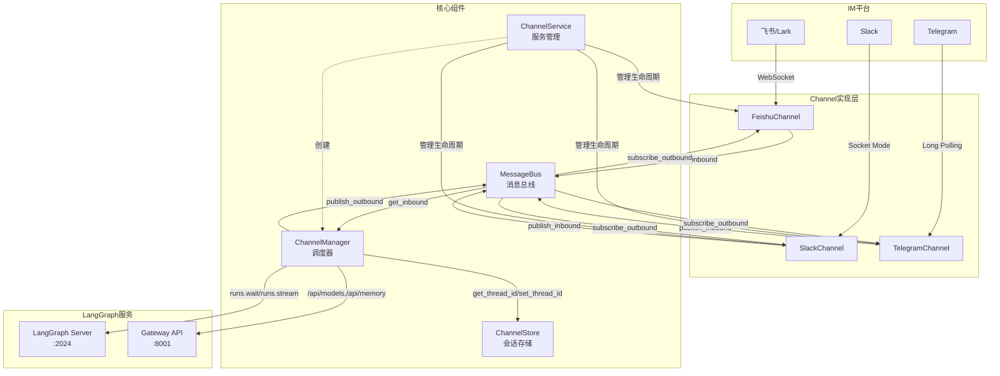

# 【文档15】IM渠道集成系统

## 1. 模块全局定位

- **所属项目**: deer-flow
- **层级位置**: `backend/app/channels/`
- **核心作用**: 将外部IM平台（飞书/Slack/Telegram）的消息接入DeerFlow AI代理系统，实现多平台统一的AI对话能力
- **业务价值**: 让用户可以在日常工作使用的IM工具中直接与AI代理交互，无需切换到专门的Web界面
- **设计初衷**: 统一IM平台与AI代理之间的消息流转，通过异步消息总线解耦各平台实现，支持流式/非流式响应，实现会话持久化和多线程管理

## 2. 依赖&调用链路 Mermaid图



### 图表设计解读

该链路图采用**发布-订阅模式**设计，核心设计考量如下：

1. **消息总线作为中心枢纽**: `MessageBus`连接所有Channel和ChannelManager，实现完全解耦。Channel不需要知道谁会消费消息，Manager也不需要知道消息来自哪个平台。

2. **异步非阻塞设计**: 整个链路基于`asyncio`构建，每个Channel在自己的线程/事件循环中运行，通过`run_coroutine_threadsafe`与主事件_loop通信，避免阻塞。

3. **分层职责清晰**:
   - **Channel层**: 负责平台特定协议适配（WebSocket/Socket Mode/Long Polling）
   - **Bus层**: 负责消息路由和异步队列管理
   - **Manager层**: 负责业务逻辑（线程管理、Agent调用、命令处理）
   - **Service层**: 负责生命周期管理（启动、停止、重启）

4. **会话持久化独立**: `ChannelStore`专门负责IM对话与DeerFlow线程的映射，使用JSON文件存储，支持多线程场景（topic_id）

5. **双路径调用**: Manager既调用LangGraph Server（Agent对话），也调用Gateway API（辅助命令如/models、/memory），确保功能完整性

## 3. 核心目录/文件清单

| 文件路径 | 核心职责 | 设计定位 |
|---------|---------|---------|
| `base.py` | 定义抽象基类`Channel`，规范Channel接口 | 作为所有平台实现的契约，确保插件化扩展能力 |
| `message_bus.py` | 定义消息类型（InboundMessage、OutboundMessage）和MessageBus类 | 消息传输的统一数据格式和异步通信基础设施 |
| `store.py` | ChannelStore类，JSON文件持久化 | 会话映射的简单持久化方案，生产环境可替换为数据库 |
| `manager.py` | ChannelManager类，核心调度逻辑 | 业务核心，负责Agent调用、流式响应、命令处理 |
| `service.py` | ChannelService类，生命周期管理 | 服务入口，统一管理所有Channel的启动停止 |
| `feishu.py` | FeishuChannel实现，支持流式响应 | 飞书平台适配，使用WebSocket长连接，支持卡片区更新 |
| `slack.py` | SlackChannel实现，非流式响应 | Slack平台适配，使用Socket Mode，支持Markdown转换 |
| `telegram.py` | TelegramChannel实现，非流式响应 | Telegram平台适配，使用Long Polling，支持图片/文档上传 |
| `__init__.py` | 模块导出定义 | 对外暴露核心接口 |

## 4. 关键源码深度解析

### 4.1 基础抽象层：`base.py`

**文件路径**: `/data/deer-flow-main/backend/app/channels/base.py`

```python
class Channel(ABC):
    """所有IM渠道实现的基类。

    每个渠道连接外部消息平台并：
    1. 接收消息，包装为InboundMessage，发布到总线
    2. 订阅出站消息，将回复发回平台

    子类必须实现start、stop和send方法。
    """

    def __init__(self, name: str, bus: MessageBus, config: dict[str, Any]) -> None:
        self.name = name
        self.bus = bus
        self.config = config
        self._running = False

    @abstractmethod
    async def start(self) -> None:
        """开始从外部平台监听消息。"""
        pass

    @abstractmethod
    async def stop(self) -> None:
        """优雅地停止渠道。"""
        pass

    @abstractmethod
    async def send(self, msg: OutboundMessage) -> None:
        """将消息发回外部平台。

        实现应使用msg.chat_id和msg.thread_ts
        将回复路由到正确的对话/线程。
        """
        pass

    async def send_file(self, msg: OutboundMessage, attachment: ResolvedAttachment) -> bool:
        """上传单个文件附件到平台。

        返回True表示上传成功，False表示失败。
        默认实现返回False（不支持文件上传）。
        """
        return False

    async def _on_outbound(self, msg: OutboundMessage) -> None:
        """出站回调，注册到总线。

        仅转发目标为该渠道的消息。
        先发送文本消息，然后上传任何文件附件。
        当文本发送失败时跳过文件上传，以避免部分交付。
        """
        if msg.channel_name == self.name:
            try:
                await self.send(msg)
            except Exception:
                logger.exception("Failed to send outbound message on channel %s", self.name)
                return  # 文本消息失败时不尝试文件上传

            for attachment in msg.attachments:
                try:
                    success = await self.send_file(msg, attachment)
                    if not success:
                        logger.warning("[%s] file upload skipped for %s", self.name, attachment.filename)
                except Exception:
                    logger.exception("[%s] failed to upload file %s", self.name, attachment.filename)
```

#### 设计考量解读

1. **ABC抽象基类模式**: 使用Python的`abc.ABC`确保所有Channel实现必须实现核心方法，在编译期就能发现接口不完整的问题。

2. **生命周期管理规范**: `start`/`stop`方法约定了Channel的启动和停止流程，每个平台可以有不同的连接方式（WebSocket/Socket Mode/Long Polling），但生命周期接口统一。

3. **文件上传可选设计**: `send_file`有默认实现返回False，意味着不支持文件上传的Channel可以不实现此方法。这种设计避免了强制所有平台都支持文件上传。

4. **部分交付保护**: `_on_outbound`中，如果文本发送失败，直接return跳过文件上传。这避免了"只有文件没有文字"的奇怪用户体验，符合"原子性交付"的设计理念。

5. **消息路由基于channel_name**: 总线上的所有出站消息都会广播给所有Channel，但只有`msg.channel_name == self.name`的才会处理。这种设计允许一个系统运行多个Channel而不互相干扰。

---

### 4.2 消息总线：`message_bus.py`

**文件路径**: `/data/deer-flow-main/backend/app/channels/message_bus.py`

```python
class MessageBus:
    """连接渠道和代理调度器的异步发布/订阅中心。

    渠道发布入站消息；调度器消费它们。
    调度器发布出站消息；渠道通过注册的回调接收它们。
    """

    def __init__(self) -> None:
        self._inbound_queue: asyncio.Queue[InboundMessage] = asyncio.Queue()
        self._outbound_listeners: list[OutboundCallback] = []

    # -- inbound -----------------------------------------------------------

    async def publish_inbound(self, msg: InboundMessage) -> None:
        """将来自渠道的入站消息入队。"""
        await self._inbound_queue.put(msg)
        logger.info(
            "[Bus] inbound enqueued: channel=%s, chat_id=%s, type=%s, queue_size=%d",
            msg.channel_name,
            msg.chat_id,
            msg.msg_type.value,
            self._inbound_queue.qsize(),
        )

    async def get_inbound(self) -> InboundMessage:
        """阻塞直到下一个入站消息可用。"""
        return await self._inbound_queue.get()

    # -- outbound ----------------------------------------------------------

    def subscribe_outbound(self, callback: OutboundCallback) -> None:
        """注册出站消息的异步回调。"""
        self._outbound_listeners.append(callback)

    def unsubscribe_outbound(self, callback: OutboundCallback) -> None:
        """移除先前注册的出站回调。"""
        self._outbound_listeners = [cb for cb in self._outbound_listeners if cb is not callback]

    async def publish_outbound(self, msg: OutboundMessage) -> None:
        """将出站消息分发给所有注册的监听器。"""
        logger.info(
            "[Bus] outbound dispatching: channel=%s, chat_id=%s, listeners=%d, text_len=%d",
            msg.channel_name,
            msg.chat_id,
            len(self._outbound_listeners),
            len(msg.text),
        )
        for callback in self._outbound_listeners:
            try:
                await callback(msg)
            except Exception:
                logger.exception("Error in outbound callback for channel=%s", msg.channel_name)
```

#### 设计考量解读

1. **入站队列，出站回调**: 两种不同的数据结构用于不同场景：
   - **入站**：使用`asyncio.Queue`，因为只有一个消费者（ChannelManager），队列天然支持阻塞等待
   - **出站**：使用回调列表，因为可能有多个消费者（多个Channel），且需要即时分发

2. **异常隔离**: 在`publish_outbound`中，每个callback的异常被捕获并记录，但不会中断其他callback的执行。这保证了某个Channel出错不会影响其他Channel的消息接收。

3. **队列大小日志记录**: `publish_inbound`中记录`queue_size`，方便监控消息积压情况，有助于发现性能瓶颈。

4. **强类型回调**: `OutboundCallback = Callable[[OutboundMessage], Coroutine[Any, Any, None]]`使用类型注解明确要求异步函数，在编码期就能发现错误。

---

### 4.3 会话存储：`store.py`

**文件路径**: `/data/deer-flow-main/backend/app/channels/store.py`

```python
class ChannelStore:
    """JSON文件后备存储，映射IM对话到DeerFlow线程。

    磁盘数据布局::
        {
            "<channel_name>:<chat_id>": {
                "thread_id": "<uuid>",
                "user_id": "<platform_user>",
                "created_at": 1700000000.0,
                "updated_at": 1700000000.0
            },
            ...
        }

    该存储故意设计得简单 — 一个在每次变更时原子性重写的单个JSON文件。
    对于具有高并发的生产工作负载，可以替换为适当的数据库后端。
    """

    @staticmethod
    def _key(channel_name: str, chat_id: str, topic_id: str | None = None) -> str:
        if topic_id:
            return f"{channel_name}:{chat_id}:{topic_id}"
        return f"{channel_name}:{chat_id}"

    def get_thread_id(self, channel_name: str, chat_id: str, topic_id: str | None = None) -> str | None:
        """查找给定IM对话/主题的DeerFlow thread_id。"""
        entry = self._data.get(self._key(channel_name, chat_id, topic_id))
        return entry["thread_id"] if entry else None

    def set_thread_id(
        self,
        channel_name: str,
        chat_id: str,
        thread_id: str,
        *,
        topic_id: str | None = None,
        user_id: str = "",
    ) -> None:
        """创建或更新IM对话/主题的映射。"""
        with self._lock:
            key = self._key(channel_name, chat_id, topic_id)
            now = time.time()
            existing = self._data.get(key)
            self._data[key] = {
                "thread_id": thread_id,
                "user_id": user_id,
                "created_at": existing["created_at"] if existing else now,
                "updated_at": now,
            }
            self._save()

    def _save(self) -> None:
        fd = tempfile.NamedTemporaryFile(
            mode="w",
            dir=self._path.parent,
            suffix=".tmp",
            delete=False,
        )
        try:
            json.dump(self._data, fd, indent=2)
            fd.close()
            Path(fd.name).replace(self._path)
        except BaseException:
            fd.close()
            Path(fd.name).unlink(missing_ok=True)
            raise
```

#### 设计考量解读

1. **原子写入保证数据安全**: 使用临时文件+`replace`模式，确保即使写入过程中断，也不会破坏原文件。`replace`是原子操作（POSIX保证）。

2. **三段式Key设计**: `channel:chat`或`channel:chat:topic`的三段式设计支持：
   - **无场景**（如Telegram私聊）：使用`channel:chat`，所有消息共享一个thread
   - **多线程场景**（如Slack thread/Feishu回复）：使用`channel:chat:topic`，每个线程一个独立的thread

3. **线程安全**: 使用`threading.Lock`保护所有写操作，因为多个Channel实例可能并发调用`set_thread_id`。

4. **created_at保持不变**: 更新映射时保留原有的`created_at`，只更新`updated_at`，这样记录的是"对话首次创建时间"而非"最后更新时间"。

5. **设计取舍**: 故意使用简单的JSON文件而非数据库：
   - **优势**: 零依赖、易于调试、可人工编辑
   - **劣势**: 高并发下性能差、不支持复杂查询
   - **场景适配**: 对于IM场景（低并发、简单key-value查询），完全够用

---

### 4.4 核心调度器：`manager.py`（核心业务逻辑）

**文件路径**: `/data/deer-flow-main/backend/app/channels/manager.py`

#### 4.4.1 消息分发循环

```python
async def _dispatch_loop(self) -> None:
    logger.info("[Manager] dispatch loop started, waiting for inbound messages")
    while self._running:
        try:
            msg = await asyncio.wait_for(self.bus.get_inbound(), timeout=1.0)
        except TimeoutError:
            continue
        except asyncio.CancelledError:
            break

        logger.info(
            "[Manager] received inbound: channel=%s, chat_id=%s, type=%s, text=%r",
            msg.channel_name,
            msg.chat_id,
            msg.msg_type.value,
            msg.text[:100] if msg.text else "",
        )
        task = asyncio.create_task(self._handle_message(msg))
        task.add_done_callback(self._log_task_error)
```

#### 设计考量解读

1. **超时轮询**: 使用`timeout=1.0`的`wait_for`而非无限等待，这样可以定期检查`_running`标志，实现优雅关闭。

2. **并发控制**: 每个消息创建一个Task处理，但实际并发度由`self._semaphore`控制（默认5），防止过载。

3. **错误回调**: `add_done_callback`确保即使Task中发生异常，也能被记录到日志，避免"静默失败"。

---

#### 4.4.2 流式响应处理

```python
async def _handle_streaming_chat(
    self,
    client,
    msg: InboundMessage,
    thread_id: str,
    assistant_id: str,
    run_config: dict[str, Any],
    run_context: dict[str, Any],
) -> None:
    logger.info("[Manager] invoking runs.stream(thread_id=%s, text=%r)", thread_id, msg.text[:100])

    last_values: dict[str, Any] | list | None = None
    streamed_buffers: dict[str, str] = {}
    current_message_id: str | None = None
    latest_text = ""
    last_published_text = ""
    last_publish_at = 0.0
    stream_error: BaseException | None = None

    try:
        async for chunk in client.runs.stream(
            thread_id,
            assistant_id,
            input={"messages": [{"role": "human", "content": msg.text}]},
            config=run_config,
            context=run_context,
            stream_mode=["messages-tuple", "values"],
            multitask_strategy="reject",
        ):
            event = getattr(chunk, "event", "")
            data = getattr(chunk, "data", None)

            if event == "messages-tuple":
                accumulated_text, current_message_id = _accumulate_stream_text(streamed_buffers, current_message_id, data)
                if accumulated_text:
                    latest_text = accumulated_text
            elif event == "values" and isinstance(data, (dict, list)):
                last_values = data
                snapshot_text = _extract_response_text(data)
                if snapshot_text:
                    latest_text = snapshot_text

            if not latest_text or latest_text == last_published_text:
                continue

            now = time.monotonic()
            if last_published_text and now - last_publish_at < STREAM_UPDATE_MIN_INTERVAL_SECONDS:
                continue

            await self.bus.publish_outbound(
                OutboundMessage(
                    channel_name=msg.channel_name,
                    chat_id=msg.chat_id,
                    thread_id=thread_id,
                    text=latest_text,
                    is_final=False,
                    thread_ts=msg.thread_ts,
                )
            )
            last_published_text = latest_text
            last_publish_at = now
```

#### 设计考量解读

1. **双流模式**: 同时订阅`messages-tuple`（增量）和`values`（快照），兼顾实时性和准确性：
   - `messages-tuple`: 提供增量文本，流式感强
   - `values`: 提供完整状态，确保最终一致性

2. **消息级缓冲**: `streamed_buffers`按`message_id`分别缓冲，支持多个AI消息并发流式输出（虽然当前场景通常是单消息）。

3. **节流机制**: `STREAM_UPDATE_MIN_INTERVAL_SECONDS = 0.35`秒的最小间隔，避免过于频繁的更新导致平台限流或用户体验不佳。

4. **增量文本合并**: `_merge_stream_text`处理了三种情况：
   - 增量追加（新文本追加到旧文本）
   - 完整快照（chunk已经是完整文本）
   - 前缀冲突（异常情况，采用追加策略）

5. **错误恢复**: `stream_error`被捕获并保存，在finally块中根据错误类型返回不同的用户友好提示。

---

#### 4.4.3 附件解析与安全

```python
_OUTPUTS_VIRTUAL_PREFIX = "/mnt/user-data/outputs/"

def _resolve_attachments(thread_id: str, artifacts: list[str]) -> list[ResolvedAttachment]:
    """将虚拟工件路径解析为带元数据的主机文件系统路径。

    只接受/mnt/user-data/outputs/下的路径；任何其他
    虚拟路径将被拒绝并警告，以防止通过IM渠道泄露上传或工作区文件。
    """
    from deerflow.config.paths import get_paths

    attachments: list[ResolvedAttachment] = []
    paths = get_paths()
    outputs_dir = paths.sandbox_outputs_dir(thread_id).resolve()
    for virtual_path in artifacts:
        # 安全：只允许来自代理输出目录的文件
        if not virtual_path.startswith(_OUTPUTS_VIRTUAL_PREFIX):
            logger.warning("[Manager] rejected non-outputs artifact path: %s", virtual_path)
            continue
        try:
            actual = paths.resolve_virtual_path(thread_id, virtual_path)
            # 验证解析后的路径确实在输出目录下
            # （即使在前缀检查之后也能防止路径遍历）
            try:
                actual.resolve().relative_to(outputs_dir)
            except ValueError:
                logger.warning("[Manager] artifact path escapes outputs dir: %s -> %s", virtual_path, actual)
                continue
            if not actual.is_file():
                logger.warning("[Manager] artifact not found on disk: %s -> %s", virtual_path, actual)
                continue
            mime, _ = mimetypes.guess_type(str(actual))
            mime = mime or "application/octet-stream"
            attachments.append(
                ResolvedAttachment(
                    virtual_path=virtual_path,
                    actual_path=actual,
                    filename=actual.name,
                    mime_type=mime,
                    size=actual.stat().st_size,
                    is_image=mime.startswith("image/"),
                )
            )
        except (ValueError, OSError) as exc:
            logger.warning("[Manager] failed to resolve artifact %s: %s", virtual_path, exc)
    return attachments
```

#### 设计考量解读

1. **双层路径验证**:
   - **前缀检查**: 快速拒绝非`/mnt/user-data/outputs/`路径
   - **相对路径验证**: 使用`relative_to`确保解析后的路径确实在目标目录内，防止`../`绕过

2. **安全第一的设计**: 只允许发送`outputs`目录的文件，拒绝任何其他路径（如uploads、workspace），防止意外泄露用户上传或中间文件。

3. **缺失文件静默跳过**: 文件不存在时记录警告但继续处理，而不是抛出异常中断整个响应流程。这符合"尽力而为"的设计理念。

4. **MIME类型自动检测**: 使用`mimetypes.guess_type`，默认为`application/octet-stream`，确保文件上传时类型正确。

---

### 4.5 飞书渠道实现：`feishu.py`

**文件路径**: `/data/deer-flow-main/backend/app/channels/feishu.py`

#### 4.5.1 流式卡片区更新

```python
async def _send_card_message(self, msg: OutboundMessage) -> None:
    """发送或更新与当前请求绑定的飞书卡片。"""
    source_message_id = msg.thread_ts
    if source_message_id:
        running_card_id = self._running_card_ids.get(source_message_id)
        awaited_running_card_task = False

        if not running_card_id:
            running_card_task = self._running_card_tasks.get(source_message_id)
            if running_card_task:
                awaited_running_card_task = True
                running_card_id = await running_card_task

        if running_card_id:
            try:
                await self._update_card(running_card_id, msg.text)
            except Exception:
                if not msg.is_final:
                    raise
                logger.exception(
                    "[Feishu] failed to patch running card %s, falling back to final reply",
                    running_card_id,
                )
                await self._reply_card(source_message_id, msg.text)
            else:
                logger.info("[Feishu] running card updated: source=%s card=%s", source_message_id, running_card_id)
        elif msg.is_final:
            await self._reply_card(source_message_id, msg.text)
        elif awaited_running_card_task:
            logger.warning(
                "[Feishu] running card task finished without message_id for source=%s, skipping duplicate non-final creation",
                source_message_id,
            )
        else:
            await self._ensure_running_card(source_message_id, msg.text)

        if msg.is_final:
            self._running_card_ids.pop(source_message_id, None)
            await self._add_reaction(source_message_id, "DONE")
        return

    await self._create_card(msg.chat_id, msg.text)
```

#### 设计考量解读

1. **唯一卡片模式**: 每个`source_message_id`维护一个`running_card_id`，所有流式更新都patch同一个卡片，而不是创建多条消息。这提供了类似ChatGPT的"打字机"体验。

2. **并发竞态处理**: 使用`_running_card_tasks`确保卡片只创建一次，即使多个非final消息同时到达：
   - 第一个消息触发卡片创建Task
   - 后续消息等待同一个Task完成
   - 如果Task完成但没拿到ID（异常情况），只记录警告，不重复创建

3. **Fallback机制**: 如果`_update_card`失败且`msg.is_final=False`，直接抛出异常让上层重试；如果是final消息，fallback到`_reply_card`发送新消息，确保用户一定能收到回复。

4. **状态清理**: `is_final=True`时从`_running_card_ids`删除记录，释放内存。

---

#### 4.5.2 独立线程WebSocket

```python
def _run_ws(self, app_id: str, app_secret: str, domain: str) -> None:
    """在具有新事件循环的线程中构造并运行lark WS客户端。

    lark-oapi SDK在导入时捕获模块级事件循环
    （``lark_oapi.ws.client.loop``）。当uvicorn使用uvloop时，
    那个捕获的循环是*主*线程的uvloop — 已经在运行，
    所以``Client.start()``内的``loop.run_until_complete()``
    会引发``RuntimeError``。

    我们通过为这个线程创建一个普通asyncio事件循环并在调用
    ``start()``之前修补SDK的模块级引用来解决这个问题。
    """
    loop = asyncio.new_event_loop()
    asyncio.set_event_loop(loop)
    try:
        import lark_oapi as lark
        import lark_oapi.ws.client as _ws_client_mod

        # 替换SDK的模块级循环，以便Client.start()使用
        # 这个线程的（非运行中）事件循环，而不是主线程的uvloop。
        _ws_client_mod.loop = loop

        event_handler = lark.EventDispatcherHandler.builder("", "").register_p2_im_message_receive_v1(self._on_message).build()
        ws_client = lark.ws.Client(
            app_id=app_id,
            app_secret=app_secret,
            event_handler=event_handler,
            log_level=lark.LogLevel.INFO,
            domain=domain,
        )
        ws_client.start()
    except Exception:
        if self._running:
            logger.exception("Feishu WebSocket error")
```

#### 设计考量解读

1. **SDK兼容性hack**: `lark-oapi` SDK在导入时捕获当前事件循环，假设循环未运行。当与uvicorn+uvloop一起使用时，主循环已经在运行，直接调用`Client.start()`会崩溃。

2. **模块级monkey patch**: 直接替换`_ws_client_mod.loop`，让SDK使用我们创建的新循环。这是一个"脏hack"，但是最简洁的解决方案。

3. **独立线程隔离**: WebSocket运行在独立线程+独立event loop中，完全不干扰主asyncio循环，避免了复杂的跨线程通信。

4. **优雅降级**: 如果WebSocket崩溃（`_running=True`时），记录异常但不退出线程，允许外部重启。

---

### 4.6 服务管理层：`service.py`

**文件路径**: `/data/deer-flow-main/backend/app/channels/service.py`

```python
class ChannelService:
    """管理所有已配置IM渠道的生命周期。

    从``config.yaml``的``channels``键读取配置，
    实例化启用的渠道，并启动ChannelManager调度器。
    """

    async def start(self) -> None:
        """启动管理器和所有启用的渠道。"""
        if self._running:
            return

        await self.manager.start()

        for name, channel_config in self._config.items():
            if not isinstance(channel_config, dict):
                continue
            if not channel_config.get("enabled", False):
                logger.info("Channel %s is disabled, skipping", name)
                continue

            await self._start_channel(name, channel_config)

        self._running = True
        logger.info("ChannelService started with channels: %s", list(self._channels.keys()))

    async def _start_channel(self, name: str, config: dict[str, Any]) -> bool:
        """实例化并启动单个渠道。"""
        import_path = _CHANNEL_REGISTRY.get(name)
        if not import_path:
            logger.warning("Unknown channel type: %s", name)
            return False

        try:
            from deerflow.reflection import resolve_class

            channel_cls = resolve_class(import_path, base_class=None)
        except Exception:
            logger.exception("Failed to import channel class for %s", name)
            return False

        try:
            channel = channel_cls(bus=self.bus, config=config)
            await channel.start()
            self._channels[name] = channel
            logger.info("Channel %s started", name)
            return True
        except Exception:
            logger.exception("Failed to start channel %s", name)
            return False
```

#### 设计考量解读

1. **延迟初始化**: Channel类通过字符串路径（如`"app.channels.feishu:FeishuChannel"`）在`_CHANNEL_REGISTRY`中注册，运行时动态导入。这避免了对所有平台SDK的硬依赖，用户可以只安装需要的平台。

2. **失败隔离**: 单个Channel启动失败不影响其他Channel，每个Channel的异常被捕获并记录，返回False表示失败。

3. **enabled开关**: `config.yaml`中可以设置`enabled: false`临时禁用某个Channel，无需删除配置。

4. **反射机制**: 使用`deerflow.reflection.resolve_class`动态加载类，支持任意扩展点。

---

## 5. 底层设计思想

### 5.1 整体设计理念：发布-订阅 + 异步非阻塞

**为什么采用发布-订阅模式？**

1. **解耦**: Channel不需要知道谁消费消息（可能是Manager、日志系统、审计系统），Manager也不需要知道消息来自哪个平台。新增消费者或生产者无需修改现有代码。

2. **可扩展**: 添加新平台只需实现`Channel`接口并接入Bus，无需修改Manager。添加新功能（如审计日志）只需订阅Bus，无需侵入业务逻辑。

3. **容错**: 消费者崩溃不影响生产者，生产者崩溃不影响其他消费者。每个组件可以独立重启。

**为什么全链路异步？**

1. **高并发**: IM场景下可能有大量用户同时发送消息，异步非阻塞确保单个慢请求不会阻塞整个系统。

2. **流式响应**: 现代AI应用需要流式输出（类似ChatGPT），只有异步才能在生成过程中不断推送更新。

3. **资源效率**: 单线程处理大量连接，比线程池模型更省内存和CPU。

### 5.2 核心痛点解决

**痛点1: IM平台协议差异大**

- **问题**: 飞书用WebSocket，Slack用Socket Mode，Telegram用Long Polling，消息格式完全不同
- **解决**: `Channel`抽象类统一接口，每个平台自己处理协议细节，Manager只看标准化的`InboundMessage/OutboundMessage`

**痛点2: 会话状态管理复杂**

- **问题**: IM有多线程（Slack thread/Feishu root_id），需要映射到不同的DeerFlow thread
- **解决**: 三段式Key（`channel:chat:topic`）+ ChannelStore持久化，自动处理映射关系

**痛点3: 流式响应体验差**

- **问题**: 等待完整响应才发送，用户等待时间长
- **解决**:
  - Feishu: patch同一个卡片，实现"打字机"效果
  - 节流机制（350ms）平衡实时感和平台限流

**痛点4: 文件上传安全风险**

- **问题**: 代理可能访问任意文件，通过IM泄露
- **解决**: 只允许`/mnt/user-data/outputs/`目录，双层路径验证（前缀+相对路径）

### 5.3 行业对比优势

| 特性 | DeerFlow | LangChain Smith | Dify |
|------|----------|-----------------|------|
| 多IM平台支持 | 原生支持3个平台 | 无 | 仅Web |
| 流式响应 | Feishu卡片patch | 仅Web SSE | 仅Web |
| 部署要求 | 无公网IP（WebSocket/Socket Mode/Long Polling） | 需要公网 | 需要公网 |
| 会话持久化 | JSON文件（可替换为DB） | 云服务 | 云服务 |
| 扩展性 | 插件化Channel | 不支持 | 不支持 |

### 5.4 扩展性设计

1. **Channel注册表**: `_CHANNEL_REGISTRY`用字符串路径注册Channel类，运行时动态加载。添加新平台只需：
   ```python
   _CHANNEL_REGISTRY["discord"] = "app.channels.discord:DiscordChannel"
   ```

2. **命令系统**: Manager支持`/new`、`/status`等命令，添加新命令只需在`_handle_command`中增加分支。未来可以注册命令处理器实现插件化。

3. **Hook机制**: Bus的`subscribe_outbound`允许任意监听器，可用于：
   - 审计日志
   - 消息过滤
   - A/B测试
   - 数据分析

4. **Session分层**: 运行时配置支持三层覆盖（default → channel → user），允许为不同渠道/用户定制Agent行为。

### 5.5 设计取舍

1. **JSON存储 vs 数据库**:
   - **选择JSON**: 简单、零依赖、可人工编辑
   - **权衡**: 高并发性能差
   - **适用场景**: IM场景低并发、简单查询，JSON完全够用

2. **流式 vs 非流式**:
   - **选择**: Feishu流式，Slack/Telegram非流式
   - **权衡**: 非流式平台用户体验较差
   - **原因**: Slack/Telegram API不支持消息更新，无法实现"打字机"效果

3. **独立线程 vs 单线程**:
   - **选择**: Feishu WebSocket独立线程，其他主线程
   - **权衡**: 跨线程通信复杂
   - **原因**: lark-oapi SDK与uvloop不兼容，必须隔离

## 6. 必学核心知识点

### 6.1 asyncio多线程协作

```python
# 场景：SDK线程回调 → 主asyncio循环
fut = asyncio.run_coroutine_threadsafe(self.bus.publish_inbound(inbound), self._main_loop)
fut.add_done_callback(lambda f: self._log_future_error(f, "name", msg_id))
```

**为什么需要`run_coroutine_threadsafe`？**

- SDK回调运行在SDK线程，不能直接`await`
- 需要将协程"提交"到主事件循环执行
- 返回的`concurrent.futures.Future`可用于等待结果或检查异常

**适用场景**: 任何需要在非asyncio线程中调用asyncio函数的场景。

### 6.2 发布-订阅模式实现

```python
class MessageBus:
    def __init__(self):
        self._inbound_queue = asyncio.Queue()
        self._outbound_listeners = []

    def subscribe_outbound(self, callback):
        self._outbound_listeners.append(callback)

    async def publish_outbound(self, msg):
        for callback in self._outbound_listeners:
            try:
                await callback(msg)
            except Exception:
                logger.exception(...)
```

**设计要点**:
1. **入站用Queue**: 单消费者、生产者无需关心消费者
2. **出站用回调**: 多消费者、支持即时分发
3. **异常隔离**: 单个监听器异常不影响其他监听器

**适用场景**: 任何需要解耦生产者和消费者的场景。

### 6.3 原子文件写入

```python
def _save(self):
    fd = tempfile.NamedTemporaryFile(mode="w", dir=self._path.parent, suffix=".tmp", delete=False)
    try:
        json.dump(self._data, fd, indent=2)
        fd.close()
        Path(fd.name).replace(self._path)  # 原子操作
    except BaseException:
        fd.close()
        Path(fd.name).unlink(missing_ok=True)
        raise
```

**为什么需要临时文件？**

- 直接写入目标文件，崩溃时可能损坏数据
- 写入临时文件，成功后`replace`（原子操作），失败时删除临时文件
- 保证数据永远处于一致状态

**适用场景**: 任何需要保证写入原子性的场景（配置文件、数据库文件等）。

### 6.4 流式文本合并算法

```python
def _merge_stream_text(existing: str, chunk: str) -> str:
    if not chunk:
        return existing
    if not existing or chunk == existing:
        return chunk or existing
    if chunk.startswith(existing):
        return chunk
    if existing.endswith(chunk):
        return existing
    return existing + chunk
```

**处理的情况**:
1. **增量追加**: `existing="Hello", chunk="Hello World"` → 返回`chunk`
2. **完整快照**: `chunk==existing` → 直接返回
3. **后缀重叠**: `existing="Hello Wor", chunk="ld"` → 返回`existing`
4. **异常情况**: 默认追加

**适用场景**: 处理各种流式API（OpenAI、LangGraph、SSE）的文本增量。

## 7. 可直接拷贝复用代码片段

### 7.1 原子文件写入模板

```python
import tempfile
import json
from pathlib import Path

def atomic_write_json(path: Path, data: dict) -> None:
    """原子写入JSON文件。"""
    fd = tempfile.NamedTemporaryFile(
        mode="w",
        dir=path.parent,
        suffix=".tmp",
        delete=False,
    )
    try:
        json.dump(data, fd, indent=2)
        fd.close()
        Path(fd.name).replace(path)  # POSIX原子操作
    except BaseException:
        fd.close()
        Path(fd.name).unlink(missing_ok=True)
        raise
```

### 7.2 跨线程协程调用模板

```python
import asyncio
from typing import Callable
import logging

def run_in_main_loop(coro, main_loop: asyncio.AbstractEventLoop, name: str = "task"):
    """在主事件循环中运行协程，处理异常。"""
    fut = asyncio.run_coroutine_threadsafe(coro, main_loop)
    fut.add_done_callback(lambda f: _log_future_error(f, name))
    return fut

def _log_future_error(fut, name: str):
    try:
        exc = fut.exception()
        if exc:
            logging.error("[%s] failed: %s", name, exc, exc_info=exc)
    except Exception:
        logging.exception("[%s] failed to inspect exception", name)
```

### 7.3 发布-订阅消息总线

```python
from typing import Callable, Coroutine, Any
import asyncio

class SimpleMessageBus[T]:
    """简单的泛型消息总线。"""

    def __init__(self):
        self._queue: asyncio.Queue[T] = asyncio.Queue()
        self._listeners: list[Callable[[T], Coroutine[Any, Any, None]]] = []

    async def publish(self, msg: T) -> None:
        """发布消息，通知所有监听器。"""
        await self._queue.put(msg)
        for callback in self._listeners:
            try:
                await callback(msg)
            except Exception:
                logging.exception("Error in message callback")

    def subscribe(self, callback: Callable[[T], Coroutine[Any, Any, None]]) -> None:
        """订阅消息。"""
        self._listeners.append(callback)

    async def get(self) -> T:
        """获取下一条消息（阻塞）。"""
        return await self._queue.get()
```

### 7.4 安全路径解析

```python
from pathlib import Path

def safe_resolve_path(base_dir: Path, user_path: str, allowed_prefix: str) -> Path | None:
    """安全解析用户路径，防止目录遍历攻击。

    Args:
        base_dir: 允许的基础目录
        user_path: 用户提供的路径
        allowed_prefix: 允许的前缀（如"/mnt/user-data/outputs/"）

    Returns:
        解析后的绝对路径，如果不安全则返回None
    """
    if not user_path.startswith(allowed_prefix):
        return None

    resolved = (base_dir / user_path).resolve()
    try:
        resolved.relative_to(base_dir.resolve())
    except ValueError:
        return None  # 路径逃逸

    return resolved if resolved.is_file() else None
```

## 8. 踩坑提醒 & 二次开发建议

### 踩坑提醒

1. **lark-oapi与uvloop不兼容**:
   - **问题**: 直接在主线程启动飞书WebSocket会崩溃
   - **原因**: SDK在导入时捕获事件循环，假设循环未运行
   - **解决**: 独立线程+独立循环+monkey patch模块级loop

2. **telegram-bot信号处理器**:
   - **问题**: `run_polling()`在非主线程会失败
   - **原因**: 调用`add_signal_handler()`，仅主线程支持
   - **解决**: 手动初始化updater，不调用`run_polling()`

3. **Slack Markdown格式**:
   - **问题**: 直接发送Markdown被转义
   - **解决**: 使用`markdown_to_mrkdwn`转换

4. **消息顺序问题**:
   - **问题**: 多个`publish_outbound`可能乱序
   - **解决**: 使用`is_final`标志，非final消息被覆盖也无所谓

5. **文件大小限制**:
   - **问题**: 平台限制不同（飞书30MB、Slack无、Telegram 50MB）
   - **解决**: 在`send_file`中提前检查，避免上传失败

### 二次开发建议

1. **添加新IM平台**:
   - 继承`Channel`类
   - 实现`start`/`stop`/`send`/`send_file`
   - 处理平台的认证、消息解析、错误处理
   - 在`_CHANNEL_REGISTRY`中注册

2. **替换存储后端**:
   - 实现`ChannelStore`接口
   - 将JSON操作替换为数据库操作
   - 建议使用SQLite（简单）或PostgreSQL（高性能）

3. **自定义命令**:
   - 在`_handle_command`中添加新分支
   - 可调用Gateway API或LangGraph Server
   - 考虑实现命令注册器实现插件化

4. **增强流式体验**:
   - 实现打字机效果（逐字发送）
   - 支持Markdown实时渲染
   - 添加进度指示器

5. **监控与告警**:
   - 在Bus上添加审计监听器
   - 记录所有消息到日志系统
   - 设置异常告警

## 9. 文档衔接

**下一篇将解析**: 【16 - 代理系统深度解析】

**衔接说明**:

IM渠道系统的核心功能是**调用AI代理处理用户消息**。在`manager.py`中，`ChannelManager`通过`langgraph_sdk`与LangGraph Server通信，调用`lead_agent`处理消息。下一篇将深入解析：

- **lead_agent的构建过程**: `make_lead_agent()`如何组装工具、中间件、系统提示词
- **中间件链**: 10个中间件的执行顺序和职责
- **工具系统**: 如何加载和调用工具
- **状态管理**: `ThreadState`如何管理对话状态
- **子代理系统**: 如何将任务委托给专门的子代理

理解代理系统后，才能完全掌握IM渠道发送的消息是如何被AI处理并生成响应的。
