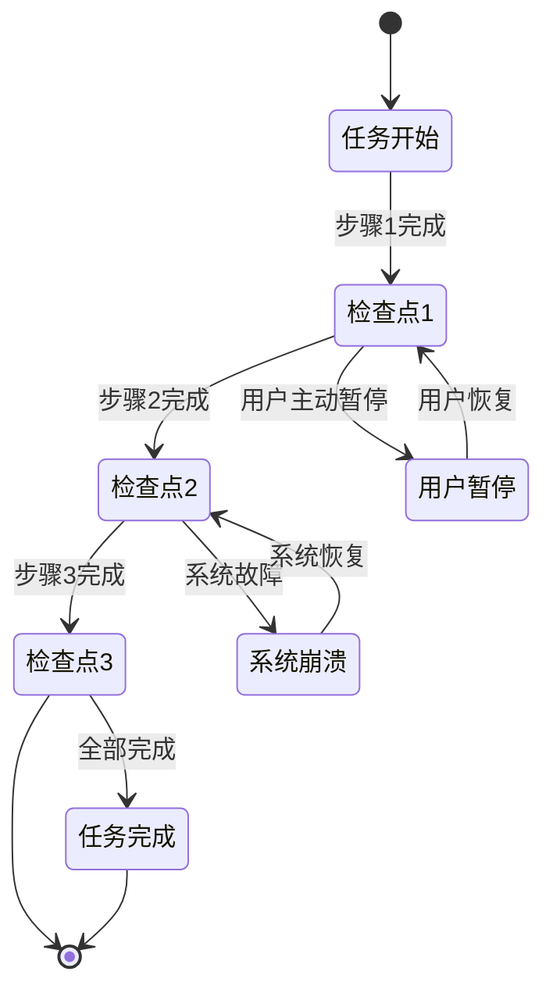
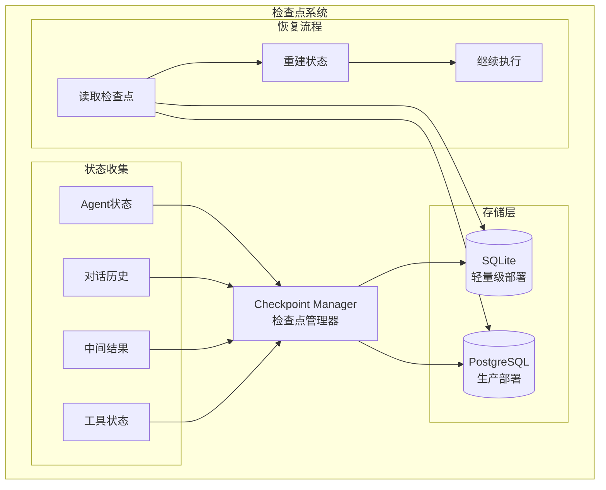
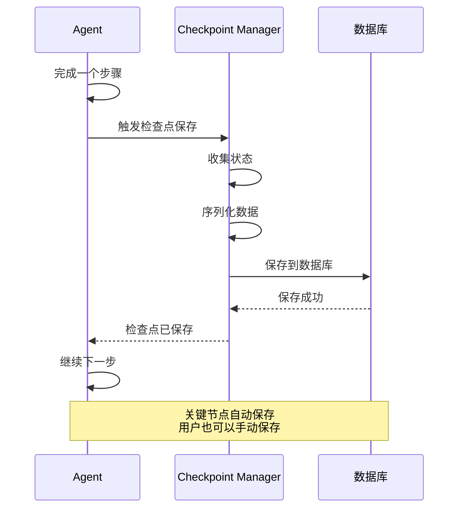
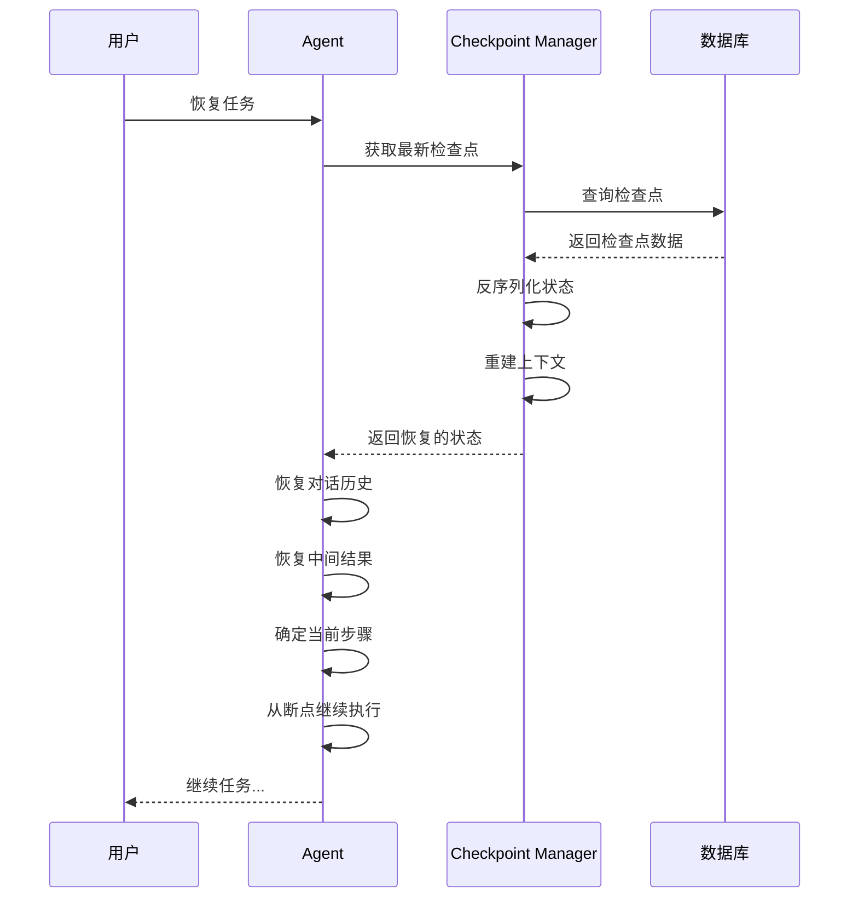

# 【文档15】检查点与状态管理 —— 如何实现"暂停/恢复"

## 1. 五分钟速览

**这篇文档解决什么问题？**

如果你想了解：
- 什么是检查点（Checkpoint）？
- 为什么需要检查点机制？
- 状态如何存储和恢复？
- DeerFlow的检查点如何设计？

那么这篇文档给你**检查点系统的完整认知**。

**阅读后你将获得：**
- 检查点的核心概念和价值
- 状态存储的工作原理
- 暂停/恢复的完整流程
- 面试时关于检查点问题的精炼回答

---

## 2. 为什么需要检查点？

### 2.1 长时间AI任务的挑战

```
用户："帮我深入研究量子计算，并生成一份完整的报告"

Agent任务分解：
1. 搜索相关资料（5分钟）
2. 分析技术文档（10分钟）
3. 研究最新进展（10分钟）
4. 整理数据（5分钟）
5. 撰写报告（15分钟）

总时间：约45分钟

问题：
🔴 用户中途要离开，能否暂停？
🔴 系统崩溃，45分钟白干了？
🔴 想看看当前进度，怎么办？
🔴 想修改某个步骤，怎么做？
```

### 2.2 检查点的解决方案

```
检查点 = 执行状态的快照

就像游戏存档：
→ 打到第5关，存个档
→ 即使退出，下次可以继续
→ 不用从头开始

DeerFlow中的检查点：
→ 每个关键步骤完成后保存状态
→ 可以暂停，下次从检查点恢复
→ 系统崩溃也不丢失进度
```

---

## 3. 检查点的核心概念

### 3.1 什么是检查点？

```
检查点包含的信息：

1. 执行状态
   → 当前执行到哪一步
   → 哪些步骤已完成
   → 哪些步骤待执行

2. 上下文数据
   → Agent的对话历史
   → 中间计算结果
   → 工具调用结果

3. 元数据
   → 创建时间
   → 任务ID
   → 用户ID

类比：
检查点 = 游戏存档
→ 记录你在哪一关
→ 记录你的装备、血量
→ 记录你已经完成的事情
```

### 3.2 检查点的生命周期



---

## 4. DeerFlow的检查点系统

### 4.1 系统架构



### 4.2 检查点的数据结构

```json
// 检查点的概念结构
{
  "checkpoint_id": "ckpt_123456",
  "thread_id": "thread_789",
  "agent_id": "agent_001",
  "timestamp": "2026-04-01T10:30:00Z",

  "execution_state": {
    "current_step": "analyze_documents",
    "completed_steps": ["search", "fetch_docs"],
    "pending_steps": ["analyze", "write_report"]
  },

  "context": {
    "messages": [
      {"role": "user", "content": "帮我研究量子计算"},
      {"role": "assistant", "content": "好的，我先搜索..."}
    ],
    "intermediate_results": {
      "search_results": [...],
      "fetched_docs": [...]
    }
  },

  "metadata": {
    "created_at": "2026-04-01T10:00:00Z",
    "updated_at": "2026-04-01T10:30:00Z",
    "version": "1.0"
  }
}
```

---

## 5. 检查点的保存流程

### 5.1 自动保存机制



### 5.2 什么时候保存检查点？

```
自动保存时机：
1. 完成一个主要步骤
   → 搜索完成
   → 分析完成
   → 生成完成

2. 工具调用前后
   → 调用前保存（失败可以回滚）
   → 调用后保存（记录结果）

3. 定时保存
   → 每N分钟保存一次
   → 防止长时间没有检查点

4. 状态变化时
   → Agent状态改变
   → 子代理创建/销毁
```

### 5.3 增量保存 vs 全量保存

```
全量保存：
→ 每次保存完整状态
→ 优点：简单，恢复时直接用
→ 缺点：存储开销大

增量保存：
→ 只保存变化的部分
→ 优点：存储效率高
→ 缺点：恢复时需要合并

DeerFlow采用：
→ 混合策略
→ 小状态全量保存
→ 大数据增量保存
→ 如：对话历史全量，搜索结果增量
```

---

## 6. 检查点的恢复流程

### 6.1 恢复步骤



### 6.2 恢复时需要注意的问题

```
1. 时间敏感性
   → 检查点是旧的状态
   → 外部环境可能已变化
   → 解决：标记检查点时间，提示用户

2. 资源可用性
   → 之前可用的资源可能不可用了
   → 如：API密钥过期、文件被删除
   → 解决：验证资源，失败时提示

3. 一致性
   → 确保状态完整恢复
   → 避免部分恢复导致错误
   → 解决：使用事务，原子操作

4. 版本兼容
   → 系统更新后旧检查点可能不兼容
   → 解决：版本号检查，升级或废弃
```

---

## 7. 状态存储的选择

### 7.1 SQLite vs PostgreSQL

| 维度 | SQLite | PostgreSQL |
|------|--------|------------|
| **部署** | 零配置，嵌入式 | 需要独立服务 |
| **并发** | 写入并发差 | 高并发支持好 |
| **容量** | 适合小规模 | 适合大规模 |
| **性能** | 读快，写慢 | 读写都快 |
| **备份** | 文件复制 | 需要专门工具 |
| **适用场景** | 开发、小规模部署 | 生产、大规模部署 |

### 7.2 DeerFlow的存储策略

```
开发环境：
→ 使用SQLite
→ 零配置，快速启动
→ 适合单用户、低并发

生产环境：
→ 使用PostgreSQL
→ 高并发支持
→ 数据安全保证
→ 便于备份和恢复

配置切换：
→ 只需修改配置文件
→ 代码层面兼容
→ 无缝切换
```

---

## 8. 设计思想

### 8.1 为什么检查点很重要？

```
1. 用户体验
   → 长任务可以暂停
   → 不用担心系统崩溃
   → 随时查看进度

2. 资源效率
   → 不用从头开始
   → 节省计算资源
   → 节省API调用成本

3. 调试能力
   → 可以检查某个时间点的状态
   → 便于问题定位
   → 便于性能分析

4. 容错能力
   → 系统崩溃不丢失进度
   → 自动恢复
   → 提高可靠性
```

### 8.2 检查点的性能权衡

```
问题：频繁保存检查点影响性能

策略：
1. 选择合适的保存频率
   → 关键步骤必须保存
   → 简单步骤可以跳过
   → 平衡安全和性能

2. 异步保存
   → 不阻塞主流程
   → 后台异步写入
   → 失败时重试

3. 增量保存
   → 只保存变化
   → 减少I/O开销
   → 提高性能

4. 压缩存储
   → 压缩状态数据
   → 减少存储空间
   → 加快传输速度
```

---

## 9. 面试要点

### Q1: 什么是检查点机制？为什么需要？

**参考回答**：
```
检查点是执行状态的快照，用于保存任务的中间状态。

为什么需要：

1. 长任务支持
   → AI任务可能执行很久
   → 用户可能需要暂停
   → 检查点允许暂停后恢复

2. 容错能力
   → 系统可能崩溃
   → 检查点可以恢复
   → 不丢失进度

3. 用户体验
   → 随时查看进度
   → 可以修改中间步骤
   → 不用担心中断

4. 资源效率
   → 不用从头开始
   → 节省计算和API成本

就像游戏存档，可以随时暂停和继续。
```

### Q2: 检查点保存哪些信息？

**参考回答**：
```
检查点保存的信息包括：

1. 执行状态
   → 当前执行到哪一步
   → 已完成和待完成的步骤
   → Agent和子代理的状态

2. 上下文数据
   → 对话历史
   → 中间计算结果
   → 工具调用结果

3. 元数据
   → 检查点ID和时间戳
   → 任务和用户ID
   → 版本信息

这些信息足以完整恢复任务的执行状态。
```

### Q3: 检查点如何保存和恢复？

**参考回答**：
```
保存流程：
1. 完成关键步骤后触发
2. 收集当前执行状态
3. 序列化数据
4. 写入数据库（SQLite/PostgreSQL）

恢复流程：
1. 从数据库读取检查点
2. 反序列化数据
3. 重建Agent状态
4. 恢复对话上下文
5. 从断点继续执行

关键点是保证状态的一致性和完整性。
```

### Q4: SQLite和PostgreSQL怎么选择？

**参考回答**：
```
选择依据：

SQLite：
→ 零配置，嵌入式
→ 适合开发和小规模部署
→ 单用户、低并发场景

PostgreSQL：
→ 独立服务，需要配置
→ 适合生产和大规模部署
→ 多用户、高并发场景

DeerFlow支持两种：
→ 开发默认用SQLite
→ 生产推荐PostgreSQL
→ 配置切换，代码兼容

这是根据场景选择合适工具的典型例子。
```

### Q5: 检查点机制有什么挑战？

**参考回答**：
```
主要挑战：

1. 性能问题
   → 频繁保存影响性能
   → 解决：异步保存、增量保存

2. 状态一致性
   → 部分保存导致不一致
   → 解决：事务、原子操作

3. 版本兼容
   → 系统更新后旧检查点可能不兼容
   → 解决：版本号检查

4. 存储空间
   → 大量检查点占用空间
   → 解决：定期清理、压缩

5. 时间敏感性
   → 旧检查点可能过时
   → 解决：时间戳、用户提示

需要在功能、性能、可靠性之间平衡。
```

---

## 10. 延伸思考

### 10.1 检查点的清理策略

```
问题：检查点越来越多，如何清理？

策略：
1. 保留策略
   → 只保留最近N个
   → 只保留N天内的
   → 重要的永久保留

2. 压缩归档
   → 旧的检查点压缩
   → 减少存储空间

3. 用户标记
   → 用户可以标记重要检查点
   → 标记的不删除

4. 自动清理
   → 定时任务清理
   → 释放空间
```

### 10.2 分布式检查点

```
问题：分布式部署时，检查点存在哪？

挑战：
→ 多台机器状态不同
→ 需要共享存储
→ 需要分布式锁

解决方案：
1. 共享数据库
   → 所有机器连接同一个数据库
   → 检查点集中存储

2. 分布式存储
   → 使用分布式数据库
   → 如CockroachDB

3. 检查点同步
   → 主节点保存
   → 同步到从节点
```

### 10.3 检查点的可视化

```
问题：如何让用户看到检查点？

解决方案：
1. 时间线展示
   → 显示所有检查点
   → 标注时间戳和步骤

2. 状态对比
   → 对比不同检查点的状态
   → 看到变化

3. 恢复预览
   → 恢复前显示状态
   → 确认后再恢复

4. 进度展示
   → 显示任务进度
   → 显示检查点位置
```

---

## 11. 思考问题

### 11.1 理解检验

1. 什么是检查点？为什么需要？
2. 检查点保存哪些信息？
3. SQLite和PostgreSQL如何选择？

### 11.2 设计思考

4. 如何平衡检查点的保存频率和性能？
5. 如何处理检查点的版本兼容问题？
6. 如何实现检查点的"回滚"（恢复到之前的检查点）？

### 11.3 场景应用

7. 用户暂停任务后，修改了之前的输入，恢复时应该怎么处理？
8. 系统崩溃后，如何自动恢复到最近的检查点？
9. 如何实现检查点的"分支"（从同一个检查点走不同路径）？

### 11.4 深入探讨

10. 检查点和数据库事务有什么区别？
11. 如何实现检查点的"增量恢复"（只恢复变化的部分）？
12. 检查点机制在分布式系统中如何实现？

---

## 12. 本篇小结

**核心要点**：

1. **检查点**：执行状态的快照，像游戏存档
2. **保存时机**：关键步骤完成后、工具调用前后、定时保存
3. **恢复流程**：读取检查点 → 反序列化 → 重建状态 → 继续执行
4. **存储选择**：开发用SQLite，生产用PostgreSQL
5. **设计价值**：用户体验、资源效率、容错能力、调试支持

**阶段二（核心概念）完结**！

下一篇我们将进入**阶段三：设计模式提炼**，深入理解DeerFlow用到的设计模式和架构权衡。

---

## 13. 文档衔接

**本篇完结**，下一篇将解析：【16-DeerFlow用到的设计模式】

**衔接说明**：
- 15篇解决了"状态如何持久化"的问题
- 16篇将解决"系统如何设计"的问题
- 设计模式是架构设计的精华
- 理解设计模式才能理解DeerFlow的设计思想
