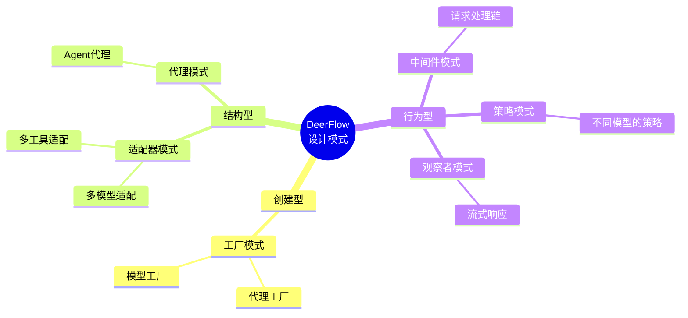

# 【文档16】DeerFlow用到的设计模式

## 1. 五分钟速览

**这篇文档解决什么问题？**

如果你想了解：
- DeerFlow用了哪些设计模式？
- 为什么用这些模式？
- 每个模式在DeerFlow中如何应用？
- 如何在自己的项目中复用这些模式？

那么这篇文档给你**设计模式的完整认知**。

**阅读后你将获得：**
- DeerFlow使用的6大核心设计模式
- 每个模式的应用场景和设计考量
- 模式的优缺点分析
- 面试时关于设计模式的精炼回答

---

## 2. 为什么学习设计模式？

```
设计模式 = 前人总结的"最佳实践"

价值：
1. 沟通效率
   → 说"工厂模式"，大家都懂
   → 不用从头解释

2. 避免陷阱
   → 前人踩过的坑，不用再踩
   → 直接用验证过的方案

3. 提高质量
   → 设计模式是经过验证的
   → 比自己想的好

4. 代码可读性
   → 熟悉模式的人容易理解
   → 降低维护成本
```

---

## 3. DeerFlow的6大核心设计模式

### 3.1 模式总览



---

## 4. 工厂模式（Factory Pattern）

### 4.1 什么是工厂模式？

```
工厂模式 = 用"工厂"创建对象，而不是直接new

好处：
1. 解耦：调用者不需要知道具体类
2. 灵活：可以动态决定创建什么
3. 复用：创建逻辑集中管理
```

### 4.2 DeerFlow中的应用：代理工厂

```
场景：根据配置创建不同的Agent

不用工厂：
agent = LeadAgent(model="gpt-4", tools=[...])
agent = LeadAgent(model="claude", tools=[...])
每次都要重复创建逻辑

用工厂：
agent = agent_factory.create(config)
工厂根据config决定创建什么

优势：
→ 创建逻辑集中
→ 配置驱动
→ 易于扩展新类型
```

### 4.3 代码示意

```python
# 工厂模式的概念结构
class AgentFactory:
    def create(self, config):
        # 根据配置决定创建什么
        if config.type == "lead":
            return LeadAgent(config)
        elif config.type == "sub":
            return SubAgent(config)
        elif config.type == "specialist":
            return SpecialistAgent(config)

# 使用
factory = AgentFactory()
agent = factory.create(config)  # 不需要知道具体类
```

### 4.4 为什么用工厂模式？

```
1. 配置驱动
   → 通过配置文件决定创建什么
   → 不需要改代码

2. 解耦创建逻辑
   → 调用者不需要知道如何创建
   → 只需要接口

3. 易于扩展
   → 新增Agent类型，只需加一个分支
   → 不影响已有代码

4. 复杂创建逻辑
   → Agent创建涉及多个步骤
   → 工厂封装这些步骤
```

---

## 5. 适配器模式（Adapter Pattern）

### 5.1 什么是适配器模式？

```
适配器模式 = 让不兼容的接口可以一起工作

类比：
→ 电脑有USB接口
→ 手机有Type-C接口
→ 用转接线（适配器）连接

优势：
1. 复用现有代码
2. 不需要修改原接口
3. 灵活切换实现
```

### 5.2 DeerFlow中的应用：多模型适配

```
问题：不同大模型的API不同

OpenAI:
response = openai.chat.completions.create(
    model="gpt-4",
    messages=[...]
)

Anthropic:
response = anthropic.messages.create(
    model="claude-3-sonnet",
    messages=[...]
)

接口不一样，如何统一？
```

**解决方案：模型适配器**

```python
# 统一接口
class BaseModel:
    def chat(self, messages, **kwargs):
        pass

# OpenAI适配器
class OpenAIAdapter(BaseModel):
    def chat(self, messages, **kwargs):
        response = openai.chat.completions.create(...)
        return self._format_response(response)

# Anthropic适配器
class AnthropicAdapter(BaseModel):
    def chat(self, messages, **kwargs):
        response = anthropic.messages.create(...)
        return self._format_response(response)

# 使用
model = ModelFactory.create("gpt-4")  # 返回OpenAIAdapter
response = model.chat(messages)  # 统一接口
```

### 5.3 为什么用适配器模式？

```
1. 统一接口
   → 上层代码不需要关心具体模型
   → 切换模型只需改配置

2. 易于扩展
   → 新增模型，写个适配器
   → 不影响已有代码

3. 隔离变化
   → 模型API变化，只改适配器
   → 上层代码不受影响

4. 测试友好
   → 可以Mock适配器测试
   → 不依赖真实API
```

---

## 6. 中间件模式（Middleware Pattern）

### 6.1 什么是中间件模式？

```
中间件模式 = 请求经过一系列处理，每个处理是一个中间件

类比：工厂流水线
→ 原材料 → 工序1 → 工序2 → 工序3 → 成品
→ 请求 → 中间件1 → 中间件2 → 中间件3 → 响应

特点：
1. 职责单一：每个中间件做一件事
2. 可插拔：可以灵活添加/删除
3. 顺序可控：可以调整执行顺序
```

### 6.2 DeerFlow中的应用：请求处理链

```
DeerFlow的中间件链：
请求 → ThreadData → Uploads → Sandbox → ... → Agent

每个中间件：
→ 处理请求的一个方面
→ 可以决定是否继续传递
→ 可以修改请求/响应
```

### 6.3 为什么用中间件模式？

```
1. 职责分离
   → 每个中间件职责单一
   → 代码清晰，易于维护

2. 灵活组合
   → 需要就加，不需要就删
   → 可以动态调整

3. 横切关注点
   → 认证、日志、监控等
   → 不污染业务逻辑

4. 易于测试
   → 每个中间件独立测试
   → 可以Mock其他中间件
```

---

## 7. 策略模式（Strategy Pattern）

### 7.1 什么是策略模式？

```
策略模式 = 定义一系列算法，可以相互替换

特点：
1. 算法可以互相替换
2. 算法独立变化
3. 运行时选择策略
```

### 7.2 DeerFlow中的应用：不同模型的策略

```
场景：根据任务选择不同的模型

简单任务 → 用便宜模型（GPT-3.5）
复杂任务 → 用强大模型（GPT-4）
本地任务 → 用本地模型

策略模式实现：
class ModelStrategy:
    def select_model(self, task):
        if task.complexity == "low":
            return CheapModel()
        elif task.complexity == "high":
            return PowerfulModel()
        else:
            return LocalModel()
```

### 7.3 为什么用策略模式？

```
1. 算法可替换
   → 不同策略可以互相替换
   → 不影响客户端

2. 运行时选择
   → 根据情况动态选择
   → 不需要硬编码

3. 避免if-else地狱
   → 每个策略独立类
   → 代码清晰

4. 易于扩展
   → 新增策略，不影响现有
```

---

## 8. 观察者模式（Observer Pattern）

### 8.1 什么是观察者模式？

```
观察者模式 = 一对多依赖，当对象改变时，依赖者自动收到通知

类比：
→ YouTube订阅
→ UP主更新，订阅者自动收到通知

特点：
1. 松耦合
2. 一对多通信
3. 事件驱动
```

### 8.2 DeerFlow中的应用：流式响应

```
场景：Agent生成回答时，实时推送给前端

传统方式：
agent.generate()  # 等待全部完成
return response  # 一次性返回

观察者模式：
class EventEmitter:
    def on(self, event, callback):
        # 注册监听
    def emit(self, event, data):
        # 触发事件

# Agent生成时推送
agent.on("token", lambda token: send_to_frontend(token))
agent.on("done", lambda: close_connection())
```

### 8.3 为什么用观察者模式？

```
1. 实时推送
   → 不用等待全部完成
   → 逐token推送

2. 松耦合
   → Agent不需要知道前端
   → 只需要触发事件

3. 多订阅者
   → 多个地方可以监听
   → 如日志、监控、前端

4. 异步处理
   → 事件处理是异步的
   → 不阻塞主流程
```

---

## 9. 代理模式（Proxy Pattern）

### 9.1 什么是代理模式？

```
代理模式 = 为对象提供代理，控制访问

类比：
→ 明星（真实对象）
→ 经纪人（代理）
→ 粉丝要找明星，先找经纪人

代理的作用：
→ 控制访问
→ 延迟加载
→ 远程调用
```

### 9.2 DeerFlow中的应用：Agent代理

```
场景：前端调用后端Agent

直接调用：
agent = LeadAgent()  # 后端创建
agent.run()  # 前端无法直接调用

代理模式：
class AgentProxy:
    def run(self, query):
        # 通过API调用后端
        response = api.call("/agent/run", {"query": query})
        return response

# 前端使用
proxy = AgentProxy()
proxy.run("帮我搜索")  # 实际调用后端
```

### 9.3 为什么用代理模式？

```
1. 远程访问
   → 前端无法直接访问后端对象
   → 代理转发请求

2. 访问控制
   → 代理可以控制权限
   → 拒绝非法访问

3. 延迟加载
   → 真实对象按需创建
   → 节省资源

4. 缓存
   → 代理可以缓存结果
   → 提高性能
```

---

## 10. 设计模式对比总结

| 模式 | 问题 | 解决方案 | DeerFlow应用 |
|------|------|----------|-------------|
| **工厂** | 如何创建对象？ | 用工厂统一创建 | 代理工厂、模型工厂 |
| **适配器** | 接口不兼容？ | 加适配器转换 | 多模型适配、多工具适配 |
| **中间件** | 如何处理请求？ | 经过处理链 | 请求处理中间件 |
| **策略** | 如何选择算法？ | 封装成策略 | 模型选择策略 |
| **观察者** | 如何通知变化？ | 事件订阅发布 | 流式响应推送 |
| **代理** | 如何控制访问？ | 加代理层 | Agent远程调用 |

---

## 11. 面试要点

### Q1: DeerFlow用了哪些设计模式？

**参考回答**：
```
DeerFlow主要用了6种设计模式：

1. 工厂模式：代理工厂、模型工厂
   → 统一创建逻辑，配置驱动

2. 适配器模式：多模型适配
   → 统一不同模型的接口

3. 中间件模式：请求处理链
   → 职责分离，灵活组合

4. 策略模式：模型选择策略
   → 根据任务选择不同模型

5. 观察者模式：流式响应
   → 实时推送生成内容

6. 代理模式：远程调用
   → 前端通过代理访问后端

这些模式让系统更灵活、可扩展、易维护。
```

### Q2: 为什么代理创建用工厂模式？

**参考回答**：
```
工厂模式的优势：

1. 配置驱动
   → 通过配置决定创建什么
   → 不需要硬编码

2. 解耦创建逻辑
   → 调用者不需要知道细节
   → 只需要接口

3. 易于扩展
   → 新增类型，工厂加个分支
   → 不影响已有代码

4. 复杂创建逻辑
   → Agent创建涉及多个步骤
   → 工厂封装这些步骤

如果不使用工厂，每次创建都要重复代码，难以维护。
```

### Q3: 适配器模式在DeerFlow中如何应用？

**参考回答**：
```
适配器模式主要在多模型适配中应用：

问题：
→ OpenAI、Anthropic、本地模型接口不同
→ 上层代码不想关心这些差异

解决：
→ 定义统一的模型接口
→ 每个模型写一个适配器
→ 适配器转换具体API到统一接口

好处：
→ 切换模型只需改配置
→ 新增模型只需加适配器
→ 上层代码不变

这是"依赖倒置原则"的体现。
```

### Q4: 中间件模式的优势是什么？

**参考回答**：
```
中间件模式的核心优势：

1. 职责分离
   → 每个中间件只做一件事
   → 代码清晰，易于理解

2. 灵活组合
   → 需要就加，不需要就删
   → 可以动态配置

3. 横切关注点
   → 认证、日志、监控等
   → 不污染业务逻辑

4. 易于测试
   → 每个中间件独立测试
   → 可以Mock其他中间件

5. 顺序可控
   → 可以调整中间件顺序
   → 适应不同需求

这是"管道模式"在请求处理中的应用。
```

### Q5: 设计模式有什么缺点？

**参考回答**：
```
设计模式的缺点：

1. 增加复杂度
   → 简单问题用设计模式，过度设计
   → 增加类的数量

2. 学习成本
   → 需要理解模式
   → 新人可能不熟悉

3. 性能开销
   → 多层封装有性能损失
   → 如适配器、代理

4. 过度使用
   → 为了用模式而用模式
   → 反而降低代码质量

结论：
→ 设计模式是工具，不是目标
→ 根据实际需求选择
→ 不要过度设计
```

---

## 12. 延伸思考

### 12.1 设计模式的滥用

```
问题：为了用模式而用模式

例子：
→ 简单的if-else就能解决，非要用策略模式
→ 只有一个模型，非要用适配器模式

后果：
→ 代码更复杂
→ 类的数量爆炸
→ 难以理解和维护

原则：
→ 设计模式是工具，不是目标
→ 简单问题用简单方案
→ 复杂问题才用设计模式
```

### 12.2 设计模式的组合

```
DeerFlow中的模式组合：

工厂 + 适配器：
→ 工厂创建适配器
→ 适配器统一接口

中间件 + 观察者：
→ 中间件处理请求
→ 观察者推送事件

代理 + 策略：
→ 代理远程调用
→ 策略选择实现

模式可以组合使用，解决复杂问题。
```

### 12.3 设计模式的演进

```
项目初期：
→ 不需要太多设计模式
→ 简单直接

项目成长：
→ 逐渐引入设计模式
→ 解决复杂度问题

项目成熟：
→ 设计模式稳定
→ 形成架构风格

不要一开始就追求完美模式，随项目演进。
```

---

## 13. 思考问题

### 13.1 理解检验

1. DeerFlow用了哪些设计模式？
2. 工厂模式解决什么问题？
3. 中间件模式的优势是什么？

### 13.2 设计思考

4. 什么情况下应该用设计模式？
5. 如何避免设计模式的滥用？
6. 设计模式增加了复杂度，为什么还要用？

### 13.3 场景应用

7. 如果要支持新的IM渠道，应该用什么模式？
8. 如果要实现"A/B测试"不同模型，应该用什么模式？
9. 如果要实现"请求限流"，应该用什么模式？

### 13.4 深入探讨

10. 设计模式是"银弹"吗？有什么局限性？
11. 如何判断是否需要引入设计模式？
12. 设计模式和"过度设计"的界限在哪里？

---

## 14. 本篇小结

**核心要点**：

1. **工厂模式**：统一创建逻辑，配置驱动
2. **适配器模式**：统一接口，隔离变化
3. **中间件模式**：职责分离，灵活组合
4. **策略模式**：算法可替换，运行时选择
5. **观察者模式**：事件驱动，松耦合
6. **代理模式**：控制访问，远程调用

**设计模式的价值**：
- 提高代码质量
- 便于沟通和理解
- 避免重复造轮子
- 但不要过度使用

下一篇我们将深入**架构设计权衡**，看看DeerFlow在设计过程中做了哪些取舍。

---

## 15. 文档衔接

**本篇完结**，下一篇将解析：【17-架构设计权衡：没有完美的架构】

**衔接说明**：
- 16篇解决了"用什么模式"的问题
- 17篇将解决"为什么这样设计"的问题
- 设计权衡是架构设计的核心
- 理解权衡才能理解架构决策背后的逻辑
