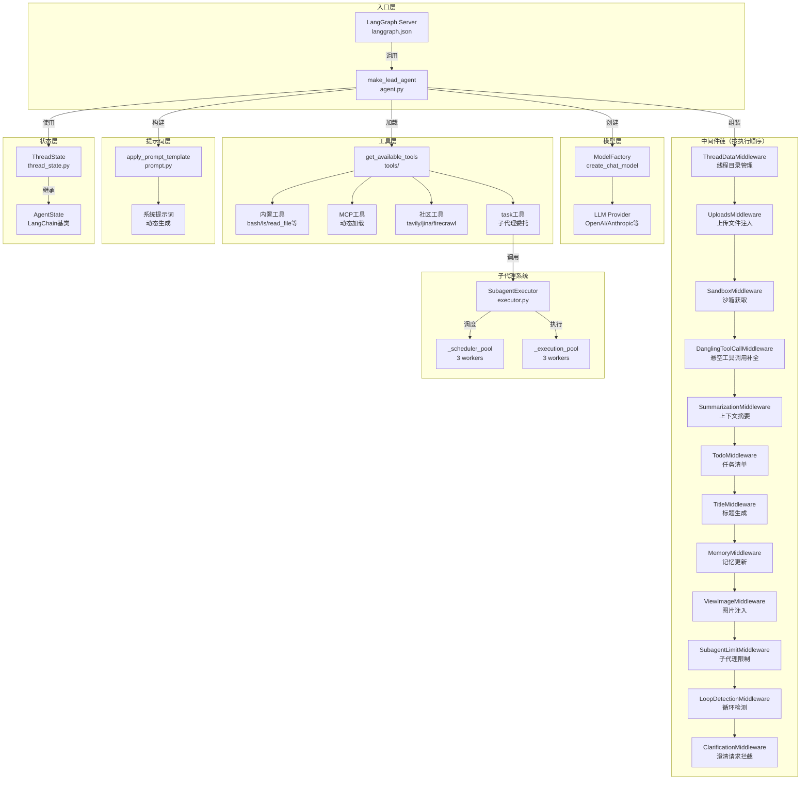

# 【文档16】代理系统深度解析

## 1. 模块全局定位

- **所属项目**: deer-flow
- **层级位置**: `backend/packages/harness/deerflow/agents/`
- **核心作用**: 构建AI代理的核心执行引擎，包括lead_agent构建、中间件链、工具系统、状态管理和子代理系统
- **业务价值**: 提供可扩展、可配置的AI代理框架，支持多轮对话、工具调用、记忆管理、任务委托等核心能力
- **设计初衷**: 基于LangGraph构建模块化代理系统，通过中间件模式实现关注点分离，每个中间件负责特定功能，整体可组合、可扩展

## 2. 依赖&调用链路 Mermaid图



### 图表设计解读

该链路图展示了DeerFlow代理系统的完整架构，核心设计考量如下：

1. **中间件链式执行**: 中间件按严格顺序执行，每个中间件在特定时机（before_agent/after_model等）介入，实现关注点分离。

2. **分层职责清晰**:
   - **入口层**: LangGraph Server通过`langgraph.json`注册`make_lead_agent`作为工厂函数
   - **模型层**: 动态创建LLM实例，支持thinking/vision等特性
   - **工具层**: 多源工具汇聚（内置/MCP/社区/子代理）
   - **中间件层**: 12个中间件处理不同横切关注点
   - **提示词层**: 动态生成系统提示词，注入技能/记忆/子代理配置
   - **状态层**: ThreadState扩展AgentState，定义代理状态结构
   - **子代理层**: 双线程池实现后台任务执行

3. **执行顺序保证**: 中间件按注释声明的顺序执行，因为某些中间件依赖前面中间件的状态（如ThreadDataMiddleware必须在SandboxMiddleware之前）。

4. **可扩展设计**: 添加新功能只需：
   - 新增中间件并插入链中合适位置
   - 新增工具并注册到工具系统
   - 修改提示词模板添加新指令

## 3. 核心目录/文件清单

| 文件路径 | 核心职责 | 设计定位 |
|---------|---------|---------|
| `lead_agent/agent.py` | make_lead_agent工厂函数，组装代理 | 代理构建入口，协调模型/工具/中间件/提示词 |
| `lead_agent/prompt.py` | 系统提示词模板和动态生成 | 提示词工程核心，注入技能/记忆/子代理配置 |
| `thread_state.py` | ThreadState状态定义 | 代理状态模式，定义可携带的数据结构 |
| `middlewares/thread_data_middleware.py` | 创建线程数据目录 | 生命周期最早，确保目录可用 |
| `middlewares/uploads_middleware.py` | 注入上传文件信息 | 让模型感知用户上传的文件 |
| `middlewares/sandbox_middleware.py` | 获取沙箱实例 | 隔离执行环境 |
| `middlewares/title_middleware.py` | 自动生成对话标题 | 首轮对话后触发 |
| `middlewares/memory_middleware.py` | 队列记忆更新任务 | 异步更新长期记忆 |
| `middlewares/clarification_middleware.py` | 拦截澄清请求并中断执行 | 用户交互关键点 |
| `subagents/executor.py` | 子代理执行引擎 | 后台任务执行，双线程池调度 |

## 4. 关键源码深度解析

### 4.1 代理构建工厂：`agent.py`

**文件路径**: `/data/deer-flow-main/backend/packages/harness/deerflow/agents/lead_agent/agent.py`

```python
def make_lead_agent(config: RunnableConfig):
    # Lazy import to avoid circular dependency
    from deerflow.tools import get_available_tools
    from deerflow.tools.builtins import setup_agent

    cfg = config.get("configurable", {})

    thinking_enabled = cfg.get("thinking_enabled", True)
    reasoning_effort = cfg.get("reasoning_effort", None)
    requested_model_name: str | None = cfg.get("model_name") or cfg.get("model")
    is_plan_mode = cfg.get("is_plan_mode", False)
    subagent_enabled = cfg.get("subagent_enabled", False)
    max_concurrent_subagents = cfg.get("max_concurrent_subagents", 3)
    is_bootstrap = cfg.get("is_bootstrap", False)
    agent_name = cfg.get("agent_name")

    agent_config = load_agent_config(agent_name) if not is_bootstrap else None
    # Custom agent model or fallback to global/default model resolution
    agent_model_name = agent_config.model if agent_config and agent_config.model else _resolve_model_name()

    # Final model name resolution with request override, then agent config, then global default
    model_name = requested_model_name or agent_model_name

    app_config = get_app_config()
    model_config = app_config.get_model_config(model_name) if model_name else None

    if model_config is None:
        raise ValueError("No chat model could be resolved. Please configure at least one model in config.yaml or provide a valid 'model_name'/'model' in the request.")
    if thinking_enabled and not model_config.supports_thinking:
        logger.warning(f"Thinking mode is enabled but model '{model_name}' does not support it; fallback to non-thinking mode.")
        thinking_enabled = False

    # Inject run metadata for LangSmith trace tagging
    if "metadata" not in config:
        config["metadata"] = {}

    config["metadata"].update(
        {
            "agent_name": agent_name or "default",
            "model_name": model_name or "default",
            "thinking_enabled": thinking_enabled,
            "reasoning_effort": reasoning_effort,
            "is_plan_mode": is_plan_mode,
            "subagent_enabled": subagent_enabled,
        }
    )

    if is_bootstrap:
        # Special bootstrap agent with minimal prompt for initial custom agent creation flow
        return create_agent(
            model=create_chat_model(name=model_name, thinking_enabled=thinking_enabled),
            tools=get_available_tools(model_name=model_name, subagent_enabled=subagent_enabled) + [setup_agent],
            middleware=_build_middlewares(config, model_name=model_name),
            system_prompt=apply_prompt_template(subagent_enabled=subagent_enabled, max_concurrent_subagents=max_concurrent_subagents, available_skills=set(["bootstrap"])),
            state_schema=ThreadState,
        )

    # Default lead agent (unchanged behavior)
    return create_agent(
        model=create_chat_model(name=model_name, thinking_enabled=thinking_enabled, reasoning_effort=reasoning_effort),
        tools=get_available_tools(model_name=model_name, groups=agent_config.tool_groups if agent_config else None, subagent_enabled=subagent_enabled),
        middleware=_build_middlewares(config, model_name=model_name, agent_name=agent_name),
        system_prompt=apply_prompt_template(subagent_enabled=subagent_enabled, max_concurrent_subagents=max_concurrent_subagents, agent_name=agent_name),
        state_schema=ThreadState,
    )
```

#### 设计考量解读

1. **三层模型解析**: 模型名称解析遵循优先级：
   - **请求参数**: `model_name`/`model`（请求时的最高优先级）
   - **代理配置**: `agent_config.model`（自定义代理的专属模型）
   - **全局默认**: `config.yaml`中第一个模型（兜底）

2. **Thinking模式降级**: 当用户启用thinking但模型不支持时，自动降级到非thinking模式，而不是报错。这提供了更好的用户体验，同时通过warning日志告知用户。

3. **Bootstrap特殊模式**: `is_bootstrap=True`时创建轻量级代理，只包含`setup_agent`工具和最小提示词。这是用于"冷启动"场景——当用户首次创建自定义代理时。

4. **元数据注入**: 将运行时配置注入`metadata`字段，用于LangSmith追踪。这允许在LangSmith UI中按agent_name/model_name等维度过滤trace。

5. **工具组过滤**: 自定义代理可以指定`tool_groups`限制可用工具范围，实现"专用代理"（如只懂代码的代理）。

---

### 4.2 中间件链构建：`_build_middlewares`

**文件路径**: `/data/deer-flow-main/backend/packages/harness/deerflow/agents/lead_agent/agent.py`

```python
# ThreadDataMiddleware must be before SandboxMiddleware to ensure thread_id is available
# UploadsMiddleware should be after ThreadDataMiddleware to access thread_id
# DanglingToolCallMiddleware patches missing ToolMessages before model sees the history
# SummarizationMiddleware should be early to reduce context before other processing
# TodoListMiddleware should be before ClarificationMiddleware to allow todo management
# TitleMiddleware generates title after first exchange
# MemoryMiddleware queues conversation for memory update (after TitleMiddleware)
# ViewImageMiddleware should be before ClarificationMiddleware to inject image details before LLM
# ToolErrorHandlingMiddleware should be before ClarificationMiddleware to convert tool exceptions to ToolMessages
# ClarificationMiddleware should be last to intercept clarification requests after model calls
def _build_middlewares(config: RunnableConfig, model_name: str | None, agent_name: str | None = None, custom_middlewares: list[AgentMiddleware] | None = None):
    """Build middleware chain based on runtime configuration.

    Args:
        config: Runtime configuration containing configurable options like is_plan_mode.
        agent_name: If provided, MemoryMiddleware will use per-agent memory storage.
        custom_middlewares: Optional list of custom middlewares to inject into the chain.

    Returns:
        List of middleware instances.
    """
    middlewares = build_lead_runtime_middlewares(lazy_init=True)

    # Add summarization middleware if enabled
    summarization_middleware = _create_summarization_middleware()
    if summarization_middleware is not None:
        middlewares.append(summarization_middleware)

    # Add TodoList middleware if plan mode is enabled
    is_plan_mode = config.get("configurable", {}).get("is_plan_mode", False)
    todo_list_middleware = _create_todo_list_middleware(is_plan_mode)
    if todo_list_middleware is not None:
        middlewares.append(todo_list_middleware)

    # Add TokenUsageMiddleware when token_usage tracking is enabled
    if get_app_config().token_usage.enabled:
        middlewares.append(TokenUsageMiddleware())

    # Add TitleMiddleware
    middlewares.append(TitleMiddleware())

    # Add MemoryMiddleware (after TitleMiddleware)
    middlewares.append(MemoryMiddleware(agent_name=agent_name))

    # Add ViewImageMiddleware only if the current model supports vision.
    # Use the resolved runtime model_name from make_lead_agent to avoid stale config values.
    app_config = get_app_config()
    model_config = app_config.get_model_config(model_name) if model_name else None
    if model_config is not None and model_config.supports_vision:
        middlewares.append(ViewImageMiddleware())

    # Add DeferredToolFilterMiddleware to hide deferred tool schemas from model binding
    if app_config.tool_search.enabled:
        from deerflow.agents.middlewares.deferred_tool_filter_middleware import DeferredToolFilterMiddleware

        middlewares.append(DeferredToolFilterMiddleware())

    # Add SubagentLimitMiddleware to truncate excess parallel task calls
    subagent_enabled = config.get("configurable", {}).get("subagent_enabled", False)
    if subagent_enabled:
        max_concurrent_subagents = config.get("configurable", {}).get("max_concurrent_subagents", 3)
        middlewares.append(SubagentLimitMiddleware(max_concurrent=max_concurrent_subagents))

    # LoopDetectionMiddleware — detect and break repetitive tool call loops
    middlewares.append(LoopDetectionMiddleware())

    # Inject custom middlewares before ClarificationMiddleware
    if custom_middlewares:
        middlewares.extend(custom_middlewares)

    # ClarificationMiddleware should always be last
    middlewares.append(ClarificationMiddleware())
    return middlewares
```

#### 设计考量解读

1. **顺序依赖明确**: 每个中间件的位置都有精确理由：
   - **ThreadDataMiddleware最先**: 其他中间件依赖thread_id
   - **UploadsMiddleware在ThreadDataMiddleware之后**: 需要thread_id解析上传目录
   - **DanglingToolCallMiddleware在模型前**: 确保模型看到完整的历史
   - **ClarificationMiddleware最后**: 必须拦截所有工具调用后的澄清请求

2. **条件添加**: 不是所有中间件总是被添加：
   - **SummarizationMiddleware**: 只有启用时才添加
   - **TodoMiddleware**: 只有plan_mode时才添加
   - **ViewImageMiddleware**: 只有模型支持vision时才添加
   - **SubagentLimitMiddleware**: 只有subagent_enabled时才添加

3. **自定义中间件注入点**: `custom_middlewares`在ClarificationMiddleware之前注入，允许用户添加自定义逻辑，同时仍然享受澄清拦截。

4. **Lazy初始化**: `build_lead_runtime_middlewares(lazy_init=True)`延迟创建目录，提升性能。

---

### 4.3 状态模式：`thread_state.py`

**文件路径**: `/data/deer-flow-main/backend/packages/harness/deerflow/agents/thread_state.py`

```python
def merge_artifacts(existing: list[str] | None, new: list[str] | None) -> list[str]:
    """Reducer for artifacts list - merges and deduplicates artifacts."""
    if existing is None:
        return new or []
    if new is None:
        return existing
    # Use dict.fromkeys to deduplicate while preserving order
    return list(dict.fromkeys(existing + new))

def merge_viewed_images(existing: dict[str, ViewedImageData] | None, new: dict[str, ViewedImageData] | None) -> dict[str, ViewedImageData]:
    """Reducer for viewed_images dict - merges image dictionaries.

    Special case: If new is an empty dict {}, it clears the existing images.
    This allows middlewares to clear the viewed_images state after processing.
    """
    if existing is None:
        return new or {}
    if new is None:
        return existing
    # Special case: empty dict means clear all viewed images
    if len(new) == 0:
        return {}
    # Merge dictionaries, new values override existing ones for same keys
    return {**existing, **new}

class ThreadState(AgentState):
    sandbox: NotRequired[SandboxState | None]
    thread_data: NotRequired[ThreadDataState | None]
    title: NotRequired[str | None]
    artifacts: Annotated[list[str], merge_artifacts]
    todos: NotRequired[list | None]
    uploaded_files: NotRequired[list[dict] | None]
    viewed_images: Annotated[dict[str, ViewedImageData], merge_viewed_images]  # image_path -> {base64, mime_type}
```

#### 设计考量解读

1. **自定义Reducer**: LangGraph的状态更新默认是覆盖，但某些字段需要合并：
   - **artifacts**: 使用`merge_artifacts`去重合并，避免重复添加文件
   - **viewed_images**: 使用`merge_viewed_images`合并，特殊处理空字典（清空）

2. **NotRequired**: 所有字段标记为`NotRequired`，允许状态渐进式构建，不需要一次性提供所有字段。

3. **继承AgentState**: ThreadState继承LangChain的AgentState，自动获得messages字段，保持兼容性。

4. **类型注解**: 使用TypedDict提供类型提示，IDE可以自动补全，减少错误。

5. **为什么需要自定义Reducer？**
   - 默认行为：`state["artifacts"] = ["a", "b"]`会完全覆盖
   - 自定义行为：`state["artifacts"] += ["a", "b"]`会去重合并
   - 这在中间件链中尤其重要，因为多个中间件可能更新同一个字段

---

### 4.4 标题生成中间件：`title_middleware.py`

**文件路径**: `/data/deer-flow-main/backend/packages/harness/deerflow/agents/middlewares/title_middleware.py`

```python
class TitleMiddleware(AgentMiddleware[TitleMiddlewareState]):
    """Automatically generate a title for the thread after the first user message."""

    def _should_generate_title(self, state: TitleMiddlewareState) -> bool:
        """Check if we should generate a title for this thread."""
        config = get_title_config()
        if not config.enabled:
            return False

        # Check if thread already has a title in state
        if state.get("title"):
            return False

        # Check if this is the first turn (has at least one user message and one assistant response)
        messages = state.get("messages", [])
        if len(messages) < 2:
            return False

        # Count user and assistant messages
        user_messages = [m for m in messages if m.type == "human"]
        assistant_messages = [m for m in messages if m.type == "ai"]

        # Generate title after first complete exchange
        return len(user_messages) == 1 and len(assistant_messages) >= 1

    @override
    async def aafter_model(self, state: TitleMiddlewareState, runtime: Runtime) -> dict | None:
        """Asynchronously generate a title. Returns state update or None."""
        if not self._should_generate_title(state):
            return None

        prompt, user_msg = self._build_title_prompt(state)
        config = get_title_config()
        model = create_chat_model(name=config.model_name, thinking_enabled=False)

        try:
            response = await model.ainvoke(prompt)
            title = self._parse_title(response.content)
            if not title:
                title = self._fallback_title(user_msg)
        except Exception:
            logger.exception("Failed to generate title (async)")
            title = self._fallback_title(user_msg)

        return {"title": title}
```

#### 设计考量解读

1. **触发条件精确**: 只在首次完整交互后生成（1个用户消息 + 1个AI响应），避免每次都调用标题模型浪费资源。

2. **Fallback机制**: 当标题生成失败时，使用用户消息的前50个字符作为fallback，确保title字段永远不为空。

3. **内容归一化**: `_normalize_content`处理多种内容格式（str/list/dict），提取实际文本内容。这很重要因为模型可能返回structured output。

4. **非阻塞设计**: 标题生成失败不会影响主对话，只是记录日志并使用fallback。这符合"best-effort"设计理念。

5. **为什么在after_model？**
   - 需要等模型响应完成才能生成标题
   - 标题基于用户问题和AI回答的摘要

---

### 4.5 澄清请求中间件：`clarification_middleware.py`

**文件路径**: `/data/deer-flow-main/backend/packages/harness/deerflow/agents/middlewares/clarification_middleware.py`

```python
class ClarificationMiddleware(AgentMiddleware[ClarificationMiddlewareState]):
    """Intercepts clarification tool calls and interrupts execution to present questions to the user.

    When the model calls the `ask_clarification` tool, this middleware:
    1. Intercepts the tool call before execution
    2. Extracts the clarification question and metadata
    3. Formats a user-friendly message
    4. Returns a Command that interrupts execution and presents the question
    5. Waits for user response before continuing
    """

    @override
    def wrap_tool_call(
        self,
        request: ToolCallRequest,
        handler: Callable[[ToolCallRequest], ToolMessage | Command],
    ) -> ToolMessage | Command:
        """Intercept ask_clarification tool calls and interrupt execution (sync version).

        Args:
            request: Tool call request
            handler: Original tool execution handler

        Returns:
            Command that interrupts execution with the formatted clarification message
        """
        # Check if this is an ask_clarification tool call
        if request.tool_call.get("name") != "ask_clarification":
            # Not a clarification call, execute normally
            return handler(request)

        return self._handle_clarification(request)

    def _handle_clarification(self, request: ToolCallRequest) -> Command:
        """Handle clarification request and return command to interrupt execution.

        Args:
            request: Tool call request

        Returns:
            Command that interrupts execution with the formatted clarification message
        """
        # Extract clarification arguments
        args = request.tool_call.get("args", {})
        question = args.get("question", "")

        logger.info("Intercepted clarification request")
        logger.debug("Clarification question: %s", question)

        # Format the clarification message
        formatted_message = self._format_clarification_message(args)

        # Get the tool call ID
        tool_call_id = request.tool_call.get("id", "")

        # Create a ToolMessage with the formatted question
        # This will be added to the message history
        tool_message = ToolMessage(
            content=formatted_message,
            tool_call_id=tool_call_id,
            name="ask_clarification",
        )

        # Return a Command that:
        # 1. Adds the formatted tool message
        # 2. Interrupts execution by going to __end__
        return Command(
            update={"messages": [tool_message]},
            goto=END,
        )
```

#### 设计考量解读

1. **wrap_tool_call钩子**: 在工具调用前拦截，这是实现"工具调用前逻辑"的标准方式。如果不是澄清工具，调用原handler；否则自己处理。

2. **Command(goto=END)**: 这是LangGraph的中断机制，让执行流跳转到END节点，暂停执行。用户回复后，可以从END恢复继续。

3. **消息格式化**: 将结构化的澄清参数转换为用户友好的格式，包括图标、类型标识、选项列表等。

4. **为什么拦截而非执行？**
   - 旧方式：工具执行后继续对话，用户回复在下一次turn
   - 新方式：中断执行，用户回复在同一turn
   - 优势：更自然的交互流程，类似ChatGPT的澄清机制

5. **ToolMessage而非AIMessage**: 使用ToolMessage让前端知道这是工具调用的结果，前端可以特殊渲染（如澄清卡片）。

---

### 4.6 上传文件中间件：`uploads_middleware.py`

**文件路径**: `/data/deer-flow-main/backend/packages/harness/deerflow/agents/middlewares/uploads_middleware.py`

```python
class UploadsMiddleware(AgentMiddleware[UploadsMiddlewareState]):
    """Middleware to inject uploaded files information into the agent context.

    Reads file metadata from the current message's additional_kwargs.files
    (set by the frontend after upload) and prepends an <uploaded_files> block
    to the last human message so the model knows which files are available.
    """

    @override
    def before_agent(self, state: UploadsMiddlewareState, runtime: Runtime) -> dict | None:
        """Inject uploaded files information before agent execution.

        New files come from the current message's additional_kwargs.files.
        Historical files are scanned from the thread's uploads directory,
        excluding the new ones.

        Prepends <uploaded_files> context to the last human message content.
        The original additional_kwargs (including files metadata) is preserved
        on the updated message so the frontend can read it from the stream.

        Args:
            state: Current agent state.
            runtime: Runtime context containing thread_id.

        Returns:
            State updates including uploaded files list.
        """
        messages = list(state.get("messages", []))
        if not messages:
            return None

        last_message_index = len(messages) - 1
        last_message = messages[last_message_index]

        if not isinstance(last_message, HumanMessage):
            return None

        # Resolve uploads directory for existence checks
        thread_id = (runtime.context or {}).get("thread_id")
        uploads_dir = self._paths.sandbox_uploads_dir(thread_id) if thread_id else None

        # Get newly uploaded files from the current message's additional_kwargs.files
        new_files = self._files_from_kwargs(last_message, uploads_dir) or []

        # Collect historical files from the uploads directory (all except the new ones)
        new_filenames = {f["filename"] for f in new_files}
        historical_files: list[dict] = []
        if uploads_dir and uploads_dir.exists():
            for file_path in sorted(uploads_dir.iterdir()):
                if file_path.is_file() and file_path.name not in new_filenames:
                    stat = file_path.stat()
                    historical_files.append(
                        {
                            "filename": file_path.name,
                            "size": stat.st_size,
                            "path": f"/mnt/user-data/uploads/{file_path.name}",
                            "extension": file_path.suffix,
                        }
                    )

        if not new_files and not historical_files:
            return None

        # Create files message and prepend to the last human message content
        files_message = self._create_files_message(new_files, historical_files)

        # Extract original content - handle both string and list formats
        original_content = ""
        if isinstance(last_message.content, str):
            original_content = last_message.content
        elif isinstance(last_message.content, list):
            text_parts = []
            for block in last_message.content:
                if isinstance(block, dict) and block.get("type") == "text":
                    text_parts.append(block.get("text", ""))
            original_content = "\n".join(text_parts)

        # Create new message with combined content.
        # Preserve additional_kwargs (including files metadata) so the frontend
        # can read structured file info from the streamed message.
        updated_message = HumanMessage(
            content=f"{files_message}\n\n{original_content}",
            id=last_message.id,
            additional_kwargs=last_message.additional_kwargs,
        )

        messages[last_message_index] = updated_message

        return {
            "uploaded_files": new_files,
            "messages": messages,
        }
```

#### 设计考量解读

1. **前置而非后置**: 在`before_agent`中处理，确保模型看到文件列表。如果在`after_agent`中处理，模型已经生成响应，为时已晚。

2. **区分新旧文件**: 新文件来自`additional_kwargs.files`（前端上传后设置），历史文件扫描uploads目录。这让模型知道"这次上传了什么"和"之前还有什么"。

3. **内容前插**: 将文件信息插入到用户消息**前面**，而非后面。这确保模型首先看到上下文，再处理用户请求。

4. **保留additional_kwargs**: 更新消息时保留原始`additional_kwargs`，前端可以从stream中读取结构化的文件元数据。

5. **为什么不用单独的HumanMessage？**
   - 单个消息避免"消息拆分"的视觉问题
   - 文件上下文和用户请求在同一消息中，关联更紧密

---

### 4.7 记忆中间件：`memory_middleware.py`

**文件路径**: `/data/deer-flow-main/backend/packages/harness/deerflow/agents/middlewares/memory_middleware.py`

```python
def _filter_messages_for_memory(messages: list[Any]) -> list[Any]:
    """Filter messages to keep only user inputs and final assistant responses.

    This filters out:
    - Tool messages (intermediate tool call results)
    - AI messages with tool_calls (intermediate steps, not final responses)
    - The <uploaded_files> block injected by UploadsMiddleware into human messages
      (file paths are session-scoped and must not persist in long-term memory).
      The user's actual question is preserved; only turns whose content is entirely
      the upload block (nothing remains after stripping) are dropped along with
      their paired assistant response.

    Only keeps:
    - Human messages (with the ephemeral upload block removed)
    - AI messages without tool_calls (final assistant responses), unless the
      paired human turn was upload-only and had no real user text.
    """
    _UPLOAD_BLOCK_RE = re.compile(r"<uploaded_files>[\s\S]*?</uploaded_files>\n*", re.IGNORECASE)

    filtered = []
    skip_next_ai = False
    for msg in messages:
        msg_type = getattr(msg, "type", None)

        if msg_type == "human":
            content = getattr(msg, "content", "")
            if isinstance(content, list):
                content = " ".join(p.get("text", "") for p in content if isinstance(p, dict))
            content_str = str(content)
            if "<uploaded_files>" in content_str:
                # Strip the ephemeral upload block; keep the user's real question.
                stripped = _UPLOAD_BLOCK_RE.sub("", content_str).strip()
                if not stripped:
                    # Nothing left — the entire turn was upload bookkeeping;
                    # skip it and the paired assistant response.
                    skip_next_ai = True
                    continue
                # Rebuild the message with cleaned content so the user's question
                # is still available for memory summarisation.
                from copy import copy

                clean_msg = copy(msg)
                clean_msg.content = stripped
                filtered.append(clean_msg)
                skip_next_ai = False
            else:
                filtered.append(msg)
                skip_next_ai = False
        elif msg_type == "ai":
            tool_calls = getattr(msg, "tool_calls", None)
            if not tool_calls:
                if skip_next_ai:
                    skip_next_ai = False
                    continue
                filtered.append(msg)
        # Skip tool messages and AI messages with tool_calls

    return filtered

class MemoryMiddleware(AgentMiddleware[MemoryMiddlewareState]):
    """Middleware that queues conversation for memory update after agent execution.

    This middleware:
    1. After each agent execution, queues the conversation for memory update
    2. Only includes user inputs and final assistant responses (ignores tool calls)
    3. The queue uses debouncing to batch multiple updates together
    4. Memory is updated asynchronously via LLM summarization
    """

    @override
    def after_agent(self, state: MemoryMiddlewareState, runtime: Runtime) -> dict | None:
        """Queue conversation for memory update after agent completes.

        Args:
            state: The current agent state.
            runtime: The runtime context.

        Returns:
            None (no state changes needed from this middleware).
        """
        config = get_memory_config()
        if not config.enabled:
            return None

        # Get thread ID from runtime context first, then fall back to LangGraph's configurable metadata
        thread_id = runtime.context.get("thread_id") if runtime.context else None
        if thread_id is None:
            config_data = get_config()
            thread_id = config_data.get("configurable", {}).get("thread_id")
        if not thread_id:
            logger.debug("No thread_id in context, skipping memory update")
            return None

        # Get messages from state
        messages = state.get("messages", [])
        if not messages:
            logger.debug("No messages in state, skipping memory update")
            return None

        # Filter to only keep user inputs and final assistant responses
        filtered_messages = _filter_messages_for_memory(messages)

        # Only queue if there's meaningful conversation
        # At minimum need one user message and one assistant response
        user_messages = [m for m in filtered_messages if getattr(m, "type", None) == "human"]
        assistant_messages = [m for m in filtered_messages if getattr(m, "type", None) == "ai"]

        if not user_messages or not assistant_messages:
            return None

        # Queue the filtered conversation for memory update
        queue = get_memory_queue()
        queue.add(thread_id=thread_id, messages=filtered_messages, agent_name=self._agent_name)

        return None
```

#### 设计考量解读

1. **消息过滤关键**: 只保留用户输入和最终AI响应，过滤掉：
   - **Tool messages**: 工具调用结果是临时的，不需要长期记忆
   - **AI messages with tool_calls**: 中间步骤，不是最终答案
   - **Upload blocks**: 会话作用域的文件路径，不应进入长期记忆

2. **Upload block特殊处理**: 上传文件的turn如果没有任何用户文本（只有文件列表），则整个turn（包括AI响应）被跳过。这避免记忆中充满"已上传文件"的噪音。

3. **异步队列模式**: 不直接更新记忆，而是加入队列。队列使用debounce（默认30秒），批量更新以减少LLM调用次数。

4. **Per-agent记忆**: `agent_name`参数支持为每个代理维护独立的记忆。这对于"专用代理"场景很重要——代码代理和写作代理应该有不同的记忆。

5. **为什么在after_agent？**
   - 需要等对话完成才能提取完整上下文
   - 异步队列不阻塞主流程

---

### 4.8 子代理执行引擎：`executor.py`

**文件路径**: `/data/deer-flow-main/backend/packages/harness/deerflow/subagents/executor.py`

```python
# Thread pool for background task scheduling and orchestration
_scheduler_pool = ThreadPoolExecutor(max_workers=3, thread_name_prefix="subagent-scheduler-")

# Thread pool for actual subagent execution (with timeout support)
# Larger pool to avoid blocking when scheduler submits execution tasks
_execution_pool = ThreadPoolExecutor(max_workers=3, thread_name_prefix="subagent-exec-")

class SubagentExecutor:
    """Executor for running subagents."""

    def __init__(
        self,
        config: SubagentConfig,
        tools: list[BaseTool],
        parent_model: str | None = None,
        sandbox_state: SandboxState | None = None,
        thread_data: ThreadDataState | None = None,
        thread_id: str | None = None,
        trace_id: str | None = None,
    ):
        """Initialize the executor.

        Args:
            config: Subagent configuration.
            tools: List of all available tools (will be filtered).
            parent_model: The parent agent's model name for inheritance.
            sandbox_state: Sandbox state from parent agent.
            thread_data: Thread data from parent agent.
            thread_id: Thread ID for sandbox operations.
            trace_id: Trace ID from parent for distributed tracing.
        """
        self.config = config
        self.parent_model = parent_model
        self.sandbox_state = sandbox_state
        self.thread_data = thread_data
        self.thread_id = thread_id
        # Generate trace_id if not provided (for top-level calls)
        self.trace_id = trace_id or str(uuid.uuid4())[:8]

        # Filter tools based on config
        self.tools = _filter_tools(
            tools,
            config.tools,
            config.disallowed_tools,
        )

    def execute_async(self, task: str, task_id: str | None = None) -> str:
        """Start a task execution in the background.

        Args:
            task: The task description for the subagent.
            task_id: Optional task ID to use. If not provided, a random UUID will be generated.

        Returns:
            Task ID that can be used to check status later.
        """
        # Use provided task_id or generate a new one
        if task_id is None:
            task_id = str(uuid.uuid4())[:8]

        # Create initial pending result
        result = SubagentResult(
            task_id=task_id,
            trace_id=self.trace_id,
            status=SubagentStatus.PENDING,
        )

        logger.info(f"[trace={self.trace_id}] Subagent {self.config.name} starting async execution, task_id={task_id}, timeout={self.config.timeout_seconds}s")

        with _background_tasks_lock:
            _background_tasks[task_id] = result

        # Submit to scheduler pool
        def run_task():
            with _background_tasks_lock:
                _background_tasks[task_id].status = SubagentStatus.RUNNING
                _background_tasks[task_id].started_at = datetime.now()
                result_holder = _background_tasks[task_id]

            try:
                # Submit execution to execution pool with timeout
                # Pass result_holder so execute() can update it in real-time
                execution_future: Future = _execution_pool.submit(self.execute, task, result_holder)
                try:
                    # Wait for execution with timeout
                    exec_result = execution_future.result(timeout=self.config.timeout_seconds)
                    with _background_tasks_lock:
                        _background_tasks[task_id].status = exec_result.status
                        _background_tasks[task_id].result = exec_result.result
                        _background_tasks[task_id].error = exec_result.error
                        __background_tasks[task_id].completed_at = datetime.now()
                        _background_tasks[task_id].ai_messages = exec_result.ai_messages
                except FuturesTimeoutError:
                    logger.error(f"[trace={self.trace_id}] Subagent {self.config.name} execution timed out after {self.config.timeout_seconds}s")
                    with _background_tasks_lock:
                        _background_tasks[task_id].status = SubagentStatus.TIMED_OUT
                        _background_tasks[task_id].error = f"Execution timed out after {self.config.timeout_seconds} seconds"
                        _background_tasks[task_id].completed_at = datetime.now()
                    # Cancel the future (best effort - may not stop the actual execution)
                    execution_future.cancel()
            except Exception as e:
                logger.exception(f"[trace={self.trace_id}] Subagent {self.config.name} async execution failed")
                with _background_tasks_lock:
                    _background_tasks[task_id].status = SubagentStatus.FAILED
                    _background_tasks[task_id].error = str(e)
                    _background_tasks[task_id].completed_at = datetime.now()

        _scheduler_pool.submit(run_task)
        return task_id

    def execute(self, task: str, result_holder: SubagentResult | None = None) -> SubagentResult:
        """Execute a task synchronously (wrapper around async execution).

        This method runs the async execution in a new event loop, allowing
        asynchronous tools (like MCP tools) to be used within the thread pool.

        Args:
            task: The task description for the subagent.
            result_holder: Optional pre-created result object to update during execution.

        Returns:
            SubagentResult with the execution result.
        """
        # Run the async execution in a new event loop
        # This is necessary because:
        # 1. We may have async-only tools (like MCP tools)
        # 2. We're running inside a ThreadPoolExecutor which doesn't have an event loop
        try:
            return asyncio.run(self._aexecute(task, result_holder))
        except Exception as e:
            logger.exception(f"[trace={self.trace_id}] Subagent {self.config.name} execution failed")
            # Create a result with error if we don't have one
            if result_holder is not None:
                result = result_holder
            else:
                result = SubagentResult(
                    task_id=str(uuid.uuid4())[:8],
                    trace_id=self.trace_id,
                    status=SubagentStatus.FAILED,
                )
            result.status = SubagentStatus.FAILED
            result.error = str(e)
            result.completed_at = datetime.now()
            return result

    async def _aexecute(self, task: str, result_holder: SubagentResult | None = None) -> SubagentResult:
        """Execute a task asynchronously.

        Args:
            task: The task description for the subagent.
            result_holder: Optional pre-created result object to update during execution.

        Returns:
            SubagentResult with the execution result.
        """
        if result_holder is not None:
            # Use the provided result holder (for async execution with real-time updates)
            result = result_holder
        else:
            # Create a new result for synchronous execution
            task_id = str(uuid.uuid4())[:8]
            result = SubagentResult(
                task_id=task_id,
                trace_id=self.trace_id,
                status=SubagentStatus.RUNNING,
                started_at=datetime.now(),
            )

        try:
            agent = self._create_agent()
            state = self._build_initial_state(task)

            # Build config with thread_id for sandbox access and recursion limit
            run_config: RunnableConfig = {
                "recursion_limit": self.config.max_turns,
            }
            context = {}
            if self.thread_id:
                run_config["configurable"] = {"thread_id": self.thread_id}
                context["thread_id"] = self.thread_id

            # Use stream instead of invoke to get real-time updates
            # This allows us to collect AI messages as they are generated
            final_state = None
            async for chunk in agent.astream(state, config=run_config, context=context, stream_mode="values"):
                final_state = chunk

                # Extract AI messages from the current state
                messages = chunk.get("messages", [])
                if messages:
                    last_message = messages[-1]
                    # Check if this is a new AI message
                    if isinstance(last_message, AIMessage):
                        # Convert message to dict for serialization
                        message_dict = last_message.model_dump()
                        # Only add if it's not already in the list (avoid duplicates)
                        message_id = message_dict.get("id")
                        is_duplicate = False
                        if message_id:
                            is_duplicate = any(msg.get("id") == message_id for msg in result.ai_messages)
                        else:
                            is_duplicate = message_dict in result.ai_messages

                        if not is_duplicate:
                            result.ai_messages.append(message_dict)
                            logger.info(f"[trace={self.trace_id}] Subagent {self.config.name} captured AI message #{len(result.ai_messages)}")

            # Extract final result from last AI message
            if final_state is not None:
                messages = final_state.get("messages", [])
                last_ai_message = None
                for msg in reversed(messages):
                    if isinstance(msg, AIMessage):
                        last_ai_message = msg
                        break

                if last_ai_message is not None:
                    content = last_ai_message.content
                    if isinstance(content, str):
                        result.result = content
                    elif isinstance(content, list):
                        # Extract text from list of content blocks
                        text_parts = []
                        pending_str_parts = []
                        for block in content:
                            if isinstance(block, str):
                                pending_str_parts.append(block)
                            elif isinstance(block, dict):
                                if pending_str_parts:
                                    text_parts.append("".join(pending_str_parts))
                                    pending_str_parts.clear()
                                text_val = block.get("text")
                                if isinstance(text_val, str):
                                    text_parts.append(text_val)
                        if pending_str_parts:
                            text_parts.append("".join(pending_str_parts))
                        result.result = "\n".join(text_parts) if text_parts else "No text content in response"
                    else:
                        result.result = str(content)

            result.status = SubagentStatus.COMPLETED
            result.completed_at = datetime.now()

        except Exception as e:
            logger.exception(f"[trace={self.trace_id}] Subagent {self.config.name} async execution failed")
            result.status = SubagentStatus.FAILED
            result.error = str(e)
            result.completed_at = datetime.now()

        return result
```

#### 设计考量解读

1. **双线程池架构**:
   - **Scheduler pool (3 workers)**: 负责任务调度，提交任务到execution pool
   - **Execution pool (3 workers)**: 负责实际执行子代理，支持超时
   - **分离原因**: 调度和执行是不同粒度的操作，分离可以避免调度被执行阻塞

2. **asyncio.run新循环**: 子代理在ThreadPoolExecutor中运行，没有event loop。`asyncio.run()`创建新循环，支持async工具（如MCP工具）。

3. **Stream模式**: 使用`astream`而非`ainvoke`，实时捕获AI消息。这允许父代理在子代理执行过程中看到进度。

4. **Result holder模式**: `execute_async`预创建`result`对象，`execute`方法实时更新它。这避免锁竞争，因为每个任务有独立的holder。

5. **超时处理**: 使用`Future.result(timeout)`实现超时，超时后标记为TIMED_OUT。注意：`cancel()`是best-effort，可能无法真正停止执行。

6. **Trace ID传播**: 从父代理继承trace_id，用于分布式追踪。所有日志都带上`[trace=xxx]`前缀，便于关联日志。

7. **工具过滤**: 根据子代理配置过滤工具（allowlist/denylist），实现"专用子代理"（如只懂bash的子代理）。

8. **状态继承**: 子代理继承父代理的`sandbox_state`和`thread_data`，共享沙箱和目录。

---

## 5. 底层设计思想

### 5.1 整体设计理念：中间件模式 + 责任链

**为什么采用中间件模式？**

1. **关注点分离**: 每个中间件只负责一个横切关注点（标题/记忆/上传等），代码清晰易维护。

2. **可组合性**: 中间件可以任意组合，通过配置启用/禁用功能，无需修改核心逻辑。

3. **可扩展性**: 添加新功能只需新增中间件并插入链中，符合开闭原则。

4. **顺序可控**: 通过注释明确声明执行顺序，避免隐式依赖导致的问题。

**为什么使用责任链？**

1. **流程清晰**: 每个中间件在特定时机（before_agent/after_model等）介入，执行流程一目了然。

2. **可中断**: 中间件可以返回Command中断流程（如ClarificationMiddleware），实现复杂的交互模式。

3. **状态传递**: 中间件的返回值合并到state，后续中间件可以看到前面的修改。

### 5.2 核心痛点解决

**痛点1: 代理逻辑复杂，难以维护**

- **问题**: 所有逻辑混在一起，修改一处可能影响其他功能
- **解决**: 中间件模式拆分逻辑，每个中间件独立可测

**痛点2: 长期对话上下文膨胀**

- **问题**: 对话越来越长，超过模型上下文窗口
- **解决**: SummarizationMiddleware自动摘要，保留最近消息，总结旧消息

**痛点3: 用户意图不明确，AI胡乱猜测**

- **问题**: AI自己猜导致错误结果，浪费token
- **解决**: ClarificationMiddleware拦截澄清请求，中断执行等待用户回复

**痛点4: 复杂任务需要分步骤跟踪**

- **问题**: 用户不知道AI在做什么，进度不透明
- **解决**: TodoMiddleware提供write_todos工具，AI主动更新进度

**痛点5: 复杂任务难以并行处理**

- **问题**: 单个AI顺序执行，效率低
- **解决**: 子代理系统支持并行委托，多个子代理同时工作

### 5.3 行业对比优势

| 特性 | DeerFlow | LangChain Agent | AutoGPT |
|------|----------|-----------------|---------|
| 中间件系统 | 12个中间件，可组合 | 基础hooks | 无 |
| 记忆管理 | 长期记忆+注入 | 短期记忆 | 无 |
| 澄清机制 | 中断式澄清 | 无 | 无 |
| 子代理 | 并行执行+实时流 | 单一代理 | 多代理但无流式 |
| 标题生成 | 自动生成 | 无 | 无 |
| 沙箱隔离 | 完整隔离 | 无 | 无 |

### 5.4 扩展性设计

1. **自定义中间件**: 实现`AgentMiddleware`接口，通过`custom_middlewares`参数注入。可以插入到ClarificationMiddleware之前。

2. **自定义工具**: 通过`config.yaml`的`tools`配置，使用反射机制加载任意Python函数作为工具。

3. **自定义代理**: 通过`agent_config`定义专属代理，可以有自己的模型、工具组、系统提示词（SOUL.md）。

4. **自定义子代理**: 在`config.yaml`中配置子代理，指定allowlist/denylist工具、系统提示词、超时等。

5. **自定义记忆**: 支持per-agent记忆，每个代理维护独立的长期记忆。

### 5.5 设计取舍

1. **中间件数量 vs 复杂度**:
   - **选择**: 12个中间件，功能丰富
   - **权衡**: 学习曲线陡峭
   - **原因**: 功能完整性比简单性更重要

2. **同步 vs 异步**:
   - **选择**: 混合模式（同步API+异步内部）
   - **权衡**: 复杂度增加
   - **原因**: 兼顾易用性（同步）和性能（异步）

3. **内存 vs 文件**:
   - **选择**: 记忆存储在文件
   - **权衡**: 高并发性能差
   - **原因**: 零依赖、易于调试

4. **流式 vs 非流式**:
   - **选择**: 子代理使用stream
   - **权衡**: 实现复杂
   - **原因**: 实时进度对用户体验很重要

## 6. 必学核心知识点

### 6.1 LangGraph中间件模式

```python
class MyMiddleware(AgentMiddleware[MyState]):
    """自定义中间件模板。"""

    state_schema = MyState

    def before_agent(self, state: MyState, runtime: Runtime) -> dict | None:
        """在代理执行前调用。

        Returns:
            状态更新，或None表示无更新。
        """
        # 1. 从runtime获取thread_id等上下文
        thread_id = runtime.context.get("thread_id")

        # 2. 从state读取当前状态
        messages = state.get("messages", [])

        # 3. 执行业务逻辑

        # 4. 返回状态更新
        return {"my_field": "value"}

    def after_model(self, state: MyState, runtime: Runtime) -> dict | None:
        """在模型执行后调用。

        Returns:
            状态更新，或None表示无更新。
        """
        # state["messages"]已包含模型的最新响应
        return None
```

**关键要点**:
- `before_agent`: 在模型调用前，适合注入上下文
- `after_model`: 在模型调用后，适合后处理
- 返回值合并到state，后续中间件可见

### 6.2 自定义Reducer

```python
from typing import Annotated

def my_reducer(existing: list[str] | None, new: list[str] | None) -> list[str]:
    """自定义合并逻辑。"""
    if existing is None:
        return new or []
    if new is None:
        return existing
    # 自定义合并逻辑
    return list(set(existing + new))  # 去重

class MyState(AgentState):
    my_field: Annotated[list[str], my_reducer]
```

**关键要点**:
- LangGraph默认是覆盖，使用Annotated+自定义函数实现合并
- existing是旧值，new是要设置的值
- 返回合并后的值

### 6.3 Command中断机制

```python
from langgraph.types import Command
from langgraph.graph import END

def my_interrupt_handler(state) -> dict | Command:
    # 中断执行
    return Command(
        update={"messages": [HumanMessage(content="请确认...")]},
        goto=END,  # 跳到END节点
    )
```

**关键要点**:
- `update`: 要更新的状态
- `goto`: 跳转的目标节点
- `END`: 特殊常量，表示结束执行

### 6.4 子代理实时流

```python
async def _aexecute(self, task: str, result_holder: SubagentResult) -> SubagentResult:
    # 使用stream而非invoke
    async for chunk in agent.astream(state, config=run_config, stream_mode="values"):
        # 实时捕获AI消息
        messages = chunk.get("messages", [])
        if messages:
            last_message = messages[-1]
            if isinstance(last_message, AIMessage):
                result_holder.ai_messages.append(last_message.model_dump())
    return result_holder
```

**关键要点**:
- `stream_mode="values"`: 每次返回完整state快照
- `messages[-1]`: 最后一条消息是最新AI响应
- `model_dump()`: 序列化为dict，便于跨线程传递

## 7. 可直接拷贝复用代码片段

### 7.1 中间件模板

```python
from typing import NotRequired, override
from langchain.agents import AgentState, AgentMiddleware
from langgraph.runtime import Runtime

class MyMiddlewareState(AgentState):
    my_field: NotRequired[str | None]

class MyMiddleware(AgentMiddleware[MyMiddlewareState]):
    """中间件描述。"""

    state_schema = MyMiddlewareState

    @override
    def before_agent(self, state: MyMiddlewareState, runtime: Runtime) -> dict | None:
        """在代理执行前调用。"""
        # 业务逻辑
        return {"my_field": "value"}

    @override
    async def abefore_agent(self, state: MyMiddlewareState, runtime: Runtime) -> dict | None:
        """异步版本。"""
        return {"my_field": "value"}
```

### 7.2 消息过滤模式

```python
import re
from typing import Any
from langchain_core.messages import BaseMessage

def filter_messages(messages: list[BaseMessage], pattern: str) -> list[BaseMessage]:
    """过滤包含特定模式的消息。

    Args:
        messages: 原始消息列表
        pattern: 要过滤的正则表达式

    Returns:
        过滤后的消息列表
    """
    regex = re.compile(pattern, re.IGNORECASE)
    filtered = []

    for msg in messages:
        content = str(getattr(msg, "content", ""))
        if not regex.search(content):
            filtered.append(msg)

    return filtered
```

### 7.3 双线程池模式

```python
from concurrent.futures import ThreadPoolExecutor, Future
import threading

# 全局状态
_background_tasks = {}
_background_tasks_lock = threading.Lock()

# 调度池
_scheduler_pool = ThreadPoolExecutor(max_workers=3, thread_name_prefix="scheduler-")

# 执行池
_execution_pool = ThreadPoolExecutor(max_workers=3, thread_name_prefix="executor-")

def submit_task(task_id: str, task_func, *args, **kwargs):
    """提交任务到双线程池。"""
    with _background_tasks_lock:
        _background_tasks[task_id] = {"status": "pending"}

    def run():
        with _background_tasks_lock:
            _background_tasks[task_id]["status"] = "running"

        future = _execution_pool.submit(task_func, *args, **kwargs)

        try:
            result = future.result(timeout=300)
            with _background_tasks_lock:
                _background_tasks[task_id]["status"] = "completed"
                _background_tasks[task_id]["result"] = result
        except Exception as e:
            with _background_tasks_lock:
                _background_tasks[task_id]["status"] = "failed"
                _background_tasks[task_id]["error"] = str(e)

    _scheduler_pool.submit(run)
    return task_id
```

### 7.4 状态合并Reducer

```python
from typing import Annotated, Any

# 列表去重合并
def merge_unique(existing: list[Any] | None, new: list[Any] | None) -> list[Any]:
    if existing is None:
        return new or []
    if new is None:
        return existing
    return list(dict.fromkeys(existing + new))

# 字典合并（空字典清空）
def merge_dict_with_clear(existing: dict | None, new: dict | None) -> dict:
    if existing is None:
        return new or {}
    if new is None:
        return existing
    if len(new) == 0:
        return {}  # 清空
    return {**existing, **new}

# 使用
class MyState(TypedDict):
    items: Annotated[list[str], merge_unique]
    config: Annotated[dict, merge_dict_with_clear]
```

## 8. 踩坑提醒 & 二次开发建议

### 踩坑提醒

1. **中间件顺序很重要**:
   - **问题**: 顺序错误会导致依赖缺失
   - **原因**: 某些中间件依赖前面中间件的状态
   - **解决**: 严格按照注释声明的顺序，参考agent.py中的详细注释

2. **ThreadState必须使用Annotated**:
   - **问题**: 直接定义字段会覆盖而非合并
   - **原因**: LangGraph默认行为是覆盖
   - **解决**: 使用`Annotated[list[str], merge_artifacts]`

3. **异步工具需要event loop**:
   - **问题**: 在ThreadPoolExecutor中调用async工具报错
   - **原因**: 线程池没有event loop
   - **解决**: 使用`asyncio.run()`创建新循环

4. **Clarification必须在最后**:
   - **问题**: 放在中间会导致其他中间件的工具调用被拦截
   - **原因**: wrap_tool_call拦截所有工具调用
   - **解决**: 确保ClarificationMiddleware是最后一个

5. **记忆过滤要移除Upload block**:
   - **问题**: 记忆中充满文件路径噪音
   - **原因**: UploadsMiddleware注入的`<uploaded_files>`不应该持久化
   - **解决**: 使用正则表达式过滤掉

### 二次开发建议

1. **添加自定义中间件**:
   - 继承`AgentMiddleware`类
   - 实现`before_agent`/`after_model`等钩子
   - 通过`custom_middlewares`参数注入
   - 插入到ClarificationMiddleware之前

2. **添加新工具**:
   - 在`config.yaml`的`tools`配置
   - 使用`use: "module.path:variable_name"`
   - 实现函数接受特定参数
   - 添加docstring作为工具描述

3. **创建自定义代理**:
   - 在`config.yaml`的`agents`配置
   - 指定model、tool_groups、description
   - 可选创建SOUL.md定义个性
   - 通过`agent_name`参数选择

4. **扩展子代理系统**:
   - 在`config.yaml`的`subagents`配置
   - 指定allowlist/denylist工具
   - 自定义system_prompt
   - 设置max_turns和timeout

5. **自定义记忆存储**:
   - 实现`MemoryStorage`接口
   - 替换默认的JSON文件存储
   - 支持数据库（如PostgreSQL）
   - 实现get/set/delete方法

## 9. 文档衔接

**下一篇将解析**: 【17 - 沙箱系统深度解析】

**衔接说明**:

代理系统的中间件链中，`SandboxMiddleware`负责获取沙箱实例，沙箱是隔离执行环境的核心。下一篇将深入解析：

- **沙箱抽象接口**: `Sandbox`类定义的execute_command/read_file/write_file/list_dir方法
- **本地沙箱实现**: `LocalSandboxProvider`基于本地文件系统的隔离
- **Docker沙箱实现**: `AioSandboxProvider`基于容器的强隔离
- **虚拟路径系统**: `/mnt/user-data/`映射到物理路径的机制
- **沙箱工具**: bash/ls/read_file/write_file/str_replace工具的实现
- **安全机制**: 路径验证、命令白名单等安全措施

理解沙箱系统后，才能完全掌握代理如何在隔离环境中安全地执行命令和操作文件。
