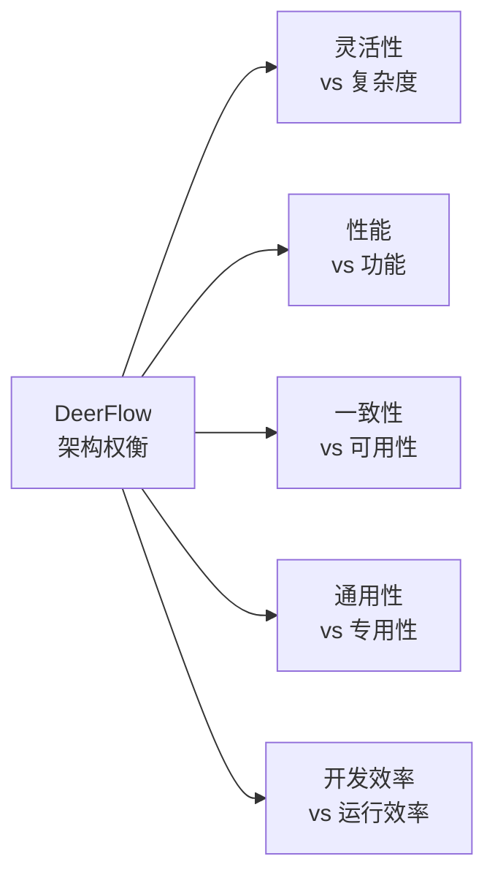

# 【文档17】架构设计权衡 —— 没有完美的架构

## 1. 五分钟速览

**这篇文档解决什么问题？**

如果你想了解：
- DeerFlow做了哪些架构权衡？
- 为什么选择A而不是B？
- 每个选择的代价是什么？
- 架构设计如何做决策？

那么这篇文档给你**架构权衡的完整认知**。

**阅读后你将获得：**
- DeerFlow的5大核心权衡
- 每个权衡的利弊分析
- 设计决策背后的逻辑
- 面试时关于架构问题的精炼回答

---

## 2. 什么是架构权衡？

### 2.1 没有完美的架构

```
每个架构选择都有代价：

例：选择微服务架构
✅ 优势：独立部署、技术栈灵活
❌ 代价：分布式复杂度、运维成本

例：选择单体架构
✅ 优势：简单、易开发
❌ 代价：难以扩展、耦合严重

架构设计 = 在多个维度中做权衡
```

### 2.2 权衡的常见维度

```
架构设计通常在这些维度中权衡：

1. 功能 vs 复杂度
   → 功能越多，复杂度越高

2. 性能 vs 可扩展性
   → 性能优化往往牺牲可扩展性

3. 灵活性 vs 简洁性
   → 越灵活，越复杂

4. 开发效率 vs 运行效率
   → 易用的往往慢

5. 成本 vs 质量
   → 高质量往往高成本

架构师的工作 = 找到最适合当前场景的平衡点
```

---

## 3. DeerFlow的核心权衡

### 3.1 权衡总览



---

## 4. 权衡一：灵活性 vs 复杂度

### 4.1 选择：追求灵活性

**DeerFlow的灵活设计**：
```
✅ 插件化架构
   → 技能系统可扩展
   → 中间件可插拔
   → 模型可适配

✅ 配置驱动
   → 通过配置控制行为
   → 不需要改代码

✅ 多渠道接入
   → Web、IM、CLI都可以
```

**代价：复杂度增加**：
```
❌ 学习曲线陡
   → 需要理解插件机制
   → 需要理解配置系统

❌ 调试困难
   → 插件之间的问题难以定位
   → 配置错误难以排查

❌ 文档要求高
   → 需要详细文档说明
   → 否则用户不会用
```

### 4.2 为什么这样选择？

```
设计考量：

DeerFlow的定位是"通用AI Agent框架"
→ 面向各种使用场景
→ 需要高度可扩展

如果选择简洁性：
→ 适合特定场景
→ 但无法适应不同需求
→ 失去通用性

结论：
→ 为了通用性，接受复杂度
→ 通过文档和工具降低学习成本
```

---

## 5. 权衡二：性能 vs 功能

### 5.1 选择：优先保证功能

**DeerFlow的功能优先**：
```
✅ 丰富的功能
   → 子代理编排
   → 长期记忆
   → 沙箱执行
   → 技能系统

✅ 完整的能力
   → 不只是Agent框架
   → 更是AI操作系统
```

**代价：性能开销**：
```
❌ 中间件链开销
   → 每个请求经过10+中间件
   → 增加延迟

❌ 沙箱开销
   → Docker启动需要秒级
   → 资源隔离有成本

❌ 状态持久化
   → 每个检查点都写入数据库
   → 增加I/O开销
```

### 5.2 为什么这样选择？

```
设计考量：

DeerFlow的目标用户
→ 需要完成复杂任务
→ 性能要求不是极致（秒级可接受）

如果优先性能：
→ 砍掉功能，简化流程
→ 但失去核心能力
→ 无法完成复杂任务

结论：
→ 为了功能完整，接受性能开销
→ 通过优化逐步改善性能
→ 而不是牺牲功能
```

---

## 6. 权衡三：一致性 vs 可用性

### 6.1 选择：最终一致性

**DeerFlow的一致性策略**：
```
场景：检查点保存

强一致性：
→ 每次保存都同步写入
→ 确保数据不丢失
→ 但性能差

最终一致性（DeerFlow选择）：
→ 异步保存
→ 可能短暂延迟
→ 但性能好
```

**代价：数据可能短暂不一致**：
```
❌ 刚保存的检查点可能读不到
❌ 系统崩溃可能丢失最近状态
❌ 需要处理保存失败的情况
```

### 6.2 为什么这样选择？

```
设计考量：

DeerFlow的使用场景
→ 长时间任务（分钟级）
→ 秒级延迟可接受

如果选择强一致性：
→ 每个操作都同步写入
→ 性能大幅下降
→ 用户体验差

结论：
→ 选择最终一致性
→ 接受短暂的数据延迟
→ 换取更好的性能
→ 通过重试和补偿机制处理异常
```

---

## 7. 权衡四：通用性 vs 专用性

### 7.1 选择：通用框架

**DeerFlow的通用设计**：
```
✅ 支持各种场景
   → 深度研究
   → 数据分析
   → 代码生成
   → 内容创作

✅ 支持各种模型
   → OpenAI
   → Anthropic
   → 本地模型

✅ 支持各种渠道
   → Web
   → IM
   → CLI
```

**代价：无法针对特定场景优化**：
```
❌ 无法针对某场景深度优化
❌ 配置复杂，需要理解很多概念
❌ 简单场景用起来太重
```

### 7.2 为什么这样选择？

```
设计考量：

DeerFlow的定位
→ 通用AI Agent框架
→ 不是针对某个特定场景

如果选择专用性：
→ 可以深度优化某个场景
→ 但失去通用性
→ 市场规模受限

结论：
→ 选择通用性
→ 通过技能系统实现"场景专用化"
→ 用户可以用技能包定制自己的场景
```

---

## 8. 权衡五：开发效率 vs 运行效率

### 8.1 选择：优先开发效率

**DeerFlow的技术选择**：
```
✅ Python（开发效率高）
   → 生态丰富
   → 开发快速
   → 但运行效率不如Rust/Go

✅ LangGraph（功能完整）
   → 强大的编排能力
   → 但学习曲线陡
   → 运行时有抽象开销

✅ 中间件模式（易于扩展）
   → 灵活可插拔
   → 但有性能开销
```

**代价：运行效率不是最优**：
```
❌ Python比编译语言慢
❌ LangGraph有抽象开销
❌ 中间件链增加延迟
```

### 8.2 为什么这样选择？

```
设计考量：

DeerFlow的发展阶段
→ 早期阶段，快速迭代更重要
→ 开发效率 > 运行效率
→ 功能完整 > 极致性能

如果优先运行效率：
→ 用Rust/Go重写
→ 但开发变慢
→ 生态不如Python
→ 迭代速度下降

结论：
→ 当前阶段优先开发效率
→ 后续可以针对性优化性能
→ 或者提供高性能版本
```

---

## 9. 架构权衡的决策方法

### 9.1 如何做权衡？

```
权衡决策的步骤：

1. 明确目标
   → 这个系统的核心目标是什么？
   → 用户最关心什么？

2. 列出维度
   → 哪些维度需要权衡？
   → 每个维度的重要性？

3. 分析选项
   → 每个选择的收益是什么？
   → 每个选择的代价是什么？

4. 做出决策
   → 选择最符合目标的
   → 记录决策理由

5. 持续评估
   → 实际使用中验证
   → 必要时调整
```

### 9.2 DeerFlow的权衡决策表

| 决策点 | 选择A | 选择B | DeerFlow选择 | 理由 |
|--------|-------|-------|--------------|------|
| 架构复杂度 | 简单专用 | 复杂通用 | 复杂通用 | 面向多场景 |
| 性能优先 | 极致性能 | 完整功能 | 完整功能 | 功能比秒级优化重要 |
| 一致性 | 强一致性 | 最终一致性 | 最终一致性 | 性能比秒级延迟重要 |
| 技术选型 | Rust/Go | Python | Python | 生态和开发效率 |
| 状态管理 | 内存 | 持久化 | 持久化 | 需要检查点 |

---

## 10. 面试要点

### Q1: DeerFlow的架构做了哪些权衡？

**参考回答**：
```
DeerFlow主要做了5个权衡：

1. 灵活性 vs 复杂度
   → 选择灵活性，接受学习曲线陡

2. 性能 vs 功能
   → 选择功能完整，接受性能开销

3. 一致性 vs 可用性
   → 选择最终一致性，接受短暂延迟

4. 通用性 vs 专用性
   → 选择通用框架，接受配置复杂

5. 开发效率 vs 运行效率
   → 选择Python，接受运行开销

这些权衡都是基于项目定位和目标用户做的决策。
```

### Q2: 为什么DeerFlow选择Python而不是Rust/Go？

**参考回答**：
```
选择Python的原因：

1. 生态丰富
   → LangChain、LangGraph都是Python
   → AI领域Python是主流

2. 开发效率
   → Python开发速度快
   → 早期迭代更重要

3. 人才储备
   → Python开发者多
   → 容易招人和协作

4. 性能足够
   → 对于AI任务，瓶颈在大模型
   → Python的性能不是瓶颈

如果选Rust/Go：
→ 性能更好
→ 但开发慢、生态差、人才少

这是典型的"够用就好"的权衡。
```

### Q3: 为什么DeerFlow选择最终一致性？

**参考回答**：
```
选择最终一致性的原因：

1. 性能考虑
   → 异步保存不阻塞主流程
   → 用户体验更好

2. 场景特点
   → 长时间任务（分钟级）
   → 秒级延迟可接受

3. 容错能力
   → 有重试机制
   → 有补偿机制

4. 成本考虑
   → 强一致性需要更昂贵的方案

如果需要强一致性：
→ 性能会大幅下降
→ 用户体验变差
→ 成本增加

对于DeerFlow的场景，最终一致性是最优选择。
```

### Q4: 什么是架构权衡？如何做权衡？

**参考回答**：
```
架构权衡是在多个维度中找平衡点。

常见维度：
→ 功能 vs 复杂度
→ 性能 vs 可扩展性
→ 灵活性 vs 简洁性
→ 成本 vs 质量

做权衡的方法：
1. 明确目标和优先级
2. 分析每个选项的收益和代价
3. 选择最符合目标的
4. 记录决策理由
5. 持续评估和调整

关键是没有完美方案，只有最适合的方案。
```

### Q5: DeerFlow的架构有什么缺点？

**参考回答**：
```
DeerFlow的架构缺点：

1. 复杂度高
   → 学习曲线陡
   → 配置复杂
   → 调试困难

2. 性能开销
   → 中间件链有延迟
   → 沙箱有开销
   → Python有抽象开销

3. 资源消耗
   → 多Agent协作消耗更多token
   → 沙箱需要额外资源

4. 过度设计风险
   → 简单场景用起来太重
   → 可能存在不必要的抽象

但这些是权衡的结果，不是设计缺陷。
对于复杂AI任务，这些代价是值得的。
```

---

## 11. 延伸思考

### 11.1 权衡会变化吗？

```
是的，权衡会随时间变化：

项目初期：
→ 快速迭代最重要
→ 开发效率 > 运行效率
→ 灵活性 > 简洁性

项目成熟期：
→ 稳定性更重要
→ 运行效率变得重要
→ 简洁性变得重要

DeerFlow未来可能：
→ 针对性能优化
→ 简化某些设计
→ 提供不同版本（轻量版/完整版）
```

### 11.2 什么时候重新评估权衡？

```
需要重新评估的信号：

1. 用户反馈
   → 抱怨太复杂
   → 抱怨性能差

2. 竞争对手
   → 有更简单但够用的方案
   → 有更快但功能够的方案

3. 技术变化
   → 新技术改变权衡计算
   → 如新的AI框架

4. 业务变化
   → 目标用户变化
   → 使用场景变化

架构不是一成不变的，需要持续评估。
```

### 11.3 如何避免过度设计？

```
过度设计的信号：

→ 抽象层数过多
→ 配置项过多
→ 用户不会用
→ 简单任务很复杂

避免方法：
1. YAGNI原则（You Aren't Gonna Need It）
   → 不要设计不需要的功能

2. 最小可行架构
   → 从简单开始
   → 按需增加复杂度

3. 用户驱动
   → 基于真实需求设计
   → 不是凭空想象

4. 定期审视
   → 砍掉不必要的抽象
   → 简化过度设计
```

---

## 12. 思考问题

### 12.1 理解检验

1. 什么是架构权衡？
2. DeerFlow做了哪些核心权衡？
3. 为什么选择最终一致性？

### 12.2 设计思考

4. 如果DeerFlow要优化性能，你会优先改哪里？
5. 什么情况下应该重新评估架构权衡？
6. 如何判断是否过度设计？

### 12.3 场景应用

7. 如果要做一个"轻量版DeerFlow"，你会砍掉哪些功能？
8. 如果DeerFlow要支持"实时性要求高"的场景，需要调整哪些权衡？
9. 如果DeerFlow要"企业级部署"，需要加强哪些方面？

### 12.4 深入探讨

10. 架构权衡和"技术债"有什么关系？
11. 如何在"快速迭代"和"稳定架构"之间平衡？
12. 你觉得DeerFlow的哪个权衡最值得商榷？为什么？

---

## 13. 本篇小结

**核心要点**：

1. **没有完美架构**：每个选择都有代价
2. **DeerFlow的5大权衡**：
   - 灵活性 vs 复杂度 → 选灵活性
   - 性能 vs 功能 → 选功能
   - 一致性 vs 可用性 → 选最终一致性
   - 通用性 vs 专用性 → 选通用性
   - 开发效率 vs 运行效率 → 选开发效率
3. **权衡方法**：明确目标 → 分析选项 → 做出决策 → 持续评估
4. **权衡会变化**：随项目阶段和需求变化

**阶段三（设计模式提炼）完结**！

下一篇我们将进入**阶段四：面试重点**，汇总面试高频问题。

---

## 14. 文档衔接

**本篇完结**，下一篇将解析：【18-面试高频问题清单】

**衔接说明**：
- 17篇解决了"为什么这样设计"的问题
- 18篇将汇总"面试常问什么"的问题
- 是前面所有文档的精华总结
- 为面试做准备，快速复习
