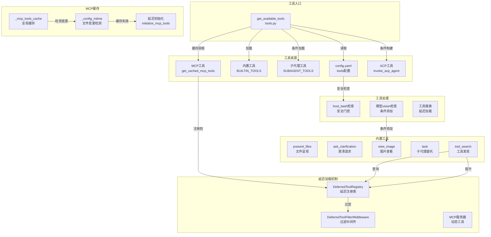

# 【文档18】工具系统深度解析

## 1. 模块全局定位

- **所属项目**: deer-flow
- **层级位置**: `backend/packages/harness/deerflow/tools/`
- **核心作用**: 为AI代理提供可扩展的工具能力，包括文件操作、命令执行、子代理委托、澄清请求等
- **业务价值**: 工具是AI代理与外部世界交互的桥梁，让AI可以执行实际操作而不仅仅是生成文本
- **设计初衷**: 通过模块化工具系统、动态加载、延迟发现等机制，实现高性能、可扩展的工具生态

## 2. 依赖&调用链路 Mermaid图



### 图表设计解读

该链路图展示了工具系统的完整架构，核心设计考量如下：

1. **多源工具汇聚**: 工具来自配置、内置、MCP、ACP等多个来源，`get_available_tools()`统一加载。

2. **条件加载策略**:
   - **bash工具**: 根据`allow_host_bash`配置决定是否加载
   - **view_image工具**: 仅当模型支持vision时加载
   - **subagent工具**: 仅当`subagent_enabled=True`时加载

3. **延迟加载机制**:
   - **MCP工具**: 延迟到首次使用时初始化
   - **DeferredTool**: 只显示名称，通过`tool_search`按需加载完整schema

4. **缓存一致性**: MCP工具缓存通过监听配置文件mtime实现自动失效，确保Gateway API的修改实时生效。

5. **ContextVar隔离**: 使用`contextvars.ContextVar`存储延迟注册表，确保并发请求不会互相干扰。

## 3. 核心目录/文件清单

| 文件路径 | 核心职责 | 设计定位 |
|---------|---------|---------|
| `tools.py` | `get_available_tools`主入口 | 工具加载的统一协调器 |
| `builtins/present_file_tool.py` | 文件呈现工具 | 将输出文件标记为artifacts |
| `builtins/clarification_tool.py` | 澄清请求工具 | 拦截并中断执行等待用户回复 |
| `builtins/view_image_tool.py` | 图片查看工具 | 读取图片并注入到state |
| `builtins/task_tool.py` | 子代理委托工具 | 并行任务执行与实时流 |
| `builtins/tool_search.py` | 工具发现工具 | 延迟加载MCP工具的查询接口 |
| `mcp/cache.py` | MCP工具缓存 | 延迟初始化+mtime失效检测 |

## 4. 关键源码深度解析

### 4.1 工具加载主入口：`tools.py`

**文件路径**: `/data/deer-flow-main/backend/packages/harness/deerflow/tools/tools.py`

```python
def get_available_tools(
    groups: list[str] | None = None,
    include_mcp: bool = True,
    model_name: str | None = None,
    subagent_enabled: bool = False,
) -> list[BaseTool]:
    """Get all available tools from config.

    Note: MCP tools should be initialized at application startup using
    `initialize_mcp_tools()` from deerflow.mcp module.

    Args:
        groups: Optional list of tool groups to filter by.
        include_mcp: Whether to include tools from MCP servers (default: True).
        model_name: Optional model name to determine if vision tools should be included.
        subagent_enabled: Whether to include subagent tools (task, task_status).

    Returns:
        List of available tools.
    """
    config = get_app_config()
    tool_configs = [tool for tool in config.tools if groups is None or tool.group in groups]

    # Do not expose host bash by default when LocalSandboxProvider is active.
    if not is_host_bash_allowed(config):
        tool_configs = [tool for tool in tool_configs if not _is_host_bash_tool(tool)]

    loaded_tools = [resolve_variable(tool.use, BaseTool) for tool in tool_configs]

    # Conditionally add tools based on config
    builtin_tools = BUILTIN_TOOLS.copy()

    # Add subagent tools only if enabled via runtime parameter
    if subagent_enabled:
        builtin_tools.extend(SUBAGENT_TOOLS)
        logger.info("Including subagent tools (task)")

    # If no model_name specified, use the first model (default)
    if model_name is None and config.models:
        model_name = config.models[0].name

    # Add view_image_tool only if the model supports vision
    model_config = config.get_model_config(model_name) if model_name else None
    if model_config is not None and model_config.supports_vision:
        builtin_tools.append(view_image_tool)
        logger.info(f"Including view_image_tool for model '{model_name}' (supports_vision=True)")

    # Get cached MCP tools if enabled
    # NOTE: We use ExtensionsConfig.from_file() instead of config.extensions
    # to always read the latest configuration from disk. This ensures that changes
    # made through the Gateway API (which runs in a separate process) are immediately
    # reflected when loading MCP tools.
    mcp_tools = []
    # Reset deferred registry upfront to prevent stale state from previous calls
    reset_deferred_registry()
    if include_mcp:
        try:
            from deerflow.config.extensions_config import ExtensionsConfig
            from deerflow.mcp.cache import get_cached_mcp_tools

            extensions_config = ExtensionsConfig.from_file()
            if extensions_config.get_enabled_mcp_servers():
                mcp_tools = get_cached_mcp_tools()
                if mcp_tools:
                    logger.info(f"Using {len(mcp_tools)} cached MCP tool(s)")

                    # When tool_search is enabled, register MCP tools in the
                    # deferred registry and add tool_search to builtin tools.
                    if config.tool_search.enabled:
                        from deerflow.tools.builtins.tool_search import DeferredToolRegistry, set_deferred_registry
                        from deerflow.tools.builtins.tool_search import tool_search as tool_search_tool

                        registry = DeferredToolRegistry()
                        for t in mcp_tools:
                            registry.register(t)
                        set_deferred_registry(registry)
                        builtin_tools.append(tool_search_tool)
                        logger.info(f"Tool search active: {len(mcp_tools)} tools deferred")
        except ImportError:
            logger.warning("MCP module not available. Install 'langchain-mcp-adapters' package to enable MCP tools.")
        except Exception as e:
            logger.error(f"Failed to get cached MCP tools: {e}")

    # Add invoke_acp_agent tool if any ACP agents are configured
    acp_tools: list[BaseTool] = []
    try:
        from deerflow.config.acp_config import get_acp_agents
        from deerflow.tools.builtins.invoke_acp_agent_tool import build_invoke_acp_agent_tool

        acp_agents = get_acp_agents()
        if acp_agents:
            acp_tools.append(build_invoke_acp_agent_tool(acp_agents))
            logger.info(f"Including invoke_acp_agent tool ({len(acp_agents)} agent(s): {list(acp_agents.keys())})")
    except Exception as e:
        logger.warning(f"Failed to load ACP tool: {e}")

    logger.info(f"Total tools loaded: {len(loaded_tools)}, built-in tools: {len(builtin_tools)}, MCP tools: {len(mcp_tools)}, ACP tools: {len(acp_tools)}")
    return loaded_tools + builtin_tools + mcp_tools + acp_tools
```

#### 设计考量解读

1. **分层加载**: 工具按优先级分层加载：
   - **配置工具**: 从config.yaml的tools配置加载
   - **内置工具**: 始终可用的核心工具
   - **条件工具**: 根据运行时参数动态添加
   - **MCP工具**: 从MCP服务器动态加载
   - **ACP工具**: 根据ACP配置构建

2. **安全第一**: 默认不暴露host bash工具，除非`allow_host_bash=True`。这防止本地沙箱用户意外执行危险命令。

3. **模型适配**: view_image工具仅在有vision支持的模型时添加。这避免非vision模型加载无用的工具。

4. **实时配置同步**: 使用`ExtensionsConfig.from_file()`而非缓存配置，确保Gateway API的修改立即生效。

5. **延迟注册表重置**: `reset_deferred_registry()`在每次调用时执行，防止上次请求的延迟工具状态泄露到本次请求。

6. **为什么需要`reset_deferred_registry`？**
   - ContextVar是per-request的
   - 但首次加载时可能为None
   - 重置确保干净状态

---

### 4.2 文件呈现工具：`present_file_tool.py`

**文件路径**: `/data/deer-flow-main/backend/packages/harness/deerflow/tools/builtins/present_file_tool.py`

```python
@tool("present_files", parse_docstring=True)
def present_file_tool(
    runtime: ToolRuntime[ContextT, ThreadState],
    filepaths: list[str],
    tool_call_id: Annotated[str, InjectedToolCallId],
) -> Command:
    """Make files visible to the user for viewing and rendering in the client interface.

    When to use the present_files tool:

    - Making any file available for the user to view, download, or interact with
    - Presenting multiple related files at once
    - After creating files that should be presented to the user

    When NOT to use the present_files tool:
    - When you only need to read file contents for your own processing
    - For temporary or intermediate files not meant for user viewing

    Notes:
    - You should call this tool after creating files and moving them to the `/mnt/user-data/outputs` directory.
    - This tool can be safely called in parallel with other tools. State updates are handled by a reducer to prevent conflicts.

    Args:
        filepaths: List of absolute file paths to present to the user. **Only** files in `/mnt/user-data/outputs` can be presented.
    """
    try:
        normalized_paths = [_normalize_presented_filepath(runtime, filepath) for filepath in filepaths]
    except ValueError as exc:
        return Command(
            update={"messages": [ToolMessage(f"Error: {exc}", tool_call_id=tool_call_id)]},
        )

    # The merge_artifacts reducer will handle merging and deduplication
    return Command(
        update={
            "artifacts": normalized_paths,
            "messages": [ToolMessage("Successfully presented files", tool_call_id=tool_call_id)],
        },
    )
```

#### 设计考量解读

1. **路径验证**: `_normalize_presented_filepath`确保文件在outputs目录内，防止呈现任意路径文件。

2. **虚拟路径支持**: 同时支持虚拟路径（`/mnt/user-data/outputs/`）和主机路径，自动转换为统一格式。

3. **Command返回值**: 返回`Command`而非直接结果，这允许更新state（`artifacts`字段）并发送消息。

4. **Reducer合并**: `merge_artifacts` reducer自动去重，多次调用present_files不会重复添加相同文件。

5. **为什么只能呈现outputs目录？**
   - **安全**: workspace和uploads可能包含临时文件
   - **语义**: outputs是"最终交付物"，应该被用户看到
   - **简洁**: 避免UI显示中间文件

---

### 4.3 澄清请求工具：`clarification_tool.py`

**文件路径**: `/data/deer-flow-main/backend/packages/harness/deerflow/tools/builtins/clarification_tool.py`

```python
@tool("ask_clarification", parse_docstring=True, return_direct=True)
def ask_clarification_tool(
    question: str,
    clarification_type: Literal[
        "missing_info",
        "ambiguous_requirement",
        "approach_choice",
        "risk_confirmation",
        "suggestion",
    ],
    context: str | None = None,
    options: list[str] | None = None,
) -> str:
    """Ask the user for clarification when you need more information to proceed.

    Use this tool when you encounter situations where you cannot proceed without user input:

    - **Missing information**: Required details not provided (e.g., file paths, URLs, specific requirements)
    - **Ambiguous requirements**: Multiple valid interpretations exist
    - **Approach choices**: Several valid approaches exist and you need user preference
    - **Risky operations**: Destructive actions that need explicit confirmation (e.g., deleting files, modifying production)
    - **Suggestions**: You have a recommendation but want user approval before proceeding

    The execution will be interrupted and the question will be presented to the user.
    Wait for the user's response before continuing.

    When to use ask_clarification:
    - You need information that wasn't provided in the user's request
    - The requirement can be interpreted in multiple ways
    - Multiple valid implementation approaches exist
    - You're about to perform a potentially dangerous operation
    - You have a recommendation but need user approval

    Best practices:
    - Ask ONE clarification at a time for clarity
    - Be specific and clear in your question
    - Don't make assumptions when clarification is needed
    - For risky operations, ALWAYS ask for confirmation
    - After calling this tool, execution will be interrupted automatically

    Args:
        question: The clarification question to ask the user. Be specific and clear.
        clarification_type: The type of clarification needed (missing_info, ambiguous_requirement, approach_choice, risk_confirmation, suggestion).
        context: Optional context explaining why clarification is needed. Helps the user understand the situation.
        options: Optional list of choices (for approach_choice or suggestion types). Present clear options for the user to choose from.
    """
    # This is a placeholder implementation
    # The actual logic is handled by ClarificationMiddleware which intercepts this tool call
    # and interrupts execution to present the question to the user
    return "Clarification request processed by middleware"
```

#### 设计考量解读

1. **return_direct=True**: 告诉LangChain这个工具的返回值直接作为结果，不作为AIMessage content。这是因为ClarificationMiddleware会处理。

2. **类型枚举**: `clarification_type`使用Literal限制为5种类型，帮助AI理解澄清场景：
   - **missing_info**: 缺少必需信息
   - **ambiguous_requirement**: 需求歧义
   - **approach_choice**: 多种方案选择
   - **risk_confirmation**: 危险操作确认
   - **suggestion**: 建议寻求批准

3. **Placeholder实现**: 工具本身只是占位符，实际逻辑由ClarificationMiddleware的`wrap_tool_call`处理。这分离了接口和实现。

4. **为什么工具不直接中断？**
   - **职责分离**: 工具定义接口，中间件实现行为
   - **灵活性**: 中间件可以在工具调用前/后做额外处理
   - **可测试性**: 工具可以独立测试，中断逻辑单独测试

5. **文档指导**: 详细的docstring告诉AI何时使用、何时不使用、最佳实践，提升AI使用工具的质量。

---

### 4.4 图片查看工具：`view_image_tool.py`

**文件路径**: `/data/deer-flow-main/backend/packages/harness/deerflow/tools/builtins/view_image_tool.py`

```python
@tool("view_image", parse_docstring=True)
def view_image_tool(
    runtime: ToolRuntime[ContextT, ThreadState],
    image_path: str,
    tool_call_id: Annotated[str, InjectedToolCallId],
) -> Command:
    """Read an image file.

    Use this tool to read an image file and make it available for display.

    When to use the view_image tool:
    - When you need to view an image file.

    When NOT to use the view_image tool:
    - For non-image files (use present_files instead)
    - For multiple files at once (use present_files instead)

    Args:
        image_path: Absolute path to the image file. Common formats supported: jpg, jpeg, png, webp.
    """
    from deerflow.sandbox.tools import get_thread_data, replace_virtual_path

    # Replace virtual path with actual path
    # /mnt/user-data/* paths are mapped to thread-specific directories
    thread_data = get_thread_data(runtime)
    actual_path = replace_virtual_path(image_path, thread_data)

    # Validate that the path is absolute
    path = Path(actual_path)
    if not path.is_absolute():
        return Command(
            update={"messages": [ToolMessage(f"Error: Path must be absolute, got: {image_path}", tool_call_id=tool_call_id)]},
        )

    # Validate that the file exists
    if not path.exists():
        return Command(
            update={"messages": [ToolMessage(f"Error: Image file not found: {image_path}", tool_call_id=tool_call_id)]},
        )

    # Validate that it's a file (not a directory)
    if not path.is_file():
        return Command(
            update={"messages": [ToolMessage(f"Error: Path is not a file: {image_path}", tool_call_id=tool_call_id)]},
        )

    # Validate image extension
    valid_extensions = {".jpg", ".jpeg", ".png", ".webp"}
    if path.suffix.lower() not in valid_extensions:
        return Command(
            update={"messages": [ToolMessage(f"Error: Unsupported image format: {path.suffix}. Supported formats: {', '.join(valid_extensions)}", tool_call_id=tool_call_id)]},
        )

    # Detect MIME type from file extension
    mime_type, _ = mimetypes.guess_type(actual_path)
    if mime_type is None:
        # Fallback to default MIME types for common image formats
        extension_to_mime = {
            ".jpg": "image/jpeg",
            ".jpeg": "image/jpeg",
            ".png": "image/png",
            ".webp": "image/webp",
        }
        mime_type = extension_to_mime.get(path.suffix.lower(), "application/octet-stream")

    # Read image file and convert to base64
    try:
        with open(actual_path, "rb") as f:
            image_data = f.read()
            image_base64 = base64.b64encode(image_data).decode("utf-8")
    except Exception as e:
        return Command(
            update={"messages": [ToolMessage(f"Error reading image file: {str(e)}", tool_call_id=tool_call_id)]},
        )

    # Update viewed_images in state
    # The merge_viewed_images reducer will handle merging with existing images
    new_viewed_images = {image_path: {"base64": image_base64, "mime_type": mime_type}}

    return Command(
        update={"viewed_images": new_viewed_images, "messages": [ToolMessage("Successfully read image", tool_call_id=tool_call_id)]},
    )
```

#### 设计考量解读

1. **多层验证**:
   - **绝对路径检查**: 防止相对路径混淆
   - **文件存在检查**: 避免"文件未找到"错误
   - **文件类型检查**: 避免将目录当文件
   - **扩展名检查**: 只支持常见图片格式

2. **MIME类型检测**: 优先使用`mimetypes.guess_type`，回退到扩展名映射。这确保更多图片格式被正确识别。

3. **Base64编码**: 图片转换为base64字符串存储在state中，便于前端渲染。

4. **State存储**: 图片存储在`viewed_images`字典中，键为虚拟路径，值为`{base64, mime_type}`。

5. **Reducer合并**: `merge_viewed_images`支持合并新图片到现有字典，空字典清空所有图片。

6. **为什么不用present_files？**
   - **专用性**: view_image专门针对图片，提供MIME类型
   - **state注入**: 图片数据注入到state，而非artifacts
   - **前端渲染**: 前端可以特殊渲染图片（如缩略图、预览）

---

### 4.5 子代理工具：`task_tool.py`

**文件路径**: `/data/deer-flow-main/backend/packages/harness/deerflow/tools/builtins/task_tool.py`

```python
@tool("task", parse_docstring=True)
async def task_tool(
    runtime: ToolRuntime[ContextT, ThreadState],
    description: str,
    prompt: str,
    subagent_type: str,
    tool_call_id: Annotated[str, InjectedToolCallId],
    max_turns: int | None = None,
) -> str:
    """Delegate a task to a specialized subagent that runs in its own context.

    Subagents help you:
    - Preserve context by keeping exploration and implementation separate
    - Handle complex multi-step tasks autonomously
    - Execute commands or operations in isolated contexts

    Available subagent types depend on the active sandbox configuration:
    - **general-purpose**: A capable agent for complex, multi-step tasks that require
      both exploration and action. Use when the task requires complex reasoning,
      multiple dependent steps, or would benefit from isolated context.
    - **bash**: Command execution specialist for running bash commands. This is only
      available when host bash is explicitly allowed or when using an isolated shell
      sandbox such as `AioSandboxProvider`.

    When to use this tool:
    - Complex tasks requiring multiple steps or tools
    - Tasks that produce verbose output
    - When you want to isolate context from the main conversation
    - Parallel research or exploration tasks

    When NOT to use this tool:
    - Simple, single-step operations (use tools directly)
    - Tasks requiring user interaction or clarification
    """
    available_subagent_names = get_available_subagent_names()

    # Get subagent configuration
    config = get_subagent_config(subagent_type)
    if config is None:
        available = ", ".join(available_subagent_names)
        return f"Error: Unknown subagent type '{subagent_type}'. Available: {available}"
    if subagent_type == "bash" and not is_host_bash_allowed():
        return f"Error: {LOCAL_BASH_SUBAGENT_DISABLED_MESSAGE}"

    # Build config overrides
    overrides: dict = {}

    skills_section = get_skills_prompt_section()
    if skills_section:
        overrides["system_prompt"] = config.system_prompt + "\n\n" + skills_section

    if max_turns is not None:
        overrides["max_turns"] = max_turns

    if overrides:
        config = replace(config, **overrides)

    # Extract parent context from runtime
    sandbox_state = None
    thread_data = None
    thread_id = None
    parent_model = None
    trace_id = None

    if runtime is not None:
        sandbox_state = runtime.state.get("sandbox")
        thread_data = runtime.state.get("thread_data")
        thread_id = runtime.context.get("thread_id") if runtime.context else None
        if thread_id is None:
            thread_id = runtime.config.get("configurable", {}).get("thread_id")

        # Try to get parent model from configurable
        metadata = runtime.config.get("metadata", {})
        parent_model = metadata.get("model_name")

        # Get or generate trace_id for distributed tracing
        trace_id = metadata.get("trace_id") or str(uuid.uuid4())[:8]

    # Get available tools (excluding task tool to prevent nesting)
    # Lazy import to avoid circular dependency
    from deerflow.tools import get_available_tools

    # Subagents should not have subagent tools enabled (prevent recursive nesting)
    tools = get_available_tools(model_name=parent_model, subagent_enabled=False)

    # Create executor
    executor = SubagentExecutor(
        config=config,
        tools=tools,
        parent_model=parent_model,
        sandbox_state=sandbox_state,
        thread_data=thread_data,
        thread_id=thread_id,
        trace_id=trace_id,
    )

    # Start background execution (always async to prevent blocking)
    # Use tool_call_id as task_id for better traceability
    task_id = executor.execute_async(prompt, task_id=tool_call_id)

    # Poll for task completion in backend (removes need for LLM to poll)
    poll_count = 0
    last_status = None
    last_message_count = 0  # Track how many AI messages we've already sent
    # Polling timeout: execution timeout + 60s buffer, checked every 5s
    max_poll_count = (config.timeout_seconds + 60) // 5

    logger.info(f"[trace={trace_id}] Started background task {task_id} (subagent={subagent_type}, timeout={config.timeout_seconds}s, polling_limit={max_poll_count} polls)")

    writer = get_stream_writer()
    # Send Task Started message'
    writer({"type": "task_started", "task_id": task_id, "description": description})

    try:
        while True:
            result = get_background_task_result(task_id)

            if result is None:
                logger.error(f"[trace={trace_id}] Task {task_id} not found in background tasks")
                writer({"type": "task_failed", "task_id": task_id, "error": "Task disappeared from background tasks"})
                cleanup_background_task(task_id)
                return f"Error: Task {task_id} disappeared from background tasks"

            # Log status changes for debugging
            if result.status != last_status:
                logger.info(f"[trace={trace_id}] Task {task_id} status: {result.status.value}")
                last_status = result.status

            # Check for new AI messages and send task_running events
            current_message_count = len(result.ai_messages)
            if current_message_count > last_message_count:
                # Send task_running event for each new message
                for i in range(last_message_count, current_message_count):
                    message = result.ai_messages[i]
                    writer(
                        {
                            "type": "task_running",
                            "task_id": task_id,
                            "message": message,
                            "message_index": i + 1,  # 1-based index for display
                            "total_messages": current_message_count,
                        }
                    )
                    logger.info(f"[trace={trace_id}] Task {task_id} sent message #{i + 1}/{current_message_count}")
                last_message_count = current_message_count

            # Check if task completed, failed, or timed out
            if result.status == SubagentStatus.COMPLETED:
                writer({"type": "task_completed", "task_id": task_id, "result": result.result})
                logger.info(f"[trace={trace_id}] Task {task_id} completed after {poll_count} polls")
                cleanup_background_task(task_id)
                return f"Task Succeeded. Result: {result.result}"
            elif result.status == SubagentStatus.FAILED:
                writer({"type": "task_failed", "task_id": task_id, "error": result.error})
                logger.error(f"[trace={trace_id}] Task {task_id} failed: {result.error}")
                cleanup_background_task(task_id)
                return f"Task failed. Error: {result.error}"
            elif result.status == SubagentStatus.TIMED_OUT:
                writer({"type": "task_timed_out", "task_id": task_id, "error": result.error})
                logger.warning(f"[trace={trace_id}] Task {task_id} timed out: {result.error}")
                cleanup_background_task(task_id)
                return f"Task timed out. Error: {result.error}"

            # Still running, wait before next poll
            await asyncio.sleep(5)
            poll_count += 1

            # Polling timeout as a safety net (in case thread pool timeout doesn't work)
            # Set to execution timeout + 60s buffer, in 5s poll intervals
            # This catches edge cases where the background task gets stuck
            if poll_count > max_poll_count:
                timeout_minutes = config.timeout_seconds // 60
                logger.error(f"[trace={trace_id}] Task {task_id} polling timed out after {poll_count} polls (should have been caught by thread pool timeout)")
                writer({"type": "task_timed_out", "task_id": task_id})
                return f"Task polling timed out after {timeout_minutes} minutes. This may indicate the background task is stuck. Status: {result.status.value}"
    except asyncio.CancelledError:

        async def cleanup_when_done() -> None:
            max_cleanup_polls = max_poll_count
            cleanup_poll_count = 0

            while True:
                result = get_background_task_result(task_id)
                if result is None:
                    return

                if result.status in {SubagentStatus.COMPLETED, SubagentStatus.FAILED, SubagentStatus.TIMED_OUT} or getattr(result, "completed_at", None) is not None:
                    cleanup_background_task(task_id)
                    return

                if cleanup_poll_count > max_cleanup_polls:
                    logger.warning(f"[trace={trace_id}] Deferred cleanup for task {task_id} timed out after {cleanup_poll_count} polls")
                    return

                await asyncio.sleep(5)
                cleanup_poll_count += 1

        def log_cleanup_failure(cleanup_task: asyncio.Task[None]) -> None:
            if cleanup_task.cancelled():
                return

            exc = cleanup_task.exception()
            if exc is not None:
                logger.error(f"[trace={trace_id}] Deferred cleanup failed for task {task_id}: {exc}")

        logger.debug(f"[trace={trace_id}] Scheduling deferred cleanup for cancelled task {task_id}")
        asyncio.create_task(cleanup_when_done()).add_done_callback(log_cleanup_failure)
        raise
```

#### 设计考量解读

1. **后端轮询**: task工具内部轮询子代理状态，避免LLM需要轮询。这简化了LLM的使用，让AI专注任务本身。

2. **实时流式更新**: 通过SSE发送`task_running`事件，前端可以实时显示子代理的进度。每个AI消息都触发一个事件。

3. **双层超时保护**:
   - **Thread Pool timeout**: 硬超时，强制终止
   - **Polling timeout**: 软超时，防止轮询卡死

4. **取消时清理**: 当LLM取消工具调用时（`asyncio.CancelledError`），启动后台清理任务，确保资源不泄露。

5. **配置覆盖**: 支持`max_turns`和`system_prompt`覆盖，允许主代理为子代理定制行为。

6. **技能注入**: 将技能section添加到子代理系统提示词，让子代理也能访问技能。

7. **trace_id传播**: 从父代理继承或生成trace_id，用于分布式追踪，所有日志带上`[trace=xxx]`前缀。

8. **为什么需要`tool_call_id`作为`task_id`？**
   - **可追溯性**: 工具调用ID唯一标识这次任务
   - **UI关联**: 前端可以用这个ID关联请求和响应

---

### 4.6 工具搜索延迟加载：`tool_search.py`

**文件路径**: `/data/deer-flow-main/backend/packages/harness/deerflow/tools/builtins/tool_search.py`

```python
@tool
def tool_search(query: str) -> str:
    """Fetches full schema definitions for deferred tools so they can be called.

    Deferred tools appear by name in <available-deferred-tools> in the system
    prompt. Until fetched, only the name is known — there is no parameter
    schema, so the tool cannot be invoked. This tool takes a query, matches
    it against the deferred tool list, and returns the matched tools' complete
    definitions. Once a tool's schema appears in that result, it is callable.

    Query forms:
      - "select:Read,Edit,Grep" — fetch these exact tools by name
      - "notebook jupyter" — keyword search, up to max_results best matches
      - "+slack send" — require "slack" in the name, rank by remaining terms

    Args:
        query: Query to find deferred tools. Use "select:<tool_name>" for
               direct selection, or keywords to search.

    Returns:
        Matched tool definitions as JSON array.
    """
    registry = get_deferred_registry()
    if not registry:
        return "No deferred tools available."

    matched_tools = registry.search(query)
    if not matched_tools:
        return f"No tools found matching: {query}"

    # Use LangChain's built-in serialization to produce OpenAI function format.
    # This is model-agnostic: all LLMs understand this standard schema.
    tool_defs = [convert_to_openai_function(t) for t in matched_tools[:MAX_RESULTS]]

    # Promote matched tools so the DeferredToolFilterMiddleware stops filtering
    # them from bind_tools — the LLM now has the full schema and can invoke them.
    registry.promote({t.name for t in matched_tools[:MAX_RESULTS]})

    return json.dumps(tool_defs, indent=2, ensure_ascii=False)
```

#### 设计考量解读

1. **三种查询模式**:
   - **select:Read,Edit**: 精确名称匹配
   - **+slack send**: 关键词必须+排序匹配
   - **notebook jupyter**: 正则表达式匹配

2. **延迟注册表**: 工具注册时只存储name和description，完整schema在查询时才返回。这减少了初始上下文大小。

3. **提升机制**: `registry.promote()`将匹配的工具从延迟注册表移除，后续`bind_tools`调用会包含完整schema。

4. **ContextVar隔离**: 每个async上下文有独立的延迟注册表，并发请求不会互相干扰。

5. **为什么需要延迟加载？**
   - **性能**: MCP工具可能很多，全部加载会超限
   - **按需**: 只加载AI实际使用的工具
   - **可控**: AI通过搜索主动选择需要

---

### 4.7 MCP工具缓存：`cache.py`

**文件路径**: `/data/deer-flow-main/backend/packages/harness/deerflow/mcp/cache.py`

```python
async def initialize_mcp_tools() -> list[BaseTool]:
    """Initialize and cache MCP tools.

    This should be called once at application startup.

    Returns:
        List of LangChain tools from all enabled MCP servers.
    """
    global _mcp_tools_cache, _cache_initialized, _config_mtime

    async with _initialization_lock:
        if _cache_initialized:
            logger.info("MCP tools already initialized")
            return _mcp_tools_cache or []

        from deerflow.mcp.tools import get_mcp_tools

        logger.info("Initializing MCP tools...")
        _mcp_tools_cache = await get_mcp_tools()
        _cache_initialized = True
        _config_mtime = _get_config_mtime()  # Record config file mtime
        logger.info(f"MCP tools initialized: {len(_mcp_tools_cache)} tool(s) loaded (config mtime: {_config_mtime})")
        return _mcp_tools_cache


def get_cached_mcp_tools() -> list[BaseTool]:
    """Get cached MCP tools with lazy initialization.

    If tools are not initialized, automatically initializes them.
    This ensures MCP tools work in both FastAPI and LangGraph Studio contexts.

    Also checks if the config file has been modified since last initialization,
    and re-initializes if needed. This ensures that changes made through the
    Gateway API (which runs in a separate process) are reflected in the
    LangGraph Server.

    Returns:
        List of cached MCP tools.
    """
    global _cache_initialized

    # Check if cache is stale due to config file changes
    if _is_cache_stale():
        logger.info("MCP cache is stale, resetting for re-initialization...")
        reset_mcp_tools_cache()

    if not _cache_initialized:
        logger.info("MCP tools not initialized, performing lazy initialization...")
        try:
            # Try to initialize in the current event loop
            loop = asyncio.get_event_loop()
            if loop.is_running():
                # If loop is already running (e.g., in LangGraph Studio),
                # we need to create a new loop in a thread
                import concurrent.futures

                with concurrent.futures.ThreadPoolExecutor() as executor:
                    future = executor.submit(asyncio.run, initialize_mcp_tools())
                    future.result()
            else:
                # If no loop is running, we can use the current loop
                loop.run_until_complete(initialize_mcp_tools())
        except RuntimeError:
            # No event loop exists, create one
            asyncio.run(initialize_mcp_tools())
        except Exception as e:
            logger.error(f"Failed to lazy-initialize MCP tools: {e}")
            return []

    return _mcp_tools_cache or []
```

#### 设计考量解读

1. **双重初始化支持**:
   - **同步环境**: 没有event loop，创建新的
   - **异步运行环境**: loop已运行，在线程中运行`asyncio.run()`
   - **LangGraph Studio**: loop在运行，特殊处理

2. **mtime失效检测**: 记录配置文件的修改时间，每次获取时检查。如果文件被修改，缓存失效并重新初始化。

3. **异步锁**: `_initialization_lock`确保并发请求不会重复初始化。第一个请求初始化，其他等待。

4. **延迟初始化**: `get_cached_mcp_tools()`在首次调用时才初始化，而非应用启动时。这避免启动时的阻塞。

5. **为什么需要mtime检测？**
   - **Gateway API**: 运行在独立进程，可能修改配置
   - **实时同步**: LangGraph Server需要感知这些修改
   - **无需轮询**: 通过mtime检测，高效且准确

---

## 5. 底层设计思想

### 5.1 整体设计理念：延迟加载 + 按需发现

**为什么采用延迟加载？**

1. **性能**: 工具schema（特别是MCP）可能很大，全部加载会超出上下文窗口。

2. **按需**: 只加载AI实际使用的工具，避免浪费token。

3. **可控**: AI通过搜索主动选择需要什么，而非被动接受所有工具。

**为什么按需发现？**

1. **可扩展性**: MCP服务器可能有上百工具，不可能全部预知。

2. **灵活性**: AI可以先看到工具列表，再决定加载哪些。

3. **学习成本**: 工具文档（description）帮助AI理解工具用途，无需完整schema。

### 5.2 核心痛点解决

**痛点1: 工具过多超出上下文**

- **问题**: MCP服务器可能提供50+工具，全部加载会超限
- **解决**: 延迟加载机制，只显示工具名称，按需加载完整schema

**痛点2: Gateway修改无法实时生效**

- **问题**: Gateway修改配置，LangGraph Server不知道
- **解决**: mtime检测+ExtensionsConfig.from_file()实时读取

**痛点3: 并发请求状态污染**

- **问题**: 多个请求同时进行工具搜索，状态互相干扰
- **解决**: ContextVar per-request隔离

**痛点4: 子代理轮询复杂**

- **问题**: LLM需要轮询子代理状态，增加复杂度
- **解决**: 工具内部轮询，LLM只需等待最终结果

**痛点5: 视觉模型无法使用图片工具**

- **问题**: 非vision模型加载view_image工具浪费
- **解决**: 条件加载，仅vision模型添加

### 5.3 行业对比优势

| 特性 | DeerFlow | LangChain | OpenAI Code Interpreter |
|------|----------|-----------|----------------------|
| 延迟加载 | 支持（tool_search） | 不支持 | 不支持 |
| MCP集成 | 完整集成 | 有限支持 | 不支持 |
| 子代理工具 | 并行+实时流 | 不支持 | 不支持 |
| 视觉条件加载 | 支持 | 不支持 | 不支持 |
| 配置热更新 | 支持（mtime） | 不支持 | 不支持 |

### 5.4 扩展性设计

1. **自定义工具**: 在`config.yaml`的`tools`配置，使用`use`指定Python函数路径。

2. **自定义MCP服务器**: 在`extensions_config.json`配置，支持stdio/SSE/HTTP多种传输。

3. **自定义子代理**: 在`config.yaml`的`subagents`配置，指定工具白名单/黑名单。

4. **自定义ACP代理**: 在`config.yaml`的`acp_agents`配置，调用外部ACP兼容代理。

5. **自定义中间件**: 继承`AgentMiddleware`，实现`wrap_tool_call`拦截工具调用。

### 5.5 设计取舍

1. **延迟 vs 预加载**:
   - **选择**: 默认延迟MCP工具
   - **权衡**: 延迟提升首次加载，预加载提升后续调用
   - **原因**: MCP工具变更频繁，预加载可能浪费

2. **后台轮询 vs LLM轮询**:
   - **选择**: 工具内部轮询
   - **权衡**: 后端复杂但前端简单
   - **原因**: LLM轮询增加token消耗和复杂度

3. **ContextVar vs 全局变量**:
   - **选择**: ContextVar
   - **权衡**: 稍微复杂但线程安全
   - **原因**: 避免并发请求状态污染

4. **return_direct vs 正常返回**:
   - **选择**: ask_clarification使用return_direct
   - **权衡**: 需要中间件特殊处理
   - **原因**: 实现中断机制

## 6. 必学核心知识点

### 6.1 条件工具加载模式

```python
def get_available_tools(model_name: str = None, subagent_enabled: bool = False):
    builtin_tools = BUILTIN_TOOLS.copy()

    # 条件1: 子代理工具
    if subagent_enabled:
        builtin_tools.extend(SUBAGENT_TOOLS)

    # 条件2: 视觉工具
    if model_name:
        model_config = get_app_config().get_model_config(model_name)
        if model_config and model_config.supports_vision:
            builtin_tools.append(view_image_tool)

    # 条件3: MCP工具（延迟）
    mcp_tools = get_cached_mcp_tools()

    return builtin_tools + mcp_tools
```

**关键要点**:
- 根据运行时参数动态调整工具列表
- 使用配置检查而非硬编码
- 延迟加载昂贵资源

### 6.2 工具搜索模式

```python
class DeferredToolRegistry:
    def search(self, query: str) -> list[BaseTool]:
        # 模式1: 精确匹配
        if query.startswith("select:"):
            names = {n.strip() for n in query[7:].split(",")}
            return [e.tool for e in self._entries if e.name in names]

        # 模式2: 关键词+排序
        if query.startswith("+"):
            parts = query[1:].split(None, 1)
            required = parts[0].lower()
            candidates = [e for e in self._entries if required in e.name.lower()]
            if len(parts) > 1:
                candidates.sort(key=lambda e: _regex_score(parts[1], e), reverse=True)
            return candidates

        # 模式3: 正则搜索
        regex = re.compile(query, re.IGNORECASE)
        scored = []
        for entry in self._entries:
            if regex.search(f"{entry.name} {entry.description}"):
                score = 2 if regex.search(entry.name) else 1
                scored.append((score, entry))
        scored.sort(reverse=True)
        return [e.tool for _, e in scored]
```

**关键要点**:
- 支持三种查询语法，满足不同场景
- 名称匹配权重高于描述匹配
- 使用`re.IGNORECASE`实现大小写不敏感

### 6.3 mtime缓存失效模式

```python
def _is_cache_stale() -> bool:
    global _config_mtime

    if not _cache_initialized:
        return False

    current_mtime = _get_config_mtime()

    if _config_mtime is None or current_mtime is None:
        return False

    if current_mtime > _config_mtime:
        logger.info("Config file has been modified, cache is stale")
        return True

    return False
```

**关键要点**:
- 记录初始化时的mtime
- 每次获取时检查当前mtime
- 文件修改时间变大说明已更新

### 6.4 ContextVar隔离模式

```python
import contextvars

_registry_var: contextvars.ContextVar[DeferredToolRegistry | None] = contextvars.ContextVar(
    "deferred_tool_registry", default=None
)

def get_registry() -> DeferredToolRegistry | None:
    return _registry_var.get()

def set_registry(registry: DeferredToolRegistry) -> None:
    _registry_var.set(registry)

def reset_registry() -> None:
    _registry_var.set(None)
```

**关键要点**:
- ContextVar自动在async上下文中传递
- 每个请求有独立的变量值
- 线程池执行时自动复制上下文

## 7. 可直接拷贝复用代码片段

### 7.1 条件工具加载器

```python
from typing import Callable, Any
from langchain.tools import BaseTool

class ConditionalToolLoader:
    """根据条件加载工具。"""

    def __init__(self):
        self._conditions: list[Callable[[], bool]] = []

    def add_condition(self, condition: Callable[[], bool]) -> "ConditionalToolLoader":
        self._conditions.append(condition)
        return self

    def load(self, tool: BaseTool) -> BaseTool | None:
        """如果所有条件满足，返回工具，否则返回None。"""
        for condition in self._conditions:
            if not condition():
                return None
        return tool

# 使用示例
loader = ConditionalToolLoader()
loader.add_condition(lambda: get_config().feature_enabled)
loader.add_condition(lambda: os.getenv("API_KEY"))

tools = [t for t in all_tools if loader.load(t)]
```

### 7.2 延迟注册表

```python
from dataclasses import dataclass
from typing import Any, Callable
import re

@dataclass
class DeferredItem:
    name: str
    description: str
    loader: Callable[[], Any]

class SimpleDeferredRegistry:
    """简单的延迟注册表。"""

    def __init__(self):
        self._items: list[DeferredItem] = []

    def register(self, item: DeferredItem) -> None:
        self._items.append(item)

    def search(self, query: str) -> list[Any]:
        """搜索并加载匹配项。"""
        results = []
        for item in self._items:
            if query.lower() in f"{item.name} {item.description}".lower():
                loaded = item.loader()
                results.append(loaded)
                if len(results) >= 5:  # MAX_RESULTS
                    break
        return results

    def promote(self, names: set[str]) -> None:
        """移除已加载项。"""
        self._items = [i for i in self._items if i.name not in names]
```

### 7.3 mtime缓存工具

```python
import os
import asyncio
from typing import TypeVar, Callable

T = TypeVar("T")

class MtimeCachedLoader:
    """基于文件修改时间的缓存加载器。"""

    def __init__(self, config_path: str, loader: Callable[[], T]):
        self._config_path = config_path
        self._loader = loader
        self._cache: T | None = None
        self._mtime: float | None = None
        self._lock = asyncio.Lock()

    async def get(self) -> T:
        """获取缓存值，如果文件已修改则重新加载。"""
        async with self._lock:
            current_mtime = os.path.getmtime(self._config_path)

            if self._cache is None or current_mtime > self._mtime:
                self._cache = await self._loader()
                self._mtime = current_mtime

            return self._cache

    def reset(self) -> None:
        """重置缓存。"""
        self._cache = None
        self._mtime = None
```

### 7.4 工具验证器

```python
from typing import Any
from pathlib import Path

class ToolValidator:
    """工具验证器，确保工具符合规范。"""

    @staticmethod
    def validate_path_args(args: dict[str, Any], path_params: set[str]) -> bool:
        """验证路径参数是否在允许目录内。"""
        for param in path_params:
            path = args.get(param)
            if not path:
                continue

            path_obj = Path(path)
            if not path_obj.is_absolute():
                return False

            # 检查是否在允许根目录内
            allowed_roots = [Path("/mnt/user-data/outputs")]
            if not any(
                str(path_obj.resolve()).startswith(str(root.resolve()))
                for root in allowed_roots
            ):
                return False

        return True
```

## 8. 踩坑提醒 & 二次开发建议

### 踩坑提醒

1. **return_direct工具不返回结果**:
   - **问题**: ask_clarification的返回值不会被LLM看到
   - **原因**: return_direct=True，值直接作为最终结果
   - **解决**: 通过ClarificationMiddleware处理，不要依赖返回值

2. **ContextVar不是全局变量**:
   - **问题**: 设置的值在其他请求中看不到
   - **原因**: ContextVar在async上下文中传递
   - **解决**: 确保在同一async上下文中使用

3. **MCP工具延迟初始化**:
   - **问题**: 首次调用可能阻塞（初始化MCP）
   - **原因**: 懒加载导致
   - **解决**: 应用启动时预热调用`initialize_mcp_tools()`

4. **子代理工具递归**:
   - **问题**: 子代理也有task工具，可能无限递归
   - **解决**: 子代理加载时使用`subagent_enabled=False`

5. **工具搜索大小限制**:
   - **问题**: 搜索返回所有工具会很大
   - **原因**: 未限制结果数量
   - **解决**: 强制MAX_RESULTS=5

### 二次开发建议

1. **添加自定义工具**:
   - 使用`@tool`装饰器
   - 添加详细docstring（AI会读取）
   - 处理错误并返回用户友好消息
   - 考虑路径验证和安全检查

2. **集成新的MCP服务器**:
   - 在`extensions_config.json`中配置
   - 支持stdio/SSE/HTTP传输
   - 配置OAuth（如需要）
   - 工具会自动延迟加载

3. **自定义子代理**:
   - 在`config.yaml`的`subagents`配置
   - 指定allowlist/denylist工具
   - 自定义system_prompt
   - 设置max_turns和timeout

4. **扩展工具搜索**:
   - 修改`DeferredToolRegistry.search()`
   - 添加新的查询语法
   - 调整MAX_RESULTS限制

5. **自定义ACP代理**:
   - 在`config.yaml`的`acp_agents`配置
   - 指定可执行文件路径
   - 配置工作目录和环境变量
   - 工具会自动生成

## 9. 文档衔接

**下一篇将解析**: 【19 - MCP集成系统深度解析】

**衔接说明**:

工具系统提到了MCP工具的延迟加载和缓存机制。下一篇将深入解析：

- **MCP架构**: Multi-Server MCP Client的设计
- **传输协议**: stdio/SSE/HTTP三种传输方式
- **OAuth认证**: HTTP/SSE的token刷新机制
- **工具加载**: 从MCP服务器获取工具列表
- **缓存失效**: mtime检测+手动重置
- **扩展配置**: extensions_config.json的结构和热更新

理解MCP集成后，才能完全掌握DeerFlow如何无缝集成第三方工具服务。
