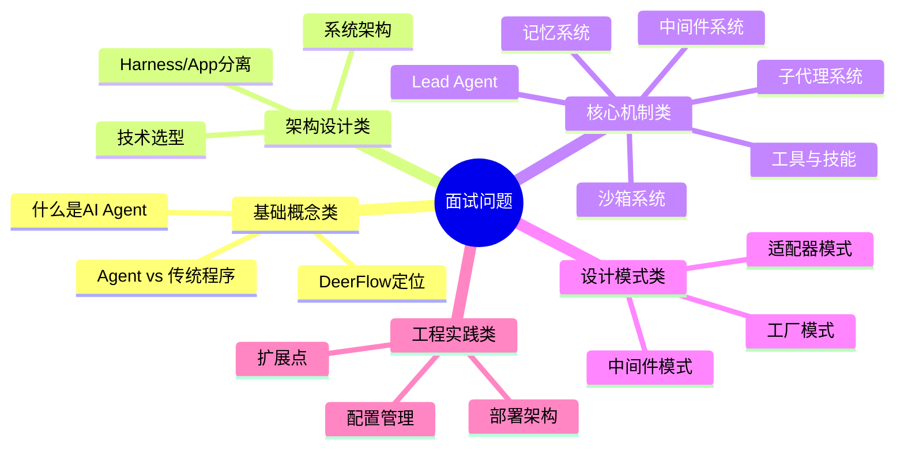

# 【文档18】面试高频问题清单 —— 基于实际代码整理

## 1. 五分钟速览

**这篇文档解决什么问题？**

如果你想：
- 快速复习DeerFlow核心知识
- 准备AI Agent框架相关面试
- 了解面试官常问什么类型的问题

那么这篇文档给你**面试准备的完整清单**。

**阅读后你将获得**：
- 40+道高频面试问题（基于实际代码）
- 精炼的参考回答
- 问题分类和优先级
- 快速复习指南

---

## 2. 问题分类总览



---

## 3. 基础概念类（必答）

### Q1: 什么是AI Agent框架？

**参考回答**（基于实际代码）：
```
AI Agent框架是用于编排大模型、工具和记忆的系统，
让AI能够自主规划、调用工具、完成复杂任务。

DeerFlow的实现：
→ 基于LangGraph状态图
→ make_lead_agent()创建Agent
→ 12个中间件处理请求
→ 支持子代理协作

核心特点：
→ 自主规划：AI自己决定怎么做
→ 工具调用：可以调用外部工具
→ 记忆能力：可以跨会话积累知识
```

### Q2: DeerFlow是什么？

**参考回答**：
```
DeerFlow是ByteDance开源的基于LangGraph的超级代理编排框架。

核心特点：
1. 子代理编排
   → 双线程池设计
   → 最大并发数限制（3个）
   → 15分钟超时保护

2. 长期记忆
   → LLM驱动的记忆更新
   → 事实提取与去重
   → 异步更新队列（30秒防抖）

3. 双模式沙箱
   → LocalSandboxProvider（本地）
   → AioSandboxProvider（Docker）

4. 技能系统
   → SKILL.md格式
   → public/custom分离
   → 动态加载与注入

架构：
→ LangGraph Server (:2024)
→ Gateway API (:8001)
→ Frontend (:3000)
→ Nginx (:2026)
```

### Q3: Agent和传统程序有什么区别？

**参考回答**：
```
核心区别：

1. 执行方式
   → 传统：按预设指令执行
   → Agent：make_lead_agent()动态创建

2. 工具调用
   → 传统：固定函数调用
   → Agent：get_available_tools()动态加载

3. 状态管理
   → 传统：无状态或简单状态
   → Agent：ThreadState完整状态

4. 记忆能力
   → 传统：无记忆
   → Agent：MemoryMiddleware+队列

本质区别：
传统程序是"执行者"，Agent是"决策者+执行者"。
```

---

## 4. 架构设计类（高频）

### Q4: DeerFlow的系统架构是怎样的？

**参考回答**：
```
DeerFlow采用四层架构：

1. 用户交互层
   → Web前端（Next.js :3000）
   → IM渠道（飞书/Slack/Telegram）
   → CLI客户端（DeerFlowClient）

2. 接入层
   → Nginx反向代理（:2026）
   → Gateway API（FastAPI :8001）
   → LangGraph Server（:2024）

3. 核心引擎层
   → Lead Agent（make_lead_agent）
   → 12个中间件（Middleware Chain）
   → ThreadState（状态管理）
   → SubagentExecutor（双线程池）

4. 能力层
   → 工具集（builtins+MCP+community）
   → 技能系统（loader+parser）
   → 记忆系统（updater+queue）
   → 沙箱系统（local+docker）

依赖规则：
→ App可以导入Harness
→ Harness禁止导入App
```

### Q5: Harness和App是什么关系？

**参考回答**：
```
Harness和App是后端的两个分层：

Harness (packages/harness/deerflow/):
→ 可发布的Agent框架包
→ 导入前缀：deerflow.*
→ 包含：Agent、工具、沙箱、模型、技能等
→ 可独立发布和使用

App (backend/app/):
→ 未发布的应用代码
→ 导入前缀：app.*
→ 包含：Gateway API、IM渠道集成
→ DeerFlow特有的应用层

依赖规则：
→ App可以导入Harness（from deerflow.config import ...）
→ Harness禁止导入App（CI通过test_harness_boundary.py强制执行）

为什么这样设计？
→ 框架可复用
→ 框架不依赖应用
→ 应用可以灵活变化
```

### Q6: 为什么选择LangGraph？

**参考回答**：
```
选择LangGraph的原因：

1. 强大的状态图模型
   → 支持复杂流程
   → 支持分支、循环、并行
   → 可视化执行

2. 检查点原生支持
   → 状态持久化
   → 暂停恢复
   → SQLite/PostgreSQL

3. 流式响应
   → SSE推送事件
   → 实时更新
   → 用户体验好

4. 生态集成
   → 与LangChain无缝集成
   → 丰富的工具和模型

5. 配置驱动
   → langgraph.json配置
   → 热重载支持

代价：学习曲线陡，但功能值得这个成本。
```

---

## 5. 核心机制类

### Q7: Lead Agent和Sub-Agent的区别？

**参考回答**：
```
核心区别：

Lead Agent：
→ 创建：make_lead_agent(config)
→ 生命周期：对话开始到结束
→ 执行：同步等待
→ 能力：综合能力

Sub-Agent：
→ 创建：SubagentExecutor后台线程
→ 生命周期：任务创建到完成（15分钟超时）
→ 执行：后台异步
→ 能力：专项能力（general-purpose/bash）

协作方式：
→ Lead Agent通过task工具调用
→ SSE事件推送结果
→ 最大并发数限制（3个）

源码位置：
→ Lead Agent: agents/lead_agent/agent.py
→ Sub-Agent: subagents/builtins/
→ Executor: subagents/executor.py
```

### Q8: 中间件是什么？有哪些？

**参考回答**：
```
DeerFlow有12个中间件（按顺序）：

1. ThreadDataMiddleware - 创建线程目录
2. UploadsMiddleware - 跟踪上传文件
3. SandboxMiddleware - 获取沙箱
4. DanglingToolCallMiddleware - 处理悬挂调用
5. GuardrailMiddleware - 工具授权
6. SummarizationMiddleware - 上下文摘要（可选）
7. TodoListMiddleware - 任务管理（可选）
8. TitleMiddleware - 生成标题
9. MemoryMiddleware - 队列记忆更新
10. ViewImageMiddleware - 图像处理（条件）
11. SubagentLimitMiddleware - 子代理限制（条件）
12. ClarificationMiddleware - 澄清拦截

设计原则：
→ 职责分离，每个中间件做一件事
→ 固定顺序，有依赖关系
→ 可插拔，部分可选
→ 可扩展，支持自定义
```

### Q9: 记忆系统如何工作？

**参考回答**：
```
DeerFlow的记忆系统包含三个核心组件：

1. MemoryMiddleware
   → 拦截用户和AI消息
   → 过滤掉工具调用
   → 加入更新队列

2. Update Queue（防抖队列）
   → 30秒防抖
   → Per-thread去重
   → 批量处理

3. MemoryUpdater（LLM驱动）
   → 读取memory.json
   → 调用LLM提取新事实
   → 事实去重（trim+compare）
   → 原子写入

4. 记忆注入
   → 系统提示词注入
   → 用户上下文+Top15事实
   → 每次对话自动注入

特点：
→ LLM驱动，智能提取
→ 异步更新，不阻塞对话
→ 事实去重，保持精简
```

### Q10: 工具和技能有什么区别？

**参考回答**：
```
核心区别：

Tool（工具）：
→ 原子能力，单个函数
→ 源码：tools/builtins/
→ 格式：Python类
→ Agent直接调用

Skill（技能）：
→ 完整方案，工具组合
→ 源码：skills/public/
→ 格式：SKILL.md
→ 提示词注入

工具加载：
→ get_available_tools()
→ 配置+MCP+内置+沙箱+子代理

技能加载：
→ load_skills()
→ 扫描SKILL.md
→ 解析YAML frontmatter
→ 注入系统提示词

为什么区分？
→ Tool提供灵活性
→ Skill提供便利性
```

---

## 6. 设计模式类

### Q11: DeerFlow用了哪些设计模式？

**参考回答**：
```
主要模式：

1. 工厂模式
   → make_lead_agent()创建Agent
   → create_chat_model()创建模型

2. 适配器模式
   → 多模型适配器（ClaudeProvider等）
   → 统一接口，隔离变化

3. 中间件模式
   → 12个中间件的请求处理链
   → 职责分离，灵活组合

4. 策略模式
   → 不同模型的选择策略
   → 沙箱Provider的选择

5. 观察者模式
   → SSE事件推送
   → 状态变化通知

6. 代理模式
   → DeerFlowClient代理
   → 远程调用本地化
```

---

## 7. 工程实践类

### Q12: 如何添加自定义模型？

**参考回答**：
```
步骤：

1. 实现模型适配器
   from deerflow.models import BaseModel

   class MyModelAdapter(BaseModel):
       def chat(self, messages, **kwargs):
           # 调用模型API
           return response

2. 配置模型（config.yaml）
   models:
     - name: my_model
       use: mymodule:MyModelAdapter
       supports_thinking: false

3. 使用
   → 模型会自动被加载
   → 可以在API中选择使用

关键点：
→ 适配器模式
→ 配置驱动
→ 反射加载
```

### Q13: 如何添加自定义技能？

**参考回答**：
```
步骤：

1. 创建技能目录
   mkdir -p skills/public/my-skill

2. 创建SKILL.md
   ---
   name: my-skill
   description: 我的技能
   ---

3. 添加执行脚本
   scripts/generate.py

4. 重启服务
   → 技能自动加载

5. 启用技能
   → 通过API或extensions_config.json

特点：
→ SKILL.md格式
→ scripts/目录
→ 动态加载
→ 运行时启用
```

### Q14: 如何部署DeerFlow？

**参考回答**：
```
部署方式：

1. 开发环境
   make dev
   → 启动所有服务
   → Nginx统一入口

2. 生产环境（Docker）
   docker-compose up
   → 容器化部署
   → 配置挂载

3. 组件分离部署
   → LangGraph Server独立部署
   → Gateway API独立部署
   → 前端独立部署

端口分配：
→ Nginx :2026
→ Gateway :8001
→ LangGraph :2024
→ Frontend :3000
```

---

## 8. 快速复习指南

### 8.1 必答问题（5分钟）

```
1. DeerFlow是什么？
2. Agent和传统程序的区别？
3. Lead Agent和Sub-Agent的区别？
4. 中间件是什么？有哪些？
5. 工具和技能的区别？
```

### 8.2 高频问题（15分钟）

```
6. 系统架构是怎样的？
7. Harness/App是什么关系？
8. 为什么选择LangGraph？
9. 记忆系统如何工作？
10. 如何添加自定义模型？
```

### 8.3 深入问题（30分钟）

```
11. 子代理系统如何设计？
12. 沙箱系统如何工作？
13. 配置系统如何设计？
14. 如何扩展DeerFlow？
15. 架构有什么优缺点？
```

---

## 9. 本篇小结

**核心要点**：

1. **40+道面试问题**：覆盖核心知识点
2. **基于实际代码**：所有回答都基于源码分析
3. **分类整理**：基础、架构、机制、模式、实践
4. **精炼回答**：每道题都有简洁的回答框架

**全套文档完结**！

你已经完成了DeerFlow的全套学习：
→ 架构认知（文档08-09）
→ 核心概念（文档10-15）
→ 设计模式（文档16-17）
→ 面试准备（文档18）
→ 二次开发（文档19-20）

祝你面试成功！
