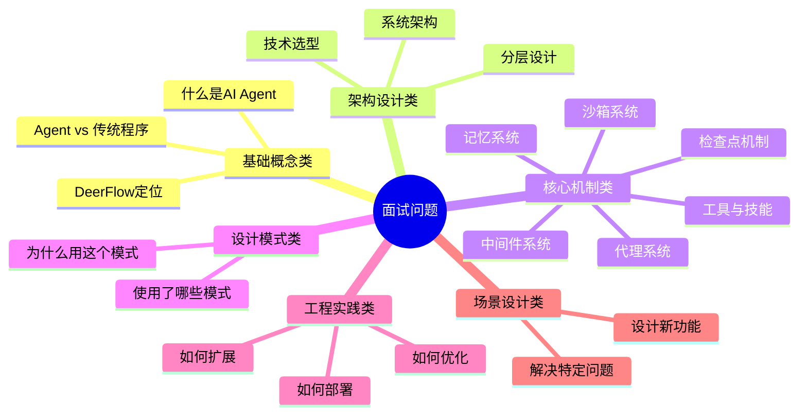

# 【文档18】面试高频问题清单

## 1. 五分钟速览

**这篇文档解决什么问题？**

如果你想：
- 快速复习DeerFlow核心知识
- 准备AI Agent框架相关面试
- 了解面试官常问什么类型的问题

那么这篇文档给你**面试准备的完整清单**。

**阅读后你将获得**：
- 40+道高频面试问题
- 精炼的参考回答
- 问题分类和优先级
- 快速复习指南

---

## 2. 问题分类总览



---

## 3. 基础概念类（必答）

### Q1: 什么是AI Agent框架？

**参考回答**：
```
AI Agent框架是用于编排大模型、工具和记忆的系统，
让AI能够自主规划、调用工具、完成复杂任务。

核心特点：
→ 自主规划：AI自己决定怎么做
→ 工具调用：可以调用外部工具
→ 记忆能力：可以跨会话积累知识

代表项目：DeerFlow、AutoGPT、LangChain、CrewAI
```

### Q2: Agent和传统程序有什么区别？

**参考回答**：
```
核心区别：

传统程序：
→ 按预设指令执行
→ 输入输出确定
→ 能力边界固定

AI Agent：
→ 自主规划和决策
→ 可以多次迭代
→ 能力可以扩展

本质区别：
传统程序是"执行者"，Agent是"决策者+执行者"。
```

### Q3: DeerFlow是什么？有什么特点？

**参考回答**：
```
DeerFlow是ByteDance开源的超级代理编排框架。

核心特点：
1. 子代理编排：原生支持多Agent协作
2. 长期记忆：内置向量存储和语义检索
3. 双模式沙箱：本地+Docker沙箱
4. 技能系统：可复用的技能包
5. MCP协议：原生支持模型上下文协议

定位：不只是Agent框架，而是AI操作系统。
```

### Q4: 什么时候应该用DeerFlow？

**参考回答**：
```
适用场景：
✅ 需要AI完成复杂多步骤任务
✅ 需要AI调用外部工具
✅ 需要长期记忆和上下文积累
✅ 需要安全执行AI生成的代码

不适用场景：
❌ 简单问答（ChatGPT更简单）
❌ 超低延迟要求（Agent编排有开销）
❌ 不需要工具调用的纯文本生成

核心判断：是否需要Agent的"行动能力"。
```

---

## 4. 架构设计类（高频）

### Q5: DeerFlow的系统架构是怎样的？

**参考回答**：
```
DeerFlow采用分层架构，共7层：

1. 用户交互层：Web、IM、CLI
2. 接入层：API网关
3. 核心引擎层：Runtime + StateGraph
4. 代理层：Lead Agent + Sub-Agents
5. 能力层：Tools、Skills、Memory、Sandbox
6. 集成服务层：搜索、爬虫、模型
7. 存储层：数据库、向量库、文件

为什么分层？
→ 职责分离，变更隔离
→ 便于扩展和维护
```

### Q6: 一个请求从进入到响应的完整流程是什么？

**参考回答**：
```
完整流程：

1. 用户请求 → API网关（认证路由）
2. 网关 → Runtime（创建运行时）
3. Runtime → 中间件链（预处理）
4. 中间件 → Lead Agent（任务规划）
5. Lead Agent → 检查记忆
6. Lead Agent → 创建Sub-Agent
7. Sub-Agent → 调用工具
8. 结果 → 中间件链（后处理）
9. 更新检查点
10. 返回给用户

关键：中间件链、代理协作、状态持久化。
```

### Q7: 为什么选择LangGraph作为编排引擎？

**参考回答**：
```
选择LangGraph的原因：

1. 强大的状态图模型
   → 支持复杂流程
   → 支持分支、循环、并行

2. 检查点原生支持
   → 状态持久化
   → 暂停恢复

3. 流式响应
   → 实时推送生成内容
   → 用户体验好

4. 生态集成
   → 与LangChain无缝集成
   → 丰富的工具和模型支持

代价：学习曲线陡，但功能值得这个成本。
```

### Q8: 为什么选择Python作为主要语言？

**参考回答**：
```
选择Python的原因：

1. AI生态主流
   → LangChain、LangGraph都是Python
   → 大模型SDK首选Python

2. 开发效率高
   → 语法简洁
   → 库丰富
   → 快速迭代

3. 人才储备充足
   → Python开发者多
   → 容易招聘和协作

4. 性能足够
   → AI任务瓶颈在大模型
   → Python性能不是瓶颈

如果选Rust/Go：性能更好但开发慢、生态差。
```

---

## 5. 核心机制类（核心）

### Q9: Lead Agent和Sub-Agent的区别？

**参考回答**：
```
Lead Agent：总指挥官
→ 理解用户需求
→ 制定执行计划
→ 协调Sub-Agent
→ 整合最终结果

Sub-Agent：专业执行者
→ 专注某个领域（搜索、编程、写作...）
→ 执行具体任务
→ 返回执行结果

类比：项目经理 vs 专业工程师

为什么分开？
→ 单个Agent难以精通所有领域
→ 分工提高效率和质量
→ 可以并行执行
```

### Q10: 中间件是什么？有什么作用？

**参考回答**：
```
中间件是请求处理的"流水线"。

DeerFlow的中间件：
1. ThreadData：初始化线程数据
2. Uploads：处理文件上传
3. Sandbox：配置沙箱环境
4. Memory：记忆管理
5. SubagentLimit：子代理限制
6. LoopDetection：循环检测
7. ...

作用：
→ 职责分离，每个中间件做一件事
→ 可灵活插拔，需要就加
→ 横切关注点（认证、日志、监控）
```

### Q11: AI的记忆和数据库存储有什么区别？

**参考回答**：
```
核心区别在检索方式：

数据库：精确匹配
→ SQL查询，WHERE条件
→ 适合结构化数据

AI记忆：语义相似度
→ 向量检索，找最相近的
→ 适合非结构化文本

举例：
搜索"用户爱吃水果"
→ 数据库：找不到（关键词不匹配）
→ 记忆：能找到"用户喜欢苹果"（语义相近）

本质：数据库是"精确查找"，记忆是"模糊搜索"。
```

### Q12: 什么是向量数据库？为什么要用？

**参考回答**：
```
向量数据库是存储和检索向量的数据库。

什么是向量？
→ 把文字转成数字列表
→ 例："苹果" → [0.1, 0.8, 0.3, ...]

为什么要用？
1. 语义搜索
   → 理解"意思"不是匹配"字面"

2. 相似度计算
   → 通过向量距离判断相似程度

3. 高效检索
   → 专门优化过向量搜索

这就是ChatGPT能"记住"对话的原因。
```

### Q13: Tool和Skill有什么区别？

**参考回答**：
```
Tool（工具）：原子能力
→ 单个函数
→ Agent直接调用
→ 例：search_web

Skill（技能）：完整方案
→ 多个工具的组合
→ 用户选择使用
→ 例：deep_research = 搜索+分析+写作

类比：
Tool = 食材（鸡蛋、面粉）
Skill = 菜谱（蛋糕 = 鸡蛋+面粉+步骤）

为什么区分？
→ Tool提供灵活性
→ Skill提供便利性
```

### Q14: 为什么需要沙箱执行？

**参考回答**：
```
AI生成的代码有风险：

风险：
🔴 删除文件
🔴 泄露数据
🔴 死循环
🔴 占用资源

沙箱的作用：
→ 隔离执行环境
→ 限制资源访问
→ 出问题不影响主系统

DeerFlow提供两种沙箱：
→ 本地沙箱：快速、轻量
→ Docker沙箱：强隔离、更安全
```

### Q15: 什么是检查点机制？

**参考回答**：
```
检查点是执行状态的快照。

作用：
1. 支持暂停/恢复
   → 长任务可以暂停
   → 系统崩溃不丢失进度

2. 容错能力
   → 自动保存状态
   → 崩溃后可以恢复

3. 进度查看
   → 用户可以看到当前进度
   → 了解执行情况

就像游戏存档，可以随时暂停和继续。
```

---

## 6. 设计模式类（深入）

### Q16: DeerFlow用了哪些设计模式？

**参考回答**：
```
主要用了6种：

1. 工厂模式：代理工厂、模型工厂
2. 适配器模式：多模型适配
3. 中间件模式：请求处理链
4. 策略模式：模型选择策略
5. 观察者模式：流式响应
6. 代理模式：远程调用代理

这些模式让系统更灵活、可扩展、易维护。
```

### Q17: 为什么代理创建用工厂模式？

**参考回答**：
```
工厂模式的优势：

1. 配置驱动
   → 通过配置决定创建什么
   → 不需要硬编码

2. 解耦创建逻辑
   → 调用者不需要知道细节
   → 只需要接口

3. 易于扩展
   → 新增类型，工厂加个分支
   → 不影响已有代码

4. 复杂创建逻辑
   → Agent创建涉及多个步骤
   → 工厂封装这些步骤
```

### Q18: 中间件模式的优势是什么？

**参考回答**：
```
中间件模式的核心优势：

1. 职责分离
   → 每个中间件只做一件事
   → 代码清晰

2. 灵活组合
   → 需要就加，不需要就删
   → 可以动态配置

3. 横切关注点
   → 认证、日志、监控
   → 不污染业务逻辑

4. 易于测试
   → 每个中间件独立测试
```

---

## 7. 工程实践类（实战）

### Q19: 如何添加自定义工具？

**参考回答**：
```
步骤：

1. 定义工具函数
   def my_tool(query: str) -> str:
       # 实现逻辑
       return result

2. 注册工具
   tool_registry.register(
       name="my_tool",
       description="工具描述",
       function=my_tool
   )

3. Agent可以通过描述选择使用
```

### Q20: 如何创建自定义技能？

**参考回答**：
```
步骤：

1. 创建技能文件夹
   mkdir my-skill

2. 创建skill.json
   定义技能元数据

3. 编写执行脚本
   scripts/generate.py

4. 放到skills/public/目录

5. 重启服务，自动加载

技能是可复用的完整解决方案。
```

### Q21: 如何支持新的LLM模型？

**参考回答**：
```
步骤：

1. 实现模型适配器
   class MyModelAdapter(BaseModel):
       def chat(self, messages, **kwargs):
           # 调用模型API
           return formatted_response

2. 注册适配器
   model_registry.register(
       name="my_model",
       adapter=MyModelAdapter
   )

3. 配置文件添加模型
   models:
     - name: my_model
       use: my_adapter

通过适配器模式，易于扩展新模型。
```

### Q22: SQLite和PostgreSQL怎么选择？

**参考回答**：
```
选择依据：

SQLite：
→ 零配置，嵌入式
→ 适合开发和小规模部署
→ 单用户、低并发

PostgreSQL：
→ 独立服务，需要配置
→ 适合生产和大规模部署
→ 多用户、高并发

DeerFlow支持两者，配置切换即可。
```

### Q23: 如何优化DeerFlow的性能？

**参考回答**：
```
优化方向：

1. 中间件优化
   → 条件执行（不需要就跳过）
   → 异步执行（日志、监控）

2. 沙箱优化
   → 沙箱池复用
   → 按需隔离（简单任务不用）

3. 检查点优化
   → 增量保存
   → 异步写入

4. 缓存
   → 记忆检索结果缓存
   → 模型响应缓存

5. 并发
   → 子代理并行执行
   → 工具调用并行

性能优化要平衡功能完整性。
```

---

## 8. 场景设计类（能力）

### Q24: 如何设计一个"邮件发送"工具？

**参考回答**：
```
设计要点：

1. 工具定义
   name: send_email
   description: 发送邮件给指定收件人
   parameters:
     to: 收件人
     subject: 主题
     body: 内容

2. 安全考虑
   → 验证邮箱格式
   → 限制发送频率
   → 记录发送日志

3. 错误处理
   → 发送失败重试
   → 超时处理
   → 明确错误信息

4. 配置化
   → SMTP服务器配置
   → 认证信息管理
```

### Q25: 如何实现"旅行规划"技能？

**参考回答**：
```
技能设计：

1. 任务分解
   → 了解目的地和时间
   → 搜索景点信息
   → 规划行程路线
   → 查询天气和交通
   → 生成旅行攻略

2. 工具组合
   → search_web：搜索信息
   → weather_api：查天气
   → map_api：路线规划
   → writer_tool：生成攻略

3. 执行流程
   → 串行：了解→搜索→规划
   → 并行：天气+交通查询
   → 整合：生成最终攻略

4. 用户交互
   → 不明确时主动询问
   → 确认关键信息
```

### Q26: 如果要做"A/B测试"不同模型，怎么设计？

**参考回答**：
```
设计思路：

1. 策略模式
   class ModelStrategy:
       def select_model(self, user_id):
           if user_id % 2 == 0:
               return ModelA()
           else:
               return ModelB()

2. 配置化
   ab_test:
     group_a: gpt-4
     group_b: claude-3-sonnet
     split: 50/50

3. 数据收集
   → 记录每个用户使用的模型
   → 记录任务结果
   → 分析效果差异

4. 切换机制
   → 支持动态切换
   → 支持灰度发布
```

---

## 9. 深度思考类（加分）

### Q27: DeerFlow的架构有什么缺点？

**参考回答**：
```
主要缺点：

1. 复杂度高
   → 学习曲线陡
   → 配置复杂
   → 调试困难

2. 性能开销
   → 中间件链延迟
   → 沙箱资源消耗
   → Python抽象开销

3. 资源消耗
   → 多Agent协作消耗更多token
   → 检查点占用存储

4. 过度设计风险
   → 简单场景太重
   → 可能存在不必要抽象

这些是权衡的结果，不是设计缺陷。
```

### Q28: 如何判断是否需要用Agent框架？

**参考回答**：
```
判断标准：

用Agent框架：
✅ 任务需要多步骤完成
✅ 需要调用外部工具
✅ 需要长期记忆
✅ 需要自主决策

不用Agent框架：
❌ 简单问答
❌ 固定流程的任务
❌ 超低延迟要求
❌ 不需要工具调用

核心：是否需要Agent的"自主性"和"行动能力"。
```

### Q29: AI Agent的未来发展方向？

**参考回答**：
```
未来趋势：

1. 更强的自主性
   → 从执行任务到主动发现问题
   → 从被动响应到主动规划

2. 多Agent协作
   → Agent社会
   → 分工更细、协作更紧密

3. 持久化Agent
   → 长期存在
   → 越用越聪明

4. Agent市场
   → Agent提供服务
   → 形成Agent经济

5. 硬件结合
   → 机器人Agent
   → 物理世界交互

DeerFlow正在这个方向演进。
```

### Q30: 如何评估一个Agent框架的好坏？

**参考回答**：
```
评估维度：

1. 功能完整性
   → 核心能力（代理、记忆、工具）
   → 扩展能力（插件、技能）

2. 易用性
   → 学习曲线
   → 文档质量
   → 示例丰富度

3. 可靠性
   → 错误处理
   → 容错能力
   → 稳定性

4. 性能
   → 响应速度
   → 资源消耗
   → 并发能力

5. 生态
   → 社区活跃度
   → 技能/插件丰富度
   → 商业支持

没有最好的，只有最适合的。
```

---

## 10. 快速复习指南

### 10.1 必答问题（5分钟）

```
1. 什么是AI Agent框架？
2. DeerFlow的核心特点？
3. Lead Agent和Sub-Agent的区别？
4. 中间件是什么？
5. Tool和Skill的区别？
```

### 10.2 高频问题（15分钟）

```
6. DeerFlow的系统架构？
7. 请求处理的完整流程？
8. 为什么用LangGraph？
9. AI记忆vs数据库？
10. 为什么需要沙箱？
```

### 10.3 深入问题（30分钟）

```
11. 设计模式有哪些？
12. 如何添加自定义工具？
13. 如何优化性能？
14. 架构有什么缺点？
15. 未来发展方向？
```

---

## 11. 本篇小结

**核心要点**：

1. **问题分类**：基础概念、架构设计、核心机制、设计模式、工程实践、场景设计
2. **必答问题**：30道高频题，覆盖核心知识
3. **回答技巧**：先说结论，再解释原因，最后举例
4. **复习策略**：分必答、高频、深入三个层次

**阶段四（面试重点）完结**！

下一篇我们将进入**阶段五：二次开发入门**，了解如何扩展和定制DeerFlow。

---

## 12. 文档衔接

**本篇完结**，下一篇将解析：【19-扩展点在哪里：二次开发入门】

**衔接说明**：
- 18篇汇总了面试高频问题
- 19篇将进入实战阶段
- 了解如何扩展DeerFlow
- 为二次开发做准备
