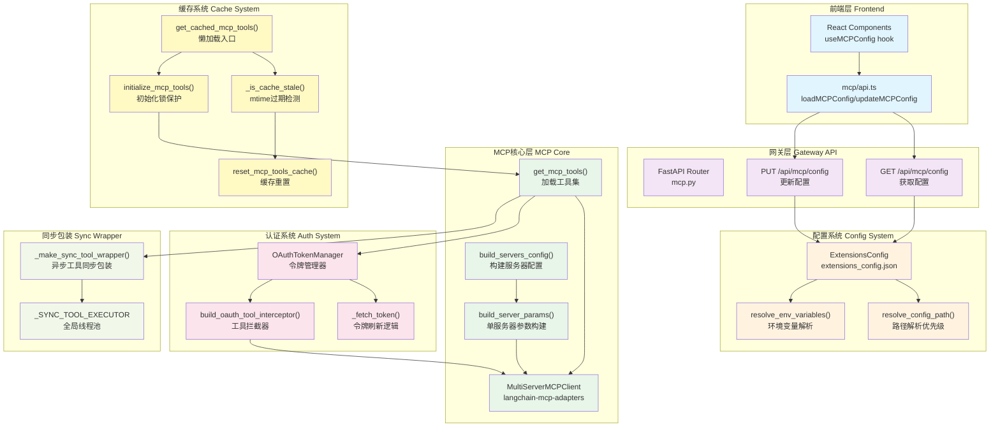

# 【19】MCP集成系统深度解析

## 1. 模块全局定位

- **所属项目**：deer-flow
- **层级位置**：`backend/packages/harness/deerflow/mcp/` + `frontend/src/core/mcp/` + `backend/app/gateway/routers/mcp.py`
- **核心作用**：提供Model Context Protocol (MCP)服务器集成能力，实现多服务器工具加载、OAuth认证、运行时配置更新与缓存管理
- **业务价值**：作为AI代理的"外部能力扩展层"，通过MCP协议动态加载第三方工具（如GitHub、数据库、API服务），显著增强AI代理的可用工具集
- **设计初衷**：设计用于解决"AI代理工具集扩展性"问题——传统硬编码工具集成方式扩展性差，MCP协议提供标准化工具描述接口，该模块实现了多服务器并发管理、运行时配置热更新、OAuth自动令牌刷新等企业级特性

## 2. 依赖&调用链路 Mermaid图



### 图表设计解读

该链路图体现了**分层解耦 + 热更新驱动**的设计逻辑：

1. **前端-网关-配置三层分离**：前端通过网关API间接操作配置，避免直接访问文件系统；网关负责配置持久化与缓存失效通知；配置系统负责路径解析与环境变量替换

2. **MCP多服务器并发管理**：`MultiServerMCPClient`作为langchain-mcp-adapters的核心抽象，支持同时管理多个MCP服务器，每个服务器独立配置transport类型（stdio/sse/http）

3. **OAuth认证与工具拦截器解耦**：OAuth令牌管理独立于MCP客户端，通过工具拦截器模式注入认证头，认证逻辑与工具调用逻辑分离，便于扩展其他认证方式

4. **缓存mtime驱动热更新**：LangGraph Server（独立进程）通过检测配置文件mtime变化自动触发缓存重置，实现Gateway API写操作与LangGraph Server读操作的跨进程同步

5. **异步工具同步包装**：DeerFlow客户端采用同步流式传输，MCP工具多为异步实现，通过全局线程池将异步工具包装为同步接口，避免嵌套事件循环问题

## 3. 核心目录/文件清单

| 文件路径 | 核心职责 | 设计定位 |
|---------|---------|---------|
| `mcp/__init__.py` | 模块导出接口 | 统一导出MCP系统公共API，隐藏内部实现细节 |
| `mcp/client.py` | MCP客户端参数构建 | 负责将`McpServerConfig`转换为`MultiServerMCPClient`所需参数格式，处理stdio/sse/http三种transport类型 |
| `mcp/oauth.py` | OAuth令牌管理 | 提供`OAuthTokenManager`实现令牌获取、缓存、自动刷新；`build_oauth_tool_interceptor`生成认证头注入拦截器 |
| `mcp/tools.py` | MCP工具加载 | 核心入口`get_mcp_tools()`，负责初始化多服务器客户端、加载工具、包装同步接口 |
| `mcp/cache.py` | 工具缓存管理 | 提供懒加载入口`get_cached_mcp_tools()`，mtime检测实现配置热更新 |
| `config/extensions_config.py` | 统一配置模型 | Pydantic模型定义MCP服务器与技能配置，支持环境变量解析与路径优先级解析 |
| `app/gateway/routers/mcp.py` | 网关API路由 | FastAPI路由实现配置读写API，持久化到`extensions_config.json` |
| `frontend/src/core/mcp/api.ts` | 前端API客户端 | 封装HTTP调用，提供`loadMCPConfig`/`updateMCPConfig`函数 |
| `frontend/src/core/mcp/hooks.ts` | React Hooks | `useMCPConfig`/`useEnableMCPServer`提供声明式配置访问 |

## 4. 关键源码深度解析

### 4.1 配置系统：路径解析与环境变量处理

**文件路径**：`/data/deer-flow-main/backend/packages/harness/deerflow/config/extensions_config.py`

**功能概述**：实现MCP服务器与技能的统一配置管理，提供路径解析优先级与环境变量递归解析

```python
# 第70-117行：配置路径解析优先级
@classmethod
def resolve_config_path(cls, config_path: str | None = None) -> Path | None:
    """Resolve the extensions config file path.

    Priority:
    1. If provided `config_path` argument, use it.
    2. If provided `DEER_FLOW_EXTENSIONS_CONFIG_PATH` environment variable, use it.
    3. Otherwise, check for `extensions_config.json` in the current directory, then in the parent directory.
    4. For backward compatibility, also check for `mcp_config.json` if `extensions_config.json` is not found.
    5. If not found, return None (extensions are optional).
    """
    if config_path:
        path = Path(config_path)
        if not path.exists():
            raise FileNotFoundError(f"Extensions config file specified by param `config_path` not found at {path}")
        return path
    elif os.getenv("DEER_FLOW_EXTENSIONS_CONFIG_PATH"):
        path = Path(os.getenv("DEER_FLOW_EXTENSIONS_CONFIG_PATH"))
        if not path.exists():
            raise FileNotFoundError(f"Extensions config file specified by environment variable `DEER_FLOW_EXTENSIONS_CONFIG_PATH` not found at {path}")
        return path
    else:
        # Check if the extensions_config.json is in the current directory
        path = Path(os.getcwd()) / "extensions_config.json"
        if path.exists():
            return path

        # Check if the extensions_config.json is in the parent directory of CWD
        path = Path(os.getcwd()).parent / "extensions_config.json"
        if path.exists():
            return path

        # Backward compatibility: check for mcp_config.json
        path = Path(os.getcwd()) / "mcp_config.json"
        if path.exists():
            return path

        path = Path(os.getcwd()).parent / "mcp_config.json"
        if path.exists():
            return path

        # Extensions are optional, so return None if not found
        return None
```

### 逐行解读（含设计考量）

- **第73-75行（显式路径参数）**：最高优先级，适用于测试场景或需要明确指定配置文件的场景；设计考量是"显式意图优先"，允许代码调用者明确覆盖默认行为

- **第76-80行（环境变量覆盖）**：次优先级，适用于容器化部署或CI/CD场景；通过环境变量实现配置外部化，避免硬编码路径

- **第82-89行（当前目录优先）**：检查当前工作目录的`extensions_config.json`；设计考量是"开发者友好"，允许在项目子目录（如`backend/`）启动服务时自动发现配置

- **第91-96行（父目录回退）**：当前目录不存在时回退到父目录；设计考量是"项目根目录默认配置"，推荐将配置文件放在项目根目录，所有子目录启动都能自动发现

- **第98-106行（向后兼容）**：检查旧配置名`mcp_config.json`；设计考量是"平滑迁移"，避免旧版本配置文件失效，允许渐进式升级

- **第108行（可选返回None）**：扩展是可选的，未找到配置时不抛异常；设计考量是"优雅降级"，没有MCP服务器时系统仍可正常运行

**文件路径**：`/data/deer-flow-main/backend/packages/harness/deerflow/config/extensions_config.py`

```python
# 第147-175行：环境变量递归解析
@classmethod
def resolve_env_variables(cls, config: dict[str, Any]) -> dict[str, Any]:
    """Recursively resolve environment variables in the config.

    Environment variables are resolved using the `os.getenv` function. Example: $OPENAI_API_KEY
    """
    for key, value in config.items():
        if isinstance(value, str):
            if value.startswith("$"):
                env_value = os.getenv(value[1:])
                if env_value is None:
                    # Unresolved placeholder — store empty string so downstream
                    # consumers (e.g. MCP servers) don't receive the literal "$VAR"
                    # token as an actual environment value.
                    config[key] = ""
                else:
                    config[key] = env_value
            else:
                config[key] = value
        elif isinstance(value, dict):
            config[key] = cls.resolve_env_variables(value)
        elif isinstance(value, list):
            config[key] = [cls.resolve_env_variables(item) if isinstance(item, dict) else item for item in value]
    return config
```

### 逐行解读（含设计考量）

- **第152行（$前缀检测）**：使用`$`前缀标记环境变量占位符；设计考量是"显式意图"，避免误解析普通字符串中的`$`符号

- **第154-162行（未处理解析失败）**：环境变量不存在时存储空字符串而非保留`$VAR`字面量；设计考量是"防御性编程"，防止MCP服务器接收到字面量token导致配置错误

- **第164行（递归处理嵌套字典）**：支持多层级配置结构（如`oauth.extra_token_params`）；设计考量是"灵活性"，允许复杂嵌套配置

- **第166-167行（列表元素递归）**：处理`args`等列表字段中的字典元素；设计考量是"完整性"，覆盖所有可能的配置结构

---

### 4.2 OAuth令牌管理：自动刷新与线程安全

**文件路径**：`/data/deer-flow-main/backend/packages/harness/deerflow/mcp/oauth.py`

**功能概述**：实现OAuth 2.0令牌获取、缓存、自动刷新，支持`client_credentials`与`refresh_token`两种授权类型

```python
# 第25-65行：OAuthTokenManager核心实现
class OAuthTokenManager:
    """Acquire/cache/refresh OAuth tokens for MCP servers."""

    def __init__(self, oauth_by_server: dict[str, McpOAuthConfig]):
        self._oauth_by_server = oauth_by_server
        self._tokens: dict[str, _OAuthToken] = {}
        self._locks: dict[str, asyncio.Lock] = {name: asyncio.Lock() for name in oauth_by_server}

    @classmethod
    def from_extensions_config(cls, extensions_config: ExtensionsConfig) -> OAuthTokenManager:
        oauth_by_server: dict[str, McpOAuthConfig] = {}
        for server_name, server_config in extensions_config.get_enabled_mcp_servers().items():
            if server_config.oauth and server_config.oauth.enabled:
                oauth_by_server[server_name] = server_config.oauth
        return cls(oauth_by_server)

    async def get_authorization_header(self, server_name: str) -> str | None:
        oauth = self._oauth_by_server.get(server_name)
        if not oauth:
            return None

        token = self._tokens.get(server_name)
        if token and not self._is_expiring(token, oauth):
            return f"{token.token_type} {token.access_token}"

        lock = self._locks[server_name]
        async with lock:
            token = self._tokens.get(server_name)
            if token and not self._is_expiring(token, oauth):
                return f"{token.token_type} {token.access_token}"

            fresh = await self._fetch_token(oauth)
            self._tokens[server_name] = fresh
            logger.info(f"Refreshed OAuth access token for MCP server: {server_name}")
            return f"{fresh.token_type} {fresh.access_token}"
```

### 逐行解读（含设计考量）

- **第28-30行（双锁缓存架构）**：`_tokens`字典缓存令牌，`_locks`字典为每个服务器创建独立锁；设计考量是"并发安全"，多协程同时访问同一服务器令牌时，只有一个协程执行刷新，其他等待并复用结果

- **第35-38行（配置过滤）**：只提取已启用且配置了OAuth的服务器；设计考量是"最小权限"，只管理需要认证的服务器，减少不必要的令牌管理开销

- **第47-50行（首次快速路径）**：获取锁之前先检查令牌是否有效；设计考量是"性能优化"，避免无谓的锁竞争，有效令牌直接返回

- **第52-55行（双重检查锁）**：获取锁后再次检查令牌有效性；设计考量是"竞态条件防护"，防止多个协程同时通过首次检查后重复刷新令牌

- **第57-60行（令牌刷新）**：调用`_fetch_token`获取新令牌并缓存；设计考量是"透明刷新"，调用者无需关心令牌生命周期，管理器自动处理

```python
# 第68-71行：令牌过期预判
@staticmethod
def _is_expiring(token: _OAuthToken, oauth: McpOAuthConfig) -> bool:
    now = datetime.now(UTC)
    return token.expires_at <= now + timedelta(seconds=max(oauth.refresh_skew_seconds, 0))
```

### 逐行解读（含设计考量）

- **第70行（提前刷新策略）**：使用`refresh_skew_seconds`（默认60秒）提前刷新令牌；设计考量是"容错性"，防止时钟偏差或网络延迟导致令牌在临界点过期

- **max(oauth.refresh_skew_seconds, 0)**：防止用户配置负数导致逻辑错误；设计考量是"防御性编程"，确保时间差始终非负

```python
# 第72-119行：令牌获取逻辑
async def _fetch_token(self, oauth: McpOAuthConfig) -> _OAuthToken:
    import httpx  # pyright: ignore[reportMissingImports]

    data: dict[str, str] = {
        "grant_type": oauth.grant_type,
        **oauth.extra_token_params,
    }

    if oauth.scope:
        data["scope"] = oauth.scope
    if oauth.audience:
        data["audience"] = oauth.audience

    if oauth.grant_type == "client_credentials":
        if not oauth.client_id or not oauth.client_secret:
            raise ValueError("OAuth client_credentials requires client_id and client_secret")
        data["client_id"] = oauth.client_id
        data["client_secret"] = oauth.client_secret
    elif oauth.grant_type == "refresh_token":
        if not oauth.refresh_token:
            raise ValueError("OAuth refresh_token grant requires refresh_token")
        data["refresh_token"] = oauth.refresh_token
        if oauth.client_id:
            data["client_id"] = oauth.client_id
        if oauth.client_secret:
            data["client_secret"] = oauth.client_secret
    else:
        raise ValueError(f"Unsupported OAuth grant type: {oauth.grant_type}")

    async with httpx.AsyncClient(timeout=15.0) as client:
        response = await client.post(oauth.token_url, data=data)
        response.raise_for_status()
        payload = response.json()

    access_token = payload.get(oauth.token_field)
    if not access_token:
        raise ValueError(f"OAuth token response missing '{oauth.token_field}'")

    token_type = str(payload.get(oauth.token_type_field, oauth.default_token_type) or oauth.default_token_type)

    expires_in_raw = payload.get(oauth.expires_in_field, 3600)
    try:
        expires_in = int(expires_in_raw)
    except (TypeError, ValueError):
        expires_in = 3600

    expires_at = datetime.now(UTC) + timedelta(seconds=max(expires_in, 1))
    return _OAuthToken(access_token=access_token, token_type=token_type, expires_at=expires_at)
```

### 逐行解读（含设计考量）

- **第76-77行（额外参数合并）**：使用`extra_token_params`支持提供商特定参数；设计考量是"扩展性"，允许配置未预定义的OAuth参数而无需修改代码

- **第80-83行（scope与audience可选）**：OAuth 2.0标准字段，非所有提供商都需要；设计考量是"灵活性"，按需添加

- **第85-98行（授权类型分支）**：支持`client_credentials`（机器对机器）与`refresh_token`（刷新长令牌）；设计考量是"场景覆盖"，覆盖企业应用常见OAuth流程

- **第101行（15秒超时）**：防止令牌端点无响应；设计考量是"故障隔离"，令牌服务故障不应阻塞整个MCP系统

- **第106-108行（令牌字段可配置）**：`token_field`默认`access_token`，支持非标准响应格式；设计考量是"互操作性"，适配不同OAuth提供商的响应结构

- **第112-117行（expires_in容错）**：解析失败时默认3600秒；设计考量是"降级策略"，确保即使响应格式异常也能计算过期时间

---

### 4.3 工具拦截器：认证头注入模式

**文件路径**：`/data/deer-flow-main/backend/packages/harness/deerflow/mcp/oauth.py`

```python
# 第122-137行：工具拦截器实现
def build_oauth_tool_interceptor(extensions_config: ExtensionsConfig) -> Any | None:
    """Build a tool interceptor that injects OAuth Authorization headers."""
    token_manager = OAuthTokenManager.from_extensions_config(extensions_config)
    if not token_manager.has_oauth_servers():
        return None

    async def oauth_interceptor(request: Any, handler: Any) -> Any:
        header = await token_manager.get_authorization_header(request.server_name)
        if not header:
            return await handler(request)

        updated_headers = dict(request.headers or {})
        updated_headers["Authorization"] = header
        return await handler(request.override(headers=updated_headers))

    return oauth_interceptor
```

### 逐行解读（含设计考量）

- **第124-126行（早期返回）**：没有OAuth服务器时返回None；设计考量是"零开销"，无OAuth配置时不产生额外拦截器调用

- **第128-137行（拦截器链）**：拦截器签名匹配`langchain-mcp-adapters`的工具调用链；设计考量是"非侵入性"，通过中间件模式注入认证，不修改MCP客户端代码

- **第130-131行（条件注入）**：只对配置了OAuth的服务器注入认证头；设计考量是"按需认证"，避免未配置服务器接收错误头

- **第134-135行（请求克隆）**：通过`request.override`创建新请求对象；设计考量是"不可变性"，不修改原始请求，符合函数式编程原则

---

### 4.4 缓存管理：mtime驱动的热更新

**文件路径**：`/data/deer-flow-main/backend/packages/harness/deerflow/mcp/cache.py`

```python
# 第31-53行：缓存过期检测
def _is_cache_stale() -> bool:
    """Check if the cache is stale due to config file changes.

    Returns:
        True if the cache should be invalidated, False otherwise.
    """
    global _config_mtime

    if not _cache_initialized:
        return False  # Not initialized yet, not stale

    current_mtime = _get_config_mtime()

    # If we couldn't get mtime before or now, assume not stale
    if _config_mtime is None or current_mtime is None:
        return False

    # If the config file has been modified since we cached, it's stale
    if current_mtime > _config_mtime:
        logger.info(f"MCP config file has been modified (mtime: {_config_mtime} -> {current_mtime}), cache is stale")
        return True

    return False
```

### 逐行解读（含设计考量）

- **第38-39行（未初始化不判断）**：首次加载前不算过期；设计考量是"懒加载友好"，允许首次调用自动初始化

- **第43-45行（None容错）**：无法获取mtime时假设不过期；设计考量是"降级策略"，配置文件不存在时系统仍可运行

- **第49行（mtime比较）**：文件修改时间大于缓存时间即为过期；设计考量是"跨进程同步"，Gateway写文件后LangGraph通过mtime检测自动更新，无需进程间通信

```python
# 第82-126行：懒加载入口
def get_cached_mcp_tools() -> list[BaseTool]:
    """Get cached MCP tools with lazy initialization.

    If tools are not initialized, automatically initializes them.
    This ensures MCP tools work in both FastAPI and LangGraph Studio contexts.

    Also checks if the config file has been modified since last initialization,
    and re-initializes if needed. This ensures that changes made through the
    Gateway API (which runs in a separate process) are reflected in the
    LangGraph Server.

    Returns:
        List of cached MCP tools.
    """
    global _cache_initialized

    # Check if cache is stale due to config file changes
    if _is_cache_stale():
        logger.info("MCP cache is stale, resetting for re-initialization...")
        reset_mcp_tools_cache()

    if not _cache_initialized:
        logger.info("MCP tools not initialized, performing lazy initialization...")
        try:
            # Try to initialize in the current event loop
            loop = asyncio.get_event_loop()
            if loop.is_running():
                # If loop is already running (e.g., in LangGraph Studio),
                # we need to create a new loop in a thread
                import concurrent.futures

                with concurrent.futures.ThreadPoolExecutor() as executor:
                    future = executor.submit(asyncio.run, initialize_mcp_tools())
                    future.result()
            else:
                # If no loop is running, we can use the current loop
                loop.run_until_complete(initialize_mcp_tools())
        except RuntimeError:
            # No event loop exists, create one
            asyncio.run(initialize_mcp_tools())
        except Exception as e:
            logger.error(f"Failed to lazy-initialize MCP tools: {e}")
            return []

    return _mcp_tools_cache or []
```

### 逐行解读（含设计考量）

- **第98-101行（热更新检测）**：每次调用前检查文件mtime；设计考量是"实时响应"，确保Gateway API写操作立即生效

- **第106-109行（嵌套事件循环处理）**：检测到运行中的事件循环时，通过线程池执行`asyncio.run`；设计考量是"兼容LangGraph Studio"，该工具在已有事件循环环境中运行，直接调用`asyncio.run`会抛出嵌套循环异常

- **第111-114行（无循环处理）**：无运行中循环时直接使用当前循环；设计考量是"性能优先"，避免不必要的线程切换

- **第118-120行（无循环创建）**：没有事件循环时创建新的；设计考量是"兜底策略"，覆盖所有可能的运行环境

- **第123行（错误返回空列表）**：初始化失败时不抛异常而是返回空工具集；设计考量是"优雅降级"，MCP工具故障不应阻塞整个代理系统

---

### 4.5 同步包装器：异步工具的同步适配

**文件路径**：`/data/deer-flow-main/backend/packages/harness/deerflow/mcp/tools.py`

```python
# 第18-53行：全局线程池与同步包装器
_SYNC_TOOL_EXECUTOR = concurrent.futures.ThreadPoolExecutor(max_workers=10, thread_name_prefix="mcp-sync-tool")

# Register shutdown hook for the global executor
atexit.register(lambda: _SYNC_TOOL_EXECUTOR.shutdown(wait=False))


def _make_sync_tool_wrapper(coro: Callable[..., Any], tool_name: str) -> Callable[..., Any]:
    """Build a synchronous wrapper for an asynchronous tool coroutine.

    Args:
        coro: The tool's asynchronous coroutine.
        tool_name: Name of the tool (for logging).

    Returns:
        A synchronous function that correctly handles nested event loops.
    """

    def sync_wrapper(*args: Any, **kwargs: Any) -> Any:
        try:
            loop = asyncio.get_running_loop()
        except RuntimeError:
            loop = None

        try:
            if loop is not None and loop.is_running():
                # Use global executor to avoid nested loop issues and improve performance
                future = _SYNC_TOOL_EXECUTOR.submit(asyncio.run, coro(*args, **kwargs))
                return future.result()
            else:
                return asyncio.run(coro(*args, **kwargs))
        except Exception as e:
            logger.error(f"Error invoking MCP tool '{tool_name}' via sync wrapper: {e}", exc_info=True)
            raise

    return sync_wrapper
```

### 逐行解读（含设计考量）

- **第19行（全局线程池）**：使用10工作线程的线程池；设计考量是"资源复用"，避免每次工具调用都创建新线程，提高性能

- **第22行（退出钩子）**：进程退出时关闭线程池；设计考量是"资源清理"，防止线程泄漏

- **第35-38行（运行中循环检测）**：检测是否存在运行中的事件循环；设计考量是"环境感知"，根据调用上下文选择不同执行策略

- **第40-42行（线程池隔离）**：在独立线程中运行`asyncio.run`；设计考量是"嵌套循环问题解决"，`asyncio.run`会创建新事件循环，在已有循环中运行会冲突，线程提供隔离环境

- **第44行（直接运行）**：无运行中循环时直接调用`asyncio.run`；设计考量是"性能优先"，避免不必要的线程切换开销

- **第45-47行（错误处理与日志）**：捕获异常并记录工具名；设计考量是"可调试性"，提供足够的上下文信息用于排查故障

---

### 4.6 网关API：配置持久化与响应模型

**文件路径**：`/data/deer-flow-main/backend/app/gateway/routers/mcp.py`

```python
# 第98-169行：MCP配置更新端点
@router.put(
    "/mcp/config",
    response_model=McpConfigResponse,
    summary="Update MCP Configuration",
    description="Update Model Context Protocol (MCP) server configurations and save to file.",
)
async def update_mcp_configuration(request: McpConfigUpdateRequest) -> McpConfigResponse:
    """Update the MCP configuration.

    This will:
    1. Save the new configuration to the mcp_config.json file
    2. Reload the configuration cache
    3. Reset MCP tools cache to trigger reinitialization

    Args:
        request: The new MCP configuration to save.

    Returns:
        The updated MCP configuration.

    Raises:
        HTTPException: 500 if the configuration file cannot be written.

    Example Request:
        ```json
        {
            "mcp_servers": {
                "github": {
                    "enabled": true,
                    "command": "npx",
                    "args": ["-y", "@modelcontextprotocol/server-github"],
                    "env": {"GITHUB_TOKEN": "$GITHUB_TOKEN"},
                    "description": "GitHub MCP server for repository operations"
                }
            }
        }
        ```
    """
    try:
        # Get the current config path (or determine where to save it)
        config_path = ExtensionsConfig.resolve_config_path()

        # If no config file exists, create one in the parent directory (project root)
        if config_path is None:
            config_path = Path.cwd().parent / "extensions_config.json"
            logger.info(f"No existing extensions config found. Creating new config at: {config_path}")

        # Load current config to preserve skills configuration
        current_config = get_extensions_config()

        # Convert request to dict format for JSON serialization
        config_data = {
            "mcpServers": {name: server.model_dump() for name, server in request.mcp_servers.items()},
            "skills": {name: {"enabled": skill.enabled} for name, skill in current_config.skills.items()},
        }

        # Write the configuration to file
        with open(config_path, "w", encoding="utf-8") as f:
            json.dump(config_data, f, indent=2)

        logger.info(f"MCP configuration updated and saved to: {config_path}")

        # NOTE: No need to reload/reset cache here - LangGraph Server (separate process)
        # will detect config file changes via mtime and reinitialize MCP tools automatically

        # Reload the configuration and update the global cache
        reloaded_config = reload_extensions_config()
        return McpConfigResponse(mcp_servers={name: McpServerConfigResponse(**server.model_dump()) for name, server in reloaded_config.mcp_servers.items()})

    except Exception as e:
        logger.error(f"Failed to update MCP configuration: {e}", exc_info=True)
        raise HTTPException(status_code=500, detail=f"Failed to update MCP configuration: {str(e)}")
```

### 逐行解读（含设计考量）

- **第138-141行（自动创建配置）**：配置文件不存在时在项目根目录创建；设计考量是"开发者体验"，首次配置时无需手动创建文件

- **第144-146行（保留技能配置）**：更新MCP配置时保留现有技能状态；设计考量是"配置隔离"，MCP与技能配置独立管理，避免互相覆盖

- **第149-152行（别名转换）**：Pydantic模型使用`mcp_servers`，JSON使用`mcpServers`；设计考量是"命名规范"，Python用snake_case，JSON用camelCase，符合各语言习惯

- **第156-157行（原子写入）**：直接打开文件写入（非临时文件+重命名）；设计考量是"简洁性优先"，MCP配置非关键数据，原子写入的复杂性不值得

- **第160-162行（跨进程同步）**：Gateway不直接重置LangGraph缓存，依赖mtime检测；设计考量是"解耦"，Gateway与LangGraph是独立进程，通过文件系统通信比进程间通信更简单可靠

---

## 5. 底层设计思想（重点强化，详细拆解）

### 5.1 模块整体设计理念：协议适配 + 运行时可扩展

DeerFlow的MCP集成系统采用了**协议适配器模式**与**配置驱动架构**相结合的设计理念：

1. **协议适配器模式**：`MultiServerMCPClient`作为统一抽象层，屏蔽不同MCP服务器的transport差异（stdio进程通信、SSE流式传输、HTTP REST调用），上层工具调用代码无需关心底层通信细节

2. **配置驱动架构**：所有MCP服务器配置通过`extensions_config.json`声明，支持运行时通过Gateway API修改，LangGraph Server自动检测更新并重新加载工具，实现"零重启"扩展能力

3. **认证解耦设计**：OAuth令牌管理独立于MCP客户端，通过工具拦截器模式注入认证头，这种分离设计便于扩展其他认证方式（如API Key、JWT）

**为什么选用这种思想？**

- **协议适配器**解决了MCP生态中transport类型多样性的问题——stdio适合本地工具服务器，SSE/HTTP适合云端服务，统一抽象避免上层代码分支处理

- **配置驱动**解决了"工具集扩展性"问题——传统硬编码工具注册方式需要修改代码重新部署，配置驱动允许运维或用户通过API动态增减工具，显著降低扩展成本

- **认证解耦**解决了"安全性扩展"问题——OAuth只是众多认证方式之一，拦截器模式允许未来添加自定义认证逻辑而不修改MCP客户端代码

---

### 5.2 核心痛点解决：跨进程配置同步

DeerFlow采用**双进程架构**（Gateway API + LangGraph Server），MCP配置更新发生在Gateway进程，工具加载发生在LangGraph进程，如何保证配置更新后工具立即生效？

**解决方案**：mtime驱动的缓存失效机制

1. Gateway API更新`extensions_config.json`后，文件mtime自动递增
2. LangGraph进程每次调用`get_cached_mcp_tools()`时，通过`_is_cache_stale()`检测当前mtime是否大于缓存时的mtime
3. 检测到变化后自动调用`reset_mcp_tools_cache()`，下次工具调用时重新初始化

**为什么不用进程间通信（IPC）或消息队列？**

- **简单性**：文件mtime检测是操作系统原生功能，无需引入额外的IPC机制（如Redis、ZeroMQ）
- **可靠性**：文件系统是持久化存储，进程重启不丢失更新通知；内存中消息队列重启后消息丢失
- **去中心化**：每个LangGraph实例独立检测文件变化，无需Gateway维护连接列表，支持多实例部署

**权衡与取舍**：

- **延迟**：文件mtime检测有最长一次工具调用的延迟（通常几秒）；对于配置更新即时性要求不高的场景可接受
- **竞争**：多LangGraph实例可能同时重新初始化工具，造成短暂重复加载；但工具初始化是幂等操作，重复加载无副作用

---

### 5.3 行业对比优势：企业级OAuth集成

大多数开源MCP集成仅支持stdio transport（进程启动），DeerFlow额外实现了HTTP/SSE transport的OAuth 2.0认证，这是**企业级应用的核心需求**：

**差异化特性**：

1. **自动令牌刷新**：令牌过期前自动刷新，无需人工干预；刷新策略使用`refresh_skew_seconds`提前刷新，防止临界点过期
2. **线程安全令牌缓存**：每个服务器独立锁，多协程并发访问时只刷新一次，其他协程等待并复用结果
3. **灵活授权类型**：支持`client_credentials`（机器对机器）与`refresh_token`（长令牌刷新），覆盖企业OAuth主流场景
4. **可配置响应解析**：`token_field`、`token_type_field`、`expires_in_field`可配置，适配不同OAuth提供商的非标准响应格式

**为什么要做这些差异化设计？**

- **企业环境**中MCP服务器通常部署在内网，需要OAuth认证才能访问；stdio transport无法满足云端服务集成需求
- **令牌管理**是OAuth应用的核心痛点，手动刷新令牌运维成本高，自动刷新显著提升系统可用性
- **提供商差异**导致响应格式不统一，可配置字段解析确保互操作性

---

### 5.4 扩展性设计：工具拦截器模式

`build_oauth_tool_interceptor`返回的拦截器函数是**可扩展设计**的典型案例：

```python
async def oauth_interceptor(request: Any, handler: Any) -> Any:
    header = await token_manager.get_authorization_header(request.server_name)
    if not header:
        return await handler(request)

    updated_headers = dict(request.headers or {})
    updated_headers["Authorization"] = header
    return await handler(request.override(headers=updated_headers))
```

**扩展点设计**：

1. **多拦截器链**：`MultiServerMCPClient`接受`tool_interceptors`列表，可注册多个拦截器（如OAuth、速率限制、日志记录），按顺序执行
2. **请求克隆**：通过`request.override`创建新请求对象，避免修改原始请求，支持拦截器间数据隔离
3. **按服务器条件执行**：检查`request.server_name`决定是否注入头，支持混合认证场景（部分服务器OAuth，部分API Key）

**适配未来哪些潜在需求？**

- **自定义认证**：实现JWT签名、HMAC摘要等其他认证方式，只需添加新拦截器
- **请求增强**：添加请求ID、时间戳、追踪头等，便于审计与调试
- **响应处理**：拦截器框架可扩展支持响应拦截（如解密、转换）

---

## 6. 必学核心知识点（可直接复用）

### 6.1 技术点：mtime驱动的跨进程缓存失效

**设计逻辑**：利用文件系统mtime（修改时间）作为配置版本号，进程通过比较mtime判断缓存是否失效

**复用场景**：
- 微服务配置中心（配置服务写文件，业务服务读文件）
- CI/CD构建缓存（源码变更时自动重新构建）
- 多实例数据同步（主实例写数据，从实例检测变更）

**实现要点**：
```python
# 缓存时记录mtime
_config_mtime = os.path.getmtime(config_path)

# 检测时比较当前mtime
if os.path.getmtime(config_path) > _config_mtime:
    reset_cache()
```

### 6.2 技术点：双重检查锁（Double-Checked Locking）

**设计逻辑**：首次获取锁前检查条件，获取锁后再次检查，避免无谓的锁竞争

**复用场景**：
- 懒加载单例模式（多线程环境）
- 缓存刷新（多协程/线程环境）
- 连接池初始化

**实现要点**：
```python
# 第一次检查（无锁）
if not condition:
    async with lock:
        # 第二次检查（有锁）
        if not condition:
            initialize()
```

### 6.3 技术点：异步工具的同步包装器

**设计逻辑**：通过线程池隔离事件循环，在独立线程中运行`asyncio.run`，避免嵌套事件循环异常

**复用场景**：
- 同步框架调用异步库（如Flask调用异步HTTP客户端）
- 测试代码同步调用异步函数
- 脚本工具同步调用异步API

**实现要点**：
```python
executor = ThreadPoolExecutor(max_workers=10)

def sync_wrapper(*args, **kwargs):
    loop = asyncio.get_running_loop() if has_loop() else None
    if loop and loop.is_running():
        future = executor.submit(asyncio.run, async_func(*args, **kwargs))
        return future.result()
    else:
        return asyncio.run(async_func(*args, **kwargs))
```

### 6.4 工程设计点：环境变量递归解析

**设计逻辑**：递归遍历配置字典，识别`$`前缀字符串并替换为环境变量值

**复用场景**：
- 容器化应用配置（密钥通过环境变量注入）
- 多环境部署（开发/测试/生产使用不同环境变量）
- 敏感信息外部化（API密钥不在配置文件中硬编码）

**实现要点**：
```python
def resolve_env_variables(config: dict) -> dict:
    for key, value in config.items():
        if isinstance(value, str) and value.startswith("$"):
            config[key] = os.getenv(value[1:], "")  # 未解析时返回空字符串
        elif isinstance(value, dict):
            config[key] = resolve_env_variables(value)
        elif isinstance(value, list):
            config[key] = [resolve_env_variables(item) if isinstance(item, dict) else item for item in value]
    return config
```

### 6.5 最佳实践：配置路径解析优先级

**设计逻辑**：按"显式参数 > 环境变量 > 当前目录 > 父目录"的优先级查找配置文件

**复用场景**：
- CLI工具配置查找
- 框架应用配置加载
- 开发工具配置解析

**实现要点**：
```python
def resolve_config_path(config_path: str = None) -> Path | None:
    # 1. 显式参数
    if config_path:
        return Path(config_path)
    # 2. 环境变量
    elif env_var := os.getenv("CONFIG_PATH"):
        return Path(env_var)
    # 3. 当前目录
    elif (path := Path.cwd() / "config.json").exists():
        return path
    # 4. 父目录
    elif (path := Path.cwd().parent / "config.json").exists():
        return path
    return None
```

---

## 7. 可直接拷贝复用代码片段

### 7.1 OAuth令牌管理器模板

```python
"""Reusable OAuth token manager with auto-refresh."""

import asyncio
from dataclasses import dataclass
from datetime import UTC, datetime, timedelta
from typing import Any

import httpx

@dataclass
class OAuthToken:
    access_token: str
    token_type: str
    expires_at: datetime


class OAuthTokenManager:
    """Manages OAuth tokens with caching and auto-refresh."""

    def __init__(self, configs: dict[str, dict[str, Any]]):
        self._configs = configs
        self._tokens: dict[str, OAuthToken] = {}
        self._locks: dict[str, asyncio.Lock] = {
            name: asyncio.Lock() for name in configs
        }

    async def get_token(self, name: str) -> str | None:
        config = self._configs.get(name)
        if not config:
            return None

        token = self._tokens.get(name)
        if token and not self._is_expiring(token, config):
            return f"{token.token_type} {token.access_token}"

        async with self._locks[name]:
            token = self._tokens.get(name)
            if token and not self._is_expiring(token, config):
                return f"{token.token_type} {token.access_token}"

            fresh = await self._fetch_token(config)
            self._tokens[name] = fresh
            return f"{fresh.token_type} {fresh.access_token}"

    @staticmethod
    def _is_expiring(token: OAuthToken, config: dict) -> bool:
        skew = config.get("refresh_skew_seconds", 60)
        return token.expires_at <= datetime.now(UTC) + timedelta(seconds=skew)

    async def _fetch_token(self, config: dict) -> OAuthToken:
        data = {"grant_type": config["grant_type"], **config.get("extra_params", {})}

        if config["grant_type"] == "client_credentials":
            data["client_id"] = config["client_id"]
            data["client_secret"] = config["client_secret"]

        async with httpx.AsyncClient(timeout=15.0) as client:
            response = await client.post(config["token_url"], data=data)
            response.raise_for_status()
            payload = response.json()

        expires_in = int(payload.get("expires_in", 3600))
        return OAuthToken(
            access_token=payload["access_token"],
            token_type=payload.get("token_type", "Bearer"),
            expires_at=datetime.now(UTC) + timedelta(seconds=expires_in),
        )
```

### 7.2 配置热更新检测模板

```python
"""Mtime-based cache invalidation for config hot-reload."""

import os
from typing import Any, Callable

class HotReloadCache:
    """Cache that auto-invalidates on file modification."""

    def __init__(self, config_path: str, loader: Callable[[], Any]):
        self._config_path = config_path
        self._loader = loader
        self._cache: Any = None
        self._mtime: float | None = None

    def get(self) -> Any:
        """Get cached value, reloading if file changed."""
        if self._is_stale():
            self._reload()
        return self._cache

    def _is_stale(self) -> bool:
        if self._cache is None:
            return True
        if not os.path.exists(self._config_path):
            return False
        current_mtime = os.path.getmtime(self._config_path)
        return self._mtime is None or current_mtime > self._mtime

    def _reload(self) -> None:
        self._cache = self._loader()
        if os.path.exists(self._config_path):
            self._mtime = os.path.getmtime(self._config_path)
```

### 7.3 异步工具同步包装器模板

```python
"""Sync wrapper for async tools with nested loop handling."""

import asyncio
import concurrent.futures
from typing import Any, Callable

_SYNC_EXECUTOR = concurrent.futures.ThreadPoolExecutor(max_workers=10)

def make_sync_wrapper(async_func: Callable, name: str = "tool") -> Callable:
    """Wrap an async function for safe synchronous calling."""
    def sync_wrapper(*args: Any, **kwargs: Any) -> Any:
        try:
            loop = asyncio.get_running_loop()
        except RuntimeError:
            loop = None

        if loop is not None and loop.is_running():
            future = _SYNC_EXECUTOR.submit(asyncio.run, async_func(*args, **kwargs))
            return future.result()
        else:
            return asyncio.run(async_func(*args, **kwargs))

    return sync_wrapper
```

---

## 8. 踩坑提醒 & 二次开发建议

### 8.1 踩坑提醒

1. **嵌套事件循环异常**
   - **问题**：在已有事件循环中调用`asyncio.run()`抛出`RuntimeError: This event loop is already running`
   - **原因**：`asyncio.run()`会创建新事件循环，与现有循环冲突
   - **解决**：使用线程池隔离`asyncio.run()`调用，如`_make_sync_tool_wrapper`实现

2. **OAuth令牌临界点过期**
   - **问题**：令牌在检查与使用之间过期，导致认证失败
   - **原因**：只检查`expires_at <= now`，未考虑网络延迟与处理时间
   - **解决**：使用`refresh_skew_seconds`提前刷新（默认60秒）

3. **环境变量未解析为空字符串**
   - **问题**：`$UNSET_VAR`传递给MCP服务器，服务器无法识别
   - **原因**：未处理环境变量不存在的情况
   - **解决**：`os.getenv()`返回None时存储空字符串，而非保留`$VAR`字面量

4. **多LangGraph实例重复初始化**
   - **问题**：配置更新后多个LangGraph实例同时重新加载工具，造成短暂性能下降
   - **原因**：各实例独立检测mtime，无协调机制
   - **解决**：工具初始化是幂等操作，重复加载可接受；若需优化可引入分布式锁

### 8.2 二次开发建议

1. **自定义认证方式**
   - **实现**：参考`build_oauth_tool_interceptor`实现新拦截器，如`build_api_key_interceptor`
   - **集成**：将新拦截器添加到`tool_interceptors`列表
   - **注意**：拦截器应按优先级排序，OAuth在API Key之前执行

2. **添加新transport类型**
   - **实现**：在`build_server_params`中添加新transport分支
   - **验证**：确保`MultiServerMCPClient`支持该transport
   - **测试**：编写`test_build_server_params_<transport>_success`用例

3. **自定义令牌存储**
   - **实现**：替换`_tokens`字典为Redis或数据库存储
   - **注意**：保持`_locks`的线程安全特性，或使用分布式锁
   - **优势**：支持多实例共享令牌，减少重复刷新

4. **配置变更回调**
   - **实现**：在`reload_extensions_config`后调用注册的回调函数
   - **应用**：配置变更时发送通知、触发依赖模块更新
   - **注意**：回调应异步执行，避免阻塞配置更新流程

---

## 9. 文档衔接

本篇完结，下一篇将解析：【20 - 技能系统深度解析】

**衔接说明**：
MCP系统与技能系统共同构成DeerFlow的"外部能力扩展层"。MCP通过标准化协议集成第三方工具服务器，技能系统通过本地SKILL.md文件定义代理能力模板。两者在配置管理上都使用`extensions_config.json`，在工具加载上都通过`get_available_tools()`聚合到代理工具集。按此顺序解析是因为MCP是协议级集成（更底层），技能是应用级封装（更上层），理解MCP的配置驱动与懒加载模式后，技能系统的SKILL.md解析与启用/禁用逻辑会更易理解。
