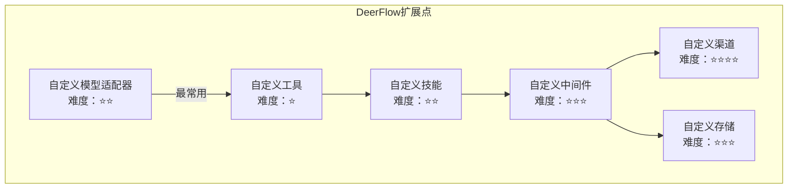

# 【文档19】扩展点在哪里 —— 二次开发入门

## 1. 五分钟速览

**这篇文档解决什么问题？**

如果你想了解：
- DeerFlow有哪些扩展点？
- 如何添加自定义功能？
- 扩展的难度如何？
- 从哪里开始二次开发？

那么这篇文档给你**二次开发的入门指南**。

**阅读后你将获得**：
- DeerFlow的6大扩展点
- 每个扩展点的开发难度
- 快速开始指南
- 常见扩展场景

---

## 2. DeerFlow的扩展点总览



---

## 3. 扩展点一：自定义模型适配器

### 3.1 什么时候需要？

```
需要场景：
→ 接入企业内部大模型
→ 接入国产大模型（如文心、通义）
→ 接入本地部署的开源模型
→ 特殊需求的模型包装

例：公司有自研大模型，想在DeerFlow中使用
```

### 3.2 如何实现？

```python
# 1. 实现模型适配器接口
from deerflow.models import BaseModel

class MyModelAdapter(BaseModel):
    def __init__(self, config):
        self.model_name = config.model
        self.api_key = config.api_key
        # 初始化模型客户端

    def chat(self, messages, **kwargs):
        # 调用模型API
        response = self.client.chat(
            messages=messages,
            temperature=kwargs.get('temperature', 0.7)
        )
        # 转换为统一格式
        return self._format_response(response)

    def _format_response(self, response):
        # 转换为DeerFlow标准格式
        return {
            'content': response.text,
            'usage': response.usage
        }

# 2. 注册适配器
from deerflow.models import registry

registry.register(
    name="my_model",
    adapter=MyModelAdapter,
    description="我的自定义模型"
)

# 3. 配置文件使用
models:
  - name: my_custom_model
    display_name: 我的公司模型
    use: my_model
    model: my-model-v1
    api_key: $MY_API_KEY
```

### 3.3 开发难度：⭐⭐

```
难度评估：
→ 需要理解模型API
→ 需要实现格式转换
→ 需要处理错误情况

预计时间：2-4小时
```

---

## 4. 扩展点二：自定义工具

### 4.1 什么时候需要？

```
需要场景：
→ 调用公司内部API
→ 特定领域的功能
→ 集成第三方服务

例：
→ 查询公司数据库
→ 调用内部知识库
→ 发送企业微信通知
```

### 4.2 如何实现？

```python
# 1. 定义工具函数
from typing import Dict, Any

def query_company_db(query: str) -> Dict[str, Any]:
    """
    查询公司数据库

    Args:
        query: SQL查询语句

    Returns:
        查询结果
    """
    # 安全检查
    if not query.startswith("SELECT"):
        raise ValueError("只允许SELECT查询")

    # 执行查询
    result = db.execute(query)
    return {
        "success": True,
        "data": result,
        "rows": len(result)
    }

# 2. 注册工具
from deerflow.tools import registry

registry.register(
    name="query_company_db",
    function=query_company_db,
    description="查询公司数据库，只允许SELECT查询",
    parameters={
        "query": {
            "type": "string",
            "description": "SQL查询语句",
            "required": True
        }
    }
)

# 3. Agent就可以使用了
# 用户："查询一下用户表中最近的注册数量"
# Agent会自动调用query_company_db工具
```

### 4.3 开发难度：⭐

```
难度评估：
→ 最简单的扩展方式
→ 只需要写一个函数
→ 注册即可使用

预计时间：30分钟-2小时
```

---

## 5. 扩展点三：自定义技能

### 5.1 什么时候需要？

```
需要场景：
→ 复杂的完整流程
→ 可复用的解决方案
→ 需要独立管理的功能

例：
→ 公司特定的工作流程
→ 行业分析模板
→ 定制化的报告生成
```

### 5.2 如何实现？

```bash
# 1. 创建技能目录结构
mkdir -p skills/public/my-skill
cd skills/public/my-skill

# 2. 创建skill.json
cat > skill.json << EOF
{
  "name": "my-skill",
  "description": "我的自定义技能",
  "version": "1.0.0",
  "author": "Your Name",
  "scripts": {
    "generate": "python scripts/generate.py"
  }
}
EOF

# 3. 创建执行脚本
mkdir scripts
cat > scripts/generate.py << 'EOF'
import sys
import json

def main():
    # 读取输入
    input_data = json.loads(sys.stdin.read())

    # 执行技能逻辑
    result = {
        "output": "技能执行结果",
        "steps": ["步骤1", "步骤2", "步骤3"]
    }

    # 输出结果
    print(json.dumps(result))

if __name__ == "__main__":
    main()
EOF

# 4. 重启服务，技能自动加载
```

### 5.3 技能开发模板

```python
# 完整的技能模板
def execute_skill(user_input: str, context: dict) -> dict:
    """
    技能执行函数

    Args:
        user_input: 用户输入
        context: 上下文信息

    Returns:
        执行结果
    """
    # 1. 理解用户需求
    intent = parse_intent(user_input)

    # 2. 制定计划
    plan = create_plan(intent)

    # 3. 执行步骤
    results = []
    for step in plan:
        result = execute_step(step)
        results.append(result)

    # 4. 整合结果
    final_result = synthesize(results)

    return final_result
```

### 5.4 开发难度：⭐⭐

```
难度评估：
→ 需要设计技能流程
→ 需要编写执行逻辑
→ 需要测试和调试

预计时间：4-8小时
```

---

## 6. 扩展点四：自定义中间件

### 6.1 什么时候需要？

```
需要场景：
→ 请求预处理
→ 响应后处理
→ 横切关注点（日志、监控等）

例：
→ 请求限流
→ 敏感词过滤
→ 自定义日志记录
→ 成本监控
```

### 6.2 如何实现？

```python
# 1. 定义中间件
from deerflow.middlewares import BaseMiddleware

class RateLimitMiddleware(BaseMiddleware):
    """限流中间件"""

    def __init__(self, config):
        self.max_requests = config.max_requests
        self.time_window = config.time_window
        self.request_counts = {}

    async def before(self, context):
        """请求前处理"""
        user_id = context.user_id

        # 检查是否超限
        if self._is_rate_limited(user_id):
            raise RateLimitError("请求过于频繁")

        # 记录请求
        self._record_request(user_id)

        # 继续传递
        return context

    async def after(self, context):
        """响应后处理"""
        # 记录响应
        self._log_response(context)
        return context

    def _is_rate_limited(self, user_id):
        # 检查限流逻辑
        pass

    def _record_request(self, user_id):
        # 记录请求
        pass

# 2. 注册中间件
from deerflow.middlewares import registry

registry.register(
    name="rate_limit",
    middleware=RateLimitMiddleware,
    position=5,  # 执行顺序
    config={
        "max_requests": 100,
        "time_window": 60
    }
)
```

### 6.3 开发难度：⭐⭐⭐

```
难度评估：
→ 需要理解中间件机制
→ 需要处理异步逻辑
→ 需要注意执行顺序

预计时间：1-2天
```

---

## 7. 扩展点五：自定义渠道

### 7.1 什么时候需要？

```
需要场景：
→ 接入新的IM平台
→ 企业内部通讯工具
→ 特定的交互方式

例：
→ 接入企业微信
→ 接入钉钉
→ 接入Slack
→ 接入Telegram
```

### 7.2 如何实现？

```python
# 1. 实现渠道适配器
from deerflow.channels import BaseChannel

class WeWorkChannel(BaseChannel):
    """企业微信渠道"""

    def __init__(self, config):
        self.corp_id = config.corp_id
        self.secret = config.secret
        # 初始化企业微信客户端

    async def receive_message(self):
        """接收消息"""
        # 从企业微信接收消息
        message = await self.wework_client.get_message()
        return self._format_message(message)

    async def send_message(self, user_id, content):
        """发送消息"""
        # 发送到企业微信
        await self.wework_client.send(
            user_id=user_id,
            content=content
        )

    def _format_message(self, raw_message):
        # 转换为DeerFlow标准格式
        return {
            "user_id": raw_message.user_id,
            "content": raw_message.content,
            "channel": "wework"
        }

# 2. 注册渠道
from deerflow.channels import registry

registry.register(
    name="wework",
    channel=WeWorkChannel,
    config={
        "corp_id": "$WEWORK_CORP_ID",
        "secret": "$WEWORK_SECRET"
    }
)
```

### 7.3 开发难度：⭐⭐⭐⭐

```
难度评估：
→ 需要理解平台API
→ 需要处理消息格式
→ 需要处理平台特定逻辑
→ 需要处理认证和授权

预计时间：3-5天
```

---

## 8. 扩展点六：自定义存储

### 8.1 什么时候需要？

```
需要场景：
→ 使用不同的数据库
→ 分布式部署
→ 特殊的存储需求

例：
→ 使用MongoDB
→ 使用Redis
→ 使用分布式存储
```

### 8.2 如何实现？

```python
# 1. 实现存储适配器
from deerflow.storage import BaseStorage

class MongoStorage(BaseStorage):
    """MongoDB存储适配器"""

    def __init__(self, config):
        self.client = MongoClient(config.uri)
        self.db = self.client[config.database]

    async def save_checkpoint(self, checkpoint_id, data):
        """保存检查点"""
        collection = self.db.checkpoints
        await collection.update_one(
            {"checkpoint_id": checkpoint_id},
            {"$set": data},
            upsert=True
        )

    async def load_checkpoint(self, checkpoint_id):
        """加载检查点"""
        collection = self.db.checkpoints
        doc = await collection.find_one({
            "checkpoint_id": checkpoint_id
        })
        return doc["data"] if doc else None

    async def delete_checkpoint(self, checkpoint_id):
        """删除检查点"""
        collection = self.db.checkpoints
        await collection.delete_one({
            "checkpoint_id": checkpoint_id
        })

# 2. 注册存储适配器
from deerflow.storage import registry

registry.register(
    name="mongodb",
    adapter=MongoStorage,
    config={
        "uri": "$MONGODB_URI",
        "database": "deerflow"
    }
)
```

### 8.3 开发难度：⭐⭐⭐

```
难度评估：
→ 需要理解存储接口
→ 需要处理数据序列化
→ 需要考虑事务和一致性

预计时间：2-3天
```

---

## 9. 扩展点选择指南

### 9.1 根据需求选择

```
需求 → 推荐扩展点

调用内部API → 自定义工具（⭐）
包装内部模型 → 自定义模型适配器（⭐⭐）
实现完整流程 → 自定义技能（⭐⭐）
添加请求处理 → 自定义中间件（⭐⭐⭐）
接入新IM平台 → 自定义渠道（⭐⭐⭐⭐）
更换存储系统 → 自定义存储（⭐⭐⭐）
```

### 9.2 建议的学习顺序

```
第1步：自定义工具
→ 最简单，快速上手
→ 30分钟就能完成

第2步：自定义技能
→ 理解完整流程
→ 整合多个工具

第3步：自定义模型适配器
→ 理解适配器模式
→ 接入不同模型

第4步：自定义中间件
→ 理解请求处理流程
→ 添加横切关注点

第5步：自定义渠道/存储
→ 复杂的扩展
→ 需要深入理解架构
```

---

## 10. 开发准备

### 10.1 环境准备

```bash
# 1. 克隆项目
git clone https://github.com/bytedance/deer-flow.git
cd deer-flow

# 2. 安装依赖
pip install -r requirements.txt

# 3. 配置环境
cp config.example.yaml config.yaml
cp .env.example .env

# 4. 启动服务
make dev
```

### 10.2 开发工具

```
推荐工具：

IDE：
→ VSCode（推荐）
→ PyCharm

调试：
→ VSCode调试器
→ PyCharm调试器

测试：
→ pytest
→ 单元测试框架

文档：
→ 在线文档
→ 代码注释
→ 示例代码
```

### 10.3 调试技巧

```
调试方法：

1. 日志输出
   → 使用logging模块
   → 输出关键信息

2. 断点调试
   → 在关键位置打断点
   → 查看变量状态

3. 单元测试
   → 编写测试用例
   → 验证功能正确性

4. Mock外部依赖
   → Mock API调用
   → Mock数据库
```

---

## 11. 常见问题

### Q1: 扩展后如何测试？

```
测试步骤：

1. 本地测试
   → 启动开发服务
   → 测试扩展功能

2. 单元测试
   → 编写测试用例
   → 运行pytest

3. 集成测试
   → 测试与其他组件的交互
   → 验证整体功能

4. 灰度发布
   → 小范围试用
   → 收集反馈
```

### Q2: 扩展会影响性能吗？

```
可能的影响：

自定义工具：
→ 影响小，只是增加功能

自定义技能：
→ 影响中等，看技能复杂度

自定义中间件：
→ 影响大，每个请求都会经过

自定义渠道：
→ 影响小，独立通道

自定义存储：
→ 影响大，影响I/O性能

建议：
→ 做性能测试
→ 优化热点代码
→ 使用缓存
```

### Q3: 扩展会被覆盖吗？

```
更新策略：

DeerFlow更新：
→ 核心代码会更新
→ 自定义扩展在skills/public/
→ 不会被覆盖

建议：
→ 自定义扩展放在独立目录
→ 使用git管理自定义代码
→ 记录扩展的修改
```

---

## 12. 本篇小结

**核心要点**：

1. **6大扩展点**：模型适配器、工具、技能、中间件、渠道、存储
2. **难度分级**：从⭐到⭐⭐⭐⭐
3. **建议顺序**：工具 → 技能 → 模型适配器 → 中间件 → 渠道/存储
4. **开发准备**：环境搭建、工具选择、调试技巧

**二次开发的核心**：
→ 理解扩展点
→ 从简单开始
→ 逐步深入
→ 持续优化

下一篇我们将通过一个完整示例，演示如何从0到1创建自定义技能。

---

## 13. 文档衔接

**本篇完结**，下一篇将解析：【20-从0到1创建自定义技能】

**衔接说明**：
- 19篇介绍了扩展点的概念
- 20篇将通过实战演示
→ 从0到1创建一个完整技能
→ 涵盖设计、开发、测试、发布全流程
```
