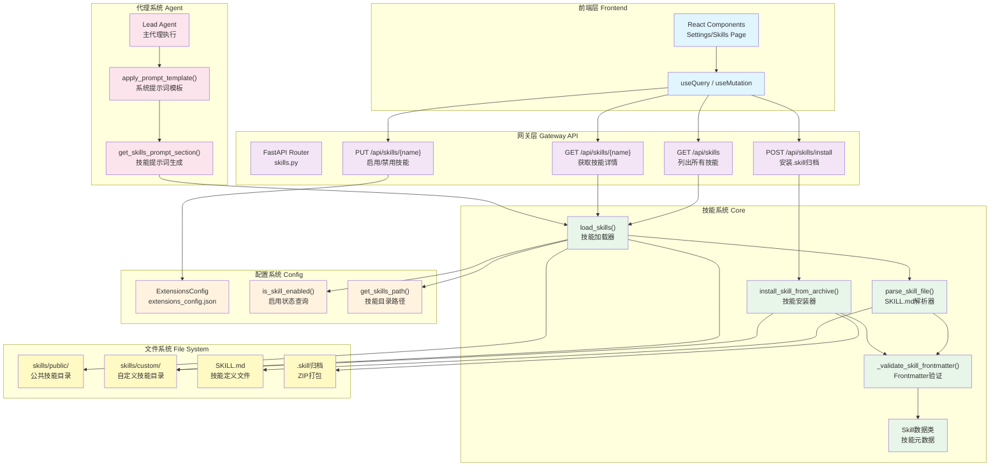

# 【20】技能系统深度解析

## 1. 模块全局定位

- **所属项目**：deer-flow
- **层级位置**：`backend/packages/harness/deerflow/skills/` + `skills/public/` + `skills/custom/` + `backend/app/gateway/routers/skills.py`
- **核心作用**：提供SKILL.md格式的AI代理能力模板系统，支持技能发现、加载、验证、安装与启用/禁用管理
- **业务价值**：作为AI代理的"专家知识库"，将复杂任务的最佳实践封装为可复用技能模板，显著提升代理在特定领域的执行质量与一致性
- **设计初衷**：设计用于解决"代理能力可复用性与可维护性"问题——将数据分析、PPT生成、Web设计等复杂任务的完整工作流标准化为技能模板，代理通过`read_file`按需加载并遵循指令执行

## 2. 依赖&调用链路 Mermaid图



### 图表设计解读

该链路图体现了**声明式技能发现 + 按需渐进式加载**的设计逻辑：

1. **双目录技能仓库**：`public/`存储公共技能（版本控制），`custom/`存储用户技能（gitignore），两者通过统一的`load_skills()`扫描发现

2. **Frontmatter元数据驱动**：SKILL.md使用YAML frontmatter定义技能元数据（name、description、license），解析器通过正则提取并验证，无需复杂依赖

3. **运行时启用/禁用**：通过`extensions_config.json`管理技能启用状态，配置变更后代理自动重新加载技能列表，支持动态切换能力集

4. **渐进式加载模式**：技能不在启动时全量加载，而是在系统提示词中列出技能位置，代理通过`read_file`按需读取SKILL.md内容，遵循"Progressive Loading Pattern"

5. **安全归档安装**：.skill文件是ZIP归档，安装器通过安全解压（路径遍历防护、符号链接跳过、大小限制）提取到`custom/`目录

## 3. 核心目录/文件清单

| 文件路径 | 核心职责 | 设计定位 |
|---------|---------|---------|
| `skills/__init__.py` | 模块导出接口 | 统一导出`load_skills`、`Skill`、`install_skill_from_archive`等公共API |
| `skills/loader.py` | 技能发现与加载 | 扫描public/custom目录，解析SKILL.md，合并启用状态配置 |
| `skills/parser.py` | SKILL.md解析器 | 正则提取YAML frontmatter，解析键值对，构建Skill对象 |
| `skills/types.py` | 技能数据模型 | 定义`Skill` dataclass，提供`get_container_path()`等路径计算方法 |
| `skills/validation.py` | Frontmatter验证 | 验证技能名称（hyphen-case）、描述长度、必需字段、允许属性 |
| `skills/installer.py` | 技能安装器 | 解压.skill归档，安全验证，复制到custom目录 |
| `app/gateway/routers/skills.py` | 网关API路由 | 提供技能列表/详情/更新/安装HTTP接口 |
| `agents/lead_agent/prompt.py` | 技能提示词注入 | `get_skills_prompt_section()`生成`<skill_system>`XML块注入系统提示词 |
| `skills/public/*/SKILL.md` | 公共技能定义 | 内置技能模板（data-analysis、ppt-generation等） |
| `skills/custom/*/SKILL.md` | 自定义技能定义 | 用户安装的技能模板 |

## 4. 关键源码深度解析

### 4.1 技能加载器：目录扫描与配置合并

**文件路径**：`/data/deer-flow-main/backend/packages/harness/deerflow/skills/loader.py`

**功能概述**：扫描public/custom目录中的SKILL.md文件，解析元数据，合并启用状态配置

```python
# 第25-101行：load_skills核心实现
def load_skills(skills_path: Path | None = None, use_config: bool = True, enabled_only: bool = False) -> list[Skill]:
    """
    Load all skills from the skills directory.

    Scans both public and custom skill directories, parsing SKILL.md files
    to extract metadata. The enabled state is determined by the skills_state_config.json file.

    Args:
        skills_path: Optional custom path to skills directory.
                     If not provided and use_config is True, uses path from config.
                     Otherwise defaults to deer-flow/skills
        use_config: Whether to load skills path from config (default: True)
        enabled_only: If True, only return enabled skills (default: False)

    Returns:
        List of Skill objects, sorted by name
    """
    if skills_path is None:
        if use_config:
            try:
                from deerflow.config import get_app_config

                config = get_app_config()
                skills_path = config.skills.get_skills_path()
            except Exception:
                # Fallback to default if config fails
                skills_path = get_skills_root_path()
        else:
            skills_path = get_skills_root_path()

    if not skills_path.exists():
        return []

    skills = []

    # Scan public and custom directories
    for category in ["public", "custom"]:
        category_path = skills_path / category
        if not category_path.exists() or not category_path.is_dir():
            continue

        for current_root, dir_names, file_names in os.walk(category_path, followlinks=True):
            # Keep traversal deterministic and skip hidden directories.
            dir_names[:] = sorted(name for name in dir_names if not name.startswith("."))
            if "SKILL.md" not in file_names:
                continue

            skill_file = Path(current_root) / "SKILL.md"
            relative_path = skill_file.parent.relative_to(category_path)

            skill = parse_skill_file(skill_file, category=category, relative_path=relative_path)
            if skill:
                skills.append(skill)

    # Load skills state configuration and update enabled status
    # NOTE: We use ExtensionsConfig.from_file() instead of get_extensions_config()
    # to always read the latest configuration from disk. This ensures that changes
    # made through the Gateway API (which runs in a separate process) are immediately
    # reflected in the LangGraph Server when loading skills.
    try:
        from deerflow.config.extensions_config import ExtensionsConfig

        extensions_config = ExtensionsConfig.from_file()
        for skill in skills:
            skill.enabled = extensions_config.is_skill_enabled(skill.name, skill.category)
    except Exception as e:
        # If config loading fails, default to all enabled
        logger.warning("Failed to load extensions config: %s", e)

    # Filter by enabled status if requested
    if enabled_only:
        skills = [skill for skill in skills if skill.enabled]

    # Sort by name for consistent ordering
    skills.sort(key=lambda s: s.name)

    return skills
```

### 逐行解读（含设计考量）

- **第42-53行（路径解析优先级）**：优先使用配置路径，失败时回退到默认路径；设计考量是"配置驱动"，允许通过config.yaml自定义技能目录位置

- **第60-64行（双类别扫描）**：依次扫描`public`和`custom`目录；设计考量是"职责分离"，公共技能版本控制，自定义技能用户私有

- **第66-68行（确定性遍历）**：排序目录名并跳过隐藏目录；设计考量是"可重复性"，确保技能列表顺序稳定，避免`.`开头的元数据目录（如`.git`）

- **第70-74行（相对路径计算）**：从类别根目录计算相对路径；设计考量是"可移植性"，技能可移动到不同位置而不影响内部引用

- **第80-92行（实时配置读取）**：使用`ExtensionsConfig.from_file()`而非缓存的`get_extensions_config()`；设计考量是"跨进程同步"，Gateway API写操作后LangGraph立即生效，无需重启

- **第91-92行（优雅降级）**：配置加载失败时默认全部启用；设计考量是"容错性"，配置文件缺失不应阻塞系统启动

- **第95-96行（条件过滤）**：`enabled_only=True`时只返回启用技能；设计考量是"按需加载"，系统提示词只需包含启用技能

- **第99行（名称排序）**：按技能名称字母排序；设计考量是"用户体验"，技能列表顺序一致便于查找

---

### 4.2 SKILL.md解析器：Frontmatter提取

**文件路径**：`/data/deer-flow-main/backend/packages/harness/deerflow/skills/parser.py`

**功能概述**：解析SKILL.md文件的YAML frontmatter，提取元数据构建Skill对象

```python
# 第10-68行：parse_skill_file实现
def parse_skill_file(skill_file: Path, category: str, relative_path: Path | None = None) -> Skill | None:
    """
    Parse a SKILL.md file and extract metadata.

    Args:
        skill_file: Path to the SKILL.md file
        category: Category of the skill ('public' or 'custom')

    Returns:
        Skill object if parsing succeeds, None otherwise
    """
    if not skill_file.exists() or skill_file.name != "SKILL.md":
        return None

    try:
        content = skill_file.read_text(encoding="utf-8")

        # Extract YAML front matter
        # Pattern: ---\nkey: value\n---
        front_matter_match = re.match(r"^---\s*\n(.*?)\n---\s*\n", content, re.DOTALL)

        if not front_matter_match:
            return None

        front_matter = front_matter_match.group(1)

        # Parse YAML front matter (simple key-value parsing)
        metadata = {}
        for line in front_matter.split("\n"):
            line = line.strip()
            if not line:
                continue
            if ":" in line:
                key, value = line.split(":", 1)
                metadata[key.strip()] = value.strip()

        # Extract required fields
        name = metadata.get("name")
        description = metadata.get("description")

        if not name or not description:
            return None

        license_text = metadata.get("license")

        return Skill(
            name=name,
            description=description,
            license=license_text,
            skill_dir=skill_file.parent,
            skill_file=skill_file,
            relative_path=relative_path or Path(skill_file.parent.name),
            category=category,
            enabled=True,  # Default to enabled, actual state comes from config file
        )
    except Exception as e:
        logger.error("Error parsing skill file %s: %s", skill_file, e)
        return None
```

### 逐行解读（含设计考量）

- **第21-22行（文件验证）**：检查文件存在性与名称；设计考量是"防御性编程"，避免误解析非SKILL.md文件

- **第29行（正则匹配Frontmatter）**：使用`^---\s*\n(.*?)\n---\s*\n`模式；设计考量是"标准兼容"，支持Jekyll/Hugo风格的YAML frontmatter，`\s*`允许破折号后有空格

- **第37-44行（简单键值解析）**：手动按冒号分割而非使用YAML库；设计考量是"零依赖"，避免PyYAML等重量依赖，技能元数据通常是简单键值对

- **第47-51行（必需字段验证）**：name与description为必需；设计考量是"最小可用性"，缺少这两个字段无法在系统提示词中正确展示技能

- **第55-64行（Skill对象构建）**：`enabled=True`作为默认值；设计考量是"乐观默认"，实际启用状态由配置文件决定，这里仅设置初始值

- **第66-68行（异常处理）**：解析失败返回None并记录错误；设计考量是"容错性"，单个技能解析失败不应影响整个技能系统

---

### 4.3 技能验证器：Frontmatter校验规则

**文件路径**：`/data/deer-flow-main/backend/packages/harness/deerflow/skills/validation.py`

**功能概述**：验证SKILL.md frontmatter的格式规范与命名约定

```python
# 第15-85行：_validate_skill_frontmatter实现
def _validate_skill_frontmatter(skill_dir: Path) -> tuple[bool, str, str | None]:
    """Validate a skill directory's SKILL.md frontmatter.

    Args:
        skill_dir: Path to the skill directory containing SKILL.md.

    Returns:
        Tuple of (is_valid, message, skill_name).
    """
    skill_md = skill_dir / "SKILL.md"
    if not skill_md.exists():
        return False, "SKILL.md not found", None

    content = skill_md.read_text(encoding="utf-8")
    if not content.startswith("---"):
        return False, "No YAML frontmatter found", None

    # Extract frontmatter
    match = re.match(r"^---\n(.*?)\n---", content, re.DOTALL)
    if not match:
        return False, "Invalid frontmatter format", None

    frontmatter_text = match.group(1)

    # Parse YAML frontmatter
    try:
        frontmatter = yaml.safe_load(frontmatter_text)
        if not isinstance(frontmatter, dict):
            return False, "Frontmatter must be a YAML dictionary", None
    except yaml.YAMLError as e:
        return False, f"Invalid YAML in frontmatter: {e}", None

    # Check for unexpected properties
    unexpected_keys = set(frontmatter.keys()) - ALLOWED_FRONTMATTER_PROPERTIES
    if unexpected_keys:
        return False, f"Unexpected key(s) in SKILL.md frontmatter: {', '.join(sorted(unexpected_keys))}", None

    # Check required fields
    if "name" not in frontmatter:
        return False, "Missing 'name' in frontmatter", None
    if "description" not in frontmatter:
        return False, "Missing 'description' in frontmatter", None

    # Validate name
    name = frontmatter.get("name", "")
    if not isinstance(name, str):
        return False, f"Name must be a string, got {type(name).__name__}", None
    name = name.strip()
    if not name:
        return False, "Name cannot be empty", None

    # Check naming convention (hyphen-case: lowercase with hyphens)
    if not re.match(r"^[a-z0-9-]+$", name):
        return False, f"Name '{name}' should be hyphen-case (lowercase letters, digits, and hyphens only)", None
    if name.startswith("-") or name.endswith("-") or "--" in name:
        return False, f"Name '{name}' cannot start/end with hyphen or contain consecutive hyphens", None
    if len(name) > 64:
        return False, f"Name is too long ({len(name)} characters). Maximum is 64 characters.", None

    # Validate description
    description = frontmatter.get("description", "")
    if not isinstance(description, str):
        return False, f"Description must be a string, got {type(description).__name__}", None
    description = description.strip()
    if description:
        if "<" in description or ">" in description:
            return False, "Description cannot contain angle brackets (< or >)", None
        if len(description) > 1024:
            return False, f"Description is too long ({len(description)} characters). Maximum is 1024 characters.", None

    return True, "Skill is valid!", name
```

### 逐行解读（含设计考量）

- **第48-50行（意外属性检测）**：检查frontmatter中是否包含非允许的键；设计考量是"显式模式"，只定义已知属性，避免意外污染系统提示词

- **第56-73行（命名约定强制）**：强制hyphen-case（小写字母、数字、连字符）；设计考量是"一致性"，技能名称作为配置键与文件名，需符合跨平台命名规范

- **第67-68行（边缘情况处理）**：禁止名称首尾连字符与连续连字符；设计考量是"避免歧义"，`-skill`可能被解析为命令参数，`skill--name`可能被误解析

- **第72行（长度限制）**：名称最大64字符；设计考量是"可用性"，过长名称在配置文件与UI中显示不佳

- **第80-81行（HTML标签禁止）**：描述中禁止`<`与`>`；设计考量是"安全性"，防止注入HTML标签破坏XML格式的系统提示词

- **第82-83行（描述长度限制）**：描述最大1024字符；设计考量是"Token效率"，系统提示词中技能描述占用Token，过长影响上下文容量

---

### 4.4 技能安装器：安全解压与归档处理

**文件路径**：`/data/deer-flow-main/backend/packages/harness/deerflow/skills/installer.py`

**功能概述**：解压.skill归档文件，执行安全验证，安装到custom目录

```python
# 第73-114行：安全解压实现
def safe_extract_skill_archive(
    zip_ref: zipfile.ZipFile,
    dest_path: Path,
    max_total_size: int = 512 * 1024 * 1024,
) -> None:
    """Safely extract a skill archive with security protections.

    Protections:
    - Reject absolute paths and directory traversal (..).
    - Skip symlink entries instead of materialising them.
    - Enforce a hard limit on total uncompressed size (zip bomb defence).

    Raises:
        ValueError: If unsafe members or size limit exceeded.
    """
    dest_root = dest_path.resolve()
    total_written = 0

    for info in zip_ref.infolist():
        if is_unsafe_zip_member(info):
            raise ValueError(f"Archive contains unsafe member path: {info.filename!r}")

        if is_symlink_member(info):
            logger.warning("Skipping symlink entry in skill archive: %s", info.filename)
            continue

        normalized_name = posixpath.normpath(info.filename.replace("\\", "/"))
        member_path = dest_root.joinpath(*PurePosixPath(normalized_name).parts)
        if not member_path.resolve().is_relative_to(dest_root):
            raise ValueError(f"Zip entry escapes destination: {info.filename!r}")
        member_path.parent.mkdir(parents=True, exist_ok=True)

        if info.is_dir():
            member_path.mkdir(parents=True, exist_ok=True)
            continue

        with zip_ref.open(info) as src, member_path.open("wb") as dst:
            while chunk := src.read(65536):
                total_written += len(chunk)
                if total_written > max_total_size:
                    raise ValueError("Skill archive is too large or appears highly compressed.")
                dst.write(chunk)
```

### 逐行解读（含设计考量）

- **第90-93行（路径遍历防护）**：检测绝对路径与`..`遍历；设计考量是"安全第一"，防止恶意归档覆盖系统文件

- **第95-97行（符号链接跳过）**：检测并跳过符号链接；设计考量是"防止逃逸"，符号链接可能指向解压目录外的文件

- **第99-102行（二次路径验证）**：使用`is_relative_to`确保解压路径不逃逸；设计考量是"纵深防御"，即使前面检测失败也能阻止路径逃逸

- **第109-114行（Zip炸弹防护）**：限制解压总大小512MB；设计考量是"DoS防护"，防止高压缩比恶意归档耗尽磁盘空间

```python
# 第117-183行：install_skill_from_archive实现
def install_skill_from_archive(
    zip_path: str | Path,
    *,
    skills_root: Path | None = None,
) -> dict:
    """Install a skill from a .skill archive (ZIP).

    Args:
        zip_path: Path to the .skill file.
        skills_root: Override the skills root directory. If None, uses
            the default from config.

    Returns:
        Dict with success, skill_name, message.

    Raises:
        FileNotFoundError: If the file does not exist.
        ValueError: If the file is invalid (wrong extension, bad ZIP,
            invalid frontmatter, duplicate name).
    """
    logger.info("Installing skill from %s", zip_path)
    path = Path(zip_path)
    if not path.is_file():
        if not path.exists():
            raise FileNotFoundError(f"Skill file not found: {zip_path}")
        raise ValueError(f"Path is not a file: {zip_path}")
    if path.suffix != ".skill":
        raise ValueError("File must have .skill extension")

    if skills_root is None:
        skills_root = get_skills_root_path()
    custom_dir = skills_root / "custom"
    custom_dir.mkdir(parents=True, exist_ok=True)

    with tempfile.TemporaryDirectory() as tmp:
        tmp_path = Path(tmp)

        try:
            zf = zipfile.ZipFile(path, "r")
        except FileNotFoundError:
            raise FileNotFoundError(f"Skill file not found: {zip_path}") from None
        except (zipfile.BadZipFile, IsADirectoryError):
            raise ValueError("File is not a valid ZIP archive") from None

        with zf:
            safe_extract_skill_archive(zf, tmp_path)

        skill_dir = resolve_skill_dir_from_archive(tmp_path)

        is_valid, message, skill_name = _validate_skill_frontmatter(skill_dir)
        if not is_valid:
            raise ValueError(f"Invalid skill: {message}")
        if not skill_name or "/" in skill_name or "\\" in skill_name or ".." in skill_name:
            raise ValueError(f"Invalid skill name: {skill_name}")

        target = custom_dir / skill_name
        if target.exists():
            raise SkillAlreadyExistsError(f"Skill '{skill_name}' already exists")

        shutil.copytree(skill_dir, target)
        logger.info("Skill %r installed to %s", skill_name, target)

    return {
        "success": True,
        "skill_name": skill_name,
        "message": f"Skill '{skill_name}' installed successfully",
    }
```

### 逐行解读（含设计考量）

- **第143-144行（扩展名验证）**：强制`.skill`扩展名；设计考量是"类型安全"，避免误将ZIP文件当作技能安装

- **第148-149行（custom目录创建）**：确保`custom/`目录存在；设计考量是"自动初始化"，首次安装时无需手动创建目录

- **第157-162行（ZIP文件验证）**：捕获`BadZipFile`与`IsADirectoryError`；设计考量是"友好错误信息"，明确告知用户文件格式问题

- **第170-172行（技能名称二次验证）**：检查路径分隔符与遍历符；设计考量是"安全加固"，即使frontmatter验证通过，也防止恶意名称逃逸

- **第174-176行（重复检测）**：检查目标目录是否已存在；设计考量是"幂等性"，拒绝覆盖已安装技能，避免意外丢失

- **第176行（复制而非移动）**：使用`copytree`而非`move`；设计考量是"原子性"，安装失败时不破坏原始归档

---

### 4.5 技能提示词生成：渐进式加载模式

**文件路径**：`/data/deer-flow-main/backend/packages/harness/deerflow/agents/lead_agent/prompt.py`

**功能概述**：生成`<skill_system>`XML块，列出启用的技能及其容器路径

```python
# 第383-424行：get_skills_prompt_section实现
def get_skills_prompt_section(available_skills: set[str] | None = None) -> str:
    """Generate the skills prompt section with available skills list.

    Returns the <skill_system>...</skill_system> block listing all enabled skills,
    suitable for injection into any agent's system prompt.
    """
    skills = load_skills(enabled_only=True)

    try:
        from deerflow.config import get_app_config

        config = get_app_config()
        container_base_path = config.skills.container_path
    except Exception:
        container_base_path = "/mnt/skills"

    if not skills:
        return ""

    if available_skills is not None:
        skills = [skill for skill in skills if skill.name in available_skills]

    skill_items = "\n".join(
        f"    <skill>\n        <name>{skill.name}</name>\n        <description>{skill.description}</description>\n        <location>{skill.get_container_file_path(container_base_path)}</location>\n    </skill>" for skill in skills
    )
    skills_list = f"<available_skills>\n{skill_items}\n</available_skills>"

    return f"""<skill_system>
You have access to skills that provide optimized workflows for specific tasks. Each skill contains best practices, frameworks, and references to additional resources.

**Progressive Loading Pattern:**
1. When a user query matches a skill's use case, immediately call `read_file` on the skill's main file using the path attribute provided in the skill tag below
2. Read and understand the skill's workflow and instructions
3. The skill file contains references to external resources under the same folder
4. Load referenced resources only when needed during execution
5. Follow the skill's instructions precisely

**Skills are located at:** {container_base_path}

{skills_list}

</skill_system>"""
```

### 逐行解读（含设计考量）

- **第389行（仅加载启用技能）**：`enabled_only=True`；设计考量是"Token效率"，系统提示词只包含实际可用的技能

- **第394-397行（容器路径配置）**：从config读取`container_path`或使用默认值`/mnt/skills`；设计考量是"虚拟路径适配"，支持Docker沙箱与本地沙箱不同路径映射

- **第402-403行（可选技能过滤）**：`available_skills`参数允许指定子集；设计考量是"灵活性"，支持子代理或特定场景限制可用技能

- **第405-407行（XML格式生成）**：使用`<skill>`标签封装每个技能；设计考量是"结构化提示词"，XML格式便于LLM解析与引用

- **第413-418行（渐进式加载指令）**：明确指示代理`read_file`按需加载；设计考量是"避免Token浪费"，不在系统提示词中展开完整技能内容

---

### 4.6 技能数据模型：路径计算方法

**文件路径**：`/data/deer-flow-main/backend/packages/harness/deerflow/skills/types.py`

**功能概述**：定义Skill数据类，提供容器路径计算方法

```python
# 第5-50行：Skill类实现
@dataclass
class Skill:
    """Represents a skill with its metadata and file path"""

    name: str
    description: str
    license: str | None
    skill_dir: Path
    skill_file: Path
    relative_path: Path  # Relative path from category root to skill directory
    category: str  # 'public' or 'custom'
    enabled: bool = False  # Whether this skill is enabled

    @property
    def skill_path(self) -> str:
        """Returns the relative path from the category root (skills/{category}) to this skill's directory"""
        path = self.relative_path.as_posix()
        return "" if path == "." else path

    def get_container_path(self, container_base_path: str = "/mnt/skills") -> str:
        """
        Get the full path to this skill in the container.

        Args:
            container_base_path: Base path where skills are mounted in the container

        Returns:
            Full container path to the skill directory
        """
        category_base = f"{container_base_path}/{self.category}"
        skill_path = self.skill_path
        if skill_path:
            return f"{category_base}/{skill_path}"
        return category_base

    def get_container_file_path(self, container_base_path: str = "/mnt/skills") -> str:
        """
        Get the full path to this skill's main file (SKILL.md) in the container.

        Args:
            container_base_path: Base path where skills are mounted in the container

        Returns:
            Full container path to the skill's SKILL.md file
        """
        return f"{self.get_container_path(container_base_path)}/SKILL.md"
```

### 逐行解读（含设计考量）

- **第18-20行（skill_path属性）**：将`.`路径转换为空字符串；设计考量是"路径简洁性"，根目录技能路径为空，避免`/mnt/skills/public/.`这种冗余路径

- **第29-35行（容器路径组合）**：拼接`container_base_path/category/skill_path`；设计考量是"虚拟路径映射"，支持沙箱环境中技能目录挂载到不同位置

- **第40-42行（文件路径封装）**：直接返回SKILL.md完整路径；设计考量是"便利性"，调用者无需手动拼接文件名

---

## 5. 底层设计思想（重点强化，详细拆解）

### 5.1 模块整体设计理念：声明式能力 + 渐进式加载

DeerFlow的技能系统采用了**声明式能力模板**与**渐进式加载模式**相结合的设计理念：

1. **声明式能力模板**：SKILL.md文件以YAML frontmatter声明技能元数据，自然语言描述能力与使用方法，无需编写代码即可定义新技能；代理通过`read_file`按需读取并遵循指令

2. **渐进式加载模式**：系统启动时只扫描技能列表并生成位置索引，不加载完整内容；代理识别到匹配技能后主动调用`read_file`读取SKILL.md，按需加载引用的外部资源

3. **双目录架构**：`public/`存储版本控制的公共技能，`custom/`存储用户私有技能；两者统一扫描但职责分离，支持技能分发与定制

**为什么选用这种思想？**

- **声明式模板**解决了"技能定义门槛"问题——传统方式需要编写Python代码定义工具函数，SKILL.md格式允许非程序员通过自然语言描述能力，显著降低技能创作门槛

- **渐进式加载**解决了"Token效率"问题——系统提示词容量有限，全量加载技能内容会占用大量Token；索引模式只列出位置，代理按需读取，平衡可用性与效率

- **双目录架构**解决了"技能分发"问题——public技能随项目分发，custom技能用户私有，支持官方技能库与用户扩展的生态共存

---

### 5.2 核心痛点解决：技能可维护性与一致性

AI代理执行复杂任务时，不同轮次或不同模型的行为可能不一致，导致用户体验不可预测。技能系统通过**标准化工作流模板**解决此问题：

**解决方案**：SKILL.md文件包含完整的任务执行流程，包括：
1. **触发条件**：明确描述何时使用该技能（如"用户上传Excel/CSV文件并请求数据分析"）
2. **执行步骤**：分步说明操作流程（如先inspect文件结构，再执行SQL查询）
3. **参数规范**：定义每个参数的含义与用法（如`--files`、`--action`、`--sql`）
4. **输出格式**：规定结果展示方式（如表格、CSV导出、JSON）

**为什么这样设计？**

- **可维护性**：技能逻辑集中在SKILL.md文件中，修改工作流只需编辑Markdown，无需改代码
- **一致性**：代理严格遵循技能指令，每次执行相同任务的步骤一致，结果可预测
- **可复用性**：技能模板可跨项目共享，相同类型任务使用相同技能，避免重复定义

**权衡与取舍**：

- **灵活性降低**：代理必须遵循技能指令，无法自适应调整工作流；解决方案是允许代理在技能框架内灵活选择参数与策略
- **Token消耗**：复杂技能的SKILL.md可能长达数百行；解决方案是渐进式加载，只在需要时读取

---

### 5.3 行业对比优势：自然语言技能定义

大多数AI代理系统通过编写代码（Python函数、LangChain Tool）扩展能力，DeerFlow的技能系统允许**纯Markdown定义**，这是**差异化创新**：

**对比分析**：

| 特性 | 代码定义（LangChain Tool） | SKILL.md定义（DeerFlow） |
|------|---------------------------|-------------------------|
| **编程门槛** | 需Python知识 | 自然语言即可 |
| **部署方式** | 需重启服务 | 放入目录自动发现 |
| **版本控制** | 代码库管理 | Markdown文件管理 |
| **调试方式** | 代码调试器 | 直接编辑文本 |
| **学习曲线** | 陡峭（需懂框架API） | 平缓（遵循模板） |
| **适用场景** | 需复杂逻辑的工具 | 标准化工作流模板 |

**为什么要做这种差异化设计？**

- **降低技能创作门槛**：领域专家（如数据分析师）无需学习编程即可创建技能，只需描述工作流
- **加速技能迭代**：修改技能只需编辑Markdown，无需重新部署服务
- **提升可读性**：技能内容对人可读，便于知识共享与传承

---

### 5.4 扩展性设计：技能元数据可配置性

SKILL.md frontmatter支持以下可选字段，为未来扩展预留空间：

```yaml
---
name: skill-name
description: Skill description
license: MIT
allowed-tools: [bash, read_file]
metadata:
  version: 1.0.0
  author: Author Name
compatibility:
  min_deerflow_version: "1.0"
  max_deerflow_version: "2.0"
---
```

**扩展点设计**：

1. **allowed-tools**：声明技能依赖的工具列表；未来可实现工具权限检查，禁止无权限代理使用该技能

2. **metadata**：扩展元数据容器；支持自定义字段如`tags`（技能分类）、`complexity`（难度等级）、`estimated_time`（执行时间）

3. **compatibility**：版本兼容性声明；未来可实现技能版本检查，防止不兼容技能加载

**适配未来哪些潜在需求？**

- **技能市场**：基于元数据实现技能搜索、评分、评论
- **技能权限**：基于`allowed-tools`实现细粒度访问控制
- **技能推荐**：基于用户历史使用记录推荐相关技能
- **技能A/B测试**：基于`version`字段实现同一技能多版本对比

---

## 6. 必学核心知识点（可直接复用）

### 6.1 技术点：YAML Frontmatter解析

**设计逻辑**：使用正则提取Markdown文件开头`---`分隔的YAML块，手动解析键值对

**复用场景**：
- 静态站点生成器（Jekyll、Hugo）的页面元数据
- Markdown文档的标题、作者、日期提取
- 技能/模板/配置文件的元数据定义

**实现要点**：
```python
import re

front_matter_match = re.match(r"^---\s*\n(.*?)\n---\s*\n", content, re.DOTALL)
if front_matter_match:
    front_matter = front_matter_match.group(1)
    metadata = {}
    for line in front_matter.split("\n"):
        if ":" in line:
            key, value = line.split(":", 1)
            metadata[key.strip()] = value.strip()
```

### 6.2 技术点：ZIP归档安全解压

**设计逻辑**：检测路径遍历（`..`）、绝对路径、符号链接，限制解压总大小

**复用场景**：
- 插件/扩展安装系统
- 文件上传处理
- 归档解压服务

**实现要点**：
```python
import posixpath
from pathlib import PurePosixPath

def is_unsafe_zip_member(info: zipfile.ZipInfo) -> bool:
    normalized = info.filename.replace("\\", "/")
    if normalized.startswith("/"):
        return True
    path = PurePosixPath(normalized)
    if ".." in path.parts:
        return True
    return False

def safe_extract(zip_ref: zipfile.ZipFile, dest_path: Path, max_size: int = 512 * 1024 * 1024):
    dest_root = dest_path.resolve()
    total_written = 0
    for info in zip_ref.infolist():
        if is_unsafe_zip_member(info):
            raise ValueError(f"Unsafe path: {info.filename}")
        member_path = dest_root.joinpath(*PurePosixPath(info.filename).parts)
        if not member_path.resolve().is_relative_to(dest_root):
            raise ValueError(f"Path traversal: {info.filename}")
        # Extract with size limit...
```

### 6.3 技术点：命名约定强制验证

**设计逻辑**：使用正则表达式强制hyphen-case命名，检查边缘情况（首尾连字符、连续连字符）

**复用场景**：
- 配置键名验证
- 资源名称规范化
- URL路径段生成

**实现要点**：
```python
import re

def validate_skill_name(name: str) -> tuple[bool, str]:
    if not re.match(r"^[a-z0-9-]+$", name):
        return False, "Name must be hyphen-case (lowercase, digits, hyphens)"
    if name.startswith("-") or name.endswith("-"):
        return False, "Name cannot start/end with hyphen"
    if "--" in name:
        return False, "Name cannot contain consecutive hyphens"
    if len(name) > 64:
        return False, "Name too long (max 64 characters)"
    return True, "Valid"
```

### 6.4 工程设计点：渐进式资源加载

**设计逻辑**：启动时只生成资源索引，按需加载完整内容，减少初始内存与Token消耗

**复用场景**：
- 大型文档系统索引
- 模板库按需加载
- 微服务懒加载

**实现要点**：
```python
# 启动时：生成索引
def generate_resource_index():
    resources = []
    for resource_dir in scan_directories():
        metadata = parse_metadata(resource_dir / "META.md")
        resources.append({
            "name": metadata["name"],
            "location": get_container_path(resource_dir)
        })
    return resources

# 运行时：按需加载
def load_resource(location):
    return read_file(location)  # 只在需要时读取
```

### 6.5 最佳实践：双目录架构设计

**设计逻辑**：public目录存储版本控制的公共资源，custom目录存储用户私有资源，统一扫描但职责分离

**复用场景**：
- 插件系统（官方插件 + 用户插件）
- 主题系统（内置主题 + 自定义主题）
- 模板系统（标准模板 + 用户模板）

**实现要点**：
```python
def load_resources():
    resources = []
    for category in ["public", "custom"]:
        category_path = root_dir / category
        for resource_path in scan_directory(category_path):
            resource = parse_resource(resource_path)
            resource.category = category
            resources.append(resource)
    return resources
```

---

## 7. 可直接拷贝复用代码片段

### 7.1 YAML Frontmatter解析器模板

```python
"""YAML frontmatter parser for Markdown files."""

import re
from pathlib import Path
from typing import Any

def parse_frontmatter(file_path: Path) -> dict[str, Any] | None:
    """Parse YAML frontmatter from a Markdown file."""
    content = file_path.read_text(encoding="utf-8")
    match = re.match(r"^---\s*\n(.*?)\n---\s*\n", content, re.DOTALL)
    if not match:
        return None

    frontmatter = match.group(1)
    metadata = {}
    for line in frontmatter.split("\n"):
        line = line.strip()
        if not line or ":" not in line:
            continue
        key, value = line.split(":", 1)
        metadata[key.strip()] = value.strip()
    return metadata
```

### 7.2 安全ZIP解压模板

```python
"""Safe ZIP archive extraction with security protections."""

import posixpath
import zipfile
from pathlib import Path, PurePosixPath

def safe_extract_zip(zip_path: Path, dest_path: Path, max_size: int = 512 * 1024 * 1024):
    """Extract ZIP with path traversal and zip bomb protection."""
    dest_root = dest_path.resolve()
    total_written = 0

    with zipfile.ZipFile(zip_path, "r") as zf:
        for info in zf.infolist():
            # Check for unsafe paths
            normalized = info.filename.replace("\\", "/")
            if normalized.startswith("/") or ".." in normalized:
                raise ValueError(f"Unsafe path: {info.filename}")

            # Resolve destination
            member_path = dest_root.joinpath(*PurePosixPath(normalized).parts)
            if not member_path.resolve().is_relative_to(dest_root):
                raise ValueError(f"Path traversal: {info.filename}")

            # Extract with size limit
            if not info.is_dir():
                member_path.parent.mkdir(parents=True, exist_ok=True)
                with zf.open(info) as src, member_path.open("wb") as dst:
                    while chunk := src.read(65536):
                        total_written += len(chunk)
                        if total_written > max_size:
                            raise ValueError("Archive too large (zip bomb)")
                        dst.write(chunk)
```

### 7.3 技能加载器模板

```python
"""Skill loader with directory scanning and config merging."""

import os
from pathlib import Path

def load_skills(base_path: Path, categories: list[str]) -> list[dict]:
    """Scan skill directories and merge with enabled state config."""
    skills = []

    for category in categories:
        category_path = base_path / category
        if not category_path.exists():
            continue

        for root, dirs, files in os.walk(category_path):
            dirs[:] = [d for d in sorted(dirs) if not d.startswith(".")]
            if "SKILL.md" not in files:
                continue

            skill_file = Path(root) / "SKILL.md"
            metadata = parse_frontmatter(skill_file)
            if metadata:
                metadata["category"] = category
                metadata["enabled"] = is_enabled(metadata["name"])
                skills.append(metadata)

    return sorted(skills, key=lambda s: s["name"])
```

---

## 8. 踩坑提醒 & 二次开发建议

### 8.1 踩坑提醒

1. **SKILL.md编码问题**
   - **问题**：非UTF-8编码（如GBK）导致解析失败
   - **原因**：`read_text(encoding="utf-8")`默认UTF-8
   - **解决**：确保所有SKILL.md文件使用UTF-8编码

2. **Windows路径分隔符**
   - **问题**：技能名称包含`\`导致路径逃逸检测失效
   - **原因**：Windows使用`\`作为路径分隔符
   - **解决**：安装器中检测`/`、`\`、`..`三种分隔符

3. **相对路径边界情况**
   - **问题**：根目录技能的`relative_path`为`.`，拼接路径产生冗余
   - **原因**：`Path(".").as_posix()`返回`.`
   - **解决**：`skill_path`属性将`.`转换为空字符串

4. **配置更新延迟**
   - **问题**：Gateway API更新技能启用状态后，LangGraph未立即生效
   - **原因**：使用缓存的`get_extensions_config()`而非`from_file()`
   - **解决**：`load_skills`中使用`ExtensionsConfig.from_file()`实时读取

### 8.2 二次开发建议

1. **添加技能依赖管理**
   - **实现**：在frontmatter中添加`depends-on`字段，加载时检查依赖技能是否存在
   - **集成**：`load_skills()`中构建依赖图，拓扑排序确保依赖先加载
   - **注意**：循环依赖检测，避免无限递归

2. **技能版本控制**
   - **实现**：解析`metadata.version`字段，支持同一技能多版本共存
   - **存储**：目录名添加版本后缀，如`data-analysis-v1.0`、`data-analysis-v2.0`
   - **选择**：配置文件中指定默认版本，允许用户切换

3. **技能执行统计**
   - **实现**：在中间件中记录技能使用频率、成功率、执行时间
   - **存储**：将统计数据写入`backend/.deer-flow/skill-stats.json`
   - **应用**：基于统计数据优化技能推荐排序

4. **技能市场集成**
   - **实现**：添加`skills install <url>`命令，从远程仓库下载技能
   - **验证**：安装前检查frontmatter签名，确保来源可信
   - **更新**：支持`skills update <name>`升级到最新版本

5. **技能可视化编辑器**
   - **实现**：前端提供SKILL.md编辑器，实时预览frontmatter验证结果
   - **保存**：通过Gateway API直接写入custom目录
   - **测试**：提供"测试技能"按钮，在临时线程中验证工作流

---

## 9. 文档衔接

本篇完结，下一篇将解析：【21 - 模型工厂与多模型支持系统】

**衔接说明**：
技能系统与模型系统共同构成DeerFlow的"代理能力基础设施"。技能系统定义了"做什么"（工作流模板），模型系统决定了"怎么做"（推理与执行能力）。在代理系统提示词生成时，技能列表与模型选择是两个核心参数——技能决定了可用的工作流，模型决定了推理质量与Token消耗。按此顺序解析是因为技能是应用层模板（更易理解），模型是基础设施层（更底层），理解技能的"按需加载"模式后，模型工厂的"动态选择"逻辑会更易理解。
