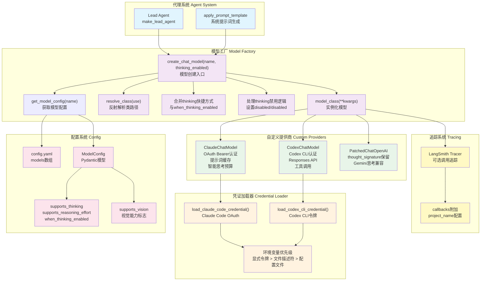

# 【21】模型工厂与多模型支持系统

## 1. 模块全局定位

- **所属项目**：deer-flow
- **层级位置**：`backend/packages/harness/deerflow/models/` + `backend/packages/harness/deerflow/config/model_config.py`
- **核心作用**：提供多LLM模型抽象工厂，支持动态模型选择、推理模式切换、视觉能力检测、OAuth认证自动加载
- **业务价值**：作为AI代理的"模型适配层"，统一管理OpenAI、Anthropic Claude、Google Gemini、DeepSeek等多种LLM提供商，支持运行时切换模型与推理模式
- **设计初衷**：设计用于解决"模型可替换性与配置灵活性"问题——通过工厂模式解耦模型创建逻辑，支持配置文件声明式定义模型，运行时动态实例化

## 2. 依赖&调用链路 Mermaid图



### 图表设计解读

该链路图体现了**工厂模式 + 提供商抽象 + 凭证自动加载**的设计逻辑：

1. **工厂模式解耦**：`create_chat_model`作为统一入口，通过反射动态加载模型类，支持任意LangChain兼容提供商

2. **配置驱动架构**：`config.yaml`中`models`数组声明所有可用模型，每个模型配置独立的类路径、参数、能力标志

3. **思考模式合并**：`thinking`快捷方式与`when_thinking_enabled`配置合并，简化常见场景配置

4. **提供商自定义**：`ClaudeChatModel`、`CodexChatModel`、`PatchedChatOpenAI`等自定义提供商封装认证、协议适配、特性增强逻辑

5. **凭证自动加载**：按优先级从环境变量、文件描述符、配置文件加载OAuth令牌与API密钥，支持Claude Code CLI与Codex CLI凭证

## 3. 核心目录/文件清单

| 文件路径 | 核心职责 | 设计定位 |
|---------|---------|---------|
| `models/__init__.py` | 模块导出接口 | 统一导出`create_chat_model`公共API |
| `models/factory.py` | 模型工厂核心 | `create_chat_model`实现模型创建、配置合并、思考模式处理 |
| `models/claude_provider.py` | Claude自定义提供商 | OAuth Bearer认证、提示词缓存、智能思考预算、billing头注入 |
| `models/openai_codex_provider.py` | Codex自定义提供商 | Codex CLI认证、Responses API协议适配、工具调用序列化 |
| `models/patched_openai.py` | OpenAI补丁提供商 | 保留`thought_signature`字段，支持Gemini思考模式通过OpenAI兼容网关 |
| `models/credential_loader.py` | 凭证加载器 | Claude Code OAuth与Codex CLI令牌自动加载，多源优先级解析 |
| `config/model_config.py` | 模型配置模型 | `ModelConfig` Pydantic类定义，支持思考、视觉、推理能力标志 |
| `config/app_config.py` | 应用配置加载 | `get_model_config(name)`按名称查找模型配置 |

## 4. 关键源码深度解析

### 4.1 模型工厂：动态创建与配置合并

**文件路径**：`/data/deer-flow-main/backend/packages/harness/deerflow/models/factory.py`

**功能概述**：根据配置动态创建模型实例，处理思考模式启用/禁用逻辑，合并配置参数

```python
# 第11-95行：create_chat_model核心实现
def create_chat_model(name: str | None = None, thinking_enabled: bool = False, **kwargs) -> BaseChatModel:
    """Create a chat model instance from the config.

    Args:
        name: The name of the model to create. If None, the first model in the config will be used.

    Returns:
        A chat model instance.
    """
    config = get_app_config()
    if name is None:
        name = config.models[0].name
    model_config = config.get_model_config(name)
    if model_config is None:
        raise ValueError(f"Model {name} not found in config") from None
    model_class = resolve_class(model_config.use, BaseChatModel)
    model_settings_from_config = model_config.model_dump(
        exclude_none=True,
        exclude={
            "use",
            "name",
            "display_name",
            "description",
            "supports_thinking",
            "supports_reasoning_effort",
            "when_thinking_enabled",
            "thinking",
            "supports_vision",
        },
    )
    # Compute effective when_thinking_enabled by merging in the `thinking` shortcut field.
    # The `thinking` shortcut is equivalent to setting when_thinking_enabled["thinking"].
    has_thinking_settings = (model_config.when_thinking_enabled is not None) or (model_config.thinking is not None)
    effective_wte: dict = dict(model_config.when_thinking_enabled) if model_config.when_thinking_enabled else {}
    if model_config.thinking is not None:
        merged_thinking = {**(effective_wte.get("thinking") or {}), **model_config.thinking}
        effective_wte = {**effective_wte, "thinking": merged_thinking}
    if thinking_enabled and has_thinking_settings:
        if not model_config.supports_thinking:
            raise ValueError(f"Model {name} does not support thinking. Set `supports_thinking` to true in the `config.yaml` to enable thinking.") from None
        if effective_wte:
            model_settings_from_config.update(effective_wte)
    if not thinking_enabled and has_thinking_settings:
        if effective_wte.get("extra_body", {}).get("thinking", {}).get("type"):
            # OpenAI-compatible gateway: thinking is nested under extra_body
            kwargs.update({"extra_body": {"thinking": {"type": "disabled"}}})
            kwargs.update({"reasoning_effort": "minimal"})
        elif effective_wte.get("thinking", {}).get("type"):
            # Native langchain_anthropic: thinking is a direct constructor parameter
            kwargs.update({"thinking": {"type": "disabled"}})
    if not model_config.supports_reasoning_effort and "reasoning_effort" in kwargs:
        del kwargs["reasoning_effort"]

    # For Codex Responses API models: map thinking mode to reasoning_effort
    from deerflow.models.openai_codex_provider import CodexChatModel

    if issubclass(model_class, CodexChatModel):
        # The ChatGPT Codex endpoint currently rejects max_tokens/max_output_tokens.
        model_settings_from_config.pop("max_tokens", None)

        # Use explicit reasoning_effort from frontend if provided (low/medium/high)
        explicit_effort = kwargs.pop("reasoning_effort", None)
        if not thinking_enabled:
            model_settings_from_config["reasoning_effort"] = "none"
        elif explicit_effort and explicit_effort in ("low", "medium", "high", "xhigh"):
            model_settings_from_config["reasoning_effort"] = explicit_effort
        elif "reasoning_effort" not in model_settings_from_config:
            model_settings_from_config["reasoning_effort"] = "medium"

    model_instance = model_class(**kwargs, **model_settings_from_config)

    if is_tracing_enabled():
        try:
            from langchain_core.tracers.langchain import LangChainTracer

            tracing_config = get_tracing_config()
            tracer = LangChainTracer(
                project_name=tracing_config.project,
            )
            existing_callbacks = model_instance.callbacks or []
            model_instance.callbacks = [*existing_callbacks, tracer]
            logger.debug(f"LangSmith tracing attached to model '{name}' (project='{tracing_config.project}')")
        except Exception as e:
            logger.warning(f"Failed to attach LangSmith tracing to model '{name}': {e}")
    return model_instance
```

### 逐行解读（含设计考量）

- **第21-22行（默认模型选择）**：`name=None`时使用第一个配置模型；设计考量是"便捷默认"，简化单模型部署场景

- **第24-25行（模型查找）**：通过`get_model_config`按名称查找配置；设计考量是"名称隔离"，配置中的`name`字段作为唯一标识符

- **第26行（反射加载类）**：使用`resolve_class`动态加载模型类；设计考量是"扩展性"，支持任意LangChain兼容提供商而无需修改代码

- **第27-40行（配置过滤）**：排除内部字段（`use`、`supports_thinking`等），只保留提供商参数；设计考量是"参数纯净"，防止内部字段传递给提供商构造函数导致异常

- **第43-47行（thinking快捷方式合并）**：`thinking`字段合并到`when_thinking_enabled["thinking"]`；设计考量是"配置简化"，常见场景只需配置顶层`thinking`而非嵌套结构

- **第48-52行（思考模式启用）**：检查`supports_thinking`标志，合并有效配置；设计考量是"能力验证"，防止不支持的模型启用思考模式导致API错误

- **第53-60行（思考模式禁用）**：显式设置`thinking.type=disabled`；设计考量是"显式禁用"，某些提供商（如Anthropic）需要明确禁用标志才能关闭思考模式

- **第61-62行（推理能力过滤）**：模型不支持`reasoning_effort`时删除参数；设计考量是"参数兼容性"，防止传递不支持的参数导致API错误

- **第67-78行（Codex推理努力映射）**：将思考模式映射到`reasoning_effort`参数；设计考量是"协议适配"，Codex Responses API使用`reasoning_effort`而非`thinking.type`

- **第80行（模型实例化）**：先传入`kwargs`（运行时参数），后传入`model_settings_from_config`（配置参数）；设计考量是"参数优先级"，运行时参数覆盖配置参数

- **第82-94行（LangSmith追踪）**：可选附加追踪回调；设计考量是"可观测性"，支持生产环境追踪模型调用

---

### 4.2 Claude提供商：OAuth认证与提示词缓存

**文件路径**：`/data/deer-flow-main/backend/packages/harness/deerflow/models/claude_provider.py`

**功能概述**：扩展`ChatAnthropic`，支持OAuth Bearer认证、提示词缓存、智能思考预算、billing头注入

```python
# 第44-126行：ClaudeChatModel核心实现
class ClaudeChatModel(ChatAnthropic):
    """ChatAnthropic with OAuth Bearer auth, prompt caching, and smart thinking.

    Config example:
        - name: claude-sonnet-4.6
          use: deerflow.models.claude_provider:ClaudeChatModel
          model: claude-sonnet-4-6
          max_tokens: 16384
          enable_prompt_caching: true
    """

    # Custom fields
    enable_prompt_caching: bool = True
    prompt_cache_size: int = 3
    auto_thinking_budget: bool = True
    retry_max_attempts: int = MAX_RETRIES
    _is_oauth: bool = PrivateAttr(default=False)
    _oauth_access_token: str = PrivateAttr(default="")

    model_config = {"arbitrary_types_allowed": True}

    def _validate_retry_config(self) -> None:
        if self.retry_max_attempts < 1:
            raise ValueError("retry_max_attempts must be >= 1")

    def model_post_init(self, __context: Any) -> None:
        """Auto-load credentials and configure OAuth if needed."""
        from pydantic import SecretStr

        from deerflow.models.credential_loader import (
            OAUTH_ANTHROPIC_BETAS,
            is_oauth_token,
            load_claude_code_credential,
        )

        self._validate_retry_config()

        # Extract actual key value (SecretStr.str() returns '**********')
        current_key = ""
        if self.anthropic_api_key:
            if hasattr(self.anthropic_api_key, "get_secret_value"):
                current_key = self.anthropic_api_key.get_secret_value()
            else:
                current_key = str(self.anthropic_api_key)

        # Try the explicit Claude Code OAuth handoff sources if no valid key.
        if not current_key or current_key in ("your-anthropic-api-key",):
            cred = load_claude_code_credential()
            if cred:
                current_key = cred.access_token
                logger.info(f"Using Claude Code CLI credential (source: {cred.source})")
            else:
                logger.warning("No Anthropic API key or explicit Claude Code OAuth credential found.")

        # Detect OAuth token and configure Bearer auth
        if is_oauth_token(current_key):
            self._is_oauth = True
            self._oauth_access_token = current_key
            # Set the token as api_key temporarily (will be swapped to auth_token on client)
            self.anthropic_api_key = SecretStr(current_key)
            # Add required beta headers for OAuth
            self.default_headers = {
                **(self.default_headers or {}),
                "anthropic-beta": OAUTH_ANTHROPIC_BETAS,
            }
            # OAuth tokens have a limit of 4 cache_control blocks — disable prompt caching
            self.enable_prompt_caching = False
            logger.info("OAuth token detected — will use Authorization: Bearer header")
        else:
            if current_key:
                self.anthropic_api_key = SecretStr(current_key)

        # Ensure api_key is SecretStr
        if isinstance(self.anthropic_api_key, str):
            self.anthropic_api_key = SecretStr(self.anthropic_api_key)

        super().model_post_init(__context__)

        # Patch clients immediately after creation for OAuth Bearer auth.
        # This must happen after super() because clients are lazily created.
        if self._is_oauth:
            self._patch_client_oauth(self._client)
            self._patch_client_oauth(self._async_client)
```

### 逐行解读（含设计考量）

- **第56-60行（自定义字段）**：扩展Pydantic字段支持缓存、思考预算、OAuth状态；设计考量是"功能扩展"，不修改基类情况下添加新功能

- **第69-79行（凭证提取）**：处理`SecretStr`类型，提取实际密钥值；设计考量是"类型兼容"，LangChain使用`SecretStr`保护敏感信息

- **第81-86行（OAuth凭证加载）**：无有效密钥时自动加载Claude Code CLI凭证；设计考量是"开发体验"，Claude Code用户无需手动配置API密钥

- **第99-111行（OAuth检测与配置）**：检测`sk-ant-oat`前缀识别OAuth令牌，添加必需beta头；设计考量是"协议兼容"，OAuth令牌需要特定beta头与认证方式

- **第110行（OAuth禁用缓存）**：OAuth令牌限制4个缓存块，自动禁用提示词缓存；设计考量是"API限制遵守"，防止超出限制导致请求失败

- **第125-126行（客户端补丁）**：交换`api_key`为`auth_token`；设计考量是"SDK适配"，Anthropic Python SDK使用`auth_token`属性存放Bearer令牌

---

### 4.3 凭证加载器：多源优先级解析

**文件路径**：`/data/deer-flow-main/backend/packages/harness/deerflow/models/credential_loader.py`

**功能概述**：按优先级从环境变量、文件描述符、配置文件加载Claude Code OAuth与Codex CLI凭证

```python
# 第149-195行：Claude Code凭证加载实现
def load_claude_code_credential() -> ClaudeCodeCredential | None:
    """Load OAuth credential from explicit Claude Code handoff sources.

    Lookup order:
      1. $CLAUDE_CODE_OAUTH_TOKEN or $ANTHROPIC_AUTH_TOKEN
      2. $CLAUDE_CODE_OAUTH_TOKEN_FILE_DESCRIPTOR
      3. $CLAUDE_CODE_CREDENTIALS_PATH
      4. ~/.claude/.credentials.json

    Exported credentials files contain:
    {
      "claudeAiOauth": {
        "accessToken": "sk-ant-oat01-...",
        "refreshToken": "sk-ant-ort01-...",
        "expiresAt": 1773430695128,
        "scopes": ["user:inference", ...],
        ...
      }
    }
    """
    direct_token = os.getenv("CLAUDE_CODE_OAUTH_TOKEN") or os.getenv("ANTHROPIC_AUTH_TOKEN")
    if direct_token:
        cred = _credential_from_direct_token(direct_token, "claude-cli-env")
        if cred:
            logger.info("Loaded Claude Code OAuth credential from environment")
        return cred

    fd_token = _read_secret_from_file_descriptor("CLAUDE_CODE_OAUTH_TOKEN_FILE_DESCRIPTOR")
    if fd_token:
        cred = _credential_from_direct_token(fd_token, "claude-cli-fd")
        if cred:
            logger.info("Loaded Claude Code OAuth credential from file descriptor")
        return cred

    override_path = os.getenv("CLAUDE_CODE_CREDENTIALS_PATH")
    override_path_obj = Path(override_path).expanduser() if override_path else None
    for cred_path in _iter_claude_code_credential_paths():
        data = _load_json_file(cred_path, "Claude Code credentials")
        if data is None:
            continue
        cred = _extract_claude_code_credential(data, "claude-cli-file")
        if cred:
            source_label = "override path" if override_path_obj is not None and cred_path == override_path_obj else "plaintext file"
            logger.info(f"Loaded Claude Code OAuth credential from {source_label} (expires_at={cred.expires_at})")
            return cred

    return None
```

### 逐行解读（含设计考量）

- **第169-174行（环境变量优先）**：优先检查`CLAUDE_CODE_OAUTH_TOKEN`与`ANTHROPIC_AUTH_TOKEN`；设计考量是"显式优先"，环境变量覆盖文件配置，便于容器化部署

- **第176-181行（文件描述符支持）**：支持通过文件描述符传递令牌；设计考量是"安全性"，文件描述符在进程间传递后立即关闭，避免磁盘残留

- **第183-193行（配置文件回退）**：遍历配置文件路径，优先使用覆盖路径；设计考量是"灵活性"，允许自定义凭证文件位置

- **第142-145行（过期检测）**：检查令牌过期时间，提前1分钟刷新；设计考量是"容错性"，时钟偏差或网络延迟导致临界点过期

```python
# 第88-105行：文件描述符读取实现
def _read_secret_from_file_descriptor(env_var: str) -> str | None:
    fd_value = os.getenv(env_var)
    if not fd_value:
        return None

    try:
        fd = int(fd_value)
    except ValueError:
        logger.warning(f"{env_var} must be an integer file descriptor, got: {fd_value}")
        return None

    try:
        secret = os.read(fd, 1024 * 1024).decode().strip()
    except OSError as e:
        logger.warning(f"Failed to read {env_var}: {e}")
        return None

    return secret or None
```

### 逐行解读（含设计考量）

- **第94-97行（类型转换）**：将字符串转换为整数文件描述符；设计考量是"类型安全"，无效类型时记录警告而非崩溃

- **第99-100行（限制读取大小）**：最多读取1MB；设计考量是"DoS防护"，防止恶意大文件耗尽内存

---

### 4.4 OpenAI Codex提供商：Responses API适配

**文件路径**：`/data/deer-flow-main/backend/packages/harness/deerflow/models/openai_codex_provider.py`

**功能概述**：实现Codex Responses API协议适配，支持工具调用、流式传输、重试机制

```python
# 第105-146行：消息格式转换实现
def _convert_messages(self, messages: list[BaseMessage]) -> tuple[str, list[dict]]:
    """Convert LangChain messages to Responses API format.

    Returns (instructions, input_items).
    """
    instructions_parts: list[str] = []
    input_items = []

    for msg in messages:
        if isinstance(msg, SystemMessage):
            content = self._normalize_content(msg.content)
            if content:
                instructions_parts.append(content)
        elif isinstance(msg, HumanMessage):
            content = self._normalize_content(msg.content)
            input_items.append({"role": "user", "content": content})
        elif isinstance(msg, AIMessage):
            if msg.content:
                content = self._normalize_content(msg.content)
                input_items.append({"role": "assistant", "content": content})
            if msg.tool_calls:
                for tc in msg.tool_calls:
                    input_items.append(
                        {
                            "type": "function_call",
                            "name": tc["name"],
                            "arguments": json.dumps(tc["args"]) if isinstance(tc["args"], dict) else tc["args"],
                            "call_id": tc["id"],
                        }
                    )
        elif isinstance(msg, ToolMessage):
            input_items.append(
                {
                    "type": "function_call_output",
                    "call_id": msg.tool_call_id,
                    "output": self._normalize_content(msg.content),
                }
            )

    instructions = "\n\n".join(instructions_parts) or "You are a helpful assistant."

    return instructions, input_items
```

### 逐行解读（含设计考量）

- **第108-112行（系统消息提取）**：将系统消息合并为`instructions`字符串；设计考量是"协议适配"，Codex Responses API使用独立`instructions`字段而非系统消息

- **第114-116行（用户消息转换）**：HumanMessage转换为`user`角色；设计考量是"角色映射"，LangChain与Codex API角色名称一致

- **第118-125行（AI消息与工具调用）**：拆分AI消息内容与工具调用；设计考量是"结构分离"，Codex API将工具调用作为独立消息类型

- **第127-134行（工具消息转换）**：ToolMessage转换为`function_call_output`；设计考量是"工具结果关联"，通过`call_id`匹配工具调用与结果

- **第137行（默认系统提示词）**：无系统消息时使用默认值；设计考量是"兜底策略"，确保API始终有有效指令

```python
# 第78-103行：内容规范化实现
@classmethod
def _normalize_content(cls, content: Any) -> str:
    """Flatten LangChain content blocks into plain text for Codex."""
    if isinstance(content, str):
        return content

    if isinstance(content, list):
        parts = [cls._normalize_content(item) for item in content]
        return "\n".join(part for part in parts if part)

    if isinstance(content, dict):
        for key in ("text", "output"):
            value = content.get(key)
            if isinstance(value, str):
                return value
        nested_content = content.get("content")
        if nested_content is not None:
            return cls._normalize_content(nested_content)
        try:
            return json.dumps(content, ensure_ascii=False)
        except TypeError:
            return str(content)

    try:
        return json.dumps(content, ensure_ascii=False)
    except TypeError:
        return str(content)
```

### 逐行解读（含设计考量）

- **第80-81行（字符串直接返回）**：字符串内容无需处理；设计考量是"性能优先"，常见类型快速路径

- **第83-85行（列表递归处理）**：列表内容递归规范化并连接；设计考量是"多模态支持"，LangChain内容块列表可能包含文本与图片

- **第87-92行（字典键查找）**：优先查找`text`与`output`键；设计考量是"协议兼容"，不同提供商使用不同键名存储文本内容

- **第94-98行（嵌套内容提取）**：递归处理`content`键；设计考量是"深度遍历"，支持多层嵌套结构

- **第100-103行（JSON兜底）**：无法处理时JSON序列化；设计考量是"降级策略"，确保任意对象可转换为字符串

---

### 4.5 补丁提供商：thought_signature保留

**文件路径**：`/data/deer-flow-main/backend/packages/harness/deerflow/models/patched_openai.py`

**功能概述**：扩展`ChatOpenAI`，保留Gemini思考模式的`thought_signature`字段

```python
# 第57-91行：请求payload覆盖实现
def _get_request_payload(
    self,
    input_: LanguageModelInput,
    *,
    stop: list[str] | None = None,
    **kwargs: Any,
) -> dict:
    """Get request payload with ``thought_signature`` preserved on tool-call objects.

    Overrides the parent method to re-inject ``thought_signature`` fields
    on tool-call objects that were stored in
    ``additional_kwargs["tool_calls"]`` by LangChain but dropped during
    serialisation.
    """
    # Capture the original LangChain messages *before* conversion so we can
    # access fields that the serialiser might drop.
    original_messages = self._convert_input(input_).to_messages()

    # Obtain the base payload from the parent implementation.
    payload = super()._get_request_payload(input_, stop=stop, **kwargs)

    payload_messages = payload.get("messages", [])

    if len(payload_messages) == len(original_messages):
        for payload_msg, orig_msg in zip(payload_messages, original_messages):
            if payload_msg.get("role") == "assistant" and isinstance(orig_msg, AIMessage):
                _restore_tool_call_signatures(payload_msg, orig_msg)
    else:
        # Fallback: match assistant-role entries positionally against AIMessages.
        ai_messages = [m for m in original_messages if isinstance(m, AIMessage)]
        assistant_payloads = [(i, m) for i, m in enumerate(payload_messages) if m.get("role") == "assistant"]
        for (_, payload_msg), ai_msg in zip(assistant_payloads, ai_messages):
            _restore_tool_call_signatures(payload_msg, ai_msg)

    return payload
```

### 逐行解读（含设计考量）

- **第73-74行（原始消息捕获）**：在序列化前捕获原始消息；设计考量是"数据保留"，访问序列化后丢失的字段

- **第76-77行（基类payload获取）**：先调用父类方法获取标准payload；设计考量是"代码复用"，只补充特殊逻辑而非重写整个序列化

- **第80-82行（精确匹配模式）**：payload消息与原始消息数量一致时逐对匹配；设计考量是"准确性"，一对一映射确保签名恢复到正确位置

- **第83-86行（位置匹配回退）**：消息数量不一致时按位置匹配；设计考量是"容错性"，序列化过程可能插入或删除消息

```python
# 第94-132行：签名恢复实现
def _restore_tool_call_signatures(payload_msg: dict, orig_msg: AIMessage) -> None:
    """Re-inject ``thought_signature`` onto tool-call objects in *payload_msg*.

    When the Gemini OpenAI-compatible gateway returns a response with function
    calls, each tool-call object may carry a ``thought_signature``.  LangChain
    stores the raw tool-call dicts in ``additional_kwargs["tool_calls"]`` but
    only serialises the standard fields (``id``, ``type``, ``function``) into
    the outgoing payload, silently dropping the signature.

    This function matches raw tool-call entries (by ``id``, falling back to
    positional order) and copies the signature back onto the serialised
    payload entries.
    """
    raw_tool_calls: list[dict] = orig_msg.additional_kwargs.get("tool_calls") or []
    payload_tool_calls: list[dict] = payload_msg.get("tool_calls") or []

    if not raw_tool_calls or not payload_tool_calls:
        return

    # Build an id → raw_tc lookup for efficient matching.
    raw_by_id: dict[str, dict] = {}
    for raw_tc in raw_tool_calls:
        tc_id = raw_tc.get("id")
        if tc_id:
            raw_by_id[tc_id] = raw_tc

    for idx, payload_tc in enumerate(payload_tool_calls):
        # Try matching by id first, then fall back to positional.
        raw_tc = raw_by_id.get(payload_tc.get("id", ""))
        if raw_tc is None and idx < len(raw_tool_calls):
            raw_tc = raw_tool_calls[idx]

        if raw_tc is None:
            continue

        # The gateway may use either snake_case or camelCase.
        sig = raw_tc.get("thought_signature") or raw_tc.get("thoughtSignature")
        if sig:
            payload_tc["thought_signature"] = sig
```

### 逐行解读（含设计考量）

- **第113-117行（ID索引构建）**：按工具调用ID建立查找表；设计考量是"性能优化"，O(1)查找替代线性搜索

- **第120-124行（ID优先匹配）**：优先通过ID匹配原始工具调用；设计考量是"准确性"，ID是工具调用的唯一标识符

- **第123行（位置回退）**：ID匹配失败时按位置匹配；设计考量是"容错性"，序列化过程可能丢失ID字段

- **第129-130行（命名兼容）**：支持`thought_signature`与`thoughtSignature`两种命名；设计考量是"协议灵活性"，不同网关使用不同命名约定

---

## 5. 底层设计思想（重点强化，详细拆解）

### 5.1 模块整体设计理念：提供商抽象 + 配置驱动

DeerFlow的模型系统采用了**提供商抽象模式**与**配置驱动架构**相结合的设计理念：

1. **提供商抽象模式**：通过继承LangChain的`BaseChatModel`接口，统一不同LLM提供商的调用方式；自定义提供商（`ClaudeChatModel`、`CodexChatModel`）封装认证、协议适配、特性增强逻辑

2. **配置驱动架构**：`config.yaml`中`models`数组声明所有可用模型，每个模型配置独立的类路径、参数、能力标志（`supports_thinking`、`supports_vision`），运行时通过`create_chat_model(name)`动态实例化

3. **思考模式分层配置**：`thinking`快捷方式与`when_thinking_enabled`嵌套配置合并，简化常见场景配置，同时保留灵活性支持复杂参数

**为什么选用这种思想？**

- **提供商抽象**解决了"多模型兼容性"问题——不同LLM提供商API差异大，统一抽象层让上层代码无需关心底层协议差异

- **配置驱动**解决了"模型可替换性"问题——通过配置文件声明模型，无需修改代码即可切换模型，支持A/B测试与模型迁移

- **思考模式分层**解决了"配置复杂度"问题——大多数场景只需配置`thinking: {type: enabled}`，复杂场景可配置`when_thinking_enabled`嵌套参数

---

### 5.2 核心痛点解决：OAuth认证自动化

Claude Code CLI使用OAuth令牌而非传统API密钥，认证流程复杂（令牌刷新、过期检测、billing头注入），手动配置困难。模型系统通过**凭证自动加载**解决此问题：

**解决方案**：
1. **多源优先级**：按"环境变量 → 文件描述符 → 配置文件 → 默认路径"优先级加载凭证
2. **自动检测**：通过`sk-ant-oat`前缀自动识别OAuth令牌
3. **客户端补丁**：交换`api_key`为`auth_token`，添加必需beta头
4. **billing头注入**：自动注入`x-anthropic-billing-header`满足OAuth令牌要求

**为什么这样设计？**

- **多源优先级**覆盖不同部署场景——容器化环境通过环境变量传递，本地开发使用文件凭证
- **自动检测**降低配置门槛——用户无需区分API密钥与OAuth令牌，系统自动识别
- **客户端补丁**适配SDK差异——Anthropic Python SDK使用`auth_token`属性存放Bearer令牌，需运行时修改

**权衡与取舍**：

- **OAuth令牌禁用缓存**：OAuth令牌限制4个缓存块，自动禁用提示词缓存；权衡是功能完整性（缓存节省Token）与API限制遵守

---

### 5.3 行业对比优势：协议兼容性增强

大多数LangChain应用直接使用标准提供商（`ChatOpenAI`、`ChatAnthropic`），DeerFlow通过**自定义提供商**解决协议兼容性问题：

**对比分析**：

| 问题 | 标准提供商 | DeerFlow自定义提供商 |
|------|-----------|---------------------|
| **Claude Code OAuth** | 不支持 | 自动加载凭证、Bearer认证、billing头注入 |
| **Codex Responses API** | 不支持 | 完整协议适配、工具调用、流式传输 |
| **Gemini thought_signature** | 丢失字段 | 保留`thought_signature`通过OpenAI网关 |
| **提示词缓存** | 需手动配置 | 自动缓存系统提示词（OAuth除外） |
| **思考预算计算** | 不支持 | 根据max_tokens自动计算思考budget |

**为什么要做这些差异化设计？**

- **Claude Code OAuth**支持"开发体验"——Claude Code用户无需手动配置API密钥，系统自动使用登录凭证
- **Codex Responses API**支持"企业集成"——Codex是OpenAI内部模型，通过Responses API访问，需特殊协议适配
- **Gemini thought_signature**支持"跨提供商思考"——Gemini通过OpenAI兼容网关启用思考时，需保留`thought_signature`字段

---

### 5.4 扩展性设计：能力标志系统

`ModelConfig`定义三个核心能力标志：
- `supports_thinking`：模型是否支持扩展思考模式
- `supports_reasoning_effort`：模型是否支持推理努力级别
- `supports_vision`：模型是否支持视觉输入

**扩展点设计**：

1. **运行时验证**：`create_chat_model`中检查`supports_thinking`，防止不支持的模型启用思考模式
2. **中间件适配**：`ViewImageMiddleware`检查`supports_vision`，只为支持视觉的模型添加`view_image`工具
3. **前端展示**：前端根据能力标志显示不同UI选项（如思考模式开关、视觉输入按钮）

**适配未来哪些潜在需求？**

- **能力查询API**：前端可调用`GET /api/models`获取模型能力列表，动态生成UI
- **自动模型选择**：根据任务类型自动选择最合适的模型（如视觉任务选择支持vision的模型）
- **能力降级**：当首选模型不可用时，自动降级到具备相同能力的备用模型

---

## 6. 必学核心知识点（可直接复用）

### 6.1 技术点：工厂模式 + 反射加载

**设计逻辑**：通过类路径字符串（如`langchain_openai:ChatOpenAI`）动态加载模型类

**复用场景**：
- 插件系统加载
- 驱动程序动态加载
- 多策略算法选择

**实现要点**：
```python
from deerflow.reflection import resolve_class
from langchain.chat_models import BaseChatModel

model_class = resolve_class("langchain_openai:ChatOpenAI", BaseChatModel)
model_instance = model_class(api_key="sk-...", model="gpt-4")
```

### 6.2 技术点：配置合并策略

**设计逻辑**：快捷方式字段与嵌套配置合并，运行时参数覆盖配置参数

**复用场景**：
- CLI参数与配置文件合并
- 用户设置与默认值合并
- 多环境配置覆盖

**实现要点**：
```python
# 快捷方式合并
effective_wte = dict(config.when_thinking_enabled or {})
if config.thinking is not None:
    merged_thinking = {**(effective_wte.get("thinking") or {}), **config.thinking}
    effective_wte["thinking"] = merged_thinking

# 运行时参数覆盖配置参数
model_instance = model_class(**runtime_kwargs, **config_kwargs)
```

### 6.3 技术点：OAuth令牌检测

**设计逻辑**：通过令牌前缀识别认证类型（`sk-ant-oat`为OAuth）

**复用场景**：
- 多认证方式自动检测
- 凭证类型路由
- 安全策略应用

**实现要点**：
```python
def is_oauth_token(token: str) -> bool:
    return isinstance(token, str) and "sk-ant-oat" in token

if is_oauth_token(current_key):
    # 配置Bearer认证
    headers["anthropic-beta"] = "oauth-2025-04-20,claude-code-20250219"
```

### 6.4 工程设计点：SDK客户端补丁

**设计逻辑**：在对象初始化后修改SDK客户端属性，适配不同认证方式

**复用场景**：
- SDK功能扩展
- 协议适配
- 认证方式切换

**实现要点**：
```python
def model_post_init(self, __context: Any) -> None:
    super().model_post_init(__context)
    if self._is_oauth:
        # 交换api_key为auth_token
        self._client.api_key = None
        self._client.auth_token = self._oauth_access_token
```

### 6.5 最佳实践：能力标志系统

**设计逻辑**：通过布尔标志声明模型能力，运行时验证并适配行为

**复用场景**：
- 功能开关管理
- 条件功能启用
- UI动态生成

**实现要点**：
```python
# 配置声明
model_config = ModelConfig(
    name="claude-sonnet-4.6",
    supports_thinking=True,
    supports_vision=True,
)

# 运行时验证
if thinking_enabled and not model_config.supports_thinking:
    raise ValueError("Model does not support thinking")

# 条件功能适配
if model_config.supports_vision:
    tools.append(view_image_tool)
```

---

## 7. 可直接拷贝复用代码片段

### 7.1 模型工厂模板

```python
"""Model factory with reflection and config merging."""

from typing import Any
from langchain.chat_models import BaseChatModel

def create_model(name: str, **kwargs) -> BaseChatModel:
    """Create model instance from config."""
    config = get_model_config(name)
    model_class = resolve_class(config.use, BaseChatModel)

    # Merge config with runtime kwargs
    config_params = config.model_dump(exclude={"use", "name"})
    return model_class(**kwargs, **config_params)
```

### 7.2 OAuth凭证加载模板

```python
"""OAuth credential loader with multi-source priority."""

import os
from pathlib import Path

def load_oauth_credential() -> str | None:
    """Load OAuth token from multiple sources."""
    # Priority 1: Environment variable
    if token := os.getenv("OAUTH_TOKEN"):
        return token

    # Priority 2: File descriptor
    if fd := os.getenv("OAUTH_TOKEN_FD"):
        return os.read(int(fd), 1024 * 1024).decode().strip()

    # Priority 3: Config file
    cred_path = Path.home() / ".config" / "credentials.json"
    if cred_path.exists():
        import json
        data = json.loads(cred_path.read_text())
        return data.get("oauth_token")

    return None
```

### 7.3 SDK客户端补丁模板

```python
"""SDK client patching for custom auth."""

class CustomChatModel(BaseChatModel):
    def model_post_init(self, __context: Any) -> None:
        super().model_post_init(__context)
        if self.use_oauth:
            # Patch client for OAuth Bearer auth
            self._client.api_key = None
            self._client.auth_token = self.oauth_token
```

---

## 8. 踩坑提醒 & 二次开发建议

### 8.1 踩坑提醒

1. **SecretStr类型处理**
   - **问题**：`anthropic_api_key.str()`返回`**********`而非实际值
   - **原因**：Pydantic的`SecretStr`类型保护敏感信息
   - **解决**：使用`get_secret_value()`方法提取实际值

2. **思考模式禁用语法**
   - **问题**：Anthropic模型禁用思考需设置`thinking: {type: disabled}`
   - **原因**：省略`thinking`参数不会禁用，可能导致意外启用
   - **解决**：显式设置`disabled`类型

3. **Codex max_tokens冲突**
   - **问题**：Codex Responses API拒绝`max_tokens`参数
   - **原因**：Codex使用`reasoning_effort`控制输出长度
   - **解决**：工厂中自动移除`max_tokens`参数

4. **OAuth缓存限制**
   - **问题**：OAuth令牌限制4个`cache_control`块
   - **原因**：Anthropic API对OAuth令牌的缓存限制
   - **解决**：检测OAuth令牌时自动禁用提示词缓存

### 8.2 二次开发建议

1. **添加新提供商**
   - **实现**：继承`BaseChatModel`，实现`_generate`方法
   - **集成**：在`config.yaml`中添加模型配置，`use`字段指向新类
   - **注意**：复用`credential_loader`模式自动加载凭证

2. **自定义思考预算计算**
   - **实现**：在`_get_request_payload`中根据`max_tokens`计算`thinking_budget`
   - **公式**：`thinking_budget = int(max_tokens * THINKING_BUDGET_RATIO)`
   - **应用**：适配不同模型的思考预算策略

3. **添加模型能力检测**
   - **实现**：调用模型API元数据端点检测能力
   - **存储**：缓存检测结果到`backend/.deer-flow/model-capabilities.json`
   - **应用**：自动更新`supports_vision`等标志

4. **实现模型A/B测试**
   - **实现**：在`create_chat_model`中添加`ab_test_percentage`参数
   - **路由**：根据随机数分配用户到不同模型
   - **收集**：记录指标到LangSmith，分析效果差异

5. **添加模型降级策略**
   - **实现**：定义备用模型列表，按优先级尝试
   - **触发**：主模型不可用（API错误、超时、配额耗尽）时降级
   - **保证**：备用模型具备相同能力标志（如都支持vision）

---

## 9. 文档衔接

本篇完结，下一篇将解析：【22 - 配置系统深度解析】

**衔接说明**：
模型系统依赖配置系统获取模型定义与参数，两者是"消费者-提供者"关系。模型工厂通过`get_app_config()`读取配置，配置系统通过`ModelConfig`定义模型结构。在理解模型工厂的"动态创建"逻辑后，配置系统的"分层加载"、"环境变量解析"、"版本管理"机制会更易理解。按此顺序解析是因为模型系统是配置系统的典型消费者，通过实际应用场景理解配置需求，再深入配置实现细节。
