# 【22】配置系统深度解析

## 1. 模块全局定位

- **所属项目**：deer-flow
- **层级位置**：`backend/packages/harness/deerflow/config/`
- **核心作用**：提供统一配置管理、环境变量解析、版本检测、热更新支持
- **业务价值**：作为系统的"配置中枢"，管理模型、沙箱、工具、技能、记忆等20+配置模块，支持多环境部署与运行时热更新
- **设计初衷**：设计用于解决"配置复杂性与可维护性"问题——通过Pydantic模型类型安全、分层加载、单例缓存、mtime热更新，实现配置统一管理

## 2. 依赖&调用链路 Mermaid图

```mermaid
graph TB
    subgraph "配置消费者 Config Consumers"
        AGENT["Lead Agent<br/>get_app_config"]
        FACTORY["Model Factory<br/>create_chat_model"]
        SKILLS["Skills Loader<br/>load_skills"]
        MCP["MCP Client<br/>build_servers_config"]
        GATEWAY["Gateway API<br/>路由处理器"]
    end

    subgraph "配置核心 Config Core"
        GET["get_app_config()<br/>单例获取入口"]
        MTIME["_get_config_mtime<br/>mtime检测"]
        COMPARE["路径与mtime比较<br/>判断是否重载"]
        LOAD["_load_and_cache_app_config<br/>加载并缓存"]
        FROM["AppConfig.from_file<br/>文件解析"]
    end

    subgraph "配置解析 Config Parsing"
        PATH["resolve_config_path<br/>路径解析优先级"]
        VERSION["_check_config_version<br/>版本检测"]
        ENV["resolve_env_variables<br/>环境变量递归解析"]
        YAML["yaml.safe_load<br/>YAML解析"]
        VALIDATE["model_validate<br/>Pydantic验证"]
    end

    subgraph "模块加载 Module Loading"
        TITLE["title_config<br/>标题配置"]
        SUMM["summarization_config<br/>摘要配置"]
        MEM["memory_config<br/>记忆配置"]
        SUB["subagents_config<br/>子代理配置"]
        TOOL["tool_search_config<br/>工具搜索配置"]
        GUARD["guardrails_config<br/>防护栏配置"]
        EXT["extensions_config<br/>扩展配置"]
        ACP["acp_config<br/>ACP代理配置"]
    end

    subgraph "缓存管理 Cache Management"
        SINGLETON["_app_config<br/>全局单例"]
        PATH_CACHE["_app_config_path<br/>缓存路径"]
        MTIME_CACHE["_app_config_mtime<br/>缓存mtime"]
        CUSTOM["_app_config_is_custom<br/>自定义标志"]
    end

    subgraph "配置文件 Config Files"
        YAML_FILE["config.yaml<br/>主配置文件"]
        EXAMPLE["config.example.yaml<br/>示例配置"]
        EXT_FILE["extensions_config.json<br/>扩展配置"]
        ENV_VARS["环境变量<br/>$OPENAI_API_KEY等"]
    end

    AGENT --> GET
    FACTORY --> GET
    SKILLS --> GET
    MCP --> GET
    GATEWAY --> GET

    GET --> MTIME
    GET --> COMPARE
    COMPARE --> LOAD
    LOAD --> FROM

    FROM --> PATH
    FROM --> VERSION
    FROM --> ENV
    FROM --> YAML
    FROM --> VALIDATE

    FROM --> TITLE
    FROM --> SUMM
    FROM --> MEM
    FROM --> SUB
    FROM --> TOOL
    FROM --> GUARD
    FROM --> EXT
    FROM --> ACP

    LOAD --> SINGLETON
    LOAD --> PATH_CACHE
    LOAD --> MTIME_CACHE
    LOAD --> CUSTOM

    PATH --> YAML_FILE
    VERSION --> EXAMPLE
    ENV --> ENV_VARS
    EXT --> EXT_FILE

    classDef consumer fill:#e1f5fe
    classDef core fill:#f3e5f5
    classDef parsing fill:#e8f5e9
    classDef module fill:#fff3e0
    classDef cache fill:#fce4ec
    classDef files fill:#fff9c4

    class AGENT,FACTORY,SKILLS,MCP,GATEWAY consumer
    class GET,MTIME,COMPARE,LOAD,FROM core
    class PATH,VERSION,ENV,YAML,VALIDATE parsing
    class TITLE,SUMM,MEM,SUB,TOOL,GUARD,EXT,ACP module
    class SINGLETON,PATH_CACHE,MTIME_CACHE,CUSTOM cache
    class YAML_FILE,EXAMPLE,EXT_FILE,ENV_VARS files
```



### 图表设计解读

该链路图体现了**单例缓存 + mtime热更新 + 分层加载**的设计逻辑：

1. **单例缓存模式**：`get_app_config()`返回全局单例，避免重复解析配置文件；通过`_app_config`、`_app_config_path`、`_app_config_mtime`三个全局变量管理缓存状态

2. **mtime热更新检测**：每次调用`get_app_config()`时比较当前mtime与缓存mtime，文件修改后自动重新加载；实现配置文件编辑后立即生效

3. **路径解析优先级**：按"显式参数 → 环境变量 → 当前目录 → 父目录"优先级查找配置文件；适配多环境部署场景

4. **版本检测机制**：比较用户配置版本与示例配置版本，过期时发出警告并提示运行`make config-upgrade`

5. **分层模块加载**：主配置文件加载后，依次加载title、summarization、memory等子模块配置，每个模块独立管理全局单例

## 3. 核心目录/文件清单

| 文件路径 | 核心职责 | 设计定位 |
|---------|---------|---------|
| `app_config.py` | 应用配置核心 | `AppConfig`主类，单例管理，mtime热更新，环境变量解析 |
| `model_config.py` | 模型配置模型 | `ModelConfig`定义模型参数、能力标志 |
| `sandbox_config.py` | 沙箱配置模型 | `SandboxConfig`定义沙箱类型、路径映射 |
| `tool_config.py` | 工具配置模型 | `ToolConfig`/`ToolGroupConfig`定义工具注册 |
| `extensions_config.py` | 扩展配置模型 | `ExtensionsConfig`管理MCP服务器与技能状态 |
| `memory_config.py` | 记忆配置模型 | `MemoryConfig`定义记忆存储、更新策略 |
| `summarization_config.py` | 摘要配置模型 | `SummarizationConfig`定义上下文压缩策略 |
| `subagents_config.py` | 子代理配置模型 | `SubagentsConfig`定义并发限制、超时设置 |
| `title_config.py` | 标题配置模型 | `TitleConfig`定义标题生成策略 |
| `tool_search_config.py` | 工具搜索配置模型 | `ToolSearchConfig`定义延迟加载策略 |
| `guardrails_config.py` | 防护栏配置模型 | `GuardrailsConfig`定义工具调用权限 |
| `checkpointer_config.py` | 检查点配置模型 | `CheckpointerConfig`定义状态持久化 |
| `paths.py` | 路径配置工具 | 项目路径解析、目录结构管理 |

## 4. 关键源码深度解析

### 4.1 配置路径解析：多优先级查找

**文件路径**：`/data/deer-flow-main/backend/packages/harness/deerflow/config/app_config.py`

**功能概述**：按优先级查找配置文件，支持显式参数、环境变量、当前目录、父目录

```python
# 第47-74行：resolve_config_path实现
@classmethod
def resolve_config_path(cls, config_path: str | None = None) -> Path:
    """Resolve the config file path.

    Priority:
    1. If provided `config_path` argument, use it.
    2. If provided `DEER_FLOW_CONFIG_PATH` environment variable, use it.
    3. Otherwise, first check the `config.yaml` in the current directory, then fallback to `config.yaml` in the parent directory.
    """
    if config_path:
        path = Path(config_path)
        if not Path.exists(path):
            raise FileNotFoundError(f"Config file specified by param `config_path` not found at {path}")
        return path
    elif os.getenv("DEER_FLOW_CONFIG_PATH"):
        path = Path(os.getenv("DEER_FLOW_CONFIG_PATH"))
        if not Path.exists(path):
            raise FileNotFoundError(f"Config file specified by environment variable `DEER_FLOW_CONFIG_PATH` not found at {path}")
        return path
    else:
        # Check if the config.yaml is in the current directory
        path = Path(os.getcwd()) / "config.yaml"
        if not path.exists():
            # Check if the config.yaml is in the parent directory of CWD
            path = Path(os.getcwd()).parent / "config.yaml"
            if not path.exists():
                raise FileNotFoundError("`config.yaml` file not found at the current directory nor its parent directory")
        return path
```

### 逐行解读（含设计考量）

- **第56-59行（显式参数优先）**：函数参数`config_path`优先级最高；设计考量是"测试友好"，单元测试可指定临时配置文件

- **第61-65行（环境变量覆盖）**：`DEER_FLOW_CONFIG_PATH`环境变量次优先；设计考量是"容器化部署"，Docker/K8s通过环境变量注入配置路径

- **第68-73行（目录回退策略）**：当前目录 → 父目录；设计考量是"项目根目录默认"，backend/子目录启动时自动使用项目根目录配置

- **第73行（明确错误信息）**：配置文件不存在时抛出`FileNotFoundError`；设计考量是"快速失败"，启动时明确告知配置缺失而非使用默认值

---

### 4.2 环境变量递归解析：$前缀替换

**文件路径**：`/data/deer-flow-main/backend/packages/harness/deerflow/config/app_config.py`

**功能概述**：递归遍历配置字典，识别`$`前缀并替换为环境变量值

```python
# 第184-207行：resolve_env_variables实现
@classmethod
def resolve_env_variables(cls, config: Any) -> Any:
    """Recursively resolve environment variables in the config.

    Environment variables are resolved using the `os.getenv` function. Example: $OPENAI_API_KEY

    Args:
        config: The config to resolve environment variables in.

    Returns:
        The config with environment variables resolved.
    """
    if isinstance(config, str):
        if config.startswith("$"):
            env_value = os.getenv(config[1:])
            if env_value is None:
                raise ValueError(f"Environment variable {config[1:]} not found for config value {config}")
            return env_value
        return config
    elif isinstance(config, dict):
        return {k: cls.resolve_env_variables(v) for k, v in config.items()}
    elif isinstance(config, list):
        return [cls.resolve_env_variables(item) for item in config]
    return config
```

### 逐行解读（含设计考量）

- **第196-201行（字符串处理）**：检测`$`前缀，提取环境变量名并替换；设计考量是"显式标记"，`$`前缀明确标识需要替换的值

- **第200行（严格错误）**：环境变量不存在时抛出`ValueError`；设计考量是"配置完整性"，缺失敏感信息（如API密钥）应立即失败而非使用空值

- **第203-204行（字典递归）**：递归处理字典值；设计考量是"深度遍历"，支持嵌套配置结构（如`models[0].api_key`）

- **第205-206行（列表递归）**：递归处理列表元素；设计考量是"数组支持"，处理`models`数组等列表配置

---

### 4.3 配置版本检测：过期警告

**文件路径**：`/data/deer-flow-main/backend/packages/harness/deerflow/config/app_config.py`

**功能概述**：比较用户配置版本与示例配置版本，过期时发出警告

```python
# 第139-182行：_check_config_version实现
@classmethod
def _check_config_version(cls, config_data: dict, config_path: Path) -> None:
    """Check if the user's config.yaml is outdated compared to config.example.yaml.

    Emits a warning if the user's config_version is lower than the example's.
    Missing config_version is treated as version 0 (pre-versioning).
    """
    try:
        user_version = int(config_data.get("config_version", 0))
    except (TypeError, ValueError):
        user_version = 0

    # Find config.example.yaml by searching config.yaml's directory and its parents
    example_path = None
    search_dir = config_path.parent
    for _ in range(5):  # search up to 5 levels
        candidate = search_dir / "config.example.yaml"
        if candidate.exists():
            example_path = candidate
            break
        parent = search_dir.parent
        if parent == search_dir:
            break
        search_dir = parent
    if example_path is None:
        return

    try:
        with open(example_path, encoding="utf-8") as f:
            example_data = yaml.safe_load(f)
        raw = example_data.get("config_version", 0) if example_data else 0
        try:
            example_version = int(raw)
        except (TypeError, ValueError):
            example_version = 0
    except Exception:
        return

    if user_version < example_version:
        logger.warning(
            "Your config.yaml (version %d) is outdated — the latest version is %d. Run `make config-upgrade` to merge new fields into your config.",
            user_version,
            example_version,
        )
```

### 逐行解读（含设计考量）

- **第147-149行（版本号解析）**：缺失`config_version`时默认为0；设计考量是"向后兼容"，版本检测系统引入前的配置文件视为版本0

- **第152-162行（向上搜索示例文件）**：从配置文件目录向上搜索最多5层；设计考量是"灵活定位"，示例文件可能在项目根目录或子目录

- **第177-182行（过期警告）**：用户版本低于示例版本时记录警告；设计考量是"非阻塞提示"，警告不阻止启动，只提醒用户升级

- **第181行（Make命令提示）**：建议运行`make config-upgrade`；设计考量是"操作指引"，明确告知用户如何升级配置

---

### 4.4 单例缓存与热更新：mtime驱动重载

**文件路径**：`/data/deer-flow-main/backend/packages/harness/deerflow/config/app_config.py`

**功能概述**：通过全局单例缓存配置，检测文件mtime变化自动重载

```python
# 第269-294行：get_app_config实现
def get_app_config() -> AppConfig:
    """Get the DeerFlow config instance.

    Returns a cached singleton instance and automatically reloads it when the
    underlying config file path or modification time changes. Use
    `reload_app_config()` to force a reload, or `reset_app_config()` to clear
    the cache.
    """
    global _app_config, _app_config_path, _app_config_mtime

    if _app_config is not None and _app_config_is_custom:
        return _app_config

    resolved_path = AppConfig.resolve_config_path()
    current_mtime = _get_config_mtime(resolved_path)

    should_reload = _app_config is None or _app_config_path != resolved_path or _app_config_mtime != current_mtime
    if should_reload:
        if _app_config_path == resolved_path and _app_config_mtime is not None and current_mtime is not None and _app_config_mtime != current_mtime:
            logger.info(
                "Config file has been modified (mtime: %s -> %s), reloading AppConfig",
                _app_config_mtime,
                current_mtime,
            )
        _load_and_cache_app_config(str(resolved_path))
    return _app_config
```

### 逐行解读（含设计考量）

- **第279-280行（自定义配置短路）**：`_app_config_is_custom=True`时直接返回；设计考量是"测试隔离"，测试注入的mock配置不应被热更新覆盖

- **第285行（重载条件）**：三条件OR判断（无缓存、路径变化、mtime变化）；设计考量是"完整检测"，覆盖所有需要重载的场景

- **第286-291行（变更日志）**：仅当mtime变化时记录日志；设计考量是"信息精确"，路径变化不记录mtime变更日志

- **第293行（加载并缓存）**：调用`_load_and_cache_app_config`更新全局变量；设计考量是"原子操作"，路径、mtime、配置同时更新

```python
# 第257-266行：_load_and_cache_app_config实现
def _load_and_cache_app_config(config_path: str | None = None) -> AppConfig:
    """Load config from disk and refresh cache metadata."""
    global _app_config, _app_config_path, _app_config_mtime, _app_config_is_custom

    resolved_path = AppConfig.resolve_config_path(config_path)
    _app_config = AppConfig.from_file(str(resolved_path))
    _app_config_path = resolved_path
    _app_config_mtime = _get_config_mtime(resolved_path)
    _app_config_is_custom = False
    return _app_config
```

### 逐行解读（含设计考量）

- **第262行（文件解析）**：调用`AppConfig.from_file`解析YAML并验证；设计考量是"复用公共逻辑"，直接复用`from_file`类方法

- **第263-265行（缓存元数据）**：同时更新配置、路径、mtime；设计考量是"一致性"，三个变量必须同步更新

- **第266行（重置自定义标志）**：加载文件后清除`_app_config_is_custom`；设计考量是"状态重置"，文件加载的配置非测试注入

---

### 4.5 分层模块加载：独立全局单例

**文件路径**：`/data/deer-flow-main/backend/packages/harness/deerflow/config/app_config.py`

**功能概述**：主配置加载后，依次加载各子模块配置到独立全局变量

```python
# 第97-134行：子模块配置加载
# Load title config if present
if "title" in config_data:
    load_title_config_from_dict(config_data["title"])

# Load summarization config if present
if "summarization" in config_data:
    load_summarization_config_from_dict(config_data["summarization"])

# Load memory config if present
if "memory" in config_data:
    load_memory_config_from_dict(config_data["memory"])

# Load subagents config if present
if "subagents" in config_data:
    load_subagents_config_from_dict(config_data["subagents"])

# Load tool_search config if present
if "tool_search" in config_data:
    load_tool_search_config_from_dict(config_data["tool_search"])

# Load guardrails config if present
if "guardrails" in config_data:
    load_guardrails_config_from_dict(config_data["guardrails"])

# Load checkpointer config if present
if "checkpointer" in config_data:
    load_checkpointer_config_from_dict(config_data["checkpointer"])

# Load stream bridge config if present
if "stream_bridge" in config_data:
    load_stream_bridge_config_from_dict(config_data["stream_bridge"])

# Always refresh ACP agent config so removed entries do not linger across reloads.
load_acp_config_from_dict(config_data.get("acp_agents", {}))

# Load extensions config separately (it's in a different file)
extensions_config = ExtensionsConfig.from_file()
config_data["extensions"] = extensions_config.model_dump()
```

### 逐行解读（含设计考量）

- **第98-99行（条件加载）**：检查配置键存在后再加载；设计考量是"可选配置"，title等模块可省略

- **第130行（ACP强制刷新）**：无论配置是否存在都调用加载函数；设计考量是"配置清理"，重载时清除已删除的ACP代理配置

- **第133-134行（独立文件加载）**：`extensions_config`从单独文件加载；设计考量是"关注点分离"，MCP与技能配置独立于主配置文件

---

## 5. 底层设计思想（重点强化，详细拆解）

### 5.1 模块整体设计理念：类型安全 + 单例缓存 + 热更新

DeerFlow的配置系统采用了**Pydantic类型安全**、**单例缓存模式**与**mtime热更新**相结合的设计理念：

1. **Pydantic类型安全**：所有配置模块继承`BaseModel`，提供运行时类型验证、默认值、序列化支持；配置错误在启动时暴露而非运行时失败

2. **单例缓存模式**：通过全局变量（`_app_config`、`_app_config_path`、`_app_config_mtime`）缓存配置实例，避免重复解析文件；支持测试注入与重置

3. **mtime热更新**：每次获取配置时比较文件mtime，变化后自动重新加载；实现配置文件编辑后立即生效，无需重启服务

**为什么选用这种思想？**

- **Pydantic类型安全**解决了"配置错误检测滞后"问题——传统方式配置错误在运行时才暴露，Pydantic在启动时验证，快速失败

- **单例缓存**解决了"重复解析开销"问题——配置文件不频繁变化，缓存避免每次调用都解析YAML

- **mtime热更新**解决了"配置更新需重启"问题——开发过程中修改配置后立即生效，提升开发效率

---

### 5.2 核心痛点解决：配置过期检测

配置schema随版本演进添加新字段，用户配置文件可能缺少新字段导致功能缺失。配置系统通过**版本号比较**解决此问题：

**解决方案**：
1. **版本号字段**：`config.example.yaml`中定义`config_version`整数
2. **向上搜索**：从用户配置目录向上搜索最多5层查找示例文件
3. **版本比较**：用户版本低于示例版本时记录警告
4. **Make命令**：提示运行`make config-upgrade`合并新字段

**为什么这样设计？**

- **版本号整数**而非语义化版本（如1.0.0）；设计考量是"简化比较"，整数直接比较大小，无需复杂解析

- **向上搜索示例文件**适配不同目录结构；项目根目录或子目录都可能存放示例文件

- **非阻塞警告**而非阻止启动；设计考量是"兼容性"，过期配置仍可使用，新功能可能缺失但不影响现有功能

**权衡与取舍**：

- **警告频率**：每次启动都检查版本并记录警告；权衡是性能与可发现性，版本检测开销很小（一次文件读取），每次启动提醒用户升级

---

### 5.3 行业对比优势：环境变量严格解析

大多数配置系统使用`${VAR}`语法，环境变量不存在时替换为空字符串。DeerFlow使用`$VAR`语法并**严格报错**，这是**差异化设计**：

**对比分析**：

| 特性 | 替换为空字符串（常见） | DeerFlow严格报错 |
|------|---------------------|-----------------|
| **缺失环境变量** | 静默替换为空 | 抛出ValueError |
| **错误发现时机** | 运行时API调用失败 | 启动时配置加载失败 |
| **错误信息** | "API key invalid" | "Environment variable $OPENAI_API_KEY not found" |
| **适用场景** | 可选参数 | 必需参数（如API密钥） |

**为什么要做这种差异化设计？**

- **安全敏感信息必须显式配置**：API密钥等敏感信息不应静默使用空值，否则可能导致误用测试环境或无效请求

- **快速失败原则**：配置错误在启动时暴露，而非运行时失败，减少调试时间

- **明确错误信息**：直接告知缺失的环境变量名，用户无需猜测哪个参数缺失

---

### 5.4 扩展性设计：自定义配置注入

配置系统支持`set_app_config(config)`注入自定义配置实例，主要用于测试场景：

**扩展点设计**：

1. **测试隔离**：每个测试用例注入独立mock配置，互不干扰
2. **配置切换**：多环境测试（开发/测试/生产）通过注入不同配置模拟
3. **短路热更新**：`_app_config_is_custom=True`时跳过mtime检测，测试中配置不被重载

**适配未来哪些潜在需求？**

- **配置A/B测试**：运行时注入不同配置实例，比较性能差异
- **动态配置源**：从数据库或配置中心加载配置，包装为`AppConfig`实例注入
- **多租户隔离**：每个租户使用独立配置实例，通过租户ID查找并注入

---

## 6. 必学核心知识点（可直接复用）

### 6.1 技术点：Pydantic配置模型

**设计逻辑**：继承`BaseModel`定义配置结构，利用类型验证、默认值、序列化

**复用场景**：
- 应用配置管理
- API请求/响应模型
- 环境变量封装

**实现要点**：
```python
from pydantic import BaseModel, Field

class ModelConfig(BaseModel):
    name: str = Field(..., description="Model name")
    api_key: str = Field(..., description="API key")
    max_tokens: int = Field(default=4096, description="Max tokens")
    supports_thinking: bool = Field(default=False, description="Thinking support")

# Usage
config = ModelConfig(name="gpt-4", api_key="sk-...", max_tokens=8192)
```

### 6.2 技术点：单例缓存模式

**设计逻辑**：通过全局变量缓存实例，首次加载后复用

**复用场景**：
- 数据库连接池
- HTTP客户端
- 配置管理器

**实现要点**：
```python
_app_config: AppConfig | None = None

def get_app_config() -> AppConfig:
    global _app_config
    if _app_config is None:
        _app_config = AppConfig.from_file()
    return _app_config

def reset_app_config() -> None:
    global _app_config
    _app_config = None
```

### 6.3 技术点：mtime热更新

**设计逻辑**：比较文件修改时间，变化后重新加载

**复用场景**：
- 配置文件热更新
- 模板文件重新加载
- 资源文件变更检测

**实现要点**：
```python
import os

_cached_mtime: float | None = None

def should_reload(file_path: str) -> bool:
    global _cached_mtime
    current_mtime = os.path.getmtime(file_path)
    if _cached_mtime is None or current_mtime > _cached_mtime:
        _cached_mtime = current_mtime
        return True
    return False
```

### 6.4 工程设计点：配置路径优先级

**设计逻辑**：按"显式参数 → 环境变量 → 当前目录 → 父目录"优先级查找

**复用场景**：
- CLI工具配置查找
- 框架应用配置加载
- 多环境配置切换

**实现要点**：
```python
def resolve_config_path(config_path: str | None = None) -> Path:
    # 1. Explicit parameter
    if config_path:
        return Path(config_path)

    # 2. Environment variable
    if env_path := os.getenv("CONFIG_PATH"):
        return Path(env_path)

    # 3. Current directory
    if (path := Path.cwd() / "config.yaml").exists():
        return path

    # 4. Parent directory
    return Path.cwd().parent / "config.yaml"
```

### 6.5 最佳实践：环境变量严格解析

**设计逻辑**：检测`$`前缀，环境变量不存在时抛出异常

**复用场景**：
- 敏感信息配置（API密钥、密码）
- 必需参数验证
- 配置完整性检查

**实现要点**：
```python
def resolve_env_variables(config: Any) -> Any:
    if isinstance(config, str) and config.startswith("$"):
        env_value = os.getenv(config[1:])
        if env_value is None:
            raise ValueError(f"Environment variable {config[1:]} not found")
        return env_value
    elif isinstance(config, dict):
        return {k: resolve_env_variables(v) for k, v in config.items()}
    elif isinstance(config, list):
        return [resolve_env_variables(item) for item in config]
    return config
```

---

## 7. 可直接拷贝复用代码片段

### 7.1 Pydantic配置模板

```python
"""Pydantic-based configuration system."""

from pathlib import Path
from typing import Any
import yaml
from pydantic import BaseModel, Field

class AppConfig(BaseModel):
    name: str = Field(..., description="Application name")
    debug: bool = Field(default=False, description="Debug mode")
    log_level: str = Field(default="info", description="Log level")

    @classmethod
    def from_file(cls, path: Path) -> "AppConfig":
        data = yaml.safe_load(path.read_text())
        return cls.model_validate(data)
```

### 7.2 单例缓存模板

```python
"""Singleton cache with hot reload."""

import os
from typing import Optional

_cached_instance: Optional["AppConfig"] = None
_cached_path: Optional[Path] = None
_cached_mtime: Optional[float] = None

def get_config(path: Optional[Path] = None) -> "AppConfig":
    global _cached_instance, _cached_path, _cached_mtime

    if path is None:
        path = Path("config.yaml")

    current_mtime = path.stat().st_mtime
    if _cached_instance is None or _cached_path != path or _cached_mtime != current_mtime:
        _cached_instance = AppConfig.from_file(path)
        _cached_path = path
        _cached_mtime = current_mtime

    return _cached_instance
```

### 7.3 环境变量解析模板

```python
"""Recursive environment variable resolution."""

import os
from typing import Any

def resolve_env(config: Any) -> Any:
    if isinstance(config, str) and config.startswith("$"):
        env_value = os.getenv(config[1:])
        if env_value is None:
            raise ValueError(f"Missing env var: {config[1:]}")
        return env_value
    elif isinstance(config, dict):
        return {k: resolve_env(v) for k, v in config.items()}
    elif isinstance(config, list):
        return [resolve_env(item) for item in config]
    return config
```

---

## 8. 踩坑提醒 & 二次开发建议

### 8.1 踩坑提醒

1. **Pydantic SecretStr处理**
   - **问题**：`SecretStr.str()`返回`**********`而非实际值
   - **原因**：Pydantic保护敏感信息
   - **解决**：使用`get_secret_value()`方法

2. **环境变量递归深度**
   - **问题**：配置嵌套过深导致递归栈溢出
   - **原因**：`resolve_env_variables`使用递归实现
   - **解决**：复杂配置改用迭代实现或限制嵌套层级

3. **mtime精度问题**
   - **问题**：文件修改时间精度为秒，快速修改可能检测不到
   - **原因**：某些文件系统mtime精度为1秒
   - **解决**：合并使用文件大小或inode变化检测

4. **自定义配置短路**
   - **问题**：测试注入配置后，热更新不生效
   - **原因**：`_app_config_is_custom=True`跳过mtime检测
   - **解决**：测试中显式调用`reload_app_config()`

### 8.2 二次开发建议

1. **添加配置验证**
   - **实现**：在`AppConfig.model_post_init`中添加自定义验证逻辑
   - **示例**：验证`api_key`格式、检查`max_tokens`范围
   - **集成**：Pydantic的`model_validator`装饰器

2. **实现配置加密**
   - **实现**：检测加密字段（如`encrypted_api_key`），自动解密
   - **方案**：使用Fernet对称加密或环境变量密钥
   - **存储**：加密值写入YAML，运行时解密后使用

3. **添加配置变更回调**
   - **实现**：配置重载后触发注册的回调函数
   - **应用**：通知下游模块配置已更新（如模型工厂清空模型缓存）
   - **接口**：`register_config_change_callback(callback: Callable)`

4. **实现配置分层覆盖**
   - **实现**：支持`config.base.yaml` + `config.prod.yaml`合并
   - **优先级**：环境特定配置覆盖基础配置
   - **应用**：多环境部署（开发/测试/生产）

5. **添加配置健康检查**
   - **实现**：验证配置有效性（如API密钥可访问、路径存在）
   - **端点**：`GET /api/config/health`返回配置状态
   - **应用**：Kubernetes健康检查、运维监控

---

## 9. 文档衔接

本篇完结，下一篇将解析：【23 - 反射系统与动态模块加载】

**衔接说明**：
配置系统通过`resolve_class`函数使用反射系统动态加载模型类，两者是"配置-执行"关系。配置系统定义"加载什么"（类路径字符串），反射系统实现"如何加载"（模块导入与类实例化）。在理解配置系统的"类路径声明"后，反射系统的"动态解析"逻辑会更易理解。按此顺序解析是因为配置是反射的典型应用场景，通过实际配置理解反射需求，再深入反射实现细节。
