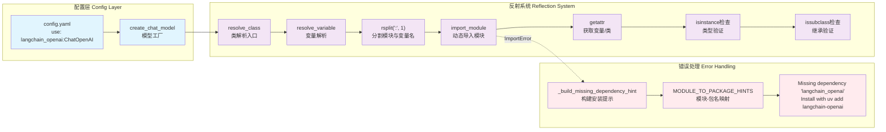

# 【23】反射系统与动态模块加载

## 1. 模块全局定位

- **所属项目**：deer-flow
- **层级位置**：`backend/packages/harness/deerflow/reflection/`
- **核心作用**：提供动态模块导入与类/变量解析能力，支持配置驱动的组件加载
- **业务价值**：作为系统的"动态加载引擎"，实现配置文件中的类路径字符串（如`langchain_openai:ChatOpenAI`）到实际Python类的转换
- **设计初衷**：设计用于解决"扩展性与解耦"问题——通过反射机制，配置系统无需硬编码导入语句，支持用户自定义提供商与工具

## 2. 依赖&调用链路 Mermaid图



### 图表设计解读

该链路图体现了**字符串驱动 + 动态导入 + 类型验证**的设计逻辑：

1. **字符串驱动**：配置文件中的类路径字符串（如`langchain_openai:ChatOpenAI`）作为唯一输入，无需硬编码import语句

2. **动态导入**：通过`import_module`动态加载模块，支持运行时解析任意Python包

3. **类型验证**：两层验证确保类型正确——`isinstance`检查是否为类，`issubclass`检查是否继承基类

4. **友好错误提示**：捕获`ImportError`并构建可操作的安装提示（如`uv add langchain-openai`），降低排查难度

## 3. 核心目录/文件清单

| 文件路径 | 核心职责 | 设计定位 |
|---------|---------|---------|
| `__init__.py` | 模块导出接口 | 统一导出`resolve_class`、`resolve_variable`公共API |
| `resolvers.py` | 反射解析器 | `resolve_class`实现类路径解析，`resolve_variable`实现变量路径解析 |

## 4. 关键源码深度解析

### 4.1 类路径解析：动态导入与继承验证

**文件路径**：`/data/deer-flow-main/backend/packages/harness/deerflow/reflection/resolvers.py`

**功能概述**：解析类路径字符串，动态导入模块并验证类继承关系

```python
# 第73-95行：resolve_class实现
def resolve_class[T](class_path: str, base_class: type[T] | None = None) -> type[T]:
    """Resolve a class from a module path and class name.

    Args:
        class_path: The path to the class (e.g. "langchain_openai:ChatOpenAI").
        base_class: The base class to check if the resolved class is a subclass of.

    Returns:
        The resolved class.

    Raises:
        ImportError: If the module path is invalid or the attribute doesn't exist.
        ValueError: If the resolved object is not a class or not a subclass of base_class.
    """
    model_class = resolve_variable(class_path, expected_type=type)

    if not isinstance(model_class, type):
        raise ValueError(f"{class_path} is not a valid class")

    if base_class is not None and not issubclass(model_class, base_class):
        raise ValueError(f"{class_path} is not a subclass of {base_class.__name__}")

    return model_class
```

### 逐行解读（含设计考量）

- **第87行（委托变量解析）**：调用`resolve_variable`并指定`expected_type=type`；设计考量是"代码复用"，类解析是变量解析的特例（要求类型为`type`）

- **第89-90行（类类型验证）**：检查解析对象是否为类（`isinstance(x, type)`）；设计考量是"类型安全"，防止配置错误指向非类对象（如函数、变量）

- **第92-93行（继承关系验证）**：检查类是否继承指定基类；设计考量是"接口契约"，确保加载的类符合预期接口（如`BaseChatModel`）

---

### 4.2 变量路径解析：模块导入与属性获取

**文件路径**：`/data/deer-flow-main/backend/packages/harness/deerflow/reflection/resolvers.py`

**功能概述**：解析变量路径字符串，动态导入模块并获取属性

```python
# 第25-70行：resolve_variable实现
def resolve_variable[T](
    variable_path: str,
    expected_type: type[T] | tuple[type, ...] | None = None,
) -> T:
    """Resolve a variable from a path.

    Args:
        variable_path: The path to the variable (e.g. "parent_package_name.sub_package_name.module_name:variable_name").
        expected_type: Optional type or tuple of types to validate the resolved variable against.
            If provided, uses isinstance() to check if the variable is an instance of the expected type(s).

    Returns:
        The resolved variable.

    Raises:
        ImportError: If the module path is invalid or the attribute doesn't exist.
        ValueError: If the resolved variable doesn't pass the validation checks.
    """
    try:
        module_path, variable_name = variable_path.rsplit(":", 1)
    except ValueError as err:
        raise ImportError(f"{variable_path} doesn't look like a variable path. Example: parent_package_name.sub_package_name.module_name:variable_name") from err

    try:
        module = import_module(module_path)
    except ImportError as err:
        module_root = module_path.split(".", 1)[0]
        err_name = getattr(err, "name", None)
        if isinstance(err, ModuleNotFoundError) or err_name == module_root:
            hint = _build_missing_dependency_hint(module_path, err)
            raise ImportError(f"Could not import module {module_path}. {hint}") from err
        # Preserve the original ImportError message for non-missing-module failures.
        raise ImportError(f"Error importing module {module_path}: {err}") from err

    try:
        variable = getattr(module, variable_name)
    except AttributeError as err:
        raise ImportError(f"Module {module_path} does not define a {variable_name} attribute/class") from err

    # Type validation
    if expected_type is not None:
        if not isinstance(variable, expected_type):
            type_name = expected_type.__name__ if isinstance(expected_type, type) else " or ".join(t.__name__ for t in expected_type)
            raise ValueError(f"{variable_path} is not an instance of {type_name}, got {type(variable).__name__}")

    return variable
```

### 逐行解读（含设计考量）

- **第44-46行（路径分割）**：使用`rsplit(":", 1)`从右分割一次；设计考量是"冒号作为分隔符"，Python变量命名不允许冒号，适合分隔模块路径与变量名

- **第48-57行（模块导入）**：使用`importlib.import_module`动态导入；设计考量是"标准库优先"，避免使用`__import__`黑魔法

- **第51-55行（缺失依赖检测）**：检查是否为`ModuleNotFoundError`或根模块名缺失；设计考量是"精确诊断"，区分依赖缺失与其他导入错误（如语法错误）

- **第59-62行（属性获取）**：使用`getattr`获取模块属性；设计考量是"统一接口"，函数、类、变量都是模块属性

- **第65-68行（类型验证）**：使用`isinstance`检查类型；设计考量是"运行时类型安全"，Pydantic提供编译时类型，反射需要运行时验证

---

### 4.3 友好错误提示：依赖缺失映射

**文件路径**：`/data/deer-flow-main/backend/packages/harness/deerflow/reflection/resolvers.py`

**功能概述**：构建可操作的依赖缺失提示，自动映射模块名到包名

```python
# 第3-22行：依赖提示实现
MODULE_TO_PACKAGE_HINTS = {
    "langchain_google_genai": "langchain-google-genai",
    "langchain_anthropic": "langchain-anthropic",
    "langchain_openai": "langchain-openai",
    "langchain_deepseek": "langchain-deepseek",
}


def _build_missing_dependency_hint(module_path: str, err: ImportError) -> str:
    """Build an actionable hint when module import fails."""
    module_root = module_path.split(".", 1)[0]
    missing_module = getattr(err, "name", None) or module_root

    # Prefer provider package hints for known integrations, even when the import
    # error is triggered by a transitive dependency (e.g. `google`).
    package_name = MODULE_TO_PACKAGE_HINTS.get(module_root)
    if package_name is None:
        package_name = MODULE_TO_PACKAGE_HINTS.get(missing_module, missing_module.replace("_", "-"))

    return f"Missing dependency '{missing_module}'. Install it with `uv add {package_name}` (or `pip install {package_name}`), then restart DeerFlow."
```

### 逐行解读（含设计考量）

- **第3-8行（模块-包名映射）**：定义Python模块名到PyPI包名的映射；设计考量是"命名差异处理"，模块名使用下划线，包名使用连字符

- **第14行（提取缺失模块名）**：优先使用异常的`name`属性；设计考量是"精确诊断"，`ImportError.name`直接指出缺失的模块名

- **第17-19行（映射优先级）**：优先查找根模块映射，回退到缺失模块映射；设计考量是"传递依赖处理"，导入`langchain_google_genai`时可能缺失`google`模块，映射根模块更准确

- **第20行（兜底替换）**：无映射时将下划线替换为连字符；设计考量是"通用规则"，大多数Python包遵循此命名约定

- **第22行（双命令提示）**：同时提供`uv add`与`pip install`命令；设计考量是"工具兼容性"，uv是新兴工具，pip是传统工具

---

## 5. 底层设计思想（重点强化，详细拆解）

### 5.1 模块整体设计理念：约定优于配置 + 标准库优先

DeerFlow的反射系统采用了**约定路径格式**与**标准库优先**的设计理念：

1. **约定路径格式**：使用`module.path:ClassName`格式，冒号分隔模块路径与类名；避免发明新语法，复用Python社区惯例

2. **标准库优先**：使用`importlib.import_module`而非`__import__`或`exec`；确保代码可读性与安全性

3. **友好错误提示**：捕获`ImportError`并构建可操作的安装提示，降低排查难度

**为什么选用这种思想？**

- **约定路径格式**降低学习成本——开发者熟悉Python模块导入语法，无需学习新格式
- **标准库优先**避免安全风险——`exec`可执行任意代码，`import_module`只能导入模块
- **友好错误提示**提升开发体验——缺失依赖时直接告知安装命令，无需搜索文档

---

### 5.2 核心痛点解决：依赖缺失诊断

动态导入常见问题是依赖缺失导致`ImportError`，错误信息不明确（如`No module named 'langchain_openai'`）。反射系统通过**映射表与提示构建**解决此问题：

**解决方案**：
1. **模块-包名映射**：预定义常见LangChain集成包的模块名到包名映射
2. **异常信息提取**：从`ImportError.name`提取缺失的模块名
3. **优先级查找**：优先查找根模块映射，处理传递依赖场景
4. **兜底规则**：无映射时下划线替换为连字符

**为什么这样设计？**

- **映射表**覆盖常见场景——LangChain生态是主要依赖，预定义映射表覆盖大部分情况
- **优先级查找**处理传递依赖——导入`langchain_google_genai`时可能缺失`google`模块，映射根模块更准确
- **兜底规则**保证通用性——未预定义的包也能生成合理的安装提示

---

## 6. 必学核心知识点（可直接复用）

### 6.1 技术点：动态模块导入

**设计逻辑**：使用`importlib.import_module`动态加载Python模块

**复用场景**：
- 插件系统加载
- 驱动程序动态加载
- 配置驱动的组件实例化

**实现要点**：
```python
from importlib import import_module

def load_class(module_path: str, class_name: str):
    module = import_module(module_path)
    return getattr(module, class_name)

# Usage: load_class("langchain_openai", "ChatOpenAI")
```

### 6.2 技术点：类型验证反射

**设计逻辑**：通过`isinstance`与`issubclass`验证反射对象的类型

**复用场景**：
- 插件接口验证
- 配置驱动的类加载
- 运行时类型检查

**实现要点**：
```python
def resolve_and_validate(class_path: str, base_class: type):
    cls = resolve_class(class_path)
    if not isinstance(cls, type):
        raise ValueError(f"{class_path} is not a class")
    if not issubclass(cls, base_class):
        raise ValueError(f"{class_path} doesn't extend {base_class}")
    return cls
```

### 6.3 工程设计点：友好错误提示

**设计逻辑**：捕获底层异常并构建可操作的提示信息

**复用场景**：
- 依赖缺失提示
- 配置错误诊断
- API调用失败指引

**实现要点**：
```python
def build_hint(error: ImportError) -> str:
    missing = getattr(error, "name", "unknown")
    package = missing.replace("_", "-")
    return f"Missing '{missing}'. Install: pip install {package}"
```

---

## 7. 可直接拷贝复用代码片段

### 7.1 反射解析器模板

```python
"""Dynamic class and variable resolver."""

from importlib import import_module
from typing import Any, Type, TypeVar

T = TypeVar("T")

def resolve_class(class_path: str, base_class: Type[T] | None = None) -> Type[T]:
    """Resolve a class from 'module.path:ClassName' format."""
    module_path, class_name = class_path.rsplit(":", 1)
    module = import_module(module_path)
    cls = getattr(module, class_name)

    if not isinstance(cls, type):
        raise ValueError(f"{class_path} is not a class")

    if base_class and not issubclass(cls, base_class):
        raise ValueError(f"{class_path} doesn't extend {base_class}")

    return cls
```

---

## 8. 文档衔接

本篇完结，下一篇将解析：【24 - 记忆系统深度解析】

**衔接说明**：
反射系统是配置系统的底层支撑，记忆系统是配置系统的典型消费者。记忆系统通过`get_memory_config()`读取配置，配置中的更新策略（如`debounce_seconds`）控制记忆队列行为。在理解反射的"动态加载"后，记忆的"持久化存储"逻辑会更易理解。按此顺序解析是因为反射是基础设施（更底层），记忆是应用功能（更上层）。
