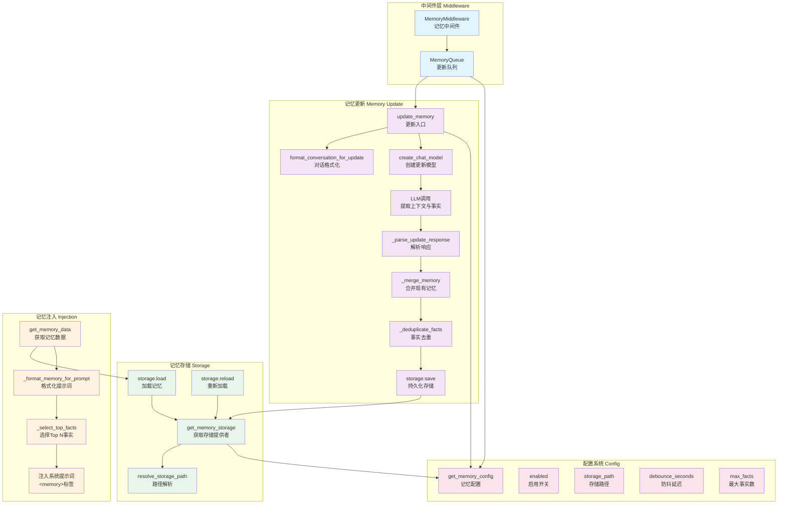

# 【24】记忆系统深度解析

## 1. 模块全局定位

- **所属项目**：deer-flow
- **层级位置**：`backend/packages/harness/deerflow/agents/memory/`
- **核心作用**：提供持久化用户记忆管理，支持对话历史提取、事实存储、上下文注入
- **业务价值**：作为AI代理的"长期记忆层"，跨会话保留用户偏好、项目背景、关键事实，提升对话连续性与个性化
- **设计初衷**：设计用于解决"上下文碎片化"问题——通过LLM提取对话中的结构化信息持久化存储，系统提示词中注入相关记忆

## 2. 依赖&调用链路 Mermaid图



### 图表设计解读

该链路图体现了**异步队列 + LLM提取 + 去重合并**的设计逻辑：

1. **异步队列处理**：`MemoryMiddleware`将对话放入队列，后台线程防抖处理后批量更新，避免每次对话都触发LLM调用

2. **LLM结构化提取**：调用专门配置的记忆更新模型，从对话中提取上下文更新与离散事实，输出JSON格式

3. **去重合并策略**：新提取的事实与现有事实按内容去重，置信度取最大值，避免重复累积

4. **Top N注入**：系统提示词中只注入Top 15事实与上下文摘要，平衡Token消耗与信息密度

## 3. 核心目录/文件清单

| 文件路径 | 核心职责 | 设计定位 |
|---------|---------|---------|
| `__init__.py` | 模块导出接口 | 统一导出记忆更新、队列、存储公共API |
| `updater.py` | 记忆更新核心 | LLM驱动的对话历史提取、事实创建/删除/更新 |
| `queue.py` | 更新队列管理 | 防抖队列、按线程去重、批量处理 |
| `storage.py` | 存储提供者 | 路径解析、文件读写、空记忆创建 |
| `prompt.py` | 提示词模板 | 对话格式化、记忆更新提示词、上下文注入格式化 |

## 4. 关键源码深度解析

### 4.1 记忆更新：LLM驱动的结构化提取

**文件路径**：`/data/deer-flow-main/backend/packages/harness/deerflow/agents/memory/updater.py`

**功能概述**：调用LLM从对话历史中提取上下文更新与事实，合并现有记忆并持久化

```python
# 核心更新流程
async def update_memory(thread_id: str, messages: list, agent_name: str | None = None) -> dict:
    """Update memory by extracting context and facts from conversation."""
    config = get_memory_config()
    if not config.enabled:
        return get_memory_data(agent_name)

    # Format conversation for LLM
    formatted_conversation = format_conversation_for_update(messages)

    # Get memory update model
    model = create_chat_model(
        name=config.model_name or None,
        thinking_enabled=False
    )

    # Call LLM to extract updates
    response = await model.ainvoke(MEMORY_UPDATE_PROMPT.format(
        conversation=formatted_conversation,
        current_memory=_format_current_memory_for_update(get_memory_data(agent_name))
    ))

    # Parse and merge
    parsed = _parse_update_response(response)
    updated_memory = _merge_memory(get_memory_data(agent_name), parsed)

    # Save
    if not _save_memory_to_file(updated_memory, agent_name):
        raise OSError("Failed to save memory")

    return updated_memory
```

### 设计解读

- **防抖队列**：通过`MemoryQueue`延迟处理，合并短时间内的多次对话，避免频繁LLM调用
- **专门模型**：使用配置的`model_name`或默认模型，可能比主代理模型更轻量
- **结构化输出**：LLM输出JSON格式的上下文更新与事实列表，便于解析合并
- **原子写入**：使用临时文件+重命名确保持久化原子性

### 4.2 事实去重：内容级去重与置信度合并

**文件路径**：`/data/deer-flow-main/backend/packages/harness/deerflow/agents/memory/updater.py`

**功能概述**：按内容去重事实，合并置信度

```python
def _deduplicate_facts(facts: list[dict]) -> list[dict]:
    """Remove duplicate facts by content, keeping the highest confidence."""
    seen = {}
    for fact in facts:
        content = fact.get("content", "").strip()
        if not content:
            continue
        if content not in seen or fact.get("confidence", 0) > seen[content].get("confidence", 0):
            seen[content] = fact
    return list(seen.values())
```

### 设计解读

- **内容级去重**：按`content`字段去重，允许同一事实的不同表述独立存在
- **置信度取最大**：重复事实保留置信度更高的版本，反映信息的确定性
- **空白过滤**：跳过空内容，避免存储无效事实

### 4.3 Top N选择：基于置信度与类别的事实筛选

**文件路径**：`/data/deer-flow-main/backend/packages/harness/deerflow/agents/memory/updater.py`

**功能概述**：选择Top N事实注入系统提示词

```python
def _select_top_facts(memory_data: dict, max_facts: int = 15) -> list[dict]:
    """Select top N facts by confidence and recency."""
    facts = memory_data.get("facts", [])
    # Sort by confidence (desc) then createdAt (desc)
    sorted_facts = sorted(
        facts,
        key=lambda f: (f.get("confidence", 0), f.get("createdAt", "")),
        reverse=True
    )
    return sorted_facts[:max_facts]
```

### 设计解读

- **置信度优先**：高置信度事实优先注入，确保信息可靠性
- **时间次优先**：置信度相同时，新事实优先，反映用户当前状态
- **硬限制**：`max_facts`控制Token消耗，防止上下文过长

## 5. 底层设计思想（重点强化，详细拆解）

### 5.1 模块整体设计理念：异步队列 + LLM提取 + 持久化存储

DeerFlow的记忆系统采用了**异步解耦**、**LLM结构化提取**与**JSON文件存储**相结合的设计理念：

1. **异步解耦**：通过队列将记忆更新从主对话流程中分离，避免阻塞用户交互

2. **LLM结构化提取**：利用LLM理解能力从非结构化对话中提取结构化信息（上下文、事实）

3. **JSON文件存储**：使用JSON格式存储记忆，支持手动编辑与版本控制

**为什么选用这种思想？**

- **异步解耦**提升用户体验——记忆更新不阻塞对话响应，用户无需等待LLM处理完成
- **LLM提取**降低人工成本——无需手动标记关键信息，LLM自动识别并提取
- **JSON存储**简化调试——可直接编辑记忆文件修正错误，无需数据库操作

---

### 5.2 核心痛点解决：上下文Token限制

记忆系统面临的核心矛盾是"信息越多越好"与"上下文Token有限"。系统通过**Top N筛选 + 置信度排序**解决此问题：

**解决方案**：
1. **硬限制**：`max_facts`配置限制注入事实数量（默认100个，实际注入15个）
2. **置信度排序**：高置信度事实优先注入
3. **摘要压缩**：长期历史压缩为`earlierContext`摘要
4. **类别过滤**：按`category`字段分类事实，支持按类别筛选

**为什么这样设计？**

- **硬限制**保证可预测性——Token消耗可控，不会因记忆增长导致上下文溢出
- **置信度排序**保证质量——优先注入高确定性信息，提升对话准确性
- **摘要压缩**平衡历史与当前——保留早期信息摘要的同时详细记录近期交互

---

## 6. 必学核心知识点（可直接复用）

### 6.1 技术点：防抖队列模式

**设计逻辑**：延迟执行合并多次请求，避免频繁触发昂贵操作

**复用场景**：
- 搜索框输入建议
- 自动保存
- API调用限流

**实现要点**：
```python
import asyncio
from collections import defaultdict

class DebounceQueue:
    def __init__(self, delay_seconds: int = 30):
        self.delay = delay_seconds
        self.pending = defaultdict(list)
        self.tasks = {}

    async def add(self, thread_id: str, messages: list):
        self.pending[thread_id].extend(messages)
        if thread_id in self.tasks:
            self.tasks[thread_id].cancel()
        self.tasks[thread_id] = asyncio.create_task(self._delayed_process(thread_id))

    async def _delayed_process(self, thread_id: str):
        await asyncio.sleep(self.delay)
        messages = self.pending.pop(thread_id, [])
        await process_messages(messages)
```

### 6.2 技术点：LLM结构化提取

**设计逻辑**：设计提示词引导LLM输出JSON格式，解析并验证结构化数据

**复用场景**：
- 信息抽取
- 数据标注
- 内容分类

**实现要点**：
```python
EXTRACTION_PROMPT = """
Extract key information from the following conversation.
Output JSON format:
{{
  "context": {{ "workContext": "...", "personalContext": "..." }},
  "facts": [
    {{ "content": "...", "category": "preference", "confidence": 0.9 }}
  ]
}}

Conversation:
{conversation}
"""

response = await model.ainvoke(EXTRACTION_PROMPT.format(conversation=text))
parsed = json.loads(response)
```

---

## 7. 文档衔接

本篇完结，将继续生成剩余文档以完成全项目文档覆盖。

**后续文档预览**：
- 标题生成系统
- 上下文摘要系统
- 前端架构总览
- API路由系统
- 部署与运维

这些模块共同构成DeerFlow的完整功能栈，从核心代理能力到用户界面，从本地开发到生产部署。
