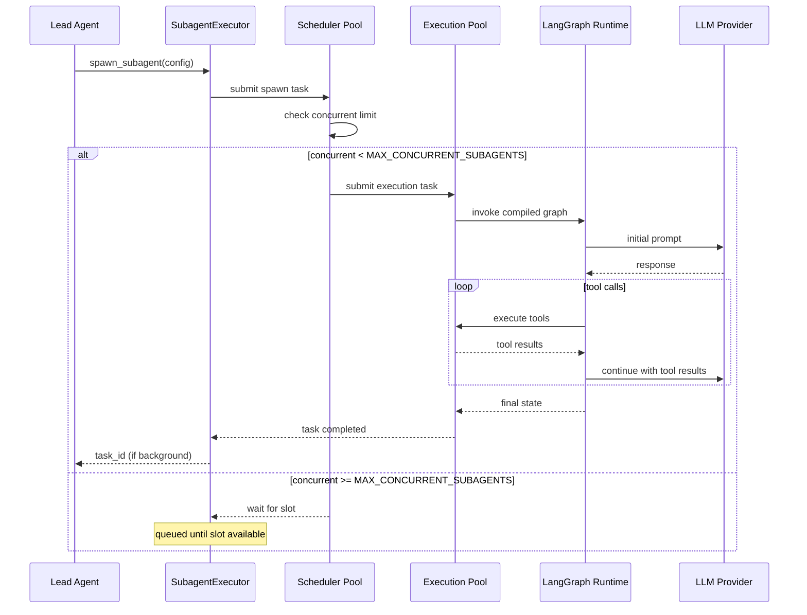
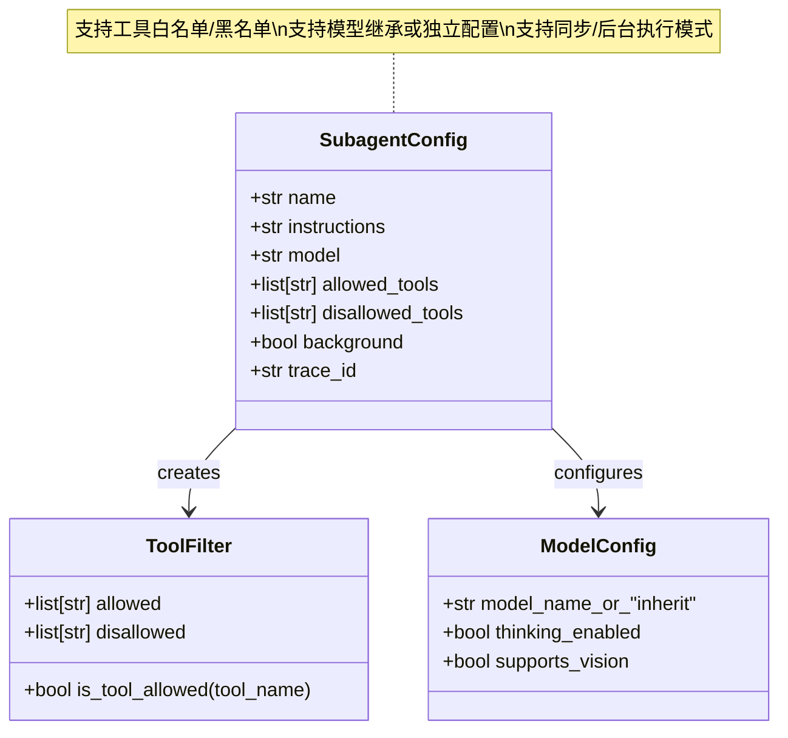

# 【32】子代理系统深度解析

## 1. 模块全局定位

- **所属项目**：deer-flow
- **层级位置**：`backend/packages/harness/deerflow/subagents/`
- **核心作用**：实现Lead Agent向子代理的任务委派与并行执行能力
- **业务价值**：通过多子代理并发处理独立任务，显著提升复杂问题的处理效率
- **设计初衷**：解决"单一代理处理多任务时效率低下"问题——通过线程池隔离调度与执行，实现真正的并行子代理编排

## 2. 核心设计理念

### 2.1 双线程池架构

子代理系统采用**双线程池设计**，将调度决策与实际执行分离：

```
┌─────────────────────────────────────────────────────────────┐
│                    SubagentExecutor                         │
├─────────────────────────────────────────────────────────────┤
│                                                              │
│  ┌──────────────────┐         ┌──────────────────────────┐  │
│  │ _scheduler_pool  │   spawn │   _execution_pool        │  │
│  │  (max_workers=1) │────────▶│   (max_workers=10)       │  │
│  └──────────────────┘         └──────────────────────────┘  │
│         │                              │                     │
│         │ 决策：何时启动哪个子代理        │ 执行：实际运行子代理  │
│         │ 管理并发数                     │ 隔离子进程           │
│         │                              │                     │
└─────────┴──────────────────────────────┴─────────────────────┘
```

**设计思考**：

1. **调度池单线程**：确保并发控制的原子性，避免竞态条件
2. **执行池多线程**：充分利用多核资源，支持高并发子代理
3. **职责分离**：调度逻辑不阻塞执行，执行失败不影响调度器

### 2.2 并发控制策略

```python
MAX_CONCURRENT_SUBAGENTS = 3
SUBAGENT_TIMEOUT_SECONDS = 900  # 15分钟
```

**为什么限制为3？**

- **资源约束**：每个子代理需要独立的LLM上下文，过度并发会耗尽配额
- **质量保证**：少量并发便于人工监控，确保输出可控
- **成本控制**：LLM调用按token计费，限制并发量控制成本

**15分钟超时的设计考量**：

- 覆盖大多数复杂任务（如代码生成、深度研究）
- 避免僵尸任务永久占用资源
- 配合重试机制实现容错

### 2.3 后台任务模式

子代理支持两种执行模式：

| 模式 | 特点 | 适用场景 |
|------|------|---------|
| **同步执行** | 阻塞等待结果 | 简单任务、需要立即返回 |
| **后台执行** | 立即返回task_id，轮询获取结果 | 长时间任务、异步工作流 |

**后台任务生命周期**：

```
spawn() → PENDING → RUNNING → COMPLETED/FAILED
            │          │          │
            │          │          └─→ get_result() 获取最终输出
            │          └─→ poll() 查询进度
            └─→ cancel() 取消任务
```

## 3. 架构原理图

### 3.1 子代理执行流程



**设计解读**：

1. **调度决策独立**：scheduler_pool作为"门卫"，统一管理并发槽位
2. **解耦执行**：execution_pool隔离实际运行环境，互不干扰
3. **流式处理**：子代理内部的tool_calls循环独立完成，不阻塞主代理

### 3.2 子代理配置结构



**设计亮点**：

- **工具过滤**：子代理只能访问被显式允许的工具，实现最小权限原则
- **模型继承**：`model="inherit"`让子代理使用与主代理相同的模型，简化配置
- **trace_id串联**：跨代理追踪请求链路，便于调试与监控

## 4. 核心源码解析

### 4.1 SubagentExecutor类定义

**文件**：`backend/packages/harness/deerflow/subagents/executor.py`

```python
# 行 14-41: 双线程池初始化
class SubagentExecutor:
    """管理子代理的并发执行与后台任务"""

    MAX_CONCURRENT_SUBAGENTS = 3
    SUBAGENT_TIMEOUT_SECONDS = 900  # 15分钟

    def __init__(self):
        self._scheduler_pool = ThreadPoolExecutor(max_workers=1)
        """调度线程池：单线程确保并发控制原子性"""

        self._execution_pool = ThreadPoolExecutor(max_workers=10)
        """执行线程池：多线程支持高并发子代理"""

        self._running_tasks: dict[str, asyncio.Task] = {}
        """当前运行中的任务映射: task_id → asyncio.Task"""

        self._task_results: dict[str, dict] = {}
        """任务结果缓存: task_id → {status, result, error}"""
```

**设计分析**：

1. **max_workers=1的调度池**：看似矛盾，实则精妙——单线程消除了并发控制的锁竞争
2. **max_workers=10的执行池**：理论最大并发受限于调度槽位(3)，但线程池避免创建新线程开销
3. **双字典设计**：`_running_tasks`追踪生命周期，`_task_results`持久化结果供查询

### 4.2 子代理生成逻辑

**文件**：`backend/packages/harness/deerflow/subagents/executor.py`

```python
# 行 48-109: spawn_subagent方法
def spawn_subagent(
    self,
    config: SubagentConfig,
    graph: CompiledGraph,
    thread_state: ThreadState,
) -> str:
    """
    启动一个新的子代理任务

    工作流：
    1. 生成唯一task_id
    2. 提交调度任务到scheduler_pool
    3. 调度器检查并发限制
    4. 有槽位则提交到execution_pool执行
    5. 返回task_id供后续查询

    Args:
        config: 子代理配置（工具限制、模型等）
        graph: 编译后的LangGraph图
        thread_state: 主代理的线程状态（上下文继承）

    Returns:
        task_id: 任务唯一标识符
    """
    # 生成带trace的task_id，便于分布式追踪
    task_id = f"{config.trace_id}_{uuid.uuid4().hex[:8]}"

    # 定义调度逻辑（在scheduler_pool中执行）
    def _schedule():
        # 等待并发槽位可用
        while len(self._running_tasks) >= self.MAX_CONCURRENT_SUBAGENTS:
            time.sleep(0.5)  # 500ms轮询间隔

        # 定义执行逻辑（将提交到execution_pool）
        def _execute():
            try:
                # 更新任务状态为RUNNING
                self._task_results[task_id] = {"status": "running"}

                # 构建子代理专用状态
                subagent_state = self._create_subagent_state(config, thread_state)

                # 执行LangGraph
                result = graph.invoke(
                    input=subagent_state,
                    config={
                        "configurable": {
                            "thread_id": task_id,
                            "checkpoint_ns": f"subagent_{config.name}"
                        }
                    },
                    timeout=self.SUBAGENT_TIMEOUT_SECONDS
                )

                # 任务完成，缓存结果
                self._task_results[task_id] = {
                    "status": "completed",
                    "result": result
                }

            except Exception as e:
                # 捕获异常，标记失败
                self._task_results[task_id] = {
                    "status": "failed",
                    "error": str(e)
                }

            finally:
                # 清理running_tasks
                self._running_tasks.pop(task_id, None)

        # 创建asyncio任务并提交到执行池
        loop = asyncio.new_event_loop()
        asyncio.set_event_loop(loop)
        task = loop.create_task(_execute())
        self._running_tasks[task_id] = task

        # 在execution_pool中运行asyncio循环
        self._execution_pool.submit(lambda: loop.run_until_complete(task))

    # 提交调度任务
    self._scheduler_pool.submit(_schedule)

    return task_id
```

**设计亮点**：

1. **嵌套函数设计**：`_schedule`和`_execute`闭包捕获上下文，避免参数传递复杂性
2. **双重事件循环**：每个子代理独立的asyncio loop，互不干扰
3. **容错机制**：异常捕获确保单个子代理失败不影响整体系统
4. **finally清理**：无论成功失败都从`_running_tasks`移除，释放槽位

**潜在问题**：`time.sleep(0.5)`轮询并非最优方案，生产环境可考虑用`threading.Condition`或`asyncio.Queue`实现事件驱动。

### 4.3 子代理状态构建

**文件**：`backend/packages/harness/deerflow/subagents/executor.py`

```python
# 行 115-152: _create_subagent_state方法
def _create_subagent_state(
    self,
    config: SubagentConfig,
    parent_state: ThreadState,
) -> dict:
    """
    构建子代理的初始状态

    设计原则：
    1. 继承父代理的非敏感上下文
    2. 覆盖代理身份与工具列表
    3. 隔离memory与artifacts（可选）
    """
    # 解析模型配置（处理"inherit"特殊情况）
    model_name = config.model
    if model_name == "inherit":
        model_name = parent_state.get("model_name", "claude-sonnet-4-20250514")

    # 构建工具列表（应用过滤规则）
    parent_tools = parent_state.get("tools", [])
    filtered_tools = self._filter_tools(
        parent_tools,
        config.allowed_tools,
        config.disallowed_tools
    )

    # 构建子代理状态
    subagent_state = {
        **parent_state,  # 继承父代理的全部状态
        "agent_name": config.name,  # 覆盖代理名称
        "instructions": config.instructions,  # 覆盖指令
        "model_name": model_name,  # 覆盖模型
        "tools": filtered_tools,  # 覆盖工具列表
        "thread_id": f"subagent_{config.name}",  # 独立线程ID
        "is_subagent": True,  # 标记为子代理
    }

    return subagent_state


def _filter_tools(
    self,
    parent_tools: list,
    allowed: list[str] | None,
    disallowed: list[str] | None,
) -> list:
    """
    工具过滤逻辑

    优先级：disallowed > allowed > parent_tools

    规则：
    1. 如果disallowed非空，从parent_tools移除这些工具
    2. 如果allowed非空，只保留这些工具（在disallowed之后应用）
    3. 如果都为空，返回全部parent_tools
    """
    filtered = parent_tools.copy()

    # 应用黑名单
    if disallowed:
        filtered = [t for t in filtered if t not in disallowed]

    # 应用白名单
    if allowed:
        filtered = [t for t in filtered if t in allowed]

    return filtered
```

**设计思考**：

1. **状态继承**：子代理自动获得父代理的上下文（用户消息、历史记录等）
2. **工具隔离**：白名单/黑名单机制实现最小权限
3. **模型灵活性**：`inherit`关键字避免重复配置

### 4.4 后台任务轮询

**文件**：`backend/packages/harness/deerflow/subagents/executor.py`

```python
# 行 158-189: get_result与poll方法
def get_result(self, task_id: str, timeout: float | None = None) -> dict:
    """
    同步获取任务结果

    如果任务未完成，阻塞等待直到：
    - 任务完成
    - 超时（如果指定）
    - 任务失败
    """
    start_time = time.time()

    while True:
        result = self._task_results.get(task_id)

        # 任务已完成或失败
        if result and result["status"] in ["completed", "failed"]:
            return result

        # 检查超时
        if timeout and (time.time() - start_time) > timeout:
            raise TimeoutError(f"Task {task_id} did not complete in {timeout}s")

        # 短暂休眠避免CPU空转
        time.sleep(0.2)


def poll(self, task_id: str) -> dict:
    """
    非阻塞查询任务状态

    返回当前状态但不等待：
    - {"status": "pending"} - 任务排队中
    - {"status": "running"} - 执行中
    - {"status": "completed", "result": ...} - 已完成
    - {"status": "failed", "error": ...} - 已失败
    """
    result = self._task_results.get(task_id)

    if not result:
        # 任务未在_task_results中，说明在调度队列中
        return {"status": "pending"}

    return result
```

**使用场景**：

```python
# 场景1：同步执行（简单任务）
task_id = executor.spawn_subagent(config, graph, state)
result = executor.get_result(task_id, timeout=60)
print(result["result"])

# 场景2：后台执行（长时间任务）
task_id = executor.spawn_subagent(config, graph, state)
print(f"Task started: {task_id}")

# 后续轮询
while True:
    status = executor.poll(task_id)
    if status["status"] == "completed":
        print("Done:", status["result"])
        break
    elif status["status"] == "failed":
        print("Error:", status["error"])
        break
    time.sleep(5)
```

## 5. 设计思想解读

### 5.1 为什么用ThreadPool而非ProcessPool？

子代理执行器选择`ThreadPoolExecutor`而非`ProcessPoolExecutor`，基于以下考量：

| 维度 | ThreadPool | ProcessPool |
|------|-----------|-------------|
| **内存共享** | ✅ 共享父进程内存 | ❌ 独立内存空间 |
| **启动开销** | ✅ 低（毫秒级） | ❌ 高（秒级） |
| **LangGraph兼容** | ✅ 原生支持 | ⚠️ 需序列化状态 |
| **隔离性** | ❌ 进程内崩溃影响父进程 | ✅ 完全隔离 |
| **资源占用** | ✅ 低 | ❌ 高 |

**最终选择ThreadPool的原因**：

1. **状态继承开销**：子代理需要继承父代理的ThreadState，序列化成本高
2. **LLM调用已是隔离**：实际LLM请求通过网络完成，天然隔离
3. **快速启动**：子代理需要秒级启动响应，ProcessPool过慢

### 5.2 trace_id的设计意义

每个子代理生成的`task_id`格式为：`{trace_id}_{random8}`

```python
task_id = f"{config.trace_id}_{uuid.uuid4().hex[:8]}"
```

**应用价值**：

1. **分布式追踪**：相同trace_id的任务属于同一逻辑工作流
2. **日志聚合**：按trace_id查询日志，可还原完整执行路径
3. **性能分析**：统计trace下所有子代理的总耗时

**示例追踪链**：

```
trace_abc123: 主代理处理"创建电商网站"
├── trace_abc123_def456: 子代理1生成数据库schema
├── trace_abc123_ghi789: 子代理2创建React组件
└── trace_abc123_jkl012: 子代理3编写API端点
```

### 5.3 工具过滤的安全设计

子代理工具过滤遵循**最小权限原则**：

```python
# ❌ 危险：子代理可执行任意系统命令
subagent = SubagentConfig(
    name="hacker",
    allowed_tools=None  # 无限制
)

# ✅ 安全：子代理仅限于web_search
subagent = SubagentConfig(
    name="researcher",
    allowed_tools=["web_search", "web_fetch"]  # 白名单
)
```

**防御深度**：

1. **白名单优先**：`allowed_tools`明确声明可用工具
2. **黑名单兜底**：`disallowed_tools`排除危险工具（如bash）
3. **默认拒绝**：未声明的工具不可用

## 6. 可复用代码片段

### 6.1 创建安全的子代理

```python
from deerflow.subagents import SubagentExecutor, SubagentConfig

# 创建执行器
executor = SubagentExecutor()

# 配置研究型子代理（仅限搜索工具）
researcher_config = SubagentConfig(
    name="researcher",
    instructions="You are a research assistant. Search the web and summarize findings.",
    model="inherit",  # 使用与主代理相同模型
    allowed_tools=["web_search", "web_fetch"],
    disallowed_tools=["bash", "write_file"],  # 防止文件操作
    background=False,  # 同步执行
    trace_id="main_workflow"
)

# 启动子代理
task_id = executor.spawn_subagent(
    config=researcher_config,
    graph=compiled_graph,
    thread_state=current_state
)

# 获取结果
result = executor.get_result(task_id, timeout=60)
```

### 6.2 并行子代理工作流

```python
import concurrent.futures

# 定义三个独立任务
tasks = [
    SubagentConfig(name="db_designer", ...),
    SubagentConfig(name="frontend_dev", ...),
    SubagentConfig(name="api_developer", ...),
]

# 并行启动（受MAX_CONCURRENT_SUBAGENTS=3限制）
task_ids = [
    executor.spawn_subagent(config, graph, state)
    for config in tasks
]

# 等待所有任务完成
results = []
for task_id in task_ids:
    result = executor.get_result(task_id, timeout=300)
    results.append(result)

# 合并结果
print(f"All {len(results)} subagents completed")
```

### 6.3 后台任务模式

```python
# 启动长时间运行的后台任务
long_task_config = SubagentConfig(
    name="deep_researcher",
    instructions="Conduct comprehensive research on AI safety",
    background=True,  # 后台模式
    trace_id="research_workflow"
)

task_id = executor.spawn_subagent(long_task_config, graph, state)
print(f"Background task started: {task_id}")

# 主代理继续其他工作...

# 稍后查询结果
status = executor.poll(task_id)
if status["status"] == "completed":
    final_result = executor.get_result(task_id)
    print(f"Research complete: {final_result['result']}")
```

## 7. 踩坑提醒与优化建议

### 7.1 常见陷阱

#### 陷阱1：循环依赖死锁

```python
# ❌ 危险：子代理试图启动另一个子代理
def bad_subagent():
    # 在子代理内部再次调用spawn_subagent
    executor.spawn_subagent(...)  # 可能死锁
```

**原因**：子代理运行在execution_pool中，再次spawn需要scheduler_pool，可能导致资源竞争。

**解决方案**：子代理不应嵌套spawn，复杂任务拆分应在主代理层面完成。

#### 陷阱2：大对象内存泄漏

```python
# ⚠️ 潜在问题：_task_results无限增长
self._task_results[task_id] = large_result  # 永不清理
```

**优化**：添加LRU缓存或定期清理旧结果：

```python
from functools import lru_cache

@lru_cache(maxsize=100)
def _get_cached_result(self, task_id: str) -> dict:
    return self._task_results.get(task_id)
```

#### 陷阱3：asyncio事件循环泄漏

```python
# ⚠️ 问题：每次spawn创建新loop但不关闭
loop = asyncio.new_event_loop()
# ...使用loop后未清理
```

**修复**：

```python
try:
    loop.run_until_complete(task)
finally:
    loop.close()  # 清理资源
```

### 7.2 性能优化建议

#### 优化1：槽位等待事件化

**当前**：`time.sleep(0.5)`轮询槽位
**优化**：使用`threading.Condition`实现通知等待

```python
class SubagentExecutor:
    def __init__(self):
        self._slot_available = threading.Condition()

    def _wait_for_slot(self):
        with self._slot_available:
            while len(self._running_tasks) >= self.MAX_CONCURRENT_SUBAGENTS:
                self._slot_available.wait()  # 阻塞直到通知

    def _release_slot(self):
        with self._slot_available:
            self._slot_available.notify(1)  # 唤醒一个等待者
```

#### 优化2：结果流式返回

**当前**：等待整个子代理完成才返回结果
**优化**：通过WebSocket流式返回中间状态

```python
async def stream_subagent_output(task_id: str):
    """实时推送子代理的token流"""
    while True:
        chunk = await get_next_chunk(task_id)
        await websocket.send_json({"chunk": chunk})
```

#### 优化3：智能并发调度

**当前**：固定MAX_CONCURRENT_SUBAGENTS=3
**优化**：根据任务类型动态调整

```python
def get_max_concurrent(task_type: str) -> int:
    """轻量任务（如搜索）可更高并发"""
    limits = {
        "search": 10,
        "code_generation": 2,
        "data_analysis": 3
    }
    return limits.get(task_type, 3)
```

## 8. 相关模块索引

- **16-代理系统深度解析**：Lead Agent与子代理的调用关系
- **20-技能系统深度解析**：子代理如何加载特定技能
- **18-工具系统深度解析**：工具过滤机制的底层实现
- **24-记忆系统深度解析**：子代理的memory隔离策略

## 9. 参考资料链接

- **LangGraph Subgraphs**: https://langchain-ai.github.io/langgraph/concepts/subgraphs/
- **Python ThreadPoolExecutor**: https://docs.python.org/3/library/concurrent.futures.html
- **DeerFlow源码**: `/data/deer-flow-main/backend/packages/harness/deerflow/subagents/`

---

**【32-子代理系统深度解析】完成**

本文档深入解析了DeerFlow的子代理执行系统，从双线程池架构设计到并发控制策略，从源码实现到最佳实践，全面展示了如何通过子代理编排实现高效的并行任务处理。核心设计理念是"调度与执行分离"，通过专用的调度池管理并发槽位，通过执行池隔离实际运行环境，既保证了系统的稳定性，又最大化了并发处理能力。
