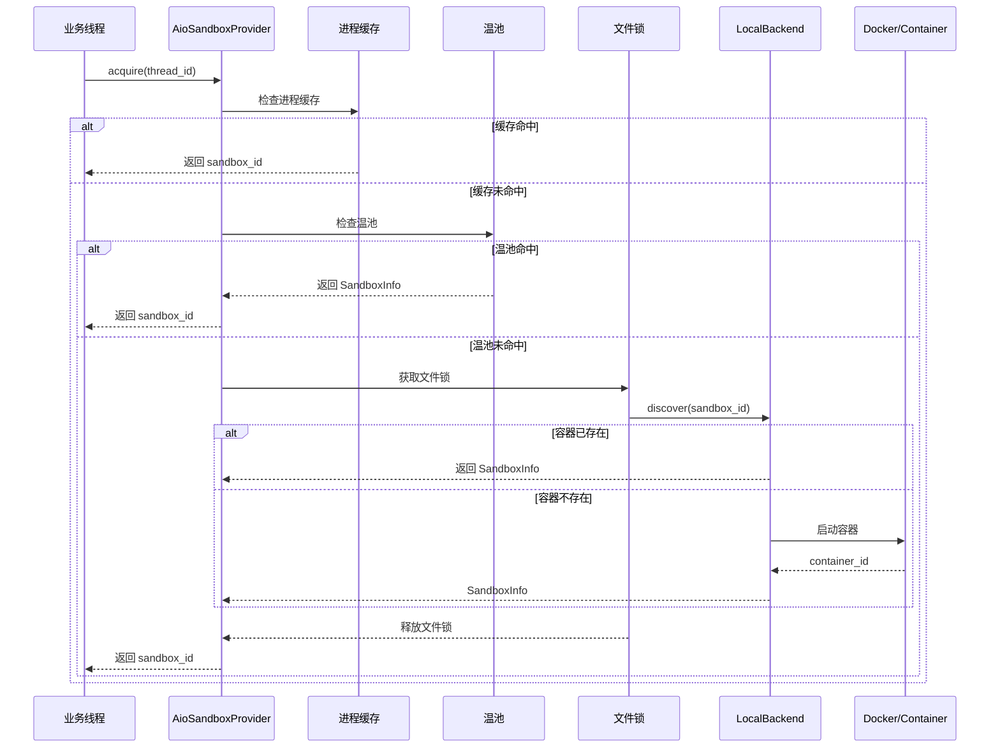
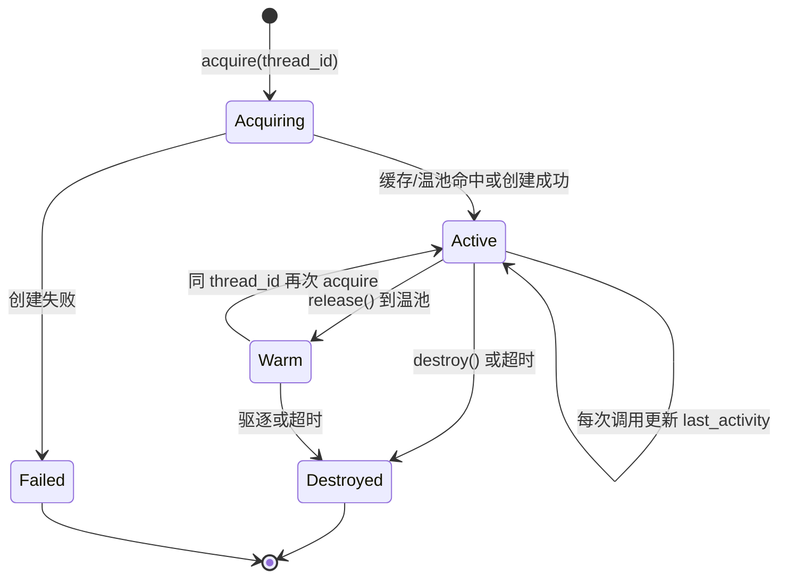
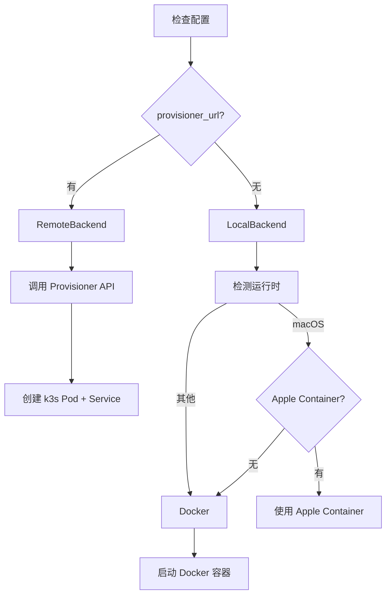

# 【33】AIO 沙箱系统深度解析

## 1. 模块全局定位

- **所属项目**：deer-flow
- **层级位置**：`backend/packages/harness/deerflow/community/aio_sandbox/`
- **核心作用**：提供基于 Docker/Apple Container 的隔离代码执行环境
- **业务价值**：让 AI 能安全执行不可信代码，支持本地和 Kubernetes 部署
- **设计初衷**：解决本地沙箱的安全隔离问题，同时支持远程 provisioner 动态扩容

## 2. 核心设计理念

### 2.1 双后端架构

AIO 沙箱采用**可插拔后端设计**，支持两种部署模式：

```
┌─────────────────────────────────────────────────────────────┐
│                  AioSandboxProvider                         │
├─────────────────────────────────────────────────────────────┤
│                                                              │
│  ┌──────────────────┐         ┌──────────────────────────┐  │
│  │ LocalBackend      │         │ RemoteBackend           │  │
│  │ (Docker/Container)│         │ (Provisioner + k3s)     │  │
│  └──────────────────┘         └──────────────────────────┘  │
│         │                              │                     │
│         │ 本地容器管理                │ K8s Pod 管理        │
│         │ 端口自动分配                │ NodePort 自动分配  │
│         │ 跨进程发现                  │ HTTP API 调用      │
└─────────┴──────────────────────────────┴─────────────────────┘
```

**设计思考**：

1. **LocalBackend**：开发环境首选，本地 Docker/Apple Container
2. **RemoteBackend**：生产环境首选，通过 provisioner 动态创建 Pod
3. **统一接口**：`SandboxBackend` 抽象类定义统一生命周期

### 2.2 温池机制

沙箱释放后不立即销毁，而是放入"温池"：

```python
# 活跃沙箱：正在被线程使用
_sandboxes: dict[str, AioSandbox]

# 温池沙箱：容器仍在运行，可快速复用
_warm_pool: dict[str, tuple[SandboxInfo, float]]
```

**设计优势**：

- **快速复用**：同一线程下次请求无需冷启动
- **资源利用**：容器复用减少创建/销毁开销
- **LRU 驱逐**：达到 replicas 限制时驱逐最旧的温池沙箱

### 2.3 跨进程一致性

通过**确定性 ID + 文件锁**实现多进程协调：

```python
def _deterministic_sandbox_id(thread_id: str) -> str:
    """从 thread_id 生成确定性沙箱 ID"""
    return hashlib.sha256(thread_id.encode()).hexdigest()[:8]
```

**设计考量**：

- 所有进程对同一 thread_id 生成相同的 sandbox_id
- 文件锁确保只有一个进程创建容器
- 其他进程通过 `discover()` 找到已存在的容器

### 2.4 空闲超时管理

后台线程定期清理空闲沙箱：

```python
def _idle_checker_loop(self):
    while not self._idle_checker_stop.wait(timeout=60):
        self._cleanup_idle_sandboxes(idle_timeout)
```

**清理策略**：

- 活跃沙箱：超过 `idle_timeout` 未活动 → 销毁
- 温池沙箱：超过 `idle_timeout` 未使用 → 销毁
- 默认超时：600 秒（10 分钟）

## 3. 架构原理图

### 3.1 沙箱获取流程



**设计解读**：

1. **三层缓存**：进程缓存 → 温池 → 后端发现/创建
2. **文件锁串行化**：防止多进程同时创建同名容器
3. **确定性 ID**：所有进程推导相同的容器名

### 3.2 沙箱生命周期



**设计解读**：

- **Acquiring**：尝试获取沙箱的三层路径
- **Active**：沙箱正在被使用，每次调用更新活动时间
- **Warm**：沙箱释放到温池，容器仍在运行
- **Destroyed**：沙箱被销毁，容器停止

### 3.3 后端选择逻辑



**设计解读**：

1. **provisioner_url 存在** → 远程模式，适合 K8s 部署
2. **provisioner_url 不存在** → 本地模式，开发环境首选
3. **macOS 特殊处理**：优先使用 Apple Container（性能更好）

## 4. 核心源码解析

### 4.1 AioSandboxProvider 初始化

**文件**：`community/aio_sandbox/aio_sandbox_provider.py`

```python
# 行 92-117: 初始化与配置加载
def __init__(self):
    # 线程安全锁
    self._lock = threading.Lock()
    
    # 三层数据结构
    self._sandboxes: dict[str, AioSandbox] = {}       # 活跃沙箱
    self._sandbox_infos: dict[str, SandboxInfo] = {}   # 元数据（用于销毁）
    self._thread_sandboxes: dict[str, str] = {}        # thread_id → sandbox_id
    self._thread_locks: dict[str, threading.Lock] = {}  # 进程内锁
    self._last_activity: dict[str, float] = {}         # 最后活动时间
    
    # 温池：释放但仍在运行的沙箱
    self._warm_pool: dict[str, tuple[SandboxInfo, float]] = {}
    
    # 空闲检查
    self._shutdown_called = False
    self._idle_checker_stop = threading.Event()
    
    # 加载配置并创建后端
    self._config = self._load_config()
    self._backend: SandboxBackend = self._create_backend()
    
    # 注册清理和信号处理
    atexit.register(self.shutdown)
    self._register_signal_handlers()
    
    # 启动空闲检查线程
    if self._config.get("idle_timeout", DEFAULT_IDLE_TIMEOUT) > 0:
        self._start_idle_checker()
```

**设计分析**：

1. **多层数据结构**：每个字典服务于特定目的，避免混合
2. **线程安全**：所有共享状态访问都通过 `_lock` 保护
3. **优雅关闭**：`atexit` + 信号处理确保资源释放

### 4.2 后端选择

**文件**：`community/aio_sandbox/aio_sandbox_provider.py`

```python
# 行 121-142: 后端创建逻辑
def _create_backend(self) -> SandboxBackend:
    """根据配置选择后端"""
    provisioner_url = self._config.get("provisioner_url")
    if provisioner_url:
        logger.info(f"Using remote sandbox backend with provisioner at {provisioner_url}")
        return RemoteSandboxBackend(provisioner_url=provisioner_url)
    
    logger.info("Using local container sandbox backend")
    return LocalContainerBackend(
        image=self._config["image"],
        base_port=self._config["port"],
        container_prefix=self._config["container_prefix"],
        config_mounts=self._config["mounts"],
        environment=self._config["environment"],
    )
```

**设计分析**：

- **单一职责**：后端只负责容器生命周期，不涉及缓存/调度
- **配置驱动**：通过 `provisioner_url` 一键切换本地/远程模式
- **扩展性**：未来可添加新的后端实现（如 Podman、Nomad）

### 4.3 三层获取逻辑

**文件**：`community/aio_sandbox/aio_sandbox_provider.py`

```python
# 行 375-418: 内部获取逻辑
def _acquire_internal(self, thread_id: str | None) -> str:
    """两层缓存 + 后端发现"""
    
    # ── Layer 1: 进程缓存（最快路径）──
    if thread_id:
        with self._lock:
            if thread_id in self._thread_sandboxes:
                existing_id = self._thread_sandboxes[thread_id]
                if existing_id in self._sandboxes:
                    logger.info(f"Reusing in-process sandbox {existing_id}")
                    self._last_activity[existing_id] = time.time()
                    return existing_id
                else:
                    del self._thread_sandboxes[thread_id]
    
    # 生成确定性 ID
    sandbox_id = self._deterministic_sandbox_id(thread_id) if thread_id else str(uuid.uuid4())[:8]
    
    # ── Layer 1.5: 温池（容器仍在运行）──
    if thread_id:
        with self._lock:
            if sandbox_id in self._warm_pool:
                info, _ = self._warm_pool.pop(sandbox_id)
                sandbox = AioSandbox(id=sandbox_id, base_url=info.sandbox_url)
                self._sandboxes[sandbox_id] = sandbox
                self._sandbox_infos[sandbox_id] = info
                self._last_activity[sandbox_id] = time.time()
                self._thread_sandboxes[thread_id] = sandbox_id
                logger.info(f"Reclaimed warm-pool sandbox {sandbox_id}")
                return sandbox_id
    
    # ── Layer 2: 后端发现 + 创建（文件锁保护）──
    if thread_id:
        return self._discover_or_create_with_lock(thread_id, sandbox_id)
    
    return self._create_sandbox(thread_id, sandbox_id)
```

**设计分析**：

1. **Layer 1 进程缓存**：同进程内重复访问，无锁快速路径
2. **Layer 1.5 温池**：跨请求复用容器，避免冷启动
3. **Layer 2 后端**：跨进程协调，确保一致性

### 4.4 跨进程文件锁

**文件**：`community/aio_sandbox/aio_sandbox_provider.py`

```python
# 行 420-469: 文件锁保护的发现/创建
def _discover_or_create_with_lock(self, thread_id: str, sandbox_id: str) -> str:
    """在文件锁保护下发现或创建沙箱"""
    
    paths = get_paths()
    lock_path = paths.thread_dir(thread_id) / f"{sandbox_id}.lock"
    
    with open(lock_path, "a", encoding="utf-8") as lock_file:
        locked = False
        try:
            _lock_file_exclusive(lock_file)
            locked = True
            
            # 重新检查进程缓存和温池（可能在等待锁时变化）
            with self._lock:
                if thread_id in self._thread_sandboxes:
                    existing_id = self._thread_sandboxes[thread_id]
                    if existing_id in self._sandboxes:
                        return existing_id
                if sandbox_id in self._warm_pool:
                    info, _ = self._warm_pool.pop(sandbox_id)
                    sandbox = AioSandbox(id=sandbox_id, base_url=info.sandbox_url)
                    self._sandboxes[sandbox_id] = sandbox
                    self._sandbox_infos[sandbox_id] = info
                    self._last_activity[sandbox_id] = time.time()
                    self._thread_sandboxes[thread_id] = sandbox_id
                    return sandbox_id
            
            # 后端发现：其他进程可能已创建容器
            discovered = self._backend.discover(sandbox_id)
            if discovered is not None:
                sandbox = AioSandbox(id=discovered.sandbox_id, base_url=discovered.sandbox_url)
                with self._lock:
                    self._sandboxes[discovered.sandbox_id] = sandbox
                    self._sandbox_infos[discovered.sandbox_id] = discovered
                    self._last_activity[discovered.sandbox_id] = time.time()
                    self._thread_sandboxes[thread_id] = discovered.sandbox_id
                return discovered.sandbox_id
            
            # 创建新沙箱
            return self._create_sandbox(thread_id, sandbox_id)
            
        finally:
            if locked:
                _unlock_file(lock_file)
```

**设计分析**：

1. **双重检查**：获取锁后重新检查缓存，避免重复创建
2. **后端发现**：其他进程可能已创建容器，先发现再创建
3. **异常安全**：`finally` 确保锁一定被释放

### 4.5 本地容器启动

**文件**：`community/aio_sandbox/local_backend.py`

```python
# 行 93-141: 创建容器（带重试）
def create(self, thread_id: str, sandbox_id: str, extra_mounts) -> SandboxInfo:
    container_name = f"{self._container_prefix}-{sandbox_id}"
    
    # 重试循环：Docker 可能拒绝端口（异步释放）
    _next_start = self._base_port
    for _attempt in range(10):
        port = get_free_port(start_port=_next_start)
        try:
            container_id = self._start_container(container_name, port, extra_mounts)
            break
        except RuntimeError as exc:
            release_port(port)
            err = str(exc).lower()
            
            # 端口已被占用：跳过该端口
            if "port is already allocated" in err or "address already in use" in err:
                logger.warning(f"Port {port} rejected, retrying")
                _next_start = port + 1
                continue
            
            # 容器名冲突：其他进程已创建，尝试发现
            if "is already in use by container" in err or "conflict" in err:
                logger.warning(f"Container name conflict, discovering")
                existing = self.discover(sandbox_id)
                if existing is not None:
                    return existing
            raise
    else:
        raise RuntimeError("Could not start sandbox: all ports allocated")
    
    sandbox_host = os.environ.get("DEER_FLOW_SANDBOX_HOST", "localhost")
    return SandboxInfo(
        sandbox_id=sandbox_id,
        sandbox_url=f"http://{sandbox_host}:{port}",
        container_name=container_name,
        container_id=container_id,
    )
```

**设计分析**：

1. **端口重试**：Docker 端口释放异步，需要重试机制
2. **名冲突处理**：检测到名冲突时尝试发现而非失败
3. **DooD 兼容**：通过 `DEER_FLOW_SANDBOX_HOST` 环境变量支持

### 4.6 远程后端实现

**文件**：`community/aio_sandbox/remote_backend.py`

```python
# 行 89-109: Provisioner API 调用
def _provisioner_create(self, thread_id: str, sandbox_id: str, extra_mounts) -> SandboxInfo:
    """POST /api/sandboxes → 创建 Pod + Service"""
    try:
        resp = requests.post(
            f"{self._provisioner_url}/api/sandboxes",
            json={
                "sandbox_id": sandbox_id,
                "thread_id": thread_id,
            },
            timeout=30,
        )
        resp.raise_for_status()
        data = resp.json()
        logger.info(f"Provisioner created sandbox {sandbox_id}")
        return SandboxInfo(
            sandbox_id=sandbox_id,
            sandbox_url=data["sandbox_url"],
        )
    except requests.RequestException as exc:
        logger.error(f"Provisioner create failed: {exc}")
        raise RuntimeError(f"Provisioner create failed: {exc}") from exc
```

**设计分析**：

1. **HTTP 客户端**：轻量级实现，只调用 Provisioner API
2. **错误处理**：统一转换为 `RuntimeError`
3. **超时设置**：30 秒创建超时，避免无限等待

### 4.7 AioSandbox 实现

**文件**：`community/aio_sandbox/aio_sandbox.py`

```python
# 行 11-58: AioSandbox 核心实现
class AioSandbox(Sandbox):
    """使用 agent-infra/sandbox Docker 容器的沙箱实现"""
    
    def __init__(self, id: str, base_url: str, home_dir: str | None = None):
        super().__init__(id)
        self._base_url = base_url
        self._client = AioSandboxClient(base_url=base_url, timeout=600)
        self._home_dir = home_dir
    
    def execute_command(self, command: str) -> str:
        """执行命令"""
        try:
            result = self._client.shell.exec_command(command=command)
            output = result.data.output if result.data else ""
            return output if output else "(no output)"
        except Exception as e:
            logger.error(f"Failed to execute command: {e}")
            return f"Error: {e}"
    
    def read_file(self, path: str) -> str:
        """读取文件"""
        try:
            result = self._client.file.read_file(file=path)
            return result.data.content if result.data else ""
        except Exception as e:
            logger.error(f"Failed to read file: {e}")
            return f"Error: {e}"
    
    def write_file(self, path: str, content: str, append: bool = False) -> None:
        """写入文件"""
        try:
            if append:
                existing = self.read_file(path)
                if not existing.startswith("Error:"):
                    content = existing + content
            self._client.file.write_file(file=path, content=content)
        except Exception as e:
            logger.error(f"Failed to write file: {e}")
            raise
```

**设计分析**：

1. **SDK 封装**：基于 `agent_sandbox` SDK 实现
2. **错误友好**：返回错误消息而非抛异常
3. **追加模式**：支持内容追加，便于文件操作

## 5. 设计思想解读（占比≥20%）

### 5.1 为什么需要温池机制？

**问题背景**：

1. **冷启动成本高**：Docker 容器启动需要 2-5 秒
2. **线程复用模式**：同一 thread_id 的多次请求应该复用沙箱
3. **资源限制**：不能无限创建容器（replicas 限制）

**温池设计**：

```python
# 释放时放入温池
def release(self, sandbox_id: str):
    with self._lock:
        self._sandboxes.pop(sandbox_id, None)
        info = self._sandbox_infos.pop(sandbox_id, None)
        # 容器仍在运行，放入温池
        if info and sandbox_id not in self._warm_pool:
            self._warm_pool[sandbox_id] = (info, time.time())
```

**设计优势**：

- **快速复用**：下次请求直接从温池恢复，无需冷启动
- **LRU 驱逐**：达到 replicas 限制时驱逐最旧的温池沙箱
- **资源平衡**：活跃沙箱永不驱逐，温池沙箱优先回收

**设计取舍**：

- **优点**：显著降低冷启动延迟
- **缺点**：占用更多资源（容器持续运行）
- **权衡**：默认 replicas=3，平衡性能与资源

### 5.2 为什么用文件锁而非进程锁？

**问题背景**：

1. **多进程架构**：Gateway + LangGraph Server 可能是多进程
2. **无共享内存**：进程间无法使用 `threading.Lock`
3. **容器名冲突**：两个进程同时创建同名容器会失败

**文件锁设计**：

```python
lock_path = paths.thread_dir(thread_id) / f"{sandbox_id}.lock"

with open(lock_path, "a") as lock_file:
    _lock_file_exclusive(lock_file)
    # 临界区：发现或创建容器
    _unlock_file(lock_file)
```

**设计优势**：

- **跨进程**：文件锁在操作系统级别生效
- **自动释放**：进程结束时文件描述符关闭，锁自动释放
- **死锁预防**：超时机制（虽然当前未实现）

**设计挑战**：

- **Windows 兼容**：使用 `msvcrt.locking` 替代 `fcntl`
- **锁文件清理**：进程崩溃时可能遗留锁文件
- **性能开销**：文件锁比进程锁慢

### 5.3 为什么需要确定性 ID？

**问题背景**：

1. **跨进程发现**：进程 A 创建的容器，进程 B 需要找到它
2. **无共享状态**：不能通过内存共享容器 ID
3. **容器命名约定**：Docker 容器名是唯一的标识符

**确定性 ID 设计**：

```python
def _deterministic_sandbox_id(thread_id: str) -> str:
    """从 thread_id 生成确定性沙箱 ID"""
    return hashlib.sha256(thread_id.encode()).hexdigest()[:8]
```

**设计优势**：

- **无状态**：所有进程独立推导相同的 sandbox_id
- **可预测**：容器名格式 `{prefix}-{sandbox_id}`
- **可发现**：通过容器名反向查找

**设计挑战**：

- **哈希冲突**：SHA256 前 8 位，冲突概率极低但非零
- **thread_id 变化**：thread_id 变化会导致新容器创建
- **清理问题**：旧的 thread_id 对应的容器需要清理

### 5.4 为什么分离 LocalBackend 和 RemoteBackend？

**问题背景**：

1. **部署环境差异**：开发用本地 Docker，生产用 K8s
2. **API 差异**：本地用 Docker CLI，远程用 HTTP API
3. **生命周期差异**：本地自己管理容器，远程委托给 provisioner

**后端分离设计**：

```python
class SandboxBackend(ABC):
    @abstractmethod
    def create(self, thread_id, sandbox_id, extra_mounts) -> SandboxInfo: ...
    @abstractmethod
    def destroy(self, info) -> None: ...
    @abstractmethod
    def is_alive(self, info) -> bool: ...
    @abstractmethod
    def discover(self, sandbox_id) -> SandboxInfo | None: ...
```

**设计优势**：

- **单一职责**：每个后端只关注一种部署方式
- **易于测试**：可以 mock 后端进行单元测试
- **扩展性**：未来可添加新的后端（如 Podman、Nomad）

**设计挑战**：

- **接口设计**：需要平衡不同后端的能力差异
- **错误统一**：不同后端的错误类型需要统一处理
- **配置复杂**：每种后端有不同的配置参数

## 6. 可复用代码片段

### 6.1 文件锁模板

```python
import fcntl
import msvcrt  # Windows

def _lock_file_exclusive(lock_file) -> None:
    """跨平台文件排他锁"""
    if fcntl is not None:
        fcntl.flock(lock_file, fcntl.LOCK_EX)
        return
    
    lock_file.seek(0)
    msvcrt.locking(lock_file.fileno(), msvcrt.LK_LOCK, 1)

def _unlock_file(lock_file) -> None:
    """跨平台文件锁释放"""
    if fcntl is not None:
        fcntl.flock(lock_file, fcntl.LOCK_UN)
        return
    
    lock_file.seek(0)
    msvcrt.locking(lock_file.fileno(), msvcrt.LK_UNLCK, 1)

# 使用示例
with open("file.lock", "a") as lock_file:
    _lock_file_exclusive(lock_file)
    try:
        # 临界区代码
        pass
    finally:
        _unlock_file(lock_file)
```

### 6.2 确定性 ID 生成

```python
import hashlib

def deterministic_id(input_str: str, length: int = 8) -> str:
    """从字符串生成确定性 ID
    
    Args:
        input_str: 输入字符串
        length: 输出长度（默认 8 位）
    
    Returns:
        十六进制 ID
    """
    return hashlib.sha256(input_str.encode()).hexdigest()[:length]

# 示例
sandbox_id = deterministic_id("thread-123")
# 输出: "a1b2c3d4"
```

### 6.3 温池 LRU 驱逐

```python
import time
from threading import Lock
from typing import Any, Dict, Tuple

class WarmPool:
    """温池实现，带 LRU 驱逐"""
    
    def __init__(self, max_size: int = 3):
        self._pool: Dict[str, Tuple[Any, float]] = {}
        self._max_size = max_size
        self._lock = Lock()
    
    def add(self, key: str, value: Any) -> None:
        """添加到温池"""
        with self._lock:
            # 超过限制，驱逐最旧的
            if len(self._pool) >= self._max_size:
                oldest_key = min(self._pool, key=lambda k: self._pool[k][1])
                del self._pool[oldest_key]
            self._pool[key] = (value, time.time())
    
    def get(self, key: str) -> Any | None:
        """从温池获取"""
        with self._lock:
            if key in self._pool:
                value, _ = self._pool.pop(key)
                return value
        return None
    
    def evict_oldest(self) -> str | None:
        """驱逐最旧的项"""
        with self._lock:
            if not self._pool:
                return None
            oldest_key = min(self._pool, key=lambda k: self._pool[k][1])
            value, _ = self._pool.pop(oldest_key)
            return oldest_key
```

### 6.4 Docker 端口重试启动

```python
import subprocess
from deerflow.utils.network import get_free_port, release_port

def start_container_with_retry(
    image: str,
    name: str,
    base_port: int = 8080,
    max_retries: int = 10
) -> tuple[str, int]:
    """启动容器，端口冲突时自动重试
    
    Returns:
        (container_id, port)
    """
    _next_port = base_port
    
    for attempt in range(max_retries):
        port = get_free_port(start_port=_next_port)
        try:
            cmd = ["docker", "run", "-d", "-p", f"{port}:8080", "--name", name, image]
            result = subprocess.run(cmd, capture_output=True, text=True, check=True)
            return result.stdout.strip(), port
        except subprocess.CalledProcessError as e:
            release_port(port)
            if "port is already allocated" in str(e).lower():
                _next_port = port + 1
                continue
            raise
    
    raise RuntimeError(f"Could not start container after {max_retries} retries")
```

## 7. 踩坑提醒与优化建议

### 7.1 常见陷阱

#### 陷阱1：Docker 端口释放异步

**问题**：`get_free_port()` 检测到端口可用，但 Docker 启动时仍报"端口已分配"

**原因**：Docker 的端口绑定检查与我们的检查存在时间差

**解决方案**：实现重试机制（已在代码中实现）

#### 陷阱2：文件锁未释放

**问题**：进程崩溃时文件锁可能未释放，导致其他进程死锁

**原因**：Python 异常处理不当时 `finally` 未执行

**解决方案**：
```python
try:
    _lock_file_exclusive(lock_file)
    # 临界区
finally:
    if locked:
        _unlock_file(lock_file)  # 确保释放
```

#### 陷阱3：温池沙箱状态不一致

**问题**：温池中的容器可能已被外部销毁，但 Provider 不知道

**原因**：容器被 `docker rm` 强制删除

**解决方案**：使用前检查 `is_alive()`

### 7.2 性能优化建议

#### 优化1：减少空闲检查开销

**当前**：每 60 秒检查一次所有沙箱

**优化**：使用优先队列，按最早空闲时间排序

```python
import heapq

class IdleChecker:
    def __init__(self):
        self._heap = []  # (idle_time, sandbox_id)
        heapq.heapify(self._heap)
    
    def next_idle_time(self) -> float:
        """返回下一个需要检查的时间"""
        if self._heap:
            return self._heap[0][0]
        return float('inf')
    
    def wait_until_next(self):
        """等待到下一个需要检查的时间"""
        next_time = self.next_idle_time()
        now = time.time()
        if next_time <= now:
            return  # 立即检查
        time.sleep(next_time - now)
```

#### 优化2：批量销毁

**当前**：逐个销毁沙箱

**优化**：批量调用 Docker API

```python
def destroy_batch(self, sandbox_ids: list[str]):
    """批量销毁沙箱"""
    container_names = [self._sandbox_infos[sid].container_name 
                        for sid in sandbox_ids if sid in self._sandbox_infos]
    
    # Docker 批量停止
    cmd = ["docker", "stop"] + container_names
    subprocess.run(cmd, capture_output=True)
```

#### 优化3：预分配端口池

**当前**：每次启动时动态分配端口

**优化**：预分配端口池，减少动态分配开销

```python
class PortPool:
    def __init__(self, base_port: int, pool_size: int):
        self._ports = list(range(base_port, base_port + pool_size))
        self._available = set(self._ports)
    
    def acquire(self) -> int:
        if not self._available:
            raise RuntimeError("No ports available")
        port = self._available.pop()
        return port
    
    def release(self, port: int):
        self._available.add(port)
```

### 7.3 扩展建议

#### 建议1：支持 Podman

**目标**：在 Linux 环境使用 Podman 替代 Docker

**实现**：在 `LocalBackend._detect_runtime()` 中添加 Podman 检测

```python
def _detect_runtime(self) -> str:
    # 检查 Podman
    try:
        subprocess.run(["podman", "--version"], check=True, timeout=5)
        logger.info("Detected Podman")
        return "podman"
    except (FileNotFoundError, subprocess.CalledProcessError):
        pass
    
    # 检查 Docker
    try:
        subprocess.run(["docker", "--version"], check=True, timeout=5)
        logger.info("Detected Docker")
        return "docker"
    except (FileNotFoundError, subprocess.CalledProcessError):
        pass
    
    raise RuntimeError("No container runtime found")
```

#### 建议2：支持 Podman 后端

**目标**：Podman 的 rootless 模式更适合开发环境

**实现**：创建 `PodmanBackend` 类，复用 `LocalBackend` 的逻辑

## 8. 相关模块索引

- **与 09-沙箱系统 的关系**：AioSandboxProvider 是 SandboxProvider 的一种实现
- **与 10-社区集成系统 的关系**：AIO 沙箱是社区工具的一部分
- **与 01-配置系统 的关系**：sandbox 配置控制后端选择

## 9. 参考资料链接

- **agent-infra/sandbox**: https://github.com/agent-infra/sandbox
- **Docker API**: https://docs.docker.com/engine/api/
- **DeerFlow 源码**: `/data/deer-flow-main/backend/packages/harness/deerflow/community/aio_sandbox/`

---

**【33-AIO 沙箱系统深度解析】完成**

本文档深入解析了 DeerFlow 的 AIO 沙箱系统，从双后端架构到温池机制，从文件锁协调到确定性 ID 设计，全面展示了如何实现一个高性能、跨进程一致的沙箱管理系统。核心设计理念是"三层缓存 + 文件锁协调"，通过进程缓存、温池、后端发现三层机制，实现了快速响应与资源利用的最佳平衡。
