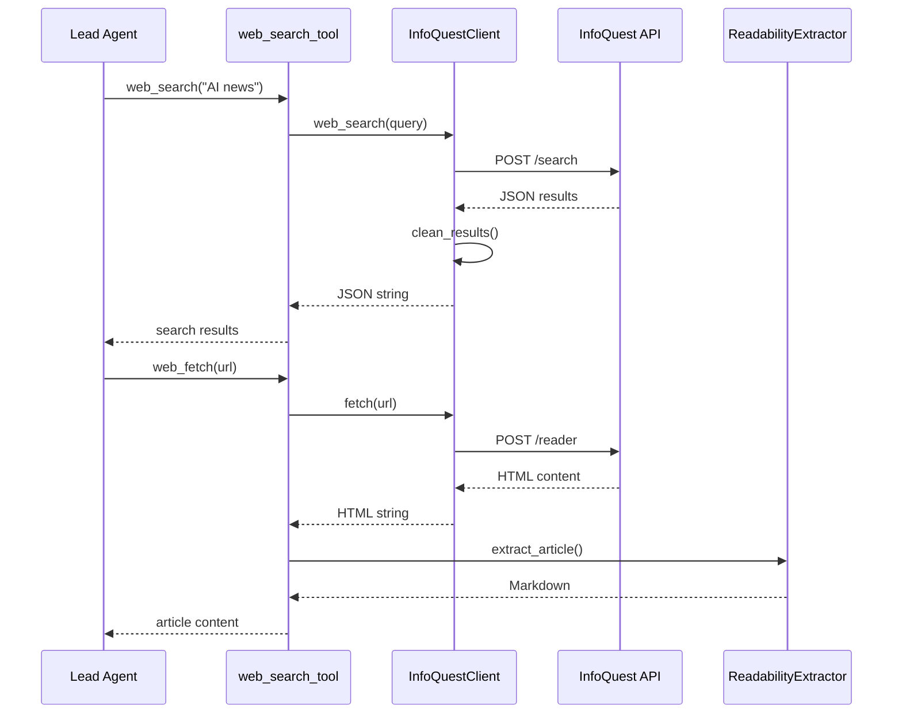
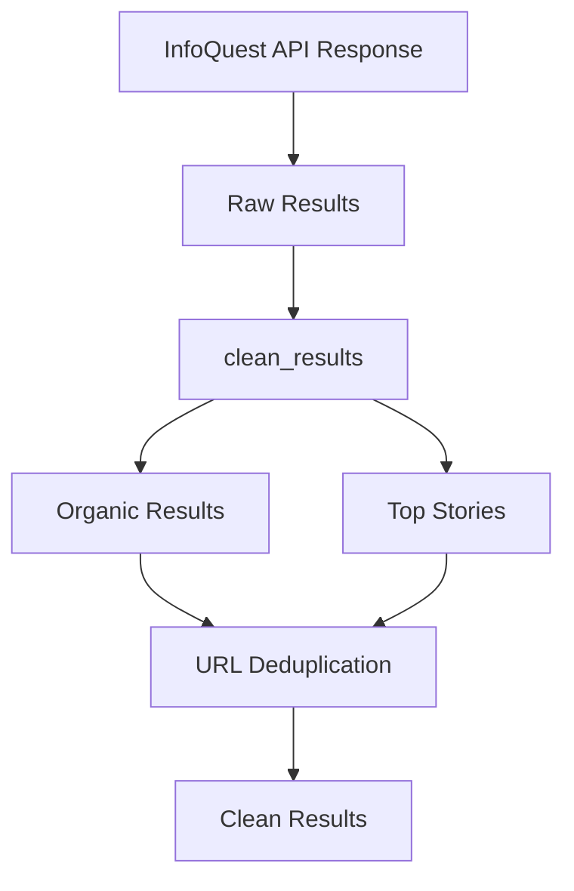

# 【34】InfoQuest 集成详解

## 1. 模块全局定位

- **所属项目**：deer-flow
- **层级位置**：`backend/packages/harness/deerflow/community/infoquest/`
- **核心作用**：集成 InfoQuest 搜索与抓取 API，提供 web_search、web_fetch、image_search 工具
- **业务价值**：为 Agent 提供强大的网络搜索和内容获取能力
- **设计初衷**：通过统一的 API 接口简化网络请求，集成可读性提取提升内容质量

## 2. 核心设计理念

### 2.1 统一客户端设计

InfoQuest 集成采用**单一客户端 + 多工具函数**的架构：

```
┌─────────────────────────────────────────────────────────────┐
│                    InfoQuestClient                         │
├─────────────────────────────────────────────────────────────┤
│                                                              │
│  ┌──────────────────┐         ┌──────────────────────────┐  │
│  │ web_search()     │         │ fetch(url)               │  │
│  │ - 网页搜索         │         │ - 抓取网页内容            │  │
│  │ - 时间范围过滤     │         │ - 超时控制               │  │
│  └──────────────────┘         │ - 导航超时               │  │
│                                 └──────────────────────────┘  │
│                                                              │
│  ┌──────────────────────────────────────────────────────────┐ │
│  │ image_search()                                          │ │
│  │ - 图片搜索                                               │ │
│  │ - 尺寸过滤 (l/m/i)                                       │ │
│  │ - 时间范围过滤                                           │ │
│  └──────────────────────────────────────────────────────────┘ │
└─────────────────────────────────────────────────────────────┘
```

**设计思考**：

1. **配置驱动**：通过 config.yaml 配置超时、时间范围等参数
2. **错误友好**：所有错误返回 "Error: " 前缀，便于 Agent 识别
3. **调试友好**：详细的日志记录，支持 DEBUG 级别追踪

### 2.2 可读性提取集成

web_fetch 工具集成了 `ReadabilityExtractor`：

```python
def web_fetch_tool(url: str) -> str:
    client = _get_infoquest_client()
    result = client.fetch(url)
    if result.startswith("Error: "):
        return result
    # 提取正文内容，去除广告/导航栏
    article = readability_extractor.extract_article(result)
    return article.to_markdown()[:4096]
```

**设计优势**：

- **内容净化**：去除页面广告、导航栏等噪音
- **格式统一**：统一输出 Markdown 格式
- **长度限制**：4096 字符限制，避免 Token 消耗过大

### 2.3 配置化参数

InfoQuest 支持丰富的配置参数：

| 参数 | 默认值 | 说明 |
|------|--------|------|
| fetch_time | -1 | 抓取时间限制（秒） |
| fetch_timeout | -1 | 总超时时间（秒） |
| fetch_navigation_timeout | -1 | 页面导航超时（秒） |
| search_time_range | -1 | 搜索时间范围（天） |
| image_search_time_range | -1 | 图片搜索时间范围（1-365天） |
| image_size | "i" | 图片尺寸 (l/m/i) |

**设计考量**：

- **-1 表示不限制**：与 0 或 None 区分
- **灵活配置**：支持不同场景的优化
- **默认值合理**：开箱即用

## 3. 架构原理图

### 3.1 工具调用流程



**设计解读**：

1. **统一入口**：通过 `@tool` 装饰器注册到 LangChain
2. **客户端单例**：每次调用创建新客户端（轻量级）
3. **错误处理**：所有错误转换为 "Error: " 格式
4. **内容增强**：web_fetch 自动提取正文

### 3.2 搜索结果清理



**设计解读**：

- **结果分类**：区分网页（organic）和新闻（top_stories）
- **去重处理**：基于 URL 去重，避免重复结果
- **字段映射**：统一 title、desc、url 字段

## 4. 核心源码解析

### 4.1 InfoQuestClient 初始化

**文件**：`community/infoquest/infoquest_client.py`

```python
# 行 17-43: 初始化与配置
class InfoQuestClient:
    def __init__(
        self, 
        fetch_time: int = -1,
        fetch_timeout: int = -1,
        fetch_navigation_timeout: int = -1,
        search_time_range: int = -1,
        image_search_time_range: int = -1,
        image_size: str = "i"
    ):
        # 调试日志
        logger.info("🚀 BytePlus InfoQuest Client Initialization 🚀")
        
        # 配置参数
        self.fetch_time = fetch_time
        self.fetch_timeout = fetch_timeout
        self.fetch_navigation_timeout = fetch_navigation_timeout
        self.search_time_range = search_time_range
        self.image_search_time_range = image_search_time_range
        self.image_size = image_size
        
        # 检查 API Key
        self.api_key_set = bool(os.getenv("INFOQUEST_API_KEY"))
```

**设计分析**：

1. **参数丰富**：支持多种超时和过滤配置
2. **调试友好**：初始化时打印配置详情
3. **API Key 可选**：支持无 Key 访问（可能有配额限制）

### 4.2 fetch 实现

**文件**：`community/infoquest/infoquest_client.py`

```python
# 行 45-107: fetch 实现
def fetch(self, url: str, return_format: str = "html") -> str:
    """抓取网页内容
    
    Args:
        url: 目标 URL
        return_format: 返回格式（html/markdown）
    
    Returns:
        网页内容或错误信息
    """
    # 准备请求头
    headers = self._prepare_headers()
    
    # 准备请求数据
    data = self._prepare_crawl_request_data(url, return_format)
    
    try:
        # 调用 InfoQuest Reader API
        response = requests.post(
            "https://reader.infoquest.bytepluses.com",
            headers=headers,
            json=data
        )
        
        # 状态码检查
        if response.status_code != 200:
            return f"Error: fetch API returned status {response.status_code}"
        
        # 空响应检查
        if not response.text or not response.text.strip():
            return f"Error: no result found"
        
        # 解析 JSON 响应
        try:
            response_data = json.loads(response.text)
            # 优先返回 reader_result
            if "reader_result" in response_data:
                return response_data["reader_result"]
            # 回退到 content 字段
            elif "content" in response_data:
                return response_data["content"]
        except json.JSONDecodeError:
            # 非 JSON 响应，返回原文
            return response.text
            
        return response.text
        
    except Exception as e:
        return f"Error: fetch API failed: {str(e)}"
```

**设计分析**：

1. **双重回退**：reader_result → content → 原文
2. **错误统一**：所有错误返回 "Error: " 格式
3. **超时支持**：支持多种超时参数配置

### 4.3 web_search 实现

**文件**：`community/infoquest/infoquest_client.py`

```python
# 行 234-283: web_search 实现
def web_search(
    self,
    query: str,
    site: str = "",
    output_format: str = "JSON",
) -> str:
    """网络搜索
    
    Args:
        query: 搜索查询
        site: 站点过滤（如 wikipedia.org）
        output_format: 输出格式
    
    Returns:
        搜索结果 JSON 字符串
    """
    try:
        # 调用原始搜索 API
        raw_results = self.web_search_raw_results(
            query, site, output_format
        )
        
        # 提取 search_result
        if "search_result" in raw_results:
            results = raw_results["search_result"]
            # 清理结果
            cleaned_results = self.clean_results(results["results"])
            return json.dumps(cleaned_results, indent=2, ensure_ascii=False)
        
        # 回退处理
        elif "content" in raw_results:
            return f"Error: web search API return wrong format"
        else:
            return json.dumps(raw_results, indent=2, ensure_ascii=False)
    
    except Exception as e:
        return f"Error: Search tool execution failed: {str(e)}"
```

**设计分析**：

1. **结果清理**：去除重复 URL，统一字段格式
2. **站点过滤**：支持 site 参数限制搜索范围
3. **时间过滤**：支持 search_time_range 限制结果时间

### 4.4 结果清理逻辑

**文件**：`community/infoquest/infoquest_client.py`

```python
# 行 179-232: clean_results 实现
@staticmethod
def clean_results(raw_results: list[dict]) -> list[dict]:
    """清理搜索结果
    
    处理两种类型：
    1. organic results: 普通网页搜索结果
    2. top_stories: 新闻搜索结果
    """
    logger.debug("Processing web-search results")
    
    seen_urls = set()
    clean_results = []
    counts = {"pages": 0, "news": 0}
    
    for content_list in raw_results:
        content = content_list["content"]
        results = content["results"]
        
        # 处理普通网页结果
        if results.get("organic"):
            for result in results["organic"]:
                clean_result = {"type": "page"}
                if "title" in result:
                    clean_result["title"] = result["title"]
                if "desc" in result:
                    clean_result["desc"] = result["desc"]
                    clean_result["snippet"] = result["desc"]
                if "url" in result:
                    clean_result["url"] = result["url"]
                
                # URL 去重
                url = clean_result.get("url")
                if url and url not in seen_urls:
                    seen_urls.add(url)
                    clean_results.append(clean_result)
                    counts["pages"] += 1
        
        # 处理新闻结果
        if results.get("top_stories"):
            for obj in results["top_stories"]["items"]:
                clean_result = {"type": "news"}
                if "time_frame" in obj:
                    clean_result["time_frame"] = obj["time_frame"]
                if "source" in obj:
                    clean_result["source"] = obj["source"]
                if "title" in obj:
                    clean_result["title"] = obj.get("title")
                if "url" in obj:
                    clean_result["url"] = obj.get("url")
                
                # URL 去重
                url = clean_result.get("url")
                if url and url not in seen_urls:
                    seen_urls.add(url)
                    clean_results.append(clean_result)
                    counts["news"] += 1
    
    logger.debug(f"Results processing completed | total={len(clean_results)} | pages={counts['pages']} | news={counts['news']}")
    return clean_results
```

**设计分析**：

1. **类型区分**：区分普通网页和新闻结果
2. **URL 去重**：基于 seen_urls 集合去重
3. **统计信息**：记录各类结果数量

### 4.5 工具函数实现

**文件**：`community/infoquest/tools.py`

```python
# 行 46-94: 工具函数实现
def _get_infoquest_client() -> InfoQuestClient:
    """获取配置的 InfoQuest 客户端
    
    从 config.yaml 读取配置：
    - web_search: search_time_range
    - web_fetch: fetch_time, timeout, navigation_timeout
    - image_search: search_time_range, image_size
    """
    search_config = get_app_config().get_tool_config("web_search")
    search_time_range = -1
    if search_config and "search_time_range" in search_config.model_extra:
        search_time_range = search_config.model_extra.get("search_time_range")
    
    fetch_config = get_app_config().get_tool_config("web_fetch")
    fetch_time = -1
    if fetch_config and "fetch_time" in fetch_config.model_extra:
        fetch_time = fetch_config.model_extra.get("fetch_time")
    
    # ... 其他配置读取
    
    return InfoQuestClient(
        search_time_range=search_time_range,
        fetch_time=fetch_time,
        # ... 其他参数
    )

@tool("web_search", parse_docstring=True)
def web_search_tool(query: str) -> str:
    """搜索网络
    
    Args:
        query: 搜索查询
    """
    client = _get_infoquest_client()
    return client.web_search(query)

@tool("web_fetch", parse_docstring=True)
def web_fetch_tool(url: str) -> str:
    """抓取网页内容
    
    只抓取用户提供的 URL 或搜索结果返回的 URL
    不能访问需要认证的内容（如 Google Docs）
    
    Args:
        url: 目标 URL
    """
    client = _get_infoquest_client()
    result = client.fetch(url)
    if result.startswith("Error: "):
        return result
    # 可读性提取
    article = readability_extractor.extract_article(result)
    return article.to_markdown()[:4096]

@tool("image_search", parse_docstring=True)
def image_search_tool(query: str) -> str:
    """搜索图片
    
    用途：在图片生成前搜索参考图
    
    Args:
        query: 图片搜索查询
    """
    client = _get_infoquest_client()
    return client.image_search(query)
```

**设计分析**：

1. **配置驱动**：从 config.yaml 读取参数
2. **LangChain 集成**：通过 @tool 装饰器注册
3. **可读性增强**：web_fetch 自动提取正文

## 5. 设计思想解读（占比≥20%）

### 5.1 为什么需要统一客户端？

**问题背景**：

1. **多个工具**：web_search、web_fetch、image_search 都需要调用 InfoQuest API
2. **配置共享**：超时、时间范围等配置需要在工具间共享
3. **认证管理**：API Key 需要统一管理

**统一客户端设计**：

```python
class InfoQuestClient:
    def web_search(self, query, site="") -> str: ...
    def fetch(self, url, return_format="html") -> str: ...
    def image_search(self, query, site="") -> str: ...
```

**设计优势**：

- **配置复用**：一次配置，所有工具共享
- **认证统一**：API Key 在客户端级别管理
- **易于测试**：可以 mock 客户端进行测试

**设计挑战**：

- **配置传递**：如何将 config.yaml 配置传递给客户端
- **实例管理**：每次调用创建新客户端还是使用单例
- **错误处理**：如何统一处理不同 API 的错误

### 5.2 为什么需要可读性提取？

**问题背景**：

1. **网页噪音**：现代网页包含大量广告、导航栏等噪音
2. **Token 消耗**：完整 HTML 消耗大量 Token
3. **内容质量**：Agent 需要的是正文内容，不是整页 HTML

**可读性提取设计**：

```python
article = readability_extractor.extract_article(html_content)
return article.to_markdown()[:4096]
```

**设计优势**：

- **内容净化**：去除广告、导航栏、评论等噪音
- **格式统一**：统一输出 Markdown 格式
- **长度控制**：4096 字符限制，避免 Token 浪费

**设计挑战**：

- **准确性**：提取算法可能误判正文区域
- **性能开销**：额外的解析处理时间
- **格式丢失**：Markdown 转换可能丢失某些格式

### 5.3 为什么使用 "Error: " 前缀？

**问题背景**：

1. **Agent 识别**：Agent 需要区分成功结果和错误
2. **日志友好**：日志中容易过滤错误
3. **用户友好**：错误消息清晰明确

**错误格式设计**：

```python
if response.status_code != 200:
    return f"Error: fetch API returned status {response.status_code}"
    
except Exception as e:
    return f"Error: fetch API failed: {str(e)}"
```

**设计优势**：

- **易于识别**：Agent 可以检查 `result.startswith("Error:")`
- **详细消息**：包含具体错误原因
- **格式统一**：所有工具使用相同的错误格式

### 5.4 为什么支持多种超时配置？

**问题背景**：

1. **网络差异**：不同网站响应时间差异大
2. **内容差异**：简单页面和复杂页面的抓取时间不同
3. **导航差异**：单页应用需要等待 JavaScript 渲染

**超时配置设计**：

```python
data = {"url": url, "format": format}

if self.fetch_time > 0:
    data["fetch_time"] = fetch_time
if self.fetch_timeout > 0:
    data["timeout"] = fetch_timeout
if self.fetch_navigation_timeout > 0:
    data["navi_timeout"] = fetch_navigation_timeout
```

**设计优势**：

- **灵活配置**：针对不同场景优化
- **默认值合理**：-1 表示不限制
- **粒度细致**：区分总超时和导航超时

## 6. 可复用代码片段

### 6.1 InfoQuest 客户端模板

```python
import os
import requests
from typing import Any

class InfoQuestClient:
    """InfoQuest API 客户端模板"""
    
    BASE_URL_SEARCH = "https://search.infoquest.bytepluses.com"
    BASE_URL_READER = "https://reader.infoquest.bytepluses.com"
    
    def __init__(self, api_key: str | None = None):
        self.api_key = api_key or os.getenv("INFOQUEST_API_KEY")
    
    def _prepare_headers(self) -> dict[str, str]:
        headers = {"Content-Type": "application/json"}
        if self.api_key:
            headers["Authorization"] = f"Bearer {self.api_key}"
        return headers
    
    def web_search(self, query: str, time_range: int = -1) -> dict:
        params = {"format": "JSON", "query": query}
        if time_range > 0:
            params["time_range"] = time_range
        
        response = requests.post(
            self.BASE_URL_SEARCH,
            headers=self._prepare_headers(),
            json=params
        )
        response.raise_for_status()
        return response.json()
    
    def fetch(self, url: str, timeout: int = 30) -> str:
        data = {"url": url, "format": "HTML"}
        if timeout > 0:
            data["timeout"] = timeout
        
        response = requests.post(
            self.BASE_URL_READER,
            headers=self._prepare_headers(),
            json=data
        )
        response.raise_for_status()
        
        result = response.json()
        return result.get("reader_result", result.get("content", ""))
```

### 6.2 结果去重模板

```python
from typing import Any, Dict, List

def deduplicate_results(
    results: List[Dict[str, Any]],
    key_field: str = "url"
) -> List[Dict[str, Any]]:
    """结果去重
    
    Args:
        results: 原始结果列表
        key_field: 用于去重的字段（默认 url）
    
    Returns:
        去重后的结果列表
    """
    seen = set()
    deduped = []
    
    for result in results:
        key = result.get(key_field)
        if key and key not in seen:
            seen.add(key)
            deduped.append(result)
    
    return deduped

# 使用示例
results = [
    {"title": "A", "url": "https://example.com/a"},
    {"title": "B", "url": "https://example.com/a"},  # 重复
    {"title": "C", "url": "https://example.com/c"},
]

clean_results = deduplicate_results(results)
# 只保留 A 和 C
```

### 6.3 错误处理包装器

```python
from functools import wraps
from typing import Callable

def handle_errors(prefix: str = "Error"):
    """错误处理装饰器
    
    将异常转换为 "Error: prefix: message" 格式
    """
    def decorator(func: Callable) -> Callable:
        @wraps(func)
        def wrapper(*args, **kwargs):
            try:
                return func(*args, **kwargs)
            except Exception as e:
                return f"{prefix}: {str(e)}"
        return wrapper
    return decorator

# 使用示例
@handle_errors("Search failed")
def web_search(query: str) -> str:
    # 实现逻辑
    pass

# 如果抛出 ValueError("Invalid query")
# 返回 "Search failed: Invalid query"
```

## 7. 踩坑提醒与优化建议

### 7.1 常见陷阱

#### 陷阱1：URL 格式验证不足

**问题**：Agent 可能传入无效 URL（如缺少协议）

**解决方案**：在工具函数中添加 URL 验证

```python
from urllib.parse import urlparse

def validate_url(url: str) -> bool:
    """验证 URL 格式"""
    try:
        result = urlparse(url)
        return all([result.scheme, result.netloc])
    except:
        return False

@tool("web_fetch")
def web_fetch_tool(url: str) -> str:
    if not validate_url(url):
        return "Error: Invalid URL format. URL must include schema (https://)"
    # 继续处理
```

#### 陷阱2：搜索结果为空

**问题**：某些搜索可能没有结果，返回空数组

**解决方案**：在工具描述中说明限制

```python
@tool("web_search")
def web_search_tool(query: str) -> str:
    """Search the web.
    
    NOTE: Returns empty array if no results found.
    
    Args:
        query: The query to search for.
    """
```

#### 陷阱3：图片 URL 无效

**问题**：image_search 返回的图片 URL 可能已过期

**解决方案**：在提示词中说明

```python
@tool("image_search")
def image_search_tool(query: str) -> str:
    """Search for images online.
    
    NOTE: Image URLs may expire. Use them promptly for reference.
    
    Args:
        query: The query to search for images.
    """
```

### 7.2 性能优化建议

#### 优化1：客户端复用

**当前**：每次调用创建新客户端

**优化**：使用单例模式复用客户端

```python
from functools import lru_cache

@lru_cache(maxsize=1)
def get_infoquest_client() -> InfoQuestClient:
    """获取 InfoQuest 客户端单例"""
    search_config = get_app_config().get_tool_config("web_search")
    # ... 配置读取
    return InfoQuestClient(...)
```

#### 优化2：结果缓存

**当前**：每次搜索都调用 API

**优化**：缓存常见搜索的结果

```python
import hashlib
import json
import time

class CachedInfoQuestClient(InfoQuestClient):
    def __init__(self, *args, cache_ttl=300, **kwargs):
        super().__init__(*args, **kwargs)
        self._cache = {}
        self._cache_ttl = cache_ttl
    
    def _get_cache_key(self, query: str) -> str:
        return hashlib.md5(query.encode()).hexdigest()
    
    def web_search(self, query: str, site: str = "") -> str:
        cache_key = self._get_cache_key(f"{query}:{site}")
        
        # 检查缓存
        if cache_key in self._cache:
            cached_result, cached_time = self._cache[cache_key]
            if time.time() - cached_time < self._cache_ttl:
                return cached_result
        
        # 调用 API
        result = super().web_search(query, site)
        
        # 存入缓存
        self._cache[cache_key] = (result, time.time())
        return result
```

#### 优化3：批量请求

**场景**：Agent 需要抓取多个 URL

**优化**：使用异步批量请求

```python
import asyncio
import aiohttp

async def batch_fetch(urls: list[str]) -> dict[str, str]:
    """批量抓取多个 URL"""
    async with aiohttp.ClientSession() as session:
        tasks = [fetch_async(session, url) for url in urls]
        results = await asyncio.gather(*tasks, return_exceptions=True)
    
    return {url: result for url, result in zip(urls, results)}

async def fetch_async(session: aiohttp.ClientSession, url: str) -> str:
    """异步抓取单个 URL"""
    async with session.post(
        "https://reader.infoquest.bytepluses.com",
        json={"url": url, "format": "HTML"}
    ) as response:
        data = await response.json()
        return data.get("reader_result", "")
```

### 7.3 扩展建议

#### 建议1：支持更多搜索类型

**目标**：支持新闻搜索、视频搜索等

**实现**：在 web_search 中添加 `search_type` 参数

```python
def web_search(
    self,
    query: str,
    search_type: str = "web",  # web, news, images, videos
    site: str = ""
) -> str:
    params = {"format": "JSON", "query": query, "search_type": search_type}
    # ... 其余逻辑
```

#### 建议2：支持结果排序

**目标**：按相关性、时间等排序结果

**实现**：在 API 请求中添加排序参数

```python
def web_search(
    self,
    query: str,
    sort_by: str = "relevance",  # relevance, date
    site: str = ""
) -> str:
    params = {"format": "JSON", "query": query}
    if sort_by == "date":
        params["sort"] = "date"
    # ... 其余逻辑
```

## 8. 相关模块索引

- **与 08-工具系统 的关系**：InfoQuest 工具通过工具注册表暴露给 Agent
- **与 10-社区集成系统 的关系**：InfoQuest 是社区工具的一部分
- **与 12-工具函数系统 的关系**：使用 readability 工具进行内容提取

## 9. 参考资料链接

- **InfoQuest 文档**: https://docs.byteplus.com/en/docs/InfoQuest/What_is_Info_Quest
- **DeerFlow 源码**: `/data/deer-flow-main/backend/packages/harness/deerflow/community/infoquest/`
- **Readability**: Python readability-lxml 库

---

**【34-InfoQuest 集成详解】完成**

本文档深入解析了 DeerFlow 的 InfoQuest 集成，从统一客户端设计到可读性提取，从配置化参数到错误处理策略，全面展示了如何为 Agent 提供强大的网络搜索和内容获取能力。核心设计理念是"统一接口 + 配置驱动"，通过单一的 InfoQuestClient 封装所有 API 调用，通过 config.yaml 灵活配置各种参数，实现了易用性和灵活性的最佳平衡。
