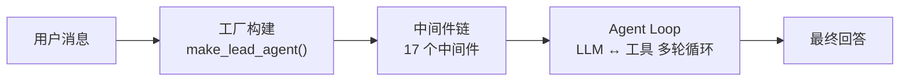
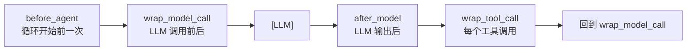
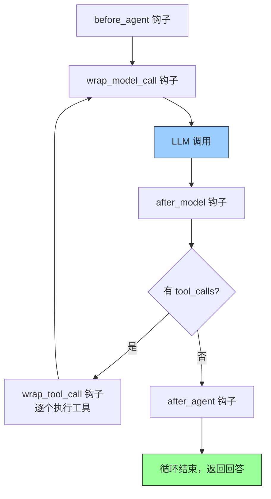
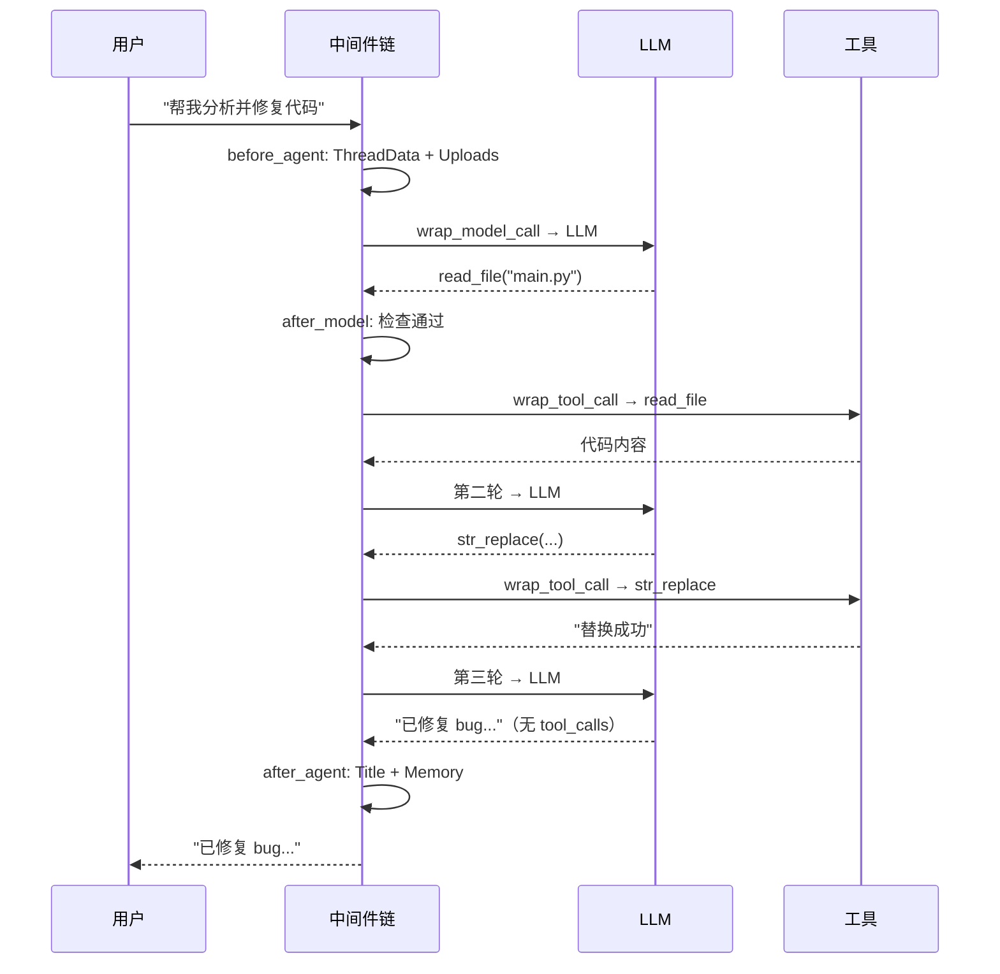

# Agent 请求处理流程

> 来源：`agents/lead_agent/agent.py`、`agents/middlewares/*`

用户消息从进入到回答，经过"工厂构建 → 中间件链 → Agent Loop 多轮循环"三个阶段。



---

## 第一阶段：工厂构建（make_lead_agent）

每次请求调用，从 `config.configurable` 提取 9 个参数，按优先级解析模型，组装 Agent。

```python
create_agent(
    model       = create_chat_model(name, thinking_enabled, reasoning_effort),
    tools       = get_available_tools(model_name, groups, subagent_enabled),
    middleware  = _build_middlewares(config, model_name, agent_name),
    system_prompt = apply_prompt_template(subagent_enabled, max_concurrent, agent_name),
    state_schema = ThreadState,
)
```

模型解析三级优先级：`请求参数 model_name` → `agent_config.model` → `config.yaml models[0]`。启用 thinking 但模型不支持时自动降级关闭。

---

## 第二阶段：中间件链

Agent Loop 单轮中，中间件的四个执行钩子：



17 个中间件按严格顺序排列，每一层假设前面的层已完成工作：

### Base Runtime 中间件

| # | 中间件 | 钩子 | 作用 |
|---|--------|------|------|
| ① | ThreadDataMiddleware | before_agent | 创建线程目录 |
| ② | UploadsMiddleware | before_agent | 注入上传文件 |
| ③ | SandboxMiddleware | before_agent | 懒初始化沙箱 |
| ④ | DanglingToolCallMiddleware | wrap_model_call | 修补缺失 ToolMessage |
| ⑤ | GuardrailMiddleware | wrap_tool_call | 工具调用授权门控 |
| ⑥ | SandboxAuditMiddleware | wrap_tool_call | bash 命令安全审计 |
| ⑦ | ToolErrorHandlingMiddleware | wrap_tool_call | 工具异常兜底 |

### Lead Agent 专属中间件

| # | 中间件 | 条件 | 钩子 | 作用 |
|---|--------|------|------|------|
| ⑧ | SummarizationMiddleware | enabled | wrap_model_call | 接近上限时摘要旧消息 |
| ⑨ | TodoMiddleware | plan_mode | wrap_model_call | 注入 write_todos 提醒 |
| ⑩ | TokenUsageMiddleware | enabled | after_model | 记录 token 用量 |
| ⑪ | TitleMiddleware | 始终 | after_agent | 首次对话生成标题 |
| ⑫ | MemoryMiddleware | 始终 | after_agent | 排队异步记忆更新 |
| ⑬ | ViewImageMiddleware | supports_vision | wrap_model_call | 注入图片 base64 |
| ⑭ | DeferredToolFilterMiddleware | tool_search | wrap_model_call | 隐藏延迟工具 schema |
| ⑮ | SubagentLimitMiddleware | subagent | after_model | 截断超额 task 调用 |
| ⑯ | LoopDetectionMiddleware | 始终 | after_model | 检测循环并中断 |
| ⑰ | ClarificationMiddleware | 始终（最后） | wrap_tool_call | 拦截澄清请求，goto=END |

---

## 第三阶段：Agent Loop



`messages` 列表驱动循环：LLM 输出追加到 messages，工具回复追加到 messages，直到 LLM 不再输出 `tool_calls`。

---

## 时序示例："帮我分析并修复这段代码"



---

## 状态流转（ThreadState）

| 字段 | 类型 | 写入者 | 合并策略 |
|------|------|--------|---------|
| `messages` | `list[BaseMessage]` | LLM + 工具 | append（驱动循环） |
| `sandbox` | `SandboxState` | SandboxMiddleware | 覆盖 |
| `thread_data` | `ThreadDataState` | ThreadDataMiddleware | 覆盖 |
| `title` | `str` | TitleMiddleware | 覆盖 |
| `artifacts` | `list[str]` | present_files 工具 | 去重合并 |
| `todos` | `list` | write_todos 工具 | 覆盖 |
| `uploaded_files` | `list[dict]` | UploadsMiddleware | 覆盖 |
| `viewed_images` | `dict` | ViewImageMiddleware | 字典合并 + 清空 |
