# 从用户消息到 Agent 流式响应——完整链路

## 一句话本质

不是直接 `yield` LLM 输出，而是 **Agent → Bridge → 消费者 → 前端**——中间多了一层解耦转发。这就是企业级架构的关键设计：计算逻辑（run_agent）和输出逻辑（sse_consumer）互不知道对方的存在，靠 asyncio.Queue 做唯一的数据契约。

```
直觉写法（直接 yield）：
  StreamingResponse(agent.astream())          ← 计算和输出绑死在一起

DeerFlow 实际写法（解耦转发）：
  run_agent       → bridge.publish(chunk)    ← 计算只管往队列写
  sse_consumer    → bridge.subscribe()       ← 输出只管从队列读
  两者通过 Queue 解耦，互不阻塞、互不依赖
```

全程同一个线程、同一个 ASGI 事件循环，靠 asyncio 协程调度并发。Queue 不是跨线程管道，而是两个协程之间的**节奏缓冲**——生产者瞬间出 3 个 chunk 时不被慢网络拖住，消费者慢慢推也不让 LLM 等待。

---

## 线程模型——先搞清楚"跑在哪里"

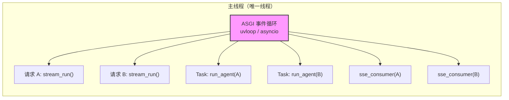

**没有新线程，没有新进程。** `asyncio.create_task(run_agent(...))` 不是 `threading.Thread`——它只是把协程注册到当前事件循环上，和 `sse_consumer` 交替执行。当 `run_agent` 中的 `await agent.astream()` 挂起等待 LLM 响应时，事件循环切出去驱动 `sse_consumer` 从队列读事件。两者是协作式多任务，不是抢占式多线程。

Queue 的作用不是跨线程通信，而是**解耦两个协程的节奏**：`run_agent` 可能瞬间连续 publish 3 个事件（LLM 响应 + 工具调用 + LLM 再次响应），而 `sse_consumer` 的推送受网络延迟影响。Queue 吸收这种速率差，让生产者不被消费者拖慢。

---

## 全链路总览

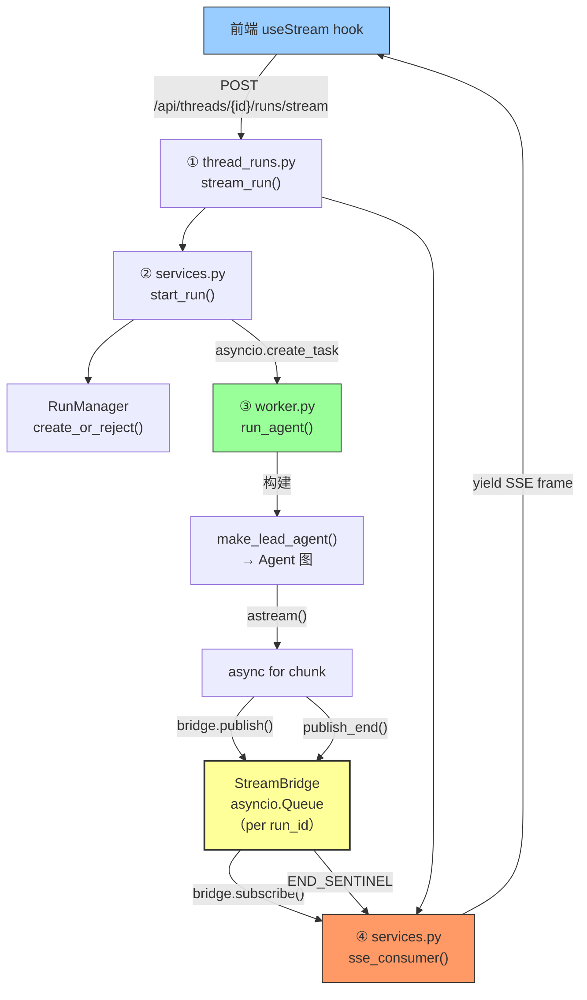

---

## 第一步：请求入口——同时接通生产者和消费者

**文件**: `routers/thread_runs.py:100-123` / `routers/runs.py:34-55`

两个入口，共享同一个 `start_run` + `sse_consumer`：

| 端点 | 特点 |
|------|------|
| `POST /api/threads/{id}/runs/stream` | 已有线程，有状态对话（前端主用） |
| `POST /api/runs/stream` | 无状态，自动创建线程（一次性调用） |

```python
@router.post("/{thread_id}/runs/stream")
async def stream_run(thread_id, body: RunCreateRequest, request: Request):
    bridge = get_stream_bridge(request)       # 从 app.state 取单例
    run_mgr = get_run_manager(request)        # 从 app.state 取单例
    record = await start_run(body, thread_id, request)
    return StreamingResponse(
        sse_consumer(bridge, record, request, run_mgr),
        media_type="text/event-stream",
    )
```

**路由层做了两件事，一件启动生产者，一件启动消费者**：

| 操作 | 调用 | 作用 |
|------|------|------|
| 启动生产者 | `start_run()` → `asyncio.create_task(run_agent(...))` | 注册 Agent 协程到事件循环（还没执行） |
| 启动消费者 | `StreamingResponse(sse_consumer(...))` | 返回 SSE 流，`sse_consumer` 从队列读事件推给前端 |

两者在同一帧内完成——`start_run` 返回后，事件循环上同时挂着 `run_agent`（等调度）和 `sse_consumer`（等队列数据）。**谁先执行取决于事件循环的调度策略**。

---

## 第二步：启动运行（start_run）——准备生产者的原料

**文件**: `services.py:190-263`

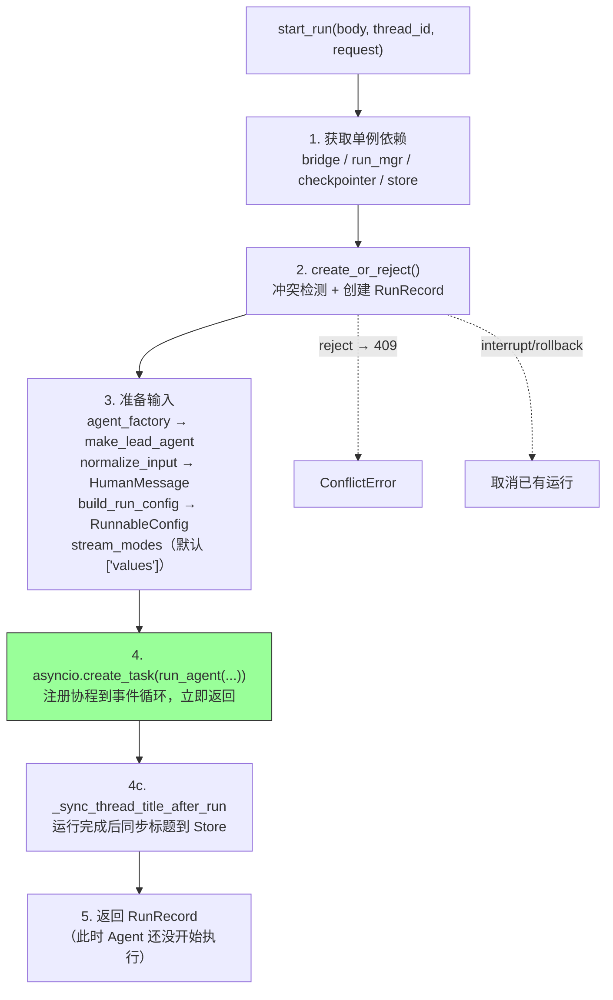

**`asyncio.create_task` 做了什么？** 把 `run_agent` 协程注册到当前事件循环，立即返回 Task 对象。协程不会立刻执行——要等当前 `start_run` 函数 return 之后，事件循环才调度它。此时同一个事件循环上挂着两个协程：`run_agent`（等调度）和 `sse_consumer`（等队列数据）。

---

## 第三步：Agent 执行与 SSE 推送——生产者写什么，消费者读什么

Agent 每一个生命周期阶段都有配对的 publish/subscribe 操作。下面按事件类型逐对展示：

### 3.1 元数据事件——配对

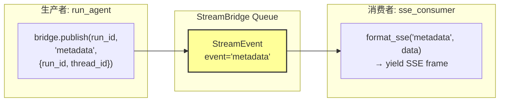

**生产者**（`worker.py:68-76`）：`run_agent` 启动后第一件事——向队列发布 metadata，包含 `run_id` 和 `thread_id`。

**消费者**（`services.py:279-291`）：`sse_consumer` 从 `bridge.subscribe()` 拿到这个 `StreamEvent`，调用 `format_sse()` 格式化后 yield 给前端。

**前端收到的 SSE 帧**：
```
event: metadata
data: {"run_id":"abc","thread_id":"xyz"}
id: 1715600000000-0
```

### 3.2 状态快照事件——配对

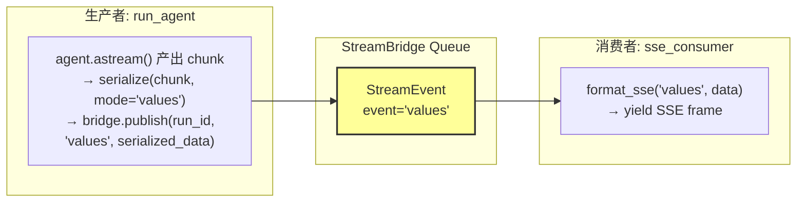

**生产者**（`worker.py:125-133`）：Agent 的核心循环——`async for chunk in agent.astream(...)` 每产出一个 chunk，序列化后 publish 到队列。一个 chunk 可能是一次 LLM 输出、一次工具执行结果、或一次状态快照。

**消费者**（`services.py:291`）：同一个 chunk 被 `sse_consumer` 从队列读出，格式化为 SSE 帧推给前端。

**前端收到的 SSE 帧**：
```
event: values
data: {"messages":[...],"title":"...","artifacts":[...]}
id: 1715600000000-1
```

### 3.3 消息元组事件——配对

当 `stream_modes` 包含 `messages-tuple` 时，LangGraph 映射为 `messages` 模式：

**生产者**（`worker.py:104-105`）：`messages-tuple` 被映射为 LangGraph 的 `messages` 模式，astream 产出 `(message_chunk, metadata)` 元组，序列化后 publish。

**消费者**：同 3.2 的 `sse_consumer` 逻辑，收到后 yield。

**前端收到的 SSE 帧**：
```
event: messages
data: [{"type":"ai","content":"正在分析..."},{}]
id: 1715600000000-2
```

### 3.4 错误事件——配对

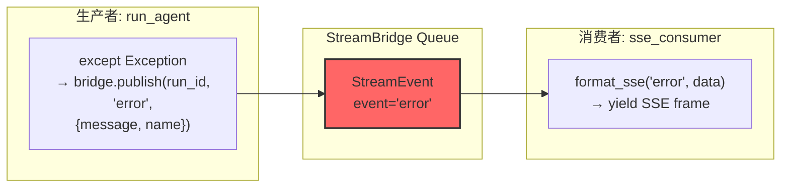

**生产者**（`worker.py:179-190`）：Agent 执行抛异常时，catch 后向队列 publish 一个 error 事件，包含错误消息和异常类型名。

**消费者**：`sse_consumer` 收到后照常格式化 yield 给前端。

### 3.5 结束事件——配对

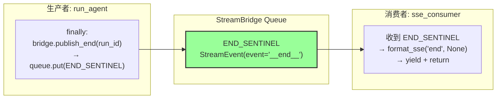

**生产者**（`worker.py:192-194`）：无论成功、中断还是异常，`finally` 块保证调用 `bridge.publish_end(run_id)`，向队列写入 `END_SENTINEL`。随后延迟 60 秒清理队列资源。

**消费者**（`services.py:287-289`）：`sse_consumer` 收到 `END_SENTINEL` 后，yield 最后一个 `event: end` 帧并 return，关闭 SSE 流。

**前端收到的 SSE 帧**：
```
event: end
data: null
id: 1715600000000-3
```

### 3.6 心跳事件——Queue 自动生成，无对应 publish

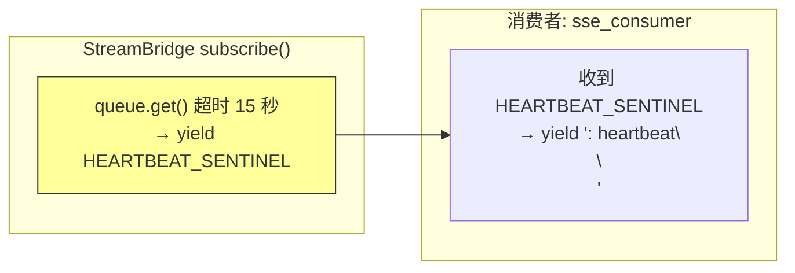

**没有生产者 publish 心跳。** 心跳由 `MemoryStreamBridge.subscribe()` 内部的超时机制自动产生（`memory.py:73-77`）：15 秒内队列无新事件时，`queue.get()` 超时，yield `HEARTBEAT_SENTINEL`。

**消费者**（`services.py:283-285`）：收到心跳信号后 yield SSE 注释帧 `: heartbeat\n\n`，保持 HTTP 连接活跃。

---

## 第四步：StreamBridge——队列的本质

**文件**: `runtime/stream_bridge/base.py` + `memory.py`

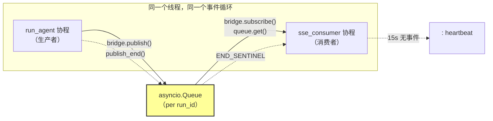

### publish 的内部逻辑（`memory.py:43-50`）

```python
async def publish(self, run_id, event, data):
    queue = self._get_or_create_queue(run_id)
    entry = StreamEvent(id=self._next_id(run_id), event=event, data=data)
    await asyncio.wait_for(queue.put(entry), timeout=30.0)  # 满队列等 30 秒
    # 超时 → 丢弃事件并打 warning（宁可丢一个快照，不阻塞协程）
```

### subscribe 的内部逻辑（`memory.py:60-81`）

```python
async def subscribe(self, run_id, *, heartbeat_interval=15.0):
    queue = self._get_or_create_queue(run_id)
    while True:
        try:
            entry = await asyncio.wait_for(queue.get(), timeout=heartbeat_interval)
        except TimeoutError:
            yield HEARTBEAT_SENTINEL   # 15 秒无事件 → 心跳
            continue
        if entry is END_SENTINEL:
            yield END_SENTINEL
            return                     # 收到结束信号 → 退出迭代
        yield entry                    # 正常事件 → 传递给消费者
```

**队列满时的策略**（`queue_maxsize=256`）：publish 等待 30 秒后丢弃事件并打 warning。宁可丢一个中间快照，也不能让协程互相阻塞。

---

## 第五步：完整时序——生产者和消费者交替执行

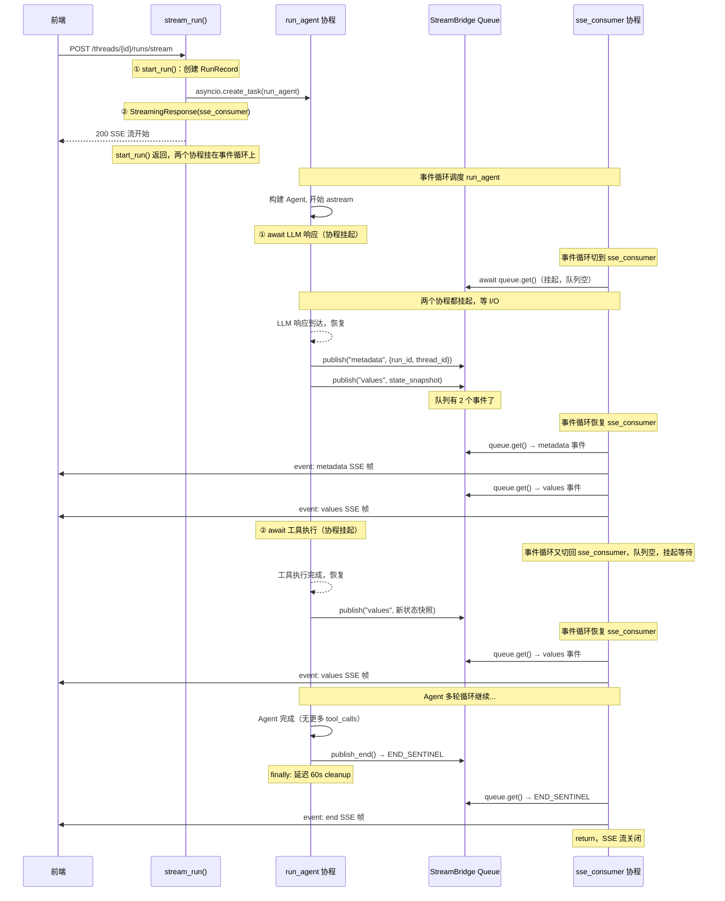

---

## 第六步：取消与断连——两侧如何响应

### 用户主动取消（abort_event）

```
用户点"停止" → RunManager.cancel()
  │
  ├─ 设置 record.abort_event（asyncio.Event）
  │  └─ run_agent 下一次 chunk 循环检测到 → break 退出
  │
  └─ 或直接 task.cancel() → 触发 CancelledError
     └─ run_agent except CancelledError → set_status(interrupted)
     └─ finally → publish_end() → END_SENTINEL → sse_consumer 关闭流
```

**关键**：无论哪种取消方式，`run_agent` 的 `finally` 块保证调用 `publish_end()`。`sse_consumer` 一定会收到 `END_SENTINEL`，干净地关闭 SSE 流。

### 客户端断连

```python
# sse_consumer (services.py:280-296)
try:
    async for entry in bridge.subscribe(record.run_id):
        if await request.is_disconnected():
            break                        # 检测到断连，退出循环
        yield format_sse(...)
finally:
    if record.status in (pending, running):
        if record.on_disconnect == "cancel":
            await run_mgr.cancel(record.run_id)   # 模式 cancel → 终止 Agent
        # 模式 continue → Agent 继续跑，事件丢弃（无人消费）
```

---

## 第七步：RunManager——运行生命周期

**文件**: `runtime/runs/manager.py`

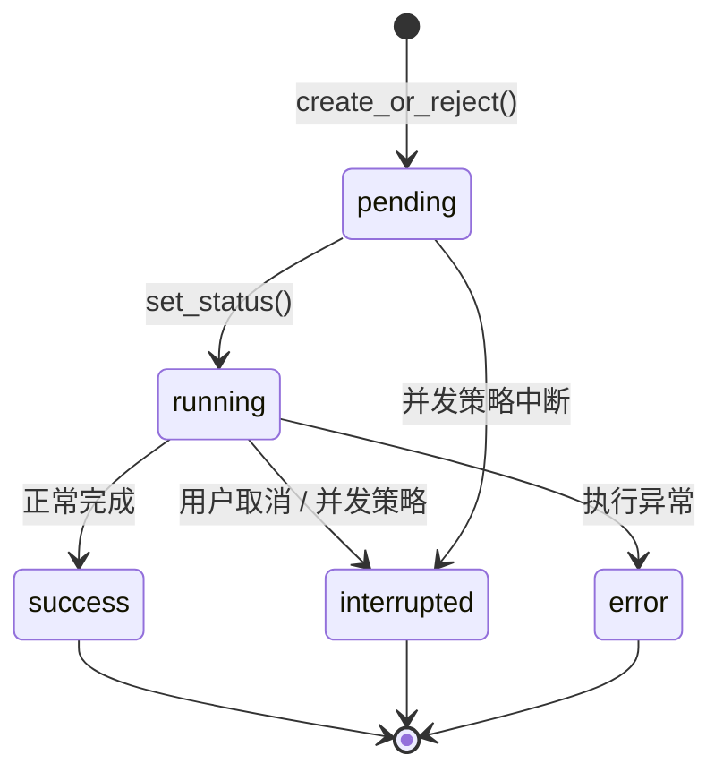

**多任务策略**（`create_or_reject`，asyncio.Lock 保护）：

| 策略 | 同线程已有运行时 | 用例 |
|------|-----------------|------|
| `reject` | 抛 ConflictError (409) | 默认，防止并发冲突 |
| `interrupt` | 取消已有运行，保留检查点 | 用户发新消息打断旧回复 |
| `rollback` | 取消已有运行（检查点回滚为 TODO Phase 2） | 完全撤销 |

---

## 事件类型速查表——每种事件的完整链路

| 事件 | 谁创建（生产者） | 创建位置 | 谁消费 | 消费位置 | SSE 帧格式 |
|------|-----------------|---------|--------|---------|-----------|
| `metadata` | `run_agent` | `worker.py:69` | `sse_consumer` | `services.py:291` | `event: metadata\ndata: {run_id,thread_id}` |
| `values` | `run_agent` | `worker.py:133` | `sse_consumer` | `services.py:291` | `event: values\ndata: {messages,...}` |
| `messages` | `run_agent` | `worker.py:151` | `sse_consumer` | `services.py:291` | `event: messages\ndata: [{type,...}]` |
| `error` | `run_agent` | `worker.py:183` | `sse_consumer` | `services.py:291` | `event: error\ndata: {message,name}` |
| `end` | `run_agent` → `publish_end` | `worker.py:193` | `sse_consumer` | `services.py:288` | `event: end\ndata: null` |
| 心跳 | Queue 超时自动产生 | `memory.py:74` | `sse_consumer` | `services.py:284` | `: heartbeat\n\n` |

---

## 依赖注入——单例的生命周期

**文件**: `deps.py`

```python
@asynccontextmanager
async def langgraph_runtime(app: FastAPI):
    async with AsyncExitStack() as stack:
        app.state.stream_bridge = await stack.enter_async_context(make_stream_bridge())
        app.state.checkpointer = await stack.enter_async_context(make_checkpointer())
        app.state.store = await stack.enter_async_context(make_store())
        app.state.run_manager = RunManager()
        yield
```

| 单例 | 类型 | 作用 |
|------|------|------|
| `stream_bridge` | `MemoryStreamBridge` | 发布-订阅桥（进程级，重启丢失） |
| `checkpointer` | 异步检查点 | 对话状态持久化（数据写磁盘） |
| `store` | SQLite Store | 线程元数据如标题（数据写 SQLite） |
| `run_manager` | `RunManager` | 运行注册表（进程级，重启丢失） |

路由通过 `get_xxx(request)` 从 `request.app.state` 读取，请求间共享同一实例。
